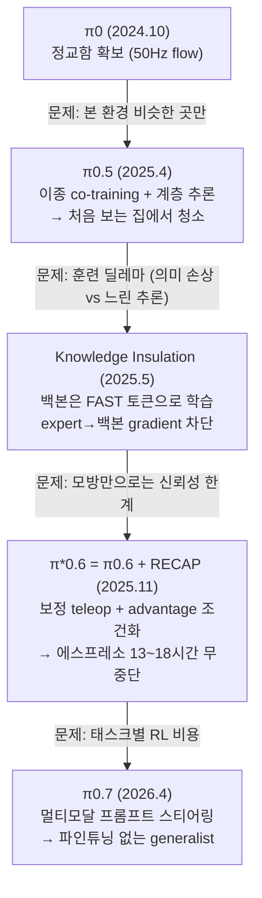
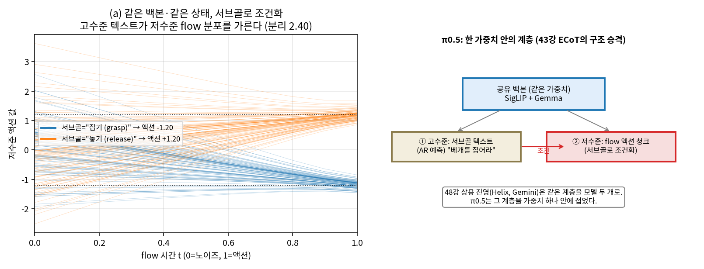
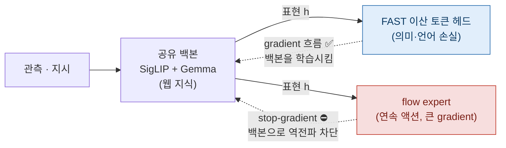
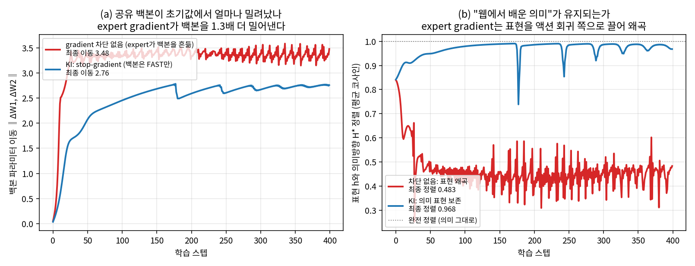
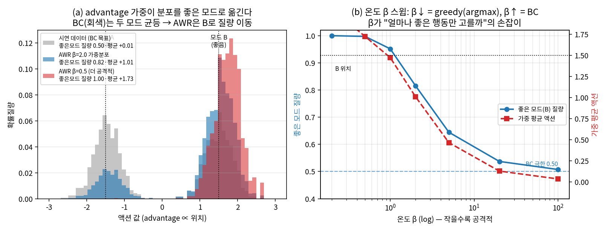

# Lec 45. π 패밀리 II — 일반화, RL, 그리고 스티어러블 generalist

> 선수 지식: 44강(π0/FAST), 37강(DAgger), 41강(advantage, 오프라인 RL 개념). 부록 D의 CS285 L15-16을 봤다면 RECAP이 훨씬 잘 읽힌다.
> 주의: 이 강의의 모델들(π0.6 이후)은 가중치 미공개다. 실습은 π0.5까지만 가능.

## 한 장 요약

각 세대는 이전 세대의 실패 모드를 고친다. 이 체인이 곧 논문 읽기 훈련이다.



## 학습 목표

1. π0.5의 co-training 데이터 구성(~97.6%가 비대상 로봇)과 한-모델 계층 추론(E3)을 설명할 수 있다.
2. Knowledge Insulation이 "훈련은 FAST, 추론은 flow"를 어떻게 동시에 얻는지, stop-gradient가 백본 gradient의 어느 항을 0으로 만드는지(E1) 설명할 수 있다.
3. RECAP의 3단계(시연 → 보정 → 자율 RL)와 advantage 조건화를 41강의 언어로 설명하고, AWR 가중치 $\exp(A/\beta)$와 온도 β의 역할(E2)을 손계산할 수 있다.
4. π0.7의 "스티어링" 주장과 그 검증 포인트를 구분할 수 있다.
5. 세 핵심 아이디어(KI·AWR·계층 추론)를 numpy 토이로 재현해, 백본 이동/표현 왜곡·보상모드 집중·서브골 분리를 수치로 확인할 수 있다.

## 본문

### 1. π0.5 — 처음 보는 집 (2025.4, arXiv 2504.16054)

**문제**: π0는 훈련 환경과 비슷한 곳에서만 강했다. 목표를 극단으로: **한 번도 본 적 없는 집**의 부엌·침실을 모바일 매니퓰레이터가 10~15분짜리 다단계 작업으로 치우기.

**방법 1 — 이종 co-training**: 훈련 데이터의 **~97.6%가 대상 로봇(모바일 매니퓰레이터) 것이 아니다**. 다른 로봇들의 조작 데이터, 웹 비전-언어 데이터, 고수준 서브태스크 예측 데이터를 섞는다. 일반화는 대상 로봇 데이터를 늘려서가 아니라 **주변 데이터의 다양성**에서 왔다는 것이 핵심 발견.

**방법 2 — 한 모델 안의 계층**: 같은 가중치가 먼저 autoregressive로 서브태스크를 텍스트로 예측하고("베개를 집어라"), 그다음 flow expert가 그 서브태스크의 저수준 액션 청크를 낸다. 48강에서 볼 상용 진영(Helix, Gemini)이 **모델 두 개**로 만드는 계층을 **가중치 하나** 안에 접은 형태 — 43강 ECoT의 "생각하고 행동하기"가 구조로 승격된 것.



*그림 1: (a) 같은 백본·같은 상태라도 고수준이 낸 서브골("집기" vs "놓기")로 조건화하면 저수준 flow가 다른 모드로 수렴한다 — numpy flow 토이에서 두 조건의 최종 액션이 −1.20 / +1.20으로 갈린다(분리도 2.40). (b) 이 계층이 가중치 하나 안에 접혀 있다는 것이 π0.5의 구조적 선택. 아래 핵심 수식 E3의 시각화.*

### 2. Knowledge Insulation — 훈련 딜레마의 해소 (2025.5, arXiv 2505.23705)

**딜레마**: flow expert를 붙여 그대로 공동 훈련하면 ① 느리게 수렴하고(44강 표에서 연속 flow 열의 훈련 항목) ② expert의 gradient가 백본을 흔들어 **웹에서 배운 의미 지식이 손상**된다. 그렇다고 FAST 토큰만 쓰면 추론이 느리다.

**해법**: 두 출력을 동시에 두되 gradient 흐름을 비대칭으로 —
- 백본은 **FAST 이산 토큰 예측으로 계속 훈련** (빠른 수렴 + 의미 보존, 언어 능력 유지),
- flow expert도 함께 훈련하되 **expert에서 백본으로 가는 gradient를 차단**한다.



*그림 2: KI의 비대칭 gradient 흐름. 순전파(실선)는 백본→두 헤드로 모두 흐르지만, 역전파(점선)는 FAST 헤드에서만 백본을 학습시키고 flow expert→백본 경로는 stop-gradient로 끊는다. expert 헤드 자신은 계속 학습된다(자기 손실로). 추론 때는 flow expert만 쓴다.*



*그림 3: 공유 백본 2층 numpy 토이에서 stop-gradient의 효과(핵심 수식 E1의 정량판). (a) expert gradient를 차단하지 않으면 백본 파라미터가 초기값에서 1.26배 더 밀려나고(3.48 vs 2.76), 매 스텝 요동친다 — "expert가 백본을 흔든다"의 시각화. (b) 그 흔들림이 표현을 액션 회귀 방향으로 끌어 웹 의미 표현이 손상된다: 표현→의미방향 복원 R²이 차단 없음 0.48로 무너지는 반면, KI는 0.97로 보존된다.*

추론 때는 flow expert만 쓴다. 44강 마지막 질문("훈련은 FAST, 추론은 flow가 동시에 될까?")의 답이 이것이다. 공개된 `pi05_base` 가중치가 KI 방식으로 훈련된 것이라, openpi를 쓰는 순간 이 기술의 수혜자가 된다.

33강의 감각으로 보면: 사전학습 지식을 지키면서 새 능력을 붙이는 문제는 LLM 파인튜닝의 catastrophic forgetting 문제와 같은 부류고, KI는 gradient 차단이라는 구조적 해법을 쓴 경우다.

### 3. π*0.6 + RECAP — "RL is back" (2025.11, arXiv 2511.14759)

**문제**: 모방학습만으로는 compounding error(37강)가 남는다. 데모가 아니라 **하루 종일 일하는 로봇**이 목표라면 성공률 몇 %가 아니라 처리량과 무중단 시간이 지표가 된다.

**π0.6 베이스**: 백본을 Gemma 3 4B로 업그레이드(SigLIP 400M 포함), expert도 ~860M으로 (~5B 총합). 카메라 이미지 최대 4장(448×448). 이산+flow 하이브리드 출력, gradient 차단 유지.

**RECAP** (RL with Experience & Corrections via Advantage-conditioned Policies) — 3단계:
1. **시연**으로 기본기 (지금까지의 방식).
2. 로봇이 실제로 실수하는 지점에서 **인간 teleop 보정** 수집 — 37강 DAgger의 산업화. "전문가가 정책의 방문 상태를 재라벨링한다"는 그 아이디어가, 실수 순간에만 개입하는 운영 절차로 구현된 것.
3. **자율 RL**: 자기 경험 데이터에 value function(critic, 41강)을 학습해 각 행동의 **advantage**를 추정하고, 정책에는 "좋은/나쁜 행동" **조건화 토큰**으로 주입한다. PPO식 정책 경사 기계 없이 — 오프라인 RL의 advantage-weighted 계열(부록 D: AWR) 발상을 "조건화"로 구현한 것. 추론 때 "좋음" 토큰을 조건으로 걸면 좋은 행동 분포가 나온다.



*그림 4: advantage 가중이 분포를 옮기는 원리(핵심 수식 E2의 정량판, 0강 fig2의 수치화). (a) 시연 데이터가 나쁜 모드 A와 좋은 모드 B의 균등 혼합일 때, 순수 BC(회색)는 두 모드에 질량을 반씩(0.50) 남기지만, exp(A/β) 가중은 좋은 모드 B로 질량을 몰아준다(β=2.0에서 0.82, β=0.5에서 1.00). (b) 온도 β 스윕: β→0이면 greedy(argmax, 최고 advantage 행동만), β→∞면 균일 가중이라 BC로 수렴(β=100에서 좋은모드 질량 0.51 ≈ BC의 0.50). β가 "얼마나 좋은 행동만 고를까"의 손잡이다.*

**결과**: 처리량 2배, 실패 절반 이하. 에스프레소 **13~18시간 무중단** 제조, 처음 보는 집에서 빨래 50벌, 실제 공장 박스 59개 조립·라벨링. "RL is back"이라는 필드의 반응은 — RL이 시뮬 보행을 넘어 **실기 조작 파운데이션 모델의 사후 훈련**으로 돌아왔다는 뜻이다.

**RL Tokens (2026.3)**: 후속타. π0.6에 "RL 토큰" 병목 출력을 추가하고, 그 위에 **실시간 학습 가능한 경량 헤드**를 붙여 나사 조이기·이더넷 삽입 같은 서브밀리 접촉 작업의 각 단계(stage)를 **온로봇 ~15분 연습**으로 익힌다. 대형 모델은 얼려두고 작은 헤드만 온라인 적응 — 고전 적응 제어의 감각과 만나는 지점.

### 4. π0.7 — 스티어러블 generalist (2026.4, arXiv 2604.15483)

**문제**: RECAP은 태스크별 RL 특화가 필요하다. π0.7(~4B 백본 + ~860M expert)의 주장: **다양한 멀티모달 프롬프트**(언어, 메타데이터, 제어 모달리티 선택, 시각 서브골)로 스티어링하면, 단일 generalist가 태스크별 RECAP 전문 정책들과 대등하거나 낫다 — 파인튜닝 없이.

첫 **조합적 일반화** 신호: 양팔 UR5e가 해당 embodiment의 빨래 데이터 0으로 빨래를 갠다 (다른 로봇의 빨래 스킬 × 그 로봇의 다른 스킬이 조합됨). 외부에서는 "GPT-3 모먼트"라는 프레임이 돌았지만 — 이것은 논평이지 논문의 주장이 아니다. 64강의 체크리스트로 걸러 읽을 것.

### 5. 공개 현황과 큰 그림

- **π0.6, π*0.6, RLT, π0.7 가중치는 미공개** (openpi에는 π0.5까지). 실습·재현은 π0.5 세대까지만 가능하고, 그 이후는 논문 읽기의 영역이다.
- PI 서사 한 줄 요약: **정교함(π0) → 일반화(π0.5) → 신뢰성(π*0.6) → 통합·스티어링(π0.7)**. 각 단계가 이전 모델의 실패 모드에서 나왔다 — 새 논문을 만났을 때 던질 첫 질문("이건 누구의 어떤 실패를 고치나")의 모범 사례.

### 핵심 수식

이 강의의 세 모델이 "무엇을 새로 했나"는 세 개의 작은 수식으로 압축된다. 각각은 이미 아는 것(backprop, 오프라인 RL의 AWR, 조건부 생성)의 재배치라 유도가 짧다 — 새로움은 수식이 아니라 **그 수식을 어디에 놓았는가**에 있다.

#### E1. Knowledge Insulation = 공유 백본으로 가는 gradient의 비대칭 차단

**① 직관**: 백본은 두 손님을 받는다 — 웹 의미를 지키려는 FAST 헤드와, 큰 gradient로 백본을 자기 쪽으로 끌려는 flow expert. 둘 다 백본을 학습시키게 두면 큰 손님(expert)이 판을 흔든다. KI는 "expert는 백본이 준 표현을 **읽기만** 하고, 백본을 **고쳐 쓰지는 못한다**"는 규칙이다 — 계산 그래프에서 그 역전파 경로 하나를 끊는 것(stop-gradient).

**② 물리·기하적 의미**: 백본 파라미터 공간에서 두 손실은 각각 다른 방향의 gradient 벡터장(0강 E2)을 만든다. FAST 손실은 표현을 "의미 방향"으로, expert 손실은 "액션 회귀 방향"으로 끈다. 두 벡터장을 합하면(차단 없음) 백본은 의미 방향에서 밀려나 웹 지식이 손상된다 — 33강 catastrophic forgetting의 gradient판. stop-gradient는 합에서 expert 항을 0으로 만들어, 백본이 오직 의미 방향으로만 움직이게 한다. **핵심: expert 헤드 자신은 여전히 자기 손실로 학습된다** — 차단되는 것은 오직 expert→백본 경로다.

**③ 형식(유도 요점)**: 공유 표현을 $h = f_\phi(x)$(백본 파라미터 $\phi$), 두 헤드를 $g_\text{lang}, g_\text{exp}$라 하자. 총손실 $\mathcal{L} = \mathcal{L}_\text{lang}(g_\text{lang}(h)) + \mathcal{L}_\text{exp}(g_\text{exp}(h))$의 백본 gradient는 연쇄법칙으로

$$
\frac{\partial \mathcal{L}}{\partial \phi}
= \underbrace{\frac{\partial \mathcal{L}_\text{lang}}{\partial h}}_{\text{의미 방향}}\frac{\partial h}{\partial \phi}
\;+\; \underbrace{\frac{\partial \mathcal{L}_\text{exp}}{\partial h}}_{\text{액션 회귀 방향}}\frac{\partial h}{\partial \phi}.
$$

KI는 두 번째 항의 $\partial h/\partial \phi$로 흐르는 신호를 끊는다 — 구현상 $h_\text{exp} = \operatorname{sg}(h)$(stop-gradient)를 expert 입력에 씌우면 $\partial \mathcal{L}_\text{exp}/\partial \phi = 0$이 되어

$$
\boxed{\;\frac{\partial \mathcal{L}}{\partial \phi} = \frac{\partial \mathcal{L}_\text{lang}}{\partial h}\frac{\partial h}{\partial \phi}\;}\qquad\text{(백본은 FAST 손실로만 학습)}.
$$

한편 expert 파라미터 $\theta_\text{exp}$의 gradient $\partial \mathcal{L}_\text{exp}/\partial \theta_\text{exp}$는 그대로 살아 있다. WE-1에서 이 차단이 백본 이동을 1.26배 줄이고 표현의 의미 보존(복원 R²)을 0.48→0.97로 회복시키는 것을 수치로 본다.

#### E2. Advantage 조건화 = AWR류 가중치 $\exp(A/\beta)$로 좋은 모드에 질량 이동

**① 직관**: 시연에는 잘한 것과 못한 것이 섞여 있다. 전부 똑같이 흉내 내면(BC) 평균이 되어 어느 모드도 못 된다(다봉 평균화). RECAP은 각 행동에 critic이 매긴 **advantage** $A$로 점수를 주고, 좋은 행동에 **지수적으로 더 큰 가중치** $\exp(A/\beta)$를 실어 회귀한다 — "잘한 걸 더 열심히 따라 해라".

**② 물리·기하적 의미**: 온도 $\beta$가 손잡이다. $\beta \to \infty$면 모든 가중치가 같아져 순수 BC(시연 분포 그대로), $\beta \to 0$면 최고 advantage 행동 하나에 모든 질량이 몰려 greedy(argmax). 그 사이에서 $\beta$는 "얼마나 공격적으로 좋은 행동만 고를까"를 정한다 — 41강 policy gradient의 분산을 baseline으로 줄이듯, 여기서는 $\beta$로 "분포 이동의 세기"를 조율한다. RECAP은 이 가중치를 손실에 직접 쓰는 대신 **조건화 토큰**("좋음/나쁨")으로 바꿔, 추론 때 "좋음"을 걸면 좋은 모드가 나오게 한다 — 목적은 같고 구현이 조건부 생성으로 우회한 것.

**③ 형식(유도 요점)**: 오프라인 RL의 정책 개선을 "행동 분포를 KL 반경 안에서 advantage 방향으로 옮기기"로 놓으면(부록 D, AWR/AWAC), 제약 최적화

$$
\max_{\pi}\; \mathbb{E}_{a\sim\pi}[A(s,a)] \;-\; \beta\,\mathrm{KL}\!\big(\pi \,\|\, \pi_\text{data}\big)
$$

의 닫힌 해가 $\pi^*(a|s) \propto \pi_\text{data}(a|s)\,\exp\!\big(A(s,a)/\beta\big)$다. 이것을 데이터로 근사하면 **advantage-weighted regression**:

$$
\boxed{\;\theta^* = \arg\max_\theta \sum_i \exp\!\Big(\frac{A(s_i,a_i)}{\beta}\Big)\,\log \pi_\theta(a_i|s_i)\;}
$$

즉 BC 로그우도에 $\exp(A/\beta)$ 가중을 곱한 것 — $\beta\to\infty$에서 가중치가 균일해져 정확히 BC로 환원된다. WE-2에서 4개 행동 손계산으로 $\beta$별 가중치를 구하고, β 스윕에서 좋은 모드 질량이 0.50(BC)→1.00(공격적)으로 이동하는 것을 검증한다.

#### E3. 계층 추론 = 같은 조건부 분포를 두 번, 서브골로 조건화

**① 직관**: π0.5는 모델을 둘로 나누지 않고, **같은 가중치**를 두 번 호출한다 — 먼저 "무엇을 할지"를 텍스트 서브골로 뽑고($g$), 그 $g$를 조건으로 "어떻게 움직일지" 저수준 액션 청크를 낸다. 고수준의 출력이 저수준의 입력(조건)이 되는 자기 참조.

**② 물리·기하적 의미**: 같은 관측 $o$라도 조건 $g$가 다르면 액션 분포가 갈린다 — "집기"로 조건화하면 그리퍼가 닫히는 모드로, "놓기"면 열리는 모드로 flow가 흐른다(그림 1). 이것이 43강 ECoT의 "생각→행동"을 **아키텍처가 아니라 추론 절차**로 승격한 것이고, 48강 상용 진영이 모델 둘로 만드는 계층을 가중치 하나에 접은 형태다. 대역 분리(0강 E3)는 여전히 성립한다 — 서브골은 드물게(느리게), 액션 청크는 자주(빠르게) 갱신된다.

**③ 형식(유도 요점)**: 정책을 두 조건부 분포의 합성으로 쓴다. 같은 파라미터 $\theta$로

$$
g \sim \pi_\theta^\text{high}(g \mid o) \quad(\text{AR 텍스트}), \qquad
a_{1:H} \sim \pi_\theta^\text{low}(a_{1:H} \mid o, g) \quad(\text{flow 청크}).
$$

전체 액션 분포는 서브골에 대한 주변화 $\pi_\theta(a_{1:H}\mid o) = \sum_g \pi_\theta^\text{high}(g\mid o)\,\pi_\theta^\text{low}(a_{1:H}\mid o,g)$이지만, 추론 때는 서브골 하나를 샘플(또는 argmax)해 $\pi_\theta^\text{low}(\cdot\mid o, \hat g)$만 쓴다 — **조건 $\hat g$를 고정하면 다봉 액션 분포가 하나의 모드로 좁혀진다.** WE-3에서 두 서브골 조건이 액션을 −1.20 / +1.20으로 가르는 것(분리도 2.40)을 flow 토이로 확인한다.

### Worked Example

세 예제는 위 세 수식을 각각 손계산 관점 + 실행 코드로 검증한다. 전체 코드는 `images/lec45/gen_figs.py`이며, 아래 스니펫은 그 핵심 골격이다. 모두 CPU numpy로 돈다(실제 모델·GPU 없음).

#### WE-1 (코드): stop-gradient가 백본을 지키는가 — KI 효과 정량화

공유 백본(2층 tanh) 위에 두 헤드를 얹는다: 표현을 의미 방향 $H^*$에 정렬시키는 FAST 헤드와, **의미와 다른 방향**의 noisy 액션을 회귀하는 flow expert. 두 조건을 **동일 초기값·동일 데이터**로 학습시키되, KI 조건만 expert→백본 gradient를 0으로 막는다. 손계산 관점의 예측: 차단 없으면 백본이 두 방향의 gradient 합으로 밀려 의미 표현이 왜곡되고, 차단하면 백본은 의미 방향으로만 움직인다.

```python
import numpy as np
rng = np.random.default_rng(0)
N, Din, Dh = 256, 4, 2
X = rng.standard_normal((N, Din))
W_star = rng.standard_normal((Din, Dh)); H_star = X @ W_star      # 의미(웹 지식) 방향
W_act  = rng.standard_normal((Din, 3))*2.0
Y_act  = X @ W_act + 3.0*rng.standard_normal((N, 3))             # 다른 방향 + noisy

def backbone(x, W1, W2):
    a1 = np.tanh(x @ W1); return a1, a1 @ W2

def train(insulate, steps=400, lr=0.05):
    r = np.random.default_rng(42)                                # 두 조건 동일 초기값
    W1, W2 = r.standard_normal((Din,Dh))*0.3, r.standard_normal((Dh,Dh))*0.3
    Wl, We = r.standard_normal((Dh,Dh))*0.3, r.standard_normal((Dh,3))*0.3
    W10, W20 = W1.copy(), W2.copy()
    for _ in range(steps):
        a1, h = backbone(X, W1, W2)
        r_l, r_e = h @ Wl - H_star, h @ We - Y_act               # 두 헤드 잔차
        dh = 2/N*(r_l @ Wl.T) + (0.0 if insulate else 2/N*(r_e @ We.T))  # ← 차단 지점
        gW2 = a1.T @ dh; da1 = (dh @ W2.T)*(1-a1**2); gW1 = X.T @ da1
        W1 -= lr*gW1; W2 -= lr*gW2
        Wl -= lr*(2/N*h.T@r_l); We -= lr*(2/N*h.T@r_e)           # 헤드는 둘 다 학습
    drift = np.sqrt(((W1-W10)**2).sum() + ((W2-W20)**2).sum())
    _, h = backbone(X, W1, W2)
    B,*_ = np.linalg.lstsq(h, H_star, rcond=None)                # 표현→의미 복원 R²
    r2 = 1 - ((H_star - h@B)**2).mean()/ (H_star**2).mean()
    return drift, r2

print("KI    :", train(True))     # (2.761, 0.968)
print("차단없음:", train(False))   # (3.481, 0.483)
```

출력: KI는 백본 이동 **2.76**, 의미 복원 **0.968**; 차단 없음은 이동 **3.48**(1.26배), 복원 **0.483**. **expert gradient를 막지 않으면 백본이 더 크게 밀리고 표현이 절반쯤 왜곡된다** — 그림 3(a·b)의 곡선이 이 두 수의 학습 궤적이다. 이것이 "공개 `pi05_base`가 KI로 훈련돼 언어 능력을 지켰다"는 주장의 메커니즘.

#### WE-2 (손계산 + 코드): AWR 가중치와 β의 손잡이

4개 행동의 advantage $A = [-2, 0, 1, 2]$, 대응 액션 값 $a = [-1.0, 0.2, 0.8, 1.5]$. $\beta = 1$의 가중치를 손으로 구한다. 수치 안정을 위해 $A - A_\max$를 쓰면(softmax 불변):

$$
\exp(A - A_\max) = [e^{-4}, e^{-2}, e^{-1}, e^{0}] = [0.0183,\ 0.1353,\ 0.3679,\ 1.0], \quad Z = 1.5215
$$
$$
w = [0.0120,\ 0.0889,\ 0.2418,\ 0.6572], \qquad \bar a = \textstyle\sum_i w_i a_i = +1.185.
$$

좋은 행동($a=1.5$, $A=2$)이 가중치의 66%를 가져가 가중 평균이 시연 평균 $\bar a_\text{BC} = (-1.0+0.2+0.8+1.5)/4 = 0.375$에서 $+1.185$로 옮겨졌다. $\beta$를 키우면 이 이동이 약해진다:

```python
import numpy as np
A = np.array([-2., 0., 1., 2.]); a = np.array([-1.0, 0.2, 0.8, 1.5])
for beta in [0.5, 1.0, 5.0]:
    w = np.exp((A - A.max())/beta); w /= w.sum()
    print(f"β={beta}: w={np.round(w,4).tolist()}  가중평균={ (w*a).sum():+.4f}")
# β=0.5: w=[0.0003, 0.0159, 0.1173, 0.8666]  가중평균=+1.3965
# β=1.0: w=[0.012,  0.0889, 0.2418, 0.6572]  가중평균=+1.1850
# β=5.0: w=[0.1529, 0.2281, 0.2786, 0.3403]  가중평균=+0.6261  (BC의 0.375로 접근)
```

그림 4의 다봉 토이(600+600 표본)에서는 이 원리가 분포 수준으로 나타난다: 좋은 모드 질량이 BC 0.50 → β=2.0에서 0.82 → β=0.5에서 1.00으로 이동하고, β=100(≈β→∞)에서 0.51로 BC와 일치한다 — **AWR이 BC의 일반화임을 수치로 확인**. 이것이 0강 fig2("같은 아키텍처, 다른 학습 목적")의 정량판이다.

#### WE-3 (코드): 서브골 조건화가 저수준 flow를 가른다

같은 flow 액션 헤드(40강·44강 골격의 1모드판)를 서로 다른 서브골 $g$로 조건화한다 — "집기"는 목표 모드 $-1.2$, "놓기"는 $+1.2$. 같은 노이즈에서 출발해도 조건이 액션 분포를 가르는지 본다.

```python
import numpy as np
rng = np.random.default_rng(11)
sig, N_STEPS, n = 0.18, 10, 300
def vel(x, t, mu):                      # 단일 모드로의 조건부 flow 속도장
    a, b = t, 1-t
    pv = 1/(1/sig**2 + a**2/(b**2+1e-9))
    Ex1 = pv*(mu/sig**2 + a*x/(b**2+1e-9)); Ex0 = (x - t*Ex1)/(1-t+1e-9)
    return Ex1 - Ex0
def rollout(mu):
    x = rng.standard_normal(n)
    for i in range(N_STEPS): x = x + (1/N_STEPS)*vel(x, i/N_STEPS, mu)
    return x.mean()
g = {'집기': -1.2, '놓기': +1.2}
res = {k: rollout(mu) for k, mu in g.items()}
print(res, "분리도", abs(res['놓기']-res['집기']))
# {'집기': -1.197, '놓기': +1.201} 분리도 2.399
```

두 조건의 최종 액션 평균이 목표 모드(−1.2 / +1.2)로 정확히 갈라지고 분리도는 **2.40**이다(그림 1a). 백본·상태·flow 헤드가 모두 같고 **조건 $g$만 다른데** 액션이 반대로 나온다 — 계층 추론이 "한 모델 안에서" 어떻게 다른 행동을 뽑는지의 최소 증명.

> **재현 메모**: 위 세 스니펫의 모든 수치(2.76/3.48·0.968/0.483, β별 가중치와 가중평균, 분리도 2.40)는 `python3 images/lec45/gen_figs.py` 실행 출력과 일치한다. numpy 1.26 기준.

### 로봇공학자를 위한 번역

- **RECAP의 보정 teleop = DAgger의 운영화**. 이론(37강)에서 "expert 재라벨링은 비실용적"이라 했던 것을, "실수 순간에만 개입"으로 비용을 깎아 실용화했다.
- **advantage 조건화**는 최적제어 언어로: 성능지표로 점수 매긴 궤적 라이브러리에서 "상위 궤적의 분포"만 골라 재현하도록 조건 신호를 다는 것. critic이 점수를 매기고(41강의 value function), 정책 경사 대신 **조건부 모방**으로 우회한다 — 실기에서 안정적인 이유이기도 하다.
- **RLT의 경량 온라인 헤드**는 적응 제어의 구도와 같다: 느리고 큰 모델(공칭 모델)은 고정, 빠르고 작은 보정항만 온라인 갱신. 수렴 보장 대신 사전학습된 표현이 안정성을 담보한다는 점이 다르다.

## 흔한 오해

1. **"KI는 flow expert를 얼려서 백본만 학습시키는 것"** — 반대다. 얼리는 것이 아니라 **gradient 경로 하나만 끊는다**. expert 헤드는 자기 손실로 계속 학습되고(WE-1에서 `We`가 매 스텝 갱신됨), 백본도 FAST 손실로 계속 학습된다. 차단되는 것은 오직 *expert→백본* 역전파뿐이다(E1). "무엇을 얼리나"가 아니라 "어느 화살표를 지우나"의 문제다 — 그래서 33강 LoRA(어댑터만 학습, 백본 동결)와 철학이 **다르다**: LoRA는 백본을 고정하고, KI는 백본을 (FAST로) 계속 훈련한다.
2. **"advantage 조건화 = RL이니 온라인 탐색이 있다"** — RECAP의 자율 RL 단계는 **오프라인**이다(부록 D). 자기가 이미 모은 경험 데이터에 critic을 학습하고 advantage로 가중된 회귀(E2)를 할 뿐, PPO식으로 환경에서 새로 탐색하며 정책 경사를 밀지 않는다. "RL is back"의 RL은 41강의 온라인 RL이 아니라 **오프라인 정책 추출**이다 — 실기에서 안정적인 이유이자, "돌아온 RL이 무엇인가"를 정확히 짚어야 하는 지점(토론 6).
3. **"β를 작게 할수록 항상 좋다(좋은 행동만 고르니까)"** — 아니다. $\beta \to 0$은 최고 advantage 행동 하나로 질량을 몰아 greedy가 되는데(WE-2에서 β=0.5가 이미 66%→87%로 쏠림), advantage 추정에 노이즈가 있으면 **잘못 높게 평가된 행동에 과적합**한다. critic이 완벽하지 않은 실기에서 β는 "이 점수를 얼마나 믿을까"의 신뢰도 손잡이지, 무조건 작게 하는 값이 아니다. BC($\beta\to\infty$)와 greedy($\beta\to0$) 사이의 균형점이 존재한다.
4. **"π0.5의 계층은 두 모델(플래너+실행기)이다"** — 아니다. **같은 가중치**를 두 번 호출하는 추론 절차다(E3). 48강 Helix·Gemini가 모델을 물리적으로 둘로 나눈 것과 대비된다 — 벤더의 계층 라벨(경계가 회사마다 달라 48강·63·64강에서만 엄밀히 다룬다)을 π0.5에 성급히 붙이면 이 차이를 놓친다. π0.5는 "계층은 있되 모델은 하나"다.
5. **"π0.7의 조합적 일반화 = GPT-3 모먼트가 입증됐다"** — "GPT-3 모먼트"는 외부 논평이지 논문의 주장이 아니다(참고문헌 [5]). 양팔 UR5e 빨래 사례 하나가 조합 일반화의 *신호*이긴 하나, 데이터 누출(그 embodiment가 정말 빨래 데이터 0인가)·N·통제를 64강 체크리스트로 걸러야 한다. 능력 주장과 마케팅 프레임을 분리하는 것이 이 강의의 읽기 훈련이다.

## 실습 (60분, GPU 불필요)

**π0.5 논문 그림 정독 + RECAP 영상 비판적 시청.**

1. π0.5 논문의 데이터 믹스 그림에서 각 데이터 소스(타 로봇/웹 VL/서브태스크)가 **무엇을 기여하는지** Claude와 표로 정리한다. "97.6%가 비대상 데이터"의 함의를 토론.
2. unseen-home 평가 그래프에서: 비교 대상은 무엇이고, N은 몇이고, 신뢰구간은 있는가? (57강 예습)
3. π*0.6 블로그의 에스프레소/빨래 영상을 64강 체크리스트의 눈으로 미리 본다: 컷 편집 여부, 실패 릴 유무, "13~18시간"의 정의(개입 기준)를 확인하고 의심 목록을 만든다.
4. **(CPU 토이, 20분)** `python3 images/lec45/gen_figs.py`를 실행해 세 그림을 재현한 뒤 손으로 실험한다: (a) WE-1의 `train()`에서 expert 손실 가중 `lam_exp`를 키우면 차단 없음 곡선(그림 3)이 얼마나 더 흔들리고, KI 곡선은 왜 그대로인가? (b) WE-2의 β 스윕에 β=0.1을 추가해 greedy 극한(좋은 모드 질량→1, 가중치가 한 행동에 몰림)을 확인하고, advantage에 노이즈를 더하면 어느 β가 더 취약해지는지 본다(흔한 오해 3). (c) WE-3의 서브골 목표 모드를 겹치게(예: −0.3/+0.3) 옮기면 분리도가 어떻게 무너지는지 — "조건이 약하면 계층이 안 갈린다".

## Claude와 토론할 질문

1. 계층을 한 모델에 넣기(π0.5) vs 두 모델로 나누기(Helix, Gemini) — 훈련·배포·디버깅 각각에서 장단은?
2. KI의 gradient 차단은 왜 "의미 보존"이 되는가? 33강의 LoRA(작은 어댑터만 학습)와 철학적으로 어떻게 같고 다른가?
3. advantage 조건화가 PPO보다 실기 로봇에 유리한 이유를 세 가지 들어보라 (안정성, 데이터 재사용, 인프라).
4. RECAP의 teleop 보정은 로봇 대수가 100배가 되면 스케일하는가? 병목은 무엇인가?
5. π0.7의 "조합적 일반화"를 엄밀히 검증하려면 어떤 실험 통제가 필요한가? (데이터 누출 가능성부터)
6. "RL is back"에서 돌아온 RL은 41강에서 배운 RL과 어떻게 다른가? (온라인 탐색이 있는가?)
7. 가중치 미공개 기조(π0.6+)는 PI의 초기 오픈 전략과 어떻게 화해되는가? 필드에 미칠 영향은?

## 읽을거리

1. **π0.5 블로그(pi.website/blog/pi05) 전문 + 논문은 그림 중심** (~40분).
2. **π*0.6 블로그(pi.website/blog/pistar06) 전문** (~20분): RECAP의 가장 읽기 쉬운 설명.
3. (선택) KI 논문(arXiv 2505.23705)은 초록 + Fig 1만.

## 자가 점검

1. π0 → π0.5 → π*0.6 → π0.7 각각의 "고친 실패"를 안 보고 말할 수 있는가?
2. π0.5의 두 방법(co-training, 한-모델 계층)을 구분해 설명할 수 있는가?
3. KI의 gradient 흐름 그림(무엇이 차단되고 무엇이 흐르는가)을 그리고, 총손실 백본 gradient의 두 항 중 어느 것이 stop-gradient로 0이 되는지(E1) 말할 수 있는가?
4. RECAP 3단계와 advantage 조건화의 동작을 41강 용어(critic, advantage)로 설명하고, $\exp(A/\beta)$에서 $\beta\to\infty$가 왜 BC로 환원되는지(E2·WE-2) 보일 수 있는가?
5. 지금 openpi에서 받을 수 있는 최신 체크포인트가 무엇인지, 그 가중치가 어떤 방식으로 훈련됐는지 말할 수 있는가?
6. WE-1~3의 세 수치(백본 이동 2.76 vs 3.48, β별 가중평균, 서브골 분리도 2.40)가 각각 어느 주장을 뒷받침하는지, 그 실험이 무엇을 "동일하게" 두고 무엇만 바꿨는지 설명할 수 있는가?

## 참고문헌

> 본문 수치·주장의 출처. 웹 문서는 2026-07-08 접속 기준. (2차) = 언론·블로그 등 2차 출처.

[1] Physical Intelligence, "π0.5: a Vision-Language-Action Model with Open-World Generalization," arXiv:2504.16054, 2025.4. https://arxiv.org/abs/2504.16054 · 블로그: https://www.pi.website/blog/pi05
— **뒷받침**: 훈련 데이터 ~97.6%가 비대상 로봇(타 로봇/웹 VL/서브태스크 예측), 한-모델 계층 추론(AR 서브태스크 텍스트→flow 청크), 처음 보는 집에서 10~15분 다단계 청소.

[2] D. Driess et al. (Physical Intelligence), "Knowledge Insulating Vision-Language-Action Models," arXiv:2505.23705, 2025.5. https://arxiv.org/abs/2505.23705
— **뒷받침**: 백본은 FAST 이산 토큰으로 학습 + expert→백본 gradient 차단, 공개 π0.5 가중치가 KI 방식으로 훈련됨.

[3] Physical Intelligence, "π*0.6: a VLA That Learns From Experience" (RECAP), arXiv:2511.14759, 2025.11. https://arxiv.org/abs/2511.14759 · 블로그: https://www.pi.website/blog/pistar06 · 모델 카드: https://website.pi-asset.com/pi06star/PI06_model_card.pdf
— **뒷받침**: π0.6 베이스(Gemma 3 4B, SigLIP 400M 포함 + ~860M expert ≈ 5B; 카메라 이미지 최대 4장 448×448; 이산+flow 하이브리드), RECAP 3단계(시연/보정 teleop/자율 RL), value function+advantage 조건화 토큰, 처리량 2배·실패 1/2 이하, 에스프레소 13~18시간, 새 집 빨래 50벌, 공장 박스 59개.

[4] (2차) Humanoids Daily, "The Last Millimeter: Physical Intelligence Unveils RL Tokens," 2026.3.19. https://www.humanoidsdaily.com/news/the-last-millimeter-physical-intelligence-unveils-rl-tokens-for-hyper-fast-precision
— **뒷받침**: RL 토큰 병목 + 경량 실시간 학습 헤드, 서브밀리 접촉 작업(나사·이더넷)의 단계당 ~15분 온로봇 연습.

[5] Physical Intelligence, "π0.7: a Steerable Generalist Robotic Foundation Model with Emergent Capabilities," arXiv:2604.15483, 2026.4. https://arxiv.org/abs/2604.15483 · 블로그: https://www.pi.website/blog/pi07
— **뒷받침**: ~4B 백본+~860M expert, 멀티모달 프롬프트 스티어링(언어/메타데이터/제어 모달리티/시각 서브골), RECAP 전문 정책 대등/능가, 양팔 UR5e 빨래 조합 일반화. "GPT-3 모먼트" 프레임은 외부 논평 (예: TechCrunch 2026.4.16, (2차) https://techcrunch.com/2026/04/16/physical-intelligence-a-hot-robotics-startup-says-its-new-robot-brain-can-figure-out-tasks-it-was-never-taught/).

[6] openpi issue #791. https://github.com/Physical-Intelligence/openpi/issues/791
— **뒷받침**: π0.6 이후 가중치 미공개 상태(2025.11 질문 이후 무응답).

[7] X. B. Peng, A. Kumar, G. Zhang, S. Levine, "Advantage-Weighted Regression: Simple and Scalable Off-Policy Reinforcement Learning," arXiv:1910.00177, 2019.10. https://arxiv.org/abs/1910.00177 (참고: AWAC, arXiv:2006.09359).
— **뒷받침**: 핵심 수식 E2·WE-2의 AWR 정식화 — KL 제약 정책 개선의 닫힌 해 $\pi^*\propto\pi_\text{data}\exp(A/\beta)$와 advantage-weighted 로그우도 회귀, $\beta\to\infty$에서 BC로 환원. 부록 D(CS285 L15-16, 오프라인 RL)와 연결. RECAP의 advantage 조건화는 이 발상을 "조건화 토큰"으로 구현한 것.

*수치 재현성: 본문·그림의 모든 수치는 `images/lec45/gen_figs.py`(numpy 1.26, CPU만)의 실행 출력이다 — 실제 모델·GPU 없이 개념만 numpy 토이로 재현한다. 구체적으로: (E1·WE-1·그림 3) KI 백본 이동 2.76(KI)/3.48(차단없음, 1.26배)·표현 복원 R² 0.968/0.483; (E2·WE-2·그림 4) β별 AWR 가중치 [0.012, 0.089, 0.242, 0.657](β=1)와 가중평균 +1.185, 좋은 모드 질량 0.50(BC)→0.82(β=2)→1.00(β=0.5)·β=100에서 0.51로 BC 극한 확인; (E3·WE-3·그림 1) 서브골 조건 액션 −1.20/+1.20·분리도 2.40. π0.5 97.6%·에스프레소 13~18시간·박스 59개 등 모델 수치는 회사 발표로 참고문헌 [1]~[6]에서 인용(코드 재현 대상 아님).*

<!-- lecture-nav -->

---

⬅ 이전: [Lec 44. π 패밀리 I — π0의 action expert와 FAST의 반격](lec44-pi-family-1.md)　｜　[📖 전체 목차](../README.md)　｜　다음: [Lec 46. GR00T 패밀리 — dual-system, 데이터 피라미드, 그리고 world model로 가는 길](lec46-groot-family.md) ➡
