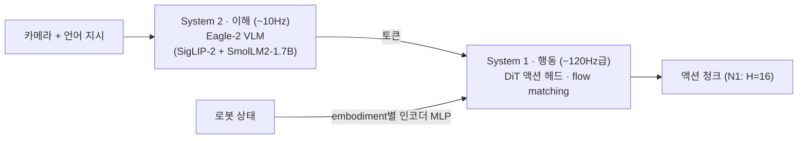
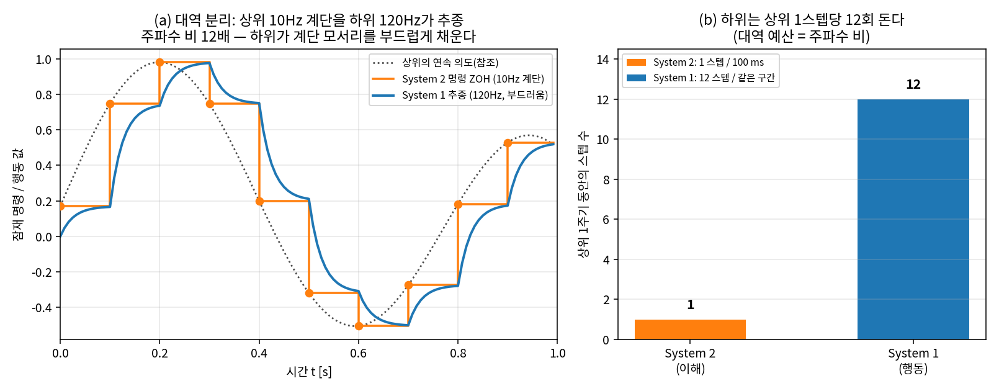
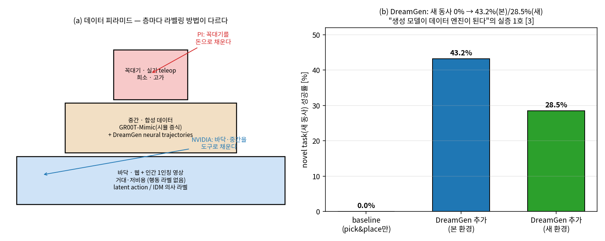
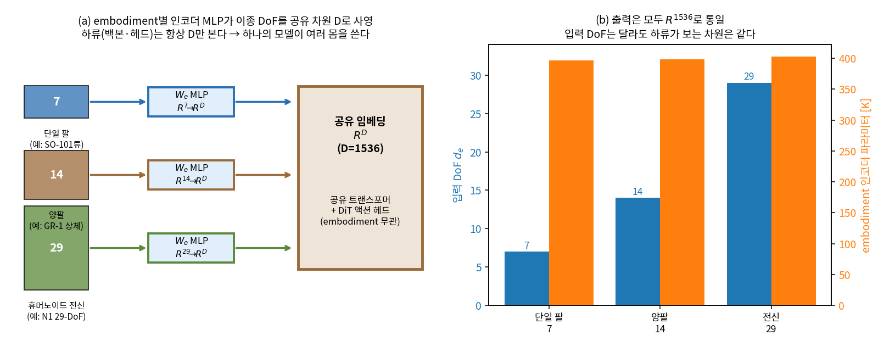
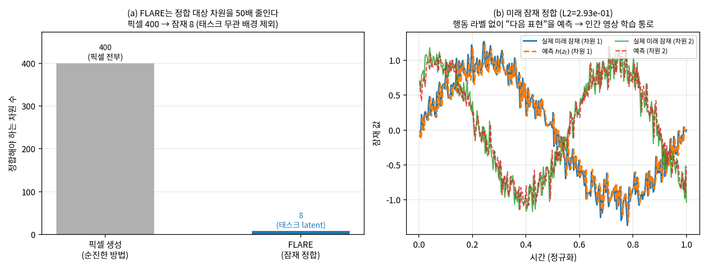

# Lec 46. GR00T 패밀리 — dual-system, 데이터 피라미드, 그리고 world model로 가는 길

> 선수 지식: 44강(π0 템플릿), 40강(flow matching). 등장하는 로봇(Fourier GR-1, Unitree G1)의 하드웨어는 49강에서 자세히 다룬다.
> NVIDIA 자료를 읽을 때는 항상 기억할 것: **GR00T는 Isaac·Omniverse·Jetson을 파는 회사의 모델**이다. 그 이해관계가 설계와 마케팅 양쪽에 배어 있다 — 그것 자체가 학습 포인트다.

## 한 장 요약



버전 진화 한 줄 요약: N1(dual-system 실증) → N1.5(VLM 동결) → N1.6(추론 VLM + 전신) → N1.7(인간 공유 action space) → **N2(VLA를 넘어 world action model)**.

## 학습 목표

1. GR00T의 dual-system 구조와 π0(단일 시퀀스 + expert)의 구조적 차이를 설명할 수 있다.
2. 데이터 피라미드(웹·영상 / 합성 / 실기)의 각 층이 무엇을 기여하고 왜 상호 대체가 안 되는지 설명할 수 있다.
3. DreamGen(neural trajectories)의 파이프라인과 수치적 효과를 설명할 수 있다.
4. N1→N1.7의 버전별 변화에서 "백본은 소모품, 설계 패턴과 데이터 파이프라인이 자산"이라는 패턴을 읽어낼 수 있다.
5. embodiment별 사영 MLP가 이종 DoF(7/14/29)를 공유 임베딩 차원으로 옮기는 shape 계산을 손으로 하고, "하류 백본이 항상 같은 차원만 본다"는 cross-embodiment 원리를 코드로 확인할 수 있다.
6. dual-rate(System 2 ~10Hz / System 1 ~120Hz)의 대역 분리를 0강 E3(ZOH)의 언어로 정량화하고, 주파수 비 ~12배와 "상위 계단을 하위가 추종해 부드러워진다"를 재현할 수 있다.
7. FLARE의 손실(픽셀 생성이 아니라 미래 잠재 표현 정합 L2)이 무엇을 아끼고 왜 행동 라벨 없는 영상에서 배우는 통로가 되는지 설명할 수 있다.

## 본문

### 0. 왜 칩 회사가 로봇 모델을 만드는가

NVIDIA의 로봇 사업은 모델 판매가 아니다. GR00T는 **Isaac Sim/Lab(시뮬레이션), Cosmos(world model), Jetson(온보드 칩), DGX(훈련)**을 한 줄로 꿰는 앵커 상품이다. 그래서 GR00T의 설계는 일관되게 "합성 데이터와 시뮬레이션으로 실데이터 병목을 우회한다"로 기운다 — PI가 실기 teleop 1만 시간에 베팅한 것(44강)과 정확히 대조되는 전략이고, 이 대비가 Part 5에서 가장 배울 것이 많은 지점이다.

### 1. GR00T N1 — dual-system의 실증 (2025.3, arXiv 2503.14734)

- **System 2 (이해, ~10Hz)**: Eagle-2 VLM — SigLIP-2 비전 + SmolLM2-1.7B (36강에서 본 조합).
- **System 1 (행동, ~120Hz급)**: DiT(디퓨전 트랜스포머) 액션 헤드, flow matching, H=16 청크. VLM 토큰에 cross-attention.
- **embodiment 처리**: 로봇마다 다른 상태·행동 차원을 **embodiment별 인코더 MLP**로 공통 임베딩에 사영 — cross-embodiment를 구조로 해결.
- 총 ~2.2B, end-to-end 공동 훈련. 주 실기는 Fourier GR-1 휴머노이드 (하드웨어 상세는 49강에서).
- π0와의 구조 비교: π0는 expert가 백본과 attention을 공유하는 한 그래프, GR00T는 주파수가 다른 두 모듈의 cascade. Kahneman의 System 1/2 은유를 빌렸지만 공학적 실체는 **이해 루프와 행동 루프의 대역 분리**다 (48강에서 Helix가 같은 결론에 도달하는 것을 보게 된다).

이 "대역 분리"가 그림으로는 무엇인지 먼저 눈에 넣어 두자 — 상위(~10Hz)가 계단(ZOH) 잠재 명령을 내면 하위(~120Hz)가 그 사이를 채워 부드럽게 추종한다. 두 주파수의 비는 ~12배다(수식 E2에서 정량화, 코드로 재현).



*그림 1: (a) System 2가 ~10Hz로 내는 계단(ZOH) 잠재 명령을 System 1이 ~120Hz로 추종한다 — 상위의 연속 의도(점선)를 하위가 부드럽게 복원한다. (b) 상위 1주기(~100ms) 동안 하위는 ~12스텝 돈다. 이 그림의 모든 수치는 `images/lec46/gen_figs.py`의 numpy ZOH 시뮬로 재현된다(실제 모델 아님). 대역 분리의 유도는 E2.*

### 2. 데이터 피라미드 — NVIDIA의 데이터 철학

N1 논문의 프레임:
- **바닥 (거대·저비용)**: 웹 데이터 + 인간 1인칭 영상. 행동 라벨이 없으므로 latent action·역동역학 모델(IDM)로 의사 라벨링.
- **중간**: 합성 데이터 — 시뮬레이션 궤적 + 생성 모델이 만든 "neural trajectories".
- **꼭대기 (희소·고가)**: 실기 teleop.

PI와의 대조를 명시적으로: PI는 꼭대기를 돈으로 채웠고, NVIDIA는 바닥·중간을 도구로 채운다. 어느 쪽이 옳은지는 아직 미결이며, 48강의 Skild(심 우선)와 Figure(인간 영상)까지 포함하면 이 질문이 필드 전체의 단층선임을 알 수 있다.

### 3. 합성 데이터 도구들 — 피라미드 중간을 채우는 법

- **GR00T-Mimic**: 사람 시연 몇 개를 Isaac Lab에서 대량으로 증식 (MimicGen 계보; 51강에서 재회).
- **GR00T-Dreams / DreamGen** (2025.5, arXiv 2505.12705): 비디오 world model(Cosmos Predict 2)을 대상 로봇 영상으로 파인튜닝 → 이미지+텍스트 프롬프트로 **새 태스크·새 환경의 로봇 영상을 "꿈꾸게"** 하고 → IDM/latent action으로 의사 행동을 추출한 **neural trajectories**로 훈련.
- **수치**: pick-and-place만 배운 N1이 새 동사(태스크)에서 0% → DreamGen 데이터를 더하면 **43.2%(본 환경), 28.5%(새 환경)**. "생성 모델이 데이터 엔진이 된다"는 63강 world model 서사의 실증 1호.



*그림 2: (a) 데이터 피라미드 — 층마다 라벨링 방법이 다르다(바닥=latent action/IDM 의사 라벨, 중간=시뮬 증식+DreamGen, 꼭대기=실기 teleop). PI와 NVIDIA가 서로 다른 층을 공략한다. (b) DreamGen 효과: 새 동사에서 baseline 0% → 43.2%(본 환경)/28.5%(새 환경) [3]. 막대 수치는 참고문헌 [3]의 보고값이며 gen_figs.py가 본문과 동일 값으로 그린다.*

### 4. 버전 진화 — 각 버전이 하나의 교훈이다

| 버전 | 시점 | 핵심 변화 | 교훈 |
|---|---|---|---|
| **N1.5** | 2025.6 | VLM **동결**, 어댑터 단순화, **FLARE** 손실(미래 잠재 표현 정합) | 동결을 포함한 개편으로 언어 추종 46.6→93.3%(실기 GR-1, N1→N1.5 종합 변화). 43강 OpenVLA의 "unfreeze 필수"와 정반대 — 동결 논쟁은 데이터·규모 의존적 경험칙 |
| **N1.6** | 2025.12 | 백본을 **Cosmos Reason**(물리 추론 VLM)으로 교체, DiT 16→32층(2배), 4층 해동, 전신 loco-manipulation (Unitree G1 등) | "이해 모듈"은 범용 VLM에서 물리 추론 특화 VLM으로 |
| **N1.7** | 2026.4 GA | Cosmos-Reason2-2B(Qwen3-VL 계열), DiT 32→16층, **H 16→40**, 차원 29→132, **인간·로봇 공유 상대 EEF action space**, EgoScale 인간 영상 ~2만 시간 | action space를 인간과 공유해 피라미드 바닥(인간 영상)을 직접 먹는다 (50강에서 상세) |

패턴을 읽자: **백본 VLM은 세대마다 갈아끼워진다(Eagle-2→Eagle 2.5→Cosmos Reason→Cosmos-Reason2). 유지되는 것은 flow-matching DiT라는 메커니즘과 embodiment별 사영이라는 설계 패턴, 그리고 데이터 파이프라인이다.** 반면 action space의 정의 자체는 N1.6(상대 청크)→N1.7(인간 공유 상대 EEF)에서 재정의됐다 — 즉 자산은 백본도 인터페이스의 구체 값도 아니고, 패턴과 파이프라인이다. 새 논문에서 "백본을 X로 바꿨다"가 왜 대개 부차적 뉴스인지의 이유다.

FLARE 한 줄 설명: 미래 프레임을 픽셀로 생성하는 대신 **미래의 잠재 표현을 예측하도록 정합**시키는 보조 손실 — 행동 라벨 없는 인간 영상에서 배우는 통로이며, 63강 V-JEPA류 세계 모델 발상의 미니어처다.

### 5. N2 / DreamZero — VLA의 다음? (2026.3 예고)

- DreamZero 논문("World Action Models are Zero-shot Policies", arXiv 2602.15922): **사전학습 비디오 디퓨전 백본이 미래 영상과 행동을 공동 모델링**하는 world action model(WAM). 시연 모방이 아니라 세계의 동역학 자체를 이종 데이터에서 배운다.
- 주장: SOTA VLA 대비 새 태스크·환경 일반화 **>2배**, **~30분 놀이 데이터**로 새 embodiment에 few-shot 적응. RoboArena 등 리더보드 1위(57강에서 이 평가의 신뢰도를 다룬다). GR00T N2로 제품화, 연말 출시 예고.
- 커리큘럼 관점: "관측→행동" 매핑(VLA)에서 "세계 예측 속의 행동"(WAM)으로의 이동 신호. 63강에서 V-JEPA 2, Cosmos, 1X world model과 함께 정면으로 다룬다. 단, 아직 예고·프리뷰 단계 — 마케팅과 논문을 구분해서 기억할 것.

### 6. 생태계 — 직접 만질 수 있는 것

코드 Apache-2.0 + 가중치 NVIDIA Open Model License (github.com/NVIDIA/Isaac-GR00T, HF `nvidia/GR00T-N1.7-3B` + DROID/LIBERO 파인튜닝판). **LeRobot에 N1.6부터 직접 통합** (56강). 온보드는 Jetson Orin/Thor + TensorRT로 DiT ~3.6배 가속 (배포 계층은 50강에서 상세).

### 핵심 수식

GR00T의 "새로움"은 대부분 백본 교체가 아니라 **세 개의 설계 패턴**에 있다(4절 표의 결론). 그 셋을 수식으로 못 박는다: (E1) 이종 몸을 하나의 백본에 태우는 **embodiment 사영**, (E2) 이해와 행동을 다른 주파수로 도는 **dual-rate 대역 분리**, (E3) 행동 라벨 없는 영상에서 배우는 통로인 **FLARE**. 세 수식 모두 아래 Worked Example에서 numpy 토이로 재현된다(실제 모델·GPU 없음).

#### E1. embodiment 사영 MLP — 이종 DoF를 공유 차원으로

**직관**: 로봇마다 상태·행동 차원이 다르다 — 단일 팔은 7, 양팔은 14, N1의 휴머노이드 전신은 29. 이걸 그대로 트랜스포머에 넣으면 로봇 종류마다 다른 모델이 필요하다. GR00T는 반대로 한다: **각 embodiment에 자기만의 작은 입구(인코더 MLP)**를 두고, 그 입구가 모두 **같은 크기의 복도(공유 임베딩 차원 $D$)**로 뱉게 한다. 그러면 복도 너머의 큰 방(백본·DiT 헤드)은 "몇 DoF짜리 로봇인지" 몰라도 된다.

**물리·기하적 의미**: 이것은 차원이 제각각인 상태 공간들을 **하나의 공통 표현 공간으로 사영**하는 것이다 — 43강 OpenVLA가 "하나의 로봇"을 가정한 것과, OXE/RT-X(42강)가 "여러 로봇을 한 데이터셋에" 담은 것 사이의 다리다. 사영은 정보를 버리지 않는다(오히려 $d_e < D$면 저차원 상태를 고차원으로 **끌어올린다**). 핵심은 **하류가 보는 차원이 embodiment와 무관하게 고정**된다는 것 — 그래서 2.2B 백본을 GR-1과 SO-101이 공유한다. cross-embodiment를 "학습으로" 풀지 않고 "구조로" 못 박은 셈이다(그림 3).

**형식**: embodiment $e$의 상태 $s_e \in \mathbb{R}^{d_e}$에 대해, embodiment별 파라미터 $W_e$를 갖는 인코더 $\phi_e$가

$$
z = \phi_e(s_e) \in \mathbb{R}^{D}, \qquad \phi_e:\ \mathbb{R}^{d_e} \to \mathbb{R}^{D}\ \ (d_e \in \{7, 14, 29, \dots\},\ D \text{ 고정})
$$

로 사영한다. 유도의 요점 셋: ① **입력 차원 $d_e$는 다르지만 출력 차원 $D$는 모든 $e$에서 같다** — 그래서 다음 층(공유 트랜스포머)의 가중치 형태가 embodiment와 무관하게 고정된다. ② 학습되는 것은 **몸마다 다른 것($W_e$, 작다)**과 **몸과 무관한 것(공유 백본, 크다)**로 깔끔히 갈린다 — 새 로봇을 붙이려면 작은 $W_e$만 새로 배우면 된다(실습 B안의 modality config가 이 $W_e$의 실물 인터페이스다). ③ 행동 쪽도 대칭이다: DiT 헤드가 $\mathbb{R}^{D}$에서 다시 embodiment별 디코더로 $\mathbb{R}^{d_e}$ 행동을 뱉는다. E1은 shape만 맞추면 그림이 닫히는, 이 강의에서 가장 "손으로 확인 가능한" 수식이다 (WE-A).



*그림 3: (a) 서로 다른 DoF(7/14/29)의 상태가 각자의 인코더 MLP $W_e$를 거쳐 같은 공유 차원 $D$로 사영된다 — 하류 백본·헤드는 항상 $D$만 보므로 하나의 모델이 여러 몸을 쓴다. (b) 입력 DoF는 달라도 출력은 모두 $\mathbb{R}^{D}$로 통일; embodiment 인코더 파라미터는 몸마다 거의 같다(입력 차원 차이는 <2%). shape·파라미터 수는 gen_figs.py/WE-A의 numpy 출력이다.*

#### E2. dual-rate 대역 분리 — 상위 ZOH를 하위가 추종 (0강 E3 재사용)

**직관**: "이해"는 느려도 되고 "행동"은 빨라야 한다. GR00T는 System 2를 ~10Hz로, System 1을 ~120Hz로 돌린다. 상위가 매 프레임 새 명령을 줄 필요가 없다 — 상위 명령을 **계단처럼 유지(ZOH)**하고, 하위가 그 사이를 촘촘히 메우며 부드럽게 추종하면 된다. 0강 E3의 "2Hz 정책 + 100Hz 제어기"가 여기서는 "~10Hz 이해 + ~120Hz 행동"으로 스케일만 바뀐 것이다.

**물리·기하적 의미**: 이 계층화가 성립하는 **조건**은 0강과 동일하다 — "상위 명령의 변화가 하위 폐루프 대역보다 충분히 느릴 것"(대역 분리라는 계약). 조건이 맞으면 하위는 상위 계단의 날카로운 모서리(고주파)를 걸러내 부드러운 운동으로 바꾼다(그림 1a). 조건이 깨지면(상위가 너무 빨리 목표를 흔들면) 계단이 그대로 저크로 새어 나온다. 로봇공학자에게 이것은 **cascade 제어의 외루프/내루프 대역 분리** 그 자체다 — 24강 WBC, 50강 보간 계층의 감각과 같다.

**형식**: System 2 주기 $T_2 = 1/f_2$, System 1 주기 $T_1 = 1/f_1$, 그리고 대역 비

$$
r = \frac{f_1}{f_2} = \frac{120}{10} = 12, \qquad
a_{\text{cmd}}(t) = z_k \ \text{ for } t \in [\,kT_2,\ (k{+}1)T_2\,) \quad(\text{상위 ZOH})
$$

하위는 이 계단 명령을 대역 $1/\tau$의 1차 추종기로 좇는다:

$$
x_{j+1} = x_j + T_1\,\frac{a_{\text{cmd}}(t_j) - x_j}{\tau}
$$

유도의 요점 셋: ① 상위 1주기 동안 하위는 정확히 $r = 12$스텝 돈다 — "대역 예산 = 주파수 비"(그림 1b). ② $\tau \gg T_1$이면 각 스텝의 이동량 $T_1/\tau$가 작아 출력이 계단보다 **부드러워진다**(WE-B의 2차 차분으로 정량화 — 계단 대비 ~4.7배 매끄러움). ③ 지연 $\tau_d$가 끼면 0강 E3의 위상 여유 한계 $\tau_{d,\max} \approx \phi_m/\omega_c$가 그대로 상위 주기 선택의 상한을 정한다 — "~10Hz면 충분한가"는 하위 대역과 태스크 동역학이 결정하는 공학 문제이지 상수가 아니다.

#### E3. FLARE — 미래 잠재 정합 손실 (픽셀 생성이 아니라)

**직관**: 행동 라벨 없는 인간 영상(피라미드 바닥)에서 배우려면 "다음에 무슨 일이 일어날지"를 예측하게 하는 보조 신호가 필요하다. 가장 순진한 방법은 **다음 프레임 픽셀을 통째로 생성**하는 것이지만, 픽셀은 로봇에게 쓸모없는 디테일(그림자·질감)까지 다 맞추라고 요구한다 — 비싸고 산만하다. FLARE는 대신 **미래의 잠재 표현(feature)만 맞춘다**: 예측한 미래 latent과 실제 미래 latent의 L2 거리를 줄인다.

**물리·기하적 의미**: 이것은 "full-state 재구성 대신 출력만 정합"하는 관측기 설계의 감각과 같다(로봇공학자 번역 박스). 픽셀 공간에서 재구성하면 태스크와 무관한 자유도까지 손실에 들어오지만, 잠재 공간에서 정합하면 **인코더가 이미 추린 태스크 유관 정보**에만 오차를 건다. 63강의 V-JEPA류 "예측을 표현 공간에서"와 정확히 같은 발상의 미니어처이며, N1.5가 VLM을 **동결**한 것과 잘 맞는다 — 동결된 인코더가 안정된 잠재 좌표계를 제공하니, 그 위에서 미래를 예측하는 목표가 표류하지 않는다.

**형식**: 시점 $t$의 관측을 잠재로 넣는 (동결) 인코더 $g$, 정책 내부의 미래 예측기 $h$에 대해

$$
\mathcal{L}_{\text{FLARE}} = \big\lVert\, h(z_t) - \operatorname{sg}\!\big[g(o_{t+k})\big] \,\big\rVert_2^2,
\qquad z_t = g(o_t)
$$

여기서 $\operatorname{sg}[\cdot]$는 stop-gradient(타깃 인코더로 그래디언트가 흐르지 않게 막아 붕괴 방지). 유도의 요점 셋: ① 목표가 **픽셀 $o_{t+k}$가 아니라 잠재 $g(o_{t+k})$** — 재구성 차원이 픽셀 수에서 feature 차원으로 줄어 값싸다. ② 이 손실은 **행동 라벨을 요구하지 않는다** — 그래서 인간 1인칭 영상에 그대로 걸려 피라미드 바닥을 학습 신호로 바꾼다(N1.7이 인간 공유 action space로 바닥을 "직접 먹는" 것의 전 단계). ③ 주 손실(flow matching 행동 손실)에 **보조항으로 더해진다** — FLARE는 정책을 대체하지 않고, 표현이 미래를 품게 만드는 정규화자다. (FLARE의 정확한 아키텍처 세부는 GEAR 페이지 [2]가 1차 출처이며, 여기 수식은 "미래 잠재 정합 L2"라는 골자의 교육용 정식화다.)



*그림 4: (a) FLARE는 정합 대상 차원을 줄인다 — 순진한 픽셀 생성은 픽셀 전부(토이에서 400)를 맞춰야 하지만, 잠재 정합은 태스크 유관 latent(토이에서 8)만 맞춘다(~50배). (b) 현재 잠재 $z_t$로 미래 잠재를 예측하고 L2로 정합 — 행동 라벨 없이 "다음 표현"을 배우는 통로. 이 그림은 배경 잡음이 섞인 고차원 관측에서 태스크 신호만 뽑는 인코더의 numpy 토이다(실제 FLARE 아키텍처 아님). DreamGen(픽셀 생성)과 FLARE(잠재 정합)는 반대 방향임에 유의.*

### Worked Example

#### WE-A (손계산 + 검증): 이종 DoF를 공유 차원으로 사영하는 shape 계산

손으로 shape를 따라가 보자. 상태 3차원짜리 미니 로봇을 4차원 공유 임베딩으로 사영하는 단일 선형층 $W \in \mathbb{R}^{3\times 4}$:

$$
W = \begin{bmatrix} 1 & 0 & -1 & 2 \\ 0 & 2 & 1 & 0 \\ 1 & 1 & 0 & -1 \end{bmatrix},
\qquad s = [1,\ -2,\ 0.5]
$$

$$
z = s^\top W = \big[\,1{\cdot}1{+}(-2){\cdot}0{+}0.5{\cdot}1,\ \ 1{\cdot}0{+}(-2){\cdot}2{+}0.5{\cdot}1,\ \ 1{\cdot}(-1){+}(-2){\cdot}1{+}0.5{\cdot}0,\ \ 1{\cdot}2{+}(-2){\cdot}0{+}0.5{\cdot}(-1)\,\big]
$$

$$
= [\,1.5,\ -3.5,\ -3.0,\ 1.5\,] \in \mathbb{R}^{4}
$$

읽는 법: **입력은 3차원인데 출력은 4차원**이다. 이제 이 로봇 옆에 7·14·29 DoF 로봇을 세워도, 각자의 $W_e$가 모두 **같은 $D$로 뱉기만 하면** 하류는 구분하지 못한다 — 그것이 cross-embodiment의 전부다. 아래 코드는 실제 $D=1536$로 세 embodiment(7/14/29)를 배치 4개씩 사영해 "하류가 보는 차원이 항상 1536"임을 확인한다.

```python
import numpy as np
rng = np.random.default_rng(0)
D = 1536                                   # 공유 임베딩 차원 (하류가 항상 보는 크기)

def make_encoder(d_in, D, seed, H=256):    # embodiment별 2층 MLP: d_in -> H -> D
    r = np.random.default_rng(seed)
    return (r.standard_normal((d_in, H))*np.sqrt(2/d_in), np.zeros(H),
            r.standard_normal((H, D))*np.sqrt(2/H),      np.zeros(D))

def encode(x, p):                          # (B, d_in) -> (B, D)
    W1, b1, W2, b2 = p
    return np.maximum(0, x @ W1 + b1) @ W2 + b2

for name, d in [("단일 팔", 7), ("양팔", 14), ("전신", 29)]:
    x = rng.standard_normal((4, d))        # 배치 4, 상태 d차원
    z = encode(x, make_encoder(d, D, 100+d))
    print(f"{name:6s}: 상태 {x.shape} -> 임베딩 {z.shape}")
# 단일 팔: 상태 (4, 7)  -> 임베딩 (4, 1536)
# 양팔  : 상태 (4, 14) -> 임베딩 (4, 1536)
# 전신  : 상태 (4, 29) -> 임베딩 (4, 1536)   ← 입력은 달라도 출력 차원은 항상 D
```

`gen_figs.py` 실행이 위 세 줄과 함께, 인코더 파라미터 수가 **7DoF=396.8K / 14DoF=398.6K / 29DoF=402.4K**로 embodiment마다 거의 같음(입력 차원 차이는 전체의 <2%)을 출력한다 — **몸마다 다른 부분은 작고, 공유 백본이 크다**는 E1의 요점을 수치로 보여준다. 손계산 $z = [1.5, -3.5, -3.0, 1.5]$도 코드로 검증된다.

#### WE-B (코드): dual-rate — 10Hz 계단을 120Hz가 추종해 부드러워진다

E2를 눈으로 확인한다. 10Hz "이해"가 계단 명령을 내고, 120Hz "행동"이 1차 추종기로 좇는다. 먼저 손계산: 10Hz 명령 $[0.0, 0.5, 1.0]$을 120Hz(=12배) 그리드로 ZOH 확장하면 **각 명령이 12스텝씩 유지**돼 길이 36이 되고, 처음 12개가 0.0, 다음 12개가 0.5 … 가 된다. 명령이 0.5로 점프한 직후 추종기($\tau=0.03$, $T_1=1/120$, 스텝당 $T_1/\tau=0.278$씩 접근)의 3스텝은:

$$
x_1 = 0 + 0.278(0.5{-}0) = 0.139,\quad x_2 = 0.139 + 0.278(0.5{-}0.139) = 0.239,\quad x_3 = 0.312
$$

계단은 한 번에 0.5로 튀지만 추종은 0.139 → 0.239 → 0.312로 **완만히** 오른다 — 이것이 하위가 상위의 저크를 흡수하는 방식이다.

```python
import numpy as np
F2, F1 = 10.0, 120.0                       # System2 / System1 주파수 [Hz]
r = F1 / F2                                # = 12.0  (대역 비)
dt1 = 1/F1
t1 = np.arange(0, 1.0, dt1)
t2 = np.arange(0, 1.0, 1/F2)
intent = lambda t: 0.7*np.sin(2*np.pi*1.3*t) + 0.3*np.sin(2*np.pi*0.5*t + 0.6)
cmd2 = intent(t2)                          # 상위가 10Hz로 내는 표본
zoh  = cmd2[np.minimum((t1*F2).astype(int), len(cmd2)-1)]   # 계단 확장 (ZOH)

tau, x, follow = 0.03, 0.0, []             # 하위 1차 추종기
for c in zoh:
    x += dt1*(c - x)/tau; follow.append(x)
follow = np.array(follow)

rms2 = lambda y: np.sqrt(np.mean(np.diff(y, 2)**2))   # 2차 차분 RMS = 거칠기(저크 대리)
print(f"대역 비 r = {r:.0f}배 (상위 1스텝당 하위 {int(r)}스텝)")
print(f"계단 거칠기 {rms2(zoh):.4f} vs 추종 {rms2(follow):.4f} "
      f"-> 추종이 {rms2(zoh)/rms2(follow):.1f}배 부드러움")
# 대역 비 r = 12배 (상위 1스텝당 하위 12스텝)
# 계단 거칠기 0.1556 vs 추종 0.0329 -> 추종이 4.7배 부드러움
```

출력: 대역 비 **12배**, 그리고 추종 출력이 계단보다 **4.7배 부드럽다**(2차 차분 RMS 0.1556 → 0.0329). 그림 1이 이 시뮬의 시각화다 — 상위 계단(주황)의 모서리를 하위(파랑)가 깎아 연속 의도(점선)를 복원한다. **"~10Hz면 왜 충분한가"의 답이 이 그림에 있다**: 하위 대역이 태스크 동역학보다 넉넉히 빠르면, 상위는 성기게 생각해도 로봇은 부드럽게 움직인다.

#### WE-C (코드): DreamGen 효과 — 데이터 엔진이 0을 43.2%로

3절의 수치를 재현·시각화한다. pick-and-place만 배운 N1은 새 동사에서 0%인데, DreamGen "neural trajectories"를 더하면 본 환경 43.2%·새 환경 28.5%로 뛴다 [3]. 이 수치는 참고문헌 [3]의 보고값이며(우리가 재현한 것은 그림뿐), 그림 2(b)가 본문과 동일한 값으로 막대를 그린다.

```python
import numpy as np
labels = ['baseline\n(pick&place만)', 'DreamGen 추가\n(본 환경)', 'DreamGen 추가\n(새 환경)']
vals   = [0.0, 43.2, 28.5]                 # novel task 성공률 [%]  (참고문헌 [3] 보고값)
gain_seen = vals[1] - vals[0]              # 본 환경 절대 향상 [%p]
print(f"새 동사 성공률: {vals}")
print(f"본 환경 절대 향상 = +{gain_seen:.1f}%p (0 -> 43.2), 새 환경 = +{vals[2]:.1f}%p")
# 새 동사 성공률: [0.0, 43.2, 28.5]
# 본 환경 절대 향상 = +43.2%p (0 -> 43.2), 새 환경 = +28.5%p
```

읽는 법: baseline이 정확히 **0%**라는 게 핵심이다 — 데이터에 없던 동사는 그냥 못 한다(모방학습의 한계, 37강). DreamGen은 그 빈칸을 "꿈꾼 영상 + IDM 의사 라벨"로 채워 0을 43.2로 만든다. 다만 **새 환경 28.5% < 본 환경 43.2%**의 격차가 neural trajectory의 한계도 보여준다 — 생성 영상의 물리 오류와 IDM 의사 라벨 오류가 새 환경일수록 크게 샌다(토론 질문 2). "생성 모델이 데이터가 된다"는 강력하지만 공짜가 아니다.

### 로봇공학자를 위한 번역

- dual-system은 **cascade 제어의 학습판**이다 — 외루프 이해(~10Hz)/내루프 행동(~120Hz)의 대응이며, 대역 분리 이유도 동일하다 (48강에서 상용 사례들로 다시 정리한다).
- **FLARE ≈ 출력 오차 기반 예측 정합**: full-state(픽셀 전부)를 재구성하는 대신 잠재 출력만 맞추는 것 — 관측기 설계에서 전체 상태 재구성 대신 출력 주입으로 절약하는 감각과 닮았다.
- **데이터 피라미드 ≈ 모델 보정의 계층화**: 시스템 식별에서 저비용 시뮬 데이터로 공칭 모델을 잡고 실데이터로 잔차를 보정하는 관행의 초대형판. 시뮬-실기 잔차(sim2real 갭)가 어디에 숨는지 아는 사람일수록 neural trajectory의 오차 소스를 잘 의심할 수 있다.

## 흔한 오해

1. **"System 2/1은 GR00T의 발명이고, 다른 회사도 같은 경계로 나눈다"** — 아니다. Kahneman 은유는 빌린 것이고, **경계는 회사마다 다르다**. GR00T는 이해(~10Hz VLM)/행동(~120Hz DiT) 두 층이지만, 48강 Helix 02는 S2/S1/S0의 세 층(그중 S0는 1kHz sim-trained 전신제어기)으로, 그 경계가 GR00T와 다르다. 그래서 0강 전체 지도는 이 벤더 라벨을 쓰지 않는다(63강에서 GR00T vs Helix 경계를 엄밀히 대조). "System 1"이 어디까지를 가리키는지는 **항상 그 회사 문맥에서** 읽어야 한다.
2. **"embodiment 사영은 차원을 줄이는 압축이다"** — 방향이 반대일 때가 많다. 단일 팔 7 DoF → 공유 $D$(수백~수천)는 **저차원을 고차원으로 끌어올리는** 사영이다(WE-A). 목적은 압축이 아니라 **차원 통일** — 하류 백본이 embodiment와 무관하게 같은 크기만 보게 만드는 것. 차원 수가 줄어드느냐 느느냐는 부차적이다.
3. **"~10Hz/~120Hz는 GR00T의 고정 스펙이다"** — 대표값이지 상수가 아니다. E2가 보여주듯 "상위가 몇 Hz면 충분한가"는 **하위 폐루프 대역과 태스크 동역학**이 정하는 공학 문제다(0강 E3의 위상 여유 한계). 본문의 ~10/~120은 논문 기술과 2차 요약을 종합한 대표값이며(참고문헌 [1] 각주), 버전·태스크에 따라 달라진다. N1.7은 H를 16→40으로 늘려 상위 1주기가 커버하는 지평을 바꿨다.
4. **"FLARE는 미래 영상을 생성한다"** — 정확히는 미래 **잠재 표현**을 정합한다(E3). 픽셀 생성은 DreamGen(Cosmos world model)의 몫이고, FLARE는 그 반대 방향 — 픽셀을 만들지 않고 latent L2만 맞춘다. 둘을 섞으면 "GR00T가 미래를 픽셀로 상상해 그걸로 배운다"는 잘못된 그림이 된다. DreamGen=데이터를 만드는 생성기, FLARE=표현이 미래를 품게 하는 보조 손실.
5. **"DreamGen 43.2%는 GR00T가 그만큼 잘한다는 뜻이다"** — 조건을 봐야 한다. 이 수치는 **baseline이 0%인 새 동사**에서의 상대적 도약이지 절대 신뢰도가 아니다(본 환경 43.2% vs 새 환경 28.5%의 격차가 생성·의사라벨 오류를 드러낸다). 게다가 NVIDIA는 시뮬·칩을 파는 회사라 "합성 데이터가 통한다"는 결론에 이해관계가 있다(토론 질문 4). 수치의 방향(0→양수)은 믿되, 크기는 평가 조건과 함께 읽는다.

## 실습 (45~60분)

**A안 (GPU 24GB급): GR00T N1.7을 LeRobot에서 로드.** 모델 로드 → embodiment/modality config 확인 → 더미 관측으로 액션 shape(H=40 × 차원) 확인 → 자기 로봇을 추가한다면 어떤 config를 써야 하는지 정리.

**B안 (CPU만, 충분히 유익): config 해부.** Isaac-GR00T 저장소의 embodiment 설정 파일들을 Claude와 함께 읽고, "새 로봇 하나를 GR00T에 붙이기 위해 정의해야 하는 것 목록"(상태 키, 행동 키, 정규화, 카메라)을 작성한다. 50강에서 배운 modality config가 실물로 보인다.

## Claude와 토론할 질문

1. N1.5의 "VLM 동결이 낫다"와 OpenVLA의 "unfreeze 필수" — 두 결론이 갈린 원인 후보를 데이터 규모·헤드 구조·평가 지표 관점에서 각각 세워 보라.
2. neural trajectory의 오차는 어디서 생기고(영상 생성의 물리 오류, IDM의 의사 라벨 오류), 각각 정책의 어떤 실패로 나타나겠는가?
3. 데이터 피라미드 바닥이 꼭대기를 대체할 수 없는 이유는? 접촉 동역학 관점에서 논증해 보라.
4. NVIDIA의 이해관계(심·칩 판매)를 알고 나면, GR00T 논문의 어떤 수치를 특히 교차 검증해야 하는가?
5. N1.7이 DiT를 절반으로 줄이면서 H를 2.5배 늘린 트레이드오프를 50강(청크·개루프)의 언어로 평가하라.
6. WAM(N2)이 VLA를 대체한다면, Part 5에서 배운 것 중 무엇이 살아남고 무엇이 폐기되는가?
7. PI(실데이터)·NVIDIA(합성)·Skild(심)·Figure(인간 영상) — 데이터 전략 4파전에서 5년 뒤 승자를 논거와 함께 골라 보라.

## 읽을거리

1. **GR00T N1 논문 (arXiv 2503.14734)**: §아키텍처 + 데이터 피라미드 그림까지 (~40분).
2. **DreamGen 블로그(developer.nvidia.com의 synthetic trajectory 글) 또는 논문 Fig**: 파이프라인 그림 중심 (~15분).
3. (선택) N1.5/1.6/1.7은 GEAR 리서치 페이지 요약이면 충분 — 버전 표의 출처 확인용.

## 자가 점검

1. dual-system 그림(모듈, 주파수, 신호)을 안 보고 그릴 수 있는가?
2. π0와 GR00T의 구조적 차이(attention 공유 vs cascade)를 설명할 수 있는가?
3. 데이터 피라미드 세 층과 각 층의 라벨링 방법을 말할 수 있는가?
4. DreamGen 파이프라인 4단계(파인튜닝→꿈→의사 라벨→훈련)와 효과 수치(0→43.2%/28.5%)를 말할 수 있는가?
5. N1→N1.7에서 유지된 것과 교체된 것을 구분하고, 그 패턴의 함의를 말할 수 있는가?
6. embodiment 사영(E1)을 shape로 설명할 수 있는가? 7·14·29 DoF가 각자의 $W_e$로 같은 $D$에 사영될 때 "하류가 보는 차원이 embodiment와 무관하게 고정"인 이유를 WE-A로 재현할 수 있는가?
7. dual-rate 대역 비 $r = f_1/f_2 = 12$와 "상위 계단을 하위가 추종해 부드러워진다"(E2)를 0강 E3(ZOH)의 언어로 설명하고, "~10Hz면 충분한 조건"이 무엇인지 말할 수 있는가?
8. FLARE(E3)가 픽셀 생성이 아니라 미래 잠재 정합 L2인 이유와, 그것이 DreamGen(픽셀 생성)과 어떻게 다른 역할인지 구분할 수 있는가?

## 참고문헌

> 본문 수치·주장의 출처. 웹 문서는 2026-07-08 접속 기준. (2차) = 언론·마케팅 채널.

[1] NVIDIA, "GR00T N1: An Open Foundation Model for Generalist Humanoid Robots," arXiv:2503.14734, 2025.3. https://arxiv.org/abs/2503.14734 · HF: https://huggingface.co/nvidia/GR00T-N1-2B
— **뒷받침**: dual-system 구조(System 2 = Eagle-2 VLM: SigLIP-2+SmolLM2-1.7B / System 1 = DiT flow matching), H=16, ~2.2B, embodiment별 인코더 MLP, 데이터 피라미드, 주 실기 Fourier GR-1. ※ ~10Hz/~120Hz 주기는 논문 기술과 2차 요약을 종합한 값.

[2] NVIDIA GEAR, "GR00T N1.5," 리서치 페이지, 2025.6. https://research.nvidia.com/labs/gear/gr00t-n1_5/
— **뒷받침**: VLM 동결, 어댑터 단순화, FLARE 손실, 언어 추종 46.6→93.3%·태스크 성공 43.3→83.0%(실기 GR-1, N1→N1.5 종합 변화).

[3] NVIDIA, "DreamGen: Unlocking Generalization in Robot Learning through Neural Trajectories," arXiv:2505.12705, 2025.5. https://arxiv.org/abs/2505.12705 · 코드: https://github.com/nvidia/gr00t-dreams · 해설: https://developer.nvidia.com/blog/enhance-robot-learning-with-synthetic-trajectory-data-generated-by-world-foundation-models/
— **뒷받침**: Cosmos Predict 2 파인튜닝→"꿈" 영상→IDM/latent action 의사 라벨(neural trajectories), novel task 0% → 43.2%(본 환경)/28.5%(새 환경).

[4] NVIDIA GEAR, "GR00T N1.6," 리서치 페이지, 2025.12 (CES 2026.1 발표). https://research.nvidia.com/labs/gear/gr00t-n1_6/ · 개발 블로그: https://developer.nvidia.com/blog/building-generalist-humanoid-capabilities-with-nvidia-isaac-gr00t-n1-6-using-a-sim-to-real-workflow/
— **뒷받침**: Cosmos Reason 백본 교체, DiT 16→32층, 4층 해동, 상대 청크, 전신 loco-manipulation(Unitree G1 등).

[5] NVIDIA, "GR00T N1.7," Isaac-GR00T 저장소 + HF 블로그, 2026.4 GA. https://github.com/NVIDIA/Isaac-GR00T · https://huggingface.co/blog/gr00t-n1-7 · HF: https://huggingface.co/nvidia/GR00T-N1.7-3B
— **뒷받침**: Cosmos-Reason2-2B(Qwen3-VL 계열) 백본, 3B, DiT 32→16층, H 16→40, 상태·행동 차원 29→132, 인간·로봇 공유 상대 EEF action space, EgoScale 인간 영상 ~20K시간.

[6] NVIDIA, "World Action Models are Zero-shot Policies" (DreamZero), arXiv:2602.15922, 2026.2. https://arxiv.org/abs/2602.15922 · 해설: https://developer.nvidia.com/blog/pretrained-to-imagine-fine-tuned-to-act-the-rise-of-world-action-models/
— **뒷받침**: 비디오 디퓨전 백본의 미래 영상+행동 공동 모델링, SOTA VLA 대비 >2배 일반화 주장, ~30분 놀이 데이터 few-shot embodiment 적응.

[7] (2차) NVIDIA 뉴스룸, GTC 2026 발표, 2026.3. https://nvidianews.nvidia.com/news/nvidia-and-global-robotics-leaders-take-physical-ai-to-the-real-world
— **뒷받침**: GR00T N2 예고(DreamZero 기반, 연말 출시 예정) — 프리뷰 단계 정보.

[8] Z. Li et al. (NVIDIA), "Eagle 2: Building Post-Training Data Strategies from Scratch for Frontier Vision-Language Models," arXiv:2501.14818, 2025.1. https://arxiv.org/abs/2501.14818
— **뒷받침**: N1 백본 VLM(Eagle 계열)의 구조적 배경.

*수치 재현성: GR00T 고유 수치(N1 ~2.2B·H=16, DreamGen 0→43.2%/28.5%, 버전 표의 층수·차원·EgoScale ~2만 시간 등)는 참고문헌 [1]~[8]의 보고값이다 — 우리가 재현한 것은 **개념의 shape·거동**뿐이지 모델 성능이 아니다. 다음 값들은 `images/lec46/gen_figs.py`와 본문 코드 블록의 실행 출력이다(numpy 기반, CPU만, 실제 모델·GPU 없음): E1/WE-A의 사영 shape((4,7)/(4,14)/(4,29) → 모두 (4,1536))·손계산 $z=[1.5,-3.5,-3.0,1.5]$·인코더 파라미터 396.8K/398.6K/402.4K, E2/WE-B의 대역 비 $r=12$·ZOH 길이 36·추종 3스텝 [0.139, 0.239, 0.312]·거칠기 0.1556→0.0329(추종 4.7배 부드러움), 그림 1(dual-rate 타이밍)·그림 2(a)의 피라미드 도식은 정성적, 그림 2(b)의 DreamGen 막대(0/43.2/28.5%)는 [3]의 보고값을 그대로 표시. — numpy 1.26 / matplotlib 3.x 기준 재현 확인.*

<!-- lecture-nav -->

---

⬅ 이전: [Lec 45. π 패밀리 II — 일반화, RL, 그리고 스티어러블 generalist](lec45-pi-family-2.md)　｜　[📖 전체 목차](../README.md)　｜　다음: [Lec 47. 작은 모델들과 계보도 총정리 — SmolVLA에서 세 논쟁 축까지](lec47-small-models-lineage.md) ➡
