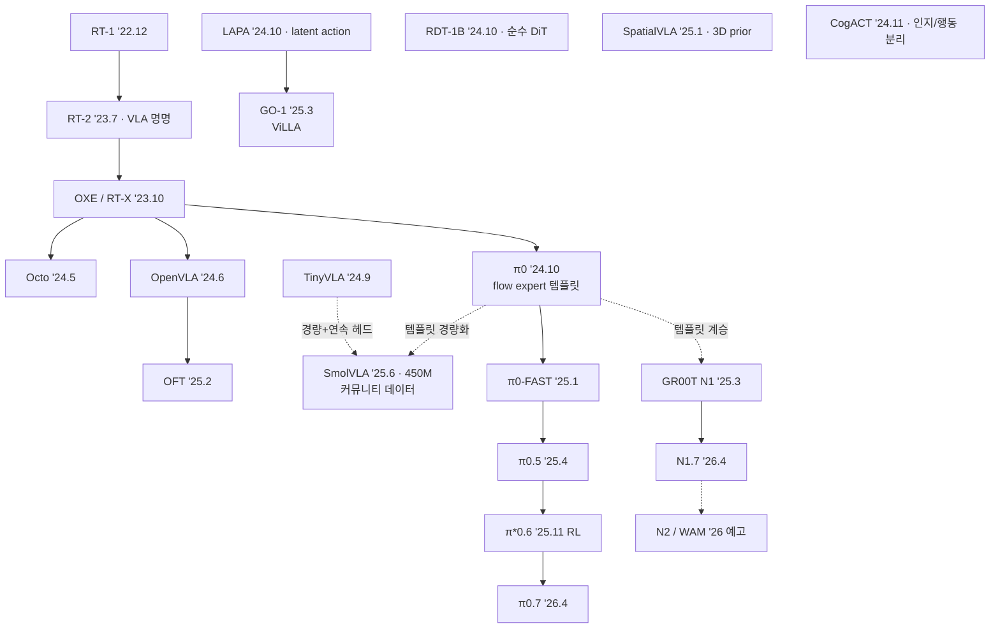
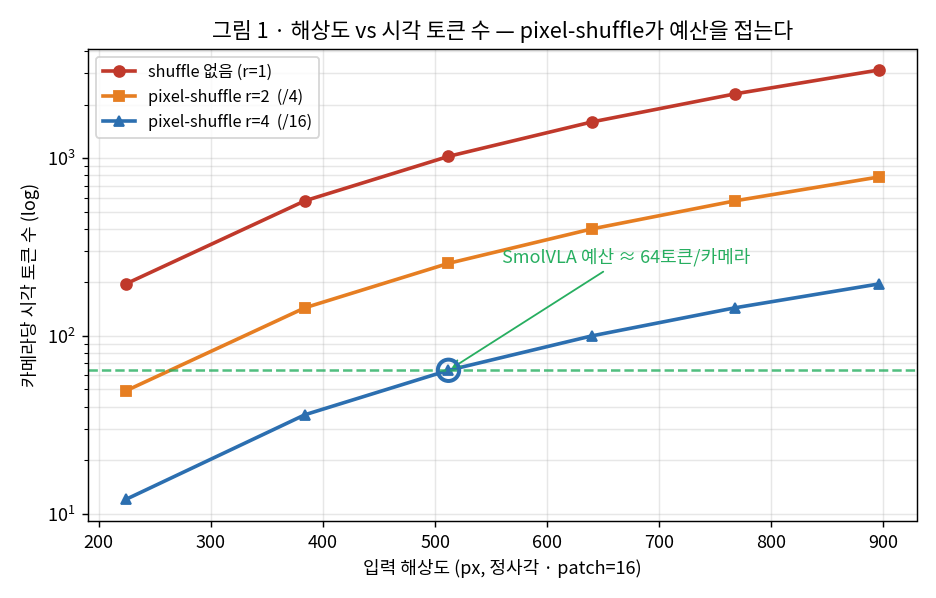
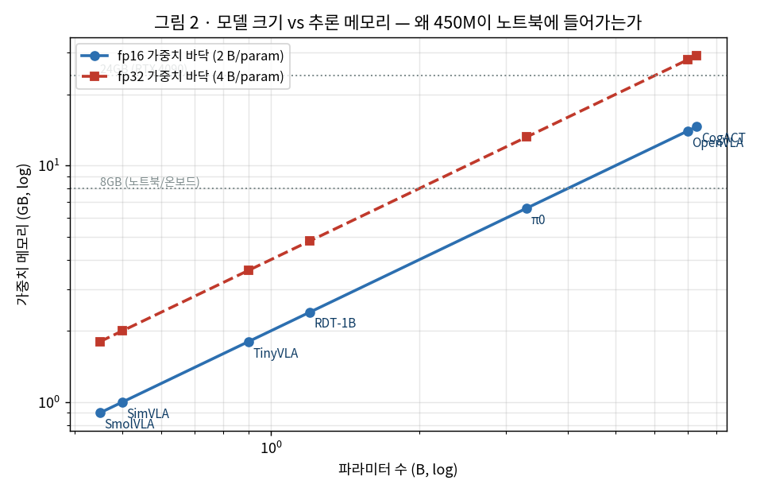
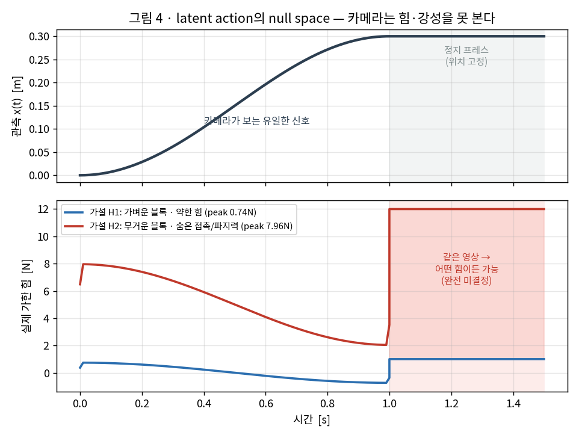
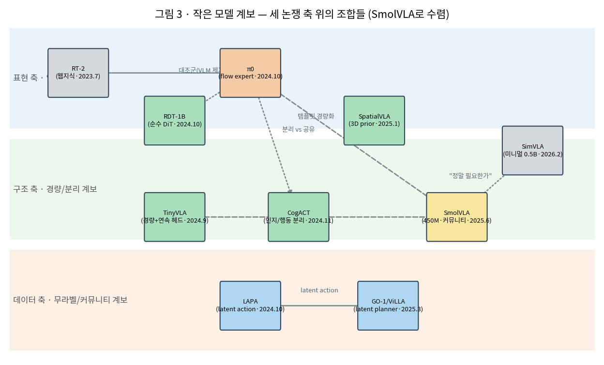

# Lec 47. 작은 모델들과 계보도 총정리 — SmolVLA에서 세 논쟁 축까지

> Part 5 오픈 진영 마무리 강의 (비공개 진영은 48강). 선수 지식: 42~46강 전부.
> 이 강의의 목표는 새 지식 추가가 아니라 **압축** — Part 5 전체를 한 장의 계보도와 세 개의 논쟁 축으로 접는 것.

## 한 장 요약



## 학습 목표

1. SmolVLA의 구조와 훈련 데이터 전략이 왜 "민주화의 완성"인지 설명할 수 있다.
2. TinyVLA·SimVLA·SpatialVLA·GO-1·RDT-1B·CogACT가 각각 어떤 축의 탐험인지 한 문장씩 말할 수 있다.
3. Part 5 전체를 3시대 프레임과 세 논쟁 축으로 재구성할 수 있다.
4. 새 VLA 논문을 계보도 위 "어느 가지의 연장"인지 즉시 위치시킬 수 있다.

## 본문

### 1. 경량화 계보 — 왜 작아지는가

세 가지 동기가 겹친다: **배포**(온보드 추론, 48강 Redwood 160M과 같은 압력), **민주화**(파인튜닝 비용 — 부록 C), 그리고 **과학**("정말 필요한 게 뭔가"의 ablation).

**TinyVLA (2024.9)**: 1B 미만 VLM + 디퓨전 정책 헤드. 로봇 데이터 사전학습을 통째로 생략하고 LoRA(~5% 파라미터)로 파인튜닝. 메시지: **"작은 VLM + 제대로 된 연속 헤드 > 거대 AR VLA"** — 43강 OFT와 같은 방향의 증거.

**SmolVLA (2025.6, arXiv 2506.01844) — 이 강의의 딥다이브.** 450M 전체가 소비자 GPU(추론 ~2GB)에 들어가는 π0 템플릿의 축소판:
- **백본**: SmolVLM-2 유래 (SigLIP + SmolLM2 — 36강에서 본 조합의 최소형). 시각 토큰은 pixel-shuffle로 압축, 카메라당 64토큰 수준까지 절약 (34강의 토큰 예산 계산이 실전이 된 것).
- **구조적 다이어트 1 — 상위 LLM 레이어 스킵**: LLM의 위쪽 절반을 잘라내고 중간 표현에서 바로 액션으로. "행동에 필요한 것은 고수준 추상화의 끝단이 아니다"는 실증.
- **구조적 다이어트 2 — ~100M flow expert**: cross-attention(관측 참조)과 self-attention(액션 청크 내부)을 **인터리브**한 경량 expert.
- **데이터가 진짜 뉴스**: 기업 데이터 없이 **커뮤니티가 SO-100(SO-101의 전신)으로 모은 LeRobot 데이터셋 487개(~23k 에피소드, 10M 프레임)**만으로 훈련. 49강에서 다룰 "$130 하드웨어 → 커뮤니티 데이터 폭발"의 수확이 이것이다.
- **async inference**(50강에서 상세)를 이 논문이 LeRobot에 도입했고, LIBERO·Meta-World·SO-100 실기(SO-101 일반화 테스트 포함)에서 훨씬 큰 모델들과 대등 이상.
- 의미: 파운데이션 모델 문법(사전학습→파인튜닝)이 **개인 단위로 민주화**됨. 56강 최대 실습의 주인공.

**SimVLA (2026.2, arXiv 2602.18224)**: 0.5B 미니멀 베이스라인 — 사전학습 VLM + 경량 액션 트랜스포머(flow matching), 로봇 사전학습 없이 심 벤치마크에서 수십억 모델을 이긴다고 주장. **SmolVLA와 다른 모델**이다(이름 혼동 주의). 메시지: "그 복잡성이 다 필요한가"라는 회의론은 2026년에도 유효하고, 심 벤치마크 위의 주장이라는 점은 57강의 눈으로 볼 것.

### 2. 다른 축의 탐험들 — 한 문장씩

- **SpatialVLA (2025.1)**: 관측에 **3D prior**(Ego3D 위치 인코딩 — 추정 깊이 주입)를, 행동에 **Adaptive Action Grids**(데이터 분포 기반 재이산화 가능한 빈)를. 49강의 "RGB만으로 충분" 서사에 대한 반론 축 — 공간 정밀이 필요한 태스크에서 기하 정보의 명시적 주입이 이긴다는 주장.
- **GO-1 / ViLLA (2025.3)**: VLM + **Latent Planner** + Action Expert의 3단. 행동 라벨 없는 웹·인간 영상에서 **latent action**을 배워 계획 층으로 씀 (LAPA '24.10 계보). AgiBot World 1M 궤적(수집 체계는 55강에서 다룬다)과 결합. 63강 latent action 물결의 본편 예고.
- **RDT-1B (2024.10)**: VLM 없는 **순수 디퓨전 트랜스포머** 1.2B + 128차원 통일 액션 공간(50강 회수). 양팔 정밀 조작 특화. "VLM 백본이 정말 필수인가"의 대조군.
- **CogACT (2024.11)**: 7B VLM(인지) + ~300M DiT(행동)의 **명시적 분리** — naive 토큰화 대비 큰 폭 향상. π0가 attention 공유로 접은 것을 모듈 분리로 편 설계 (44강에서 토론한 "attention 공유 vs 완전 분리"의 실존 답안).

### 3. 계보도 총정리 — 3시대와 세 논쟁 축

**3시대 프레임**:
- **1시대 '22-23 (42강)**: 로봇 트랜스포머 + 이산 행동 토큰. RT-1이 실증, RT-2가 웹 지식을 연결, OXE가 데이터를 모음.
- **2시대 '24 (43-44강)**: 오픈화 + 연속 액션 헤드. Octo/OpenVLA가 재현·공개, π0가 flow expert 템플릿 확립, RDT·CogACT·TinyVLA가 설계 공간 탐색.
- **3시대 '25-26 (45-48강)**: 분화 — 계층·dual-system(π0.5, GR00T, Helix), RL 사후 훈련(RECAP), latent action(GO-1), 경량 온보드(SmolVLA, Redwood), 그리고 world model 수렴(N2/WAM)의 예고.

**세 논쟁 축** — 새 논문은 거의 예외 없이 이 세 축 위 새 조합이다:
1. **행동 표현**: 이산 AR 토큰 ↔ 연속 flow/디퓨전 (해소 시도: FAST, KI, OFT의 회귀)
2. **구조**: 단일 모델 ↔ 계층/dual-system (해소 시도: π0.5의 한-모델 계층)
3. **데이터**: 실기 teleop ↔ 웹·합성·인간 영상 (해소 시도: co-training, DreamGen, latent action, EgoScale)

이 세 축 + 45강의 학습 레시피(KI·RL 사후 훈련) + 50강의 실행·효율 계층 + 57강의 평가 문제를 합치면 64강의 "논문 읽기 6축 프레임워크"가 완성된다.

### 핵심 수식

이 강의는 "압축"이 목표라 새 알고리즘 수식이 적다. 대신 **왜 작아지는가**를 떠받치는 세 개의 정량 관계를 세운다 — 하나는 시각 입력 예산(SmolVLA가 카메라당 64토큰까지 접는 근거), 하나는 파라미터 수와 배포 메모리의 다리(450M이 노트북에, π0가 왜 못 들어가는가), 그리고 하나는 데이터 축의 원리적 한계(무라벨 영상에서 latent action이 **끝내 복원할 수 없는 것**). 세 수치는 모두 `images/lec47/gen_figs.py`의 실행 출력이다.

#### E1. 시각 토큰 예산과 pixel-shuffle — 왜 카메라당 64토큰인가

**① 직관**: VLA의 컨텍스트 길이는 대부분 **이미지**가 먹는다. ViT는 이미지를 $p \times p$ 패치로 쪼개 각 패치를 토큰 하나로 만드니(34강), 토큰 수는 해상도의 제곱으로 늘어난다. 카메라 3대에 고해상까지 쓰면 시각 토큰만 수천~만 단위 — 작은 LLM 백본에는 감당 불가다. **pixel-shuffle**는 공간 $r \times r$ 이웃 패치를 채널 축으로 접어(정보를 버리지 않고 재배치) 토큰 수를 $r^2$배 줄인다.

**② 물리·기하적 의미**: 토큰 수는 곧 **어텐션 비용**($O(n^2)$)이자 배포 지연이다. 34강에서 "해상도↔토큰 수"를 개념으로만 봤다면, SmolVLA는 그 예산을 실전 제약으로 건다: 소비자 GPU·온보드에서 50Hz로 돌리려면 카메라당 토큰이 세 자릿수 초반이어야 한다. pixel-shuffle는 "해상도를 낮추지 않고" 토큰만 접는 트릭이라 — 세밀한 텍스처는 채널에 살아 있고, 시퀀스 길이만 짧아진다. 공간 해상도와 시퀀스 길이를 분리해서 예산을 다는 것이다.

**③ 형식(유도 요점)**: 정사각 해상도 $R$, 패치 크기 $p$, pixel-shuffle 배율 $r$일 때 카메라당 시각 토큰 수는

$$
N_{\text{tok}} = \left(\frac{R}{p}\right)^2 \Big/ r^2 = \left(\frac{R}{p\,r}\right)^2
$$

SmolVLA의 SmolVLM-2 백본은 $p = 16$, 입력 $R = 512$, $r = 4$이므로 $N_{\text{tok}} = (512/16)^2 / 16 = 1024/16 = 64$. 대조로 고해상 VLM 관행($R = 896$, $p = 14$, shuffle 없음)은 $(896/14)^2 = 4096$ — **같은 카메라를 64배 무겁게 본다**. 3카메라면 192 vs 12288 토큰. E1이 34강의 예산 계산을 "실전이 된" 자리다.



*그림 1: 토큰 수는 해상도의 제곱으로 증가($y$ 로그 축). pixel-shuffle $r=4$(파랑)는 곡선을 통째로 $1/16$로 내려, 512px에서 정확히 64토큰(초록 파선)에 걸린다 — SmolVLA의 예산. [1] gen_figs.py `vis_tokens`.*

#### E2. 모델 크기 → 추론 메모리 — 450M이 노트북에 들어가는 산수

**① 직관**: "작다"는 말의 실체는 **메모리**다. 신경망을 추론하려면 최소한 가중치가 메모리에 올라가야 하고, 가중치 개수 = 파라미터 수, 파라미터 하나가 차지하는 바이트는 정밀도가 정한다(fp16 = 2바이트, fp32 = 4바이트). 그래서 추론 메모리의 **바닥**은 파라미터 수에 비례한다.

**② 물리·기하적 의미**: 이 한 줄이 "민주화"의 하드웨어적 정의다. 노트북 통합 GPU가 ~8GB, 소비자 최상급(RTX 4090)이 24GB. 이 선 아래로 들어오느냐가 "개인이 돌릴 수 있나"를 가른다. 실측 추론 풋프린트는 가중치 바닥에 활성값·KV 캐시·런타임 오버헤드가 더해져 대략 **fp32 바닥 + 여유** 수준으로 앉는다 — 그래서 SmolVLA(450M)는 실측 ~2GB, π0(3.3B)는 ~14GB로 보고된다 [2]. 약 15배 차이가 "노트북이냐 서버냐"를 가른다.

**③ 형식(유도 요점)**: 파라미터 수 $P$, 파라미터당 바이트 $b$일 때 가중치 메모리 바닥은

$$
M_{\text{weight}} = b \cdot P, \qquad M_{\text{infer}} \approx b_{\text{fp32}} \cdot P + (\text{활성·KV·런타임})
$$

브리프의 어림 "$\approx 2 P$ 바이트"는 fp16 가중치 바닥($b = 2$)이다: $450\text{M} \times 2 = 0.9$GB. 실측 ~2GB는 여기에 fp32 실행·오버헤드가 더해진 값이고, π0의 $3.3\text{B} \times 4 = 13.2$GB가 보고치 ~14GB와 맞는다. **파라미터가 곧 배포 비용**이라는 것이 SmolVLA·TinyVLA·SimVLA가 파라미터를 깎는 이유다.



*그림 2: 가중치 메모리 = (바이트/param) × 파라미터 수, 양축 로그. SmolVLA·SimVLA는 8GB 선(노트북) 아래, π0·OpenVLA·CogACT는 그 위. 이 한 장이 "가장 쉬움 > 가장 어려움"(부록 A 파인튜닝 난이도)의 물리적 근거다. gen_figs.py `models` 표.*

#### E3. latent action의 원리적 한계 — 영상은 힘·강성을 담지 못한다

**① 직관**: GO-1·LAPA(63강 예고)는 **행동 라벨 없는 영상**에서 "무엇이 어떻게 움직였나"를 역추정해 latent action으로 쓴다. 그런데 카메라가 보는 것은 **운동학**(위치·속도·가속도)뿐이다. 같은 궤적을 만드는 (질량, 힘, 접촉)의 조합은 무수히 많다 — 영상만으로는 **어느 조합인지 못 가른다**.

**② 물리·기하적 의미**: 이것은 로봇공학자에게 익숙한 **미지 입력 관측기(unknown input observer)의 학습판**이다(아래 번역 박스). 뉴턴 $F = m\ddot x$에서 $\ddot x$는 영상에서 얻지만 $m$과 내부 접촉·파지력은 관측 밖이다. 특히 **정지 프레스**(물건을 쥐고 힘만 주는 구간)에서는 $\dot x = \ddot x = 0$이라 파지력이 0이든 최대든 **영상이 완전히 똑같다** — 힘·강성은 vision→action 사상의 **null space**에 통째로 들어앉는다. GO-1류가 접촉·정밀 파지에서 흔들리는 이유의 원리적 뿌리가 여기다.

**③ 형식(유도 요점)**: 관측을 운동학 $x(t)$로 두면 동역학은 $F_{\text{applied}}(t) = m\,\ddot x(t) + F_{\text{contact}}(t)$. $x(t)$가 주어져도 $(m,\ F_{\text{contact}})$는 미결정이다. 토이로: 같은 $x(t)$를 **가벼운 블록·자유공간**($m{=}0.5$, $F_c{=}0$)과 **무거운 블록·숨은 접촉력**($m{=}2.0$, $F_c{=}5$N)이 만들 수 있고, 필요한 힘의 최댓값은 각각 0.74N vs 7.96N — **운동학은 동일한데 힘은 10.8배 차이**다. latent action이 복원하는 것은 이 사상의 상(image)뿐, null space의 힘·강성은 원리적으로 못 복원한다. 정확한 힘 정보는 실기 teleop(토크·F/T 센서)이나 접촉 라벨에서만 온다 — 데이터 논쟁 축이 끝내 "웹 영상만으로 안 된다"에 부딪히는 지점이다.



*그림 4: 위 = 카메라가 보는 유일한 신호 $x(t)$(두 가설이 동일). 아래 = 실제 가한 힘. 자유 이동 구간에서도 10.8배 차이가 나고, **정지 프레스 구간**(회색 띠)에서는 위치가 고정이라 어떤 파지력이든 같은 영상을 만든다 — 힘·강성이 vision→action 사상의 null space에 통째로 들어앉는 것의 그림. gen_figs.py `F1/F2` 토이.*

### Worked Example

#### WE-1 (손계산 + 검증): 해상도·패치·shuffle 조합별 카메라당 토큰 수

손으로 먼저. E1의 $N_{\text{tok}} = (R/(p\,r))^2$에 네 조합을 넣는다:

- 고해상 baseline $R{=}896, p{=}14, r{=}1$: $(896/14)^2 = 64^2 = 4096$.
- SmolVLA 해상도·shuffle 없음 $R{=}512, p{=}16, r{=}1$: $(512/16)^2 = 32^2 = 1024$.
- shuffle $r{=}2$ 추가: $1024/4 = 256$.
- **SmolVLA 실제** $r{=}4$: $1024/16 = 64$.

읽는 법: 4096 → 64는 **64배 압축**인데, 이는 해상도·패치 선택(896/14 → 512/16 = 4096 → 1024, 4배)과 shuffle(16배)의 곱이다(4 × 16 = 64). shuffle 하나가 그중 16배를 담당한다. 흥미로운 점 — $R{=}384, p{=}16, r{=}3$도 정확히 64토큰이다: **해상도를 낮춰서 64에 도달**하는 길과 **shuffle로 64에 도달**하는 길이 갈리고, SmolVLA는 후자(해상도를 지키고 시퀀스만 접는다)를 골랐다.

| 해상도 | 패치 | $r$ | 토큰/카메라 | 설명 |
|---|---|---|---|---|
| 896 | 14 | 1 | **4096** | 고해상 VLM baseline |
| 768 | 16 | 1 | 2304 | 중해상, shuffle 없음 |
| 512 | 16 | 1 | 1024 | SmolVLA 해상도, shuffle 없음 |
| 512 | 16 | 2 | 256 | shuffle $r{=}2$ |
| 512 | 16 | 4 | **64** | **SmolVLA 실제** (해상도 유지 + shuffle) |
| 384 | 16 | 3 | 64 | 해상도를 낮춰 64에 도달(다른 길) |

**검증 코드** (전체: `images/lec47/gen_figs.py`):

```python
def vis_tokens(res, patch, r=1):
    n_patch = (res // patch) ** 2      # ViT 패치 토큰 수 = (R/p)^2
    return n_patch // (r * r)          # pixel-shuffle r배 → /r^2

print(vis_tokens(896, 14, 1))          # 4096  (고해상 baseline)
print(vis_tokens(512, 16, 1))          # 1024  (shuffle 없음)
print(vis_tokens(512, 16, 4))          # 64    (SmolVLA)  ✓
print(4096 // vis_tokens(512, 16, 4))  # 64    (절감 배율)
```

출력: `4096`, `1024`, `64`, `64`. 카메라당 64토큰이 손계산과 코드에서 같이 나온다 — SmolVLA가 34강의 예산 계산을 어떻게 실전으로 만들었는지의 산수다.

#### WE-2 (손계산 + 검증): 파라미터 수 → 추론 메모리, 그리고 계보 그래프

두 부분이다. **(a) 메모리**: E2로 각 모델의 가중치 바닥을 손으로 — SmolVLA $450\text{M} \times 2\text{B} = 0.9$GB(fp16), π0 $3.3\text{B} \times 4\text{B} = 13.2$GB(fp32). 실측 보고치(~2GB, ~14GB)와 대조하면 오버헤드가 얼마인지 읽힌다. **(b) 계보 그래프**: 작은 모델들을 세 논쟁 축(표현/구조/데이터)의 띠 위에 시간순으로 놓으면, 서로 다른 축의 탐험들이 어떻게 SmolVLA로 수렴하는지가 한 장에 보인다.

```python
models = [("SmolVLA", 0.45e9), ("SimVLA", 0.50e9), ("TinyVLA", 0.90e9),
          ("RDT-1B", 1.20e9), ("π0", 3.30e9), ("OpenVLA", 7.00e9), ("CogACT", 7.30e9)]
for name, p in models:
    print(f"{name:8s} fp16 {p*2/1e9:5.2f}GB  fp32 {p*4/1e9:6.2f}GB")
# SmolVLA fp16 0.90GB, π0 fp32 13.20GB → 약 15배.  실측 ~2GB vs ~14GB와 정합.
```

출력에서 SmolVLA·SimVLA만 8GB 선 아래(그림 2)다. π0 대비 SmolVLA는 **약 15배** 가벼운 배포 — "민주화의 완성"이 파라미터·바이트의 산수로 환원되는 순간이다.



*그림 3: 가로 띠 = 세 논쟁 축. 표현 축(RT-2→π0), 구조 축(TinyVLA·CogACT·RDT-1B의 경량/분리 탐험), 데이터 축(LAPA→GO-1의 무라벨 계보). 실선=계승, 파선=경량화 계승, 점선=대조·회의. π0 템플릿과 TinyVLA의 경량 연속 헤드가 SmolVLA(노랑)로 합류하고, SimVLA가 "정말 필요한가"로 다시 묻는다. 이 그림은 한 장 요약의 mermaid를 "축" 관점으로 재배치한 것 — 노드가 아니라 **어느 띠에 있나**를 읽는다.*

#### WE-3 (코드): latent action의 null space — 같은 영상, 다른 힘

E3을 눈으로 확인한다. 블록을 0→0.3m 부드럽게 미는 **동일한 운동학** $x(t)$를, 서로 다른 두 물리 가설이 만들 수 있음을 보인다:

```python
import numpy as np
t = np.linspace(0, 1, 200)
x  = 0.3 * (1 - np.cos(np.pi * t)) / 2     # 카메라가 보는 유일한 신호: x(t)
xdd = np.gradient(np.gradient(x, t), t)
# H1: 가벼운 블록(자유공간)      F1 = 0.5 * xdd
# H2: 무거운 블록 + 숨은 접촉력   F2 = 2.0 * xdd + 5.0   (F_contact=5N, 카메라 밖)
F1, F2 = 0.5 * xdd, 2.0 * xdd + 5.0
print(abs(F1).max(), abs(F2).max())        # 0.74 N, 7.96 N  → 10.8배
```

출력: 최대 힘 0.74N vs 7.96N, **10.8배 차이인데 $x(t)$는 동일**. 그리고 정지 프레스 구간($\dot x = \ddot x = 0$)에서는 파지력이 얼마든 영상이 같으니 힘·강성은 완전히 미결정 — latent action이 **원리적으로** 못 배우는 것이 무엇인지가 이 세 줄에 있다. 실기 teleop의 토크·F/T 라벨이 왜 대체 불가능한지(49·55강)의 근거다.

### 로봇공학자를 위한 번역

- 경량화는 모델 축소가 아니라 **요구 스펙의 재정의**다 — 제어기 설계에서 "필요 대역폭을 먼저 정하고 최소 차수로 구현"하는 감각. SmolVLA의 레이어 스킵은 대역 밖 다이내믹스를 제거한 축약 모델에 해당한다.
- latent action은 **관측만으로 입력을 역추정하는 문제**, 즉 미지 입력 관측기(unknown input observer)의 학습판이다. 원리적 한계(관측에서 복원 불가능한 입력 성분 — 예: 힘의 크기)도 같은 이유로 남는다.
- 계보도 읽기는 특허 지도 읽기와 같다: 노드(모델)가 아니라 **엣지(무엇을 계승하고 무엇을 반박했나)**에 정보가 있다.

## 실습 (60분, GPU 불필요) — Part 5 오픈 진영 캡스톤

**계보도를 백지에서 그린다.**

1. 위 mermaid를 보지 않고, 42~47강에서 만난 모델 약 20개를 시간축에 배치한다 (π 파생 버전들은 묶어 세어도 좋다).
2. 화살표마다 라벨을 단다 — "무엇을 계승", "무엇을 반박". (예: OFT → π0 방향은? SmolVLA가 계승한 것은 π0의 무엇?)
3. Claude에게 채점을 받는다: 빠진 노드, 틀린 엣지, 그리고 "이 엣지에 라벨을 달 수 없다면 그 모델을 다시 읽어야 한다".
4. 마지막으로 세 논쟁 축 각각에 대해 자기 입장을 한 문단씩 쓴다 — 이것이 Part 5의 최종 산출물이다.
5. 부록 A 치트시트와 대조해 마무리.

## Claude와 토론할 질문

1. SmolVLA가 커뮤니티 데이터만으로 되는 이유는 무엇인가 — 데이터의 양인가, 단일 로봇 플랫폼(SO-100)에서 오는 embodiment 일관성인가? π0의 이종 1만 시간과 비교하라.
2. 상위 LLM 레이어를 잘라도 되는 이유는? 어느 층의 표현이 "행동에 충분"한가 — 이것으로 LLM 내부 표현에 대해 무엇을 알 수 있나?
3. SpatialVLA의 3D prior 주장과 49강의 "RGB-only 지배" 관찰은 어떻게 화해되는가? 어떤 태스크 분포에서 갈리는가?
4. latent action이 원리적으로 복원할 수 없는 정보는 무엇인가? (힘, 강성, 접촉 조건...) 그 한계가 GO-1류의 어떤 실패로 나타나겠는가?
5. "미니멀 베이스라인이 대형을 이긴다"(SimVLA류) 주장에서 반드시 확인할 세 가지는? (벤치마크 포화, 평가 분포, 실기 여부 — 57강 예습)
6. 세 논쟁 축 각각에서 2027년의 승자를 예측하고 논거를 대라. Claude의 반박을 받아 수정해 보라.

## 읽을거리

1. **SmolVLA 블로그(huggingface.co/blog/smolvla) + 논문**: 짧고 그림이 좋다 — 전문 권장 (~40분). 구조 그림을 π0 그림(44강) 옆에 놓고 비교하며 읽을 것.
2. **AgiBot World / GO-1 논문(arXiv 2503.06669)은 ViLLA 구조 그림만** (~10분).

## 자가 점검

1. 계보도를 안 보고 그릴 수 있는가 (노드 ~20개, 라벨 달린 엣지)?
2. SmolVLA의 두 가지 구조적 다이어트와 데이터 전략을 말할 수 있는가?
3. SmolVLA와 SimVLA를 혼동 없이 구분해 설명할 수 있는가?
4. 6개 "다른 축" 모델(TinyVLA, SimVLA, SpatialVLA, GO-1, RDT, CogACT)을 각 한 문장으로 위치시킬 수 있는가?
5. 세 논쟁 축을 대고, 임의의 최근 논문 하나를 그 위에 놓을 수 있는가?

## 참고문헌

> 본문 수치·주장의 출처. 계보도 노드의 날짜·수치 중 42~46강에서 다룬 것은 해당 강의의 참고문헌을 따른다. 웹 문서는 2026-07-08 접속 기준.

[1] M. Shukor et al. (Hugging Face), "SmolVLA: A Vision-Language-Action Model for Affordable and Efficient Robotics," arXiv:2506.01844, 2025.6. https://arxiv.org/abs/2506.01844 · 블로그: https://huggingface.co/blog/smolvla · 모델: https://huggingface.co/lerobot/smolvla_base
— **뒷받침**: 450M 총합(SmolVLM-2 유래 백본 + ~100M flow expert), 상위 LLM 레이어 스킵, cross/self-attention 인터리브, 커뮤니티 SO-100 LeRobot 데이터셋 487개(~23k 에피소드/10M 프레임)만으로 훈련, async inference 도입, LIBERO·Meta-World·SO-100 실기 평가.

[2] Hugging Face, "Async robot inference" 블로그·문서, 2025.6. https://huggingface.co/blog/async-robot-inference · https://huggingface.co/docs/lerobot/en/async
— **뒷받침**: 추론 메모리 SmolVLA ~2GB vs π0 ~14GB.

[3] J. Wen et al., "TinyVLA: Towards Fast, Data-Efficient Vision-Language-Action Models for Robotic Manipulation," arXiv:2409.12514, 2024.9. https://arxiv.org/abs/2409.12514
— **뒷받침**: <1B VLM+디퓨전 정책 헤드, 로봇 사전학습 생략, LoRA ~5% 파라미터.

[4] Y. Luo et al., "SimVLA: A Simple VLA Baseline for Robotic Manipulation," arXiv:2602.18224, 2026.2. https://arxiv.org/abs/2602.18224 · 코드: https://github.com/LUOyk1999/SimVLA
— **뒷받침**: 0.5B, 사전학습 VLM+경량 액션 트랜스포머(flow matching), 로봇 사전학습 없이 심 벤치마크 우위 주장(실기는 π0.5와 대등). SmolVLA와 별개 모델.

[5] D. Qu et al., "SpatialVLA: Exploring Spatial Representations for Visual-Language-Action Model," arXiv:2501.15830, 2025.1 (RSS 2025). https://arxiv.org/abs/2501.15830 · 코드: https://github.com/SpatialVLA/SpatialVLA
— **뒷받침**: Ego3D 위치 인코딩, Adaptive Action Grids, 1.1M 에피소드.

[6] AgiBot, "AgiBot World Colosseo" (GO-1/ViLLA), arXiv:2503.06669, 2025.3 (IROS 2025). https://arxiv.org/abs/2503.06669 · 블로그: https://agibot-world.com/blog/go1
— **뒷받침**: VLM+Latent Planner+Action Expert 3단(ViLLA), 무라벨 영상의 latent action, AgiBot World 1M+ 궤적.

[7] S. Ye et al., "Latent Action Pretraining from Videos" (LAPA), arXiv:2410.11758, 2024.10. https://arxiv.org/abs/2410.11758
— **뒷받침**: 행동 라벨 없는 인간 영상에서의 latent action 사전학습(GO-1의 계보).

[8] Tsinghua RDT Team, "RDT-1B: a Diffusion Foundation Model for Bimanual Manipulation," arXiv:2410.07864, 2024.10. https://arxiv.org/abs/2410.07864 · 프로젝트: https://rdt-robotics.github.io/rdt-robotics/
— **뒷받침**: 1.2B 순수 디퓨전 트랜스포머, 128차원 통일 액션 공간, 양팔 ALOHA 특화.

[9] Microsoft Research, "CogACT: A Foundational Vision-Language-Action Model for Synergizing Cognition and Action," arXiv:2411.19650, 2024.11. https://arxiv.org/abs/2411.19650 · 프로젝트: https://cogact.github.io
— **뒷받침**: 7B VLM(인지)+~300M DiT(행동)의 명시적 분리, naive 토큰화 대비 큰 폭 향상.

*수치 재현성: 핵심 수식·Worked Example·그림의 모든 수치는 `images/lec47/gen_figs.py`(numpy만, CPU)의 실행 출력이다 — 개념을 numpy 토이로 재현한 것이며 실제 모델 다운로드/GPU는 쓰지 않는다. 구체적으로: **E1·WE-1**의 토큰 예산 표(896/14→4096, 512/16 shuffle 없음→1024, r=2→256, **SmolVLA r=4→64**, 384/16 r=3→64)와 절감 배율 64배·3카메라 192 vs 12288(그림 1). **E2·WE-2**의 가중치 바닥(SmolVLA fp16 0.90GB·fp32 1.80GB, π0 fp32 13.20GB, 실측 ~2GB vs ~14GB 대조, 약 15배)과 8GB/24GB 경계(그림 2). **E3·WE-3**의 latent action null space 토이(동일 x(t)에서 최대 힘 0.74N vs 7.96N = 10.8배 차, 정지 프레스 구간 힘·강성 완전 미결정 — 그림 4). 그림 3(계보 그래프)은 세 논쟁 축 띠 위 노드 배치로, 한 장 요약 mermaid를 "축" 관점으로 재구성. numpy 1.26 / matplotlib 3.5 기준 재현 확인. SmolVLA 파라미터 450M·토큰 수치는 참고문헌 [1], 추론 메모리 ~2GB/~14GB는 [2]. SmolVLA의 데이터는 SO-100 수집(SO-101 아님) — 본문·[1] 일치.*

<!-- lecture-nav -->

---

⬅ 이전: [Lec 46. GR00T 패밀리 — dual-system, 데이터 피라미드, 그리고 world model로 가는 길](lec46-groot-family.md)　｜　[📖 전체 목차](../README.md)　｜　다음: [Lec 48. 비공개 진영의 지향점 — 회사별 베팅으로 읽는 VLA 설계 철학](lec48-proprietary-vla.md) ➡
