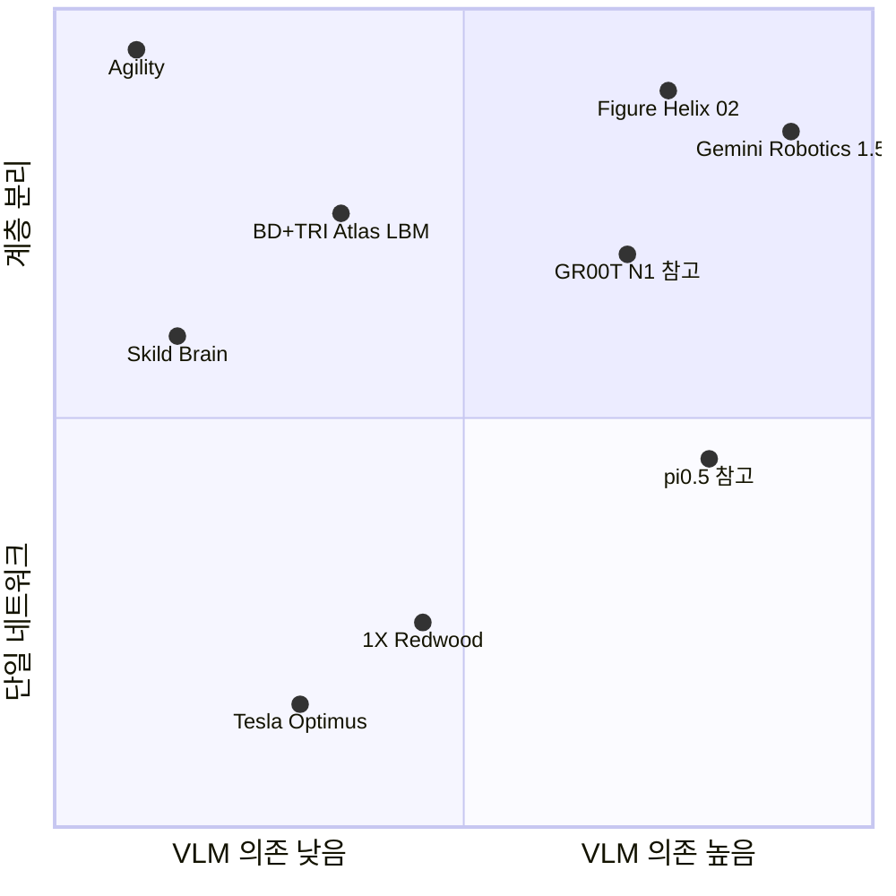
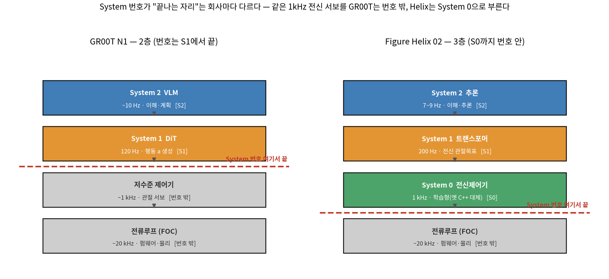
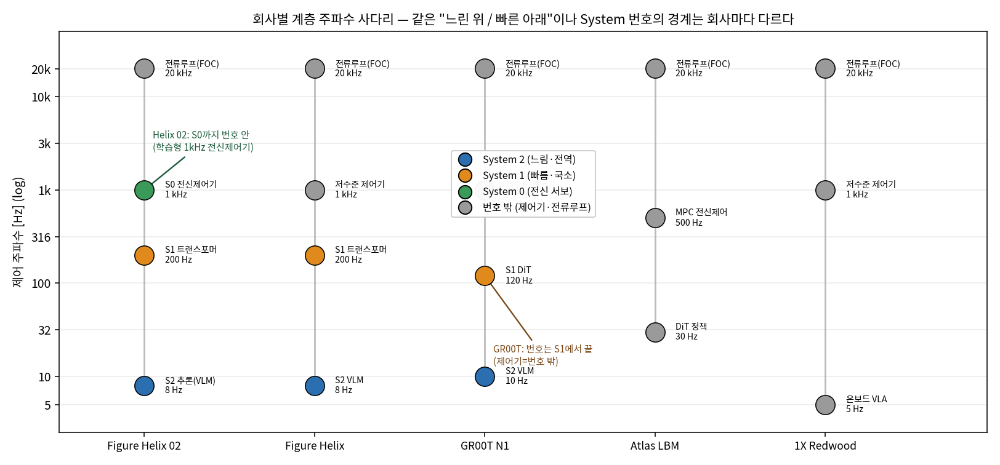
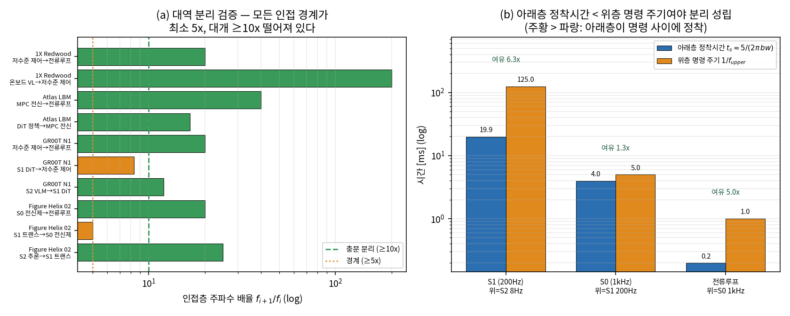
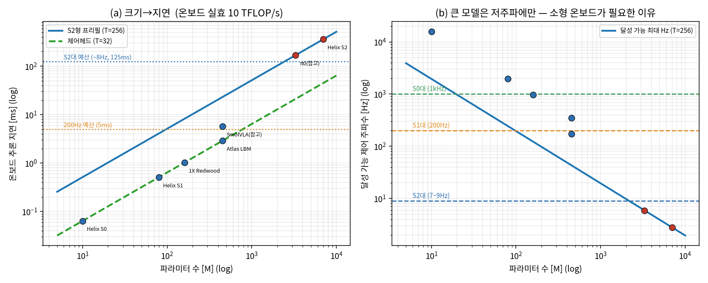

# Lec 48. 비공개 진영의 지향점 — 회사별 베팅으로 읽는 VLA 설계 철학

> Part 5 마지막 강의. 선수 지식: 42~47강 (특히 46강 GR00T의 dual-system, 45강 RECAP).
> 정보 기준일: 2026-07-08. 비공개 기업 정보는 유통기한이 짧다 — 학습 시점에 Claude에게 최신 소식 확인을 요청할 것.

## 한 장 요약

상용 로봇 AI 기업들을 두 축 위에 놓으면 각자의 "베팅"이 보인다.
가로축은 웹 지식(VLM 백본) 의존도, 세로축은 계층 분리 정도다. 참고용으로 오픈 진영의 π0.5와 GR00T도 함께 찍었다.



## 학습 목표

1. 주요 상용 기업 7곳(Figure, Skild, Tesla, 1X, BD+TRI, DeepMind, Agility)이 각각 어떤 모델 형태에 베팅하는지 한 문장씩으로 설명할 수 있다.
2. 상용 배포 제약(신뢰성, 온보드 추론, 지연)이 연구용 VLA와 다른 설계를 낳는 이유를 설명할 수 있다.
3. 회사 공개 자료에서 공학적 신호(파라미터 수, 제어 주파수, 데이터 시간)와 마케팅 신호를 구분할 수 있다.
4. "계층화", "데이터 플라이휠", "world model", "sim-trained 저수준 제어기"라는 4개 공통 패턴을 각 회사 사례로 뒷받침할 수 있다.

## 본문

### 0. 왜 비공개 진영을 공부하는가

오픈 논문은 벤치마크(LIBERO 성공률)에 최적화되고, 회사는 **배포**(하루 8시간 무중단, 온보드 컴퓨트, 고객 앞 신뢰성)에 최적화된다. 같은 문제를 다른 제약으로 풀 때 설계가 어떻게 갈라지는지 보여주는 자연 실험이다. 또한 이들은 논문 대신 기술 블로그로 공개하므로, "부분 공개 자료에서 아키텍처를 재구성하는 훈련"이 논문 읽기와는 다른 근육을 만들어 준다.

각 회사에 자료 신뢰도 등급을 붙였다:
**[A] 상세 공학 공개** (수치·구조 명시) / **[B] 블로그+논문 유추** / **[C] 강연·마케팅 수준**.

### 1. Figure AI — 계층 VLA의 끝까지 가보기 **[A]**

비공개 진영에서 가장 상세한 축에 드는 공개. 진화 순서가 그대로 교재다.

- **Helix** (2025.2): S2 = 7B VLM(7~9Hz, 장면·언어 이해) → 잠재 벡터 → S1 = 80M 트랜스포머(200Hz, 상반신 35-DoF 연속 제어). ~500시간 teleop + 자동 언어 라벨링. 온보드 임베디드 GPU에서 구동. GR00T·π0와 같은 시기에 같은 결론(주파수 분리)에 도달했다는 점이 중요.
- **Helix 물류 업데이트** (2025.2): 암묵적 스테레오 비전(토큰 수 불변), 학습 기반 시각 고유수용감각(EEF 6D 포즈 자가 캘리브레이션), "스포츠 모드"(테스트타임 청크 보간으로 시연자보다 빠르게 실행). 데이터 큐레이션만으로 1/3 데이터로 40% 향상 — 데이터 품질 신호.
- **Helix 02** (2026.1): 3계층으로 확장. S2(추론) → S1(200Hz, 머리+손바닥 카메라·지문 촉각 ~3g·전신 고유수용감각 입력, 전신 관절 목표 출력) → **S0 = 10M 전신 제어기(1kHz), 순수 시뮬레이션 훈련**(20만 병렬 환경 + 1,000시간+ 리타게팅 인간 모션). 공식 표현: "손으로 짠 C++ 109,504줄을 대체". 61개 loco-manipulation 동작의 4분 자율 시연.
- **Project Go-Big** (2025.9): 1인칭 인간 비디오로 인터넷 규모 사전학습, 인간→로봇 zero-shot 내비게이션 전이. Brookfield(주거 10만+ 유닛) 데이터 파트너십.
- 하드웨어·양산: Figure 03(2025.10, 촉각 지문·손바닥 카메라·양산 설계), BotQ 자체 공장(연 12,000대 캐파 — 회사 발표 수치).

**베팅 요약**: 웹 지식은 크게(7B), 제어는 빠르게(1kHz), 그 사이를 잠재 벡터로 연결. 전 스택 수직 통합.

### 2. Skild AI — "VLM 이식"에 반대하는 omni-bodied RL **[B]**

- **Skild Brain** 블로그(2025.7)의 주장: 로봇공학에는 "수조 개" 예시가 필요한데 실기 데이터로는 불가능 → **대규모 시뮬레이션 + 인터넷 인간 비디오**(인간 신체 = 또 하나의 형태일 뿐)로 사전학습, 실기 데이터는 post-training에만. VLA 주류를 정면 비판: "VLM에 로봇 데이터 1% 미만을 접붙이는 방식은 물리적 접지가 부족하다."
- 구조는 2계층: 저주파 고수준 조작/내비게이션 정책 → 고주파 저수준 정책(관절각/토크 출력). 파라미터 수 비공개.
- "omni-bodied": 하나의 모델이 사족·휴머노이드·팔·모바일 매니퓰레이터를 제어하고, 다리 하나가 고장 나도 재학습 없이 적응한다고 주장(데모 기반, 일부는 마케팅으로 걸러 볼 것).
- 방법을 유추할 창은 창업자(Pathak/Gupta, CMU)의 논문: **LocoFormer**(2025.9, arXiv 2509.23745) — 절차 생성된 로봇 수만 종에 대규모 RL + 강한 도메인 랜덤화, 에피소드 경계를 넘는 긴 컨텍스트로 in-context 적응(자기 넘어짐에서 배움). RMA(rapid motor adaptation) 계보의 연장.
- 규모: 시리즈 C $1.4B, 기업가치 $14B+(2026.1). ABB·UR·Foxconn 파트너십.

**베팅 요약**: 45강 RECAP과 대비하라 — PI는 "실기 데이터 + RL로 신뢰성", Skild는 "심 스케일 + 적응력". 데이터 철학의 양극단.

### 3. Tesla Optimus — 단일 end-to-end + 신경 시뮬레이터 **[C]**

- 공식 기술 문서가 없다. 확인 가능한 것: FSD의 end-to-end 아키텍처·인프라를 공유("FSD의 발전이 Optimus로 그대로 이전"), 카메라 8대 비전+고유수용감각 → 모터 명령의 단일 네트워크, 인간 비디오 모방 + 심 RL.
- 가장 실질적인 공개는 **신경 world simulator**(Elluswamy, ICCV 2025): 행동 조건부 비디오 생성 모델을 FSD와 Optimus 양쪽의 훈련·평가에 사용. 63강(world model)의 예고편.
- 파라미터·제어 주파수 비공개. 양산 일정은 반복 연기 이력이 있어 회의적으로 볼 것.

**베팅 요약**: "차와 로봇은 같은 문제"라는 인프라 재활용 베팅. 검증 불가능한 부분이 가장 많은 회사.

### 4. 1X Technologies — 작은 온보드 VLA + world model 평가 **[A-]**

- **Redwood**(2025.6): **~160M 파라미터, ~5Hz**, NEO의 임베디드 GPU에서 완전 온보드 구동. 비전·언어 임베딩·고유수용감각 입력, **디퓨전 정책 디코딩**, 보행+조작 통합(기대기, 버티기 같은 전신 동작). 실패 에피소드에서도 학습. 음성 대화는 오프보드 LLM.
- **1X World Model**: 행동 조건부 비디오 생성 모델을 학습된 시뮬레이터/정책 평가기로 사용 — 실행 전에 "이 행동을 하면 무슨 일이 벌어지는가"를 예측.
- **NEO 제품 전략**(2025.10 출시, $20,000 또는 월 $499): 모르는 작업은 **Expert Mode** — 예약된 인간 VR teleop이 대신 수행하고 그 데이터가 훈련으로 들어간다. teleop 폴백을 숨기지 않고 데이터 플라이휠로 제품화한 사례. 자율성 수준은 마케팅-현실 논쟁의 최전선.

**베팅 요약**: π0(3.3B)의 1/20 크기로 온보드 우선. "모델은 작게, 데이터 루프는 크게".

### 5. Boston Dynamics + TRI — LBM: 고전 전신 제어 위의 디퓨전 정책 **[A]**

- **TRI LBM 논문**(2025.7, arXiv 2507.05331): 언어+비전+고유수용감각 조건부 디퓨전 트랜스포머, flow matching 목적함수, 16-스텝 액션 청크, ~1,700시간 로봇 데이터. 핵심 발견: **멀티태스크 사전학습이 새 태스크에서 3~5배 데이터 효율** + 통계적으로 엄밀한 평가 방법론(57강과 연결).
- **Atlas LBM**(2025.10): **450M DiT, 30Hz**, 스테레오 이미지+고유수용감각+언어 → 전신 ~50 DoF loco-manipulation(스텝, 웅크리기, 무게중심 이동 포함)을 하나의 정책으로. BD의 기존 MPC급 전신 제어 역량 위에 얹힌다는 점이 GR00T System1(관절 직접 출력)과의 차이.
- 2026: 양산형 전기 Atlas(CES 2026), 2026년 물량 전부 현대 RMAC + **Google DeepMind**에 배정. BD-DeepMind 파트너십으로 Atlas에 Gemini Robotics 탑재 발표 — TRI LBM과 DeepMind 스택이 한 하드웨어에서 공존하게 됨.

**베팅 요약**: "제어는 우리가 세계 최고니까, 학습은 그 위에". 고전 로봇공학 자산을 버리지 않는 노선.

### 6. Google DeepMind (+Apptronik) — 플래너-실행기 2모델 **[A]**

- **Gemini Robotics 1.5 + ER 1.5**(2025.9, arXiv 2510.03342): ER(embodied reasoning VLM — 계획, 공간 추론, 웹/도구 호출)이 오케스트레이터로서 VLA(GR 1.5)를 부린다. GR 1.5는 **행동 전에 자연어로 사고**(thinking-before-acting)하고, **Motion Transfer** — ALOHA·양팔 Franka·Apptronik Apollo를 아우르는 통일 모션 표현 — 로 embodiment 간 zero-shot 스킬 전이.
- Apptronik: 하드웨어 파트너. Apollo 2 + "Robot Park"(2026.6, 90,000 sq ft 데이터 수집 공장). 시리즈 A 누적 $935M.

**베팅 요약**: 계층화를 한 모델 안(π0.5)이 아니라 **두 모델 사이**에 둔 형태. 48강 지도에서 Figure와 같은 사분면, 다른 구현.

### 7. Agility Robotics — 가장 보수적인, 그래서 흥미로운 **[A-]**

- "전신 제어 파운데이션 모델" = **1M 파라미터 미만 LSTM**("motor cortex"). Isaac Sim에서 수십 년치 심 시간을 3~4일에 학습, zero-shot sim-to-real, 자유공간 포즈 목표로 프롬프트. 상위 계층(태스크 로직, WorkOS)은 여전히 엔지니어링.
- Digit은 GXO 물류센터에 RaaS로 실전 배치 중 — **수익을 내는 로봇 중 가장 "덜 학습된" 스택**이라는 역설.

**베팅 요약**: 룰베이스 스택에서 WBC 한 층만 RL로 교체. 고전 로봇공학자가 가장 공감할 노선이자, "전부 end-to-end"가 정말 필요한가라는 질문 그 자체.

### 7.5. System 2 / 1 / 0 라벨 — 이 커리큘럼에서 처음 도입하되, 경계가 회사마다 다르다

지금까지 회사별로 "몇 계층인가"를 봤다. 이제 그 계층에 벤더들이 붙이는 이름 **System 2 / System 1 / System 0**을 도입한다. 이 라벨은 0강에서 예고하고 의도적으로 미뤄 둔 것이다 — **경계가 회사마다 달라서 전체 지도에는 못 쓰기 때문**이다. 여기(48강)와 63·64강에서만, 아래 세 개의 단서를 못 박고 쓴다.

**단서 1 — 번호는 "역할·속도"이지 "학습/룰"이 아니다.** System 번호가 큰 쪽(2)이 느리고 전역적(이해·계획), 작은 쪽(1, 0)이 빠르고 국소적(반응·서보)이다. 이것은 0강의 "느린 위 / 빠른 아래" 원리에 이름을 붙인 것일 뿐이다. **번호가 그 층이 학습됐는지 룰베이스인지를 말하지 않는다** — Helix 02의 S0는 옛날 손으로 짠 룰베이스 C++(공식 표현으로 109,504줄)를 **학습으로 대체**한 층이지만 여전히 "System 0"이다. 번호는 자리(빠른 최하단 전신 서보)를 가리키지 구현 방식을 가리키지 않는다.

**단서 2 — 번호가 "어디서 끝나는가"가 회사마다 다르다.** 아래 사다리(그림)가 핵심이다.

- **GR00T(N1) = 2층.** System 2 = VLM(~10Hz, 환경·언어 이해), System 1 = DiT(120Hz, 유창한 모터 액션 생성) [18]. **S1의 출력이 곧 행동 $a$**이고, 그 아래 저수준 관절 제어기는 **번호 밖**이다. 즉 GR00T의 System 번호는 S1에서 끝난다.
- **Helix 02 = 3층.** S2(추론) → S1(200Hz, 전신 관절 목표 출력) → **S0(1kHz, 학습형 전신 제어기)** [3]. Helix는 저수준 전신 서보까지 번호 안(S0)으로 끌어들였다. GR00T가 "번호 밖"에 둔 그 층을 Helix는 "System 0"이라 부른다.
- **전류 루프(FOC, 수 kHz~수십 kHz)는 두 회사 모두 번호 밖**이다 — 이것은 물리에 붙은 펌웨어(0강의 갈색 블록)라 어떤 벤더도 System 번호를 매기지 않는다.



*그림: 같은 "느린 위 / 빠른 아래" 스택인데 **빨간 점선(System 번호가 끝나는 자리)의 위치가 다르다**. GR00T는 S1(120Hz, 행동 $a$ 생성) 다음에서 번호가 끝나고 그 아래 ~1kHz 관절 제어기는 회색(번호 밖). Helix 02는 같은 자리의 1kHz 전신 서보를 **System 0**(초록)으로 번호 안에 넣었다 — 게다가 그 S0는 옛 룰베이스 C++를 학습으로 대체한 층이다. 전류루프(20kHz)는 둘 다 번호 밖. 출처: [3][18], gen_figs.py 재현.*

**단서 3 — PI(π 패밀리)와 DeepMind은 "System" 용어를 아예 안 쓴다.** 같은 "느린 위 / 빠른 아래" 구조를 PI는 π0.5의 **계층적(hierarchical) 추론**(고수준 서브태스크 추론 + 저수준 flow 액션, 45강)으로, DeepMind은 **orchestrator**(ER 1.5 플래너)가 실행기(GR 1.5)를 부린다는 표현으로 쓴다 [15]. 구조는 유사하나 어휘가 다르다 — 그래서 "System 2가 뭐냐"를 회사 사이에서 물으면 답이 엇갈린다. **이 어휘 불일치 자체가 이 강의의 교훈**이다: 라벨이 아니라 각 층의 역할·주파수·인터페이스를 봐야 한다. (dual-system 계보 서베이는 [18][19].)



*그림: 회사별 계층을 log 주파수 축에 세운 사다리. 색이 System 번호(파랑 S2 / 주황 S1 / 초록 S0 / 회색 번호 밖). 다섯 회사 모두 "느린 위 → 빠른 아래" 원리는 같지만, **번호가 끝나는 지점이 다르다** — Helix 02는 S0(1kHz)까지 초록으로 번호 안, GR00T는 S1(120Hz) 다음의 제어기가 회색(번호 밖). 1X Redwood는 단일 온보드 정책이라 번호를 안 붙인다. 출처: [3][18], gen_figs.py 재현.*

### 핵심 수식

계층형 스택이 "왜 이 주파수들"인지를 두 개의 부등식이 결정한다. 하나는 **층 사이**(대역 분리), 하나는 **한 층 안**(모델 크기 ↔ 온보드 지연)이다. 둘 다 0강 E3의 연장이다.

#### E1. 계층 대역 분리 조건 — 각 층 명령 변화 ≪ 아래층 대역폭

**① 직관**: 위층이 느려도 로봇이 부드러운 이유는 아래층이 그 사이를 메우기 때문이다(0강 ZOH). 이것이 성립하려면 **아래층이 위층의 명령 하나를 "다 소화"한 뒤 다음 명령이 와야** 한다 — 위층 명령이 너무 빨리 바뀌면 아래층은 목표를 쫓다 만 채 새 목표를 받아 진동한다. 그래서 인접 두 층은 주파수가 충분히 벌어져 있어야 한다.

**② 물리·기하적 의미**: "충분히 벌어짐"을 두 방식으로 잰다. (a) **주파수 배율** $f_{i+1}/f_i$ — 경험칙으로 5배면 경계, 10배면 충분(제어 이론의 "한 decade 분리" 관행). (b) **정착시간 대 명령주기** — 아래층 폐루프가 새 셋포인트에 정착하는 데 걸리는 시간 $t_s$가 위층 명령 주기 $1/f_{\text{upper}}$보다 짧아야 한다. 두 번째가 더 엄밀하다: 배율이 같아도 아래층 대역폭이 낮으면(정착이 느리면) 분리가 깨질 수 있다.

**③ 형식 (유도 요점)**: 아래층 폐루프 대역폭을 $bw \approx f_{\text{layer}}/5$(보수적)로 잡으면 1차 근사 시상수 $\tau = 1/(2\pi\, bw)$, 정착시간(≈5τ, 99%)은
$$
t_s \;\approx\; \frac{5}{2\pi\, bw} \;=\; \frac{25}{2\pi\, f_{\text{layer}}}, \qquad
\text{분리 조건: } \quad \frac{1}{f_{\text{upper}}} \;>\; t_s.
$$
그리고 위층이 주입하는 **지연** 관점에서는 0강 E3의 그 부등식이 그대로 온다 — 위상여유 $\phi_m$, 교차 주파수 $\omega_c$인 아래층 루프가 견디는 최대 지연은
$$
\boxed{\;\tau_{d,\max} \;\approx\; \dfrac{\phi_m}{\omega_c}\;}
$$
위층 명령 주기가 이 $\tau_{d,\max}$를 넘으면(즉 위층이 아래층 대역폭보다 빠르게 명령을 바꾸면) 위상이 깎여 불안정해진다. **계층화는 공짜가 아니라 이 대역 분리라는 계약 위에 선다** — Helix가 7-9 / 200 / 1000Hz라는 세 숫자를 고른 것은 미학이 아니라 이 부등식의 해다.



*그림: (a) 회사별 인접층 주파수 배율 — 모든 경계가 최소 5x(주황 점선), 대개 ≥10x(초록 점선). 주황 막대(경계)는 Helix 02의 S1→S0(정확히 5x)와 GR00T의 S1→저수준(8.3x) — 가장 촘촘히 붙은 두 층이다. (b) Helix 02 하위 세 층의 정착시간(파랑) vs 위층 명령 주기(주황). 주황 > 파랑이면 아래층이 명령 사이에 정착 → 분리 성립. S0층 여유가 1.3x로 가장 빠듯한데, 이는 (a)의 "S1→S0 = 5x"와 같은 사실의 두 얼굴이다 — Helix가 의도적으로 가장 촘촘하게 결합한 경계. gen_figs.py 재현.*

#### E2. 온보드 추론 지연 예산 — 파라미터 → FLOP → 지연

**① 직관**: 큰 모델은 정확하지만 느리다. 로봇은 클라우드를 못 기다리므로(지연·연결 끊김·안전) **온보드**에서 돌려야 하고, 온보드 가속기는 데이터센터 GPU보다 훨씬 약하다. 그래서 "모델을 얼마나 키우면 어느 주파수까지 온보드로 돌 수 있는가"가 계층을 나누는 두 번째 강제력이다.

**② 물리·기하적 의미**: 트랜스포머의 forward 1회 연산량은 대략 파라미터 수 $N$에 비례하고(토큰당 $\approx 2N$ FLOP), 한 번의 추론이 처리하는 토큰 수 $T$에 비례한다. 지연은 이 연산량을 온보드 실효 처리량으로 나눈 것. **S2(VLM)는 이미지 패치+언어를 프리필**하므로 $T$가 수백, **제어 헤드(S1/S0)는 짧은 상태·액션 청크**라 $T$가 수십 — 같은 파라미터라도 S2가 훨씬 느리다. 이 부등식이 "위층은 크고 느리게, 아래층은 작고 빠르게"를 **강제**한다(선택이 아니라).

**③ 형식 (유도 요점)**: 온보드 실효 처리량 $P_{\text{eff}}$(배치 1 디코딩은 memory-bound라 peak의 일부), 처리 토큰 $T$에 대해
$$
\text{latency} \;\approx\; \frac{2\,N\,T}{P_{\text{eff}}}, \qquad
f_{\max} \;=\; \frac{1}{\text{latency}} \;=\; \frac{P_{\text{eff}}}{2\,N\,T}.
$$
$f_{\max}$가 $N$에 **반비례**한다는 것이 핵심 — 파라미터를 10배 키우면 달성 가능 주파수가 1/10로 떨어진다. 7B를 온보드에서 200Hz(5ms 예산)로 돌리는 것은 불가능하고(아래 WE에서 72배 초과), 그래서 7B는 7~9Hz의 S2로만 살 수 있다. 반대로 80M은 같은 하드웨어에서 1kHz 넘게 돌아 S1/S0 자리에 들어간다.



*그림: (a) 파라미터 수 → 온보드 추론 지연(실효 10 TFLOP/s 가정). 파란 실선은 S2형 프리필(T=256), 초록 점선은 제어 헤드(T=32). 두 예산선: 200Hz(5ms)·S2대(~8Hz, 125ms). (b) 같은 축을 "달성 가능 최대 주파수"로 뒤집은 것 — $f_{\max}\propto 1/N$이라 우하향. 세 밴드(S2 7~9Hz / S1 200Hz / S0 1kHz)에 각 모델이 어디 떨어지는지: 7B·3.3B는 S2대에만, 10~160M은 S1/S0대까지 올라간다. gen_figs.py 재현. (실효 처리량·토큰 수는 자릿수 추정치 — 절대값이 아니라 $\propto N$ 스케일링을 읽을 것.)*

### Worked Example

#### WE-1 (손계산): Helix 02의 세 주파수는 대역 분리를 만족하는가

Helix 02의 공개 세 층 [3]: S2 추론 7~9Hz(대표 8Hz), S1 200Hz, S0 1kHz. 여기에 번호 밖 전류루프 20kHz를 더한다. **인접 배율**을 손으로:

$$
\frac{f_{\text{S1}}}{f_{\text{S2}}} = \frac{200}{8} = 25,\quad
\frac{f_{\text{S0}}}{f_{\text{S1}}} = \frac{1000}{200} = 5,\quad
\frac{f_{\text{전류}}}{f_{\text{S0}}} = \frac{20000}{1000} = 20.
$$

읽는 법: S2→S1은 25배로 넉넉하고, **S1→S0는 정확히 5배 — 경계선**이다. Helix가 S0를 1kHz로 (더 높이지 않고) 둔 것은 S1의 200Hz와 딱 한 옥타브 반만 벌린, 가장 촘촘한 결합이다.

정착시간으로 다시 확인하자(E1의 $t_s\approx 25/(2\pi f_{\text{layer}})$, 각 층의 정착을 **그 위층의 명령 주기**와 비교):

| 아래층 | 정착시간 $t_s$ | 위층 명령 주기 $1/f_{\text{upper}}$ | 여유 |
|---|---|---|---|
| S1 (200Hz) | $25/(2\pi\cdot200)\approx19.9$ms | S2 8Hz → 125ms | 6.3x |
| S0 (1kHz) | $25/(2\pi\cdot1000)\approx4.0$ms | S1 200Hz → 5ms | **1.3x (빠듯)** |
| 전류루프 (20kHz) | $\approx0.2$ms | S0 1kHz → 1ms | 5.0x |

셋 다 "정착 < 위층 주기"로 분리는 성립하되, **S0가 여유 1.3x로 가장 빠듯** — 이것이 배율 5x와 정확히 같은 사실의 다른 표현이다(그림 fig2b).

GR00T와 비교(2층): $200\,(\text{S1 대신 DiT }120)/10 = 12$배(S2→S1), 그 아래 저수준 제어기(가정 1kHz)까지 $1000/120 = 8.3$배. GR00T의 S1→제어기 경계(8.3x)가 Helix의 S1→S0(5x)보다 오히려 넉넉한데, 이는 GR00T가 그 경계를 **번호 밖**(별도 제어기)에 두어 결합을 느슨하게 설계했음을 시사한다 — 번호를 어디서 끊느냐가 대역 설계와 연결된다.

#### WE-2 (코드): 온보드 지연으로 "왜 소형 온보드인가"를 재현

E2를 numpy로 재현한다. 실제 모델·GPU 없이, 공개 파라미터 수와 자릿수 추정 처리량만으로 **왜 7B는 S2로만, 80M은 S1으로 사는지**를 계산한다. 아래는 `gen_figs.py`의 핵심이다:

```python
import numpy as np
ONBOARD_TFLOPS = 10.0e12          # 온보드 실효 FLOP/s (임베디드, 배치1 memory-bound 스케일)
def latency_ms(params, t_ctx, tput=ONBOARD_TFLOPS):
    return 2.0 * params * t_ctx / tput * 1000.0     # FLOP ≈ 2·N·T
def max_hz(params, t_ctx): return 1000.0 / latency_ms(params, t_ctx)

# S2(VLM, 프리필 T=256) vs 제어헤드(T=32)
print("Helix S2 7B :", round(latency_ms(7e9, 256), 1), "ms →", round(max_hz(7e9,256),1), "Hz")
print("Helix S1 80M:", round(latency_ms(80e6, 32), 2), "ms →", round(max_hz(80e6,32),0), "Hz")
print("7B를 200Hz(5ms)로?", round(latency_ms(7e9,256)/5, 0), "배 초과")
```

출력:

| 모델 (층) | 파라미터 | 처리 토큰 T | 온보드 지연 | 최대 주파수 | 어느 밴드 |
|---|---|---|---|---|---|
| Helix S2 | 7B | 256 (프리필) | **358 ms** | 2.8 Hz | S2대(7~9Hz)에만 |
| π0 (참고) | 3.3B | 256 | 169 ms | 5.9 Hz | S2대 |
| SmolVLA (참고) | 450M | 64 | 5.8 ms | 174 Hz | S1대 언저리 |
| Atlas LBM | 450M | 32 | 2.9 ms | 347 Hz | S1대 |
| 1X Redwood | 160M | 32 | 1.0 ms | 977 Hz | S0대까지 |
| Helix S1 | 80M | 32 | 0.51 ms | 1953 Hz | S1/S0대 |
| Helix S0 | 10M | 32 | 0.06 ms | 15625 Hz | S0대 여유 |

읽는 법 세 가지. ① **7B를 200Hz로 온보드 구동은 72배 초과**(358ms vs 5ms 예산) — 물리적으로 불가능. 그래서 7B는 7~9Hz의 S2로만 산다. (주의: 이 순진한 계산은 2.8Hz로 나와 관측된 7~9Hz보다 오히려 느린데, 실제 시스템은 양자화·연산 최적화·병렬화로 이 격차를 메워 7~9Hz에 도달한다 — 방향과 자릿수만 읽을 것.) ② **80M S1은 같은 하드웨어에서 1953Hz까지** 여유 — 200Hz 예산(5ms) 안에 넉넉히 들어와 200Hz로 돌 수 있다. ③ $f_{\max}\propto 1/N$이 그대로 보인다: 7B→80M로 87배 줄이면 주파수가 그만큼 오른다. **"모델은 작게, 데이터 루프는 크게"라는 1X·SmolVLA의 베팅, "위 크고 아래 작게"라는 Helix의 3계층 — 둘 다 이 부등식의 서로 다른 해**다.

### 8. 공통 패턴 4가지 (시험에 나올 부분)

1. **주파수 계층화가 상용의 대세**: Helix(7-9/200/1000Hz), GR00T(10/120Hz), Gemini(ER↔VLA), Skild(고/저주파 2계층). 단일 모델·단일 주파수는 연구 진영(OpenVLA)과 소형 온보드(Redwood)에서만.
2. **teleop 폴백의 제품화 = 데이터 플라이휠**: 1X Expert Mode, Figure Go-Big/Brookfield, Apptronik Robot Park. "자율성 실패"를 "데이터 수집"으로 재정의.
3. **world model의 침투**: Tesla 신경 시뮬레이터(훈련·평가), 1X WM(실행 전 평가), NVIDIA Cosmos/DreamZero(합성 데이터·zero-shot 정책). 63강의 주제가 이미 상용에 들어와 있다.
4. **저수준 제어기의 sim-trained 대체**: Helix 02의 S0, Agility의 LSTM — 고전 WBC가 담당하던 층이 RL로 교체되는 중. 단, 그 위 계층 설계는 회사마다 정반대.

### 로봇공학자를 위한 번역

계층형 VLA는 **cascade 제어의 학습판**이다. Helix 02의 S2/S1/S0는 태스크 플래너 / 궤적 생성기 / 전신 서보 제어기의 3-루프 구조와 1:1 대응하고, 루프 간 인터페이스가 "정의된 신호(궤적, 셋포인트)"에서 "학습된 잠재 벡터"로 바뀌었을 뿐이다. 바깥 루프가 느리고 안쪽 루프가 빠른 이유(대역폭 분리)도 동일하다. Agility는 아예 기존 cascade에서 최내곽 루프 하나만 신경망으로 바꾼 경우다. 반대로 Tesla/1X의 단일 네트워크는 "루프 분리 없이 하나의 고차 제어기"에 해당하며, 그래서 제어 주파수가 전체 시스템에서 가장 느린 요소(추론 지연)에 묶인다.

## 흔한 오해

1. **"System 2 / 1 / 0 번호가 회사 사이에서 같은 것을 가리킨다"** — 아니다. 번호는 **역할·속도의 슬롯**이지 고정된 모듈이 아니다. Helix 02의 System 0(1kHz 전신 서보)은 GR00T에는 아예 번호가 없는 "번호 밖 제어기"에 대응한다(WE-1). "이 논문의 System 1이 저 논문의 System 1과 같겠지"라는 가정이 논문 비교의 단골 오류다 — 항상 그 층의 **주파수·입출력·인터페이스**를 확인하라. GR00T·48강처럼 dual-system을 명시적으로 쓰는 모델에서도 경계는 회사마다 그어지는 자리가 다르다.
2. **"System 번호가 학습됐는지 룰베이스인지를 말한다"** — 무관하다. Helix S0는 옛 룰베이스 C++(109,504줄)를 **학습으로 대체**한 층이지만 이름은 여전히 System 0이다(단서 1). 번호는 자리를 가리키지 구현을 가리키지 않는다. "System 0 = 저수준 = 당연히 룰베이스"라는 연상은 틀렸다.
3. **"큰 모델일수록 좋으니 온보드도 최대한 크게"** — E2의 $f_{\max}\propto 1/N$이 이를 막는다. 7B는 온보드에서 S1 주파수(200Hz)를 못 낸다(72배 초과, WE-2). 그래서 상용은 "큰 것은 느린 위층(S2), 빠른 아래층(S1/S0)은 작게"로 **쪼갠다**. 1X·SmolVLA의 소형 온보드 베팅도 같은 부등식의 다른 해다 — 크기는 목적이 아니라 지연 예산의 종속변수다.
4. **"계층을 나눴으니 주파수는 아무렇게나 잡아도 된다"** — E1의 대역 분리가 이를 막는다. 인접층은 최소 5배(경계)~10배(충분) 벌어져야 하고, Helix가 7-9 / 200 / 1000Hz를 고른 것은 이 부등식의 해다(WE-1). 주파수를 임의로 좁히면 아래층이 명령 사이에 정착하지 못해 진동한다(그림 fig2b, S0 여유 1.3x가 이미 빠듯).
5. **"Tesla/1X처럼 단일 네트워크면 계층·대역 분리 얘기는 무관하다"** — 여전히 유효하다. 단일 네트워크는 대역 분리를 **없앤 것이 아니라 하나의 주파수로 묶은 것**이라, 전체 제어 주파수가 가장 느린 요소(추론 지연, E2)에 발목 잡힌다. Redwood가 5Hz인 것이 그 대가다 — 그래서 그 아래에 여전히 번호 밖 저수준 제어기가 대역을 벌려 받쳐 준다.

## 실습 (45분, GPU 불필요)

**7사 비교표 완성하기.** Claude와 함께 아래 표의 빈칸을 1차 자료(부록 B 링크)에서 찾아 채운다. 못 찾는 칸은 "비공개"로 표시 — 어느 칸이 비어 있는지 자체가 각 사의 공개 전략을 보여준다.

| 회사 | 백본/파라미터 | 계층 수 | 각 층 주파수 | 액션 디코딩 | 데이터 전략 | 신뢰도 |
|---|---|---|---|---|---|---|
| Figure | | | | | | |
| Skild | | | | | | |
| Tesla | | | | | | |
| 1X | | | | | | |
| BD+TRI | | | | | | |
| DeepMind | | | | | | |
| Agility | | | | | | |

완성 후: 표를 보고 "5년 뒤 어느 베팅이 이길 것 같은가"를 논거와 함께 Claude에게 설명하고 반박을 받아본다.

## Claude와 토론할 질문

1. Skild의 "VLM에 로봇 데이터 1% 접붙이기" 비판은 타당한가? π0.5의 co-training 결과(45강)는 이 비판에 대한 반박 근거가 되는가?
2. Helix 02의 S0(1kHz, sim-trained)가 대체한 것은 정확히 무엇인가? 고전 WBC(QP 기반 전신 제어)와 입출력·보장성 측면에서 뭐가 다른가?
3. 왜 상용 진영은 거의 전부 계층형인가? 연구 논문(OpenVLA 등)이 단일 모델을 선호하는 이유와 어떻게 갈리나?
4. 1X의 Expert Mode는 데이터 전략인가, 자율성 미달의 은폐인가? 두 해석 각각의 근거는?
5. BD+TRI처럼 "MPC 위에 정책"을 얹는 방식과 GR00T처럼 정책이 관절을 직접 내는 방식 — 접촉이 많은 작업에서 각각 어떻게 실패할까?
6. Agility의 <1M LSTM이 "파운데이션 모델"이라 불릴 자격이 있는가? 파운데이션 모델의 정의는 크기인가 역할인가?
7. 7개 회사 중 공개 자료만으로 재현 시도가 가능한 곳은 어디까지인가?

## 읽을거리

1. **Figure Helix 블로그 3부작** (helix → helix-logistics → helix-02, 각 10~15분): 비공개 진영에서 가장 논문에 가까운 공개. 전문을 읽을 것.
2. **Skild "Building the general-purpose robotic brain"** 블로그 (15분): 주장-근거 구조를 비판적으로 읽을 것. LocoFormer(arXiv 2509.23745)는 초록과 Fig 1만.
3. (선택) TRI LBM 프로젝트 페이지: 초록 + 평가 방법론 섹션만 — 57강에서 다시 만난다.

## 자가 점검

1. 7개 회사 각각의 베팅을 한 문장씩, 자료를 안 보고 말할 수 있는가?
2. Helix 02의 세 층(S2/S1/S0)의 파라미터 규모·주파수·훈련 방식을 말할 수 있는가?
3. "데이터 플라이휠" 패턴을 세 회사 사례로 설명할 수 있는가?
4. 계층형이 상용에서 지배적인 이유를 대역폭/지연 관점에서 설명할 수 있는가?
5. 회사 발표 자료에서 신뢰할 수치와 걸러야 할 주장을 구분하는 기준 세 가지를 말할 수 있는가?
6. GR00T(2층)와 Helix 02(3층)에서 **System 번호가 어디서 끝나는지**를 그리고, 그 차이가 "번호는 역할이지 구현이 아니다"라는 원리와 어떻게 연결되는지 말할 수 있는가? PI·DeepMind이 왜 "System" 용어를 안 쓰는지도.
7. E1 대역 분리 조건으로 Helix의 7-9 / 200 / 1000Hz 세 배율(25x / 5x / 20x)을 손으로 내고, 어느 경계가 가장 빠듯한지(S1→S0, 5x) 짚을 수 있는가?
8. E2로 "7B는 왜 온보드에서 S1 주파수를 못 내고, 80M은 왜 낼 수 있는가"를 $f_{\max}\propto 1/N$으로 설명할 수 있는가?

## 참고문헌

> 본문 수치·주장의 출처. 웹 문서는 2026-07-08 접속 기준. (2차) = 언론 보도. 비공개 기업 특성상 회사 발표 수치가 다수 — 본문의 신뢰도 등급([A]/[B]/[C])과 함께 볼 것.

[1] Figure AI, "Helix: A Vision-Language-Action Model for Generalist Humanoid Control," 기술 블로그, 2025.2. https://www.figure.ai/news/helix
— **뒷받침**: S2 7B VLM 7~9Hz / S1 80M 200Hz, 상반신 35-DoF, ~500시간 teleop+자동 언어 라벨, 온보드 임베디드 GPU.

[2] Figure AI, "Helix in Logistics," 2025.2. https://www.figure.ai/news/helix-logistics
— **뒷받침**: 암묵적 스테레오(토큰 수 불변), 학습 기반 시각 고유수용감각, 스포츠 모드, 큐레이션 데이터 1/3로 40% 향상, 스테레오로 처리량 60% 증가.

[3] Figure AI, "Helix 02," 2026.1. https://www.figure.ai/news/helix-02
— **뒷받침**: 3계층(S2/S1 200Hz/S0 10M@1kHz), S0 순수 시뮬 훈련(20만 병렬 환경, 1,000시간+ 리타게팅 인간 모션), "C++ 109,504줄 대체", 61개 loco-manipulation 동작 4분 자율 시연, 지문 촉각 ~3g.

[4] Figure AI, "Project Go-Big," 2025.9. https://www.figure.ai/news/project-go-big — **뒷받침**: 인간 1인칭 영상 사전학습, 인간→로봇 zero-shot 내비게이션, Brookfield 파트너십.

[5] Figure AI, "Introducing Figure 03" (2025.10) · "BotQ". https://www.figure.ai/news/introducing-figure-03 · https://www.figure.ai/news/botq — **뒷받침**: 양산 설계 전환, 연 12,000대 캐파(회사 발표 수치).

[6] Skild AI, "Building the general-purpose robotic brain," 블로그, 2025.7. https://www.skild.ai/blogs/building-the-general-purpose-robotic-brain
— **뒷받침**: omni-bodied 논지, 2계층(저주파 고수준→고주파 관절/토크), 심+인간 영상 사전학습, "로봇 데이터 1% 미만 접붙이기" 비판, 파라미터 비공개.

[7] LocoFormer, arXiv:2509.23745, 2025.9. https://arxiv.org/abs/2509.23745 — **뒷받침**: 절차 생성 로봇 대규모 RL, 에피소드 경계 넘는 컨텍스트의 in-context 적응 (Skild 방법 유추의 창).

[8] (2차) The Robot Report, "Skild AI raises $1.4B...," 2026.1. https://www.therobotreport.com/skild-ai-raises-1-4b-building-omni-bodied-robot-skild-brain/ — **뒷받침**: 시리즈 C $1.4B, 기업가치 $14B+, 파트너십.

[9] (2차) Teslarati, Elluswamy 강연 보도. https://www.teslarati.com/tesla-vp-explains-why-end-to-end-ai-future-self-driving/ — **뒷받침**: FSD-Optimus 인프라 공유, 신경 world simulator(ICCV 2025). Tesla는 공식 기술 문서 부재 — 본문 [C] 등급의 근거.

[10] 1X Technologies, "Redwood AI," 2025.6. https://www.1x.tech/discover/redwood-ai — **뒷받침**: ~160M@~5Hz 완전 온보드, 디퓨전 정책 디코딩, 보행+조작 통합, 1X World Model(행동 조건부 영상 생성 평가기).

[11] 1X, NEO 제품 페이지 + (2차) Humanoids Daily 출시 보도, 2025.10. https://www.1x.tech/neo · https://www.humanoidsdaily.com/news/1x-details-neo-human-in-the-loop-strategy-and-hardware-as-pre-orders-go-live — **뒷받침**: $20,000/월 $499, Expert Mode(예약 VR teleop) 데이터 전략.

[12] Toyota Research Institute, "A Careful Examination of Large Behavior Models for Multitask Dexterous Manipulation," arXiv:2507.05331, 2025.7. https://arxiv.org/abs/2507.05331 · 프로젝트: https://toyotaresearchinstitute.github.io/lbm1/
— **뒷받침**: 언어 조건부 DiT+flow matching, 16스텝 청크, ~1,700시간, 멀티태스크 사전학습 3~5배 데이터 효율, 엄밀한 통계 평가.

[13] Boston Dynamics, "Large behavior models help Atlas find new footing," 블로그, 2025.10. https://bostondynamics.com/blog/large-behavior-models-atlas-find-new-footing/ — **뒷받침**: Atlas LBM 450M DiT@30Hz, ~50 DoF 전신 loco-manipulation, 스테레오+고유수용감각+언어 입력.

[14] Boston Dynamics, "Boston Dynamics & Google DeepMind form new AI partnership," 2026.1. https://bostondynamics.com/blog/boston-dynamics-google-deepmind-form-new-ai-partnership/ — **뒷받침**: Atlas에 Gemini Robotics 탑재, 2026년 물량 현대 RMAC+DeepMind 배정.

[15] Google DeepMind, "Gemini Robotics 1.5" 기술 보고서, arXiv:2510.03342, 2025.9. https://arxiv.org/abs/2510.03342 — **뒷받침**: ER 1.5 오케스트레이터 + GR 1.5 실행기, thinking-before-acting, Motion Transfer(ALOHA/양팔 Franka/Apollo).

[16] Apptronik 보도자료. https://apptronik.com/news-collection/apptronik-partners-with-google-deepmind-robotics · https://apptronik.com/news-collection/welcome-to-robot-park-where-apptroniks-apollo-goes-to-work — **뒷받침**: DeepMind 하드웨어 파트너, Robot Park(90,000 sq ft, 2026.6), 시리즈 A 누적 $935M.

[17] Agility Robotics, "Training a whole-body control foundation model," 기술 블로그. https://www.agilityrobotics.com/content/training-a-whole-body-control-foundation-model — **뒷받침**: <1M LSTM "motor cortex", Isaac Sim 3~4일(수십 년치 심 시간), zero-shot sim2real, 상위 계층은 엔지니어링(WorkOS).

[18] NVIDIA, "GR00T N1: An Open Foundation Model for Generalist Humanoid Robots," arXiv:2503.14734, 2025.3. https://arxiv.org/abs/2503.14734 — **뒷받침**: §7.5·WE-1 — dual-system(System 2 VLM + System 1 DiT, end-to-end 공동학습, S1이 실시간 모터 액션 생성), GR00T의 번호가 S1에서 끝나고 저수준 제어기는 번호 밖이라는 2층 경계. 46강과 동일 계보.

[19] C. Cui et al., "OpenHelix: A Short Survey, Empirical Analysis, and Open-Source Dual-System VLA Model for Robotic Manipulation," arXiv:2505.03912, 2025.5. https://arxiv.org/abs/2505.03912 — **뒷받침**: §7.5·흔한 오해 1 — 기존 dual-system(느린 S2 / 빠른 S1) 아키텍처의 구조 설계를 정리·비교, 경계가 모델마다 다르게 그어짐을 뒷받침하는 서베이.

*수치 재현성: 본문·그림의 모든 정량 수치는 `images/lec48/gen_figs.py`(numpy/matplotlib, CPU만)의 실행 출력이다. — **E1·WE-1·fig1·fig2**: Helix 02 인접층 배율 25x / 5x / 20x, GR00T 12x / 8.3x, 정착시간 분리 여유(S1 6.3x · S0 1.3x · 전류루프 5.0x); 층 주파수는 공개 1차 자료([1][3][18][10][13])의 값. **E2·WE-2·fig3**: 온보드 지연·최대 주파수(Helix S2 7B→358ms/2.8Hz, π0 3.3B→169ms/5.9Hz, SmolVLA 450M→5.8ms/174Hz, Atlas 450M→2.9ms/347Hz, Redwood 160M→1.0ms/977Hz, Helix S1 80M→0.51ms/1953Hz, Helix S0 10M→0.06ms/15625Hz, 7B의 200Hz 예산 72배 초과) — 파라미터 수는 1차 자료, 온보드 실효 처리량(10 TFLOP/s)·처리 토큰 수(S2형 256 / 제어헤드 32)는 자릿수 추정치이며 $f_{\max}\propto 1/N$ 스케일링을 보이기 위한 것(절대값 아님). numpy 1.26 / matplotlib 3.5 기준 재현 확인.*

<!-- lecture-nav -->

---

⬅ 이전: [Lec 47. 작은 모델들과 계보도 총정리 — SmolVLA에서 세 논쟁 축까지](lec47-small-models-lineage.md)　｜　[📖 전체 목차](../README.md)　｜　다음: [Lec 49. VLA 로봇 하드웨어 지형도 — 학습 정책의 눈으로 본 로봇](../part11-real-robot-integration/lec49-robot-hardware.md) ➡
