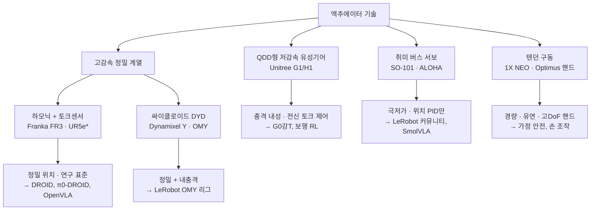
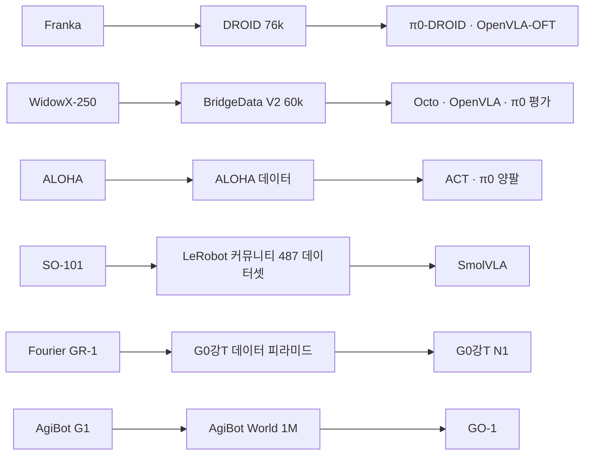

# Lec 49. VLA 로봇 하드웨어 지형도 — 학습 정책의 눈으로 본 로봇

> Part 6 첫 강의. 선수 지식: 38강(ACT/ALOHA), 46강(G0강T), 47강(SmolVLA).
> 이 강의는 회원님의 홈그라운드다. 관전 포인트는 반대 방향 — "학습 정책에게 이 하드웨어가 어떻게 보이는가".
> 정보 기준일: 2026-07-08 (스펙은 공식 문서 검증).

## 한 장 요약

액추에이터 선택이 로봇의 계층과 용도를 가른다.

\* UR은 관절 토크센서 없이 하모닉 + 플랜지 F/T 옵션 구성. 싸이클로이드는 하모닉과 같은 "고감속 정밀" 부류지만 충격 내성 축에서 갈라진다 (4절).

## 학습 목표

1. VLA 연구에 쓰이는 대표 매니퓰레이터 6종·휴머노이드 7종의 자유도·센서·제어 인터페이스를 표로 재구성할 수 있다.
2. 하모닉/싸이클로이드/QDD/SEA/버스서보/텐던의 트레이드오프를 "학습 정책에 미치는 영향" 관점에서 설명할 수 있다.
3. VLA가 depth 없이 RGB 웹캠만으로 작동하는 이유를 두 가지 이상 댈 수 있다.
4. 플랫폼↔데이터셋↔모델의 대응 관계(어느 로봇이 어느 데이터를 만들었나)를 그릴 수 있다.

## 본문

### 0. 왜 하드웨어가 VLA를 결정하는가

VLA 논문에서 하드웨어는 한 문단으로 지나가지만, 실제로는 세 가지를 하드웨어가 결정한다:
**① action space** (토크 인터페이스가 없으면 위치 제어 정책만 가능), **② 달성 가능한 제어 주기** (50강의 주제), **③ 데이터 수집 비용** (teleop 리그 가격이 데이터셋 규모를 결정 — ALOHA ~$2~3만 vs SO-101 ~$130의 차이가 곧 LeRobot 커뮤니티 데이터셋 폭발의 이유).

### 1. 연구용 매니퓰레이터 — 스펙 비교

| 플랫폼 | DoF | 페이로드/리치 | 액추에이터 | 토크 감지 | 제어 인터페이스 | 대표 용도 |
|---|---|---|---|---|---|---|
| **Franka Panda/FR3** | 7 | 3kg / 855mm | 하모닉(전관절) | **전 7관절 스트레인게이지 토크센서** | **FCI 1kHz**: 토크/관절 위치·속도/Cartesian + 내장 임피던스 | DROID, π0-DROID, 연구 표준 |
| **UR5e** | 6 | 5kg / 850mm | 하모닉 | 관절 토크센서 없음 (플랜지 F/T 추정) | **RTDE 500Hz** (CB3는 125Hz), servoj/speedj | 산업 연계 연구 |
| **WidowX-250** | 6 | ~250g | Dynamixel 서보 | 없음 | 위치 명령 (서보 버스) | **BridgeData V2** (~$3k 랩 표준) |
| **ALOHA 2** | 6×2 (양팔) + 리더 2 | ~750g/팔 | Dynamixel 서보 | 없음 | 리더-팔로워 관절 미러링, 50Hz | ACT, π0 양팔 데이터 |
| **Robotis OMY** | 6 | 3kg | **Dynamixel Y** (DYD 싸이클로이드) | 모터 전류 기반 | RS-485/EtherCAT, ROS 2 네이티브, 리더(L100)-팔로워(F3M) | LeRobot 지원 리그 (2025) — SO-101과 Franka 사이 티어 |
| **SO-101** | 6 | 수백 g | **Feetech STS3215** 버스서보 | 없음 | Goal_Position 레지스터 (TTL 버스) | LeRobot 커뮤니티, SmolVLA (~$130 부품) |

읽는 법:
- **Franka가 연구 표준인 이유**: 하모닉은 비역구동이지만 전관절 토크센서가 이를 보상해 소프트웨어 임피던스·중력보상을 제공한다. 즉 "정밀 위치 기계"에 "힘 제어 기계"를 소프트웨어로 얹은 구성. 1kHz 실시간 인터페이스는 50강에서 자세히.
- **저가 진영의 공통점**: 토크 인터페이스가 아예 없다. 그런데도 모방학습이 잘 되는 이유는 4절에서.
- ALOHA의 진짜 발명품은 로봇이 아니라 **리더-팔로워 teleop**이다: 시연자가 리더 암을 움직이면 팔로워가 관절 공간에서 미러링 → 수집되는 데이터의 action space와 로봇의 제어 space가 자동으로 일치한다.

### 2. 센서 구성의 패턴 — 왜 다들 RGB 웹캠인가

VLA 실기 리그의 전형: **손목 카메라 1 + 외부 카메라 1~2, RGB, 30Hz, 캘리브레이션 대충**. 회원님 기준으로는 놀랄 만큼 빈약한 센서 구성이다. 이유:

1. **백본이 RGB를 먹는다**: SigLIP/DINOv2/PaliGemma는 웹 이미지(RGB)로 사전학습됐다. depth를 넣으면 웹 지식 전이가 끊긴다 (34~36강의 복선 회수).
2. **cross-embodiment 이식성**: depth 센서는 기종마다 노이즈 특성·좌표계가 달라 OXE 같은 혼합 데이터셋에서 통일이 안 된다. RGB는 어디서나 RGB다.
3. **캘리브레이션 부담**: 정밀 depth는 정밀 캘리브레이션을 요구하는데, 학습 정책은 애초에 픽셀→행동 매핑을 통째로 배우므로 기하학적 정밀도가 덜 중요하다 (DROID가 76k 궤적을 ZED로 찍었지만 정책 대부분이 depth를 안 쓴다).

예외적으로 늘고 있는 것: **손끝 촉각** (Figure 03: ~3g 분해능 지문 센서 + 손바닥 카메라, Sharpa Wave 촉각 핸드), 손목 6축 F/T (AgiBot G1). 접촉이 많은 태스크로 갈수록 이 흐름은 강해질 것.

### 3. 휴머노이드 — VLA의 몸

| 플랫폼 | 신장/체중 | DoF | 관절 | 핸드 | 센서/컴퓨트 | 연결 모델 |
|---|---|---|---|---|---|---|
| **Unitree G1** | 1.32m / ~35kg | 23 (EDU 43) | 저감속 유성 + 중공 PMSM (QDD형), 무릎 90~120Nm | 2지 그리퍼 또는 Dex3-1(7 능동 DoF, 촉각 옵션) | RealSense D435i + Livox Mid-360 + Jetson Orin NX(EDU) | G0강T N1.5/1.6 sim2real |
| **Unitree H1** | 1.80m / 47kg | 19 | M107 QDD, 무릎 360Nm | 옵션 | 3.3m/s 주행 | 보행 RL 연구 |
| **Fourier GR-1** | 1.65m / 55kg | 44 (FSA 40개) | FSA 통합 유성 액추에이터, 피크 230Nm | 7-DoF 팔, 3kg/팔 | 헤드 RGB(-D) + IMU | **G0강T N1 실기** |
| **AgiBot Genie G1** | 1.3~1.8m / ~150kg | ~26 + 7-DoF 팔×2 | (비공개) | 6-DoF 덱스 핸드 or 그리퍼 | **카메라 8대**(RGB-D+어안) + 손목 F/T×2 + AGX Orin 64GB | AgiBot World → GO-1 |
| **Figure 02/03** | 1.68→1.73m / 70→**61kg** | (비공개) | (비공개) | 16-DoF | 03: 지문 촉각 ~3g + 손바닥 카메라, 듀얼 임베디드 GPU | Helix (온보드) |
| **Tesla Optimus** | ~1.73m / ~57kg | 몸통 ~28 액추에이터 | 로터리 하모닉 + 리니어 볼스크류 혼합 | Gen3: **22-DoF 텐던 구동**, 액추에이터는 포어암에 | 카메라 8대 (FSD 계열) | (비공개, 강연 수준) |
| **1X NEO** | ~1.65m / **~30kg** | (비공개) | **텐던 드라이브** (~95% 역구동, 유연) | 22-DoF | 부드러운 외피, 온보드 GPU | Redwood (온보드) |

⚠️ Figure·Optimus·NEO 행은 공식 스펙시트가 없어 회사 발표·2차 자료 기반이다. 특히 Optimus는 미검증 항목이 많다 — 수치를 인용할 일이 있으면 재확인할 것.

읽는 법 세 가지:
- **체중이 설계 철학이다**: NEO 30kg vs AgiBot G1 150kg. 전자는 "가정에서 사람 옆에 있어도 안전"(텐던+유연), 후자는 "공장에서 데이터를 대량 생산"(강성+센서 8대). 같은 "휴머노이드"가 아니다.
- **핸드의 분화**: 물류(Figure 초기, Digit)는 그리퍼~저DoF로 충분, 가정·범용을 노릴수록 고DoF 텐던 핸드(Optimus 22, NEO 22)로 간다. 텐던의 부활 이유: 손가락 안에 모터를 못 넣으니 원격 구동이 필수 + 충격 순응성.
- **컴퓨트 온보드화**: Jetson Orin NX(G1) → AGX Orin 64GB(AgiBot) → Jetson Thor(G0강T 레퍼런스). VLA 온보드 추론이 전제가 되는 중 (50강 배포 토폴로지와 연결).

### 4. 액추에이터 기술 — 학습 정책 관점의 재해석

| 기준 | 하모닉 | **싸이클로이드 (DYD)** | QDD (저감속 유성) | SEA | 버스 서보 (STS3215) |
|---|---|---|---|---|---|
| 감속비 | 50~160:1 | 33~99:1 (DYD; 산업용 RV는 더 큼) | ~6~10:1 | (탄성체 직렬) | ~345:1 |
| 백래시 | **사실상 0** (예압 연속 치합) | <3 arcmin (작지만 0은 아님) | 소량 | — | 있음 + 스틱션 |
| 강성 | 반전 하중에서 비선형 (flexspline 와인드업) | **높고 선형적** | 중간 | 낮음 (의도적) | 낮음 |
| 역구동성 | 없음 | 제한적 (하모닉보다 유리) | **좋음** | 좋음 | 없음 |
| 충격 내성 | 약함 (flexspline 취약) | **강함** (DYD-14: 정격 3.7 → 비상정지 43.2Nm 허용) | **강함** | 강함 | 약함 (플라스틱 기어) |
| 토크 추정 | 별도 센서 필요 (Franka) | 모터 전류 기반 (감속기 마찰만큼 부정확) | **전류 ∝ 토크** (고유수용) | 스프링 변위 | 불가 |
| 제어 모드 | 위치/토크(센서 시) | 위치/속도/전류 (Y시리즈) | **토크 직접** | 힘 | **위치만** (온보드 PID) |
| 대표 | Franka, UR | **Dynamixel Y·OMY**, 산업용 대관절(Nabtesco RV) | Unitree, MIT Cheetah 계보 | (퇴조: Valkyrie, Baxter) | SO-101, ALOHA |

핵심 논지 세 개:

**① 휴머노이드에서 QDD가 이긴 이유**: 보행은 충격(착지)과 힘 제어(접촉)의 연속이다. QDD는 충격에 강하고, 전류로 토크를 추정할 수 있어 관절마다 토크센서 없이 500Hz~1kHz 전신 토크 제어가 가능하다. RL 보행 정책이 실기로 이전되려면 "정책이 토크/위치 목표를 내면 관절이 순응적으로 따라주는" 플랜트가 필요한데, 이것이 QDD다. 하모닉이었다면 첫 착지 충격에 기어가 상한다.

**② 위치 전용 서보로도 모방학습이 되는 이유** (이 강의에서 가장 중요한 통찰): STS3215는 마찰·백래시·스틱션 덩어리에 토크 제어도 없다. 고전 제어라면 정밀 모델링 또는 보상기가 필요했을 것이다. 그런데 모방학습은 **같은 하드웨어에서 수집된 (관측, 위치명령) 쌍**을 배우므로, 서보의 응답 특성(지연, 처짐, 스틱션)이 데이터에 그대로 찍혀 있고 정책이 이를 암묵적으로 흡수한다. 플랜트를 모델링하는 게 아니라 **플랜트째로 외운다**. 대가는 일반화다 — 같은 정책을 마찰 특성이 다른 개체에 옮기면 성능이 떨어지고, 접촉힘을 다뤄야 하는 태스크는 애초에 action space에 힘이 없으니 불가능하다.

**③ 싸이클로이드의 재발견 — "하모닉의 정밀도, QDD의 맷집" 사이**: 싸이클로이드는 새 기술이 아니다 — 산업 로봇의 대관절(Nabtesco RV)은 원래 싸이클로이드였고, 회원님에게는 오히려 하모닉보다 친숙할 수 있다. 학습 시대에 이 오래된 기술이 소형 관절로 내려온 이유가 흥미롭다: 모방학습·teleop 리그는 정밀 위치 추종이 필요하면서도 **접촉과 충돌이 일상**인데, 하모닉은 정밀하지만 flexspline이 충격에 취약하고 반전 하중에서 강성이 비선형이다. 싸이클로이드는 핀-롤러의 구름 접촉으로 하중을 분산해 정격의 10배 이상 순간 토크를 견디면서(DYD 기준) 백래시 <3 arcmin의 정밀도를 유지한다 — 하모닉과 같은 "고감속 정밀" 부류로 묶되, 충격 내성 축에서 QDD 쪽으로 한 발 가 있는 위치다. 대가는 토크 리플(싸이클로이드 운동 특성)과 하모닉 대비 제조 복잡도. Robotis가 자체 싸이클로이드(DYD)를 넣은 Dynamixel Y로 LeRobot 지원 리더-팔로워 암 **OMY**(6-DoF, 3kg 페이로드, ROS 2 네이티브)를 내놓은 것은 "SO-101(버스서보)과 Franka(하모닉+토크센서) 사이의 티어"가 비어 있었다는 신호로 읽으면 된다.

### 5. 플랫폼 ↔ 데이터셋 ↔ 모델 지도

논문을 읽을 때 "어느 로봇으로 평가했나"를 보면 즉시 맥락이 잡힌다: WidowX/Bridge 평가 = 저가 단팔 픽앤플레이스 리그, ALOHA = 양팔 정밀 조작, DROID/Franka = 다양한 실험실 장면, G1/GR-1 = 휴머노이드 sim2real.

### 로봇공학자를 위한 번역

이 강의의 번역은 역방향이다. **학습 정책에게 로봇은 (관측 벡터, action 벡터, 지연, 노이즈)의 튜플일 뿐이다.** 관성행렬도, 마찰계수도, 기어비도 정책의 입력이 아니다 — 그것들은 데이터에 찍힌 채로 암묵 학습된다. 그래서:

- 동역학 파라미터의 자리를 **데이터 분포**가 차지한다. "이 로봇의 관성이 얼마냐"보다 "훈련 데이터가 이 속도 영역을 커버하냐"가 성능을 결정한다.
- 제어공학의 "플랜트 동정 → 제어기 설계" 순서가 "플랜트째 시연 수집 → 정책 학습"으로 대체된다. teleop 리그가 리더-팔로워 동형인 이유가 이것이다 (action space 일치 = 동정 절차 생략).
- 단, 이 마법은 **분포 안에서만** 유효하다. 37강의 distribution shift가 하드웨어 차원에서 재등장하는 것: 개체 간 마찰 편차, 기어 마모, 온도에 따른 특성 변화는 전부 "분포 이탈"이며, 고전 제어의 강건성 개념이 학습 진영에는 아직 빈약하다. 여기가 회원님 같은 배경의 사람이 기여할 수 있는 지점이다.

## 실습 (45~60분, GPU 불필요)

**"정책 관점 스펙 시트" 작성.** 잘 아는 로봇 하나(현업 로봇 또는 Unitree G1 공개 스펙)를 골라, 기계 스펙이 아니라 학습 정책 관점으로 변환한 표를 만든다:

| 항목 | 값 | 근거 |
|---|---|---|
| 관측 공간 (카메라 수·해상도·fps, 관절각, F/T...) | | |
| 가능한 action space (위치만? 토크?) | | |
| 실효 명령 주기와 그 병목 | | |
| 지연 예산 (센서→관측, 명령→모터) | | |
| teleop 수집 방법과 예상 비용 | | |
| 이 로봇으로 불가능한 태스크 유형 | | |

작성 후 Claude에게 검증받고, SO-101과 나란히 놓고 "왜 커뮤니티는 이걸 골랐나"를 역산해 본다.
(선택 심화: LeRobot 저장소에서 `lerobot/common/robots/so101_follower` 코드를 열어 Feetech 버스에 실제로 어떤 레지스터를 쓰는지 확인 — 50강 실습의 예고편.)

## Claude와 토론할 질문

1. π0급 모델이 30Hz RGB 웹캠으로 충분한 이유는? depth를 추가하면 구체적으로 무엇이 깨지는가?
2. QDD의 전류 기반 토크 추정은 어떤 조건에서 부정확해지는가? (마찰, 온도, 저속) 그 오차가 학습 정책에는 어떻게 나타날까?
3. 왜 텐던 구동이 휴머노이드 핸드에서 부활했는가? 텐던의 고전적 단점(신장, 마찰, 유지보수)을 학습이 얼마나 흡수할 수 있나?
4. SO-101로 수집한 데이터로 Franka를 제어할 수 있는가? cross-embodiment 전이의 하드웨어적 한계는 어디인가?
5. Franka의 "하모닉 + 토크센서" 조합과 QDD의 "센서리스 토크" — 임피던스 제어 품질 관점에서 각각의 한계는?
6. ALOHA의 리더-팔로워 teleop이 VR 컨트롤러 teleop보다 데이터 품질이 좋은 이유를 action space 관점에서 설명하면?
7. 같은 6-DoF 팔 관절을 하모닉과 싸이클로이드 중에서 고른다면 판단 기준은 무엇인가? teleop 데이터 수집용과 배포용에서 답이 달라지는가?
8. 회원님이 회사에서 다루는 로봇을 VLA 플랫폼으로 개조한다면 병목은 어디인가?

## 읽을거리

1. **"Robot Learning: A Tutorial" (HF/LeRobot) 중 하드웨어·teleop 챕터** (~30분): 이 강의 내용의 실습 코드 버전.
2. **ALOHA 논문 (arXiv 2304.13705) §III Hardware** (~15분): 저가 리그 설계 논리의 원전. 하드웨어 섹션만 — ACT 알고리즘은 38강에서 이미 다룸.
3. (선택) Unitree G1 개발자 문서 + G0강T N1 whitepaper의 실기 섹션: 휴머노이드 쪽 관심이 크면.

## 자가 점검

1. Franka·UR·SO-101의 제어 인터페이스(무엇을, 몇 Hz로)를 안 보고 말할 수 있는가?
2. QDD가 휴머노이드에서 이긴 이유를 충격·토크추정·제어주기 세 단어로 설명할 수 있는가?
3. 위치 전용 서보에서 모방학습이 작동하는 메커니즘과 그 대가(일반화·힘 제어)를 설명할 수 있는가?
4. VLA가 RGB-only인 이유 세 가지를 말할 수 있는가?
5. 플랫폼 6종 → 데이터셋 → 모델 연결선을 안 보고 그릴 수 있는가?

## 참고문헌

> 본문 수치·주장의 출처. 웹 문서는 2026-07-08 접속 기준. (2차) = 2차 출처(공식 스펙시트 부재).

[1] Franka Robotics, FR3/Panda 제품 정보 및 libfranka 문서. https://franka.de · https://frankarobotics.github.io/docs/doc/libfranka/docs/overview.html
— **뒷받침**: 7-DoF, 페이로드 3kg, 리치 855mm, 반복정밀도 ±0.1mm, 전 7관절 스트레인게이지 토크센서, FCI 1kHz(토크/위치/속도/Cartesian + 내장 임피던스).

[2] Universal Robots, UR5e 스펙·RTDE 가이드. https://www.universal-robots.com/products/ur5e/ · https://docs.universal-robots.com/tutorials/communication-protocol-tutorials/rtde-guide.html
— **뒷받침**: 6-DoF/5kg/850mm, e-Series 실시간 루프 500Hz(CB3 125Hz).

[3] T. Zhao et al., "Learning Fine-Grained Bimanual Manipulation with Low-Cost Hardware" (ALOHA/ACT), arXiv:2304.13705, 2023.4, §III. https://arxiv.org/abs/2304.13705 · ALOHA 2: https://aloha-2.github.io
— **뒷받침**: 리더-팔로워 teleop 구성, 50Hz 기록, Dynamixel 기반 리그, action space 일치 논거.

[4] Hugging Face, SO-101 문서 · The Robot Studio SO-ARM100. https://huggingface.co/docs/lerobot/so101 · https://github.com/TheRobotStudio/SO-ARM100
— **뒷받침**: 6-DoF, Feetech STS3215, 부품 ~$130(키트 ~$220), 웹캠 1~2대 30Hz 구성.

[5] Feetech STS3215 스펙 (RobotShop 판매 페이지 기준). https://www.robotshop.com/products/feetech-12v-30kgcm-magnetic-encoding-servo-sts3215
— **뒷받침**: 12비트(4096스텝) 자기 엔코더, 위치 서보 전용(토크 루프 없음), 감속비 1/345, 브러시드 DC, 버스 최대 1Mbps.

[6] Unitree, G1/H1 제품·개발자 문서. https://www.unitree.com/g1 · https://support.unitree.com/home/en/G1_developer · https://www.unitree.com/h1/
— **뒷받침**: G1 1.32m/~35kg, 23-DoF(EDU 43), 저감속 유성+중공 PMSM, 무릎 90~120Nm, Dex3-1 핸드(7 능동 DoF), D435i+Mid-360, Jetson Orin NX(EDU), ~$16k; H1 1.80m/47kg/19-DoF, M107 관절(무릎 360Nm), 3.3m/s.

[7] Fourier, GR-1 문서 · NVIDIA G0강T N1 whitepaper. http://support.fftai.cn/main/en/concepts/about_gr1/ · https://d1qx31qr3h6wln.cloudfront.net/publications/G0강T%20N1%20Whitepaper.pdf
— **뒷받침**: 1.65m/55kg, 44-DoF(FSA 액추에이터 40개, 피크 230Nm), 7-DoF 팔/3kg, G0강T N1 실기.

[8] AgiBot, Genie G1 제품 페이지 · AgiBot World. https://www.agibot.com/products/G1 · https://agibot-world.com
— **뒷받침**: 신장 가변 1.3~1.8m/~150kg, 카메라 8대(RGB-D+어안), 손목 6축 F/T×2, Jetson AGX Orin 64GB, VR teleop.

[9] Figure AI, "Introducing Figure 03," 2025.10. https://www.figure.ai/news/introducing-figure-03
— **뒷받침**: 1.73m/61kg(9% 경량화), 지문 촉각 ~3g 분해능, 손바닥 카메라, 16-DoF 핸드(02).

[10] (2차, 미검증 다수) Tesla Optimus 스펙 종합 보도. 예: https://www.basenor.com/blogs/news/tesla-optimus-gen-3-hands-22-dof-50-actuators-explained
— **뒷받침**: Gen 2 ~28 액추에이터(하모닉+볼스크류 혼합), Gen 3 핸드 22-DoF 텐던 구동(포어암 액추에이터). 공식 스펙시트 부재 — 인용 시 재확인 필요.

[11] 1X Technologies, NEO 제품 페이지. https://www.1x.tech/neo
— **뒷받침**: ~1.65m/~30kg, 텐던 드라이브(~95% 역구동, 유연), 22-DoF 핸드, 소프트 외피.

[12] ROBOTIS, DYD eManual · Dynamixel-Y · OMY 문서. https://emanual.robotis.com/docs/en/all-dyd/ · https://www.dynamixel.com/dxl_y.php · https://ai.robotis.com/omy/hardware_omy
— **뒷받침**: DYD 감속비 33~99:1, 백래시 <3 arcmin, DYD-14-051 정격 3.7Nm/가감속 14.8Nm/비상정지 43.2Nm, 효율 60~70%(@2,000rpm), OMY 6-DoF/3kg/리더-팔로워(L100/F3M)/ROS 2.

[13] J. W. Sensinger, J. H. Lipsey, "Cycloid vs. harmonic drives for use in high ratio, single stage robotic transmissions," IEEE ICRA 2012. https://www.semanticscholar.org/paper/d5acd886c2f5a0f12f6af19df9f6baed1cb53664
— **뒷받침**: 싸이클로이드의 효율·반사 관성 우위 분석. (실무 비교 해설: Cone Drive, https://conedrive.com/cycloidal-gears-vs-harmonic-gears/)

[14] A. Khazatsky et al., "DROID: A Large-Scale In-the-Wild Robot Manipulation Dataset," arXiv:2403.12945, 2024.3. https://droid-dataset.github.io
— **뒷받침**: Franka 기반 76k 궤적, 플랫폼↔데이터셋 지도의 Franka 행.

[15] BridgeData V2. https://rail-berkeley.github.io/bridgedata/ — **뒷받침**: WidowX-250(~$3k), ~60k 궤적, 플랫폼↔데이터셋 지도의 WidowX 행.

[16] "왜 RGB-only인가"의 근거: OpenVLA(arXiv:2406.09246)·π0(arXiv:2410.24164)의 백본 구성(SigLIP/DINOv2 등 RGB 사전학습 인코더) 및 DROID [14]의 depth 스트림 미활용 관행.
