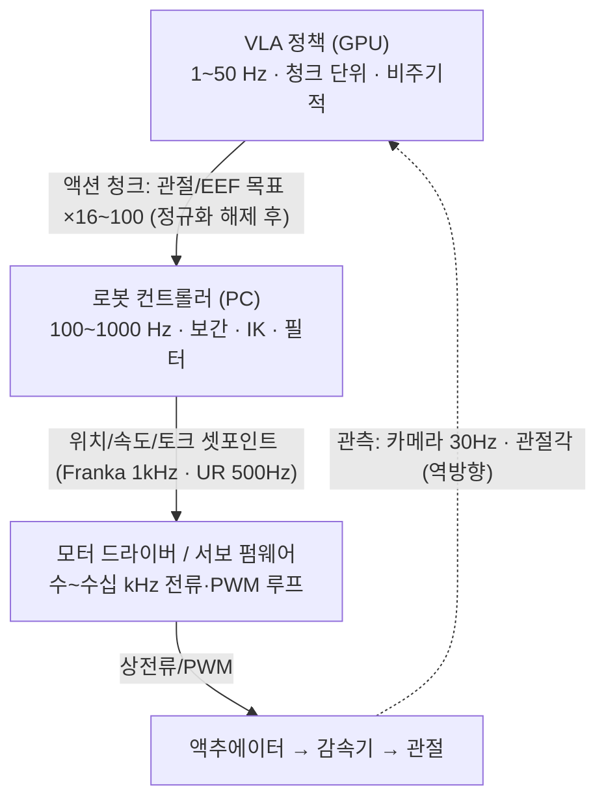
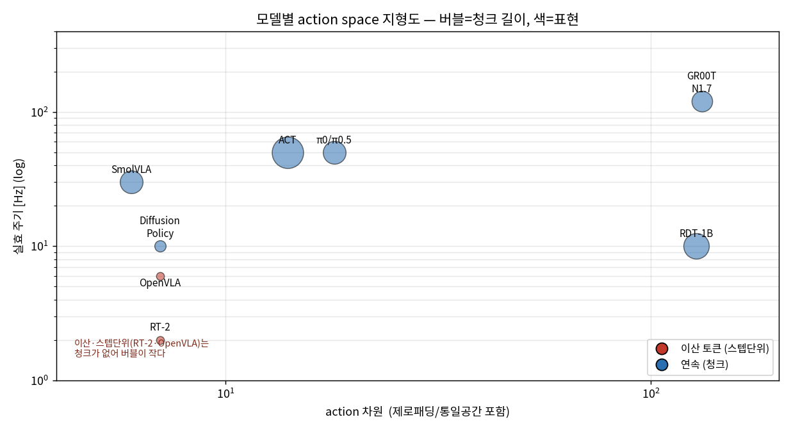
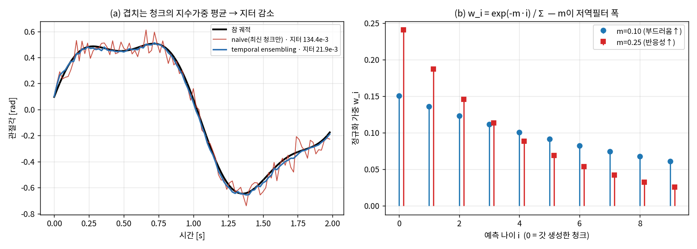
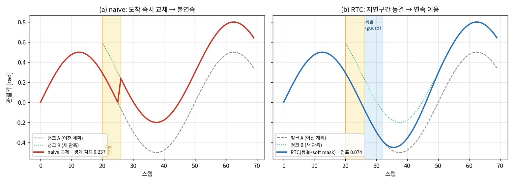
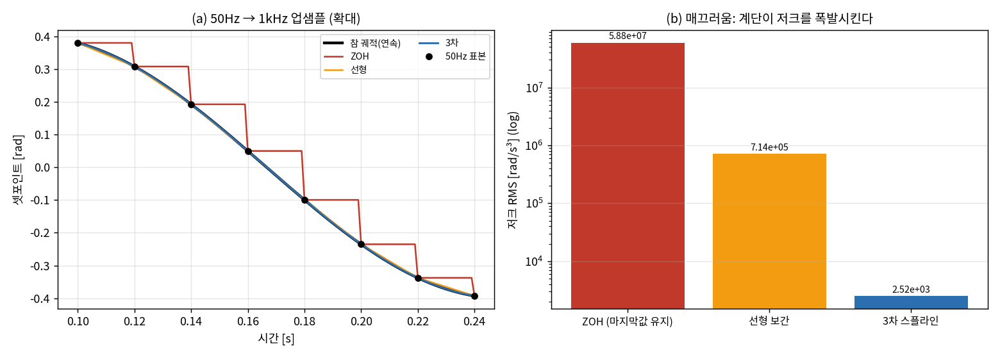

# Lec 50. Action의 여정 — VLA 출력이 액추에이터에 도달하기까지

> Part 6 두 번째 강의. 선수 지식: 38강(청크·앙상블), 40강(flow matching), 44강(π0), 49강(하드웨어).
> 핵심 수치(action 차원·청크 크기·π0/ACT/GR00T 스펙, Franka/UR 인터페이스 주기)는 논문·공식 문서 원문과 교차 검증했다. 일부(Diffusion Policy 주기, 전류 루프 kHz대)는 논문 보고값·업계 전형값이다.
> 정보 기준일: 2026-07-08.

## 한 장 요약



각 층의 주기가 한 자릿수~두 자릿수씩 다르다. 이 강의는 그 간극을 무엇이 어떻게 메우는지를 다룬다.

## 학습 목표

1. 주요 로봇 정책 8종(VLA 6종 + 그 조상 격인 ACT·Diffusion Policy)의 action space(물리량·표현·차원·주기·청크)를 표로 재구성하고, 논문에서 이 정보를 찾아낼 수 있다.
2. 액션 청크 실행 전략 4가지(temporal ensembling, receding horizon, RTC, 비동기 큐)의 문제 설정과 해법을 구분할 수 있다.
3. VLA→컨트롤러→드라이버 계층 간에 실제로 오가는 신호와 주기를 Franka·UR·취미서보 세 사례로 설명할 수 있다.
4. 오프보드/온보드 배포 토폴로지의 트레이드오프를 지연 관점에서 평가할 수 있다.

## 본문

### 0. 문제 설정: 두 개의 간극

**주파수 간극**: VLA 추론은 1~50Hz, 관절 서보는 100~1000Hz, 전류 루프는 수십 kHz. **지연 간극**: π0가 50개짜리 청크 하나를 만드는 데 RTX 4090 기준 ~73ms가 걸린다 (오프보드 서빙이면 네트워크 지연이 더해진다). 추론하는 동안에도 로봇은 움직이고 있다. 이 두 간극을 잘못 다루면 — 청크 사이에 로봇이 멈칫하고(idle frame), 청크 경계에서 명령이 불연속으로 튀고, 오래된 관측으로 만든 행동이 실행된다. 이 강의 전체가 이 문제의 해법 카탈로그다.

### 1. 모델별 action space — "VLA"라는 말이 감추는 다양성

1차 자료(논문·공식 저장소) 기준:

| 모델 | 물리량 | 표현 | 차원 | 청크 | 실효 주기 |
|---|---|---|---|---|---|
| **RT-2** | ΔEEF 포즈 + 그리퍼 | 이산 256빈 → 텍스트 토큰 | 7 (+종료 토큰) | 없음 (스텝 단위) | 1~3Hz (55B, 클라우드 TPU) |
| **OpenVLA** | ΔEEF 포즈 + 그리퍼 | 이산 256빈 (1~99% 분위수 구간), Llama 최저빈도 토큰 256개 덮어씀 | 7 | 없음 | ~6Hz (RTX 4090) |
| **ACT** | **절대 관절각** (양팔 14) | 연속 (CVAE) | 14 | **100** (@50Hz ≈ 2초) | 50Hz |
| **Diffusion Policy** | EEF 포즈 (위치 제어가 속도보다 안정) | 연속 (DDPM/DDIM) | 태스크별 | 예측 16 / 실행 8 | ~10Hz |
| **π0 / π0.5** | 관절 공간, **최대 18차원 제로패딩** (양팔 6DoF×2 + 그리퍼×2 + 베이스 + 토르소) | 연속 (flow matching, Euler 10스텝) | ≤18 | **50** | 최대 50Hz |
| **SmolVLA** | SO-101 관절각 | 연속 (flow matching) | 6 | 50 | LeRobot 기본 30Hz 루프 |
| **GR00T N1→N1.7** | 관절 공간 → **N1.7: 상대 EEF (인간·로봇 공유)** | 연속 (DiT flow matching) | 29 → **132** (모달리티 설정) | 16 → **40** | 저수준 액션 헤드 ~120Hz급 |
| **RDT-1B** | **128차원 통일 공간** (좌/우팔 관절 위치·속도, 그리퍼, EEF, 베이스 슬롯 고정 배치) | 연속 (디퓨전) | 128 (미사용 슬롯 마스킹) | 64 | — |

읽는 법:

- **같은 "VLA"인데 물리량부터 다르다.** ΔEEF(RT-2 계열)는 로봇 간 이식이 쉽지만 IK 층이 필요하고, 절대 관절각(ACT, π0, SmolVLA)은 IK가 필요 없지만 embodiment에 묶인다. GR00T N1.7이 상대 EEF로 돌아간 이유는 **인간 비디오와 action space를 공유**하기 위해서다 (사람 손에는 관절각이 없다). 논문의 action space 선택은 언제나 데이터 전략의 그림자다.
- **정규화는 조용한 함정이다.** openpi는 차원별 1%/99% 분위수(q01/q99)로 정규화한다. OpenVLA의 256빈도 같은 구간에서 나눈다 — 이상치가 빈 전체를 잡아먹는 걸 막는 장치. 부작용: 거의 안 움직이는 차원은 q01≈q99가 되어 정규화 후 값이 폭발한다 (openpi 공식 README가 직접 경고). 파인튜닝이 이상하게 안 될 때 첫 번째 용의자.
- **openpi DROID 사례**: 원본 π0.5-DROID는 관절 **속도** action으로 훈련됐지만, 공개 훈련 레시피는 관절 **위치**를 쓴다 — 속도 action은 시뮬레이션 재현이 어렵기 때문. 같은 모델 계열에서도 action space가 배포 사정으로 바뀐다는 실례.

위 표를 한 장으로 보면 "VLA"라는 한 단어가 감추는 스펙 분산이 드러난다:



*그림 1(보강): 위 표를 산점도로. x=action 차원(로그), y=실효 주기(로그), 버블=청크 길이, 색=표현(이산 토큰 vs 연속). 이산·스텝단위(RT-2·OpenVLA)는 왼쪽 아래 작은 버블, 통일/제로패딩 고차원(RDT-1B 128·GR00T N1.7 132)은 오른쪽. 청크가 큰 ACT(100)·RDT(64)는 버블이 크다. RDT-1B 주기는 논문 미보고라 표시 위치는 대략값(표는 "—"). 수치 출처: 본문 표의 1차 자료 [1]~[9]. [3][5][7][8][9]*

### 2. 청크 실행 — 개루프 구간을 어떻게 관리하는가

청크는 compounding error를 줄이지만(38강), 청크를 실행하는 동안 정책은 눈을 감고 있다. 50개@50Hz = 1초 개루프. 네 가지 전략:

1. **Temporal ensembling** (ACT): 매 스텝 추론해서 겹치는 청크들을 지수 가중 평균 `w_i = exp(−m·i)`. 부드럽지만 매 스텝 추론 비용을 낸다. 본질적으로 예측들의 저역 필터.
2. **Receding horizon** (Diffusion Policy): 16개 예측, 8개만 실행, 재계획. MPC 사용자에게는 설명이 필요 없는 구조.
3. **Real-Time Chunking, RTC** (PI, 2025.6): 추론을 비동기로 돌리되, **다음 청크 중 "추론이 도는 동안 실행될 앞부분"은 이전 청크 값으로 동결**하고(inpainting 문제로 정식화), 나머지 겹침 구간은 soft masking으로 이전 청크와 정합시킨다. 결과: 인위적으로 +200ms 지연을 넣어도 성능 무손실, 성냥 긋기·이더넷 삽입 같은 정밀 작업이 +300ms에서도 성공.
4. **LeRobot 비동기 추론**: `PolicyServer`(gRPC)와 `RobotClient` 분리. 클라이언트는 로컬 **액션 큐**를 소비하다가 큐 잔량이 `chunk_size_threshold`(기본 0.7) 아래로 내려가면 새 관측을 서버로 보낸다. 새 청크가 도착하면 겹침 구간을 `weighted_average`로 병합. 서버가 느려도 로봇이 멈칫하지 않게 하는 LeRobot 생태계의 기본 해법.

### 3. 컨트롤러 계층 — 셋포인트가 되기까지

**ΔEEF → 관절**: differential IK(자코비안 의사역행렬, resolved-rate) 또는 IK 솔버. ROS 2 생태계에서는 MoveIt Servo가 이 층(Cartesian twist → 관절 명령, 고정 주기)이지만, 연구 스택은 자체 Python 컨트롤러(Polymetis, ur_rtde, LeRobot 버스 클래스)를 쓰는 경우가 많다.

**세 가지 실물 사례** (층별로 무엇이 오가는지):

| | Franka FR3 | UR5e | SO-101 (Feetech) |
|---|---|---|---|
| PC→로봇 신호 | 관절 토크 / 관절·Cartesian 위치·속도 | servoj 위치 셋포인트 (RTDE) | Goal_Position 레지스터 쓰기 (TTL 버스) |
| 주기 | **1kHz** (FCI 실시간 루프) | **500Hz** (e-Series; CB3 125Hz) | LeRobot 기본 30Hz 루프* |
| 로봇 측 처리 | 토크 지령에 **중력·마찰 자동 보상** (τ_c = τ_d + τ_f + τ_g; 0 토크를 보내면 중력에 버팀), 기본 100Hz LPF + 가속도·저크·토크레이트 리미터, 내장 관절/Cartesian 임피던스 | 사이클당 마지막 셋포인트만 사용, 안전 체커 | **서보 온보드 PID** (12비트 자기 엔코더 → PWM). 토크 인터페이스 없음 |
| 대표 배치 | **DROID**: 정책 15Hz → Polymetis(NUC) → 1kHz FCI | 산업 연계 연구 | LeRobot / SmolVLA |

\* 중요한 교정: SO-101의 30Hz는 **서보나 버스의 한계가 아니다**. 버스는 최대 1Mbps로 6서보 sync write가 1ms 미만 — 수백 Hz 명령이 가능하다 (Feetech STS3215 스펙시트 기준). 30Hz는 웹캠 fps와 정책 추론에 맞춘 **LeRobot의 기본 설정값**(`fps=30`)이다. "스펙 한계"와 "소프트웨어 기본값"을 구분하는 것 — 이런 게 논문·문서를 비판적으로 읽는 기술이다.

**주기 계층 총정리**: VLA 1~50Hz (청크, 비주기) → 보간·IK·필터 100Hz~1kHz (주기, 실시간) → 전류/PWM 루프 수~수십 kHz (펌웨어). 위로 갈수록 느리고 똑똑하고, 아래로 갈수록 빠르고 단순하다.

### 4. 배포 토폴로지 — GPU는 어디에 있는가

- **오프보드 GPU + 네트워크**: openpi는 정책 서버를 websocket으로(LAN에서 청크당 0.5~1초를 "정상"으로 안내, 유선 권장), LeRobot은 gRPC로, GR00T는 ZMQ로 서빙한다. 장점: 큰 모델 사용 가능. 단점: 네트워크 지연이 제어 루프 안에 들어온다 — RTC와 비동기 큐가 필수인 이유.
- **온보드**: GR00T는 Jetson AGX Orin/Thor에서 TensorRT 컴파일로 DiT 액션 헤드를 ~3.6배 가속해 온로봇 추론. Helix·Redwood도 온보드 (48강). 역사적 극단은 RT-2 — 55B를 클라우드 멀티 TPU로 서빙하며 1~3Hz.
- 모델 크기와 토폴로지가 연동된다: SmolVLA 450M(~2GB)은 소비자 GPU/CPU까지, π0 3.3B는 ~14GB GPU, RT-2 55B는 클라우드. 47강의 "구조적 다이어트"가 여기서 배포 자유도로 환금된다.

### 5. 안전과 평활화 — 논문이 한 줄로 넘기는 것들

- **클리핑**: 분위수 정규화(q01/q99, 1~99% 빈)가 이상치 행동을 구조적으로 잘라낸다.
- **필터링**: temporal ensembling·weighted_average 병합은 사실상 저역 필터. 그 아래층에서 Franka가 다시 100Hz LPF + 레이트 리미터를 기본 적용한다 — 정책이 이상한 명령을 내도 두 겹의 필터가 받아준다.
- **하드웨어 한계 집행**: 관절 한계·속도 한계는 최하층(Franka reflex, UR 안전 체커)에서 최종 집행. 학습 정책의 안전은 아직 "아래층 고전 장치들에 위임"이 실무 표준이다.

### 핵심 수식

2절의 청크 실행 전략들과 3절의 다중율 계층은 말로는 "부드럽게 이어 붙인다"로 뭉뚱그려지지만, 그 아래에는 세 개의 구체적인 수식이 있다. 여기서 하나씩 3단(직관→의미→형식)으로 편다. 셋 다 스칼라 관절각 하나로 재현되며(CPU numpy), Worked Example에서 수치로 확인한다.

#### E1. Temporal ensembling — 예측 나이에 대한 지수가중 저역필터

**① 직관**: ACT는 매 스텝 추론한다. 그러면 **한 시각 $t$를 겨냥한 예측이 여러 개** 생긴다 — 방금 만든 청크도 $t$를 예측하고, 몇 스텝 전에 만든(아직 유효한) 청크도 $t$를 예측한다. 각 예측은 표본 노이즈·다봉성 때문에 조금씩 다르다. 이 여러 표를 그냥 최신 것만 쓰면(naive) 청크가 바뀔 때마다 값이 튄다. 대신 **모두 평균 내되, 오래된 예측일수록 덜 믿는다**.

**② 물리·기하적 의미**: 가중을 "예측의 나이"($i$: 그 예측을 낸 청크가 몇 스텝 전 것인가, $i=0$이 갓 만든 것)에 대한 지수 감쇠 $w_i = e^{-m i}$로 준다. 이것은 시간축이 아니라 **예측 시점축의 저역필터**다 — 서로 다른 시점의 정책이 같은 순간에 대해 낸 의견들을 섞어 고주파(청크 교체가 만드는 스텝 불연속)를 깎는다. $m$이 필터의 폭이다: $m$이 작으면 오래된 예측까지 골고루 섞여 매우 부드럽지만 관측 변화에 굼뜨고(지연↑), $m$이 크면 최신 예측에 무게가 쏠려 반응성은 좋지만 덜 부드럽다. 가중 질량의 절반이 나이 $\ln 2/m$ 안에 있다 — $m=0.1$이면 약 6.9스텝, 즉 "직전 ~7개 청크의 의견을 실질적으로 섞는" 필터다.

**③ 형식**: 시각 $t$를 예측한 값들 $\{a^{(i)}_t\}_{i=0}^{K}$에 대해 실행값은

$$
\hat a_t \;=\; \sum_{i=0}^{K} \tilde w_i\, a^{(i)}_t,
\qquad
\tilde w_i = \frac{e^{-m i}}{\sum_{j=0}^{K} e^{-m j}}
$$

정규화 $\sum_i \tilde w_i = 1$이 핵심이다(안 하면 청크가 쌓일수록 스케일이 변한다). 분모는 유한 등비급수라 $\sum_{j=0}^{K} e^{-mj} = \frac{1-e^{-m(K+1)}}{1-e^{-m}}$로 닫힌다. **단순 이동평균과의 차이**: 이동평균은 시간창의 균등가중이지만, temporal ensembling은 *예측이 만들어진 시점*에 대한 지수가중이다 — 최근 관측을 반영한 예측을 더 믿는다는 점에서 지수이동평균(EMA)의 로봇 버전이고, 본질적으로 예측 앙상블의 저역 필터다.

#### E2. Real-Time Chunking — 추론지연 구간 동결 + soft masking

**① 직관**: 비동기로 추론하면, 새 청크 $B$가 **아직 계산되는 동안에도 로봇은 움직여야 한다**. 그 지연 구간에서 로봇은 이전 청크 $A$를 쓸 수밖에 없다. 그렇다면 새 청크 $B$에게 "네가 도착했을 때 이미 실행돼 버린 앞부분($A$가 낸 값들)은 바꾸지 말고, 그 값에서 자연스럽게 이어서 그려라"라고 요구하면 된다. RTC[10]는 이것을 **inpainting**(이미 칠해진 화소는 고정하고 나머지를 채우는 그림 복원 문제)으로 정식화한다.

**② 물리·기하적 의미**: 두 개의 처방이 겹친다. (a) **동결(freeze)**: 추론이 도는 $d$스텝 구간은 $B$를 쓰지 않고 $A$로 고정한다 — 이 구간의 값은 "이미 확정된 과거"이므로 재협상 대상이 아니다. (b) **soft masking**: 동결 직후 겹침 구간에서 $A \to B$를 부드러운 가중으로 블렌딩해, $B$가 $A$의 끝값·기울기에서 이어지도록 만든다. naive 교체는 도착 순간 $A$와 $B$의 겨냥 차이(관측이 바뀌었으니 다르다)를 **한 스텝에 통째로** 튕기지만, soft masking은 그 차이를 겹침 구간 전체에 펴 발라 스텝당 불연속을 줄인다. 이 발상은 network control system의 지연 보상, 그리고 Smith predictor(지연 동안의 플랜트 거동을 예측치로 대체)와 같은 계보다.

**③ 형식**: 도착 시각 $t_a$, 동결 길이 $d$(추론 지연), 겹침 블렌딩 길이 $L$이라 하면 실행값은

$$
\hat a_t =
\begin{cases}
a^A_t, & t < t_a + d \quad(\text{동결 · inpainting 고정부})\\[2pt]
\big(1-\alpha(t)\big)\,a^A_t + \alpha(t)\,a^B_t, & t_a + d \le t < t_a + d + L \quad(\text{soft mask})\\[2pt]
a^B_t, & t \ge t_a + d + L
\end{cases}
$$

블렌딩 가중 $\alpha$는 양 끝 도함수가 0인 **smoothstep** $\alpha(u) = 3u^2 - 2u^3$ ($u\in[0,1]$)을 쓰면 이음매가 $C^1$ 연속이 된다(선형 램프는 양 끝에서 기울기가 꺾인다). RTC의 핵심 보증: 동결 구간을 "정확히 추론 지연만큼"으로 잡으면, 인위적 지연을 얹어도(원논문 +200ms) 성능 무손실 — 실행될 값을 미리 고정했으니 지연이 무해해진다. 덜 동결하면 아직 안 온 $B$를 써야 하고, 더 동결하면 반응이 느려진다.

#### E3. 다중율 계층 — 50Hz 셋포인트를 1kHz로: ZOH vs 보간

**① 직관**: VLA가 50Hz로 셋포인트를 내도 관절 서보는 1kHz로 돈다(0강 E3). 그 사이 20개의 하위 스텝을 무엇으로 채우는가? 가장 단순한 답은 **마지막 값 유지(ZOH)** — 계단이다. 계단은 매끄럽지 않아서 고주파(저크)를 만든다. 그래서 실무 스택은 그 위에 보간(선형·3차)을 얹는다.

**② 물리·기하적 의미**: ZOH는 명령을 계단 함수로 만들고, 계단의 수직 모서리는 이론상 무한 저크다 — 플랜트 공진을 때리고 기어·감속기에 충격을 준다(15강 백래시·충격내성과 직결). 선형 보간은 위치는 연속으로 잇지만 속도가 표본 경계에서 꺾이고(저크 스파이크), 3차 스플라인은 위치·속도·가속도까지 연속이라 저크가 급감한다. 이것이 8강 보간기가 하는 일이고, "청크를 셋포인트로 편다"의 정확한 내용이다.

**③ 형식**: 하위 격자 $t = kT_\pi + \delta$ ($0\le\delta<T_\pi$, 표본 $a_k$)에 대해

$$
\text{ZOH: } a(t)=a_k, \qquad
\text{선형: } a(t)=a_k + \tfrac{\delta}{T_\pi}(a_{k+1}-a_k), \qquad
\text{3차: } a(t)=\sum_{p=0}^{3} c_p\,\delta^p
$$

3차 계수 $c_p$는 표본 위치와 자연 스플라인 조건(내부 매듭에서 2차 도함수 연속, 양 끝 2차 도함수 0)에서 삼중대각 선형계 $A\mathbf{M}=\mathbf{b}$를 풀어 얻는다. 매끄러움의 대가는 **선행성(look-ahead)**: 선형·3차는 $a_{k+1}$이 있어야 하므로 최소 1스텝 지연을 만든다. 이 지연을 감당할 수 있으면 매끄러움을 사고, 못 하면 ZOH로 남는다 — 계층화가 공짜가 아니라 대역/지연 예산 위에 선다는 0강 E3의 결론이 그대로 여기 적용된다.

### Worked Example

세 예제 모두 실제 실행 가능한 CPU numpy 코드다. 본문·그림이 인용하는 수치는 모두 `images/lec50/gen_figs.py` 실행 출력과 일치한다(스칼라 관절각 하나로 청크 실행의 수학을 재현 — 실제 VLA는 다차원이지만 전략의 수학은 스칼라에서 그대로 드러난다).

#### WE-1 (손계산 + 검증): temporal ensembling의 가중과 지터 감소

**손계산 관점**. 나이 $i=0,1,2$인 세 예측만 있고 $m=0.1$이라 하자. 미정규 가중 $e^{-0}, e^{-0.1}, e^{-0.2} = 1, 0.905, 0.819$, 합 $2.724$. 정규화하면 $\tilde w = [0.367, 0.332, 0.301]$ — 최신에 살짝 무게가 실리지만 셋이 거의 균등하다(감쇠가 완만하므로). $m$을 0.25로 올리면 $[0.42, 0.33, 0.25]$로 최신 쏠림이 커진다. 가중 질량의 절반이 나이 $\ln 2 / 0.1 \approx 6.9$스텝 안에 든다는 것이, "직전 약 7개 청크를 실질적으로 섞는다"는 필터 폭의 정량이다.

**검증 코드** (겹치는 청크에 노이즈를 주고 앙상블 전후 지터 비교):

```python
import numpy as np
rng = np.random.default_rng(0)
FPS, T = 50.0, 2.0
t = np.arange(0, T, 1/FPS); N = len(t)
true = lambda tt: 0.6*np.sin(2*np.pi*0.5*tt) + 0.15*np.sin(2*np.pi*1.3*tt+0.7)
H, m, sig = 20, 0.1, 0.05

preds = [[] for _ in range(N)]                       # 시각 k 를 겨냥한 (나이, 값) 목록
for s in range(N):                                   # 매 스텝 청크 하나 생성
    bias = rng.normal(0, sig)
    for j in range(H):
        k = s + j
        if k >= N: break
        preds[k].append((k - s, true(t[k]) + bias + rng.normal(0, sig*0.5)))

def ens(k):
    ages = np.array([a for a,_ in preds[k]]); vals = np.array([v for _,v in preds[k]])
    w = np.exp(-m*ages); w /= w.sum()                # 정규화: sum w = 1
    return (w*vals).sum()

naive = np.array([min(preds[k])[1] for k in range(N)])   # 최신 청크(나이 0)만
smoothed = np.array([ens(k) for k in range(N)])
jit = lambda x: np.sqrt(np.mean(np.diff(x,2)**2))        # 지터 = 2차차분 RMS
print(f"지터 naive={jit(naive)*1e3:.1f}e-3, ens={jit(smoothed)*1e3:.1f}e-3, "
      f"비율={jit(naive)/jit(smoothed):.1f}x")            # 134.4e-3, 21.9e-3, 6.1x
```

출력: naive 지터 $134.4\times10^{-3}$ → 앙상블 $21.9\times10^{-3}$, **6.1배 감소**. 참 궤적 추종 RMS도 55.4 → 19.3 mrad로 개선된다 — 앙상블이 노이즈를 평균으로 지운 것이다. 대가는 매 스텝 추론 비용(그래서 π0/RTC는 다른 길을 간다).



*그림 2: (a) 같은 노이즈 청크들. naive(빨강)는 청크 교체마다 튀고(지터 134×10⁻³), 지수가중 앙상블(파랑)은 참 궤적에 붙는다(21.9×10⁻³, 6.1배 감소). (b) $w_i = e^{-mi}$ 정규화 프로파일 — $m$이 저역필터 폭이다. [3][11]*

#### WE-2 (손계산 + 검증): RTC 청크 이어붙이기 — 동결 vs naive 교체

**손계산 관점**. 청크 $A$와 $B$가 같은 모양인데 $B$가 관측 변화로 $0.30$ rad 옮겨 겨냥한다고 하자. naive는 도착 순간 한 스텝에 $\approx 0.30$을 튕긴다(경계 불연속). RTC는 추론 지연 $d=6$스텝을 $A$로 동결한 뒤, 겹침 $L=20$스텝에 걸쳐 smoothstep으로 $A\to B$를 편다. smoothstep의 최대 기울기는 중점에서 $1.5/L$이므로 오프셋이 만드는 스텝당 최대 증분은 $0.30 \times 1.5/20 \approx 0.023$ — 나머지는 궤적 자체 기울기다.

**검증 코드**:

```python
import numpy as np
tc = np.arange(0, 70)
base = 0.5*np.sin(2*np.pi*0.02*tc)            # 두 청크 공통 기저
OFF, d, tr, L = 0.30, 6, 20, 20                # 오프셋·지연·재요청시각·블렌딩길이
A = base.copy(); B = lambda k: base[k] + OFF
arrive = tr + d

naive = A.copy()
for k in range(arrive, len(tc)): naive[k] = B(k)     # 즉시 교체

rtc = A.copy(); ge = arrive + d
for k in range(arrive, ge): rtc[k] = A[k]             # 동결(inpainting)
for k in range(ge, ge+L):
    u = (k-ge+1)/(L+1); a = u*u*(3-2*u)               # smoothstep soft mask
    rtc[k] = (1-a)*A[k] + a*B(k)
for k in range(ge+L, len(tc)): rtc[k] = B(k)

jump = lambda s: np.abs(np.diff(s))[arrive-1:ge+L].max()
print(f"경계 점프 naive={jump(naive):.3f}, RTC={jump(rtc):.3f}, "
      f"감소={jump(naive)/jump(rtc):.1f}x")             # 0.237, 0.074, 3.2x
```

출력: naive 경계 점프 $0.237$ rad(한 스텝에 튐) → RTC $0.074$ rad, **3.2배 감소**. RTC의 잔여 0.074는 불연속이 아니라 궤적의 정상 기울기 + 완만한 블렌딩이다 — RTC는 운동을 없앤 게 아니라 **이음매를 연속으로** 만든 것이다. 추론 지연 $d$만큼 정확히 동결했으므로, 이 지연은 성능에 무해하다(RTC의 +200ms 무손실 보증의 축소 재현).



*그림 3: (a) naive는 도착 즉시 $B$로 교체 → 노란 지연구간 끝에서 뾰족한 불연속(점프 0.237). (b) RTC는 지연구간을 $A$로 동결(파란 띠)하고 soft mask로 이어 → 점프 0.074. [10]*

#### WE-3 (코드): 비동기 큐 시뮬 — chunk_size_threshold 소비/재요청

**문제 설정**. LeRobot 비동기 추론(2절 전략 4)에서 클라이언트는 로컬 액션 큐를 매 스텝 하나씩 소비하다가, 잔량/청크크기가 `chunk_size_threshold` 아래로 내려가면 새 관측을 서버로 보낸다. 서버는 지연 뒤 새 청크를 돌려주고, 겹침은 `weighted_average`로 병합된다. threshold와 서버 지연이 만드는 트레이드오프를 재현한다.

```python
import numpy as np
H, n_steps = 50, 400                          # actions_per_chunk(LeRobot 기본), 스텝 수

def run(threshold, latency):
    queue = list(range(H)); pending = None; n_req = starved = 0; qlog = []
    for step in range(n_steps):
        if pending is not None and step >= pending:        # 새 청크 도착
            queue += list(range(max(H - len(queue), 0)))    # 잔량 위에 꼬리 이어붙임
            pending = None                                  # (겹침=weighted_average 자리)
        if queue: queue.pop(0)                              # 매 스텝 1개 소비
        else: starved += 1                                  # 큐 고갈 = 로봇 idle
        qlog.append(len(queue))
        if pending is None and len(queue) < threshold*H:    # 임계 미만 → 재요청
            pending = step + latency; n_req += 1
    return n_req, starved, float(np.mean(qlog))

for th in (0.2, 0.7, 0.9):                                   # 정상 지연 latency=8
    print(f"th={th}: 재요청 {run(th,8)[0]}회, idle {run(th,8)[1]}, 평균잔량 {run(th,8)[2]:.1f}/{H}")
print("지연 악화(th=0.7):", "lat=8 →", run(0.7,8), " lat=40 →", run(0.7,40))
```

출력 (재현): threshold $0.2 / 0.7 / 0.9$에서 재요청 **8 / 17 / 31회**, 평균 큐잔량 **26.1 / 38.2 / 43.0**. threshold를 올리면 서버를 더 자주 부르지만(부하↑) 관측이 신선하고 큐 안전마진이 크다 — 실습 3의 사고실험이 수치로 나온 것이다. 지연 민감도: threshold 0.7 고정에서 지연이 8→40스텝(청크 길이에 육박)으로 악화하면 재요청이 17→7회로 줄고 **idle이 0→35스텝**으로 터진다. 큐가 지연을 못 흡수하면 로봇이 멈칫한다 — RTC·비동기 큐가 필수인 이유의 정량이다.



*그림 4: (a) 50Hz 표본(검은 점)을 1kHz로 업샘플. ZOH(빨강)는 계단, 선형(주황)·3차(파랑)는 참 궤적에 밀착. (b) 저크 RMS(log): ZOH 5.88×10⁷ → 선형 7.14×10⁵(82배↓) → 3차 2.52×10³(선형 대비 284배↓). 계단이 저크를 폭발시킨다(E3). 추종 RMS도 ZOH가 3차의 14.2배.*

### 로봇공학자를 위한 번역

이 그림 전체는 익숙한 **cascade 제어 + 셋포인트 보간**과 동형이다. 새로운 것은 정확히 두 가지다:

1. **최외곽 루프가 비주기적·고지연·청크 단위다.** 주기적 궤적 생성기 대신, 지연이 들쭉날쭉한 생성 모델이 1~2초치 궤적 조각을 밀어 넣는다. 이것은 네트워크 제어 시스템(NCS)의 지연 보상 문제와 같은 구조이고, RTC의 "추론 중 실행분 동결"은 Smith predictor의 발상(지연 동안의 플랜트 거동을 예측치로 대체)과 닮았다.
2. **셋포인트 생성기가 확률적이다.** 같은 관측에서 다른 궤적이 나올 수 있고(다봉성, 39강), 청크 경계 불연속은 궤적 블렌딩(가중평균, soft masking)으로 다스린다 — 스플라인 블렌딩과 수학적 친척이다.

나머지 — 보간, 저역 필터, 중력 보상, 임피던스, 전류 루프 — 는 회원님이 이미 아는 그 물건들이 그대로 그 자리에 있다. VLA는 제어 스택을 대체한 게 아니라 **최상층 셋포인트 소스를 교체**했을 뿐이다.

## 흔한 오해

1. **"temporal ensembling은 그냥 이동평균 필터다"** — 반은 맞고 반은 틀리다. 저역 필터인 것은 맞지만, 시간창의 균등가중이 아니라 **예측이 만들어진 시점(나이 $i$)에 대한 지수가중** $w_i = e^{-mi}$이다(E1). 핵심 차이: 최근 관측을 반영한 예측을 더 믿는다 — 지수이동평균(EMA)의 구조지 단순 이동평균이 아니다. 그래서 관측이 급변하면 최신 예측이 빠르게 지배권을 되찾는다. $m$을 균등에 가깝게($m\to0$) 두면 이동평균에 수렴하지만, 그것은 특수 경우일 뿐이다.

2. **"RTC는 청크 사이를 부드럽게 블렌딩하는 필터다"** — soft masking만 보면 그렇게 보이지만, RTC의 본질은 **동결(freeze)**이다(E2). 추론 지연 $d$ 동안 실행될 값을 이전 청크로 *고정*하고 새 청크에게 "그 값에서 이어 그려라"를 강제하는 inpainting이 핵심이고, soft masking은 그 뒤 겹침의 마감일 뿐이다. 동결이 없으면 아직 도착하지 않은 청크를 써야 하므로, "블렌딩만"으로는 지연 무손실 보증이 성립하지 않는다. 덜 동결하면/더 동결하면 각각 무엇이 깨지는지는 WE-2로 확인.

3. **"청크 실행 전략은 그냥 후처리 스무딩이라 아무거나 써도 된다"** — 네 전략은 서로 다른 자원을 쓴다(2절). Temporal ensembling은 **매 스텝 추론 비용**을 내고(π0급 73ms 추론에는 부적합), RTC·비동기 큐는 추론을 아끼는 대신 **큐/지연 관리**를 한다. WE-3에서 봤듯 서버 지연이 청크 길이에 육박하면 큐가 고갈돼 로봇이 idle에 빠진다(threshold 0.7·지연 40스텝에서 idle 35스텝). 전략 선택은 추론 지연·주기 예산에 종속된다.

4. **"50Hz 정책이면 로봇도 50Hz로만 움직인다"** — 아니다. 50Hz는 셋포인트 주기일 뿐, 그 아래 보간·서보가 1kHz로 그 사이를 메운다(E3, 3절). "SO-101은 30Hz 로봇"이라는 오해(자가 점검 5)와 같은 계열의 층위 혼동 — 정책 주기, 제어 주기, 전류 루프 주기는 각각 다른 층의 수이고, 어느 하나로 로봇 전체를 규정할 수 없다.

5. **"보간은 매끄럽게만 하면 이득이니 항상 3차를 쓰자"** — 매끄러움은 공짜가 아니다(E3 형식). 선형·3차 보간은 다음 표본 $a_{k+1}$을 알아야 하므로 최소 1스텝 look-ahead 지연을 만든다. 지연에 민감한 접촉 태스크에서는 이 지연이 손해일 수 있고, 반대로 ZOH의 계단 저크는 감속기·기어에 충격을 준다(15강). 어느 쪽을 살지는 대역/지연 예산의 문제지 "무조건 매끄러운 게 낫다"가 아니다.

## 실습 (60분, GPU 불필요)

**LeRobot 비동기 추론 코드 추적.** Claude Code 세션에서 lerobot 저장소를 클론하고, 관측 하나가 서보 명령이 될 때까지의 경로를 함께 따라간다:

1. `src/lerobot/async_inference/` (또는 현재 버전의 해당 모듈)에서 `PolicyServer`와 `RobotClient`를 연다.
2. 다음 질문에 코드 라인을 근거로 답한다: 관측은 어떻게 직렬화되는가? 액션 큐는 어떤 자료구조인가? `chunk_size_threshold`는 어디서 비교되는가? 새 청크와 옛 청크의 겹침은 어느 함수가 병합하는가? 최종적으로 어떤 클래스가 Feetech 버스에 쓰는가?
3. 사고 실험을 코드로 확인: `chunk_size_threshold`를 0.9로 올리면/0.2로 내리면 각각 무슨 일이 생기는가? (힌트: 관측 신선도 vs 서버 부하)
4. (선택) openpi `examples/droid`의 README를 읽고 같은 구조를 websocket 버전으로 대조.

## Claude와 토론할 질문

1. ACT의 temporal ensembling과 단순 이동평균 필터의 차이는? 왜 "예측 시점" 기준 지수 가중인가?
2. RTC가 동결하는 구간이 정확히 "추론 지연 동안 실행될 액션"인 이유는? 덜 동결하면/더 동결하면 각각 무엇이 깨지는가?
3. 위치 제어 로봇에 속도 action space를 쓰면 무슨 문제가 생기는가? (openpi DROID의 속도→위치 전환 사례로)
4. 학습 정책 아래에 임피던스 제어가 있으면 무엇이 좋아지는가? 접촉 태스크에서 위치 서보 직결과 비교하면?
5. 청크 50개@50Hz = 1초 개루프 — 어떤 태스크에서 치명적이고 어떤 태스크에서 무해한가? 동적 환경의 시정수와 연결해 보라.
6. GR00T N1.7의 상대 EEF action이 인간 비디오 학습을 가능하게 하는 메커니즘은? 절대 관절각으로는 왜 안 되는가?
7. 오프보드 서빙의 네트워크 지터는 어느 층에서 흡수되는가? 이 스택에서 실시간성 보장이 필요한 최상위 층은 어디인가?

## 읽을거리

1. **PI "Real-Time Chunking" 블로그** (pi.website/research/real_time_chunking, ~20분): 전문. 이 강의 2절의 원전이며 그림이 훌륭하다.
2. **LeRobot async inference 문서** (huggingface.co/docs/lerobot/en/async, ~15분): 실습의 사전 읽기.
3. (선택) π0 논문 Table I(지연 수치)만 + libfranka 공식 문서의 realtime interface 절: 층간 신호를 원문으로 확인하고 싶을 때.

## 자가 점검

1. VLA→PC→드라이버→액추에이터 각 경계에서 오가는 신호와 주기를 안 보고 그릴 수 있는가?
2. 8개 모델의 action space를 물리량·표현·청크로 구분해 말할 수 있는가?
3. 청크 실행 전략 4가지의 문제 설정 차이(비용/지연/불연속)를 설명할 수 있는가?
4. q01/q99 정규화의 목적과 부작용(퇴화 차원)을 설명할 수 있는가?
5. "SO-101은 30Hz 로봇이다"라는 문장이 왜 틀렸는지 설명할 수 있는가?
6. temporal ensembling 가중 $w_i = e^{-mi}$의 정규화가 왜 필요한지, $m$이 무엇을 조절하는지(반응성↔부드러움), 단순 이동평균과 어떻게 다른지 말할 수 있는가? (WE-1: 지터 6.1배 감소)
7. RTC의 "동결"과 "soft masking"을 구분하고, 동결 길이를 추론 지연과 정확히 맞추는 이유를 설명할 수 있는가? naive 교체 대비 경계 점프가 왜 줄어드는지(WE-2: 0.237→0.074, 3.2배)?
8. 비동기 큐에서 `chunk_size_threshold`를 올리면/내리면(WE-3), 그리고 서버 지연이 청크 길이에 육박하면 각각 무슨 일이 생기는지(재요청 빈도·큐 잔량·idle) 수치 감각과 함께 말할 수 있는가?
9. 50Hz→1kHz 업샘플에서 ZOH·선형·3차 보간의 저크·지연 트레이드오프(E3, WE-3 그림)를 설명할 수 있는가?

## 참고문헌

> 본문 수치·주장의 출처. 이 강의의 핵심 수치는 2026-07-08에 별도 팩트체크 에이전트가 1차 자료와 대조 확인했다. 웹 문서는 같은 날 접속 기준.

[1] A. Brohan et al., "RT-2," arXiv:2307.15818, 2023.7. https://arxiv.org/abs/2307.15818 — **뒷받침**: ΔEEF 7차원+종료 토큰, 256빈, 55B 클라우드 TPU 서빙 1~3Hz(5B ~5Hz).

[2] M. J. Kim et al., "OpenVLA," arXiv:2406.09246, 2024.6. https://arxiv.org/html/2406.09246v3 — **뒷받침**: 1~99% 분위수 구간 256빈, Llama 최저빈도 토큰 256개 덮어쓰기, ~6Hz(RTX 4090, bf16).

[3] T. Zhao et al., "ALOHA/ACT," arXiv:2304.13705, 2023.4. https://arxiv.org/abs/2304.13705 — **뒷받침**: 절대 관절각 14차원, 청크 100@50Hz, temporal ensembling w_i=exp(−m·i).

[4] C. Chi et al., "Diffusion Policy," arXiv:2303.04137, 2023.3. https://arxiv.org/abs/2303.04137 — **뒷받침**: EEF 위치 제어 선호, 관측 2/예측 16/실행 8, ~10Hz(논문 보고값).

[5] K. Black et al., "π0," arXiv:2410.24164, 2024.10 (Appendix Table I). https://arxiv.org/abs/2410.24164 — **뒷받침**: H=50@최대 50Hz, 최대 18차원 제로패딩(양팔+그리퍼+베이스+토르소), 청크 생성 ~73ms(RTX 4090).

[6] Physical Intelligence, openpi 저장소(examples/droid/README_train.md, src/openpi/policies/droid_policy.py, issue #933). https://github.com/Physical-Intelligence/openpi
— **뒷받침**: DROID 정책의 8차원 관절 위치 action(원본 π0.5-DROID는 관절 속도로 훈련), q01/q99 정규화(scripts/compute_norm_stats.py)와 퇴화 차원 경고, websocket 서빙·LAN 지연 0.5~1초/청크 안내.

[7] M. Shukor et al., "SmolVLA," arXiv:2506.01844, 2025.6. https://arxiv.org/abs/2506.01844 — **뒷받침**: SO-10x 관절 위치 명령, actions_per_chunk=50.

[8] NVIDIA, Isaac-GR00T 저장소 · "GR00T N1.7" HF 블로그 · TensorRT 배포 문서. https://github.com/NVIDIA/Isaac-GR00T · https://huggingface.co/blog/gr00t-n1-7 · https://nvidia-isaac-gr00t.mintlify.app/deployment/tensorrt
— **뒷받침**: N1 H=16→N1.7 H=40, 차원 29→132, 상대 EEF(인간·로봇 공유), embodiment 태그/modality config, ZMQ 서빙, TensorRT DiT ~3.59배 가속, Jetson Orin/Thor.

[9] RDT-1B, arXiv:2410.07864, 2024.10. https://arxiv.org/abs/2410.07864 — **뒷받침**: 128차원 물리 해석 가능 통일 액션 공간(슬롯 고정+마스킹), 청크 64.

[10] K. Black, M. Y. Galliker, S. Levine (Physical Intelligence), "Real-Time Execution of Action Chunking Flow Policies," arXiv:2506.07339, 2025.6. https://www.pi.website/research/real_time_chunking
— **뒷받침**: inpainting 정식화(추론 지연 구간 동결+soft masking), +200ms 무손실·정밀 작업 +300ms 성공.

[11] Hugging Face, LeRobot async inference 문서. https://huggingface.co/docs/lerobot/en/async
— **뒷받침**: PolicyServer(gRPC)/RobotClient, 액션 큐, chunk_size_threshold 기본 0.7(권장 0.5~0.6), weighted_average 병합, actions_per_chunk 기본 50.

[12] Franka Robotics, libfranka 공식 문서. https://frankarobotics.github.io/docs/doc/libfranka/docs/overview.html
— **뒷받침**: FCI 1kHz 실시간 루프, 토크 지령의 중력·마찰 자동 보상(τ_c = τ_d + τ_f + τ_g), 기본 100Hz 저역필터(v0.5.0~), 가속도·저크·토크레이트 리미터(v0.4.0~), 내장 임피던스 제어기.

[13] Universal Robots, RTDE 가이드. https://docs.universal-robots.com/tutorials/communication-protocol-tutorials/rtde-guide.html
— **뒷받침**: e-Series 실시간 루프 500Hz(CB3 125Hz), servoj 셋포인트 처리 ("사이클당 마지막 셋포인트" 세부는 UR 포럼 출처).

[14] A. Khazatsky et al., "DROID," arXiv:2403.12945, 2024.3. https://arxiv.org/abs/2403.12945 — **뒷받침**: 정책 15Hz → Polymetis(NUC) → 1kHz FCI 스택.

[15] Feetech STS3215 스펙. https://www.robotshop.com/products/feetech-12v-30kgcm-magnetic-encoding-servo-sts3215 — **뒷받침**: Goal_Position 레지스터 방식, 온보드 PID(12비트 자기 엔코더), 토크 루프 없음, 버스 최대 1Mbps.

[16] Hugging Face, lerobot 저장소(src/lerobot/configs/dataset.py). https://github.com/huggingface/lerobot — **뒷받침**: 기본 제어/기록 루프 fps=30 — "30Hz는 LeRobot 기본 설정이지 서보 한계가 아님"의 근거.

[17] MoveIt, Servo 실시간 튜토리얼. https://moveit.picknik.ai/main/doc/examples/realtime_servo/realtime_servo_tutorial.html — **뒷받침**: Cartesian twist→관절 명령의 ROS 2 구현 계층.

*수치 재현성: 핵심 수식(E1~E3)·Worked Example·그림의 개념 재현 수치는 CPU numpy 토이 모델의 실행 출력이다(실제 모델 다운로드·GPU 없이 청크 실행의 수학만 재현). `images/lec50/gen_figs.py`와 본문 코드 블록으로 재현되는 값 — WE-1/그림 2: temporal ensembling 지터 naive 134.4×10⁻³ → 앙상블 21.9×10⁻³(6.1배 감소), 추종 RMS 55.4→19.3 mrad, $w(m{=}0.1)$ 반질량 나이 ≈6.9스텝. WE-2/그림 3: RTC 경계 점프 naive 0.237 → 동결+soft mask 0.074 rad(3.2배 감소, 지연 $d{=}6$스텝=120ms@50Hz). WE-3: 비동기 큐 재요청 8/17/31회(threshold 0.2/0.7/0.9), 평균 잔량 26.1/38.2/43.0, 지연 40스텝에서 idle 35스텝. 그림 4: 저크 RMS ZOH 5.88×10⁷ → 선형 7.14×10⁵(82배↓) → 3차 2.52×10³(선형 대비 284배↓), 추종 RMS ZOH/3차 14.2배. 그림 1(보강): 모델별 action space 지형도(표 수치 시각화) — numpy 1.26 / matplotlib 3.5 기준. 모델별 action space·73ms·RTC·async 등 1차 자료 수치(참고문헌 [1]~[17])는 별도 팩트체크로 검증됨(위 재현 수치와 구분).*

<!-- lecture-nav -->

---

⬅ 이전: [Lec 49. VLA 로봇 하드웨어 지형도 — 학습 정책의 눈으로 본 로봇](lec49-robot-hardware.md)　｜　[📖 전체 목차](../README.md)　｜　다음: [Lec 51. 시뮬레이터 지형도](../part12-environment-simulation/lec51-simulator-landscape.md) ➡
