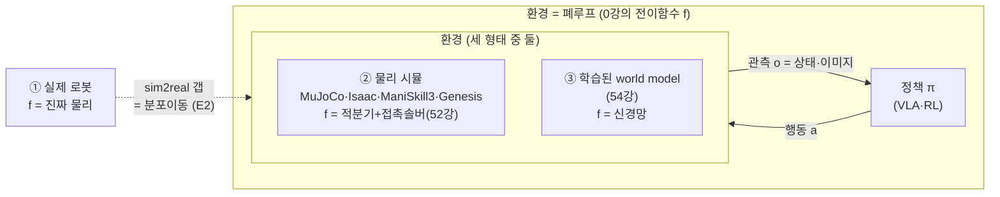
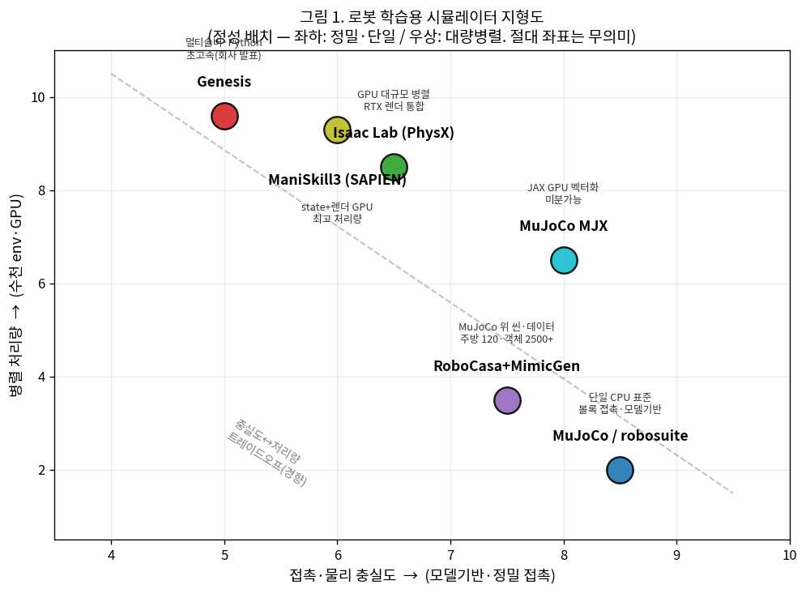
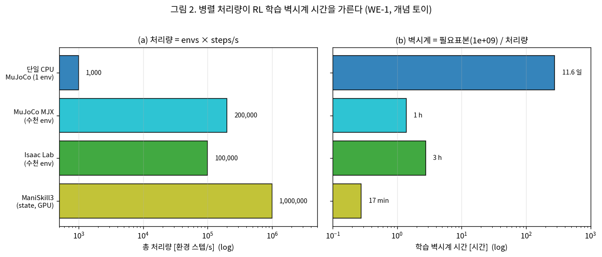
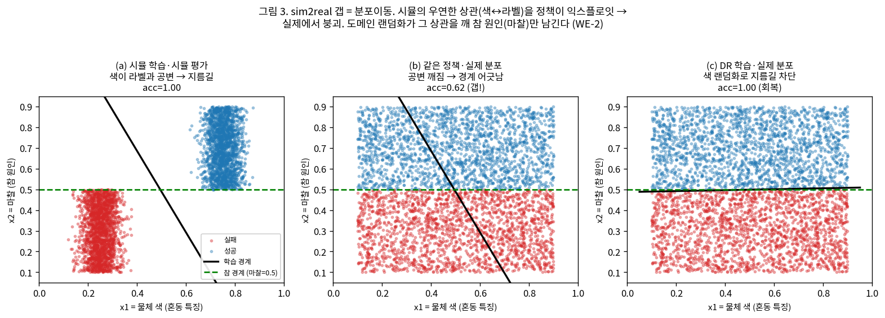
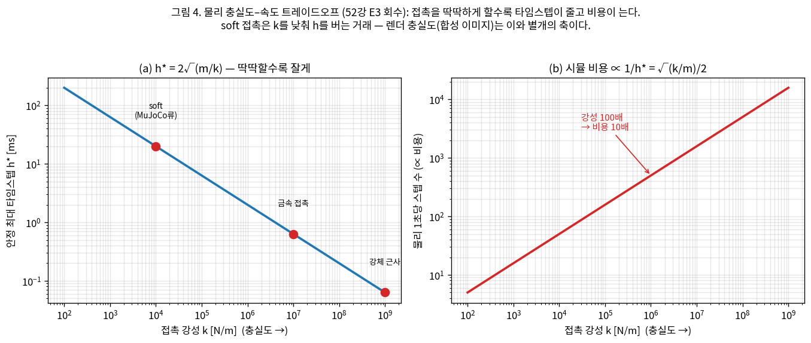

# Lec 51. 시뮬레이터 지형도

> Part 12(환경: 시뮬레이션과 합성 데이터)의 문 여는 강의이자 이 파트의 ★. 선수 지식: 52강(물리엔진 내부 — 적분기·접촉 솔버·타임스텝·안정성). 함께 보면 좋은 강의: 0강(환경 3형태·전이함수 $f$), 27강(학습 파이프라인 — 과적합·분포이동), 37강(compounding error), 41강(RL).
> 이어지는 강의: 53강(합성 데이터·도메인 랜덤화 — 오늘 예고한 DR의 본론), 54강(학습된 world model), 60강(시스템 식별).
> 시뮬레이터 실측 스펙(FPS·데이터 규모·arXiv ID)은 WebSearch로 교차검증했다(접속 2026-07-09). 회사 자체 발표 수치는 그렇게 표기한다.

## 한 장 요약



시뮬레이터는 0강의 전이함수 $f$를 **손으로 짠 물리 근사**로 구현한 것이다(54강의 학습된 $f$와 대비). 이 강의는 "언제 무엇을 쓰나"의 지도다: 병렬 처리량이 RL 학습 벽시계 시간을 가르고(E1), sim2real 갭은 27·37강에서 배운 **분포이동**이며(E2), 접촉 충실도와 속도는 52강의 타임스텝-강성 삼각관계로 맞물린다(E3). 도구 다섯(MuJoCo/robosuite, ManiSkill3, Isaac Lab, Genesis, RoboCasa+MimicGen)을 이 세 축 위에 놓는다.

## 학습 목표

1. 로봇 학습용 시뮬레이터 다섯 계열을 **물리엔진·GPU병렬·자산/씬·용도·라이선스** 축으로 비교하고, 주어진 태스크(정밀 조작 IL / 수천 env RL / 주방 데이터 대량생성)에 어느 것이 맞는지 근거와 함께 고를 수 있다.
2. **병렬 처리량 = envs × steps/s**와 학습 벽시계 시간 = 필요표본/처리량의 관계를 수식과 코드로 계산하고, "왜 GPU 병렬 시뮬이 RL 시대를 열었는가"를 정량적으로 방어할 수 있다(E1).
3. **sim2real 갭을 분포이동으로 정식화**하고(E2), 도메인 랜덤화가 "실제 분포를 시뮬 분포의 지지집합 안에 넣는" 조작임을 토이 실험으로 보이며, 27·37강의 분포이동·compounding error와 연결할 수 있다.
4. **물리 충실도–속도 트레이드오프**를 52강의 $h^\*=2/\omega$에서 유도하고, 렌더 충실도가 이와 **별개의 축**임을 구분할 수 있다(E3).
5. "시뮬이면 sim2real 자동 해결", "GPU 시뮬이 항상 최선", "MuJoCo는 구식" 같은 흔한 오해를 실측 근거로 반박할 수 있다.

## 왜 이 강의가 필요한가

0강에서 환경을 세 형태로 나눴다 — ① 실제 로봇, ② 물리 시뮬레이터, ③ 학습된 world model. 실제 로봇은 느리고(하루에 수백 에피소드), 비싸고, 부순다. RL은 수백만~수십억 스텝을 요구한다(41강). 이 산술이 안 맞아서 필드는 시뮬로 갔다 — π0의 학습 데이터에도, GR00T(46강)의 훈련 인프라에도 시뮬이 깔려 있다. 그런데 "시뮬을 쓴다"는 말은 실제로는 **다섯 개의 서로 다른 도구 중 무엇을, 어떤 트레이드오프를 감수하고 쓰는가**의 문제다. MuJoCo로 정밀 조작을 검증할 것인가, Isaac Lab으로 수천 env를 굴려 보행 정책을 뽑을 것인가, RoboCasa로 주방 데이터를 10만 개 찍을 것인가 — 이 셋은 다른 질문에 답하는 다른 기계다.

이걸 모르면 세 가지가 안 된다. 첫째, **도구를 남의 트윗으로 고른다** — "Genesis가 4090에서 4300만 FPS"라는 헤드라인이 어떤 조건에서 나온 수치인지 모른 채 프로젝트를 건다(§본문에서 그 조건을 밝힌다). 둘째, **sim2real 실패를 "시뮬이 원래 그래"로 체념한다** — 갭이 분포이동이라는 걸 알면 27·37강의 도구(커버리지·강건화·DR)를 그대로 가져올 수 있는데도. 셋째, **접촉 충실도와 렌더 충실도를 뭉뚱그린다** — "포토리얼한 이미지"와 "정확한 물리"는 완전히 다른 축이고, 어느 것이 병목인지 모르면 엉뚱한 시뮬을 산다. 이 강의는 로봇공학자의 언어(분포 커버리지·강건 제어·SE(3)·시스템 식별)로 이 지도를 그린다. 로봇공학자는 이미 "시스템 식별 = $f$의 파라미터 맞추기"를 안다(60강). 시뮬레이터는 그 $f$를 **손으로 짜 넣은 것**이고, world model(54강)은 그 $f$를 **데이터로 학습한 것**이다 — 셋이 같은 자리의 세 답이다.

## 본문

### 0. 다섯 도구를 한 지도에 — 무엇이 무엇과 다른가

시뮬레이터를 두 축으로 눕히면 지형이 보인다: **가로 = 접촉·물리 충실도**(모델기반·정밀 접촉에 유리한가), **세로 = 병렬 처리량**(수천 env를 GPU에서 굴리는가). 좌하는 정밀·단일, 우상은 대량병렬이다.



*그림 1. 로봇 학습용 시뮬레이터 지형도(정성 배치 — 절대 좌표는 무의미, 상대적 위치만 읽는다). 좌하(정밀·단일 CPU): MuJoCo/robosuite는 볼록 접촉과 모델기반 제어의 표준(52강). 우상(대량병렬): Isaac Lab(PhysX)·ManiSkill3(SAPIEN)·Genesis는 수천 env를 GPU에서 굴려 RL 처리량을 극대화한다. MuJoCo MJX는 MuJoCo 물리를 JAX로 GPU 벡터화한 중간 지대. RoboCasa+MimicGen은 MuJoCo 위에 얹은 **씬·데이터 계층**(주방 120·객체 2500+)이라 물리축은 MuJoCo를 따르되 용도가 다르다. 점선은 충실도↔처리량의 경향적 트레이드오프(§E3). `gen_figs.py`가 정성 좌표로 그린다 — 위치는 본문 비교표의 정성 평가지 측정값이 아니다.*

지도만으로는 부족하니, 실측 스펙을 표로 못박는다(수치·arXiv ID는 WebSearch 검증):

| 도구 | 물리엔진 | GPU 병렬 | 자산/씬 규모 | 태생의 용도 | 라이선스 |
|---|---|---|---|---|---|
| **MuJoCo / robosuite** [1][2] | MuJoCo(볼록 soft 접촉, 일반화 좌표) | ✗(단일 CPU 기본)·MJX로 GPU 벡터화 | robosuite v1.x: 로봇 7·그리퍼 8·태스크 9종 [2] | 모델기반 제어·정밀 IL·시스템 식별 | Apache-2.0 |
| **ManiSkill3** [3] | SAPIEN(PhysX) | ✓ 시뮬+**렌더** 동시 병렬 | 조작 중심, GPU 포인트클라우드·이질 시뮬 | 대량병렬 RL+시각 관측, 벤치마크 | Apache-2.0 |
| **Isaac Lab** [4][5] | PhysX(반복 임펄스 TGS) | ✓ 처음부터 수천 env | 광범위(휴머노이드·이동·조작), RTX 렌더 | 대규모 RL+합성데이터, GR00T 인프라(46강) | BSD-3(오픈)·NVIDIA 스택 의존 |
| **Genesis** [6] | 멀티솔버(강체·MPM·SPH·FEM·PBD), 순수 Python | ✓ 초고속(회사 발표) | 범용(팔·다리·드론·연체·유체) | 초고속 시뮬+생성 데이터 플랫폼 | Apache-2.0 |
| **RoboCasa + MimicGen** [7][8] | MuJoCo(robosuite 기반) | ✗(MuJoCo 물리축) | **주방 120씬·3D 객체 2500+**, 태스크 100 | 합성 데이터 **대량 생성**(53강 예고) | 오픈(각 저장소) |

읽는 법 세 가지:

- **행이 다르면 답하는 질문이 다르다.** MuJoCo/robosuite는 "이 조작이 정밀하게 되는가"(52강의 볼록 접촉·역동역학), Isaac Lab·ManiSkill3는 "수천 env를 굴려 RL 정책을 며칠 안에 뽑는가"(E1), RoboCasa+MimicGen은 "사람 시연 200개를 10만 개로 불리는가"(53강). Genesis는 "하나의 엔진으로 강체·연체·유체를 다 다루면서 초고속인가"를 노린다.
- **"물리엔진" 열이 겹친다.** 차세대 GPU 시뮬 생태계에서도 MuJoCo 유래의 GPU 백엔드(MuJoCo Warp/MJWarp, DeepMind·NVIDIA Newton 프로젝트)를 채택하는 흐름이 있다 — MuJoCo Playground가 MJWarp 위에서 돌고, Isaac Lab도 Newton 통합을 예고했다 [1][5]. MuJoCo의 접촉 모델링이 여전히 기준점이라는 뜻이다(흔한 오해 4). (Genesis는 이와 달리 자체 엔진(IPC·다중솔버) 계보라, MJWarp 채택 대상이 아니다 — 오해 4 각주.)
- **RoboCasa는 "새 물리엔진"이 아니다.** MuJoCo/robosuite 위에 얹은 **씬·자산·데이터 계층**이다 — 물리는 52강의 MuJoCo 그대로 쓰고, 그 위에서 다양한 주방과 객체를 조합해 데이터를 찍는다. MimicGen은 그 데이터를 200개 시연 → 수만 개로 증식하는 도구인데, 그 증식의 수학이 3강의 **SE(3) 좌표변환**이다(로봇공학자를 위한 번역에서 상술).

### 1. 핵심 수식

세 수식이 이 지도의 세 축이다: **E1** 병렬 처리량이 학습 벽시계 시간을 가르는 이유(세로축), **E2** sim2real 갭이 분포이동인 이유(실제↔시뮬 축), **E3** 충실도-속도 트레이드오프(가로↔세로의 결합).

#### E1. 병렬 시뮬 처리량과 표본효율 — GPU 병렬이 RL 시대를 연 산술

**① 직관**: RL은 시행착오로 배운다(41강). 수백만~수십억 번 넘어지고 일어서야 걷는다. 실제 로봇으로는 불가능한 숫자다. 시뮬은 이걸 벽시계 시간으로 바꾸는데, **초당 몇 스텝을 밟느냐**가 곧 학습 속도다. 단일 CPU가 초당 천 스텝이면 10억 스텝에 11.6일이지만, GPU가 수천 env를 병렬로 굴려 초당 백만 스텝이면 같은 학습이 17분이다. 이 산술 하나가 Isaac Gym(2021, arXiv:2108.10470 [4])이 연 "GPU 대규모 병렬 RL" 시대의 전부다.

**② 물리·기하적 의미**: 처리량은 두 인자의 곱이다 — **동시에 굴리는 환경 수(envs)** × **환경당 초당 스텝(steps/s)**. CPU 시뮬(MuJoCo)은 env 하나를 아주 빠르고 정확하게 굴리지만 병렬성이 낮고, GPU 시뮬(Isaac·ManiSkill3)은 env당 스텝은 CPU만 못해도 수천 개를 동시에 밟아 총합이 압도한다. 필요 표본이 고정이면 학습 벽시계 시간은 처리량에 **반비례**한다. 다만 env를 무한히 늘려도 학습이 무한히 빨라지지 않는다 — env가 충분히 빠르면 이번엔 **정책 업데이트(GPU forward/backward)가 병목**이 된다. 이건 로봇공학자에게 낯익다: 병렬화의 한계는 Amdahl 법칙, 즉 직렬 구간(여기선 학습 스텝)이 정한다.

**③ 형식**: 처리량 $T$, 필요 표본 $N$, 벽시계 학습시간 $t$는

$$
T = N_{\text{env}} \times r \quad[\text{steps/s}], \qquad t = \frac{N}{T} = \frac{N}{N_{\text{env}}\, r}
$$

여기서 $r$은 env당 초당 스텝. env를 늘려 $T$가 커져도, 정책 업데이트 처리량 $T_{\text{learn}}$이 유한하면 실효 처리량은 직렬 합성으로 묶인다(Amdahl류):

$$
T_{\text{eff}} = \left(\frac{1}{T_{\text{sim}}} + \frac{1}{T_{\text{learn}}}\right)^{-1} \xrightarrow{\;T_{\text{sim}}\to\infty\;} T_{\text{learn}}
$$

즉 시뮬을 아무리 빠르게 해도 학습은 $T_{\text{learn}}$ 위로 못 간다 — "시뮬만 빠르면 다 빨라진다"가 틀린 이유다.

#### WE-1 (손 + 코드): 처리량 → 학습 벽시계 시간, 그리고 병목 이동

**손계산**: 필요 표본 $N=10^9$ 스텝(전형적 대규모 RL). 단일 CPU MuJoCo가 env당 $r=1000$ steps/s($=1$ms/step)이고 env 1개면 $T=1000$, $t = 10^9/1000 = 10^6$초 $= 277.8$시간 $= \mathbf{11.6일}$. 반면 ManiSkill3가 총 $10^6$ steps/s면 $t = 10^9/10^6 = 1000$초 $= \mathbf{16.7분}$ — **약 1000배**. 병목 이동: env를 4096개로 늘려 $T_{\text{sim}}=4.096\times10^6$인데 $T_{\text{learn}}=150{,}000$이면, 실효는 $(1/4.096\text{M} + 1/150\text{k})^{-1} = 144{,}701$ steps/s — env 처리량의 3.5%밖에 못 살린다(학습이 병목).

**검증 코드**:

```python
import numpy as np
N = 1e9                                  # 필요 표본 (환경 스텝)
tp = {"단일CPU MuJoCo(1env)": 1_000, "MuJoCo MJX(수천)": 200_000,
      "Isaac Lab(수천)": 100_000, "ManiSkill3(state)": 1_000_000}
for name, T in tp.items():
    t = N / T
    print(f"{name:22s} {T:>10,} st/s -> {t/3600:8.2f} h ({t/86400:5.1f} d)")
# 병목 이동: env를 늘려도 학습 처리량이 상한
T_learn = 150_000
for T_sim in [1_000, 4_096_000, 1e12]:
    T_eff = 1.0/(1.0/T_sim + 1.0/T_learn)
    print(f"T_sim={T_sim:>15,.0f} -> T_eff={T_eff:>12,.0f} st/s")
```

출력:
```
단일CPU MuJoCo(1env)          1,000 st/s ->   277.78 h ( 11.6 d)
MuJoCo MJX(수천)            200,000 st/s ->     1.39 h (  0.1 d)
Isaac Lab(수천)            100,000 st/s ->     2.78 h (  0.1 d)
ManiSkill3(state)        1,000,000 st/s ->     0.28 h (  0.0 d)
T_sim=          1,000 -> T_eff=         993 st/s
T_sim=      4,096,000 -> T_eff=     144,701 st/s
T_sim=1,000,000,000,000 -> T_eff=     150,000 st/s
```

11.6일 → 17분(약 1000배)이 GPU 병렬 시뮬의 존재 이유다(그림 2). 그리고 $T_{\text{sim}}\to\infty$에서 $T_{\text{eff}}\to 150{,}000$으로 포화 — "시뮬만 빠르면 된다"가 아니라 학습 파이프라인 전체가 균형 잡혀야 한다. **주의**: 위 처리량은 개념 토이의 대표값이다. 실측 헤드라인은 훨씬 크지만(ManiSkill3는 벤치마크에서 30,000+ FPS를 넘어 상황에 따라 그 이상 [3], Genesis는 4090 단일 GPU에서 4300만 FPS를 **회사 발표** [6]) — 그 수치가 어떤 조건에서 나오는지는 흔한 오해 2에서 뜯는다.



*그림 2. (a) 처리량 = envs × steps/s(로그 축). (b) 필요표본 $10^9$ 고정 시 학습 벽시계 시간 = 필요표본/처리량. 단일 CPU 11.6일이 ManiSkill3급 처리량에서 17분으로 줄어든다 — RL의 실현가능성 자체가 처리량에 걸려 있다. 이 그림의 처리량은 개념 대표값이고, 실측 스펙은 본문 [3][4][6] 인용을 따른다. WE-1 코드가 생성.*

#### E2. sim2real 갭 = 분포이동 (27·37강 회수)

**① 직관**: 시뮬에서 100% 성공하던 정책이 실물에서 무너진다. 왜? 정책이 본 세계(시뮬 분포)와 배치되는 세계(실제 분포)가 다르기 때문이다. 이건 새 개념이 아니다 — 27강의 **분포이동**(train ≠ test), 37강의 **compounding error**(작은 오차가 롤아웃에서 누적)와 정확히 같은 병이다. 시뮬-실제의 축만 바뀌었을 뿐.

**② 물리·기하적 의미**: 정책은 훈련 분포 $p_{\text{sim}}(o)$ 위에서 최적화된다. 배치 때는 $p_{\text{real}}(o)$에서 작동한다. 두 분포의 지지집합(support)이 어긋난 영역에서는 정책이 **한 번도 보지 못한 입력**을 받고, 그 위에서의 행동은 보장이 없다. 게다가 로봇은 개루프 적분계라(37강) 한 스텝의 어긋남이 다음 관측을 훈련 분포에서 더 멀리 밀어내고 — 이게 compounding error다. 로봇공학자에게 이건 **강건 제어의 언어**다: 시뮬 분포는 공칭 모델(nominal plant), 실제 분포는 불확실성 집합 안의 한 점, DR은 그 불확실성 집합 전체를 커버하도록 훈련 분포를 넓히는 것 = 강건화. **도메인 랜덤화**(Tobin 2017 [9])는 "실제 세계가 시뮬의 한 변형처럼 보이도록" 시뮬을 마구 흔들어, 실제 분포를 시뮬 분포의 지지집합 **안에** 집어넣는다(53강 본론).

**③ 형식**: 정책 성능 저하는 두 분포의 불일치로 상계된다. 손실 $\ell$이 유계일 때(전변동 거리 $d_{TV}$ 사용),

$$
\underbrace{\big|\, \mathbb{E}_{p_{\text{real}}}[\ell] - \mathbb{E}_{p_{\text{sim}}}[\ell] \,\big|}_{\text{sim2real 성능 하락}} \;\le\; 2\,\ell_{\max}\, d_{TV}\!\left(p_{\text{sim}},\, p_{\text{real}}\right)
$$

DR은 훈련 분포를 혼합 $p_{\text{DR}} = \int p_{\text{sim}}(\cdot\,;\xi)\,w(\xi)\,d\xi$(랜덤화 파라미터 $\xi$)로 넓혀 $d_{TV}(p_{\text{DR}}, p_{\text{real}})$을 줄인다 — 이상적으로 $\mathrm{supp}(p_{\text{real}}) \subseteq \mathrm{supp}(p_{\text{DR}})$(커버리지). 이것이 "분포이동을 커버리지로 막는다"의 형식이다.

#### WE-2 (손 + 코드): 지름길 학습과 도메인 랜덤화의 회복

시뮬이 실제와 **우연히 상관된 특징**을 갖는 것이 sim2real 갭의 교활한 형태다. 정책은 참 원인이 아니라 그 지름길을 익스플로잇하고, 실제에서 상관이 깨지면 붕괴한다.

**셋업**: 파지 성공을 결정하는 참 원인은 **마찰**($x_2>0.5$면 성공). 그런데 시뮬에서는 렌더 세팅 하나 때문에 **물체 색**($x_1$)이 성공 라벨과 거의 완벽히 공변한다(성공하는 물체는 늘 밝게 렌더됨). 정책은 "밝으면 성공"이라는 지름길을 배운다. 실제에서는 색과 성공의 상관이 없다(색은 무작위) → 지름길이 무효 → 붕괴. 도메인 랜덤화 = **시뮬에서 색을 랜덤화**해 그 우연한 상관을 깨면, 정책은 참 원인(마찰)만 남긴다.

```python
import numpy as np
rng = np.random.default_rng(0)
true = lambda x2: (x2 > 0.5).astype(int)             # 참 규칙: 마찰만 결정

def sim_data(n):                                     # 색이 라벨과 공변(지름길)
    x2 = rng.uniform(0.1, 0.9, n); y = true(x2)
    x1 = np.where(y==1, 0.75, 0.25) + rng.normal(0, 0.04, n)
    return np.stack([x1, x2], 1), y
def real_data(n):                                    # 색 무작위(공변 깨짐)
    x2 = rng.uniform(0.1, 0.9, n)
    return np.stack([rng.uniform(0.1,0.9,n), x2], 1), true(x2)
def dr_data(n):                                      # DR: 색 랜덤화
    x2 = rng.uniform(0.1, 0.9, n)
    return np.stack([rng.uniform(0.1,0.9,n), x2], 1), true(x2)

def fit(X, y, lr=0.3, it=6000):                      # 로지스틱 회귀(순수 numpy GD)
    w = np.zeros(X.shape[1]); b = 0.0
    for _ in range(it):
        p = 1/(1+np.exp(-(X@w+b)))
        w -= lr*(X.T@(p-y)/len(y)); b -= lr*np.mean(p-y)
    return w, b
acc = lambda w,b,X,y: np.mean(((1/(1+np.exp(-(X@w+b))))>0.5).astype(int)==y)

Xs,ys = sim_data(4000); Xr,yr = real_data(4000); Xd,yd = dr_data(8000)
ws,bs = fit(Xs,ys); wd,bd = fit(Xd,yd)
frac = lambda w: abs(w[0])/(abs(w[0])+abs(w[1]))     # 색(지름길) 가중치 비중
print(f"시뮬 학습: sim={acc(ws,bs,Xs,ys):.3f} real={acc(ws,bs,Xr,yr):.3f} 색비중={frac(ws):.3f}")
print(f"DR  학습: sim={acc(wd,bd,Xs,ys):.3f} real={acc(wd,bd,Xr,yr):.3f} 색비중={frac(wd):.3f}")
```

출력:
```
시뮬 학습: sim=1.000 real=0.624 색비중=0.663
DR  학습: sim=0.987 real=0.997 색비중=0.022
```

시뮬에서 100%였던 정책이 실제에서 **62.4%**로 무너진다(색 가중치 비중 0.663 — 정책이 색 지름길에 절반 넘게 의존). 도메인 랜덤화로 색을 흔들면 실제 정확도가 **99.7%로 회복**되고, 색 가중치 비중이 0.022로 떨어진다 — 정책이 참 원인(마찰)만 보게 된 것이다. 이게 DR의 본질이다: **정보를 더 주는 게 아니라, 익스플로잇할 우연한 상관을 제거**한다. 27강의 "spurious correlation·과적합"과 정확히 같은 병이고 같은 약이다.



*그림 3. (a) 시뮬 학습·시뮬 평가: 색이 라벨과 공변해 학습 경계(검정)가 대각선으로 서고 시뮬에선 100%. (b) 같은 정책·실제 분포: 색-라벨 공변이 깨지자 대각 경계가 참 경계(초록 수평선, 마찰=0.5)와 어긋나 62%로 붕괴. (c) DR 학습·실제 분포: 색을 랜덤화하니 학습 경계가 참 경계와 거의 수평으로 일치해 99.7% 회복. WE-2 코드가 생성. 이 토이는 개념 재현용이며 실제 정책·시뮬이 아니다.*

#### E3. 물리 충실도–속도 트레이드오프 (52강 E3 회수)

**① 직관**: 접촉을 실물처럼 딱딱하게 하면 시뮬이 느려지고, 빠르게 하려면 접촉을 무르게 근사해야 한다. 셋 중 둘만 고를 수 있다(정확한 접촉 / 큰 타임스텝 / 안정성). 그리고 이건 **물리** 축의 이야기다 — "포토리얼한 이미지를 렌더하는가"라는 **렌더** 축은 이와 완전히 별개다(오해 3).

**② 물리·기하적 의미**: 52강에서 유도했듯 시스템의 가장 뻣뻣한 모드 진동수 $\omega_{\max}=\sqrt{k_{\text{eff}}/m_{\text{eff}}}$가 안정 타임스텝을 지배한다. 접촉 강성 $k$가 클수록 $\omega$가 크고, 안정 최대 타임스텝 $h^\*=2/\omega$가 작아진다(explicit/symplectic 계열의 $h\omega<2$ 조건). 물리 1초를 시뮬하는 비용은 스텝 수 $\propto 1/h^\*$이므로 강성의 제곱근에 비례한다. **soft 접촉**(52강의 solref/solimp)은 $k$를 인위적으로 낮춰 $h$를 벌어들이는 거래다 — 그래서 GPU 시뮬이 수천 env를 굴리려면 접촉을 어느 정도 무르게 할 수밖에 없고(우상단 도구들), 정밀 접촉이 필요하면 CPU에서 작은 $h$로(좌하단) 가야 한다. 이게 지형도(그림 1) 대각선의 물리적 근거다.

**③ 형식**: 52강의 결과를 처리량으로 이어 붙이면

$$
h^\* = \frac{2}{\omega_{\max}} = 2\sqrt{\frac{m_{\text{eff}}}{k_{\text{eff}}}}, \qquad
\text{비용} \propto \frac{1}{h^\*} = \frac{1}{2}\sqrt{\frac{k_{\text{eff}}}{m_{\text{eff}}}}
$$

강성 100배 → $h^\*$ 1/10 → 비용 10배. **렌더 충실도는 이 식에 등장하지 않는다** — 합성 이미지의 리얼함은 GPU 래스터/레이트레이싱 비용이지 물리 적분 비용이 아니다. 두 축을 한 손잡이로 착각하면(오해 3) 엉뚱한 시뮬을 고른다.



*그림 4. (a) $h^\*=2\sqrt{m/k}$ — 접촉이 딱딱할수록(강성 $k$↑) 안정 타임스텝이 작아진다(soft ~$10^4$: 20ms, 금속 ~$10^7$: 0.63ms, 강체 근사 ~$10^9$: 63µs). (b) 시뮬 비용 $\propto 1/h^\* = \sqrt{k/m}/2$ — 강성 100배면 비용 10배(코드 검증: 비용비 정확히 10.0000). soft 접촉은 $k$를 낮춰 $h$를 버는 거래이고, 렌더 충실도는 이와 별개 축이다. 52강 E3의 회수. `gen_figs.py`가 생성.*

### 2. 로봇공학자를 위한 번역

- **MimicGen의 데모 증식 = SE(3) 좌표변환(3강).** MimicGen은 사람 시연 200개를 수만 개로 불린다 [8]. 마법이 아니다: 시연을 **객체 중심 부분궤적(object-centric segments)**으로 쪼갠 뒤, 새 장면에서 객체의 새 자세 $T_{\text{new}}\in SE(3)$에 맞춰 그 부분궤적을 **강체 변환**한다. 원래 시연의 EEF 궤적 $\{T^{\text{ee}}_t\}$를 객체 좌표계로 옮기고($T^{\text{obj}-1}\, T^{\text{ee}}_t$), 새 객체 자세를 다시 곱한다($T_{\text{new}}\, T^{\text{obj}-1}\, T^{\text{ee}}_t$). 이건 3강에서 손으로 굴린 좌표변환 그대로다. "데이터 증식"이라는 딥러닝 용어 뒤에 로봇공학자가 이미 아는 기하가 있다 — 그래서 MimicGen이 왜 접촉이 강체 변환으로 잘 보존되는 픽앤플레이스류에 강하고, 변형체·연속 접촉에 약한지도 예측된다(3강의 강체 가정이 깨지는 곳).

- **도메인 랜덤화 = 분포 커버리지 · 강건 제어.** DR을 흔드는 대상(마찰·질량·조명·지연)은 강건 제어의 불확실성 파라미터 $\Delta$와 같다. 공칭 모델 하나로 튜닝한 제어기(시뮬 한 세팅 정책)는 $\Delta$가 크면 무너지고, $\mu$-합성/$H_\infty$가 불확실성 집합 전체에서 안정을 보장하듯 DR은 랜덤화 집합 전체에서 작동하는 정책을 찾는다. **무엇을 얼마나 흔들지가 곧 불확실성 집합의 설계**이고, 그 물리 목록이 52강 §4의 sim2real 원인 표다(53강에서 본론).

- **sim2real 갭 = 분포이동(27·37강) · 모델 불확실성.** 시뮬 전이함수 $f_{\text{sim}}$과 실제 $f_{\text{real}}$의 차이가 갭의 근원이다. 로봇공학자는 이걸 "모델 오차"로 부르며 시스템 식별(60강)로 좁혀 왔다. DL 시대의 두 대응이 대칭적이다: **시스템 식별**(60강)은 $f_{\text{sim}}$을 실물에 맞춰 갭을 좁히고(모델을 실제로 당김), **DR**(53강)은 $f_{\text{sim}}$을 넓게 흔들어 실제를 덮는다(모델을 실제 위로 펼침). 좁히기 vs 펼치기 — 같은 갭에 대한 두 전략.

- **world model = 시스템 식별(60강)의 딥러닝 극한.** 60강의 시스템 식별은 $f$의 **파라미터 몇 개**(질량·관성·마찰계수)를 데이터로 맞춘다. 학습된 world model(54강)은 $f$ **전체를 신경망으로** 데이터에서 학습한다 — 손으로 짠 물리엔진(이 강의)의 반대편 극한. 셋을 한 줄에 놓으면: 물리 시뮬(손으로 짠 $f$) → 시스템 식별(파라미터만 학습한 $f$) → world model(통째로 학습한 $f$). 0강의 전이함수 $f$가 이 스펙트럼을 관통한다.

## 흔한 오해

1. **"시뮬을 쓰면 sim2real은 자동으로 해결된다"** — 시뮬은 갭을 **만드는** 쪽이지 없애는 쪽이 아니다. WE-2에서 봤듯 시뮬 100%가 실제 62%로 무너지는 게 기본값이고, DR·시스템 식별·실기 파인튜닝 같은 **능동적 대책**이 있어야 갭이 준다. "시뮬에서 됐으니 됐다"는 57강의 평가 함정(오해 5)과 짝을 이루는 착각이다.

2. **"GPU 시뮬이 항상 최선이다"** — 세 가지 반례. ⓐ 헤드라인 처리량은 **특정 조건**의 수치다: Genesis의 4300만 FPS(회사 발표 [6])는 4090에서 **팔 하나 + 자기충돌만** 켠 장면의 값이고, 랜덤 행동을 넣으면 약 2700만으로, 복잡한 유체/MPM 씬에선 훨씬 낮아진다(2025.1 벤치마크 보고서 [6]). ManiSkill3의 30,000+ FPS도 벤치마크 태스크 기준이다 [3]. ⓑ 접촉 충실도가 병목이면 GPU 병렬성은 무의미하다 — 정밀 조립·역동역학엔 MuJoCo가 유리하다(52강). ⓒ 자산·씬이 병목이면(주방 데이터) RoboCasa 같은 계층이 답이지 순수 처리량이 아니다. **처리량은 여러 축 중 하나다.**

3. **"물리 정확도 = 렌더 정확도"** — 완전히 별개의 두 축이다(E3). 접촉 물리는 적분기·솔버·타임스텝의 문제(52강), 렌더 리얼함은 GPU 래스터/레이트레이싱의 문제다. 포토리얼한 이미지를 뽑는 시뮬이 접촉을 정확히 푸는 건 아니고(그 반대도), 시각 정책엔 렌더 충실도가, 접촉 조작엔 물리 충실도가 병목이다. "어느 축이 우리 태스크의 병목인가"를 먼저 물어야 시뮬을 옳게 고른다.

4. **"MuJoCo는 구식이고 이제 GPU 시뮬 시대다"** — MuJoCo는 여전히 **표준**이다. robosuite·RoboCasa·MimicGen이 그 위에 서 있고 [2][7][8], MuJoCo는 MJX로 GPU 벡터화됐으며 [1], 그 위에 DeepMind·NVIDIA가 MuJoCo Warp(MJWarp)/Newton으로 GPU 백엔드를 다시 짜 MuJoCo Playground·Isaac Lab이 이를 채택·통합하는 흐름이 있다 [1][5] — MuJoCo의 접촉 모델링·안정성이 아직 기준점이라는 뜻이다. (Genesis는 자체 IPC 계보라 MJWarp를 쓰지 않는다 — 이 채택 흐름은 MuJoCo 생태계 안의 것이고, 정확한 시점·범위는 커뮤니티 관측(2차)이다.) "새 도구 = 옛 도구 폐기"가 아니라, 각자 다른 질문에 답하며 공존한다(§0 표).

5. **"시뮬 성능 = 실제 성능"** — 시뮬 벤치마크 점수는 실물 성능의 **상계도 하계도 아니다.** 정책은 시뮬의 허구(침투·완화된 접촉·우연한 상관, 52강·WE-2)를 익스플로잇해 시뮬 점수를 부풀릴 수 있고, 반대로 시뮬에 없는 실물의 이점(사람이 잡아주는 관성 등)을 못 써서 낮게 나올 수도 있다. 시뮬 리더보드 순위와 실물 순위가 어긋나는 문제는 57강(벤치마크·평가)의 본론이다 — 오늘은 "시뮬 숫자를 실물 숫자로 읽지 말라"만 기억한다.

## 실습 (1.5~2시간)

**실제 시뮬레이터를 두 개 이상 구동해 지형도의 세 축을 손으로 확인한다.** 규칙: 매 실험 전에 예측을 숫자로 쓴다(E1~E3의 식이 있으니 가능하다).

1. **(30분) robosuite 구동 — 정밀·단일 축.** `pip install robosuite`(MuJoCo 자동 설치) → `Lift`나 `Stack` 환경을 랜덤 정책으로 100 스텝 굴리고, 벽시계로 env당 steps/s를 실측한다. E1 표의 "단일 CPU MuJoCo" 값과 자기 CPU를 비교한다. 관측·행동 공간 shape를 출력해 50강의 action space와 연결한다.
2. **(35분) ManiSkill3 구동 — 대량병렬 축(GPU 있으면).** `pip install mani-skill` → `PickCube` 같은 태스크를 `num_envs`를 1 → 16 → 256으로 키우며 총 처리량(steps/s)을 실측하고, E1의 $T=N_{\text{env}}\times r$이 어디까지 선형인지, 어디서 꺾이는지(GPU 포화) 관찰한다. **GPU가 없으면**: WE-1 코드로 처리량-시간 표를 자기 필요표본( $10^7\sim10^9$ )으로 다시 만들고 그림 2를 재현한다.
3. **(30분) 도메인 랜덤화 토이 확장 — sim2real 축.** WE-2 코드에서 (a) DR 분포 폭을 좁혀가며(색 랜덤화 범위 0.9→0.5→0.3) 실제 정확도가 언제 무너지는지, (b) 참 원인을 마찰+두 번째 특징으로 늘렸을 때 회복이 얼마나 어려워지는지 실험한다. E2의 "커버리지" 지표를 코드로 계산해 지지집합 커버와 정확도의 상관을 확인한다.
4. **(25분) 지형도 자기화.** §0 비교표를 **자기 태스크**(예: SO-101 파지 IL, G1 보행 RL, 주방 조작 데이터 생성)로 특수화한다: 세 축(충실도/처리량/자산) 각각에 자기 태스크의 요구를 상/중/하로 매기고, 그 조합에서 다섯 도구 중 무엇을 왜 고를지 한 문단으로 쓴다. 53강에서 이 선택 위에 데이터 전략을 얹는다.

## Claude와 토론할 질문

1. E1의 병목 이동($T_{\text{eff}}\to T_{\text{learn}}$)을 자기 하드웨어로 구체화하라: 4090 한 대에서 정책 업데이트가 소화하는 steps/s를 추정하고, env를 몇 개까지 늘리는 게 의미 있는지 계산하라. "env를 더 늘려도 안 빨라지는" 지점은?
2. WE-2의 지름길은 색↔라벨의 우연한 상관이었다. 실제 로봇 시뮬에서 정책이 익스플로잇하기 쉬운 "시뮬 우연 상관"을 세 개 상상하고(예: 특정 조명에서만 보이는 그림자, 접촉 완화가 만든 미끄러짐 패턴), 각각을 DR로 깰 수 있는지 논하라.
3. MimicGen의 SE(3) 데모 증식은 픽앤플레이스엔 강하고 변형체엔 약하다. 3강의 강체 변환 가정이 어디서 깨지는지로 이 한계를 설명하고, 변형체 조작 데이터를 늘리려면 무엇이 더 필요한지 논하라(53강의 neural trajectory 예고).
4. "충실도-속도 트레이드오프"(E3)와 "렌더 충실도는 별개 축"(오해 3)을 결합하라: 시각 기반 파지 정책과 접촉 기반 조립 정책에서 각각 어느 충실도가 병목인가? 두 태스크에 같은 시뮬을 쓰는 게 왜 낭비 또는 위험일 수 있는가?
5. sim2real 갭을 좁히는 두 전략 — 시스템 식별(60강, 모델을 실제로 당기기) vs DR(53강, 모델을 실제 위로 펼치기) — 은 언제 어느 쪽이 싼가? 정밀 조립과 거친 지형 보행에서 각각 답하라.
6. Genesis의 4300만 FPS(회사 발표)가 "팔 하나+자기충돌"이라는 조건에서 나왔다는 사실은, 시뮬레이터 벤치마크를 읽는 법에 대해 무엇을 말하는가? 처리량 헤드라인을 볼 때 반드시 물어야 할 세 질문을 만들라.
7. 시뮬 리더보드 순위와 실물 순위가 어긋나는 현상(오해 5·57강)을 WE-2와 52강의 접촉 완화로 두 가지 메커니즘으로 설명하라. 이 어긋남을 줄이려면 시뮬을 고칠 것인가, 평가 프로토콜을 고칠 것인가?

## 읽을거리

1. **ManiSkill3 논문** [3] (~40분): §1(동기·처리량 주장)과 벤치마크 표만 — "GPU에서 시뮬+렌더를 함께 병렬화"가 왜 시각 RL의 판을 바꿨는지. 세부 태스크 카탈로그는 필요할 때만.
2. **Tobin et al., 도메인 랜덤화** [9] (~30분): §3(방법)과 Fig 1~3만 — "비현실적 랜덤 텍스처만으로 실물 검출 1.5cm 정확도"라는 원조 결과. 이 강의 E2·53강의 뿌리.
3. (선택) **RoboCasa 논문** [7] (~30분): §3(자산·씬)과 §4(MimicGen 100K 데이터)만 — 주방 120씬·객체 2500+·궤적 10만이 어떻게 생성됐는지. 53강 전에 훑으면 좋다.
4. (선택) **Genesis 2025.1 벤치마크 보고서** [6] (~20분 훑기): 헤드라인 FPS가 어떤 조건에서 나오는지 — 오해 2를 스스로 확인하는 자료. 성능 주장을 비판적으로 읽는 훈련.

## 자가 점검

1. 시뮬레이터 다섯 계열을 물리엔진·GPU병렬·자산/씬·용도로 표에서 재구성하고, 주어진 태스크에 무엇을 고를지 근거와 함께 말할 수 있는가?
2. $T=N_{\text{env}}\times r$, $t=N/T$로 "1 env 11.6일 → GPU 병렬 17분"을 계산하고, $T_{\text{eff}}\to T_{\text{learn}}$의 병목 이동(env를 늘려도 안 빨라짐)을 설명할 수 있는가?
3. sim2real 갭을 분포이동으로 정식화하고($d_{TV}$ 상계), DR이 "실제 분포를 시뮬 지지집합에 넣는 커버리지 조작"임을 WE-2의 62%→99.7% 회복으로 설명할 수 있는가? 27·37강과 연결되는가?
4. $h^\*=2\sqrt{m/k}$에서 "강성 100배 → 비용 10배"를 유도하고, 물리 충실도와 렌더 충실도가 별개 축임을 말할 수 있는가?
5. MimicGen의 데모 증식이 3강의 SE(3) 좌표변환임을 설명하고, 그것이 픽앤플레이스엔 강하고 변형체엔 약한 이유를 강체 가정으로 댈 수 있는가?
6. 다섯 흔한 오해 각각을 실측 근거 한 줄로 반박할 수 있는가? (특히 "GPU 시뮬이 항상 최선"과 "MuJoCo는 구식")
7. 물리 시뮬 → 시스템 식별 → world model을 "전이함수 $f$를 손으로 짜기 / 파라미터만 학습 / 통째로 학습"의 스펙트럼으로 한 줄에 놓을 수 있는가?(0·54·60강)

## 참고문헌

> 웹 문서·저장소는 2026-07-09 접속 기준. 회사 자체 발표 수치는 "회사 발표"로 표기. (2차) = 언론·2차 출처.

[1] Google DeepMind, MuJoCo 공식 문서 및 MJX. https://mujoco.readthedocs.io · MJX: https://mujoco.readthedocs.io/en/stable/mjx.html
— **뒷받침**: MuJoCo가 볼록 soft 접촉·일반화 좌표를 쓰는 CPU 표준이며 MJX로 GPU 벡터화된다는 §0 표의 MuJoCo 열, 오해 4의 "MJX GPU 벡터화" (52강과 동일 출처).

[2] Y. Zhu, J. Wong, A. Mandlekar, R. Martín-Martín, et al., "robosuite: A Modular Simulation Framework and Benchmark for Robot Learning," arXiv:2009.12293, 2020.9. https://arxiv.org/abs/2009.12293 · 저장소: https://github.com/ARISE-Initiative/robosuite
— **뒷받침**: robosuite가 MuJoCo 기반 모듈형 프레임워크이고 v1.x 기준 로봇·그리퍼·태스크 벤치 구성(로봇 7·그리퍼 8·태스크 9종)이라는 §0 표, Apache-2.0.

[3] S. Tao, F. Xiang, et al., "ManiSkill3: GPU Parallelized Robotics Simulation and Rendering for Generalizable Embodied AI," arXiv:2410.00425, 2024.10 (ICLR 2025). https://arxiv.org/abs/2410.00425
— **뒷받침**: SAPIEN(PhysX) 기반, 시뮬+렌더 GPU 동시 병렬, 벤치마크에서 30,000+ FPS와 타 플랫폼 대비 10~1000배·GPU 메모리 2~3배 절약(논문 기준 128 env 벤치 태스크에서 3.5GB vs Isaac Lab 14.1GB [3])이라는 §0 표·WE-1·오해 2의 ManiSkill3 관련 주장.

[4] V. Makoviychuk, L. Wawrzyniak, Y. Guo, M. Lu, et al., "Isaac Gym: High Performance GPU-Based Physics Simulation for Robot Learning," arXiv:2108.10470, 2021.8. https://arxiv.org/abs/2108.10470
— **뒷받침**: GPU 대규모 병렬 RL 시대를 연 Isaac Gym이 수천 env를 GPU에서 병렬 실행해 CPU-GPU 전송 병목을 제거한다는 E1·§0 표의 배경.

[5] M. Mittal, C. Yu, Q. Yu, et al., "Orbit: A Unified Simulation Framework for Interactive Robot Learning Environments," arXiv:2301.04195, 2023.1 (Isaac Sim 기반, Isaac Lab의 전신) · M. Mittal et al. (NVIDIA), "Isaac Lab: A GPU-Accelerated Simulation Framework for Multi-Modal Robot Learning," arXiv:2511.04831, 2025.11. https://arxiv.org/abs/2301.04195 · https://arxiv.org/abs/2511.04831
— **뒷받침**: Isaac Lab이 PhysX 기반 GPU 대규모 병렬·RTX 렌더 통합·액추에이터/센서 모델·도메인 랜덤화 도구를 갖춘 프레임워크이며 GR00T 계열 훈련 인프라(46강)와 연결된다는 §0 표의 Isaac 열.

[6] Genesis Embodied AI, "Genesis: A Generative and Universal Physics Engine for Robotics and Beyond," 오픈소스 프로젝트(2024.12~). https://github.com/Genesis-Embodied-AI/Genesis · 문서: https://genesis-world.readthedocs.io
— **뒷받침**: 멀티솔버(강체·MPM·SPH·FEM·PBD)·순수 Python·범용 지원이라는 §0 표. **회사 발표**: 4090 단일 GPU에서 4300만 FPS(약 실시간 430,000배)라는 헤드라인과, 2025.1 자체 벤치마크 보고서 기준 그 수치가 "팔 하나+자기충돌"·랜덤행동 시 약 2700만이라는 조건 의존성(오해 2·WE-1·질문 6). **정정**: Genesis 자체는 자체 엔진(IPC·다중솔버·libuipc 확장) 계보로 MuJoCo Warp(MJWarp)를 채택하지 않는다(genesis.ai 블로그·저장소 확인, 접속 2026-07-09). §0·오해 4에서 말한 MJWarp 채택 흐름은 **MuJoCo 생태계 자체**(DeepMind·NVIDIA Newton, MuJoCo Playground, Isaac Lab 통합 예고 — [1][5])의 것이며, 정확한 시점·범위는 커뮤니티 관측(2차)이다.

[7] S. Nasiriany, A. Maddukuri, L. Zhang, et al., "RoboCasa: Large-Scale Simulation of Everyday Tasks for Generalist Robots," arXiv:2406.02523, 2024.6 (RSS 2024). https://arxiv.org/abs/2406.02523
— **뒷받침**: robosuite/MuJoCo 위에 얹은 주방 120씬·3D 객체 2500+·태스크 100·궤적 10만(MimicGen 72K + 생성객체 28K)이라는 §0 표의 RoboCasa 행과 실습 3, 읽을거리 3.

[8] A. Mandlekar, S. Nasiriany, B. Wen, I. Akinola, et al., "MimicGen: A Data Generation System for Scalable Robot Learning using Human Demonstrations," arXiv:2310.17596, 2023.10 (CoRL 2023). https://arxiv.org/abs/2310.17596 · 저장소: https://github.com/NVlabs/mimicgen
— **뒷받침**: 사람 시연 ~200개를 18 태스크에서 50K+ 데모로 증식하며, 그 증식이 객체 중심 부분궤적의 SE(3) 강체 변환이라는 §0 표·로봇공학자를 위한 번역·질문 3.

[9] J. Tobin, R. Fong, A. Ray, J. Schneider, W. Zaremba, P. Abbeel, "Domain Randomization for Transferring Deep Neural Networks from Simulation to the Real World," arXiv:1703.06907, 2017.3 (IROS 2017). https://arxiv.org/abs/1703.06907
— **뒷받침**: DR이 "충분히 흔들면 실제가 시뮬의 한 변형처럼 보인다"는 개념과 비현실적 랜덤 텍스처만으로 실물 객체 검출 1.5cm 정확도를 달성했다는 E2·읽을거리 2. 53강 DR 본론의 뿌리.

*수치 재현성: 본문·그림의 토이 수치(WE-1의 학습시간 11.6일/1.39h/2.78h/17분·병목 이동 실효 144,701·150,000 steps/s, WE-2의 시뮬 100%→실제 62.4%·DR 실제 99.7%·색 가중치 비중 0.663→0.022, 그림 4의 강성 100배 시 비용비 10.0000)는 모두 본문 코드 블록과 `images/lec51/gen_figs.py`의 실행 출력이다 — numpy 1.26 / scipy 1.15 / matplotlib 3.5, 시드 `default_rng(0)` 고정. **이 토이들은 개념 재현용 CPU 시뮬레이션이며 실제 대형 시뮬레이터·정책이 아니다** — 시뮬레이터 실측 스펙(ManiSkill3 30,000+ FPS·메모리, Genesis 4300만 FPS 회사 발표, RoboCasa 10만 궤적 등)은 위 [3][6][7] 등 1차/발표 출처를 따르며, E1 표의 처리량 값(1,000~1,000,000 steps/s)은 계열 구분을 보이기 위한 대표값이지 특정 벤치마크 측정치가 아니다.*
