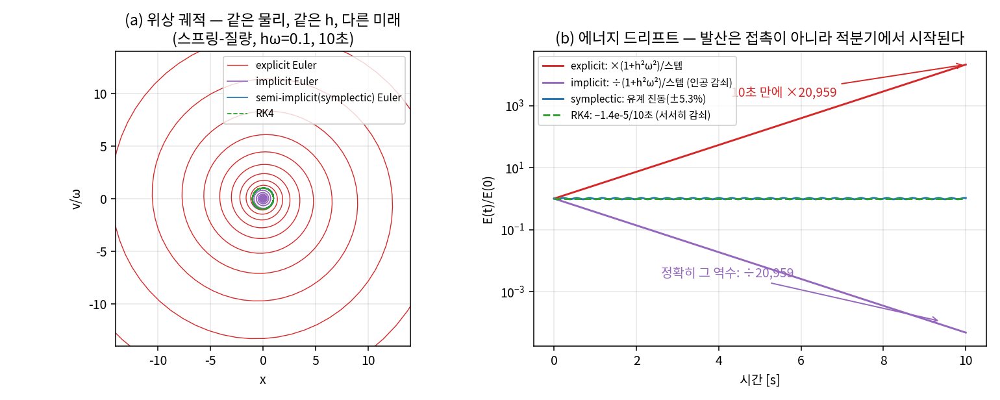
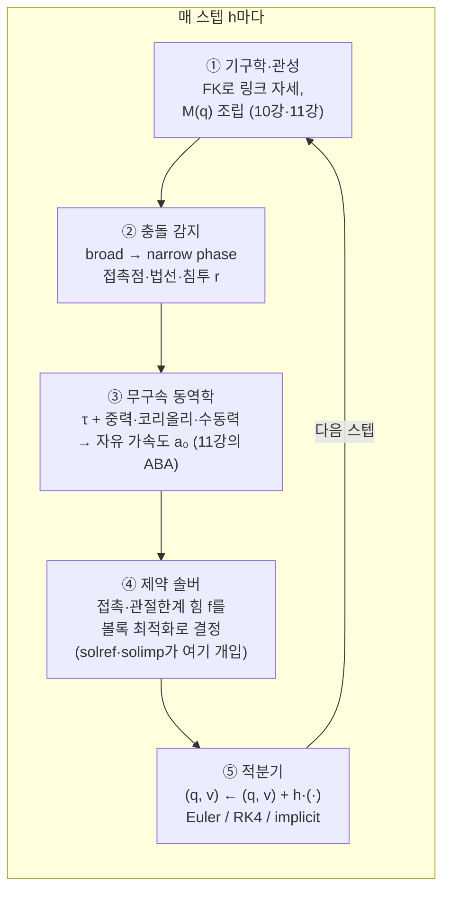
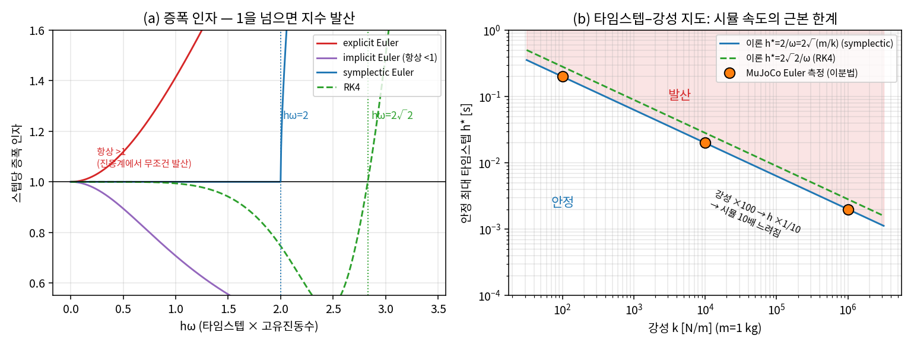
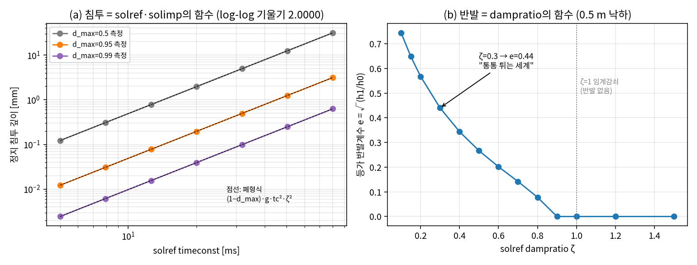
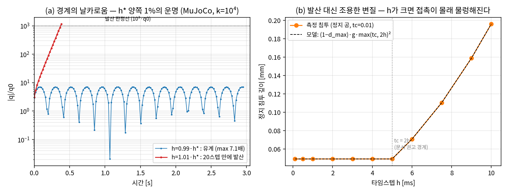
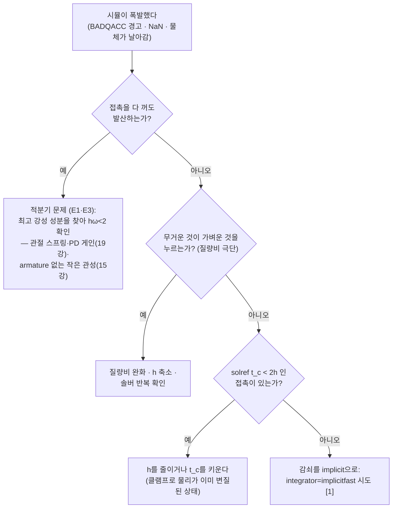

# Lec 52. 시뮬레이션의 내부 — 물리엔진은 무엇을 근사하는가

> 하위제어 트랙 26일차 (Part R6 시스템 통합, 두 번째). 선수 지식: 10강(매니퓰레이터 방정식), 11강(계산 동역학), 12강(접촉·마찰·상보성), 17강(안정성), 18강(상태공간·고유값), 58강(실시간 루프·지연).
> 이 주제는 MR 범위 밖이다 — 기초 참고서는 MuJoCo 공식 문서 Computation 장 [1]과 Todorov·Erez·Tassa의 MuJoCo 원논문 [2].

## 한 장 요약



같은 스프링-질량 시스템($\omega=10$ rad/s), 같은 타임스텝($h\omega = 0.1$)을 네 가지 적분기로 10초 시뮬레이션했다. explicit Euler(빨강)는 위상 공간에서 바깥 나선을 그리며 **에너지를 10초 만에 20,959배**로 불린다 — 어떤 $h$를 줘도 발산하며, $h$는 발산 속도만 정한다. implicit Euler(보라)는 무조건 안정인 대신 **정확히 그 역수**(÷20,959)로 에너지를 죽인다 — 물리에 없는 감쇠의 주입. semi-implicit(symplectic) Euler(파랑, MuJoCo의 기본 적분기)는 에너지가 ±5.3% 안에서 **유계 진동**하고, RK4(초록)는 10초에 $1.4\times10^{-5}$만큼만 서서히 잃는다. 물리엔진의 첫 번째 근사는 **시간의 이산화**이고, 두 번째 근사는 **접촉 법칙 자체의 교체**(soft 완화)다. 오늘은 이 두 근사가 무엇을 버리고 무엇을 사는지, 그리고 그 손잡이(timestep, solref, solimp)가 sim2real 갭의 어디에 닿아 있는지를 정량적으로 배운다.

## 학습 목표

1. explicit / implicit / semi-implicit(symplectic) / RK4 적분기의 진동계 안정 조건(없음 / 무조건 / $h\omega<2$ / $h\omega<2\sqrt2$)과 에너지 거동(폭발 / 인공 감쇠 / 유계 / 미세 감쇠)을 증폭 인자로 유도하고 코드로 확인할 수 있다.
2. "강성 100배 → 안정 타임스텝 1/10 → 시뮬 10배 감속"이라는 타임스텝–강성–안정성 삼각관계를 공식과 MuJoCo 실험 양쪽으로 보일 수 있다.
3. 강체 접촉의 상보성 문제(12강)와 MuJoCo의 볼록 soft 완화를 대비하고, solref/solimp가 실제로 정하는 물리량(정지 침투 깊이, 반발)을 폐형식으로 계산할 수 있다.
4. MuJoCo와 Isaac(PhysX)의 설계 차이를 "무엇을 위해 무엇을 포기했는가"로 설명할 수 있다.
5. sim2real 갭의 물리적 원인을 목록으로 들고, 각 원인의 조절 손잡이와 관련 강의를 연결한 자기만의 체크리스트를 만들 수 있다.

## 왜 이 강의가 필요한가

딥러닝 배경자에게 시뮬레이터는 "무료 데이터 생성기"다. 그러나 AI·VLA 파트 51강이 다루듯 sim에서 95%인 정책이 실물에서 무너지는 일은 일상이고, 그 대응책이라는 domain randomization은 **무엇을 랜덤화할지** 알아야 쓸 수 있다. 그 "무엇"의 목록이 바로 물리엔진이 근사하는 지점들이다. 10강에서 유도한 매니퓰레이터 방정식 $M(q)\ddot q + C(q,\dot q)\dot q + g(q) = \tau + J^\top f$ [3]는 연속 시간의 ODE인데, 컴퓨터는 이것을 유한한 스텝으로 자르고(적분기), 접촉력 $f$는 아예 다른 법칙으로 바꿔서(soft 완화) 푼다. 이 두 근사를 모르면: RL 훈련 중 시뮬이 폭발할 때 어디를 만질지 모르고(timestep? solver? 접촉?), "시뮬에서 되는 파지가 실물에서 미끄러지는" 이유를 짐작도 못 하고, MuJoCo와 Isaac 중 무엇을 고를지 남의 말에 의존하게 된다. 오늘 강의가 끝나면 시뮬레이터는 블랙박스가 아니라 **파라미터마다 물리적 의미가 있는 근사 기계**가 된다 — 그리고 그 파라미터를 실험으로 직접 측정한다.

## 본문

### 1. 물리엔진의 한 스텝 해부

물리엔진이 타임스텝 $h$마다 하는 일은 다섯 단계다 (MuJoCo 파이프라인 기준 [1]):



①~③은 10강·11강에서 이미 배운 계산 동역학 그대로다 — 여기엔 근사라 할 것이 별로 없다(부동소수점뿐). 시뮬레이터의 정체성은 **④와 ⑤**에서 결정된다:

- **⑤ 적분기**: 연속 ODE를 유한 스텝으로 자르는 근사. 자르는 방식(explicit/implicit/고차)에 따라 에너지가 새거나 불어나고, 어떤 $h$ 이상에서 발산한다. → E1, E3
- **④ 접촉 솔버**: 강체 접촉의 "뚫을 수 없음"이라는 불연속 법칙을 그대로 풀지, 미분가능한 무언가로 바꿔 풀지의 선택. → E2

이 다섯 단계가 주기 $h$로 도는 하나의 루프다 — 시뮬레이터는 "세계"가 아니라 58강에서 배운 것과 같은 문법의 **주기 루프**이고, 그래서 지연·주기·발산의 언어가 그대로 통한다. RL 훈련에서 "환경 스텝"이라 부르는 것의 안쪽이 정확히 이 그림이다.

### 2. 핵심 수식

#### E1. 적분기의 증폭 인자 — 발산은 접촉이 아니라 여기서 시작된다

**직관**: 적분기는 "한 스텝짜리 선형 사상"이다. 그 사상이 상태를 스텝마다 1배 넘게 늘리면, 무엇을 시뮬레이션하든 지수적으로 폭발한다. 로봇의 가장 뻣뻣한 성분(접촉, 관절 스프링, 높은 게인)이 가장 빠른 진동수 $\omega$를 만들고, 그 진동수가 적분기의 한계를 정한다.

**물리·기하적 의미**: 감쇠 없는 진동계 $\ddot x = -\omega^2 x$의 참 해는 위상 공간의 원(에너지 보존)이다. explicit Euler는 매 스텝 **출발점**의 접선 방향으로 직진하므로 원의 바깥으로 벗어난다 — 반지름(에너지)이 매 스텝 늘어난다. implicit Euler는 반대로 **도착점**의 접선으로 스텝을 정의하므로 원의 안쪽으로 감긴다 — 무조건 안정이지만 물리에 없는 감쇠를 주입한다. symplectic Euler는 위상 공간의 넓이를 보존하도록 살짝 비틀린 사상이라 궤적이 닫힌 타원에 갇힌다(에너지가 정확히 보존되는 것이 아니라 **수정된 에너지가 보존**되어 유계 진동 [4]). RK4는 원을 4차 정확도로 따라가지만 아주 미세하게 안쪽으로 감긴다(에너지 감쇠).

**형식**: 상태 $(x, v/\omega)$에 대한 한 스텝 사상 $A$의 스펙트럼 반경 $\rho(A)$가 안정성을 결정한다. $z = h\omega$로 놓으면:

$$
\text{explicit: } \rho = \sqrt{1+z^2} > 1 \ \forall z>0
\qquad
\text{implicit: } \rho = \tfrac{1}{\sqrt{1+z^2}} < 1 \ \forall z>0
\qquad
\text{symplectic: } \rho = 1 \iff z < 2
\qquad
\text{RK4: } |R(iz)| \le 1 \iff z \le 2\sqrt2
$$

유도 요점: explicit는 $A = \begin{bmatrix}1 & z\\ -z & 1\end{bmatrix}$로 고유값 $1 \pm iz$, 크기 $\sqrt{1+z^2}$ — 에너지가 스텝마다 정확히 $(1+z^2)$배. implicit는 도착점 평가라 $A_{\text{impl}} = \tfrac{1}{1+z^2}\begin{bmatrix}1 & z\\ -z & 1\end{bmatrix}$ — explicit와 정확히 거울상으로, 에너지가 스텝마다 $(1+z^2)$로 **나뉜다**. 무조건 안정을 "스텝마다 (비선형이면 뉴턴 반복으로) 방정식 풀기"라는 비용과 인공 감쇠로 사는 것이다. symplectic은 $v$를 먼저 갱신하고 그 **새 $v$로** $x$를 갱신($A = \begin{bmatrix}1-z^2 & z\\ -z & 1\end{bmatrix}$, $\det A = 1$): $|\mathrm{tr}A| = |2-z^2| < 2$인 동안 고유값이 단위원 위에 있다 → $z<2$. RK4는 안정 함수 $R(w) = 1 + w + \tfrac{w^2}{2} + \tfrac{w^3}{6} + \tfrac{w^4}{24}$의 허수축 값 $|R(iz)|^2 = 1 - \tfrac{z^6}{72} + O(z^8)$ — $z \le 2\sqrt2 \approx 2.83$에서 1 이하이고, 1보다 살짝 작으므로 **감쇠**한다. 감쇠형 시스템 $\dot x = \lambda x$($\lambda<0$)에서는 explicit Euler도 조건부 안정 $h < 2/|\lambda|$ — 이 "2/λ"가 아래 번역 박스에서 학습률과 정확히 같은 식으로 다시 나온다.

MuJoCo의 기본 적분기 `Euler`가 바로 이 semi-implicit(symplectic) Euler다(관절 감쇠는 implicit으로 처리) [1]. 완전한 implicit는 로봇 시뮬의 주류가 아니다 — 접촉까지 포함한 비선형계를 매 스텝 풀어야 하고 인공 감쇠가 동역학을 뭉갠다. MuJoCo의 `implicit`/`implicitfast`는 절충으로, **속도 의존력**(감쇠·코리올리·자이로 항)만 implicit으로 다뤄 추가 비용 거의 없이 안정 범위를 넓힌다 [1]. `RK4` 옵션도 있다 — 언제 쓸모없는지는 흔한 오해 3에서.

#### WE-1 (손 + 코드): 에너지 드리프트와 안정 경계 정량화

**손계산**: $\omega = 10$, $h = 0.01$ ($z = h\omega = 0.1$). explicit Euler의 스텝당 에너지 증배율은 $1 + z^2 = 1.01$. 10초 = 1000스텝 후:

$$
E_{1000}/E_0 = 1.01^{1000} = e^{1000 \ln 1.01} = e^{9.950} \approx 20{,}959
$$

e-folding은 $1/\ln 1.01 \approx 100.5$스텝 — **1초마다 에너지가 $e$배**. implicit Euler는 정확히 그 역수 $E_{1000}/E_0 = 1.01^{-1000} \approx 4.771\times10^{-5}$ — 10초 뒤 진폭이 원래의 0.7%로 준다(발산하지 않았을 뿐, 답이 맞는 것은 아니다). RK4는 스텝당 $1 - z^6/72 = 1 - 1.39\times10^{-8}$이므로 1000스텝에 약 $1.39\times10^{-5}$ 손실.

**검증 코드** (전체는 `images/lec52/gen_figs.py`):

```python
import numpy as np
w, h, n = 10.0, 0.01, 1000
E = lambda x, v: 0.5*(v**2 + w**2*x**2)

def run(kind):
    x, v = 1.0, 0.0
    f = lambda s: np.array([s[1], -w**2*s[0]])
    for _ in range(n):
        if kind == 'ee':   x, v = x + h*v, v - h*w**2*x        # explicit
        elif kind == 'ie': v = (v - h*w**2*x)/(1+(h*w)**2); x = x + h*v  # implicit(선형계라 폐형식)
        elif kind == 'se': v = v - h*w**2*x; x = x + h*v        # symplectic
        else:                                                    # RK4
            s = np.array([x, v])
            k1=f(s); k2=f(s+h/2*k1); k3=f(s+h/2*k2); k4=f(s+h*k3)
            x, v = s + h/6*(k1+2*k2+2*k3+k4)
    return E(x, v)/E(1.0, 0.0)

print([f"{run(k):.6g}" for k in ('ee','ie','se','rk')])
```

출력: `['20959.2', '4.77118e-05', '1.04264', '0.999986']` — 순서대로 explicit(손계산 20,959와 일치), implicit(정확히 explicit의 역수 — 손계산과 일치), symplectic(10초 시점의 순간값 1.043; 전 구간을 기록하면 최대 드리프트 `5.26%` $\approx z/2$로 유계 — `gen_figs.py`), RK4($1-E/E_0 = 1.387\times10^{-5}$ — 손계산 $1.39\times10^{-5}$와 일치). 증폭 인자를 $z$ 격자에서 스캔하면 첫 불안정점이 symplectic `2.0006`, RK4 `2.8287`, implicit는 없음 — 이론값 $2$, $2\sqrt2 = 2.8284$, 무조건 안정과 격자 해상도 안에서 일치한다.



오른쪽 패널이 이 강의의 중심 그림이다: 안정 최대 타임스텝 $h^* = 2/\omega = 2\sqrt{m/k}$는 강성의 제곱근에 반비례한다. 주황 점은 MuJoCo에서 이분법으로 실측한 경계(WE-3) — 이론선 위에 정확히 앉는다.

#### E2. 접촉의 두 가지 수치화 — 상보성 vs 볼록 완화

**직관**: 강체 접촉의 법칙은 "뚫리지 않고, 떨어져 있으면 힘이 0"이다. 이것은 if-then 조건문 같은 **불연속 논리**라 미분도 안 되고 풀기도 어렵다. MuJoCo의 선택: 법칙을 정면으로 푸는 대신, 접촉을 **아주 뻣뻣한 가상 스프링-댐퍼**(21강의 임피던스와 같은 문법!)로 바꿔치기하고, 그 힘을 볼록 최적화로 구한다. 대가는 약간의 침투, 소득은 유일해·연속성·미분가능성.

**물리·기하적 의미**: 강체 접촉의 정확한 표현은 12강에서 본 상보성 조건이다:

$$
0 \le \phi(q) \ \perp\ \lambda_n \ge 0 \qquad (\text{간극과 수직력은 동시에 양수일 수 없다})
$$

마찰 원뿔까지 붙이면 LCP/NCP(선형/비선형 상보성 문제)가 되는데, 해가 없거나 유일하지 않은 병리(Painlevé 역설류)가 알려져 있고 해가 파라미터에 불연속으로 반응한다. MuJoCo는 이 문제를 **볼록 최적화로 완화**했다 [1][2]: 접촉이 "약간 위반될 수 있는" soft 제약이 되고, 위반 $r$(침투)과 위반 속도 $v$에 대해 제약이 복원되려는 **기준 가속도**를 스프링-댐퍼 꼴로 정한다. 볼록이므로 해가 유일하고 연속이다 — 이것이 MJX 같은 미분가능 시뮬 파이프라인 [6]과 모델 기반 제어 [2]를 가능하게 한 설계 결정이다.

**형식**: MuJoCo의 제약 파라미터 [1]. `solref` $=(t_c, \zeta)$ (timeconst, dampratio), `solimp` $=(d_{\min}, d_{\max}, \text{width}, \dots)$일 때, 기준 가속도와 (질량 정규화된) 강성·감쇠는

$$
a_{\text{ref}} = -b\,v - k\,r, \qquad b = \frac{2}{d_{\max} t_c}, \qquad k = \frac{d(r)}{d_{\max}^2\, t_c^2\, \zeta^2}
$$

임피던스 $d(r) \in (0,1)$은 침투가 0에서 width까지 커지는 동안 $d_{\min}$에서 $d_{\max}$로 오르는 시그모이드로, "제약이 전체 동역학에서 얼마나 목소리를 내는가"다. 즉 **접촉은 시정수 $t_c$, 감쇠비 $\zeta$인 2차계로 완화된다**: $\zeta = 1$이면 임계감쇠(반발 없음, MuJoCo 기본 `solref="0.02 1"`), $\zeta < 1$이면 통통 튄다. 문서는 $t_c \ge 2h$를 권고한다 [1] — 이 권고의 정체를 WE-3에서 실험으로 밝힌다.

마찰도 같은 볼록 틀 안에서 처리된다: 쿨롱 원뿔(12강)을 그대로 쓰거나(`cone="elliptic"`) 피라미드로 근사해(`pyramidal`, 기본) 원뿔 제약 볼록 문제로 풀고, `impratio`가 수직 대비 마찰 방향의 임피던스 비를 정한다 [1] — 이 근사가 미끄러짐 거동에 주는 영향은 실습 4에서 스윕한다.

#### WE-2 (손 + 코드): solref/solimp가 정하는 것 — 침투 깊이의 폐형식

**손계산**: 바닥에 정지한 공. 평형에서 $v = 0$, 알짜 가속도 0. soft 제약은 무구속 가속도 $a_0 = -g$와 기준 가속도 $a_{\text{ref}} = -k r$을 임피던스로 혼합하므로, 평형 조건은 $d \cdot k r = (1-d)\,g$. 침투가 width를 넘어 $d = d_{\max}$로 포화됐다면 $k = 1/(d_{\max} t_c^2 \zeta^2)$이므로:

$$
r^* = \frac{(1-d)\,g}{d\,k} \;\Big|_{d=d_{\max}} = (1 - d_{\max})\; g\; t_c^2\, \zeta^2
$$

기본값 $d_{\max} = 0.95$, $t_c = 0.02$, $\zeta = 1$을 넣으면 $r^* = 0.05 \times 9.81 \times 0.0004 = 1.962\times10^{-4}$ m = **0.1962 mm**.

**검증 코드**:

```python
import numpy as np, mujoco
XML = """<mujoco><option gravity="0 0 -9.81" timestep="1e-4"/>
<worldbody>
  <geom type="plane" size="1 1 0.1" solref="{tc} {dr}" solimp="0.9 {dmax} 1e-6"/>
  <body><joint type="free"/>
    <geom type="sphere" size="0.05" mass="0.1" solref="{tc} {dr}" solimp="0.9 {dmax} 1e-6"/>
  </body></worldbody></mujoco>"""

def pen(tc, dr=1.0, dmax=0.95):                    # 1초 후 정지 침투 [m]
    m = mujoco.MjModel.from_xml_string(XML.format(tc=tc, dr=dr, dmax=dmax))
    d = mujoco.MjData(m); d.qpos[2] = 0.05
    for _ in range(10000): mujoco.mj_step(m, d)
    return 0.05 - d.qpos[2]

print(f"{pen(0.02)*1000:.4f} mm")                   # → 0.1962 (손계산과 4자리 일치)
tcs = np.logspace(np.log10(0.005), np.log10(0.08), 7)
ps = [pen(tc) for tc in tcs]
print(f"기울기 {np.polyfit(np.log(tcs), np.log(ps), 1)[0]:.4f}")  # → 2.0000
```

측정 결과가 폐형식과 **4자리까지 일치**한다: 침투는 $t_c^2$에 비례(log-log 기울기 `2.0000`)하고, $d_{\max}$를 0.5 → 0.95 → 0.999로 올리면 1.962 → 0.1962 → 0.0039 mm로 준다. 반발은 $\zeta$가 정한다: 0.5 m 낙하에서 등가 반발계수 $e = \sqrt{h_1/h_0}$가 $\zeta{=}0.3$일 때 0.440, $\zeta{=}0.5$일 때 0.267, $\zeta \ge 0.9$면 측정상 0 ($\zeta{=}0.9$의 이론 잔여 반발은 ~0.2%로 측정 한계 아래, $\zeta \ge 1$은 임계감쇠 이상이라 정확히 0). **"같은 접촉"이 파라미터 두 개로 통통 튀는 고무공도, 진흙 바닥도 된다** — sim2real의 조절 손잡이를 지금 손으로 돌려본 것이다.



#### E3. 타임스텝–강성–안정성 삼각관계 — 시뮬 속도의 근본 한계

**직관**: 시뮬을 빠르게 하려면 $h$를 키워야 하고, 접촉을 딱딱하게 하려면 강성 $k$를 키워야 하는데, 안정성이 둘을 동시에 허락하지 않는다. 셋 중 둘만 고를 수 있다.

**물리·기하적 의미**: 시스템에서 가장 뻣뻣한 모드의 진동수 $\omega_{\max} = \sqrt{k_{\text{eff}}/m_{\text{eff}}}$가 시계를 지배한다. 접촉 강성이든, 관절 스프링이든, 큰 질량이 가벼운 물체를 누르는 상황($m_{\text{eff}}$↓)이든, 높은 PD 게인(19강)이든 — 전부 $\omega_{\max}$를 올려서 $h^*$를 깎는다. 실물 금속 접촉의 강성($\sim 10^7$ N/m 이상)을 1 kg 물체에 그대로 쓰면 $h^* = 2\sqrt{1/10^7} \approx 0.63$ ms, $10^9$ N/m이면 63 µs — 초당 수천~수만 스텝이다. **soft 접촉은 $k$를 인위적으로 낮춰 $h$를 벌어들이는 거래**이고, solref의 $t_c$가 그 환율이다.

**형식**:

$$
h^* = \frac{2}{\omega_{\max}} = 2\sqrt{\frac{m_{\text{eff}}}{k_{\text{eff}}}}, \qquad
\frac{\text{시뮬 벽시계 비용}}{\text{시뮬 시간 1초}} = \frac{C_{\text{step}}}{h}
$$

강성 100배 → $h^*$ 1/10 → 같은 물리 시간을 시뮬하는 비용 10배. RL 훈련에서 "환경 스텝 처리량"이 곧 학습 속도임을 생각하면, 접촉을 무르게 하는 것은 취향이 아니라 **경제학**이다.

#### WE-3 (코드, MuJoCo): 발산 경계 실측과 "조용한 클램프"

**(a) 경계 실측**: 강성 $k$인 스프링 관절(slide joint) 하나짜리 모델에서 timestep을 이분법으로 스윕해 발산 경계 $h^*$를 찾는다:

```python
import numpy as np, mujoco
XML = """<mujoco><option gravity="0 0 0" integrator="Euler"/>
<worldbody><body>
  <joint name="z" type="slide" axis="0 0 1" stiffness="{k}" damping="0"/>
  <geom type="sphere" size="0.05" mass="1"/></body></worldbody></mujoco>"""

def stable(k, h, nstep=3000, q0=0.01):
    m = mujoco.MjModel.from_xml_string(XML.format(k=k)); m.opt.timestep = h
    d = mujoco.MjData(m); d.qpos[0] = q0
    for _ in range(nstep):
        mujoco.mj_step(m, d)
        if not np.isfinite(d.qpos[0]) or abs(d.qpos[0]) > 1e3*q0: return False
    return True

for k in [1e2, 1e4, 1e6]:
    lo, hi = 0.5*2/np.sqrt(k), 1.5*2/np.sqrt(k)
    for _ in range(40):
        mid = 0.5*(lo+hi); lo, hi = (mid, hi) if stable(k, mid) else (lo, mid)
    print(f"k={k:.0e}: h*={0.5*(lo+hi):.6g} (이론 {2/np.sqrt(k):.6g})")
```

출력: $k = 10^2/10^4/10^6$에서 $h^*$ 측정값 `0.2 / 0.02 / 0.002` — 이론 $2/\omega$와 **비율 1.0000**으로 일치. MuJoCo의 Euler가 정확히 symplectic Euler로 동작함을 엔진 밖에서 확인한 것이다. 경계는 날카롭다: $h = 0.99h^*$에서는 진폭이 최대 7.1배로 유계인데, $h = 1.01h^*$에서는 **20스텝 만에** $10^3$배를 돌파한다 (아래 그림 (a)).

**(b) 조용한 클램프**: 그럼 접촉(soft 제약)도 $h$를 키우면 폭발할까? 정지한 공($t_c = 0.01$ 고정)에서 $h$를 0.1 → 10 ms로 스윕하면 — **발산하지 않는다.** 대신 $h > t_c/2$가 되는 순간부터 침투가 늘기 시작한다: 0.049 mm에서 평탄($h \le 5$ ms) → 0.0706($h{=}6$ ms) → 0.1962 mm($h{=}10$ ms). 이 값들은 $t_c$를 $\max(t_c,\, 2h)$로 바꾼 폐형식과 전부 일치한다 — 즉 엔진이 시정수를 **소리 없이 $2h$로 클램프**하고, 문서의 "$t_c \ge 2h$ 권고" [1]는 사실상 이 하드 클램프의 안내문이다. 에러도 경고도 없이 접촉 물리가 4배 물렁해지는 것 — sim2real 관점에서는 폭발보다 위험한 실패 모드다(수치는 멀쩡하므로 눈치채지 못한다).



시뮬이 실제로 폭발했을 때의 진단 순서는 이렇게 정리된다:



#### 손잡이 카드 — 오늘 만진 파라미터 한 표

위 진단 플로차트와 짝을 이루는 요약이다. 실습에서 이 표를 자기 실험 수치로 다시 채운다:

| 파라미터 (MuJoCo 기본값 [1]) | 정하는 것 | 잘못 만지면 보이는 증상 |
|---|---|---|
| `timestep` (0.002 s) | 시뮬 속도 ↔ 안정성의 거래 (E1·E3) | 크면 발산($h\omega>2$) 또는 조용한 접촉 변질($h > t_c/2$, WE-3b); 작으면 RL 처리량 급락 |
| `integrator` (`Euler` = symplectic) | 에너지 거동 (E1) | `RK4`: 비용 4배에 접촉에서 이점 소멸(오해 3); `implicitfast`: 감쇠 계열 강성을 안정화 |
| `solref` $(t_c, \zeta)$ = (0.02, 1) | 접촉 2차계의 시정수·반발 (E2) | $t_c$↑ → 침투 $\propto t_c^2$; $\zeta<1$ → 반발(WE-2) |
| `solimp` $(d_{\min}, d_{\max}, \text{width}, \dots)$ = (0.9, 0.95, 0.001, …) | 제약의 목소리 크기 → 잔여 침투 $\propto (1-d_{\max})$ | $d_{\max} \to 1$ → 침투↓지만 문제의 조건수↑, 솔버 수렴 악화 [1] |
| `cone` (pyramidal) / `impratio` (1) | 마찰 원뿔 근사와 수직/마찰 강성비 (12강·E2) | 미끄러짐·측방 힘 거동 변화 — 실습 4 |
| solver `iterations` (100) / `tolerance` | 볼록 최적화의 수렴 품질 | 부족하면 접촉력 노이즈·지터 |

### 3. MuJoCo vs Isaac — 두 엔진은 다른 질문에 답한다

| 설계 축 | MuJoCo [1][2] | Isaac Sim/Lab (PhysX 기반) [5] |
|---|---|---|
| 상태 표현 | **일반화(최소) 좌표** — 관절각이 곧 상태, 링크가 벌어질 수 없음 (1강의 C-space 그대로) | 강체 + articulation(감속 좌표) — 씬 그래프 위에 제약으로 관절 표현 |
| 접촉 처리 | 한 번의 **볼록 최적화**(Newton 기본, PGS/CG 옵션)로 전 접촉 동시 해결 | **반복 임펄스형 솔버**(PGS/TGS) — 반복 횟수가 품질·속도 손잡이 |
| 실행 모델 | CPU 단일 시뮬이 기본 단위, **MJX(JAX)** 로 GPU 벡터화 [6] | 처음부터 **GPU 대규모 병렬**(수천 환경 동시) |
| 접촉 손잡이 | solref/solimp — 이 강의에서 폐형식까지 정량화한 연속 파라미터 | 물성(강성·감쇠·반발)·접촉 오프셋·솔버 반복 수 |
| 태생의 목적 | 모델 기반 제어·시스템 식별 — 매끄럽고 유일한 해, 역동역학 [2] | RL 처리량 + RTX 렌더링 통합(합성 데이터) — GR00T 계열의 훈련 인프라(46강) |

주의: 이것은 "정확한 엔진 vs 빠른 엔진"의 구도가 **아니다**. 양쪽 다 강체 접촉을 완화하며, 완화 방식과 기본 파라미터가 다를 뿐이다. 같은 장면을 두 엔진에 넣으면 다른 결과가 나오는 것이 정상이고, 어느 쪽이 실물에 가까운지는 태스크·파라미터 튜닝에 의존한다 — 도구 선택 가이드는 AI·VLA 파트 51강.

표를 질문 세 개로 압축하면:

1. **미분·역동역학·매끄러운 해가 필요한가?** — 모델 기반 제어, 시스템 식별(60강), gradient 기반 학습이라면 볼록 완화 + 일반화 좌표 진영이 태생적으로 유리하다 [2][6].
2. **처리량이 병목인가?** — 수천 환경 병렬 RL에 카메라 관측 렌더링까지 얹어야 한다면 그것이 Isaac 계열의 존재 이유다 [5].
3. **어느 쪽이든, 접촉 파라미터를 실물 대조로 튜닝할 계획이 있는가?** — 없다면 어떤 엔진의 기본값도 "실물"이 아니다. §4의 표와 60강이 그 튜닝의 지도다.

### 4. sim2real 갭의 물리적 원인 목록

이 강의와 트랙 전체를 관통하는 표다. **domain randomization이 흔드는 것이 바로 "주 손잡이" 열이다** — 무엇을 얼마나 흔들지는 이 표의 물리를 아는 만큼 정확해진다.

| # | 물리적 원인 | 시뮬 쪽 세계 | 실물 쪽 세계 | 주 손잡이 / 관련 강의 |
|---|---|---|---|---|
| 1 | **접촉 완화** | $t_c^2$에 비례하는 침투, 연속 힘, 기본 반발 0 | 비선형(Hertz류) 강성, 임펄스성 충격, 표면 편차 | solref·solimp / 12강·이 강의 |
| 2 | **마찰 단순화** | 쿨롱 원뿔(타원·피라미드 근사), 정지=운동 마찰 | Stribeck 효과, 점착-미끄럼 히스테리시스, 마모·오염 | 마찰계수 랜덤화 / 12강·14강 |
| 3 | **액추에이터 이상화** | 지령 토크 = 즉시 완벽 인가 | 전류 루프 대역폭(14강), 기어 백래시·탄성(15강), 건마찰 | 토크 지연·게인 모델 / 14~16강 |
| 4 | **지연·지터 부재** | 관측→행동→적용이 같은 틱 | 센서·통신·연산 지연 수~수십 ms + 지터 | 지연 주입 / 58강 |
| 5 | **파라미터 오차** | URDF 관성값이 '참값' | 질량·CoM·관성 수 % 오차, 케이블 장력, 페이로드 변화 | 시스템 식별 / 60강에서 다룰 것 |
| 6 | **센서 이상화** | 상태 직접 접근, 노이즈 0 | 노이즈·바이어스·양자화·드리프트 | 노이즈 모델 / 59강에서 다룰 것 |
| 7 | **미모델 물리** | 강체, 고정된 기하 | 유연 링크·케이블·유체·열, 시간에 따른 변화 | 모델 확장 또는 강건화 / 62강 |

이 표의 1번이 특히 교활한 이유: RL 정책은 보상을 올리는 것이라면 **시뮬의 허구도 익스플로잇**한다. 침투를 이용해 물체를 "집고", $\zeta=1$의 반발 없는 바닥에 발을 쾅쾅 꽂는 보행을 배운다. 실물에는 그 허구가 없다.

### 딥러닝 배경자를 위한 번역

- **explicit Euler의 발산 조건은 학습률 발산 조건과 같은 식이다.** gradient flow $\dot x = -\nabla f$를 explicit Euler로 자르면 정확히 GD($\eta = h$)이고, 2차 근사에서 안정 조건은 $\eta < 2/\lambda_{\max}(H)$ — E1의 $h < 2/\lambda$ 그대로다. **강성 시스템 = ill-conditioned Hessian**($\omega_{\max}/\omega_{\min}$ = 조건수), "접촉이 있으면 timestep을 줄여야 한다" = "loss가 뾰족하면 lr을 줄여야 한다". implicit Euler가 무조건 안정인 것은 proximal point method가 어떤 스텝에서도 안정인 것과 같은 이유다.
- **soft 접촉은 hard 연산의 미분가능 완화다.** 상보성(if-then, 미분 불가) → 볼록 soft 제약(연속, 유일해, 미분가능)의 이행은 hard attention → soft attention, argmax → softmax, straight-through 트릭과 같은 동기 구조다. MJX 같은 미분가능 시뮬레이터가 MuJoCo 위에서 자연스러운 이유 [6].
- **시뮬 롤아웃은 RNN unrolling이다.** $n$스텝 시뮬 = 같은 가중치(물리)를 $n$번 통과하는 순환망. 증폭 인자 > 1 = exploding activations, symplectic = norm-preserving(직교/유니터리 RNN) 가중치. "긴 호라이즌 시뮬이 불안정"과 "긴 BPTT가 불안정"은 같은 수학이다.
- **domain randomization의 랜덤화 대상 = 이 강의의 파라미터들.** solref/solimp·마찰계수·질량·지연을 흔드는 것은 data augmentation이지만, 이미지 crop과 달리 **어느 축을 얼마나 흔들지가 물리 사전지식**이다. §4의 표가 그 사전지식의 목록이다.

## 흔한 오해

1. **"물리엔진은 물리 법칙을 그대로 푼다"** — 두 겹으로 아니다. 시간을 이산화하고(적분기), 접촉은 법칙 자체를 바꿔서 푼다(soft 완화). 침투 0.1962 mm는 버그가 아니라 solref 기본값이 **정확히 지정한 사양**이다(WE-2의 폐형식).
2. **"시뮬 폭발 = 접촉이 뚫리는 버그"** — 발산의 주범은 대개 explicit로 다뤄지는 강성 성분($h\omega > 2$)이다: 관절 스프링, 높은 PD 게인, armature 없는 작은 관성. soft 접촉 자체는 오히려 잘 터지지 않는다 — WE-3에서 $t_c/h = 1$까지 몰아붙여도 발산 대신 **조용히 물렁해졌다**. 조용한 쪽이 더 위험하다.
3. **"RK4가 4차 정확도니 항상 Euler보다 좋다"** — 접촉의 불연속 앞에서는 고차 정확도의 전제(해의 매끄러움)가 무너지고, RK4는 symplectic이 아니라 장시간 에너지를 갉아먹으며(fig1), 스텝당 비용이 4배다. 반대편 극단인 implicit Euler의 "무조건 안정"도 공짜가 아니다 — 에너지를 스텝마다 $(1+z^2)$로 나눠 없앤다(WE-1). **"안정"과 "정확"은 다른 축**이고, MuJoCo의 기본이 semi-implicit Euler인 것은 게으름이 아니라 그 두 축의 절충이다 [1].
4. **"timestep은 작을수록 안전하니 무조건 작게"** — 비용이 $1/h$로 늘고(RL 처리량 직결), $h$를 줄여도 접촉 물리는 solref가 정한 그대로다(침투는 $h$가 아니라 $t_c$의 함수 — fig3b의 평탄 구간). 반대로 $h$를 $t_c/2$ 위로 키우면 물리가 몰래 바뀐다. $h$와 $t_c$는 **묶어서** 설계하는 파라미터다.

## 실습 (1.5~2시간)

**MuJoCo Computation 문서 [1]의 파라미터를 실험으로 재발견하고, 자기만의 sim2real 체크리스트를 만든다.**

준비물: `pip install mujoco matplotlib` — CPU만으로 충분하다(부록 C). 실험 코드는 전부 이 강의의 코드 블록과 `images/lec52/gen_figs.py`를 변형해서 쓴다. 규칙 하나: **매 실험마다 예측을 먼저 숫자로 쓰고 나서 실행한다** — E1~E3의 폐형식이 있으니 가능하다.

1. (20분) WE-2의 침투 스윕을 직접 실행하고, `solimp`의 $d_{\max}$를 0.5/0.95/0.999로 바꿔 폐형식 $r^* = (1-d_{\max})\,g\,t_c^2 \zeta^2$이 유지되는지 확인한다.
2. (20분) WE-3(a)의 발산 경계 스크립트에서 `integrator="RK4"`로 바꾸고, 경계가 $2\sqrt2/\omega$로 이동하는지 **예측 먼저 쓰고** 실험으로 확인한다. `implicitfast`도 시도해 경계가 어떻게 달라지는지 관찰한다.
3. (25분) [MuJoCo Menagerie](https://github.com/google-deepmind/mujoco_menagerie)의 Franka `panda.xml`을 로드해 timestep을 1 → 2 → 4 → 8 ms로 키우며 무엇이 먼저 이상해지는지 관찰한다: `d.warning`의 BADQACC 카운트, 정지 자세의 관절 드리프트, 접촉 지터. §2의 진단 플로차트로 원인을 분류해 본다.
4. (25분) 낙하 반발 실험(WE-2)에 `cone="elliptic"`, `impratio`를 추가로 스윕해 마찰 원뿔 근사(12강)가 미끄러짐에 주는 영향을 관찰한다 — 문서의 해당 절을 실험 후에 읽고 답을 맞춘다.
5. (30분) §4의 표를 자기 태스크(예: SO-101 파지, G1 보행)로 특수화한 **sim2real 체크리스트**를 작성한다: 행마다 "우리 태스크에서 갭 기여 추정(상/중/하) / 흔들 파라미터와 범위 / 갭을 측정할 실험 1개". 62강에서 이 체크리스트를 다시 쓴다.

## Claude와 토론할 질문

1. explicit Euler는 감쇠 없는 진동계에서 어떤 $h$로도 발산하는데, 왜 많은 게임 물리는 explicit 계열로도 멀쩡해 보이는가? (힌트: 감쇠 주입, 접촉의 에너지 흡수, 그리고 "멀쩡해 보임"과 "물리적으로 맞음"의 차이)
2. 실물 금속 접촉 강성 $10^7{\sim}10^9$ N/m을 그대로 시뮬에 넣을 때 필요한 $h$를 계산하고, RL 훈련 예산(예: $10^8$ 환경 스텝)과 결합해 "soft 접촉은 경제학"이라는 E3의 주장을 숫자로 방어하거나 공격하라.
3. WE-3(b)의 "조용한 클램프"는 에러 없이 물리를 바꾼다. 이런 silent failure가 domain randomization으로 가려지는 시나리오와 오히려 증폭되는 시나리오를 하나씩 구성하라.
4. 침투 폐형식 $r^* = (1-d_{\max})g\,t_c^2\zeta^2$를 손잡이로 쓴다면: "실물처럼 침투가 안 보이는" 파라미터를 고를 때 치르는 대가를 E3의 삼각관계와 솔버 조건수 관점에서 논하라.
5. RL 정책이 시뮬의 접촉 완화를 익스플로잇하는 구체적 사례를 두 개 상상하고, 각각을 시뮬 파라미터 수정 / domain randomization / 실기 파인튜닝의 세 층위 중 어디서 막는 게 싼지 논하라.
6. MuJoCo(볼록 완화, 유일해)와 Isaac(반복 임펄스)의 접촉 솔버 차이가 "같은 정책을 두 시뮬에서 평가하면 순위가 바뀐다"는 현상(57강의 평가 문제)에 어떻게 기여할 수 있는가?
7. 58강의 지연·지터와 이 강의의 접촉 완화 중, 자기 태스크에서 어느 쪽이 sim2real 갭에 더 기여할지 가설을 세우고, 둘을 분리 측정하는 실험(시뮬에 지연만 주입 vs 접촉만 경화)을 설계하라.

## 읽을거리

1. **MuJoCo 문서 Computation 장** [1] (~1시간): "Simulation pipeline"부터 "Constraint model"·"Solver parameters"까지만 — 오늘 실험한 수식들의 원전. Newton 솔버 수렴 이론 세부는 건너뛰어도 된다.
2. **Todorov, Erez, Tassa (IROS 2012)** [2] (~30분): §II~III만 — "왜 일반화 좌표 + 볼록 접촉인가"라는 설계 철학. 벤치마크 수치는 2012년 기준이니 읽지 않아도 된다.
3. (선택) **Isaac Sim 공식 문서의 physics 절** [5] (~20분 훑기): 같은 개념(솔버 반복, 접촉 오프셋)이 다른 어휘로 어떻게 불리는지 대조 — 51강의 도구 선택 논의가 입체화된다.
4. (선택) **Hairer·Lubich·Wanner [4]의 Ch.I 예제 절**: symplectic 적분기가 "왜" 에너지를 유계로 유지하는지(수정 해밀토니안)의 원전 — E1을 수학적으로 더 파고 싶을 때만.

## 자가 점검

1. 네 적분기의 진동계 안정 조건(없음 / 무조건 / $h\omega<2$ / $h\omega<2\sqrt2$)을 증폭 인자에서 유도할 수 있는가? explicit Euler의 스텝당 에너지 증배율과 implicit Euler의 감배율은?
2. "강성 100배 → 시뮬 10배 감속"을 $h^* = 2\sqrt{m/k}$에서 정당화하고, soft 접촉이 이 삼각관계의 어느 변을 조작하는 것인지 말할 수 있는가?
3. solref $(t_c, \zeta)$와 solimp $d_{\max}$가 각각 정하는 물리량을 들고, 정지 침투 폐형식과 기본값에서의 수치(0.1962 mm)를 재현할 수 있는가?
4. 상보성 조건과 볼록 완화의 차이를 "무엇을 얻고(유일해·연속·미분가능) 무엇을 버렸는가(비침투·임펄스)"로 설명할 수 있는가?
5. sim2real 물리 원인을 다섯 개 이상 들고, 각각의 조절 손잡이와 관련 강의를 연결할 수 있는가?

## 참고문헌

> 웹 문서는 2026-07-09 접속 기준.

[1] Google DeepMind, MuJoCo 공식 문서 — "Computation" 장(및 Modeling 장의 solver 파라미터 절). https://mujoco.readthedocs.io/en/stable/computation/index.html
— **뒷받침**: §1의 시뮬 파이프라인 단계 구분, 기본 적분기가 semi-implicit Euler이고 관절 감쇠는 implicit 처리라는 사실과 RK4/implicit/implicitfast 옵션(E1), 제약 임피던스 $d(r)$·기준 가속도 $a_{\text{ref}} = -bv - kr$과 $b = 2/(d_{\max}t_c)$, $k = d/(d_{\max}^2 t_c^2 \zeta^2)$ 공식(E2), $t_c \ge 2h$ 권고(WE-3b), Newton/PGS/CG 솔버(§3 표).

[2] E. Todorov, T. Erez, Y. Tassa, "MuJoCo: A physics engine for model-based control," IEEE/RSJ International Conference on Intelligent Robots and Systems (IROS), 2012.
— **뒷받침**: 일반화 좌표 + 볼록 soft 접촉이라는 설계 철학과 그것이 모델 기반 제어(매끄러운 해, 역동역학)를 겨냥했다는 §3 표의 주장 (E2·§3).

[3] K. Lynch, F. Park, "Modern Robotics: Mechanics, Planning, and Control," Cambridge Univ. Press, 2017. 무료 PDF: https://hades.mech.northwestern.edu/images/7/7f/MR.pdf
— **뒷받침**: Ch.8 — 시뮬레이터가 적분하는 대상인 매니퓰레이터 방정식 $M(q)\ddot q + C\dot q + g = \tau + J^\top f$ (§왜 필요한가, 10강과 동일 출처).

[4] E. Hairer, C. Lubich, G. Wanner, "Geometric Numerical Integration: Structure-Preserving Algorithms for Ordinary Differential Equations," 2nd ed., Springer, 2006.
— **뒷받침**: symplectic Euler의 유계 에너지 진동이 "수정된 해밀토니안의 보존"이라는 해석과 심플렉틱 적분기의 장기 거동 이론 (E1·fig1).

[5] NVIDIA, Isaac Sim 공식 문서. https://docs.isaacsim.omniverse.nvidia.com
— **뒷받침**: §3 표의 Isaac 열 — PhysX 기반, GPU 대규모 병렬 환경, RL 워크플로·렌더링 통합이라는 설계 지향 (세부 성능 수치는 주장하지 않음).

[6] Google DeepMind, MJX(MuJoCo XLA) 문서. https://mujoco.readthedocs.io/en/stable/mjx.html
— **뒷받침**: §3 표와 번역 박스의 "MJX(JAX)로 GPU 벡터화·미분가능 파이프라인" 항목.

*수치 재현성: 본문·그림의 수치(WE-1의 에너지비 20,959.2·implicit 4.77118e-5·symplectic 드리프트 5.26%·RK4 결손 1.387e-5·안정 경계 2.0006/2.8287, WE-2의 침투 0.1962 mm와 log-log 기울기 2.0000·$d_{\max}$ 스윕 1.962→0.0039 mm·반발계수 $\zeta{=}0.3$→0.440 등, WE-3의 $h^*$ 측정/이론 비율 1.0000·경계 안팎 7.1배/20스텝 발산·클램프 스윕 0.049→0.1962 mm)는 모두 본문 코드 블록과 `images/lec52/gen_figs.py`의 실행 출력이다 — numpy 1.26 / mujoco 3.2.5 기준, 난수 없는 결정적 실험이라 시드 무관.*
