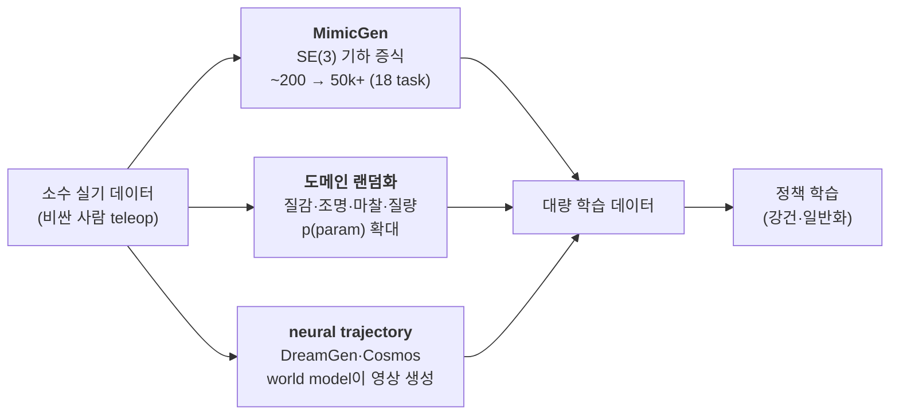
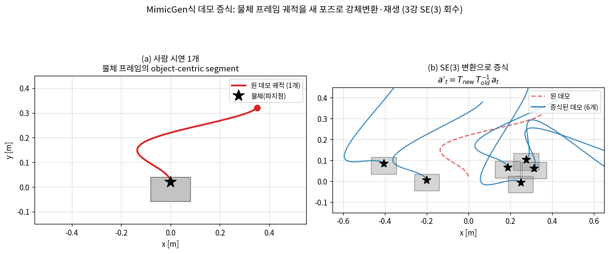
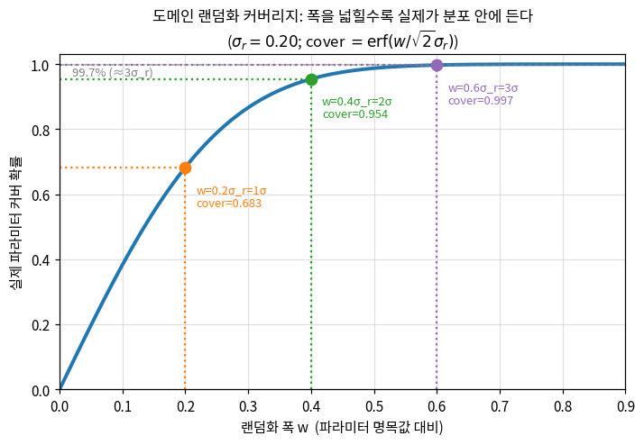
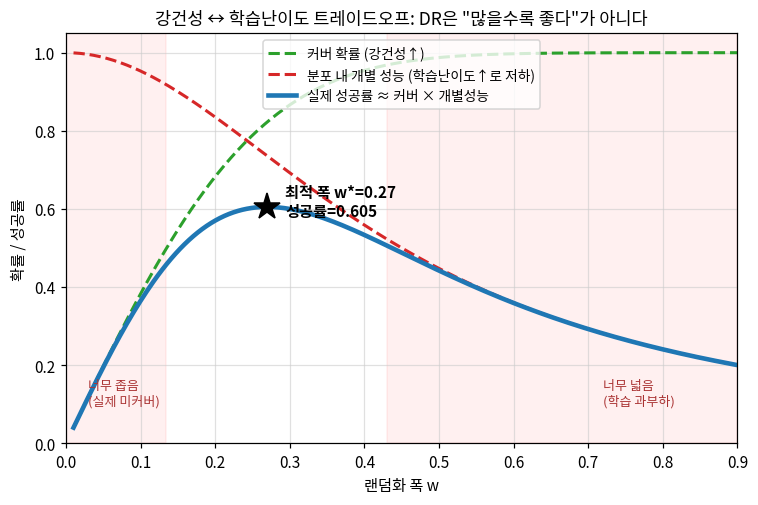
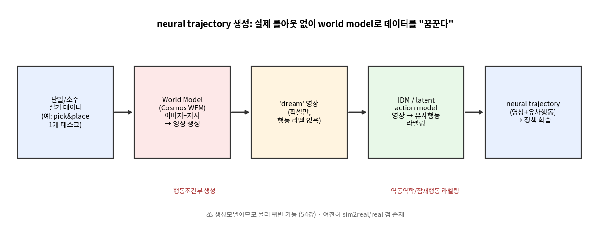
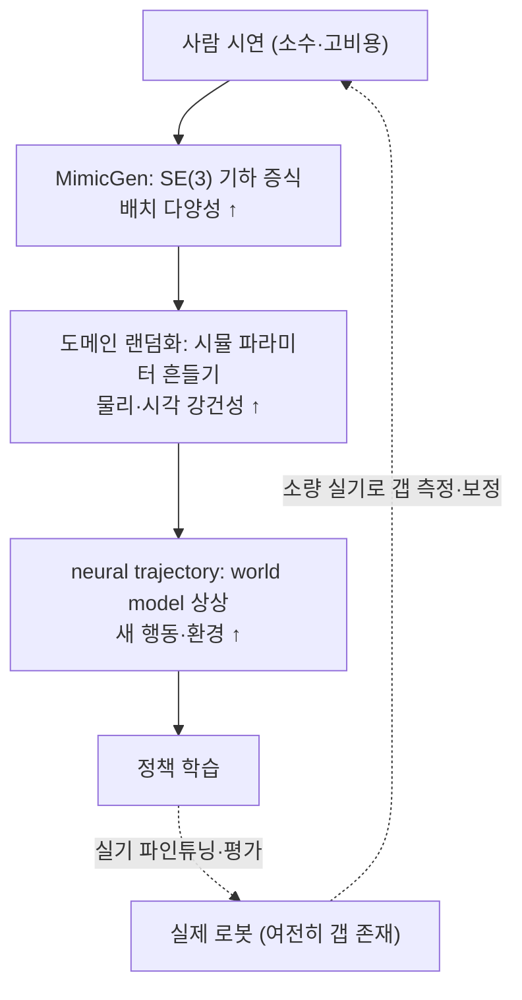

# Lec 53. 합성 데이터와 도메인 랜덤화

> Part 12 세 번째 강의. 선수 지식: **3강**(SE(3) 강체변환·좌표계), **51강**(시뮬레이터 지형도·sim2real 갭), **52강**(시뮬 내부·접촉 완화). 관련: 27강(학습 파이프라인·분포이동), 37강(compounding error), 54강(학습된 world model — 다음), 46강(GR00T·DreamGen), 55강(데이터셋).
> 이 강의의 실측 스펙(데이터 규모·모델 성능·arXiv ID)은 1차 자료로 교차 검증했다(참고문헌). 코드·그림 수치는 순수 numpy/scipy 토이의 실제 실행 출력이다. 정보 기준일: 2026-07-09.

## 한 장 요약



데이터를 사람이 모으는 대신 **시뮬로 만든다.** 세 갈래다: ① **MimicGen** — 하나의 시연을 SE(3) 강체변환으로 새 물체 포즈에 옮겨 수백 개로(3강의 좌표변환 그대로). ② **도메인 랜덤화** — 시뮬 파라미터를 무작위로 흔들어 실제가 그 분포 안에 들게(51강 sim2real의 정면 대응). ③ **neural trajectory** — world model이 새 궤적 영상을 생성하고 역동역학으로 행동을 라벨링(54강 예고). 셋 다 "공짜 무한 데이터"가 아니다 — 각자 다양성·현실성·물리 정합의 한계를 지불한다.

## 학습 목표

1. MimicGen의 데모 증식을 SE(3) 강체변환 $a'_t = T_{\text{new}} T_{\text{old}}^{-1} a_t$로 유도하고, "성공한 것만 채택"이라는 필터가 왜 필수인지 코드로 보일 수 있다.
2. 도메인 랜덤화를 분포 커버리지 문제로 정식화하고($p(\theta)$ 확대, 커버 확률 $\mathrm{erf}(w/\sqrt2\sigma_r)$), 강건성 ↔ 학습난이도 트레이드오프에서 **최적 폭이 존재**함을 수치로 논증할 수 있다.
3. neural trajectory 생성(행동조건부 영상 생성 + 역동역학/잠재행동 라벨링)의 파이프라인을 그리고, DreamGen/Cosmos의 실측 성과와 한계를 인용과 함께 설명할 수 있다.
4. 세 방법이 각각 무엇을 증식하고 무엇을 지불하는지(기하 vs 커버리지 vs 픽셀; 실행가능성 vs 학습난이도 vs 물리 정합)를 대조표로 정리할 수 있다.
5. "합성 데이터=공짜"·"DR은 많을수록 좋다"·"neural trajectory는 물리 보장" 같은 오해를 각각 수식·코드로 반박할 수 있다.

## 왜 이 강의가 필요한가

51강에서 봤듯 로봇 학습의 병목은 알고리즘이 아니라 **데이터**다. 사람이 로봇을 원격조작해 모으는 시연은 시간당 비용이 크고, VLA를 훈련하려면 수천~수만 시간이 필요하다(44강 π0의 1만 시간). 그래서 필드는 데이터를 **시뮬로 합성**하는 세 갈래를 발전시켰다 — 그리고 이 세 갈래가 정확히 로봇공학자가 이미 아는 세 개념의 딥러닝 극한이다.

- **MimicGen**은 새로운 기술이 아니다. 3강에서 배운 **SE(3) 좌표변환**을 시연 궤적에 적용해, "물체가 저기 있으면 어떻게 움직일까"를 기하로 계산하는 것뿐이다. 회원님이 매니퓰레이터 기구학에서 하던 프레임 변환이 데이터 증식기가 된다.
- **도메인 랜덤화**는 강건 제어의 언어다. 파라미터 불확실성을 아는 채로 **넓은 분포에서 모두 동작하는** 정책을 찾는 것 — $H_\infty$나 robust MPC에서 "worst-case 파라미터 집합"을 다루던 그 사고를, 무작위 샘플링 + 학습으로 근사한다. "얼마나 넓게 흔들까"는 27강의 분포이동·과적합과 정확히 같은 트레이드오프다.
- **neural trajectory**는 60강의 시스템 식별을 딥러닝 극한까지 민 것이다. 시스템 식별이 데이터로 전이함수 $f$의 **파라미터**를 맞춘다면, world model은 데이터로 $f$ **자체**를 학습해 "실제 롤아웃 없이" 미래 영상을 생성한다(0강의 학습된 world model, 54강 심화).

이 세 갈래를 "그냥 데이터 늘리는 트릭"으로 외우면 새 논문 앞에서 무력하다. MimicGen이 왜 **성공한 것만** 채택해야 하는지(기하는 완벽해도 실행은 실패), DR의 폭을 왜 **무작정 넓히면 안 되는지**(학습난이도 폭발), neural trajectory가 왜 **물리를 보장하지 못하는지**(생성모델은 그럴듯할 뿐)를 직접 수치로 만져 본 사람만이 46강 GR00T의 DreamGen 채택과 63강 프론티어의 world model 수렴을 "새로운 점만" 짚어낼 수 있다.

## 본문

### 1. 세 갈래의 지형 — 무엇을 증식하고 무엇을 지불하는가

세 방법은 "소수 데이터 → 대량 데이터"라는 같은 목표에 서로 다른 자원을 쓴다.

| 방법 | 증식하는 것 | 필요 입력 | 지불하는 대가 | 로봇공학 뿌리 |
|---|---|---|---|---|
| **MimicGen** | 기하(새 물체 포즈) | 소수 시연 + 물체 포즈 추정 | 실행가능성(도달·충돌·접촉 재현) — 실패분 폐기 | SE(3) 변환(3강) |
| **도메인 랜덤화** | 파라미터 커버리지 | 시뮬 + 랜덤화 범위 | 학습난이도 ↑ (넓을수록 정책이 흐려짐) | 강건 제어·분포이동(27강) |
| **neural trajectory** | 픽셀(새 영상 궤적) | world model + 소수 실기 | 물리 정합·행동 라벨 정확도 | 학습된 $f$·시스템 식별(60강) |

핵심 통찰: **셋 다 "무엇을 이미 갖고 있느냐"를 지렛대로 삼는다.** MimicGen은 접촉·물리를 시뮬이 정확히 안다고 믿고 기하만 옮긴다(그래서 접촉이 복잡하면 실패율↑). DR은 실제 파라미터를 모르는 채로 넓게 덮어 무지를 강건성으로 바꾼다. neural trajectory는 실제 롤아웃 없이 학습된 동역학으로 미래를 상상한다(그래서 물리를 위반할 수 있다). 어느 것도 정보를 무에서 만들지 않는다 — 갖고 있는 사전지식(기하/불확실성/학습된 $f$)을 데이터로 펼칠 뿐이다.

### 2. 핵심 수식

세 수식이 세 갈래의 뼈대다: **E1** MimicGen의 SE(3) 증식(기하), **E2** 도메인 랜덤화의 커버리지와 트레이드오프(분포), **E3** neural trajectory의 행동조건부 생성·라벨링(학습된 $f$).

#### E1. MimicGen — SE(3) 변환으로 시연을 증식한다

**① 직관**: 사람이 "물체를 왼쪽에서 집어 오른쪽에 놓는" 시연을 한 번 했다. 이제 물체가 **다른 위치·각도**에 있다면? 손의 궤적을 그만큼 **옮기고 돌리면** 된다. 물체를 중심으로 정의된 손동작은, 물체가 어디로 가든 그 물체 프레임에 붙어 따라간다. 이것이 3강에서 배운 좌표변환의 데이터 증식판이다 — 새 기술이 아니라 **기하의 재활용**이다.

**② 물리·기하적 의미**: MimicGen은 시연을 **object-centric segment**(물체 중심 구간)로 자른다 [1]. 각 구간은 "이 물체에 대해 무엇을 하는가"로, 그 물체의 프레임에서 정의된 궤적이다. 새 장면에서 물체 포즈가 $T_{\text{old}} \to T_{\text{new}}$로 바뀌면, 구간을 그 상대변환으로 강체이동시켜 새 궤적을 만들고, 로봇이 그것을 **실제로 따라가 성공하면** 새 데모로 채택한다(3강의 프레임 변환 + 12강의 접촉이 여기서 만난다 — 기하는 되지만 접촉·도달이 안 되면 폐기). SE(3) 변환은 **강체 등거리사상**이라 궤적의 모양·호길이·상대각도를 그대로 보존한다 — 그래서 "같은 스킬을 새 배치에서" 재현한다. 결정적 한계: 변환은 기하일 뿐, 새 포즈가 로봇 워크스페이스를 벗어나거나 접촉이 달라지면 재생이 실패한다(WE-1의 채택률 80%가 이 지점).

**③ 형식(유도 요점)**: 물체 프레임에서 기록된 시연 액션 $a_t$(월드 좌표의 EEF 포즈)를, 물체 포즈가 $T_{\text{old}} \in SE(3)$였을 때 관측했다고 하자. 물체 프레임 기준 상대 포즈는 $T_{\text{old}}^{-1} a_t$로 불변량이다. 새 물체 포즈 $T_{\text{new}}$에서 같은 상대 동작을 월드로 되돌리면:

$$
a'_t = T_{\text{new}}\, T_{\text{old}}^{-1}\, a_t, \qquad T = \begin{bmatrix} R & p \\ 0 & 1 \end{bmatrix} \in SE(3)
$$

이 $T_{\text{rel}} = T_{\text{new}} T_{\text{old}}^{-1}$가 "원 배치 → 새 배치"의 강체변환이다. 데이터 관점에서는 시연 집합 $D = \{a_{1:H}\}$가 새 포즈 샘플 $\{T_{\text{new}}^{(i)}\}_{i=1}^{N}$을 통해 $D' = \{a'^{(i)}_{1:H}\}$로 **$N$배 증식**된다. 실제 MimicGen은 $\sim 200$개 사람 시연에서 **18개 태스크에 걸쳐 50,000개 이상**의 데모를 생성했다 [1]. 단, 재생 성공률로 걸러지므로 $|D'| < N \cdot |D|$다 — "성공한 것만 채택"이 SE(3) 변환 다음의 필수 단계다.



*그림 1: MimicGen식 데모 증식(numpy 토이). **(a)** 사람 시연 1개 — 물체 프레임에서 정의된 접근·파지 궤적(별=물체/파지점). **(b)** SE(3) 변환 $a'_t = T_{\text{new}} T_{\text{old}}^{-1} a_t$로 6개 새 물체 포즈(위치+회전 랜덤)에 재생 — 궤적이 물체를 따라 회전·평행이동한다. 강체변환이라 궤적 모양은 보존되고, 파지점(별)에 정확히 도달한다. WE-1이 이를 200개로 키워 기하 정확도 100%·워크스페이스 필터 80% 채택을 정량화한다. 51강 표의 RoboCasa+MimicGen 조합이 이 그림의 실제 응용이다.*

#### WE-1 (손 + 코드): SE(3) 데모 변환과 "성공한 것만 채택"

**손계산**: 2D 예로 감을 잡자. 원 데모에서 물체가 $T_{\text{old}}$: 각도 $0$, 위치 $(0.30, 0.10)$에 있었고, 파지점 도달 시각의 EEF가 월드에서 $(0.30, 0.10)$(물체 위)였다. 새 물체가 $T_{\text{new}}$: 각도 $90°$, 위치 $(0.20, -0.15)$로 옮겨졌다. 상대변환 $T_{\text{rel}} = T_{\text{new}} T_{\text{old}}^{-1}$을 EEF에 적용하면 새 파지점은 $(0.20, -0.15)$ — **새 물체 위로 정확히 따라간다**. 강체변환이 등거리사상이므로 접근 궤적의 호길이도 원본과 같다. 확인할 두 가지: ① 파지점 종점이 새 물체 위치에 도달(오차 $\approx 0$), ② 궤적 호길이 보존.

**검증 코드** (3D, 전체는 스크래치의 `lec53_we.py`):

```python
import numpy as np
def rotz(th):
    c, s = np.cos(th), np.sin(th)
    return np.array([[c,-s,0],[s,c,0],[0,0,1.0]])
def SE3(R, t):
    T = np.eye(4); T[:3,:3] = R; T[:3,3] = t; return T
def apply_se3(T, pts):
    h = np.c_[pts, np.ones(len(pts))]; return (T @ h.T).T[:, :3]

# 물체 프레임의 접근·파지 궤적 (원점=파지점), 원 물체 포즈 T_old
t = np.linspace(0, 1, 20)
traj_obj = np.c_[0.10*np.cos(2*np.pi*t)*(1-t), 0.10*np.sin(2*np.pi*t)*(1-t), 0.15*(1-t)]
T_old = SE3(rotz(0.0), np.array([0.30, 0.10, 0.0]))
world_orig = apply_se3(T_old, traj_obj)              # 월드에 기록된 원 데모

rng = np.random.default_rng(0); N, reach = 200, 0.55
succ_geo = accepted = 0
for _ in range(N):
    th = rng.uniform(-np.pi, np.pi)
    tt = np.array([rng.uniform(0.15,0.60), rng.uniform(-0.30,0.30), 0.0])  # 테이블 영역
    T_new = SE3(rotz(th), tt)
    T_rel = T_new @ np.linalg.inv(T_old)             # 핵심: a' = T_new T_old^{-1} a
    world_new = apply_se3(T_rel, world_orig)
    grasp_new = apply_se3(T_new, np.zeros((1,3)))[0] # 새 물체 파지점(월드)
    if np.linalg.norm(world_new[-1] - grasp_new) < 1e-3: succ_geo += 1  # 기하 정확
    if np.linalg.norm(grasp_new[:2]) <= reach:       accepted += 1      # 도달가능 필터
print(f"기하 정확 {succ_geo}/{N}, 채택 {accepted}/{N}")  # 200/200, 160/200
```

출력: 기하 정확 `200/200`(종점 오차 max $1.11\times10^{-16}$ m — 강체변환은 수치오차 수준), 호길이 보존(원 `0.375819` = 변환후 `0.375819`, 차 max $2.22\times10^{-16}$), 워크스페이스 필터 채택 `160/200` = **80.0%**. **핵심 교훈: 기하 증식은 100% 정확하지만, MimicGen은 그중 실행가능한 160개만 최종 데이터로 채택한다.** 실제 시스템에서는 여기에 접촉 재현·충돌 회피까지 걸려 채택률이 더 떨어진다 — 이것이 흔한 오해 3("MimicGen이 새 기술을 만든다")과 오해 1("합성=공짜 무한")을 동시에 반박하는 지점이다. SE(3) 변환은 새 기술이 아니라 3강의 재활용이고, 무한이 아니라 **재생 성공한 만큼만** 늘어난다.

#### E2. 도메인 랜덤화 — 분포 커버리지와 강건성 트레이드오프

**① 직관**: 시뮬의 질감·조명·마찰·질량을 **무작위로 흔들면**, 정책은 어느 특정 값이 아니라 **넓은 범위 전체**에서 동작하도록 배운다. 실제 로봇의 파라미터가 그 범위 안에만 들면, 정책에게 실제는 "또 하나의 랜덤 변형"으로 보인다 — Tobin의 표현대로 "충분한 변동성만 있으면 실제 세계가 모델에게는 그저 또 다른 변형처럼 보인다" [2]. 그러나 흔드는 폭이 넓을수록 정책이 감당할 상황이 많아져 **학습이 어려워진다.** 공짜가 아니다.

**② 물리·기하적 의미**: 51강의 sim2real 갭을 다시 본다. 시뮬 파라미터 $\theta$(마찰계수·질량·조명…)의 실제값 $\theta_{\text{real}}$을 우리는 **정확히 모른다**. DR은 명목값 $\theta_0$ 주위로 폭 $w$의 분포 $p(\theta)$를 두고, 그 분포 전체에 대한 기대 리스크를 최소화한다. 폭이 넓으면(넓은 $p(\theta)$) 실제값이 분포 안에 들 확률(**커버 확률**)이 커져 강건해지지만, 정책이 동시에 만족시켜야 할 상황이 많아져 개별 상황에서의 성능(**peak 성능**)이 흐려진다. 이것은 27강의 분포이동·과적합과 정확히 같은 축이다: 좁은 DR = 특정 분포에 과적합(실제 미커버), 넓은 DR = 과도한 일반화 부담(용량 한계). 강건 제어에서 "worst-case 파라미터 집합을 넓히면 보수적이 되어 명목 성능이 떨어지는" 것과 같은 물리다.

**③ 형식(유도 요점)**: DR의 학습 목표는 파라미터 분포에 대한 기대 리스크

$$
\min_{\pi}\; \mathbb{E}_{\theta \sim p(\theta)}\big[\, \mathcal{L}(\pi, \theta)\,\big], \qquad p(\theta) = \mathcal{U}(\theta_0 - w,\ \theta_0 + w)
$$

폭 $w$를 넓히는 것이 도메인 랜덤화다. **커버 확률**을 정량화하자: 실제값의 명목 대비 편차 $\theta_{\text{real}} - \theta_0$가 $\mathcal{N}(0, \sigma_r^2)$로 불확실하다고 두면(우리가 실제를 모름을 표현), 균등분포 $[\theta_0 - w,\ \theta_0 + w]$가 실제를 덮을 확률은

$$
P_{\text{cover}}(w) = P\big(|\theta_{\text{real}} - \theta_0| \le w\big) = \mathrm{erf}\!\Big(\frac{w}{\sqrt2\,\sigma_r}\Big)
$$

한편 폭이 넓을수록 정책이 개별 파라미터에서 낼 수 있는 성능은 용량 한계로 저하한다. 토이로 $P_{\text{peak}}(w) = 1/(1 + (w/w_{\text{cap}})^2)$라 두면, **실제 성공률** $\approx P_{\text{cover}} \cdot P_{\text{peak}}$는 커버(증가)와 peak(감소)의 곱이라 **내부 최댓값**을 갖는다 — "많을수록 좋다"가 아니라 **최적 폭**이 존재한다.



*그림 2: 도메인 랜덤화 커버리지(numpy 토이, $\sigma_r=0.20$). 랜덤화 폭 $w$가 커질수록 실제 파라미터가 분포 안에 들 확률이 오른다: $w=1\sigma_r$에서 0.683, $2\sigma_r$에서 0.954, $3\sigma_r$에서 0.997 — 정규분포의 $1/2/3\sigma$ 규칙 그대로($\mathrm{erf}(w/\sqrt2\sigma_r)$). "실제를 안전하게 덮으려면 명목 불확실성의 $\sim3$배를 흔들어야 한다"가 커버리지만의 결론이다. 그러나 이것이 이야기의 절반뿐임을 그림 3이 보인다.*



*그림 3: 강건성 ↔ 학습난이도 트레이드오프(numpy 토이). 커버 확률(초록, 증가)과 분포 내 개별 성능(빨강, 감소)의 곱인 실제 성공률(파랑)은 **내부 최댓값**을 갖는다: 최적 폭 $w^*=0.27$에서 성공률 0.605. 너무 좁으면(왼쪽 붉은 영역) 실제를 못 덮고, 너무 넓으면(오른쪽) 학습이 과부하된다. WE-2가 $w=0.10$→0.365, $w^*=0.27$→0.605, $w=0.70$→0.292로 이 곡선을 수치화한다. **"DR은 많을수록 좋다"는 오해**(흔한 오해 2)를 정면으로 반박하는 그림이다.*

#### WE-2 (손 + 코드): 커버리지·최적 폭·몬테카를로 검증

**손계산**: $\sigma_r = 0.20$(실제 파라미터의 명목 대비 표준편차, 예: 마찰계수 20% 불확실). 폭 $w=0.40$($=2\sigma_r$)의 커버 확률은 $\mathrm{erf}(0.40/(\sqrt2 \cdot 0.20)) = \mathrm{erf}(\sqrt2) = \mathrm{erf}(1.414)$. 표에서 $\mathrm{erf}(1.414) \approx 0.9545$ — 정규분포 $2\sigma$ 안에 드는 확률과 정확히 같다(당연하다, $w = 2\sigma_r$이므로). 즉 "폭을 $k\sigma_r$로 두면 커버 확률은 정규분포 $k\sigma$ 규칙 그대로": $1\sigma_r{\to}68.3\%$, $2\sigma_r{\to}95.5\%$, $3\sigma_r{\to}99.7\%$.

**검증 코드**:

```python
import numpy as np
from scipy.special import erf
s_real = 0.20

# 커버 확률 (해석식) + 몬테카를로
for w in [0.20, 0.40, 0.60]:
    print(f"w={w} ({w/s_real:.0f}s_r): cover={erf(w/(np.sqrt(2)*s_real)):.4f}")
rng = np.random.default_rng(1); Nmc = 2_000_000
for w in [0.20, 0.40, 0.60]:
    real = rng.normal(0.0, s_real, Nmc)
    print(f"  MC w={w}: {np.mean(np.abs(real)<=w):.4f}")

# 트레이드오프: 최적 폭
w = np.linspace(0.01, 0.9, 3000); w_cap = 0.45
succ = erf(w/(np.sqrt(2)*s_real)) * (1.0/(1.0+(w/w_cap)**2))
i = np.argmax(succ)
print(f"w*={w[i]:.3f}, success*={succ[i]:.4f}")   # 0.269, 0.6051
```

출력: 커버 확률 `0.6827 / 0.9545 / 0.9973`(해석), 몬테카를로 `0.6835 / 0.9543 / 0.9973`(2백만 샘플, 해석과 3자리 일치). 트레이드오프 최적 폭 `w*=0.269`, 실제 성공률 `0.6051`. 대조군: 너무 좁은 $w=0.10$은 성공률 `0.365`(커버 0.383 × peak 0.953 — 실제를 못 덮어 실패), 너무 넓은 $w=0.70$은 `0.292`(커버 1.000 × peak 0.292 — 다 덮지만 학습 과부하로 개별 성능 붕괴). **커버리지만 보면 넓을수록 좋지만, 학습난이도를 곱하면 중간에 무릎점이 생긴다** — DR 튜닝이 "최대한 넓게"가 아니라 "실제 불확실성 $\sigma_r$의 $\sim1.3$배 근처"인 이유다($w^*/\sigma_r = 0.269/0.20 \approx 1.35$).

#### E3. neural trajectory — world model이 데이터를 "꿈꾼다"

**① 직관**: MimicGen이 **기하**를 옮기고 DR이 **파라미터**를 흔든다면, neural trajectory는 아예 **새 영상 궤적을 생성**한다. 하나의 이미지와 언어 지시("컵을 집어라")를 주면, 학습된 world model이 "그 다음에 무슨 일이 벌어질지"를 사실적인 영상으로 그려낸다 — 로봇을 실제로 움직이지 않고도. 그 영상에는 행동 라벨이 없으니, **역동역학 모델**로 "이 화면 변화를 만든 행동은 무엇이었나"를 역추정해 라벨을 붙인다. 그러면 (영상, 행동) 쌍이 정책 학습 데이터가 된다.

**② 물리·기하적 의미**: 이것이 0강의 세 번째 환경 형태 — **학습된 world model** — 의 데이터 생성 응용이다(54강 심화). 60강의 시스템 식별이 데이터로 전이함수 $f$의 **파라미터**를 맞춘다면, world model은 데이터로 $f$ **자체**를 신경망으로 학습해 미래 상태(여기서는 픽셀)를 예측한다. 결정적 차이 두 가지: ① **실제 롤아웃이 필요 없다** — 상상만으로 증식하므로 로봇 시간·마모가 안 든다. ② **물리를 보장하지 않는다** — 생성모델은 "그럴듯한" 영상을 만들 뿐, 접촉·중력·강체 제약을 위반할 수 있다(물이 위로 흐르거나 물체가 관통하는 hallucination). 행동 라벨링도 역동역학 모델의 정확도에 의존한다 — 라벨이 틀리면 정책이 잘못된 (관측→행동) 매핑을 배운다. 37강의 compounding error가 여기서 재등장: 생성 영상을 길게 뽑을수록 물리 오차가 누적되고(개루프 적분 드리프트처럼), 라벨 오차도 궤적을 따라 쌓인다.

**③ 형식(유도 요점)**: world model은 행동조건부 생성분포 $p_\phi(o_{t+1:t+H} \mid o_t, \ell)$($o$=관측 영상, $\ell$=언어 지시)를 학습한다. neural trajectory 생성은 두 단계다:

$$
\underbrace{\hat o_{1:H} \sim p_\phi(o_{1:H} \mid o_0, \ell)}_{\text{① 행동조건부 영상 생성}}, \qquad
\underbrace{\hat a_t = g_\psi(\hat o_t, \hat o_{t+1})}_{\text{② 역동역학/잠재행동 라벨링}}
$$

여기서 $g_\psi$는 **역동역학 모델(IDM)** — 연속 두 프레임의 화면 변화로 그 사이 행동을 역추정 — 또는 **잠재행동 모델**(관측 변화를 설명하는 잠재 행동 코드를 비지도로 학습)이다 [3]. 결과 $(\hat o_{1:H}, \hat a_{1:H})$가 정책 학습에 쓰이는 **neural trajectory**다. 실측: NVIDIA **DreamGen**(arXiv:2505.12705)은 Cosmos world foundation model 기반으로, **단 하나의 pick-and-place 태스크·한 환경의 teleop 데이터**만으로 훈련한 뒤 **본 적 없는 환경을 포함해 22개 새 행동**을 휴머노이드에 이식했다 [3]. GR00T-Dreams 블루프린트는 이 방식으로 GR00T N1.5를 **36시간 만에** 개발했다 — 수작업 데이터 수집이면 약 3개월이 걸릴 일이다(회사 발표) [4][5]. 기반 world model인 Cosmos(arXiv:2501.03575)는 영상 토크나이저 + 사전학습 world foundation model + 태스크별 후학습으로 구성된 플랫폼이다 [6].



*그림 4: neural trajectory 생성 파이프라인(DreamGen/Cosmos). 소수 실기 데이터 → world model(Cosmos WFM)이 이미지+지시로 새 영상 생성 → 그 'dream' 영상은 픽셀만 있고 행동 라벨이 없음 → IDM/잠재행동 모델이 영상에서 유사 행동을 역추정해 라벨링 → (영상+유사행동) neural trajectory로 정책 학습. **실제 롤아웃 없이 증식**하지만 생성모델이라 물리 위반이 가능하고(54강), 실제 로봇과의 갭(sim2real류)은 여전히 남는다. 46강 GR00T의 DreamGen 채택과 63강 프론티어의 world model 수렴이 이 그림의 확장이다.*

### 3. 세 방법은 경쟁이 아니라 계층이다

세 갈래는 배타적이지 않다 — 실제 파이프라인은 **겹쳐 쓴다**.



- **MimicGen**은 물체 배치의 다양성을 싸게 늘린다 — 시뮬 접촉이 신뢰할 만한 태스크(강체 픽앤플레이스·조립)에서 강력하다. RoboCasa는 25개 원자 태스크에 사람 시연 1,250개를 모으고 MimicGen으로 **10만 궤적**을 증식했다 [7].
- **도메인 랜덤화**는 그 위에 시각·물리 강건성을 입힌다 — 51강 sim2real 갭의 정면 대응.
- **neural trajectory**는 시뮬이 만들기 어려운 **새 행동·환경**을 상상으로 채운다 — 46강 GR00T 계열의 최신 무기.

**어느 것도 실기 파인튜닝·평가를 없애지 못한다.** 합성 데이터로 사전학습하되, 소량의 실기로 갭을 측정하고 보정하는 것이 필드 표준이다(오해 5). 이 계층의 끝은 항상 실제 로봇이고, 그 갭이 0이 되지 않는다는 것이 52강 §4 sim2real 원인 표의 결론이었다.

### 로봇공학자를 위한 번역

- **MimicGen = SE(3) 좌표변환의 데이터 증식판.** 회원님이 매니퓰레이터 기구학에서 프레임을 옮기던 $T_{\text{new}} T_{\text{old}}^{-1}$이 그대로 데이터 생성기가 된다. "새 기술"이 아니라 3강의 재활용이고, 등거리사상이라 스킬(궤적 모양)이 보존된다. 딥러닝 쪽 비유로는 **기하학적 data augmentation**(이미지 회전·평행이동)의 SE(3)판이지만, 이미지 crop과 달리 **물리적 실행가능성**이라는 검증 단계가 붙는다.
- **도메인 랜덤화 = 강건 제어의 무작위 근사.** $H_\infty$·robust MPC에서 "불확실성 집합 전체에서 안정한 제어기"를 찾던 것을, 무작위 샘플링 + 학습으로 근사한다. "폭을 넓히면 보수적이 되어 명목 성능↓"이라는 강건 제어의 직관이 그림 3의 트레이드오프와 정확히 같다. 딥러닝 쪽으로는 **domain randomization = 극단적 data augmentation**이되, 어느 축(마찰·질량·조명)을 얼마나 흔들지가 **물리 사전지식**(52강 §4 표)이다.
- **neural trajectory = 학습된 전이함수 $f$로 하는 개루프 상상.** 60강의 시스템 식별이 $f$의 파라미터를 맞춘다면, world model은 $f$ 자체를 학습한다. 그리고 개루프로 길게 뽑을수록 오차가 누적되는 것(37강 compounding error·드리프트)이 생성 영상의 물리 붕괴로 나타난다 — 회원님이 아는 개루프 적분 드리프트가 픽셀 공간에서 재현되는 셈이다.

## 흔한 오해

1. **"합성 데이터 = 공짜 무한 데이터"** — 세 방법 모두 한계를 지불한다. MimicGen은 재생 성공한 만큼만 늘어나고(WE-1: 200개 기하 증식 중 채택 160개, 실제로는 접촉·충돌로 더 감소), 다양성은 원 시연의 스킬 집합에 갇힌다(새 스킬은 못 만든다). DR은 학습난이도를 지불하고(그림 3), neural trajectory는 물리 정합·라벨 정확도를 지불한다. "무한"은 마케팅이고, 실제로는 **사전지식이 허락하는 만큼만** 늘어난다.
2. **"도메인 랜덤화는 많을수록 좋다"** — 아니다. 폭을 넓히면 커버 확률은 오르지만(그림 2) 정책이 감당할 상황이 많아져 개별 성능이 저하한다(그림 3). 실제 성공률은 둘의 곱이라 **내부 최댓값**을 갖는다(WE-2: $w^*=0.27$에서 최대, $w=0.70$은 오히려 $w=0.27$보다 나쁨). "무작정 넓게"가 아니라 실제 불확실성 $\sigma_r$에 맞춘 폭이 최적이다. (자동 튜닝하는 방법이 automatic/active domain randomization이지만, 그래도 폭에 최적이 있다는 원리는 같다.)
3. **"MimicGen이 새로운 스킬·기술을 만든다"** — 아니다. SE(3) 강체변환으로 **기존 시연을 새 물체 포즈에 기하적으로 재배치**할 뿐이다(E1). 원 시연에 없던 스킬(새 파지 유형, 새 접촉 시퀀스)은 만들지 못한다 — 변환은 등거리사상이라 스킬을 보존하지 변형하지 않는다. "증식"은 배치 다양성이지 스킬 다양성이 아니다.
4. **"neural trajectory는 물리적으로 정확하다"** — 아니다. world model은 **생성모델**이라 그럴듯한 픽셀을 만들 뿐, 접촉·중력·강체 제약을 위반할 수 있다(물체 관통, 물이 위로 흐름 등 hallucination). 길게 생성할수록 물리 오차가 누적되고(37강 compounding error), 행동 라벨도 역동역학 모델의 정확도에 의존한다. "world model이 만들었으니 물리적"이라는 추론은 틀렸다 — 54강·63강이 이 한계와 개선을 다룬다.
5. **"합성 데이터로 만들었으면 sim2real은 무관하다"** — 아니다. MimicGen·DR은 시뮬 안에서 만들므로 여전히 51·52강의 sim2real 갭을 상속한다(접촉 완화·마찰 단순화·액추에이터 이상화). neural trajectory는 실기 기반이라도 생성 영상과 실제 관측 사이에 **또 다른 갭**(생성 아티팩트·도메인 이동)이 생긴다. 어느 경로든 실기 파인튜닝·평가로 갭을 닫는 단계가 필수다(§3).

## 실습 (1.5~2시간)

**목표: MimicGen식 SE(3) 증식과 도메인 랜덤화 커버리지를 직접 돌려 보고, 실제 시뮬 데이터 증식을 관찰한다.**

준비물: `pip install numpy scipy matplotlib mujoco robosuite`(CPU로 충분). A안은 순수 numpy로 원리를, B안은 실제 시뮬레이터로 증식을 체험한다. 규칙: **각 실험마다 예측을 숫자로 먼저 쓰고 실행한다**(E1~E3의 폐형식이 있으니 가능하다).

1. (25분) **SE(3) 증식 확장** — WE-1 코드를 3D 회전 전체($SO(3)$, `scipy.spatial.transform.Rotation`)로 확장하고, 새 물체 포즈에 **높이·기울기**까지 랜덤화한다. 워크스페이스 필터를 반경 0.55 → 0.45 → 0.40 m로 좁히며 채택률을 관찰한다(예측: 그림 1의 필터가 어떻게 변할지 먼저 쓴다). "기하는 100%인데 채택률이 떨어지는" 이유를 접촉·도달 관점에서 서술한다.
2. (30분) **DR 트레이드오프 재현** — WE-2의 곡선에서 $\sigma_r$(실제 불확실성)을 0.10 / 0.20 / 0.40으로 바꿔 최적 폭 $w^*$가 어떻게 이동하는지 관찰하고, $w^*/\sigma_r$ 비가 대략 일정한지 확인한다. `w_cap`(정책 용량)을 바꾸면 무릎점이 어디로 가는가?
3. (35분, 시뮬) **robosuite + MimicGen식 증식** — [robosuite](https://robosuite.ai) 또는 [MimicGen 저장소](https://github.com/NVlabs/mimicgen)의 예제 태스크(예: Lift, Stack)를 로드하고, 제공된 소수 시연을 새 물체 초기 포즈로 재생해 성공/실패를 카운트한다. 재생 성공률을 물체 포즈 범위별로 기록하고, "왜 어떤 포즈는 실패하는가"를 접촉·도달로 분류한다. (환경 설치가 어려우면 저장소의 사전생성 데이터셋 통계를 열어 증식 배율을 확인한다.)
4. (20분) **DR 시각화** — MuJoCo 장면 하나(52강의 공-바닥)에서 마찰계수·질량·조명을 코드로 랜덤화하며 렌더링해, "같은 장면이 얼마나 달라 보이는가"를 눈으로 확인한다. Tobin의 "실제가 또 하나의 변형처럼 보인다"를 체감한다.
5. (10분) §1의 대조표를 자기 태스크(예: SO-101 파지, G1 보행)로 특수화한다: 세 방법 중 무엇이 그 태스크에 가장 값싸고, 각각 무엇을 지불하는지 한 줄씩. 62강에서 이 표를 다시 쓴다.

## Claude와 토론할 질문

1. MimicGen의 SE(3) 변환은 강체 등거리사상이라 궤적 모양을 보존한다. 그런데 **가위질·천 접기 같은 변형체 조작**에서는 이 가정이 왜 깨지는가? (힌트: 물체가 강체가 아니면 물체 프레임이 하나가 아니다 — SoftMimicGen류가 이걸 다룬다.) 회원님의 태스크에서 SE(3) 증식이 통할지 판정하는 기준을 만들어 보라.
2. WE-2의 최적 폭 $w^* \approx 1.35\,\sigma_r$은 토이 모델(`w_cap=0.45`)의 산물이다. 실제로 $\sigma_r$(실제 불확실성)과 정책 용량 중 무엇이 $w^*$를 더 좌우할까? "정책을 키우면 더 넓게 흔들어도 된다"는 명제를 그림 3의 언어로 논하라.
3. neural trajectory의 물리 위반(오해 4)을 **줄이는** 세 가지 방법을 상상하라: ① 생성모델에 물리 사전지식 주입, ② 생성 후 물리 시뮬로 필터링, ③ 짧은 궤적만 생성. 각각의 대가는? (37강 compounding error와 연결하라.)
4. MimicGen(기하 증식)과 neural trajectory(픽셀 생성)는 정반대 극단이다 — 하나는 물리를 시뮬에 맡기고 기하만, 하나는 물리를 학습된 $f$에 맡기고 전부. 두 방법의 **실패 모드**가 어떻게 다른가? 어떤 태스크에서 어느 쪽이 유리한가?
5. DR을 "무한히 넓게"가 아니라 "실제에 맞춰" 튜닝하려면 실제 $\sigma_r$을 알아야 한다. 그런데 실제를 모르니 DR을 쓰는 것이다 — 이 순환을 어떻게 깨는가? (힌트: 소량 실기로 $\sigma_r$ 추정 → 60강 시스템 식별과 연결.)
6. RoboCasa는 사람 시연 1,250개에서 MimicGen으로 10만 궤적을 만들었다(80배). 이 80배가 "80배의 정보"가 아닌 이유를 오해 1·3으로 설명하고, 그럼에도 왜 유용한지 논하라.
7. GR00T-Dreams가 GR00T N1.5를 "36시간 vs 3개월"로 만들었다는 회사 발표(§E3)를 비판적으로 읽어라: 이 비교에서 감춰진 비용(world model 훈련 비용, 라벨 오차, 실기 검증)은 무엇인가?

## 읽을거리

1. **MimicGen 논문 (arXiv:2310.17596)** [1] (~40분): §3(방법 — object-centric segment와 변환)과 Fig 2만. §4의 18태스크 벤치마크 수치는 훑어만 본다. "SE(3) 변환 + 성공 필터"라는 핵심 구조가 3강과 어떻게 만나는지에 집중.
2. **Tobin et al. 도메인 랜덤화 (arXiv:1703.06907)** [2] (~25분): §1(도입 — "실제가 또 하나의 변형처럼")과 §4(랜덤화한 것 목록)만. 이 논문이 랜덤화한 축(질감·조명·카메라·거리)이 52강 §4 표의 어디에 대응하는지 대조.
3. (선택) **DreamGen 논문 (arXiv:2505.12705)** [3] (~30분): §1과 파이프라인 그림만. neural trajectory·IDM·잠재행동의 정의를 확인하고, 54강 예습으로 삼는다. 정량 결과(22행동)는 "회사 연구팀 발표"로 읽되 벤치마크 상세는 건너뛰어도 된다.

## 자가 점검

1. MimicGen의 데모 증식을 $a'_t = T_{\text{new}} T_{\text{old}}^{-1} a_t$로 쓰고, 이것이 3강 SE(3) 변환의 재활용임을 설명할 수 있는가? "성공한 것만 채택"이 왜 필수인지(WE-1의 채택률 80%) 말할 수 있는가?
2. 도메인 랜덤화의 커버 확률 $\mathrm{erf}(w/\sqrt2\sigma_r)$과 정규분포 $1/2/3\sigma$ 규칙(68.3/95.5/99.7%)의 대응을 재현할 수 있는가?
3. "DR은 많을수록 좋다"를 그림 3의 트레이드오프(커버 × peak = 내부 최댓값)로 반박하고, 최적 폭이 왜 $\sim\sigma_r$ 근처인지 설명할 수 있는가?
4. neural trajectory 생성의 두 단계(행동조건부 영상 생성 + 역동역학/잠재행동 라벨링)를 그리고, 왜 물리를 보장하지 못하는지(생성모델·오차 누적) 말할 수 있는가?
5. 세 방법이 각각 무엇을 증식하고(기하/커버리지/픽셀) 무엇을 지불하는지(실행가능성/학습난이도/물리 정합) §1 표를 재구성할 수 있는가?
6. "합성이면 sim2real 무관"이 왜 틀린지, 세 방법 각각이 어떤 갭을 상속하는지 설명할 수 있는가?
7. MimicGen·DR·neural trajectory를 각각 로봇공학 개념(SE(3)·강건 제어·시스템 식별)으로 번역할 수 있는가?

## 참고문헌

> 웹 문서는 2026-07-09 접속 기준. (2차) = 언론·블로그 등 2차 출처. 회사 발표 수치는 명시.

[1] A. Mandlekar, S. Nasiriany, et al. (NVIDIA·Stanford·UT Austin), "MimicGen: A Data Generation System for Scalable Robot Learning using Human Demonstrations," CoRL 2023, arXiv:2310.17596, 2023.10. https://arxiv.org/abs/2310.17596 · 저장소: https://github.com/NVlabs/mimicgen
— **뒷받침**: object-centric segment를 새 물체 포즈로 SE(3) 변환·재생·성공 필터라는 핵심 구조(E1·§1), $\sim200$개 사람 시연에서 18태스크 50,000+ 데모 생성(E1·오해 1), MimicGen이 새 스킬이 아닌 기하 증식이라는 성격(오해 3).

[2] J. Tobin, R. Fong, A. Ray, J. Schneider, W. Zaremba, P. Abbeel (OpenAI·UC Berkeley), "Domain Randomization for Transferring Deep Neural Networks from Simulation to the Real World," IROS 2017, arXiv:1703.06907, 2017.3. https://arxiv.org/abs/1703.06907
— **뒷받침**: "충분한 변동성이 있으면 실제 세계가 모델에게 또 하나의 변형처럼 보인다"는 DR의 원리(E2·①), 랜덤화 대상(질감·조명·카메라·거리)이 52강 §4 표에 대응(읽을거리 2), 랜덤 질감만으로 실제 물체 검출 정확도 1.5cm 달성(§1 도입 근거).

[3] J. Jang, et al. (NVIDIA GEAR 외, 28인), "DreamGen: Unlocking Generalization in Robot Learning through Video World Models," arXiv:2505.12705, 2025.5. https://arxiv.org/abs/2505.12705 · 저장소: https://github.com/nvidia/gr00t-dreams
— **뒷받침**: 4단계 파이프라인(world model 영상 생성 → IDM/잠재행동 라벨링 → 정책 학습)의 구조(E3·그림 4), 단일 pick-and-place 태스크·한 환경 teleop만으로 본 적 없는 환경 포함 22개 새 행동 이식(E3), neural trajectory·역동역학·잠재행동의 정의(E3·오해 4). NVIDIA 연구팀 발표.

[4] NVIDIA, "Enhance Robot Learning with Synthetic Trajectory Data Generated by World Foundation Models," NVIDIA Technical Blog, 2025. https://developer.nvidia.com/blog/enhance-robot-learning-with-synthetic-trajectory-data-generated-by-world-foundation-models/
— **뒷받침**: GR00T-Dreams 블루프린트가 Cosmos WFM로 단일 이미지+지시에서 합성 궤적 생성, dream 영상을 IDM으로 3D 행동 라벨링한다는 워크플로(E3·그림 4). (회사 발표·기술 블로그)

[5] NVIDIA, "GR00T-Dreams / GR00T N1.5" 발표 (GTC/연구 블로그 계열). GR00T-Dreams 저장소: https://github.com/nvidia/gr00t-dreams
— **뒷받침**: GR00T-Dreams로 GR00T N1.5를 36시간 만에 개발(수작업이면 ~3개월)이라는 수치(E3). **회사 발표** — 감춰진 비용(world model 훈련·라벨 오차·실기 검증)은 본문에서 비판적으로 표기(토론 질문 7).

[6] NVIDIA, "Cosmos World Foundation Model Platform for Physical AI," arXiv:2501.03575, 2025.1. https://arxiv.org/abs/2501.03575
— **뒷받침**: Cosmos가 영상 curation + 사전학습 world foundation model + 후학습 + 영상 토크나이저로 구성된 플랫폼이고, 행동 조건부 미래 예측을 지원한다는 사실(E3·그림 4). DreamGen의 기반 world model.

[7] S. Nasiriany, A. Maddukuri, et al., "RoboCasa: Large-Scale Simulation of Everyday Tasks for Generalist Robots," RSS 2024, arXiv:2406.02523, 2024.6. https://arxiv.org/abs/2406.02523
— **뒷받침**: 25개 원자 태스크에 사람 시연 1,250개(태스크당 50개)를 모으고 MimicGen으로 10만 궤적 증식(§3·토론 질문 6), 100태스크(25 원자 + 75 LLM 조합) 구성(§3). 51강 표의 RoboCasa+MimicGen 조합의 1차 출처.

*수치 재현성: 본문·그림의 numpy/scipy 토이 수치는 `images/lec53/gen_figs.py`와 본문 코드 블록(스크래치 `lec53_we.py`)의 실제 실행 출력이다 — WE-1의 SE(3) 재생 기하 정확도 100%(종점 오차 max $1.11\times10^{-16}$ m)·호길이 보존(0.375819, 차 max $2.22\times10^{-16}$)·워크스페이스 필터 채택 160/200=80.0%, WE-2의 커버 확률 0.6827/0.9545/0.9973(해석)과 몬테카를로 0.6835/0.9543/0.9973(2백만 샘플)·최적 폭 $w^*=0.269$·실제성공률 0.6051($w=0.10$→0.365, $w=0.70$→0.292), 그림 3의 $w^*=0.27$. **이 토이는 SE(3) 변환과 커버리지의 개념 재현용 CPU 계산이며, 실제 MimicGen/DreamGen/Cosmos 시스템·모델이 아니다** — MimicGen(200→50k, 18태스크)·DreamGen(22행동)·RoboCasa(1,250→10만)·GR00T N1.5(36시간)의 실측 수치는 위 [1][3][5][7] 1차·발표 출처. numpy 1.26.4 / scipy 1.15.0 / matplotlib 3.5.1 기준, 결정론적 시드(rng default_rng(0/1))라 재현 확인.*

<!-- lecture-nav -->

---

⬅ 이전: [Lec 52. 시뮬레이션의 내부 — 물리엔진은 무엇을 근사하는가](lec52-simulation-internals.md)　｜　[📖 전체 목차](../README.md)　｜　다음: [Lec 54. 학습된 world model (맛보기)](lec54-learned-world-models.md) ➡
