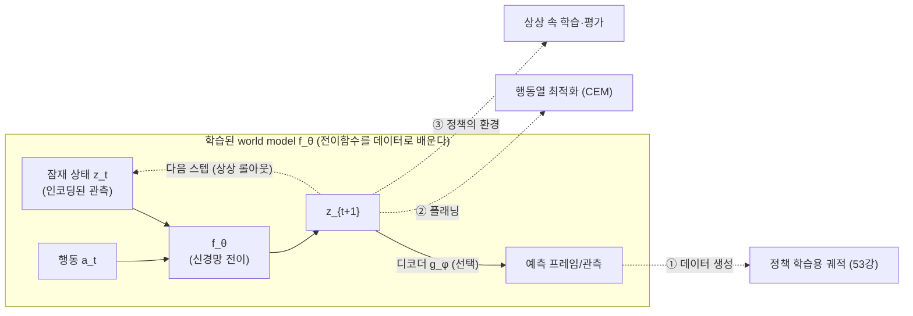
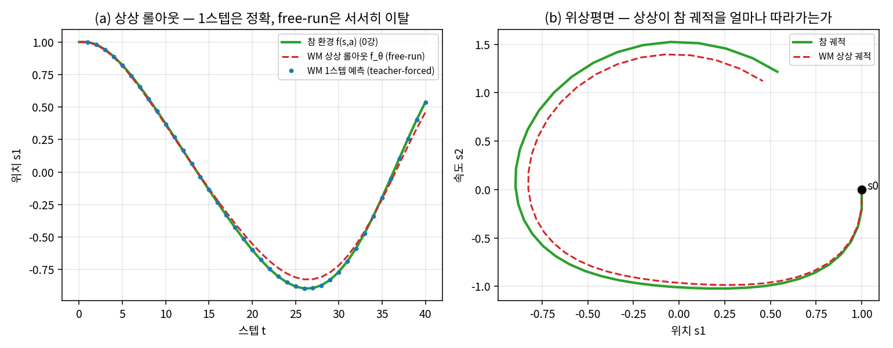
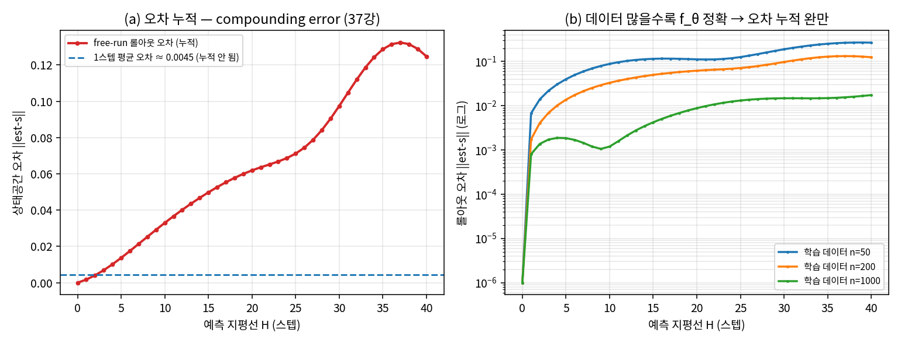
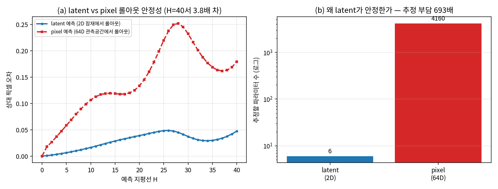
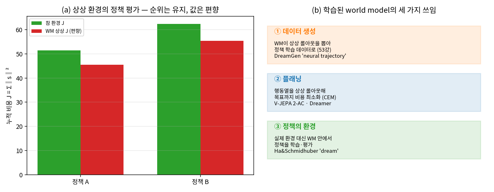

# Lec 54. 학습된 world model (맛보기)

> Part 12 세 번째 강의. 선수 지식: 51강(시뮬레이터 지형도), 53강(합성 데이터·도메인 랜덤화), 그리고 0강(환경의 세 형태·전이함수 $f$), 37강(compounding error), 60강(시스템 식별).
> 이 강의는 **맛보기**다 — world model 수렴·WAM(world-action model)의 프론티어 심화는 63강이 회수한다. 오늘은 "학습된 $f$"라는 개념의 뼈대와 최소한의 정량을 CPU numpy 토이로 손에 쥐는 것이 목표다.
> 정보 기준일: 2026-07-09.

## 한 장 요약



0강에서 환경을 세 형태로 나눴다 — **실제 / 물리 시뮬(51·52·53강) / 학습된 world model**. 세 번째가 오늘의 주제다: 손으로 설계한 물리 방정식(52강의 $M\ddot q + C\dot q + g = \tau + J^\top f$) 대신, **전이함수 $f(s,a)$ 자체를 데이터로 학습**한 것이 world model이다. 이것은 60강 시스템 식별의 딥러닝 극한이고(파라미터 몇 개가 아니라 픽셀·잠재 공간의 사상 전체를 배운다), 그 쓸모는 세 갈래다 — **데이터 생성·플래닝·정책의 환경**. 핵심 한계는 37강에서 배운 **롤아웃 오차 누적**이다.

## 학습 목표

1. world model을 "데이터로 학습한 전이함수 $z_{t+1} = f_\theta(z_t, a_t)$"로 정의하고, 물리 시뮬레이터(손설계 $f$)·시스템 식별(60강, 소수 파라미터 추정)과의 관계·차이를 설명할 수 있다.
2. 행동조건부 영상/잠재 예측의 $N$스텝 롤아웃에서 오차가 **왜, 얼마나** 누적되는지(37강 compounding error 회수)를 선형계 토이로 유도·측정하고, teacher-forced 1스텝 오차와 free-run 롤아웃 오차를 구분할 수 있다.
3. **잠재(latent) 예측이 픽셀 예측보다 롤아웃에서 안정한** 이유를 "추정할 파라미터 수 = 자유도"로 설명하고 numpy로 재현할 수 있다(V-JEPA류의 설계 동기).
4. world model의 세 가지 쓰임(데이터/플래닝/환경)을 각각 실제 시스템(DreamGen·V-JEPA 2-AC·Dreamer/Ha&Schmidhuber)에 연결하고, "상상 환경의 정책 평가는 편향된다"를 수치로 보일 수 있다.
5. 2024~2026의 대표 world model(V-JEPA 2·Cosmos·1X WM·GR00T DreamGen)을 "무엇을 예측하고(픽셀/잠재), 무엇에 조건 붙이며(행동/상태), 어디에 쓰는가"의 축으로 위치시킬 수 있다.

## 왜 이 강의가 필요한가

53강까지는 "환경 = 물리 시뮬레이터"였다. 시뮬레이터의 강점은 물리가 **정확히 알려진 것**(중력·관성·접촉 법칙)이라는 점이고, 약점은 그 물리를 **사람이 다 적어 넣어야** 한다는 점이다(52강의 solref/solimp 손잡이, 마찰·유연체·센서의 미모델). 옷·유체·변형체·복잡 조명처럼 방정식으로 적기 어려운 것 앞에서 시뮬레이터는 막힌다.

world model은 반대편에서 온다: **물리를 적는 대신, 데이터에서 다음 관측을 예측하는 함수를 통째로 학습**한다. 로봇공학자에게 이것은 낯선 발상이 아니다 — 60강에서 배울 시스템 식별이 정확히 "데이터로 전이함수를 맞추는" 일이다. world model은 그 극한이다: URDF의 질량 몇 개를 맞추는 게 아니라, **픽셀에서 픽셀로 가는 사상 $f_\theta$ 전체**를 신경망으로 배운다. 그래서 46강 GR00T의 DreamGen(합성 궤적), 63강의 "VLA 다음은 WAM인가"라는 프론티어 질문, 그리고 "시뮬 없이 상상으로 학습한다"는 Dreamer 계열이 전부 이 한 아이디어의 변주다.

그런데 이 발상에는 대가가 있고, 그 대가가 37강의 **compounding error**다. 학습된 $f_\theta$는 참 $f$와 미세하게 다르고, 그 미세한 차이를 롤아웃(상상)으로 여러 스텝 적분하면 오차가 눈덩이처럼 불어난다 — 개루프 적분 드리프트(37강)와 정확히 같은 수학이다. 이 강의를 수식·코드 없이 "world model이 환경을 대체한다"로만 외우면, DreamGen의 궤적이 왜 100% 신뢰할 수 없는지, V-JEPA 2-AC가 왜 잠재 공간에서 예측하며 매 스텝 재계획(receding horizon)하는지, "상상으로 평가한 정책 순위"를 어디까지 믿을지 판단할 수 없다. 오늘의 토이는 정확히 그 한계를 손으로 만지게 한다 — 참 물리를 아는 작은 선형계에서 $f_\theta$를 학습하고, 롤아웃 오차가 지평선에 따라 어떻게 자라는지 숫자로 본다.

## 본문

### 0. world model이란 무엇인가 — 세 형태의 환경 중 셋째

0강의 닫힌 루프에서 "환경"은 정책에게 $s_{t+1}$을 돌려주는 상자다. 그 상자를 채우는 방법이 셋이다:

| 환경의 형태 | 전이함수 $f$의 출처 | 강점 | 약점 | 관련 강의 |
|---|---|---|---|---|
| **실제 로봇** | 진짜 물리 | 완벽히 정확(정의상) | 느림·비쌈·위험·병렬화 불가 | Part 11 |
| **물리 시뮬** | 사람이 적은 방정식 + 수치 적분 | 빠름·병렬·안전, 물리 이해 가능 | 적을 수 있는 물리만; sim2real 갭(52강) | 51·52·53강 |
| **학습된 world model** | **데이터로 학습한 $f_\theta$** | 적기 어려운 물리도 데이터로; 픽셀 직접 | 오차 누적·환각·데이터 밖 취약 | **이 강의·63강** |

world model의 정의는 한 줄이다 — **관측(또는 그 잠재 인코딩)과 행동을 받아 다음 관측(잠재)을 예측하도록 학습된 함수 $f_\theta$**. "행동조건부(action-conditioned)"가 핵심이다: 그냥 다음 프레임을 예측하는 영상 생성 모델(Sora류)이 아니라, **행동 $a_t$를 주면 그 행동의 결과를 예측**한다 — 그래서 제어 가능하고, 그래서 환경을 대체할 수 있다(흔한 오해 5).

로봇공학 번역: 이것은 60강 시스템 식별의 딥러닝 극한이다. 시스템 식별은 "구조는 알고(예: $M\ddot q + \dots$) 파라미터(질량·관성·마찰계수)만 데이터로 맞추는" 회색상자다. world model은 **구조까지 데이터에 맡기는 검은상자** — 해석적 모델 없이, 픽셀/잠재 공간에서 사상 전체를 신경망으로 배운다. 오늘의 토이는 그 중간(선형 구조를 알고 계수를 최소제곱으로 맞추는)에서 출발해 개념을 잡는다.

### 핵심 수식

세 수식이 이 강의의 뼈대다: **E1** world model = 학습된 전이함수(무엇을 배우는가), **E2** 행동조건부 롤아웃과 오차 누적(왜 한계가 있는가, 37강 회수), **E3** world model의 세 가지 쓰임(무엇에 쓰는가).

#### E1. world model = 학습된 전이함수 $f_\theta$

**① 직관**: 0강의 물리 $f(s,a)$ — "지금 상태에서 이 행동을 하면 다음 상태는?" — 를 **방정식으로 유도하는 대신 데이터로 배운다**. 관측을 압축한 잠재 $z$를 쓰고, 신경망이 $(z_t, a_t) \mapsto z_{t+1}$을 예측하게 한 뒤, 필요하면 디코더로 $z$를 다시 그림으로 편다.

**② 물리·기하적 의미**: 시스템 식별(60강)은 알려진 구조의 소수 파라미터 $\theta$(질량·마찰)를 데이터로 맞춘다. world model은 그 극한 — **구조 없이** 고차원 잠재 공간의 사상 전체를 배운다. "잠재"가 결정적이다: 픽셀 $x \in \mathbb{R}^{H\times W\times 3}$은 수십만 차원이지만, 로봇 장면의 **자유도**(물체 위치·자세·관절각)는 수십 차원이다. 인코더 $e_\psi: x \mapsto z$가 그 저차원 다양체로 눌러 담고, 전이는 거기서 일어난다. 이것이 V-JEPA류가 **픽셀이 아니라 표현(latent) 공간에서 예측**하는 이유다(E2·WE-2에서 안정성으로 정량화).

**③ 형식(유도 요점)**: 인코더 $e_\psi$, 전이 $f_\theta$, 디코더 $g_\phi$로

$$
z_t = e_\psi(x_t), \qquad \hat z_{t+1} = f_\theta(z_t, a_t), \qquad \hat x_{t+1} = g_\phi(\hat z_{t+1})
$$

학습 손실은 두 갈래다. **픽셀 재구성형**(예측을 그림으로 되돌려 참 프레임과 비교):

$$
\mathcal{L}_{\text{pixel}} = \mathbb{E}_t \big[\, \lVert g_\phi(f_\theta(e_\psi(x_t), a_t)) - x_{t+1} \rVert^2 \,\big]
$$

**표현(latent) 예측형**(V-JEPA류 — 디코더 없이 잠재끼리 비교):

$$
\mathcal{L}_{\text{latent}} = \mathbb{E}_t \big[\, \lVert f_\theta(z_t, a_t) - \operatorname{sg}[e_{\bar\psi}(x_{t+1})] \rVert_1 \,\big]
$$

여기서 $\operatorname{sg}[\cdot]$은 stop-gradient, $e_{\bar\psi}$는 목표 인코더(EMA). 픽셀을 재구성하지 않는다는 점이 핵심 — 조명·질감처럼 제어와 무관한 고주파를 굳이 맞추지 않아 예측이 "제어에 필요한 것"에 집중한다. V-JEPA 2가 정확히 이 형식(표현 공간 $L_1$)을 쓴다 [1].

우리 토이는 이 구조의 최소판이다: 잠재 = 참 상태 $s \in \mathbb{R}^2$(위치·속도), $f_\theta$ = 선형 $\hat s_{t+1} = \hat A s_t + \hat B a_t$, 학습 = 최소제곱. "구조는 선형으로 고정, 계수만 데이터로" — 시스템 식별과 world model의 정확히 중간이라 개념 검증에 이상적이다.

#### E2. 행동조건부 롤아웃과 오차 누적 — 37강 compounding error의 회수

**① 직관**: world model에 초기 상태와 **행동열**을 주면, 한 스텝씩 자기 예측을 다시 입력에 넣어 미래를 **상상**한다(free-run 롤아웃). 문제: $f_\theta$가 참 $f$와 아주 조금만 달라도, 그 오차가 매 스텝 쌓여 긴 지평선에서 궤적이 참에서 떨어져 나간다. **1스텝 예측은 정확한데 100스텝 상상은 엉뚱해지는** 것 — 개루프 적분이 드리프트하는 것(37강)과 같은 병이다.

**② 물리·기하적 의미**: 두 오차를 구분해야 한다. **teacher-forced 1스텝 오차**는 매 스텝 *참* 상태에서 한 걸음만 예측한 오차 — $f_\theta$ 자체의 국소 품질이고 누적되지 않는다. **free-run 롤아웃 오차**는 자기 예측을 다시 먹인 오차 — 국소 오차가 다음 입력을 오염시켜 **누적**된다. 선형계에서 이 누적은 $\hat A$의 스펙트럼(52강 E1의 증폭 인자와 같은 언어)이 지배한다: $\hat A$가 참 $A$와 다르면 그 차이가 지평선에 따라 증폭·전파된다. 잠재 예측이 픽셀 예측보다 안정한 이유가 여기 붙는다 — 저차원 $\hat A$(추정할 계수 적음)는 참에 가깝게 맞지만, 고차원 픽셀 $\hat A_{\text{pix}}$는 (관측 차원 − 실제 자유도)만큼의 **허구 방향**에서 노이즈를 학습하고, 그 방향의 스펙트럼 반경이 1 근처면 롤아웃이 노이즈를 증폭한다(WE-2a).

**③ 형식(유도 요점)**: $N$스텝 롤아웃은 $\hat z_{k+1} = f_\theta(\hat z_k, a_k)$, $\hat z_0 = z_0$의 반복이다. 국소 1스텝 오차를 $\varepsilon_k = \lVert f_\theta(z_k^\star, a_k) - z_{k+1}^\star \rVert$($z^\star$은 참)라 하고 $f_\theta$의 야코비안을 $J_k = \partial f_\theta/\partial z$라 하면, 롤아웃 오차 $\delta_k = \lVert \hat z_k - z_k^\star \rVert$는 근사적으로

$$
\delta_{k+1} \;\lesssim\; \lVert J_k \rVert\, \delta_k + \varepsilon_k
\qquad\Longrightarrow\qquad
\delta_N \;\lesssim\; \sum_{k=0}^{N-1} \Big(\prod_{j=k+1}^{N-1}\lVert J_j\rVert\Big)\, \varepsilon_k
$$

$\lVert J \rVert \approx 1$(경계 근처 동역학)이면 $\delta_N \approx \sum_k \varepsilon_k \sim N\bar\varepsilon$ — **오차가 지평선에 선형(또는 그 이상)으로 누적**된다. 이것이 37강 compounding error 부등식의 world-model판이다: 개루프 지평선이 길수록 상상은 못 믿는다. 선형 토이에서 $\lVert J \rVert = \rho(\hat A) \approx 0.995 < 1$이라 오차는 유계지만, $\hat A \ne A$인 편향(bias) 성분은 계속 쌓여 WE-1에서 40스텝에 1스텝 오차의 **27.5배**로 자란다.

#### E3. world model의 세 가지 쓰임 — 환경을 대체한다

**① 직관**: 학습된 $f_\theta$로 미래를 상상할 수 있으면, 그 상상을 세 가지로 쓴다 — (1) 상상 궤적을 **데이터**로 뽑아 정책을 학습(DreamGen), (2) 행동열을 상상 롤아웃해 목표까지 **플래닝**(V-JEPA 2-AC의 CEM), (3) 실제 환경 대신 world model **안에서** 정책을 학습·평가(Ha&Schmidhuber의 "dream", Dreamer).

**② 물리·기하적 의미**: 셋 다 "실제 환경 접촉을 상상으로 대체"한다는 점에서 같고, 대체의 **깊이**가 다르다. ① 데이터 생성은 상상을 오프라인 데이터셋으로 굳혀 쓰므로 가장 얕은 대체(53강 합성 데이터의 신경망판) — 오차가 있어도 데이터 다양성을 벌면 남는 장사. ② 플래닝은 매 결정마다 짧은 지평선만 상상하고 첫 행동만 실행한 뒤 다시 관측하므로(receding horizon), E2의 누적을 **짧은 지평선 + 재계획**으로 억제한다. ③ 정책의 환경은 가장 깊은 대체 — 정책이 상상 안에서 수천 스텝 굴러야 하므로 누적 오차와 **정책이 world model의 허구를 익스플로잇하는** 문제(52강에서 RL이 시뮬 허구를 익스플로잇한 것의 재판)에 가장 취약하다.

**③ 형식(유도 요점)**: 세 쓰임을 한 목적함수로 쓰면 —

$$
\underbrace{\{(\hat z_k, a_k)\}_{k=0}^{H} \sim f_\theta}_{\text{① 데이터: 정책 지도학습}}
\qquad
\underbrace{a^\star_{0:T} = \arg\min_{a_{0:T}} \lVert f_\theta(\cdot; a_{0:T}) - z_{\text{goal}} \rVert}_{\text{② 플래닝: 목표까지 비용 최소화 (CEM)}}
\qquad
\underbrace{\max_\pi \mathbb{E}_{\tau \sim f_\theta}\Big[\textstyle\sum_k \gamma^k r_k\Big]}_{\text{③ 환경: 상상 속 RL (Dreamer)}}
$$

②의 V-JEPA 2-AC는 정확히 이 꼴 — 목표 이미지 임베딩 $z_{\text{goal}}$까지의 표현 공간 $L_1$ 에너지 $\mathcal{E}(a_{1:T}) = \lVert f_\theta(a_{1:T}; z_0) - z_{\text{goal}} \rVert_1$을 **CEM으로 최소화**하고, **첫 행동만 실행 후 재계획**한다(receding horizon) [1]. ③의 Dreamer는 world model 안에서 actor–critic을 상상 롤아웃으로 학습한다 [4], Ha&Schmidhuber(2018)는 controller를 "dream" 안에서 학습해 실제로 옮겼다 [3].

### Worked Example

두 예제 모두 순수 numpy다(재현성). 참 물리를 아는 작은 선형계에서 world model을 학습하고, 그 한계를 숫자로 만진다. **이 토이는 개념 재현용 CPU 시뮬레이션이며 실제 대형 world model이 아니다.**

#### WE-1 (numpy): 학습된 $f_\theta$ — 1스텝 정확 vs $N$스텝 드리프트 (37강 회수)

참 동역학은 감쇠 스프링 $s_{t+1} = A s_t + B a_t$ ($s=$[위치, 속도], $a=$힘)이다. 이것을 "모른다"고 가정하고, 관측 $(s_t, a_t, s_{t+1})$ 200개(노이즈 std 0.02)로 $\hat A, \hat B$를 최소제곱 추정한다 — 시스템 식별의 축소판이자 E1의 최소판. 그 뒤 같은 행동열을 참 환경과 학습된 world model에 각각 롤아웃해 오차 누적을 잰다.

```python
import numpy as np
dt = 0.1
A = np.array([[1.0, dt], [-0.2, 0.97]]); B = np.array([[0.0], [dt]])   # 참 f (모른다고 가정)
def f_true(s, a): return A @ s + B @ a

r = np.random.default_rng(1); n = 200
S = r.standard_normal((n, 2)); Ac = r.standard_normal((n, 1))
Snx = np.stack([f_true(S[i], Ac[i]) for i in range(n)]) + 0.02*r.standard_normal((n, 2))
theta = np.linalg.lstsq(np.hstack([S, Ac]), Snx, rcond=None)[0].T   # f_θ 학습 (최소제곱)
Ah, Bh = theta[:, :2], theta[:, 2:]
print("param err", round(float(np.linalg.norm(theta - np.hstack([A, B]))), 5))   # 0.00657

H = 40; aseq = 0.6*np.sin(0.25*np.arange(H))[:, None]; s0 = np.array([1.0, 0.0])
def roll(step):
    s = s0.copy(); t = [s.copy()]
    for a in aseq: s = step(s, a); t.append(s.copy())
    return np.array(t)
tt = roll(f_true); tw = roll(lambda s, a: Ah @ s + Bh @ a)     # 참 vs 상상 롤아웃

one = np.mean([np.linalg.norm((Ah@tt[k] + Bh@aseq[k]) - tt[k+1]) for k in range(H)])  # teacher-forced
err = np.linalg.norm(tw - tt, axis=1)                                                 # free-run 누적
print("1step avg", round(float(one), 5))                                              # 0.00453
print("roll H=1,10,20,40", [round(float(err[k]), 5) for k in (1, 10, 20, 40)])
print("accum ratio", round(float(err[40]/one), 1))                                    # 27.5
```

출력: `param err 0.00657`, `1step avg 0.00453`, `roll H=1,10,20,40 [0.00175, 0.03301, 0.06192, 0.12476]`, `accum ratio 27.5`. 읽는 법: 학습된 $f_\theta$는 참에서 **0.00657밖에 안 떨어져** 있고(1스텝 예측 오차 0.00453로 작다), 그런데도 **40스텝 free-run 롤아웃 오차는 0.125 — 1스텝의 27.5배**다. "1스텝은 거의 완벽한데 긴 상상은 드리프트한다"가 이 한 실험의 전부이고, 정확히 37강 compounding error다. 아래 그림 (a)에서 파란 점(teacher-forced 1스텝)은 참 궤적 위에 앉는데 빨간 파선(free-run 상상)은 서서히 이탈한다.



*그림 1: 학습된 world model $f_\theta$의 상상 롤아웃. **(a)** 시간에 따른 위치 $s_1$. 초록=참 환경 $f(s,a)$(0강), 빨강 파선=world model의 free-run 상상 롤아웃, 파란 점=매 스텝 참 상태에서 한 걸음만 예측한 teacher-forced 1스텝. 1스텝 예측은 참에 딱 붙지만(오차 0.0045), 자기 예측을 다시 먹인 free-run은 스텝이 쌓일수록 벌어진다(H=40서 0.125). **(b)** 위상평면(위치–속도). 상상 궤적(빨강)이 참 궤적(초록)을 대체로 따라가되 안쪽으로 조금씩 감긴다 — $\hat A \ne A$의 편향이 누적된 모습. 수치는 본문 코드·`gen_figs.py`의 출력.*



*그림 2: **(a)** free-run 롤아웃 오차(빨강)가 지평선 $H$에 따라 자란다 — 1스텝 평균 오차(파란 파선 0.0045)는 누적되지 않고 바닥에 깔린 반면, 롤아웃 오차는 그 27.5배까지 오른다. E2의 $\delta_N \lesssim \sum_k \varepsilon_k$의 그림. **(b)** 학습 데이터 양이 곧 $f_\theta$의 품질: n=50/200/1000으로 늘리면 H=40 롤아웃 오차가 0.267→0.125→0.017로 준다(32강 스케일링의 축소판). 데이터가 많을수록 상상이 길게 유효하다 — 이것이 DreamGen·V-JEPA 2가 대규모 비디오로 사전학습하는 정량적 이유. 로그 스케일.*

#### WE-2 (numpy): latent vs pixel 예측 안정성, 그리고 상상 환경의 평가 편향

**(a) latent vs pixel.** 같은 2D 잠재 동역학을 (i) 잠재에서 직접 학습(2×3=6개 계수)하는 latent 모델과, (ii) 잠재를 64차원 "픽셀"로 올린 뒤 그 관측공간에서 직접 학습(64×65=4160개 계수)하는 pixel 모델로 비교한다. 참 자유도는 2뿐이므로 pixel 모델은 나머지 62개 방향에서 **허구의 동역학**을 노이즈로부터 배운다 — 그 방향의 스펙트럼 반경이 1 근처면 롤아웃이 픽셀 노이즈를 증폭한다.

```python
import numpy as np
dt = 0.1; ns, na, D = 2, 1, 64
A = np.array([[1.0, dt], [-0.2, 0.97]]); B = np.array([[0.0], [dt]])
def f_true(s, a): return A @ s + B @ a
Wdec = np.random.default_rng(7).standard_normal((D, ns)) / np.sqrt(ns)   # 잠재→픽셀 (고정)

r = np.random.default_rng(3); n = 300
Sd = r.standard_normal((n, ns)); Ad = r.standard_normal((n, na))
Snx = np.stack([f_true(Sd[i], Ad[i]) for i in range(n)]) + 0.02*r.standard_normal((n, ns))
Xp  = Sd  @ Wdec.T + 0.15*r.standard_normal((n, D))     # 픽셀 관측 (노이즈)
Xnp = Snx @ Wdec.T + 0.15*r.standard_normal((n, D))

fit = lambda Xi, Y: np.linalg.lstsq(Xi, Y, rcond=None)[0].T
th_lat = fit(np.hstack([Sd, Ad]), Snx);   Al, Bl = th_lat[:, :ns], th_lat[:, ns:]     # 6 계수
th_pix = fit(np.hstack([Xp, Ad]), Xnp);   Ap, Bp = th_pix[:, :D],  th_pix[:, D:]      # 4160 계수
print("rho latent", round(float(np.abs(np.linalg.eigvals(Al)).max()), 4))   # 0.9950
print("rho pixel ", round(float(np.abs(np.linalg.eigvals(Ap)).max()), 4))   # 0.9981

H = 40; aseq = 0.6*np.sin(0.25*np.arange(H))[:, None]; s0 = np.array([1.0, 0.0])
tr_lat = [s0.copy()]; s = s0.copy()
for a in aseq: s = Al @ s + Bl @ a; tr_lat.append(s.copy())
tr_pix = [s0 @ Wdec.T]; x = s0 @ Wdec.T
for a in aseq: x = Ap @ x + Bp @ a; tr_pix.append(x.copy())
tt = [s0.copy()]; s = s0.copy()
for a in aseq: s = f_true(s, a); tt.append(s.copy())
tt = np.array(tt); tt_pix = tt @ Wdec.T
e_lat = np.linalg.norm(np.array(tr_lat) @ Wdec.T - tt_pix, axis=1) / (np.linalg.norm(tt_pix, axis=1)+1e-9)
e_pix = np.linalg.norm(np.array(tr_pix)       - tt_pix, axis=1) / (np.linalg.norm(tt_pix, axis=1)+1e-9)
print("latent H=40", round(float(e_lat[40]), 4), "| pixel H=40", round(float(e_pix[40]), 4))  # 0.0475 | 0.1793
```

출력: `rho latent 0.9950`, `rho pixel 0.9981`, `latent H=40 0.0475 | pixel H=40 0.1793`. latent 모델은 참 스펙트럼 반경(0.9950)을 정확히 회복하고 H=40 상대 오차 0.048에 그치는데, pixel 모델은 4160개 계수를 300개 노이즈 데이터로 맞추느라 허구 방향의 반경이 0.9981로 부풀고 **H=40 오차가 0.179 — 3.8배 나쁘다**. "픽셀을 직접 예측하는 것이 정답"이라는 직관이 틀린 이유가 이것이다(흔한 오해 2): 예측 부담이 자유도 제곱으로 늘어 노이즈에 취약해진다. **잠재 공간 예측이 곧 차원 축소이자 정규화**다 — V-JEPA류가 픽셀을 재구성하지 않고 표현 공간에서 예측하는 정량적 근거.



*그림 3: **(a)** 같은 잠재 동역학을 latent(파랑, 2D)와 pixel(빨강 파선, 64D)에서 학습해 롤아웃한 상대 픽셀 오차. pixel 예측이 지평선에 따라 훨씬 빠르게 벌어진다(H=40서 3.8배). **(b)** 이유는 추정 부담: latent는 6개, pixel은 4160개 계수를 맞춰야 한다(693배). 참 자유도가 2뿐인데 픽셀은 62개의 허구 방향에서 노이즈를 학습하고, 그 방향의 스펙트럼 반경(0.9981)이 롤아웃에서 노이즈를 증폭한다. 로그 y축.*

**(b) 상상 환경의 정책 평가 편향.** world model을 "정책의 환경"(E3 ③)으로 쓸 때의 함정. 두 후보 행동열(정책 A/B)의 누적 비용 $J = \sum_t \lVert s_t \rVert^2$을 참 환경과 상상(WM) 환경에서 각각 잰다.

```python
# (WE-1의 Ah, Bh, s0, H 재사용)
def J(step, acts):
    s = s0.copy(); tot = 0.0
    for a in acts: s = step(s, a); tot += float(s @ s)
    return tot
aA = 0.6*np.sin(0.25*np.arange(H))[:, None]
aB = 0.6*np.sin(0.25*np.arange(H) + 1.0)[:, None] * 0.7
Jt = lambda acts: J(f_true, acts);  Jw = lambda acts: J(lambda s,a: Ah@s+Bh@a, acts)
print("true  J(A),J(B)", round(Jt(aA),3), round(Jt(aB),3))   # 51.448 62.409  → A 우수
print("dream J(A),J(B)", round(Jw(aA),3), round(Jw(aB),3))   # 45.507 55.469  → A 우수
```

출력: 참 환경 `J(A)=51.448, J(B)=62.409`, 상상 환경 `J(A)=45.507, J(B)=55.469`. **순위는 유지**(양쪽 다 A가 우수)되지만 **값은 11%가량 낮게 편향**된다 — 학습된 $f_\theta$가 감쇠를 약간 과하게 배워 상태가 원점에 더 빨리 붙는다고 상상하기 때문. 실무 함의: 상상 환경은 정책 **선별(ranking)**에는 쓸 만해도 절대 성능 수치를 그대로 믿으면 안 되고, 최종 검증은 실제 환경/시뮬(57강 벤치마크)에서 해야 한다. 이 편향이 지평선·데이터 밖 상황에서 순위까지 뒤집으면 "상상으로 고른 정책이 실물에서 진다"가 된다.



*그림 4: **(a)** 상상 환경의 정책 평가(WE-2b). 참 비용(초록)과 상상 비용(빨강)이 두 정책 모두에서 A<B 순위는 같지만 값이 ~11% 낮게 편향된다. **(b)** 학습된 world model의 세 가지 쓰임(E3): ① 데이터 생성(DreamGen의 neural trajectory, 53강), ② 플래닝(V-JEPA 2-AC의 CEM·receding horizon), ③ 정책의 환경(Ha&Schmidhuber의 dream, Dreamer). 대체의 깊이가 오른쪽으로 갈수록 커지고, 누적 오차·환각에 대한 취약성도 함께 커진다.*

### 로봇공학자를 위한 번역

- **world model = 시스템 식별(60강)의 딥러닝 극한.** 회원님이 아는 시스템 식별은 "구조를 알고 파라미터를 맞추는" 회색상자다(질량·관성·마찰계수 추정, 최소제곱/칼만). world model은 구조까지 신경망에 맡긴 검은상자 — WE-1의 최소제곱이 딥러닝으로 커진 것이다. "학습된 전이함수 $f_\theta$"라는 한 줄이 다리다.
- **롤아웃 오차 누적 = 개루프 적분 드리프트(37강).** 관측 없이 모델만 믿고 여러 스텝 굴리면 오차가 쌓인다 — 관성항법(IMU 적분)이 드리프트하는 것, 개루프 제어가 외란에 취약한 것과 같은 병이다. V-JEPA 2-AC가 **첫 행동만 실행하고 재관측·재계획**(receding horizon)하는 것은 회원님이 아는 MPC의 폐루프 정신 그대로다 — 상상을 짧게 끊어 드리프트를 억제한다.
- **잠재 예측 = 상태 추정의 저차원 표현.** 픽셀 수십만 차원을 다 예측하는 대신 "제어에 필요한 자유도"만 예측하는 것은, 회원님이 전체 센서 raw를 다 모델링하지 않고 관측 가능·제어 가능한 상태로 축약하는 것과 같다(18강 상태공간). WE-2a의 693배 자유도 차이가 그 축약의 정량적 가치다.
- **상상 환경의 익스플로잇 = 시뮬 허구의 익스플로잇(52강).** RL이 시뮬의 접촉 완화를 파고들어 침투로 물체를 "집듯", world model 안에서 학습한 정책은 $f_\theta$의 환각(있지도 않은 지름길)을 파고든다. 대책도 같은 계열 — 짧은 지평선, 불확실성 페널티, 실제 환경 파인튜닝.

## 흔한 오해

1. **"world model = 시뮬레이터"** — 둘 다 "환경을 대체하는 $f$"지만 출처가 정반대다. 시뮬레이터의 $f$는 **사람이 적은 물리 방정식**(52강의 적분기·접촉 솔버·solref)이고, world model의 $f_\theta$는 **데이터로 학습한 근사**다. 시뮬레이터는 적을 수 있는 물리만 다루지만 그 안에서는 (수치 오차 빼면) 정확하고, world model은 옷·유체처럼 적기 어려운 물리도 데이터로 다루지만 데이터 밖에서 환각한다. "손설계 물리 vs 학습된 근사" — 이 대비가 51강 지형도에 world model이 별도 축으로 들어가는 이유다.
2. **"픽셀을 예측하는 것이 정답이다"** — WE-2a가 반증한다. 픽셀 직접 예측은 자유도(추정 부담)가 관측 차원 제곱으로 늘어(693배) 노이즈에 취약하고 롤아웃에서 3.8배 빨리 발산했다. **잠재(표현) 공간 예측이 더 안정**하다 — V-JEPA 2가 픽셀을 재구성하지 않고 표현 공간 $L_1$으로 학습하는 이유 [1]. 픽셀 예측 모델(Cosmos diffusion류)이 여전히 유용한 것은 사실이나(사람이 눈으로 검수·데이터 생성), "예측 안정성"과 "픽셀 충실도"는 다른 축이다.
3. **"world model 롤아웃은 물리적으로 정확하다"** — 아니다. E2·WE-1이 보였듯 $f_\theta$의 미세한 오차가 누적되고(37강), 데이터 밖에서는 **환각**(존재하지 않는 물리)을 만든다. 상상 궤적을 100% 신뢰하면 안 되고, 그래서 ② 플래닝은 지평선을 짧게 끊고(receding horizon), ① 데이터 생성은 다양성으로 오차를 상쇄하며, ③ 상상 학습은 실제 파인튜닝으로 마무리한다. "그럴듯한 영상"과 "물리적으로 맞는 영상"은 다르다.
4. **"WAM(world-action model)이 VLA를 곧 대체한다"** — 시기상조다. "VLA 다음은 WAM인가"는 진짜 프론티어 질문이지만(63강), 2025~26 현재 V-JEPA 2-AC·DreamGen·1X WM은 **초기·부분 검증** 단계다(zero-shot pick-and-place, 22개 신규 behavior 등 특정 태스크). 롤아웃 오차·환각·평가 편향(WE-2b)이 아직 큰 벽이고, 실제 배포는 여전히 VLA(44~48강)가 주력이다. 이 강의가 "맛보기"이고 63강이 "다리"인 이유 — 수렴이 온다면 그 조건과 증거를 63강에서 따진다.
5. **"world model은 그냥 영상 생성 모델이다"** — 결정적 차이는 **행동조건부(action-conditioned)**다. Sora류 영상 생성은 프롬프트로 그럴듯한 영상을 뽑지만 제어 손잡이가 없다. world model은 **행동 $a_t$를 주면 그 행동의 결과**를 예측한다 — 그래서 플래닝의 목적함수 $\lVert f_\theta(a_{1:T}) - z_{\text{goal}} \rVert$에 $a$가 최적화 변수로 들어가고(E3 ②), 환경을 대체할 수 있다. 1X WM 챌린지가 "같은 관측에서 다른 행동을 주면 다른 미래"를 명시적으로 요구하는 이유다 [5].

## 실습 (1.5~2h)

**목표: world model의 세 축(예측·오차 누적·잠재 vs 픽셀)을 코드로 만지고, 실제 공개 world model 하나를 추론해 본다.**

준비: `pip install numpy scipy matplotlib`(A·B는 CPU만으로 충분), 실제 모델 데모는 GPU 권장. 규칙: **매 실험마다 예측을 먼저 숫자로 쓰고 실행한다** — E2의 오차 누적 부등식이 있으니 가능하다.

1. **(25분, CPU) 오차 누적 스케일링.** WE-1을 실행하고, 학습 데이터 $n$을 20/50/200/1000/5000으로, 관측 노이즈를 0.005/0.02/0.08로 스윕해 H=40 롤아웃 오차를 표로 만든다. "데이터 10배 → 오차 몇 배 감소?"를 32강 스케일링의 언어로 정리하고, 그림 2(b)와 대조한다.
2. **(25분, CPU) 지평선 vs 재계획.** WE-1의 world model로 receding-horizon을 흉내 낸다: 매 스텝 **참 상태로 리셋 후 1스텝만** 예측하면 오차가 누적되지 않음을(teacher-forced) 확인하고, 리셋 주기를 1/5/10/40 스텝으로 늘리며 오차가 어떻게 자라는지 잰다. "V-JEPA 2-AC가 왜 첫 행동만 실행하고 재계획하는가"를 이 곡선으로 설명한다.
3. **(20분, CPU) latent vs pixel.** WE-2a에서 픽셀 차원 D를 8/16/64/256으로, 데이터 n을 100/300/2000으로 바꿔 pixel 모델의 스펙트럼 반경 $\rho(\hat A_{\text{pix}})$와 H=40 오차를 측정한다. "D가 크고 n이 작을수록" 픽셀 롤아웃이 발산에 가까워지는 경계를 찾는다.
4. **(30~40분, GPU/데모) 실제 world model 추론.** 아래 중 접근 가능한 하나로 **행동조건부 예측**을 눈으로 확인한다:
   - **V-JEPA 2** [1]: 공개 체크포인트로 비디오 표현·예측 데모(HF `facebook/vjepa2` 계열). 표현 공간 예측이므로 "픽셀이 안 나온다"는 점을 직접 확인 — 흔한 오해 2의 실체.
   - **Cosmos** [2]: NVIDIA Cosmos 공개 world foundation model로 짧은 영상 예측(디퓨전/오토리그레시브 변형). 같은 초기 프레임에 다른 행동/프롬프트를 주면 미래가 갈리는지 관찰.
   - **1X World Model Challenge** [5]: 1xGPT 데이터셋으로 sampling(미래 프레임) 트랙 베이스라인을 돌려 PSNR을 재현하고, 행동을 바꾸면 예측이 바뀌는지 본다.
   - GPU가 없으면: 위 프로젝트들의 공식 데모 영상/노트북을 읽고, "무엇을 예측(픽셀/잠재)하고 무엇에 조건(행동/상태)을 붙이는가"를 §본문 표에 채운다.

## Claude와 토론할 질문

1. WE-1에서 $f_\theta$의 1스텝 오차는 0.0045인데 40스텝 롤아웃 오차는 0.125(27.5배)다. 이 누적을 E2의 $\delta_N \lesssim \sum_k (\prod \lVert J_j\rVert)\varepsilon_k$로 설명하고, 만약 참 동역학이 **불안정**($\rho(A)>1$)이었다면 이 배율이 어떻게 달라졌을지 논하라. (52강 증폭 인자와 연결)
2. V-JEPA 2-AC는 표현 공간에서 예측하고 CEM으로 플래닝하며 첫 행동만 실행 후 재계획한다. 이 세 설계 결정을 각각 E2의 오차 누적 관점에서 정당화하라 — 왜 픽셀이 아니라 표현인가, 왜 긴 궤적 최적화가 아니라 receding horizon인가?
3. DreamGen은 단일 pick-and-place 데이터만으로 22개 신규 behavior를 만든다 [6]. 상상 궤적에 오차·환각이 있는데도 이것이 작동하는 이유를 "데이터 생성(E3 ①)은 대체가 얕다"는 관점과 53강 도메인 랜덤화(다양성이 오차를 상쇄)로 설명하라. 어떤 종류의 태스크에서 이 방식이 실패할까?
4. WE-2b에서 상상 환경의 정책 평가는 순위는 맞히되 값을 11% 낮게 편향시켰다. 순위까지 뒤집히는 시나리오(상상이 정책 A를 과대·B를 과소평가)를 하나 구성하고, 그것을 막을 방법(불확실성 페널티, 앙상블, 짧은 지평선)을 논하라.
5. "world model = 시뮬레이터"라는 오해를 정면으로 반박하되, **둘을 결합**하는 설계도 상상해 보라 — 시뮬레이터로 물리를 주고 world model로 적기 어려운 부분(옷·조명·질감)만 학습한다면? 이것이 53강의 합성 데이터·도메인 랜덤화와 어떻게 만나는가?
6. 픽셀 예측(Cosmos diffusion류)과 표현 예측(V-JEPA류)은 WE-2a에서 안정성이 갈렸다. 그런데도 픽셀 예측 모델이 여전히 만들어지는 이유는 무엇인가? (힌트: 사람 검수, 데이터 생성 시 IDM으로 행동 복원, "보이는" 것의 가치)
7. 63강은 "VLA 다음은 WAM인가"를 묻는다. 오늘 배운 세 한계(오차 누적·잠재 vs 픽셀·평가 편향)를 근거로, WAM이 VLA를 대체하려면 **무엇이 먼저 해결돼야** 하는지 우선순위를 매기고, 그 진전을 어떤 벤치마크(57강)로 측정할지 제안하라.

## 읽을거리

1. **V-JEPA 2 논문** [1] (~40분): 초록 + §3(V-JEPA 2-AC의 block-causal attention·CEM 플래닝·receding horizon)만. 표현 공간 예측과 로봇 플래닝의 연결이 이 강의 E1·E3의 원전. 대규모 사전학습(>1M시간)의 세부 벤치마크는 훑기만.
2. **Ha & Schmidhuber, "World Models"** [3] (~30분): V-M-C 구조와 "controller를 dream 안에서 학습해 실제로 옮긴다"는 절만 — E3 ③의 원조이자 가장 읽기 쉬운 world model 논문. Dreamer 계열의 뿌리.
3. (선택) **DreamGen 블로그/논문** [6] (~20분): 4단계 파이프라인(비디오 WM 파인튜닝 → dreaming → pseudo-action 라벨링 → 정책 학습)과 neural trajectory 개념만 — 53강 합성 데이터와 46강 GR00T를 잇는 다리. 세부 수치는 회사·논문 발표 기준.

## 자가 점검

1. world model을 "학습된 전이함수 $z_{t+1}=f_\theta(z_t,a_t)$"로 정의하고, 물리 시뮬레이터(손설계 $f$)·시스템 식별(60강, 소수 파라미터)과의 관계를 한 문장씩으로 말할 수 있는가?
2. teacher-forced 1스텝 오차와 free-run 롤아웃 오차의 차이를 설명하고, WE-1의 "1스텝 0.0045 vs 40스텝 0.125(27.5배)"를 37강 compounding error로 정당화할 수 있는가?
3. 잠재 예측이 픽셀 예측보다 롤아웃에서 안정한 이유를 "추정할 파라미터 수(6 vs 4160)"와 스펙트럼 반경으로 설명할 수 있는가? (WE-2a)
4. world model의 세 가지 쓰임(데이터/플래닝/환경)을 각각 실제 시스템(DreamGen·V-JEPA 2-AC·Dreamer/Ha&Schmidhuber)에 연결하고, "대체의 깊이"가 왜 오른쪽으로 갈수록 위험한지 말할 수 있는가?
5. "world model=시뮬레이터", "픽셀 예측이 정답", "롤아웃은 물리 정확", "WAM이 VLA를 즉시 대체", "world model=영상 생성"의 다섯 오해를 각각 한 문장으로 교정할 수 있는가?
6. V-JEPA 2-AC가 왜 표현 공간에서 예측하고 CEM으로 플래닝하며 첫 행동만 실행 후 재계획(receding horizon)하는지, 세 결정을 오차 누적 관점에서 연결할 수 있는가?
7. 상상 환경의 정책 평가가 순위는 맞히되 값은 편향된다(WE-2b, ~11%)는 것의 실무 함의 — "상상은 선별용, 검증은 실제/시뮬(57강)" — 을 설명할 수 있는가?

## 참고문헌

> 본문 수치·주장의 출처. 웹 문서는 2026-07-09 접속 기준. 회사 발표 수치는 그렇게 표기. (2차) = 언론·2차 출처.

[1] M. Assran et al. (Meta FAIR), "V-JEPA 2: Self-Supervised Video Models Enable Understanding, Prediction and Planning," arXiv:2506.09985, 2025.6. https://arxiv.org/abs/2506.09985
— **뒷받침**: V-JEPA 2 인코더 ViT-g(약 1B 파라미터)·비디오 사전학습 100만 시간 초과, V-JEPA 2-AC(약 300M 파라미터 예측기, 24층·16헤드·1024 히든, block-causal attention, 자기회귀 잠재 프레임 예측), Droid 로봇 비디오 62시간 미만으로 post-training, 표현 공간 $L_1$ 에너지 $\lVert P(a_{1:T})-z_g\rVert_1$을 **CEM으로 최소화**하고 **첫 행동만 실행 후 재계획(receding horizon)**, Franka에 zero-shot pick-and-place 배포(E1의 표현 예측 손실, E3 ②의 플래닝, 실습 4). 표현(픽셀 아님) 예측이 이 강의 "latent가 안정" 서사의 실제 근거.

[2] NVIDIA, "Cosmos World Foundation Model Platform for Physical AI," arXiv:2501.03575, 2025.1(v3 2025.7). https://arxiv.org/abs/2501.03575
— **뒷받침**: world foundation model = "세계의 디지털 트윈"이라는 정의, 비디오 큐레이션·사전학습 WFM·post-training·비디오 토크나이저로 구성된 플랫폼, 오픈웨이트·permissive 라이선스, 픽셀 예측 계열(오토리그레시브 + 디퓨전 변형)이라는 §본문 표·흔한 오해 2·실습 4의 서술. (세부 성능 수치는 주장하지 않음)

[3] D. Ha, J. Schmidhuber, "World Models," arXiv:1803.10122, 2018.3. https://arxiv.org/abs/1803.10122
— **뒷받침**: V(VAE)-M(RNN)-C(controller) 구조와 "controller를 world model이 만든 dream 안에서 학습해 실제 환경으로 옮긴다"는 E3 ③·그림 4(b)·읽을거리 2의 원조 서술.

[4] D. Hafner, J. Pasukonis, J. Ba, T. Lillicrap, "Mastering Diverse Domains through World Models (DreamerV3)," arXiv:2301.04104, 2023.1. https://arxiv.org/abs/2301.04104
— **뒷받침**: world model + actor + critic로 **상상(imagination) 롤아웃 안에서 정책을 학습**하고 고정 하이퍼파라미터로 150개 이상 태스크(로봇 조작·Atari·Minecraft 다이아몬드 획득)를 푼다는 E3 ③·그림 4(b)의 Dreamer 서술.

[5] 1X Technologies, "1X World Model Challenge" 및 1xGPT 데이터셋(휴머노이드 EVE 에고센트릭 100시간), 회사 발표·기술 리포트. https://www.1x.tech/discover/1x-world-model · 챌린지 기술 리포트 arXiv:2510.07092, 2025.10.
— **뒷받침**: 두 트랙(sampling=미래 프레임 예측, compression=미래 이산 잠재 코드 예측), 행동조건부 = "같은 관측에 다른 행동 → 다른 미래", sampling 우승 PSNR 23.0 dB·compression Top-500 CE 6.6386(회사·챌린지 발표)의 §본문·흔한 오해 5·실습 4 서술.

[6] J. Jang et al. (NVIDIA), "DreamGen: Unlocking Generalization in Robot Learning through Video World Models," arXiv:2505.12705, 2025.5. https://arxiv.org/abs/2505.12705
— **뒷받침**: 4단계 파이프라인(비디오 WM 파인튜닝 → dreaming 롤아웃 → latent action/IDM으로 pseudo-action 라벨링 → 정책 학습), "neural trajectory" 개념, 단일 pick-and-place 데이터로 22개 신규 behavior를 seen·unseen 환경에서 수행, DreamGen Bench(회사·논문 발표)의 E3 ①·그림 4(b)·흔한 오해 4·읽을거리 3 서술. GR00T N1.5 사전학습 혼합에 DreamGen neural trajectory가 포함된다는 관련 서술은 NVIDIA GR00T N1.5 기술 발표 기준(46강).

*수치 재현성: 본문·그림의 numpy 토이 수치는 `images/lec54/gen_figs.py`와 본문 코드 블록의 실행 출력이다 — WE-1의 파라미터 오차 0.00657·1스텝 평균 0.00453·롤아웃 오차 0.00175/0.03301/0.06192/0.12476(H=1/10/20/40)·누적 배율 27.5배, 그림 2(b)의 데이터별 H=40 오차 0.2665/0.1248/0.0174(n=50/200/1000), WE-2a의 스펙트럼 반경 latent 0.9950·pixel 0.9981·H=40 상대오차 0.0475(latent)/0.1793(pixel, 3.8배)·자유도 6 vs 4160(693배), WE-2b의 참 J(A)=51.448·J(B)=62.409·상상 J(A)=45.507·J(B)=55.469(순위 유지, 값 ~11% 편향). numpy 1.26 / scipy 1.15 / matplotlib 3.5 CPU, 시드 고정(default_rng)이라 결정적. **이 토이는 개념 재현용 CPU 시뮬레이션이며 실제 V-JEPA 2·Cosmos·DreamGen·1X WM·Dreamer 모델·가중치가 아니다** — 그 모델들의 실측 스펙(파라미터·데이터 규모·성능)은 위 [1]~[6]의 1차/회사 발표 출처.*

<!-- lecture-nav -->

---

⬅ 이전: [Lec 53. 합성 데이터와 도메인 랜덤화](lec53-synthetic-data-domain-randomization.md)　｜　[📖 전체 목차](../README.md)　｜　다음: [Lec 55. 데이터셋과 수집](../part13-data-evaluation/lec55-datasets-collection.md) ➡
