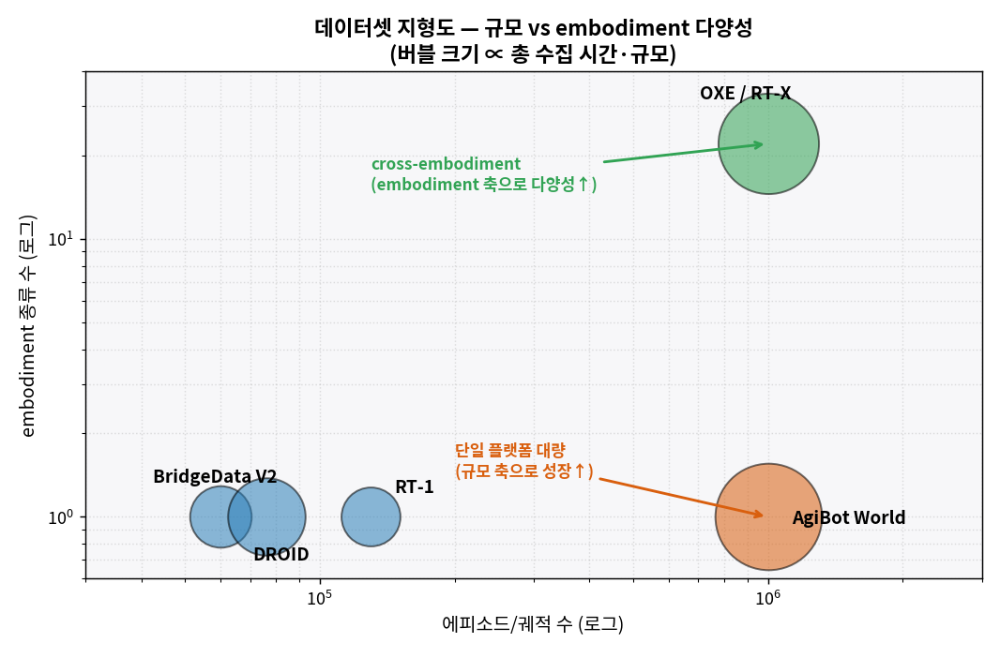
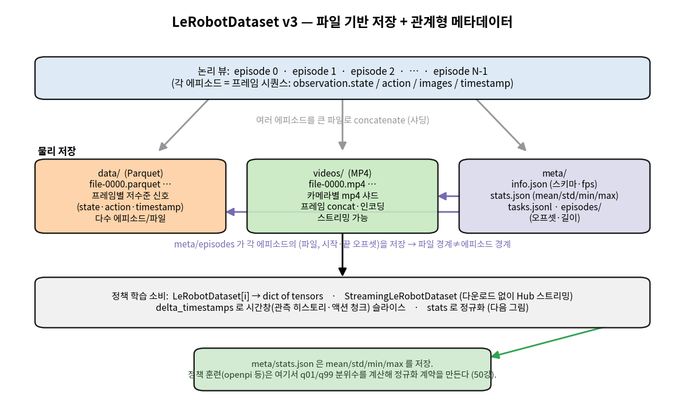
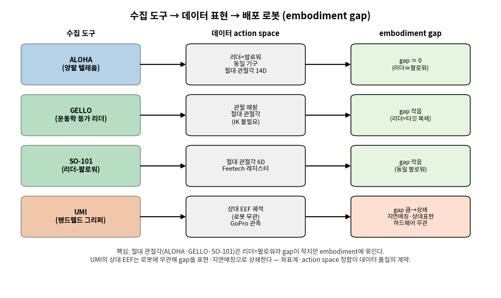
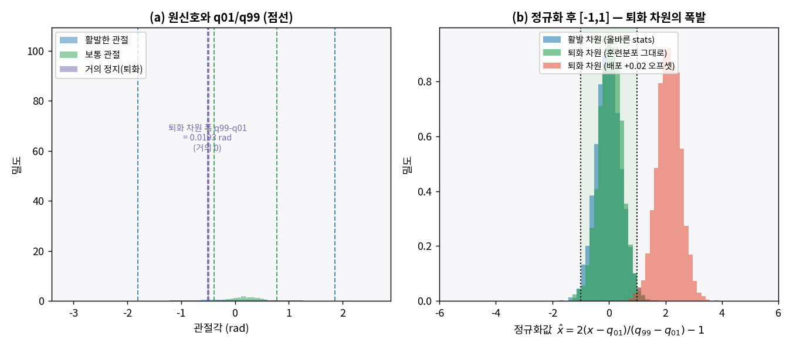

# Lec 55. 데이터셋과 수집

> Part 13 첫 강의 — VLA를 떠받치는 데이터: 무엇이, 어떻게 모이나.
> 선수 지식: 50강(정규화·청크·async), 0강(인터페이스 계약), 32강(스케일링). 관련: 37강(분포이동), 56강(다음, LeRobot 딥다이브), 57강(평가).
> 데이터셋 규모·도구 스펙·arXiv ID는 1차 자료(논문·공식 문서)와 교차 검증했다(참고문헌). 정보 기준일: 2026-07-09.

## 한 장 요약


데이터는 VLA의 연료다. 이 강의는 그 연료가 **어떤 도구로 모여**(수집기), **어떤 표준 형식으로 저장되고**(LeRobotDataset v3), **어떻게 섞여**(혼합 가중) 정책 학습에 들어가는지를 정량으로 본다. 세 관문에 각각 함정이 있다 — embodiment gap(수집기≠배포 로봇), 정규화 계약 위반(퇴화 차원 폭발), 혼합 실패(소수 고품질 도메인 소멸).

## 학습 목표

1. 주요 데이터셋 4종(OXE·DROID·BridgeData V2·AgiBot World)의 규모·다양성·수집 방식을 표로 재구성하고, "규모 축 vs embodiment 축"으로 위치시킬 수 있다.
2. LeRobotDataset v3의 표준 포맷(에피소드·프레임 parquet·비디오 mp4·meta stats)을 그리고, 왜 "단순 폴더"가 아닌지 설명할 수 있다.
3. q01/q99 정규화 통계가 왜 **인터페이스 계약**(0강·50강)이며, 잘못된 stats(퇴화 차원)가 어떻게 배포 실패를 만드는지 수치로 보일 수 있다.
4. 데이터셋 혼합 가중 $w_i$가 학습 분포와 소수 도메인 커버리지에 미치는 영향을, 가중 최소자승·스케일링(32강)의 언어로 설명할 수 있다.
5. 수집 도구 4종(ALOHA·GELLO·UMI·SO-101)의 action space·좌표계 정합과 embodiment gap을 구분할 수 있다.

## 왜 이 강의가 필요한가

42~48강의 모든 VLA는 "데이터가 있다"를 전제로 구조를 논했다. 그런데 π0의 자체 teleop ~10,000시간(44강), SmolVLA의 커뮤니티 데이터 487개 데이터셋(47강), GR00T의 데이터 피라미드(46강) — 이 연료가 어디서 어떻게 오는지는 아직 블랙박스였다. 이 강의가 그 상자를 연다.

로봇공학자에게 이건 낯선 주제가 아니다. **데이터셋 = 시스템 식별용 계측 데이터(60강)의 대규모 판**이고, **정규화 통계 = 단위 정합·인터페이스 계약(0강)**이며, **혼합 가중 = 가중 최소자승의 데이터셋 판**이다. 새로운 것은 규모와, 규모가 부르는 세 가지 함정뿐이다. 이 함정들 — "많을수록 좋다"는 착각, 정규화 계약 위반, embodiment gap — 은 논문이 한 줄로 넘기지만 배포 실패의 실제 원인이다. 이 강의는 그 함정을 **수치로 재현**해 손에 쥐어준다. 56강(LeRobot 딥다이브)과 57강(평가)이 여기서 만든 데이터 감각 위에 선다.

## 본문

### 1. 데이터셋 지형도 — 규모 축과 embodiment 축

VLA 데이터셋은 두 개의 서로 다른 축으로 자란다. **규모 축**(에피소드·시간을 늘림)과 **embodiment 축**(로봇 종류를 늘림). 이 둘은 다른 종류의 다양성이다.

| 데이터셋 | 규모 | embodiment | 수집 방식 | 특징 |
|---|---|---|---|---|
| **BridgeData V2** (2023.8) | 60,096 궤적 | WidowX 1종 | 텔레옵 | 24 환경, pick-place·push·fold. 저비용 단일 로봇 [3] |
| **DROID** (2024.3) | 76k 궤적 / **350시간** | Franka Panda 1종 | GELLO류 텔레옵 | **564 장면·52 건물·86 태스크**, 18개 랩, in-the-wild [2] |
| **RT-1** (2022.12) | ~130k 궤적 | Everyday Robots 1종 | 텔레옵 | 700+ 태스크, VLA 데이터의 원형 [4] |
| **OXE / RT-X** (2023.10) | **1M+ 궤적** | **22 embodiment** | 21개 기관 통합 | 527 스킬, cross-embodiment의 전환점 [1] |
| **AgiBot World** (2025.3) | **1,003,672 궤적 / 2,976시간** | 단일 플랫폼 대량 | 표준화 팩토리 수집 | 217 태스크·87 스킬·3000+ 물체, GO-1의 연료 [5] |

읽는 법:

- **규모 축 성장** (BridgeData→DROID→AgiBot World): 같은/유사 플랫폼에서 에피소드·시간을 늘린다. AgiBot World는 단일 플랫폼에서 **100만 궤적·약 3000시간**을 표준화된 공장식 수집으로 모았다 — 규모 축의 극단 [5].
- **embodiment 축 성장** (OXE): 22종의 서로 다른 로봇 데이터를 **한 데이터셋으로 통합**했다. 각 로봇은 action space·주기·카메라가 다르다. OXE의 기여는 데이터를 모은 것보다, "서로 다른 embodiment를 한 학습에 섞을 수 있다"는 **cross-embodiment 가설을 실증**한 것이다 [1].
- 두 축은 다른 종류의 일반화를 산다. 규모 축은 **같은 로봇에서의 태스크·장면 다양성**을, embodiment 축은 **로봇 형태에 걸친 전이**를 노린다. 32강 스케일링 법칙이 말하는 "다양성"은 이 두 축의 곱이다.



*그림 1: x축=에피소드/궤적 수(로그), y축=embodiment 종류 수(로그), 버블 크기 ∝ 총 수집 시간·규모. 단일 플랫폼 대량(BridgeData·DROID·RT-1·AgiBot World)은 y=1 선을 따라 오른쪽으로(규모 축), OXE는 위로(embodiment 축) 성장한다. AgiBot World(100만 궤적·2976h)와 OXE(100만+ 궤적·22 embodiment)는 규모는 비슷하나 **다양성의 종류가 다르다** — 전자는 태스크·장면, 후자는 로봇 형태. 좌표는 참고문헌 [1]~[5]의 1차 자료 수치.*

### 2. LeRobotDataset v3 — "표준 포맷"이 하는 일

수집한 데이터를 어떻게 저장하는가? 초보의 직관은 "폴더에 이미지·csv"지만, 100만 에피소드 규모에서는 그것이 붕괴한다. **LeRobotDataset v3**(2025.9)는 이 문제를 푸는 표준 포맷이다 [6][7].

핵심 설계 = **저장과 API의 분리**:

- **data/ (Apache Parquet)**: 저차원·고주파 신호(state·action·timestamp)를 프레임별로. v3의 변화 — **여러 에피소드를 한 파일로 concatenate**(v2는 에피소드당 1파일). 파일 경계 ≠ 에피소드 경계 [7].
- **videos/ (MP4)**: 카메라별 mp4 샤드. 프레임을 concat·인코딩. Hub에서 **다운로드 없이 스트리밍** 가능(`StreamingLeRobotDataset`) [7].
- **meta/**: `info.json`(스키마·fps·경로 템플릿), `stats.json`(**mean/std/min/max** — 정규화용 전역 통계), `tasks.jsonl`(자연어 태스크→ID), `episodes/`(각 에피소드의 파일·시작·끝 오프셋을 chunked parquet로) [7].

왜 "단순 폴더"가 아닌가:

1. **관계형 메타데이터**: 에피소드 경계를 파일명이 아니라 `meta/episodes`의 오프셋으로 푼다. 그래서 100만 에피소드를 몇 개의 큰 파일로 저장해도 임의 에피소드에 O(1) 접근이 된다 — 파일시스템 압력(inode 폭발)을 피하는 OXE급 확장의 열쇠 [7].
2. **정규화 통계가 포맷의 일부**: `stats.json`이 데이터셋과 함께 배포된다. 정책은 이 stats로 액션을 정규화한다 — 이것이 3절·E2의 인터페이스 계약이다. **주의**: v3의 `stats.json`은 mean/std/min/max를 저장하고, openpi 등 정책 훈련 파이프라인은 여기서(또는 원 데이터에서) **q01/q99 분위수를 별도 계산**해 정규화 계약을 만든다(50강) [6][8].
3. **`delta_timestamps`로 시간창 슬라이스**: 관측 히스토리·액션 청크를 상대 시각으로 잘라낸다 — 50강의 청크·관측 윈도우가 데이터 로더 레벨에서 구현된 것 [7].



*그림 2: 논리 뷰(위, 에피소드 시퀀스)와 물리 저장(가운데 3기둥: data/parquet·videos/mp4·meta/)의 분리. `meta/episodes`가 각 에피소드의 (파일, 시작·끝 오프셋)을 저장해 파일 경계와 에피소드 경계를 분리한다. 정책 학습(아래)은 `LeRobotDataset[i]`로 dict-of-tensors를 받고, `stats.json`으로 정규화한다(다음 그림). 구조 출처: LeRobotDataset v3 공식 문서 [7].*

### 3. 정규화 통계 — 조용한 인터페이스 계약 (50강 회수)

50강에서 봤듯 정책은 정규화된 액션을 낸다. 배포 시 이 값을 **역정규화**해 실제 관절각으로 되돌린다. 이 왕복이 성립하려면 훈련과 배포가 **같은 stats**를 써야 한다 — 이것이 0강의 인터페이스 계약이다.

$$
\hat x = \frac{2(x - q_{01})}{q_{99} - q_{01}} - 1, \qquad x = q_{01} + \frac{(\hat x + 1)(q_{99} - q_{01})}{2}
$$

q01/q99(1%·99% 분위수)를 쓰는 이유는 이상치가 스케일을 잡아먹는 걸 막기 위해서다(50강). 함정은 **퇴화 차원**: 어떤 관절이 이 태스크에서 거의 안 움직이면 $q_{01} \approx q_{99}$가 되어 분모가 0에 가깝다. 그러면 배포 로봇이 이 차원을 아주 살짝만 다르게 줘도 정규화값이 폭발한다. WE-1에서 이것을 수치로 재현한다 — 파인튜닝·배포가 "이유 없이" 안 될 때 첫 번째 용의자다.

### 핵심 수식

이 강의의 세 수식은 데이터 파이프라인의 세 관문에 대응한다: **E1** 규모·다양성과 혼합(무엇을 얼마나 섞나, 32강 회수), **E2** LeRobotDataset 포맷과 q01/q99 정규화(어떻게 저장·정합하나, 50강 회수), **E3** 수집 도구의 물리(어떻게 모으나, embodiment gap). 셋 다 CPU numpy로 재현되며 Worked Example에서 수치로 확인한다.

#### E1. 데이터 규모·다양성과 혼합 가중 (32강 회수)

**① 직관**: 데이터가 더 많고 다양할수록 정책이 일반화한다(32강). 그러나 데이터셋들은 크기·품질이 제각각이라, 그냥 다 합쳐 크기 비례로 뽑으면 **가장 큰 데이터셋이 학습을 독점**한다. 그래서 각 데이터셋에 **혼합 가중** $w_i$를 주어, 배치에서 뽑힐 확률을 조절한다. 작은 고품질 데이터셋을 upweight하지 않으면 그 도메인은 학습에서 사실상 사라진다.

**② 물리·기하적 의미**: 이것은 **가중 최소자승**의 데이터셋 판이다. 로봇공학자가 여러 센서의 신뢰도에 따라 잔차에 가중을 주듯, 여기서는 여러 데이터셋의 품질·정합도에 따라 손실에 가중을 준다. 혼합 분율 $f_i$(배치에서 데이터셋 $i$의 비율)는 학습이 실제로 보는 분포를 정한다. 규모 축(32강)과의 연결: 다양성은 커버리지를 사지만, 커버리지의 대부분이 배포 도메인과 먼 데이터(OXE의 잡다한 로봇)라면 그 커버리지는 **소수의 정합 데이터를 희석**한다. cross-embodiment(OXE)는 embodiment 축으로 다양성을 더하지만, 그것이 도움이 되려면 action space·좌표계가 정합돼야 한다(E3, 흔한 오해 3).

**③ 형식**: 데이터셋 $i$가 $n_i$ 에피소드, 가중 $w_i$를 가질 때 배치 내 분율은

$$
f_i = \frac{w_i}{\sum_j w_j}, \qquad
\text{(크기 비례 샘플링)}\ w_i = n_i \Rightarrow f_i = \frac{n_i}{\sum_j n_j}
$$

가중 학습 목표는 $\mathcal{L} = \sum_i f_i\, \mathbb{E}_{d \sim \mathcal{D}_i}[\ell(d)]$. 소수 도메인 $s$의 **기대 노출**은 $B$개 샘플에서 $B f_s$. 크기 비례($w_i = n_i$)면 $f_s = n_s / \sum_j n_j$로, $n_s \ll \sum_j n_j$일 때 노출이 소멸한다. 균등 가중($w_i = 1$)이면 $f_s = 1/K$($K$=데이터셋 수)로 끌어올린다. 최적 가중은 "기대 품질 $\sum_i f_i q_i$"와 "커버리지(다양성)"의 트레이드오프에서 정해진다 — WE-2가 이 곡선을 수치로 그린다.

#### E2. LeRobotDataset 포맷과 q01/q99 정규화 (50강 회수)

**① 직관**: 표준 포맷은 데이터를 에피소드·프레임·타임스탬프·비디오로 구조화하고, 각 액션 차원의 **정규화 통계(q01/q99)**를 함께 저장한다. 정책은 이 stats로 액션을 $[-1,1]$로 정규화해 학습하고, 배포 시 같은 stats로 역정규화한다. stats가 틀리면 — 특히 거의 안 움직이는 퇴화 차원에서 — 정규화값이 $[-1,1]$ 밖으로 폭발한다.

**② 물리·기하적 의미**: 정규화는 0강의 인터페이스 계약이자 단위 정합이다. 서로 다른 관절이 서로 다른 물리 범위(rad, m, 그리퍼 개폐)를 갖는데, 정규화가 이들을 공통 $[-1,1]$ 척도로 옮긴다 — 학습이 스케일 큰 차원에 지배되지 않게. q01/q99(양 끝 1% 잘라냄)는 이상치가 스케일을 잡아먹는 것을 막는 로버스트 스케일러다. **퇴화 차원의 위험**: 분모 $q_{99}-q_{01}$이 0에 가까우면 미세한 값 이동이 거대한 정규화값을 만든다. 이것은 수치 조건수(condition number) 문제와 같다 — 거의 특이한 행렬을 역행렬하는 것과 동형이다(제어 이론의 ill-conditioning).

**③ 형식**: 차원 $k$의 정규화·역정규화는

$$
\hat x_k = \frac{2(x_k - q_{01}^{(k)})}{q_{99}^{(k)} - q_{01}^{(k)}} - 1,
\qquad
\frac{\partial \hat x_k}{\partial x_k} = \frac{2}{q_{99}^{(k)} - q_{01}^{(k)}}
$$

민감도 $\partial \hat x_k / \partial x_k$가 분모에 반비례한다. 퇴화 차원($q_{99}^{(k)} \approx q_{01}^{(k)}$)에서 이 민감도가 폭발하므로, 배포 시 $\delta$만큼의 작은 오프셋이 $\hat x_k$를 $2\delta/(q_{99}-q_{01})$만큼 튕긴다 — 폭이 0.02 rad인 차원에서 0.03 rad 오프셋이면 $\hat x$가 약 3만큼 이동(계약 $[-1,1]$의 3배). WE-1이 이를 정확히 재현한다. **처방**: 퇴화 차원은 분모에 하한(예: openpi의 clip)을 두거나 정규화에서 제외한다 — 이것이 openpi README가 직접 경고하는 지점이다(50강 [6]).

#### E3. 수집 도구의 물리 — 텔레옵·핸드헬드와 embodiment gap

**① 직관**: 시연 데이터는 사람이 로봇을 조종해(텔레옵) 또는 손에 든 장치로(핸드헬드) 모은다. 핵심 질문: **수집기가 낸 action과 배포 로봇의 action이 같은가?** ALOHA·GELLO·SO-101은 리더 장치가 팔로워 로봇과 같은 기구라 gap이 작지만, UMI는 손에 든 그리퍼라 배포 로봇과 물리적으로 다르다 — 이 **embodiment gap**을 어떻게 상쇄하느냐가 데이터 품질을 정한다.

**② 물리·기하적 의미**: 두 부류의 설계 철학이 있다. **(a) 리더-팔로워(절대 관절각)**: ALOHA는 리더 팔과 팔로워 팔이 동일 기구라 리더의 관절각을 그대로 팔로워에 복사한다 — **IK가 필요 없다**(관절각→관절각). GELLO는 한 발 더 나가, 타깃 로봇(Franka·UR5)의 운동학적 복제본을 3D 프린트로 만들어 관절각을 매핑한다. SO-101도 같은 원리($130 하드웨어). 이들의 gap ≈ 0인 이유는 **수집기의 좌표계=배포 로봇의 좌표계**이기 때문. 대가: action space가 그 embodiment에 묶인다(50강의 "절대 관절각은 IK 불필요하나 embodiment 종속"). **(b) 핸드헬드(상대 EEF)**: UMI는 로봇 없이 손에 든 그리퍼로 시연을 모은다. 그리퍼에 붙은 카메라(GoPro)가 관측을, 그리퍼의 상대 궤적이 action을 준다. embodiment gap이 크지만, **상대 EEF 표현**(로봇 무관)과 **추론 시 지연 매칭**으로 이를 상쇄해 정책이 여러 로봇에 이식 가능해진다 [10]. 이것은 50강 GR00T N1.7이 인간 비디오와 action space를 공유하려 상대 EEF로 간 것과 같은 논리다.

**③ 형식**: 수집기→데이터셋 매핑을 $\phi$라 하면, 리더-팔로워는 $\phi = \text{identity}$(관절각 복사, gap 0)에 가깝고, 핸드헬드는 $\phi: \text{EEF 상대 궤적} \to \text{로봇 관절 명령}$으로 배포 시 IK·지연 보상을 요구한다. 데이터 품질의 계약: 수집 좌표계 $\mathcal{F}_{\text{collect}}$와 배포 좌표계 $\mathcal{F}_{\text{deploy}}$가 정합해야 학습된 정책이 유효하다. 정합이 깨지면(gap 미상쇄) 훈련 분포와 배포 분포가 어긋나 covariate shift(37강)가 된다.



*그림 3: 수집 도구별 action space와 embodiment gap. ALOHA·GELLO·SO-101(절대 관절각, 리더=팔로워)은 gap이 작지만 embodiment에 묶이고, UMI(상대 EEF, 핸드헬드)는 gap이 크나 표현·지연매칭으로 상쇄해 하드웨어 무관하다. 좌표계·action space 정합이 데이터 품질의 계약이다. 도구 스펙 출처: ALOHA [9], GELLO [11], UMI [10], SO-101 [12].*

### Worked Example

두 예제 모두 순수 numpy로 실행 가능하다(재현성). 본문·그림이 인용하는 수치는 모두 아래 코드의 실제 실행 출력과 일치한다(주석에 실제 출력).

#### WE-1 (코드): LeRobotDataset류 구조 + q01/q99 정규화 + 퇴화 차원 폭발

**문제 설정**. 20개 에피소드, 각 프레임이 6D 액션(SO-101급)인 미니 데이터셋을 만든다. 관절 5는 이 태스크에서 거의 안 쓰는 손목/그리퍼라 **퇴화 차원**으로 설계한다. 차원별 q01/q99를 계산하고(50강 회수), 올바른 stats로 정규화하면 $[-1,1]$ 안에 들지만, 퇴화 차원에서 배포 오프셋이 어떻게 폭발하는지 수치로 본다.

```python
import numpy as np
rng = np.random.default_rng(0)

D = 6                                       # 액션 차원 (SO-101급 6D)
FROZEN = 5                                  # 관절 5 = 이 태스크에서 거의 안 쓰는 차원
def make_episode(T, base):                  # LeRobotDataset류 에피소드: 프레임 시퀀스
    t = np.arange(T) / 30.0                 # 30 fps timestamp
    act = np.zeros((T, D))
    for j in range(D):
        amp = [0.8, 0.6, 0.5, 0.4, 0.3, 0.003][j]           # 관절5 진폭 0.003 (퇴화)
        b = base[j] if j != FROZEN else -0.5                # 퇴화 차원은 모든 에피소드에서 -0.5
        act[:, j] = b + amp*np.sin(2*np.pi*(0.3+0.1*j)*t + j) \
                    + rng.normal(0, 0.004 if j == FROZEN else 0.01, T)
    return {"action": act, "timestamp": t}

episodes = [make_episode(rng.integers(40, 80), rng.normal(0, 0.2, D)) for _ in range(20)]
all_actions = np.concatenate([e["action"] for e in episodes], axis=0)   # 프레임 concat
print(all_actions.shape)                    # (1247, 6)  — 20 에피소드, 총 1247 프레임

# --- q01/q99 정규화 통계 (차원별) ---
q01 = np.quantile(all_actions, 0.01, axis=0)
q99 = np.quantile(all_actions, 0.99, axis=0)
width = q99 - q01
print(np.round(width, 4))                   # [1.9777 1.6346 1.5619 1.308 1.1448 0.0209]
print(f"퇴화 차원 폭 = {width[5]:.5f} rad ({width[0]/width[5]:.0f}배 좁음)")  # 0.02093, 95배

def normalize(x, q01, q99):
    return 2.0 * (x - q01) / (q99 - q01) - 1.0

# --- 올바른 stats: 대부분 [-1,1] 안 ---
norm_ok = normalize(all_actions, q01, q99)
print(np.round(np.mean((norm_ok >= -1) & (norm_ok <= 1), axis=0), 3))  # 전부 0.979

# --- 퇴화 차원에 배포 오프셋 0.03rad → 폭발 ---
deploy = all_actions.copy(); deploy[:, 5] += 0.03
nd = normalize(deploy, q01, q99)
print(f"관절5 정규화 중앙값 {np.median(nd[:,5]):.1f}, 최대 {nd[:,5].max():.1f}")  # 2.8, 4.2
print(f"0.03rad = 폭의 {0.03/width[5]*100:.0f}%")                       # 143%

# --- 대조: 활발한 차원(관절0)에 같은 0.03rad → 무해 ---
deploy0 = all_actions.copy(); deploy0[:, 0] += 0.03
n0 = normalize(deploy0, q01, q99)
print(f"관절0: [{n0[:,0].min():.2f}, {n0[:,0].max():.2f}], 폭의 {0.03/width[0]*100:.1f}%")  # [-1.08,1.11], 1.5%
```

출력이 E2를 정확히 재현한다: 퇴화 차원(관절 5)의 폭 $q_{99}-q_{01}=0.0209$ rad로, 활발한 관절 0(폭 1.978)보다 **95배 좁다**. 올바른 stats면 모든 차원의 97.9%가 $[-1,1]$ 안에 든다. 그러나 퇴화 차원에 **0.03 rad 배포 오프셋**(전체 폭의 143%)을 주면 정규화값 중앙값이 **2.8**, 최대 **4.2**로 계약 $[-1,1]$을 크게 벗어난다. 같은 0.03 rad를 활발한 관절 0에 주면 그 차원 폭의 1.5%만 이동해 무해하다($[-1.08, 1.11]$). **정규화는 사소하지 않다** — 퇴화 차원 한 곳의 stats 실수가 배포 정책을 통째로 망가뜨린다(흔한 오해 2).



*그림 4: (a) 세 관절 차원의 원신호와 q01/q99(점선). 퇴화 차원(보라)의 폭 $q_{99}-q_{01}$은 거의 0(그림에선 별도 시드로 0.019 rad). (b) 정규화 후: 활발·퇴화 차원 모두 훈련 분포에선 $[-1,1]$ 안(녹색 띠). 그러나 퇴화 차원에 미세 배포 오프셋(+0.02 rad, 빨강)을 주면 정규화값이 중앙값 ~2.1, 최대 3.7로 폭발한다. E2의 민감도 $2/(q_{99}-q_{01})$가 퇴화 차원에서 커지는 것의 시각화. (a)/(b) 수치는 `gen_figs.py` 별도 시드 출력.*

#### WE-2 (코드): 데이터셋 혼합 가중 — 소수 고품질 도메인의 운명

**문제 설정**. 세 데이터셋을 혼합한다: big(90만, 잡다·품질 낮음), mid(7.6만, 중간), small(5천, 고품질·배포 타깃 정합). 혼합 가중이 배치 분포와 소수 도메인 커버리지에 미치는 영향을 본다. 손계산 검산: 크기 비례면 small 분율 $= 5000/981000 = 0.51\%$, 균등이면 $1/3 = 33.3\%$ — **65배** 차이다.

```python
import numpy as np
datasets = [("big",   900_000, 0.3),        # (이름, 에피소드, 품질=성공기여)
            ("mid",   76_000,  0.7),
            ("small", 5_000,   1.0)]         # 작지만 배포 타깃과 정합
names = [d[0] for d in datasets]
sizes = np.array([d[1] for d in datasets], float)
qual  = np.array([d[2] for d in datasets], float)

def mix(weights):
    w = np.array(weights, float); return w / w.sum()

# --- 크기 비례 샘플링 (w_i = n_i): 큰 데이터셋 독점 ---
f_nat = sizes / sizes.sum()
print(np.round(f_nat*100, 2))               # [91.74  7.75  0.51]  small 0.51%

# --- 균등 가중 (w_i = 1): small을 33.3%로 ---
f_uni = mix([1, 1, 1])
print(np.round(f_uni*100, 2))               # [33.33 33.33 33.33]

# --- 소수 도메인 기대 노출 (B=100k 샘플) ---
B = 100_000
print(f"small 노출: 크기비례 {B*f_nat[2]:.0f}, 균등 {B*f_uni[2]:.0f}")  # 510, 33333 (65배)

# --- 혼합 기대 품질 sum_i f_i * q_i, 여러 가중 ---
def eq(w): f = mix(w); return float((f*qual).sum())
for lab, w in [("크기비례", sizes), ("균등", [1,1,1]),
               ("소수상향(1,3,20)", [1,3,20]), ("타깃편중(1,5,60)", [1,5,60])]:
    f = mix(w)
    print(f"{lab:16s} frac={np.round(f,3)} 기대품질={eq(w):.3f} small={f[2]*100:.1f}%")
# 크기비례       기대품질 0.335  small 0.5%
# 균등          기대품질 0.667  small 33.3%
# 소수상향(1,3,20) 기대품질 0.933  small 83.3%
# 타깃편중(1,5,60) 기대품질 0.967  small 90.9%

print(f"small 100%: 기대품질 {eq([0,0,1]):.3f} (최대지만 big/mid 다양성 노출=0)")  # 1.000
```

출력이 E1을 정량화한다. **크기 비례 샘플링**에서 고품질 타깃(small)은 배치의 **0.51%**뿐 — 10만 샘플 중 510개, 사실상 학습에서 사라진다. **균등 가중**은 이를 33.3%(33,333 샘플)로 끌어올린다 — **65배**. 기대 품질 $\sum_i f_i q_i$은 크기비례 0.335 → 균등 0.667 → 소수상향 0.933 → 타깃편중 0.967로 오른다. 그러나 small에 100% 몰면 기대 품질은 1.0으로 최대지만 big/mid의 장면·물체 다양성 노출이 0이 되어 **분포이동(37강)에 취약**해진다. **혼합은 품질↔커버리지의 트레이드오프**이고, 최적 가중은 이 둘의 균형점이다 — "데이터 많을수록 무조건 좋다"가 틀린 이유(흔한 오해 1). 이것이 π0·GR00T가 "사전학습(대량 잡다)→파인튜닝(소량 고품질)"의 2단 레시피를 쓰는 정량적 근거다.

### 로봇공학자를 위한 번역

- **데이터셋 = 대규모 계측 데이터.** 60강 시스템 식별에서 관성 파라미터를 회귀하려 실험 데이터를 모으듯, VLA는 정책을 회귀하려 시연 데이터를 모은다. 다른 점은 규모(시간→만 단위)와, 모델이 파라메트릭(관성 행렬)이 아니라 비파라메트릭(신경망)이라는 것뿐이다.
- **정규화 통계 = 단위 정합·인터페이스 계약(0강).** 서로 다른 관절의 rad/m/그리퍼 개폐를 공통 척도로 옮기는 것은, 제어기 설계에서 상태를 무차원화(nondimensionalize)하는 것과 같다. 퇴화 차원의 폭발은 **조건수가 나쁜 스케일링**의 문제 — 거의 특이한 행렬을 역행렬하는 것과 동형이다.
- **혼합 가중 = 가중 최소자승.** 여러 센서의 신뢰도로 잔차에 가중을 주듯, 여러 데이터셋의 품질·정합도로 손실에 가중을 준다. 최적 가중은 "정보량(품질)"과 "커버리지(다양성)"의 균형 — 칼만 필터의 측정 신뢰도 가중과 같은 발상.
- **embodiment gap = 좌표계 변환의 정합.** 수집기와 배포 로봇의 좌표계가 다르면(UMI), 그 변환 $\phi$를 명시적으로 다뤄야 한다 — hand-eye 캘리브레이션(60강)이 카메라와 로봇 좌표계를 정합시키는 것과 같은 문제 구조다.

## 흔한 오해

1. **"데이터가 많을수록 무조건 좋다"** — 규모는 필요조건이지 충분조건이 아니다(32강). WE-2에서 봤듯, 크기 비례로 90만짜리 잡다한 데이터셋에 5천짜리 고품질을 섞으면 고품질은 배치의 0.51%로 소멸한다. **다양성·품질·혼합 가중**이 규모만큼 중요하다. 큰 데이터가 배포 도메인과 멀면(OXE의 잡다한 로봇) 그 커버리지는 소수 정합 데이터를 희석할 뿐이다. π0·GR00T의 2단 레시피(대량 사전학습→소량 파인튜닝)가 이 트레이드오프의 실무 답이다.

2. **"정규화 통계는 사소한 전처리다"** — 배포 실패의 흔한 원인이다(0강 계약). WE-1에서 퇴화 차원 한 곳의 stats 처리 실수(폭 0.02 rad 차원에 0.03 rad 배포 오프셋)가 정규화값을 4.2까지 폭발시켰다. 정규화는 훈련↔배포의 인터페이스 계약이고, 계약 위반은 조용히(에러 없이) 정책을 망가뜨린다. openpi README가 퇴화 차원을 직접 경고하는 이유다(50강 [6][8]).

3. **"cross-embodiment = 아무 로봇 데이터나 섞기"** — OXE의 기여는 데이터를 모은 게 아니라 **정합하는 법**을 보인 것이다(E1·E3). 22종 로봇은 action space·주기·좌표계가 다르다. 그냥 섞으면 상충하는 신호가 학습을 방해한다. cross-embodiment가 도움이 되려면 action space 통일(RDT-1B의 128차원 슬롯, 50강)이나 embodiment 태그(GR00T, 50강) 같은 정합 장치가 필요하다.

4. **"텔레옵 데이터 = 배포 로봇과 동일하다"** — embodiment gap이 있다(E3). ALOHA·GELLO·SO-101처럼 리더=팔로워면 gap이 작지만, UMI처럼 핸드헬드면 수집기와 배포 로봇이 물리적으로 다르다. gap을 상쇄하는 장치(상대 EEF 표현, 지연 매칭)가 없으면 훈련 분포와 배포 분포가 어긋나 covariate shift(37강)가 된다. "데이터를 모았다"와 "배포 로봇에 유효한 데이터를 모았다"는 다르다.

5. **"LeRobotDataset는 그냥 이미지·csv 폴더다"** — 표준 포맷이다(E2·2절). v3는 여러 에피소드를 concat한 parquet·mp4 샤드에, 에피소드 경계를 오프셋으로 푸는 관계형 메타데이터, 정규화 stats, 스트리밍을 얹었다. "단순 폴더"는 OXE급 100만 에피소드에서 파일시스템 압력으로 붕괴한다 — 포맷 설계가 확장성의 조건이다 [7].

## 실습 (1.5~2h, HF Hub 실제 사용)

**목표**: LeRobotDataset를 실제로 로드·시각화하고, 정규화 통계와 혼합의 감각을 데이터로 확인한다. GPU 불필요.

1. **환경**: `pip install lerobot`(또는 v3 지원 main 브랜치, 문서 참조). HF 계정으로 `huggingface-cli login`.
2. **데이터셋 로드**: LeRobot 커뮤니티 데이터셋 하나를 로드한다(예: SO-100/SO-101 계열 pick-place, 또는 `lerobot/` 조직의 소형 데이터셋).
   - `LeRobotDataset(repo_id)`로 로드 → `dataset.meta.info`(스키마·fps), `dataset.meta.stats`(정규화 통계), 에피소드 수·총 프레임 수 확인.
   - `dataset[0]`을 출력해 dict-of-tensors 구조 확인(observation.state·action·images·timestamp).
3. **정규화 통계 검사(WE-1의 실물판)**: `dataset.meta.stats`에서 action의 min/max/mean/std를 뽑고, 각 차원의 범위 폭을 계산한다. **가장 좁은 차원**(퇴화 후보)을 찾아 그 폭을 다른 차원과 비교하라. q01/q99를 직접 계산하려면 전체 action을 모아(`np.concatenate`) `np.quantile`. WE-1의 "퇴화 차원" 감각을 실데이터에서 확인.
4. **에피소드 시각화**: 한 에피소드의 action 궤적을 차원별로 플롯(matplotlib). 어떤 차원이 활발하고 어떤 차원이 거의 정지인지 눈으로 확인 — 이것이 정규화 stats의 폭 차이를 만든다.
5. **혼합 사고실험(WE-2 연장)**: 서로 다른 크기의 데이터셋 2~3개를 로드하고, "크기 비례로 섞으면 각 데이터셋이 배치의 몇 %인가"를 에피소드 수로 계산하라. 작은 데이터셋을 균등 비율로 끌어올리려면 가중을 얼마로 줘야 하는가? WE-2 코드에 실제 에피소드 수를 대입해 확인.
6. (선택) `StreamingLeRobotDataset`로 큰 데이터셋을 다운로드 없이 스트리밍해 첫 몇 프레임을 받아본다.

> 실습의 수치 주장(성공률 등)은 하지 말 것 — 이 실습은 **데이터 구조·통계**를 만지는 것이 목적이다. 정책 학습·평가는 56·57강에서.

## Claude와 토론할 질문

1. 규모 축(AgiBot World)과 embodiment 축(OXE)의 다양성은 각각 어떤 종류의 일반화를 사는가? 배포 로봇이 정해져 있다면 둘 중 무엇을 우선해야 하는가?
2. q01/q99 정규화에서 퇴화 차원($q_{01} \approx q_{99}$)이 왜 위험한가? 제어 이론의 ill-conditioning·조건수와 연결해 설명하라. 처방은?
3. 데이터셋 혼합에서 "크기 비례"와 "균등 가중"의 극단 사이 어디가 최적인가? 가중 최소자승의 언어로, 그리고 π0의 2단 레시피와 연결해 논하라.
4. UMI(핸드헬드, 상대 EEF)의 embodiment gap을 상쇄하는 두 장치(상대 표현·지연 매칭)는 각각 무엇을 정합시키는가? GR00T N1.7의 상대 EEF(50강)와 같은 논리인가?
5. cross-embodiment 데이터를 "그냥 섞으면" 왜 학습이 방해받는가? 정합 장치(action space 통일·embodiment 태그) 없이 섞은 데이터가 만드는 상충 신호를 구체적으로 상상해 보라.
6. LeRobotDataset v3가 "여러 에피소드를 한 파일로 concat"하고 오프셋으로 경계를 푸는 설계는, 100만 에피소드에서 "에피소드당 1파일"보다 왜 나은가? 파일시스템·IO 관점에서.
7. 정규화 통계를 데이터셋과 함께 배포하는 것(포맷의 일부)이 왜 "인터페이스 계약"인가? 이 계약을 어기는 시나리오 3가지를 들어 보라(다른 stats로 파인튜닝, 퇴화 차원, 단위 불일치).

## 읽을거리

1. **LeRobotDataset v3 공식 문서** (huggingface.co/docs/lerobot/en/lerobot-dataset-v3, ~20분): 포맷 설계·디렉토리 구조·스트리밍. 2절·E2의 원전이며 실습의 사전 읽기. **"Format design"과 "Directory layout" 절만** 읽으면 충분하다.
2. **OXE 논문** (arXiv:2310.08864) — **Abstract·Sec 1(데이터셋 통계표)만**: cross-embodiment의 규모와 정합 문제 의식.
3. (선택) **UMI 논문** (arXiv:2402.10329) **Sec 3(하드웨어·인터페이스)만** + **DROID 논문** (arXiv:2403.12945) **Sec 4(데이터셋 통계)만**: 수집 도구의 물리와 데이터셋 규모를 원문으로 확인하고 싶을 때.

## 자가 점검

1. OXE·DROID·BridgeData V2·AgiBot World의 규모·embodiment·수집 방식을 안 보고 표로 재구성할 수 있는가? "규모 축 vs embodiment 축"으로 위치시킬 수 있는가?
2. LeRobotDataset v3의 3기둥(data/parquet·videos/mp4·meta/)과 각 역할을 그릴 수 있는가? "단순 폴더"가 왜 100만 에피소드에서 붕괴하는지 설명할 수 있는가?
3. q01/q99 정규화·역정규화 식을 쓰고, 퇴화 차원에서 민감도 $2/(q_{99}-q_{01})$가 폭발하는 이유를 설명할 수 있는가? (WE-1: 폭 0.02 rad 차원에 0.03 rad 오프셋 → 정규화값 2.8~4.2)
4. 데이터셋 혼합 가중 $f_i = w_i/\sum_j w_j$를 쓰고, 크기 비례 vs 균등에서 소수 도메인 노출이 어떻게 달라지는지(WE-2: 0.51% vs 33.3%, 65배) 수치 감각과 함께 말할 수 있는가?
5. 혼합이 "품질↔커버리지 트레이드오프"인 이유를, WE-2의 기대 품질 곡선(0.335→0.667→0.933→1.0)과 분포이동(37강)으로 설명할 수 있는가?
6. ALOHA·GELLO·SO-101(절대 관절각)과 UMI(상대 EEF)의 embodiment gap 차이를 설명하고, UMI가 gap을 상쇄하는 두 장치를 말할 수 있는가?
7. "정규화 통계는 인터페이스 계약(0강)"이라는 문장의 의미를, 훈련↔배포 왕복과 계약 위반 시나리오로 설명할 수 있는가?

## 참고문헌

> 본문 수치·주장의 출처. 데이터셋 규모·도구 스펙·arXiv ID는 2026-07-09에 1차 자료(논문·공식 문서)와 대조 확인했다. 웹 문서는 같은 날 접속 기준.

[1] A. O'Neill et al. (Open X-Embodiment Collaboration), "Open X-Embodiment: Robotic Learning Datasets and RT-X Models," arXiv:2310.08864, 2023.10. https://arxiv.org/abs/2310.08864
— **뒷받침**: 1M+ 궤적, 22 embodiment(21개 기관), 527 스킬, cross-embodiment 실증.

[2] A. Khazatsky et al., "DROID: A Large-Scale In-The-Wild Robot Manipulation Dataset," arXiv:2403.12945, 2024.3. https://arxiv.org/abs/2403.12945
— **뒷받침**: 76k 궤적/350시간, Franka Panda 단일 하드웨어, 564 장면·52 건물·86 태스크, 18개 랩, 12개월 수집, 3 카메라뷰+깊이+언어.

[3] H. Walke et al., "BridgeData V2: A Dataset for Robot Learning at Scale," arXiv:2308.12952, 2023.8 (CoRL 2023). https://arxiv.org/abs/2308.12952
— **뒷받침**: 60,096 궤적, 24 환경, WidowX 저비용 단일 로봇, pick-place·push·sweep·stack·fold, 언어 라벨.

[4] A. Brohan et al. (Google), "RT-1: Robotics Transformer for Real-World Control at Scale," arXiv:2212.06817, 2022.12. https://arxiv.org/abs/2212.06817
— **뒷받침**: ~130k 궤적, Everyday Robots 단일 플랫폼, 700+ 태스크, VLA 데이터의 원형.

[5] AgiBot-World Contributors (OpenDriveLab 등), "AgiBot World Colosseo: A Large-scale Manipulation Platform for Scalable and Intelligent Embodied Systems," arXiv:2503.06669, 2025.3. https://arxiv.org/abs/2503.06669 · https://github.com/OpenDriveLab/AgiBot-World
— **뒷받침**: 1,003,672 궤적(~43.8T)/2,976.4시간, 217 태스크·87 스킬·3000+ 물체·100+ 실환경, GO-1(latent action) 정책의 연료.

[6] Physical Intelligence, openpi 저장소 (scripts/compute_norm_stats.py, README 정규화 경고). https://github.com/Physical-Intelligence/openpi
— **뒷받침**: q01/q99 차원별 정규화, 퇴화 차원(q01≈q99) 폭발 경고 — 50강 [6]에서 상세.

[7] Hugging Face, "LeRobotDataset v3.0" 공식 문서. https://huggingface.co/docs/lerobot/en/lerobot-dataset-v3 · 블로그: https://huggingface.co/blog/lerobot-datasets-v3
— **뒷받침**: 파일 기반 저장(여러 에피소드/파일 concat, v2는 에피소드당 1파일), data/(parquet)·videos/(mp4)·meta/(info.json·stats.json[mean/std/min/max]·tasks.jsonl·episodes/ 오프셋), StreamingLeRobotDataset, delta_timestamps, lerobot>=0.4.0 포함.

[8] Hugging Face, lerobot 저장소 (정규화·데이터셋 stats). https://github.com/huggingface/lerobot
— **뒷받침**: meta/stats.json이 정규화 통계를 데이터셋과 함께 배포(인터페이스 계약), 정책별 정규화 모드.

[9] T. Zhao et al., "Learning Fine-Grained Bimanual Manipulation with Low-Cost Hardware (ALOHA/ACT)," arXiv:2304.13705, 2023.4. https://arxiv.org/abs/2304.13705
— **뒷받침**: 양팔 리더-팔로워 텔레옵, 관절공간 매핑(IK 우회), <$20k 예산, 절대 관절각 14D, ACT 청크(50강 [3]).

[10] C. Chi et al., "Universal Manipulation Interface: In-The-Wild Robot Teaching Without In-The-Wild Robots," arXiv:2402.10329, 2024.2. https://arxiv.org/abs/2402.10329
— **뒷받침**: 핸드헬드 그리퍼+카메라(GoPro) 수집, 상대 궤적 action 표현, 추론 시 지연 매칭, 하드웨어 무관·다중 로봇 이식.

[11] P. Wu et al., "GELLO: A General, Low-Cost, and Intuitive Teleoperation Framework for Robot Manipulators," arXiv:2309.13037, 2023.9. https://arxiv.org/abs/2309.13037
— **뒷받침**: 타깃 로봇의 운동학 등가 리더(3D 프린트+저가 서보, ~$300/대), 관절 매핑, Franka·UR5·xArm 지원, VR/spacemouse 대비 우수.

[12] Hugging Face, "SO-101" 공식 문서. https://huggingface.co/docs/lerobot/so101
— **뒷받침**: 6-DoF 리더-팔로워, Feetech STS3215 서보(팔로워 1/345 기어), ~$130 3D 프린트, LeRobot 통합, SO-100 후속(배선·기어 개선). SO-100은 SmolVLA 커뮤니티 데이터의 하드웨어(47강).

[13] A. Radosavovic et al. / OpenAI·PI 등, 스케일링·데이터 혼합 관행 — 본 강의의 혼합 가중 논의는 32강(스케일링) 및 π0(50강 [5])·GR00T(50강 [8])의 2단 레시피(사전학습→파인튜닝)를 정량 토이로 재구성한 것이다. 실제 혼합 가중 수치는 각 모델 논문 참조.

*수치 재현성: 핵심 수식(E1~E3)·Worked Example·그림의 재현 수치는 CPU numpy 토이의 실행 출력이다(실제 데이터셋 다운로드·GPU 없이 데이터 파이프라인의 수학만 재현). `images/lec55/gen_figs.py`와 본문 코드 블록으로 재현되는 값 — WE-1: 20 에피소드/1247 프레임, 퇴화 차원 폭 q99-q01=0.0209 rad(관절0 대비 95배 좁음), 올바른 stats 시 97.9%가 [-1,1] 이내, 퇴화 차원 배포 오프셋 0.03 rad(폭의 143%)→정규화값 중앙값 2.8·최대 4.2, 활발 차원 대조 0.03 rad→폭의 1.5%(무해). WE-2: 크기비례 분율 [91.74, 7.75, 0.51]%, 균등 [33.33]×3, small 노출 크기비례 510 vs 균등 33,333(65배), 기대품질 0.335/0.667/0.933/0.967(크기비례/균등/소수상향/타깃편중), small 100%→1.0. 그림 4(파일명 fig3_normalization.png): 별도 시드로 퇴화 차원 폭 0.019 rad, 배포 +0.02 rad→정규화 중앙값 ~2.1·최대 3.7. numpy 1.26 / matplotlib 3.5 기준 재현 확인(코드는 numpy·matplotlib만 사용). 데이터셋 규모(OXE 1M+/22 embodiment, DROID 76k/350h, BridgeData V2 60,096, AgiBot World 1,003,672/2976h)·도구 스펙(ALOHA·GELLO·UMI·SO-101)은 코드가 아니라 참고문헌 [1]~[12]의 1차 자료로 확인한 실측이다(위 토이 수치와 구분).*

<!-- lecture-nav -->

---

⬅ 이전: [Lec 54. 학습된 world model (맛보기)](../part12-environment-simulation/lec54-learned-world-models.md)　｜　[📖 전체 목차](../README.md)　｜　다음: [Lec 56. LeRobot 딥다이브 — 데이터·정책·환경을 잇는 하나의 API](lec56-lerobot-deep-dive.md) ➡
