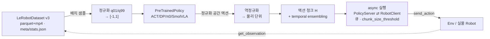
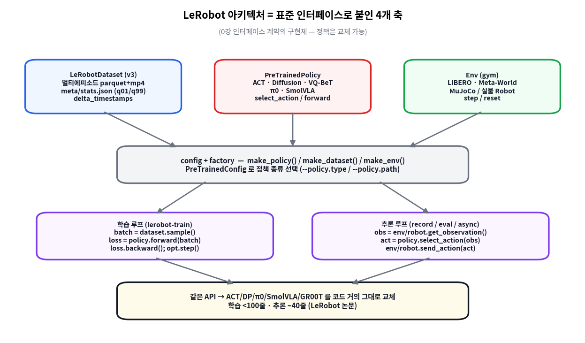
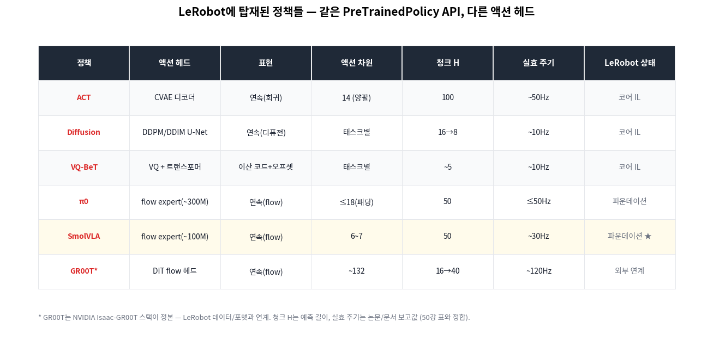
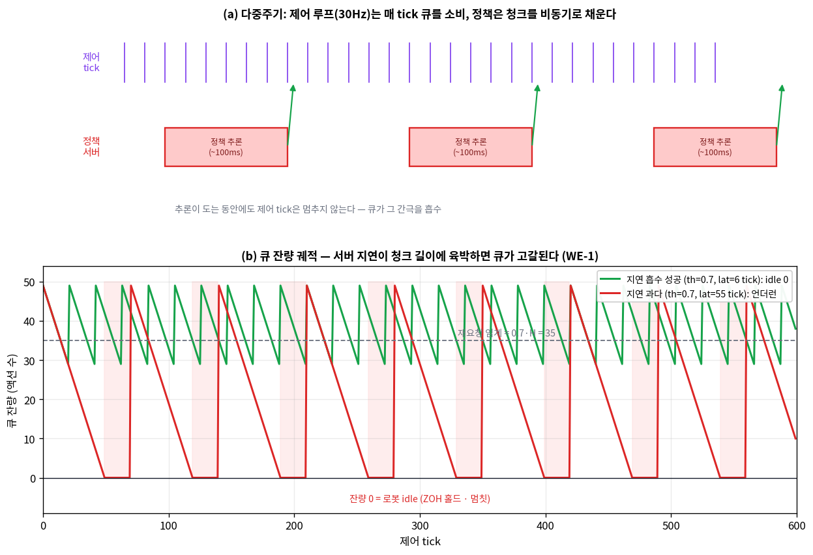
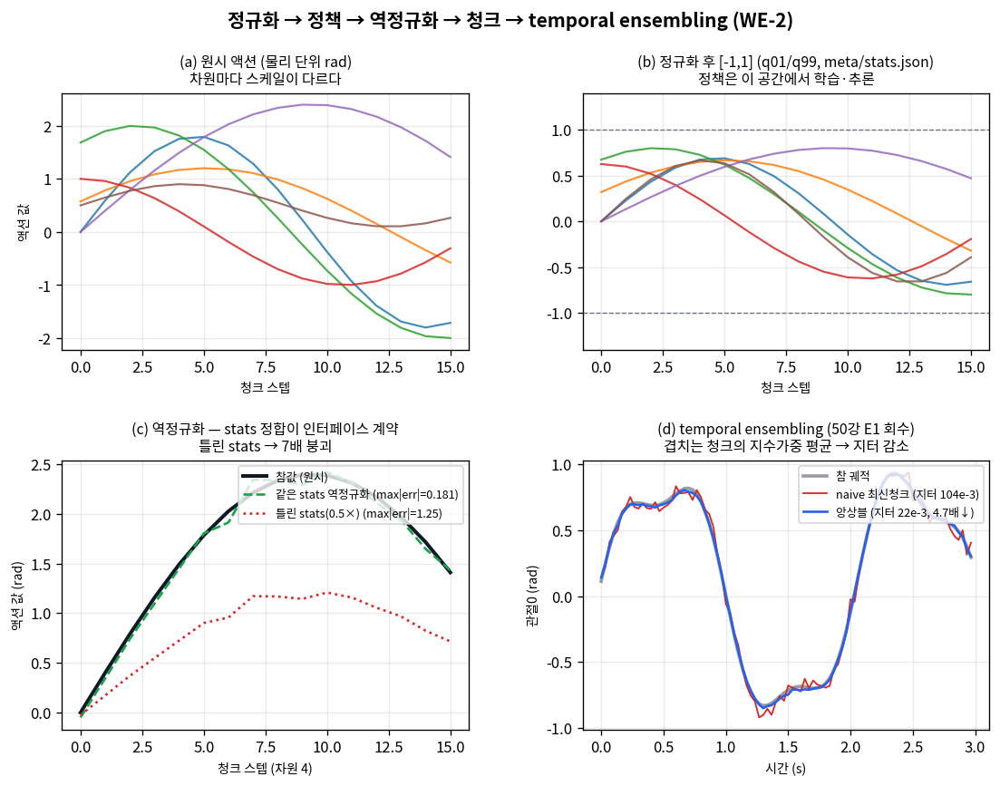

# Lec 56. LeRobot 딥다이브 — 데이터·정책·환경을 잇는 하나의 API

> Part 13 두 번째 강의(★ 메인 실습 도구). 선수 지식: 50강(정규화·청크·async·RTC), 55강(데이터셋·stats). 정책 배경으로 38강(ACT), 39강(Diffusion Policy), 44강(π0), 47강(SmolVLA).
> 이 강의의 목표: LeRobot를 "여러 정책을 같은 계약으로 붙이는 프레임워크"로 이해하고, 55강 데이터 → 정규화 → 정책 → 청크 → async 실행의 전체 경로를 코드 수준에서 재구성한 뒤, **SmolVLA를 LIBERO에 LoRA로 파인튜닝**하는 것.
> 핵심 사실(정책 목록·async·LoRA 명령·LIBERO 구조)은 2026-07-09에 LeRobot 논문·공식 문서로 교차 확인했다.

## 한 장 요약



LeRobot는 **하나의 모델이 아니라**, 데이터셋·정책·환경을 표준 인터페이스로 붙여 정책을 교체 가능하게 만든 프레임워크다(0강 인터페이스 계약의 구현체). 이 강의는 그 계약의 각 칸을 열어 보고, 마지막에 SmolVLA를 LIBERO에 파인튜닝한다.

## 학습 목표

1. LeRobot의 4개 축(Dataset · Policy · Env · 학습/추론 루프)과 `config+factory`가 어떻게 정책 교체를 가능하게 하는지, `PreTrainedPolicy` API 관점에서 설명할 수 있다.
2. LeRobot에 탑재된 정책들(ACT/DP/VQ-BeT/π0/SmolVLA)을 액션 헤드·표현·차원·청크·주기로 구분하고, 같은 API가 이들을 어떻게 통일하는지 말할 수 있다.
3. async 추론의 큐 동역학을 정량적으로 재현하고(`chunk_size_threshold`·서버 지연 ↔ 재요청 빈도·큐 잔량·언더런), 50강의 다중주기·RTC와 연결할 수 있다.
4. 정규화 → 정책 → 역정규화 → 청크 → temporal ensembling 파이프라인을 단계별 shape·값으로 검증하고, **stats 불일치가 왜 조용한 실패**인지 재현할 수 있다.
5. `lerobot-train`으로 SmolVLA를 LIBERO에 LoRA 파인튜닝하는 명령을 구성하고, 사전학습+LoRA가 왜 "처음부터"보다 나은지(33강) 설명할 수 있다.

## 왜 이 강의가 필요한가

지금까지 우리는 정책을 **논문 단위**로 봤다 — ACT(38강), Diffusion Policy(39강), π0(44강), SmolVLA(47강)는 각각 다른 저장소·다른 저자·다른 코드였다. 그런데 실제로 이들을 **하나의 노트북에서 바꿔 끼우며** 학습·평가하려면, 데이터 로딩·정규화·청크 실행·로봇 통신을 매번 새로 짜야 하나?

LeRobot의 답은 "아니다"이다. 데이터셋(55강), 정책(38~47강), 환경(51강)을 **같은 계약**으로 감싸면, 정책은 `--policy.type=act`를 `--policy.type=smolvla`로 바꾸는 한 줄이 된다. 이것이 0강에서 세운 "인터페이스 계약이 있으면 모듈을 교체할 수 있다"는 원리의 소프트웨어적 실현이다. 제어공학자에게 익숙한 비유: 표준 필드버스(EtherCAT) 위에서 모터 드라이버를 브랜드 상관없이 교체하는 것과 같다 — 프로토콜(계약)이 같으면 부품(정책)은 상호교환된다.

이 강의를 건너뛰면 두 가지가 막힌다. (1) 57강(벤치마크·평가)에서 "LIBERO에서 파인튜닝 모델을 평가"할 때 평가 대상 모델이 없다 — 여기서 만든다. (2) 새 VLA 논문이 "LeRobot에 이식됨"이라고 쓸 때, 그게 무슨 뜻인지(어떤 API 계약을 구현했다는 뜻인지)를 모른다. 그리고 결정적으로, **정규화 stats 불일치**라는 실무의 1번 함정(50강에서 예고)을 직접 재현해 보지 않으면, 파인튜닝이 조용히 실패할 때 첫 번째 용의자를 짚지 못한다.

## 본문

### 1. LeRobot는 무엇인가 — 프레임워크, 모델이 아니라

LeRobot(Hugging Face)는 "로봇 학습 스택 전체를 하나의 라이브러리로"를 표방한다. 저수준 모터 통신부터 대규모 데이터셋 수집·저장·스트리밍, 그리고 여러 패러다임의 정책 학습 알고리즘까지를 포함한다[1]. 핵심은 **정책이 여럿**이라는 점이다. LeRobot 논문[1] 기준 탑재 정책:

- **모방학습(단일 태스크)**: ACT, Diffusion Policy, VQ-BeT
- **파운데이션(멀티태스크 VLA)**: π0, SmolVLA
- **강화학습**: HIL-SERL, TD-MPC, SAC

이들은 전부 하나의 베이스 클래스 `PreTrainedPolicy`를 상속하고, `--policy.type=<이름>`(또는 사전학습 체크포인트면 `--policy.path=<hub_id>`)으로 선택된다[2]. LeRobot 논문은 이 설계로 **학습을 100줄 미만, 추론을 ~40줄**로 쓸 수 있다고 보고한다[1] — "코드가 곧 정의"라는 이 커리큘럼의 지향과 맞닿는다.



*그림 1: LeRobot의 4개 축. **Dataset**(LeRobotDataset v3 — 멀티에피소드 parquet+mp4, `meta/stats.json`에 정규화 통계, `delta_timestamps`로 과거·미래 프레임 윈도), **Policy**(PreTrainedPolicy 하위 클래스들), **Env**(gym 인터페이스 — LIBERO·Meta-World·MuJoCo·실물 Robot). 이 셋을 `config+factory`(`make_policy`/`make_dataset`/`make_env`)가 묶고, 위에 학습 루프(`lerobot-train`)와 추론 루프(record/eval/async)가 얹힌다. 같은 API 덕분에 정책을 코드 거의 그대로 교체할 수 있다 — 학습 <100줄·추론 ~40줄[1]. gen_figs.py `fig1_architecture`.*

**LeRobotDataset v3**(55강 회수): 여러 에피소드를 하나의 parquet에 담고 mp4로 영상을 저장하며, 관계형 메타데이터로 에피소드 단위 조회를 한다. 스트리밍(`StreamingLeRobotDataset`)으로 Hub에서 바로 소비하고, `delta_timestamps`로 관측·액션의 시간 윈도(과거 관측 2프레임, 미래 액션 H개 등)를 뽑는다. **정규화 통계는 `meta/stats.json`**(mean/std/min/max)에 있고 `dataset.meta.stats`로 노출된다[3] — 이 파일이 이 강의 4절의 주인공이다.

### 2. 탑재 정책 지형 — 같은 API, 다른 액션 헤드

`PreTrainedPolicy`가 강제하는 최소 계약은 두 메서드다: 학습용 `forward(batch) -> loss`, 추론용 `select_action(observation) -> action`. 그 안에서 각 정책은 **액션 헤드**만 다르다.



*그림 2: LeRobot 정책들의 액션 헤드·표현·차원·청크·실효 주기. ACT는 CVAE 디코더(연속 회귀, 청크 100@50Hz), Diffusion Policy는 DDPM/DDIM(예측 16·실행 8, ~10Hz), VQ-BeT는 이산 코드+오프셋, π0는 flow expert(~300M, ≤18차원 제로패딩, 청크 50), **SmolVLA는 경량 flow expert(~100M, 6~7차원, 청크 50, ~30Hz)** — 이 강의 실습의 주인공. GR00T는 NVIDIA Isaac-GR00T가 정본이나 LeRobot 데이터/포맷과 연계된다. 청크·주기 수치는 50강 표와 정합(1차 자료 [4]~[8]). gen_figs.py `fig3_policy_zoo`.*

이 표의 요점은 **다양성이 API 뒤에 숨는다**는 것이다. 표현이 이산(VQ-BeT)이든 연속(flow)이든, 차원이 6이든 132든, `select_action`은 똑같이 "관측 dict를 받아 액션 텐서를 낸다". 그래서 학습 스크립트·평가 스크립트·async 서버는 정책 종류를 몰라도 된다 — 이것이 0강 인터페이스 계약의 실질적 배당금이다.

**SmolVLA의 구조적 특징**(47강 회수, 실습 대상): SmolVLM-2 백본 위에 경량 flow expert. 세 가지 다이어트 — ① 시각 토큰을 카메라당 64개로(512px를 PixelShuffle로 압축), ② VLM 상위 레이어 스킵(action expert를 중간층 $N=L/2$ 특징에 조건화), ③ action expert에서 cross-attention(관측 참조)과 causal self-attention(청크 내부)을 인터리브[7][9]. 액션 헤드는 flow matching, 청크 길이 50.

### 3. async 추론 — 다중주기의 소프트웨어 구현 (50강 회수)

50강에서 우리는 정책(느림, 1~50Hz)과 로봇 제어(빠름, 100Hz~1kHz)의 **주파수 간극**을 배웠다. LeRobot는 이를 `PolicyServer`(정책, gRPC 서버)와 `RobotClient`(로봇, 클라이언트)의 비동기 분리로 구현한다[10][11].

동작: 클라이언트는 로컬 **액션 큐**를 매 제어 tick 하나씩 소비한다(제어 주기). 큐 잔량이 `chunk_size_threshold × actions_per_chunk` 아래로 내려가면 새 관측을 서버로 보낸다. 서버는 추론(~100ms — 30fps에서 약 3프레임[10])을 마친 뒤 새 청크를 돌려주고, 겹침 구간은 `weighted_average`(가중 블렌드)로 병합된다. 권장 `chunk_size_threshold`는 0.7 근처(튜닝 시작점 0.5)[10][11]. LeRobot 블로그는 이 비동기화로 SmolVLA 기준 **작업 완료 시간 ~2배 단축**(성공률은 동등)을 보고한다[10].



*그림 3: (a) 제어 tick(보라, 30Hz)은 정책 추론(빨강 블록 ~100ms)이 도는 동안에도 멈추지 않는다 — 큐가 그 간극을 흡수한다. (b) 큐 잔량 궤적(WE-1): 서버 지연이 짧으면(초록, lat=6 tick) 잔량이 재요청 임계(0.7·H=35) 위에서 톱니로 유지되고 idle=0. 서버 지연이 청크 길이에 육박하면(빨강, lat=55 tick) 큐가 고갈돼 잔량 0(분홍 띠)=로봇 idle이 터진다. gen_figs.py `fig2_async_timing`.*

이 큐가 하는 일은 정확히 **지연 은닉**이다. RTC(50강 E2)가 "추론 지연 구간을 이전 청크로 동결"해 지연을 무해화한다면, async 큐는 "충분히 긴 청크를 미리 확보"해 지연을 흡수한다. 둘은 상보적이다 — 큐가 지연을 못 흡수할 만큼 서버가 느려지면(WE-1의 lat=40~55), RTC의 동결이 없으면 로봇이 멈칫한다.

### 4. 정규화·청크 파이프라인 — 조용한 실패의 진원지 (50·55강 회수)

정책이 학습·추론하는 공간은 **물리 단위가 아니라 정규화된 [-1,1]**이다. 전체 경로:

1. **정규화**: 원시 액션(rad, m 등)을 차원별 q01/q99로 $[-1,1]$에 매핑(55강 stats, `meta/stats.json`).
2. **정책**: 정규화 공간에서 청크 H개를 예측(flow/디퓨전/회귀).
3. **역정규화**: 같은 stats로 물리 단위 복원.
4. **청크 실행 + temporal ensembling**: 겹치는 예측을 지수가중 평균(50강 E1).



*그림 4: (a) 원시 액션(물리 rad, 차원마다 스케일 다름) → (b) 정규화 후 $[-1,1]$(정책이 배우는 공간). (c) 역정규화: **같은 stats**면 참값 복원(초록, max|err|=0.181 rad, 정책 잡음 탓), **틀린 stats**(0.5배로 오인)면 스케일 붕괴(빨강, max|err|=1.25 rad, 약 6.9배 악화). (d) temporal ensembling: 겹치는 청크의 지수가중 평균이 지터를 4.7배 줄인다. gen_figs.py `fig4_pipeline`.*

**여기가 실무의 1번 함정**이다. 정규화와 역정규화가 **같은 stats**를 써야 한다(계약!). 파인튜닝 데이터셋의 stats와 배포 시 stats가 다르거나, 다른 로봇의 stats를 실수로 쓰면 — 정책 출력은 여전히 $[-1,1]$이라 "정상처럼 보이지만" 역정규화가 엉뚱한 물리값을 뱉는다(그림 4c 빨강). loss는 낮은데 로봇이 이상하게 움직이면, 50강에서 배운 대로 **정규화 stats를 첫 번째로 의심**하라.

### 핵심 수식

세 수식이 이 강의의 뼈대다. **E1**은 async 큐의 언더런 조건(50강 다중주기의 정량), **E2**는 정규화·역정규화·temporal ensembling의 파이프라인 대수, **E3**는 LoRA 파인튜닝의 파라미터 산수(실습의 근거). 모두 `images/lec56/gen_figs.py`와 본문 코드로 재현된다.

#### E1. async 큐 언더런 조건 — 서버 지연이 청크를 못 채울 때

**① 직관**: 제어 루프는 매 tick 액션 하나를 먹는다(먹는 속도 = 제어 주기). 정책 서버는 가끔 큰 청크 하나를 배달한다(배달 간격 = 재요청 주기 + 서버 지연). 배달이 소비를 못 따라가면 큐가 바닥나고 로봇이 멈칫한다 — 정확히 **생산자-소비자 큐**의 언더런이다.

**② 물리·기하적 의미**: 소비는 tick당 1개로 일정하다. 재요청은 잔량이 임계 $g H$(g=`chunk_size_threshold`, H=`actions_per_chunk`)로 떨어지면 발동하고, 그 후 서버 지연 $d$ tick 뒤 청크가 도착한다. 재요청 시점의 잔량은 $gH$, 도착까지 $d$ tick 동안 $d$개를 더 소비하므로, **도착 순간 잔량 = $gH - d$**. 이것이 0 이하이면 도착 전에 큐가 비어 언더런이 난다. 즉 **언더런 없음 조건**:

$$
d \;<\; g\,H \qquad\Longleftrightarrow\qquad \underbrace{d/\text{제어주기}}_{\text{서버 지연(초)}} \;<\; \underbrace{g\,H/\text{제어주기}}_{\text{임계 잔량이 버티는 시간}}
$$

**③ 형식**: 청크당 유효 공급 = $H$개, 지연 동안 소비 = $d$개이므로 청크 하나가 순증하는 잔량은 $H-d$. 정상 상태에서 잔량은 재요청 임계 $gH$ 근처에서 톱니로 진동하며, 톱니 진폭 $\approx H - d$(도착 직후 최대), 골 $\approx gH - d$. 골이 음수면 그 초과분만큼 idle tick이 쌓인다. 안전마진을 크게 하려면 $g$를 올리거나(더 자주 재요청) $H$를 키운다(더 긴 청크). WE-1이 $H=50$에서 $d=6/20/40/55$로 이 조건이 깨지는 지점($d \gtrsim gH = 35$)을 수치로 보인다.

#### E2. 정규화·역정규화 왕복과 stats 계약

**① 직관**: 정규화는 "물리 단위를 정책이 다루기 좋은 $[-1,1]$로 옮기는 자"이고, 역정규화는 그 역이다. 왕복(정규화 후 곧장 역정규화)은 **같은 stats**면 항등사상이라 원값이 그대로 나온다. stats가 다르면 항등이 깨져 스케일·오프셋이 틀어진다.

**② 물리·기하적 의미**: $[-1,1]$ 스케일링은 아핀 변환 $y = 2\frac{x-\ell}{h-\ell}-1$(≈ 단위 정합·무차원화 — 50강의 인터페이스 계약, 계측공학의 스팬/제로 교정과 동형). 역변환 $x = \frac{y+1}{2}(h-\ell)+\ell$. **같은 $(\ell,h)$**면 $x(y(x))=x$(항등). 배포 stats $(\ell',h')$가 다르면 복원값은 $x' = \frac{h'-\ell'}{h-\ell}(x-\ell)+\ell'$ — 원값을 스케일 $\frac{h'-\ell'}{h-\ell}$로 늘리고 오프셋 $\ell'-\ell\frac{h'-\ell'}{h-\ell}$만큼 민 것. 스팬이 절반이면($h'-\ell'=\tfrac12(h-\ell)$) 액션이 절반 크기로 나와 로봇이 목표에 못 미친다(그림 4c).

**③ 형식**: 차원별 $\ell=$ q01, $h=$ q99일 때

$$
\text{정규화: } y = 2\,\frac{x-\ell}{h-\ell}-1, \qquad
\text{역정규화: } \hat x = \frac{y+1}{2}\,(h-\ell)+\ell
$$

$$
\text{같은 stats: } \hat x = x \;(\text{항등}); \qquad
\text{틀린 stats } (\ell',h'): \; \hat x' = \frac{h'-\ell'}{h-\ell}\,(x-\ell)+\ell'
$$

그 위에 청크 실행: 시각 $t$를 겨냥한 예측들 $\{a^{(i)}_t\}$(나이 $i$)에 temporal ensembling $\hat a_t = \sum_i \tilde w_i\, a^{(i)}_t$, $\tilde w_i = e^{-mi}/\sum_j e^{-mj}$(50강 E1). WE-2가 왕복(항등)·stats 붕괴(6.9배)·앙상블(지터 4.7배↓)을 한 번에 검증한다.

#### E3. LoRA 파인튜닝 — 왜 22.5GB 대신 소비자 GPU인가

**① 직관**: 사전학습된 큰 정책의 모든 가중치를 다시 학습하는 대신, **각 가중치 행렬 옆에 저랭크 보정만** 붙여 그것만 학습한다. 전체 파라미터의 극히 일부만 업데이트하니 옵티마이저 상태·그래디언트 메모리가 급감한다.

**② 물리·기하적 의미**: 가중치 $W\in\mathbb{R}^{m\times n}$의 업데이트를 $\Delta W = BA$($B\in\mathbb{R}^{m\times r}$, $A\in\mathbb{R}^{r\times n}$, $r\ll\min(m,n)$)로 제약한다 — "적응은 저차원 부분공간에서 일어난다"는 가정(제어공학의 저차 모델 근사와 같은 발상: 필요한 자유도만 남기고 나머지는 동결). 파라미터 수가 $mn$에서 $r(m+n)$로 줄어, $r$이 작을수록 절감이 크다. LeRobot는 SmolVLA에서 기본으로 **LM expert의 `q_proj`·`v_proj`와 state/action 투영 행렬**을 타깃한다(태스크 의존성이 큰 층)[2].

**③ 형식**: 순전파는 $h = Wx + \frac{\alpha}{r} BA\,x$, 여기서 $\alpha$=`lora_alpha`(스케일 $\alpha/r$). 랭크 $r$짜리 층 하나의 추가 파라미터는

$$
P_{\text{LoRA}} = r\,(m+n) \quad\text{vs 전체}\quad P_{\text{full}} = m\,n,
\qquad \frac{P_{\text{LoRA}}}{P_{\text{full}}} = \frac{r(m+n)}{mn}
$$

$m=n=2048$, $r=64$면 비율 $= 64\cdot 4096 / 2048^2 = 1/16 \approx 6.25\%$. 여러 층에 걸쳐도 학습 파라미터는 통상 원 모델의 몇 %다. LeRobot 권장: LoRA는 학습률을 전체 파인튜닝의 **10배**로(예: $10^{-4}\to10^{-3}$)[2] — 저랭크 부분공간은 손실 곡률이 완만해 큰 스텝을 견딘다. 이것이 실습에서 소비자 GPU로 SmolVLA를 파인튜닝하는 근거다(부록 A: SmolVLA=가장 쉬움).

### Worked Example

두 예제 모두 순수 numpy CPU 코드다. 본문·그림 수치는 `images/lec56/gen_figs.py` 실행 출력과 일치한다.

#### WE-1 (코드): async 청크 큐 시뮬 — 언더런 조건과 RTC의 필요성

**문제 설정**. 0강 WE-2(ZOH 다중주기)의 확장. 제어 루프가 매 tick 큐에서 액션 하나를 소비하고($H=50$), 잔량이 `chunk_size_threshold × H` 아래로 내려가면 서버에 재요청, 서버는 `latency` tick 뒤 새 청크를 배달한다. threshold와 지연이 재요청 빈도·큐 잔량·idle에 주는 영향을 재현한다.

```python
import numpy as np
H, n_ticks = 50, 600                       # actions_per_chunk, 제어 tick 수

def run(threshold, latency):
    queue = list(range(H)); pending = None; n_req = starved = 0; qlog = []
    for tick in range(n_ticks):
        if pending is not None and tick >= pending:      # 새 청크 도착
            need = H - len(queue)
            if need > 0: queue += list(range(need))       # 겹침=weighted_average 자리
            pending = None
        if queue: queue.pop(0)                            # 매 tick 1개 소비
        else: starved += 1                                # 큐 고갈 = 로봇 idle(ZOH 홀드)
        qlog.append(len(queue))
        if pending is None and len(queue) < threshold*H:  # 임계 미만 → 재요청
            pending = tick + latency; n_req += 1
    return n_req, starved, float(np.mean(qlog))

for th in (0.3, 0.5, 0.7, 0.9):                           # 정상 지연 lat=6
    r = run(th, 6); print(f"th={th}: 재요청 {r[0]}, idle {r[1]}, 평균잔량 {r[2]:.1f}/{H}")
print("지연 악화(th=0.7):")
for lat in (6, 20, 40, 55):
    r = run(0.7, lat); print(f"  lat={lat}: 재요청 {r[0]}, idle {r[1]}, 평균잔량 {r[2]:.1f}")
```

출력(재현): threshold $0.3/0.5/0.7/0.9$에서 재요청 **14/19/28/55회**, 평균 잔량 **29.3/34.2/39.1/44.0** (모두 idle 0). threshold를 올리면 서버를 더 자주 부르지만(부하↑) 관측이 신선하고 큐 안전마진이 크다. **지연 민감도**(threshold 0.7 고정): 서버 지연 $d=6\to20\to40\to55$ tick으로 악화하면 재요청이 $28\to17\to11\to9$회로 줄고 **idle이 $0\to0\to50\to160$ tick으로 터진다**. E1의 언더런 조건 $d<gH=0.7\times50=35$가 정확히 경계다 — $d=20$까지는 idle 0, $d=40$부터 idle 발생. 큐가 지연을 못 흡수하는 순간이 RTC(50강 E2)의 동결이 필수가 되는 지점이다.

#### WE-2 (코드): 정규화→더미 정책→역정규화→앙상블, stats 불일치 실패 재현

**문제 설정**. E2를 단계별 shape·값으로 검증한다. 6차원 액션 청크(H=16)를 차원별 $[\ell,h]$로 정규화 → 더미 정책(타깃+잡음, $[-1,1]$ 클리핑) → 역정규화. **같은 stats**면 복원 성공, **틀린 stats**(0.5배)면 붕괴. 마지막에 temporal ensembling 지터 감소.

```python
import numpy as np
rng = np.random.default_rng(0)
D, H = 6, 16
lo = np.array([-2.6,-1.8,-2.5,-1.6,-3.0,-0.1])   # q01 (meta/stats.json)
hi = np.array([ 2.6, 1.8, 2.5, 1.6, 3.0, 1.1])   # q99
normalize   = lambda a, l, h: 2.0*(a-l)/(h-l) - 1.0
denormalize = lambda a, l, h: (a+1.0)/2.0*(h-l) + l

tt = np.linspace(0,1,H)
raw = np.stack([1.8*np.sin(2*np.pi*0.8*tt), 1.2*np.sin(2*np.pi*0.5*tt+0.5),
                2.0*np.sin(2*np.pi*0.6*tt+1.0), 1.0*np.cos(2*np.pi*0.7*tt),
                2.4*np.sin(2*np.pi*0.4*tt), 0.5+0.4*np.sin(2*np.pi*0.9*tt)], axis=1)  # (16,6)

tgt_n   = normalize(raw, lo, hi)                     # 참값의 정규화 = 정책 타깃
pred_n  = np.clip(tgt_n + rng.normal(0,0.03,tgt_n.shape), -1, 1)   # 더미 정책 출력
pred_raw = denormalize(pred_n, lo, hi)               # 같은 stats
print("shape:", raw.shape, tgt_n.shape, pred_raw.shape)   # (16,6) 유지
print("정규화공간 max|err| =", round(np.abs(pred_n-tgt_n).max(),4))   # 0.0698
print("역정규화 max|err|   =", round(np.abs(pred_raw-raw).max(),4), "rad")  # 0.1814

pred_raw_bad = denormalize(pred_n, lo*0.5, hi*0.5)   # 틀린 stats(0.5배)
e_ok, e_bad = np.abs(pred_raw-raw).max(), np.abs(pred_raw_bad-raw).max()
print("틀린 stats max|err| =", round(e_bad,4), "rad  (", round(e_bad/e_ok,1), "배 악화)")  # 1.2509, 6.9배
```

출력: shape는 (16,6)로 보존, 정규화 공간 오차 0.0698(잡음+클리핑), 같은 stats 역정규화 오차 **0.1814 rad**(정책 잡음이 물리 단위로 환산된 값), 틀린 stats(0.5배) 오차 **1.2509 rad = 6.9배 악화**. 정책 출력은 두 경우 모두 $[-1,1]$의 "정상" 값인데(loss로는 안 보인다) 물리 단위에서만 붕괴한다 — **조용한 실패**의 정확한 재현이다. temporal ensembling까지 붙이면 관절0 지터가 naive 대비 **4.7배** 감소한다(gen_figs.py 출력, 그림 4d).

### 로봇공학자를 위한 번역

- **factory + PreTrainedPolicy = 표준 필드버스**. EtherCAT 위에서 드라이버 브랜드를 바꾸듯, `make_policy`가 정책 브랜드(ACT/π0/SmolVLA)를 바꾼다. 프로토콜(관측 dict → 액션 텐서 계약)이 같으니 상위 스크립트는 무관하다.
- **async 큐 = 생산자-소비자 버퍼 + 다중주기**. 정책=느린 비주기 생산자, 제어 루프=빠른 주기 소비자, 큐=그 사이 버퍼. 언더런 조건 $d<gH$(E1)는 버퍼 언더플로우의 표준 부등식이고, RTC는 그 위의 지연 보상(Smith predictor, 50강)이다.
- **정규화 stats = 계측 교정(스팬/제로)**. 센서를 교정한 계수로 읽어야 하듯, 정책도 학습 때 stats로 역정규화해야 한다. 다른 계수를 쓰면 "값은 나오는데 물리적으로 틀린" 계측 오류와 똑같다.
- **LoRA = 저차 모델 적응**. 큰 플랜트를 재동정하는 대신 지배적 모드만 보정하는 것 — 필요한 자유도($r$)만 남기고 나머지는 동결한다.

## 흔한 오해

1. **"LeRobot는 하나의 모델이다"** — 아니다. LeRobot는 **프레임워크**이고, ACT·Diffusion Policy·VQ-BeT·π0·SmolVLA·HIL-SERL 등 여러 정책을 같은 `PreTrainedPolicy` 계약으로 탑재한다[1]. "SmolVLA로 학습한다"와 "LeRobot로 학습한다"는 층위가 다르다 — 후자는 도구, 전자는 그 도구가 굴리는 정책이다.

2. **"async는 있으면 좋은 옵션이다"** — 실물 폐루프에서는 사실상 필수다(50강). 정책 추론(~100ms[10])이 도는 동안 제어 루프가 멈추면 로봇이 매 청크 경계에서 idle에 빠진다. async 큐(또는 RTC)가 없으면 그 idle이 그대로 성능 저하로 나타난다(그림 3, WE-1). 블로그가 보고한 ~2배 완료시간 단축[10]이 그 크기다.

3. **"정책만 바꾸면 끝이다"** — 정책 교체는 API로 한 줄이지만, **정규화 stats와 액션 공간이 정합**해야 한다(4절, E2). 새 로봇/새 데이터셋이면 stats가 다르고, 액션 차원·물리량(관절각 vs EEF)이 다르면 역정규화가 무의미하다. WE-2의 6.9배 붕괴가 그 경고다 — 교체의 진짜 비용은 코드가 아니라 계약 정합에 있다.

4. **"파인튜닝은 처음부터 학습하는 것이다"** — SmolVLA 파인튜닝은 **사전학습 체크포인트(`lerobot/smolvla_base`)에서 출발**해 LoRA로 소수 파라미터만 적응한다(33강, E3). 실제로 LIBERO에서 **처음부터** 학습하면 성공률이 낮게(한 사례 7.5%[12]) 나올 수 있고, 사전학습을 거치면 크게 오른다 — "처음부터=파인튜닝"이라는 오해가 이 격차를 못 보게 만든다.

5. **"시뮬(LIBERO) 성공률이 높으면 실물도 잘 된다"** — 아니다(57강 예고). LIBERO는 시뮬 벤치마크이고, sim2real 갭(51·52강)·covariate shift(37강)·벤치마크 포화(27강)가 실물 성능을 갉는다. 이 강의에서 만든 LIBERO 파인튜닝 모델의 성공률은 **다음 강(57)에서 신뢰구간과 함께 비판적으로 읽는다** — 숫자 하나로 실물을 예단하지 말 것.

## 실습 (1.5~2h) — SmolVLA를 LIBERO에 LoRA 파인튜닝

> GPU 권장(LoRA면 소비자 GPU ~8GB급으로도 가능). GPU가 없으면 A안 CPU 코드 추적 + B안 소규모 스텝만.

**목표**: 사전학습 SmolVLA를 LIBERO의 한 태스크 스위트에 LoRA로 파인튜닝하고, 57강 평가로 넘길 체크포인트를 만든다. 수치 주장(성공률 등)은 본인 실행 결과로 확인하되, 참조 수치는 [7][12]를 인용한다.

**0. 설치**
```bash
pip install "lerobot[smolvla,peft]"      # PEFT(LoRA) 포함
# LIBERO env는 별도 의존성이 필요할 수 있다(공식 문서의 env 설치 절 참조).
```

**1. 데이터셋 확인** — `HuggingFaceVLA/libero`를 열어 55강 stats를 실물로 본다.
```python
from lerobot.datasets.lerobot_dataset import LeRobotDataset
ds = LeRobotDataset("HuggingFaceVLA/libero")
print(ds.meta.stats.keys())          # action / observation.* 별 mean/std/min/max
print(ds.meta.stats["action"]["min"], ds.meta.stats["action"]["max"])  # q01/q99 자리
# → 이 값이 WE-2의 lo/hi에 해당. 여기서 정규화 계약을 눈으로 확인.
```

**2. LoRA 파인튜닝**(공식 PEFT 튜토리얼[2] 기준 명령):
```bash
lerobot-train \
  --policy.path=lerobot/smolvla_base \
  --policy.repo_id=<your_hub>/my_libero_smolvla \
  --dataset.repo_id=HuggingFaceVLA/libero \
  --env.type=libero --env.task=libero_spatial \
  --policy.optimizer_lr=1e-3 --policy.scheduler_decay_lr=1e-4 \
  --steps=100000 --batch_size=32 \
  --peft.method_type=LORA --peft.r=64 --peft.lora_alpha=64
```
LoRA는 기본으로 SmolVLA LM expert의 `q_proj`·`v_proj`와 state/action 투영을 타깃한다[2]. 학습률이 전체 파인튜닝($10^{-4}$)의 10배($10^{-3}$)인 것에 주목(E3). 시간이 없으면 `--steps`를 2000~5000으로 줄여 파이프라인이 도는 것만 확인.

**3. 사고 실험 → 코드로**: (a) `--peft.r`을 8/64/256으로 바꾸면 학습 파라미터 수·수렴이 어떻게 변하나(E3 비율 계산과 대조)? (b) `--policy.optimizer_lr`을 전체 파인튜닝 값($10^{-4}$)으로 낮추면 LoRA 수렴이 느려지는가? (c) 학습 로그에서 정규화 stats가 어디서 로드되는지 추적(4절).

**4. 다음 강 준비**: 체크포인트를 저장하고 `--env.task`로 몇 태스크를 롤아웃해 성공/실패를 눈으로 본다. **성공률을 세는 방식(N개 시도 중 몇 개 성공)**을 메모해 두라 — 57강에서 이 N이 만드는 신뢰구간이 주제다.

**A안(CPU, GPU 없을 때)**: 위 학습 대신 `images/lec56/gen_figs.py`의 WE-1/WE-2를 실행·수정한다. `chunk_size_threshold`·`latency`를 바꿔 언더런 경계(E1)를 재현하고, WE-2의 stats를 일부러 틀려 붕괴를 관찰한다. 그리고 LeRobot 저장소에서 `PreTrainedPolicy`·`make_policy`·async 모듈의 실제 코드를 열어 이 강의 1~3절의 구조를 라인으로 확인한다(50강 실습의 연장).

## Claude와 토론할 질문

1. `PreTrainedPolicy`의 `forward`/`select_action` 두 메서드만으로 ACT(회귀)·π0(flow)·VQ-BeT(이산)를 모두 감쌀 수 있는 이유는? 이 추상화가 감추는 것과 드러내는 것은 각각 무엇인가?
2. async 큐의 언더런 조건 $d<gH$(E1)에서, 서버 지연 $d$를 못 줄일 때 $g$를 올리는 것과 $H$를 키우는 것의 트레이드오프는? 각각 무엇을 대가로 지불하는가(부하·신선도·개루프 길이)?
3. temporal ensembling(50강 E1)과 async의 `weighted_average` 청크 병합은 둘 다 가중 평균이다. 무엇이 같고 무엇이 다른가(겨냥 시점 vs 겹침 구간)?
4. 정규화 stats 불일치(WE-2)가 loss에는 안 보이고 실물에서만 터지는 이유는? 이걸 배포 전에 잡는 체크(assert)를 어디에 넣겠는가?
5. LoRA(E3)가 "저차원 부분공간에서만 적응한다"는 가정은 어떤 태스크에서 깨지겠는가? full fine-tuning이 필요한 신호는 무엇인가?
6. SmolVLA를 LIBERO에서 **처음부터** 학습하면 성공률이 낮은데(7.5% 사례[12]) 사전학습+LoRA면 오른다 — 이 격차의 원인을 33강(전이학습)과 32강(스케일)의 언어로 설명하라.
7. "LeRobot에 이식됨"이라는 논문 문장이 실제로 보증하는 것과 보증하지 않는 것은? (API 계약 구현 vs 성능 재현)

## 읽을거리

1. **LeRobot async inference 문서**(huggingface.co/docs/lerobot/async, ~15분): 3절의 원전. `chunk_size_threshold`·`PolicyServer`/`RobotClient`를 원문으로.
2. **LeRobot PEFT training 문서**(huggingface.co/docs/lerobot/peft_training, ~10분): 실습 2단계의 정본. LoRA 타깃 층·`--peft.*` 옵션.
3. (선택) **LeRobot 논문**(arXiv:2602.22818)은 **§아키텍처(정책 팩토리)와 async 절만**: 4개 축의 설계 의도를 원문으로 확인하고 싶을 때. 성능표는 57강에서 비판적으로.

## 자가 점검

1. LeRobot의 4개 축(Dataset/Policy/Env/loop)과 `config+factory`의 역할을 안 보고 그릴 수 있는가? "LeRobot=프레임워크, SmolVLA=정책"의 층위를 구분하는가?
2. `PreTrainedPolicy`가 강제하는 최소 계약(`forward`/`select_action`)과, 그 뒤에서 정책마다 다른 것(액션 헤드)을 말할 수 있는가?
3. async 큐의 언더런 조건 $d<gH$(E1)를 유도하고, WE-1의 지연 스윕(idle $0\to50\to160$ at $d=6/40/55$)이 왜 $d=35$ 근처에서 갈리는지 설명할 수 있는가?
4. 정규화→역정규화 왕복이 같은 stats에서 항등인 이유(E2)와, 틀린 stats(0.5배)가 6.9배 붕괴를 내는 산수(WE-2)를 손으로 검산할 수 있는가?
5. LoRA 파라미터 비율 $r(m+n)/mn$(E3)을 $m=n=2048, r=64$에서 계산해 ~6%를 얻고, LoRA 학습률이 10배인 이유를 말할 수 있는가?
6. SmolVLA를 LIBERO에 LoRA 파인튜닝하는 `lerobot-train` 명령의 핵심 인자(`--policy.path`, `--peft.method_type=LORA`, `--peft.r`, `--env.task`)를 안 보고 채울 수 있는가?
7. "시뮬 성공률=실물 성공"이 왜 틀린지, 그리고 이 강에서 만든 LIBERO 모델의 성공률을 57강에서 어떻게 다시 읽어야 하는지 말할 수 있는가?

## 참고문헌

> 본문 수치·주장의 출처. 핵심 사실(정책 목록·async·LoRA 명령·LIBERO 구조)은 2026-07-09에 LeRobot 논문·공식 문서로 교차 확인했다. 웹 문서는 같은 날 접속 기준.

[1] R. Cadene et al. (Hugging Face), "LeRobot: An Open-Source Library for End-to-End Robot Learning," arXiv:2602.22818, 2026.2. https://arxiv.org/abs/2602.22818
— **뒷받침**: 로봇 학습 스택 전체(저수준 통신~데이터셋~정책), 탑재 정책 목록(ACT·Diffusion Policy·VQ-BeT·π0·SmolVLA·HIL-SERL·TD-MPC·SAC), 학습 <100줄·추론 ~40줄, PolicyServer/RobotClient 비동기 분리, 2025.9 기준 16K+ 데이터셋·2.2K+ 기여자.

[2] Hugging Face, "Parameter efficient fine-tuning with 🤗 PEFT" (LeRobot 문서). https://huggingface.co/docs/lerobot/peft_training
— **뒷받침**: `lerobot-train` LoRA 명령(`--peft.method_type=LORA --peft.r=64 --peft.lora_alpha=64`, scaling=lora_alpha/r), 기본 타깃 `q_proj`/`v_proj`(LM expert)+state/action 투영, LoRA 학습률 전체 파인튜닝의 10배($10^{-4}\to10^{-3}$), `lerobot[peft]` 설치, `libero_spatial` 예시.

[3] Hugging Face, "LeRobotDataset v3.0" 블로그·문서. https://huggingface.co/blog/lerobot-datasets-v3 · https://huggingface.co/docs/lerobot/en/lerobot-dataset-v3
— **뒷받침**: 멀티에피소드 parquet+mp4, 관계형 메타데이터, 스트리밍(StreamingLeRobotDataset), `delta_timestamps` 시간 윈도, 정규화 통계 `meta/stats.json`(mean/std/min/max)·`dataset.meta.stats` 노출.

[4] T. Zhao et al., "ALOHA/ACT," arXiv:2304.13705, 2023.4. https://arxiv.org/abs/2304.13705 — **뒷받침**: ACT 액션 헤드(CVAE), 절대 관절각 14차원, 청크 100@50Hz, temporal ensembling.

[5] C. Chi et al., "Diffusion Policy," arXiv:2303.04137, 2023.3. https://arxiv.org/abs/2303.04137 — **뒷받침**: DDPM/DDIM 헤드, 예측 16/실행 8, ~10Hz.

[6] K. Black et al. (Physical Intelligence), "π0," arXiv:2410.24164, 2024.10. https://arxiv.org/abs/2410.24164 — **뒷받침**: flow expert(~300M), ≤18차원 제로패딩, 청크 50, ≤50Hz(50강 표와 정합).

[7] M. Shukor et al. (Hugging Face), "SmolVLA," arXiv:2506.01844, 2025.6. https://arxiv.org/abs/2506.01844 · 블로그: https://huggingface.co/blog/smolvla · 모델: https://huggingface.co/lerobot/smolvla_base
— **뒷받침**: 450M(SmolVLM-2 백본 + ~100M flow expert), 카메라당 64 시각 토큰(512px PixelShuffle), VLM 상위 레이어 스킵($N=L/2$), cross/self-attention 인터리브, flow matching, 청크 50, LIBERO 경쟁력 있는 성공률.

[8] NVIDIA, Isaac-GR00T 저장소. https://github.com/NVIDIA/Isaac-GR00T — **뒷받침**: GR00T DiT flow 헤드, 차원 ~132, 청크 16→40(50강 표 정합); LeRobot 데이터/포맷과 연계(정본은 Isaac-GR00T 스택).

[9] Hugging Face, "SmolVLA" 블로그. https://huggingface.co/blog/smolvla
— **뒷받침**: 세 가지 다이어트(시각 토큰 축소·상위 레이어 스킵·attention 인터리브), 커뮤니티 데이터 학습.

[10] Hugging Face, "Asynchronous Robot Inference: Decoupling Action Prediction and Execution" 블로그. https://huggingface.co/blog/async-robot-inference
— **뒷받침**: SmolVLA 기준 작업 완료 시간 ~2배 단축(성공률 동등), 추론 지연 ~100ms(30fps에서 ~3프레임), `chunk_size_threshold` g≈0.7 권장(시작점 0.5), weighted blend 병합, gRPC sub-100ms 왕복.

[11] Hugging Face, LeRobot async inference 문서. https://huggingface.co/docs/lerobot/async
— **뒷받침**: PolicyServer/RobotClient 구조, 액션 큐, 잔량 < `chunk_size_threshold × actions_per_chunk`이면 관측 재전송, g가 0에 가까우면 순차·1에 가까우면 매 스텝 전송.

[12] huggingface/lerobot GitHub Issue #2107, "Low Success Rate When Training SmolVLA on LIBERO"; B. Liu et al., "LIBERO," arXiv:2306.03310, 2023.6. https://github.com/huggingface/lerobot/issues/2107 · https://arxiv.org/abs/2306.03310
— **뒷받침**: LIBERO 4 스위트(Spatial/Object/Goal/Long)×각 10 태스크, 태스크당 50 시연·평가 시도, 성공 판정(목표 술어 ≥10 스텝 유지); SmolVLA를 LIBERO에서 처음부터 학습 시 낮은 성공률 사례(사전학습+파인튜닝 필요). (Issue는 커뮤니티 보고 — 2차, 방법론 정본은 LIBERO 논문.)

*수치 재현성: 핵심 수식·Worked Example·그림의 numpy 토이 수치는 `images/lec56/gen_figs.py`(순수 numpy/scipy/matplotlib, CPU, 시드 고정)의 실행 출력이다 — 개념 재현용 시뮬레이션이며 실제 정책 다운로드·GPU·LeRobot 실행이 아니다. **WE-1/그림 3(b)**: async 큐(H=50, 600 tick) — threshold 0.3/0.5/0.7/0.9에서 재요청 14/19/28/55회·평균잔량 29.3/34.2/39.1/44.0(idle 0), 지연 스윕(th=0.7) lat=6/20/40/55에서 idle 0/0/50/160 tick(언더런 경계 $d\approx gH=35$). **WE-2/그림 4**: 정규화 파이프라인(D=6, H=16) — 정규화공간 max|err| 0.0698, 같은 stats 역정규화 0.1814 rad, 틀린 stats(0.5배) 1.2509 rad(6.9배 붕괴), temporal ensembling 지터 naive→ens 103.8e-3→22.2e-3(4.7배↓). **그림 1**: LeRobot 아키텍처 도식. **그림 2**: 탑재 정책 비교표(1차 자료 [4]~[8] 수치). numpy 1.26/scipy 1.15/matplotlib 3.5 기준 재현 확인. 정책 목록·async 수치·LoRA 명령·LIBERO 구조 등 실측은 코드가 아니라 참고문헌 [1][2][7][10][11][12]로 확인했다.*

<!-- lecture-nav -->

---

⬅ 이전: [Lec 55. 데이터셋과 수집](lec55-datasets-collection.md)　｜　[📖 전체 목차](../README.md)　｜　다음: [Lec 57. 벤치마크와 평가의 함정](lec57-benchmarks-evaluation.md) ➡
