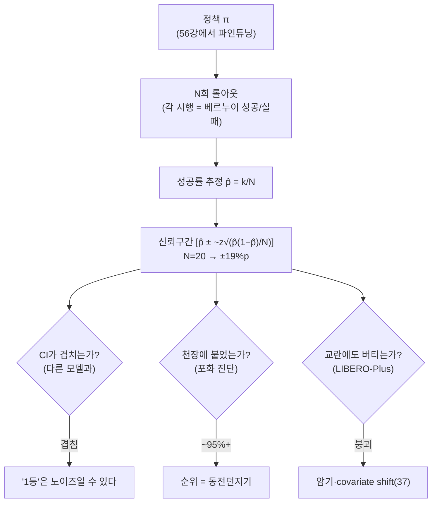
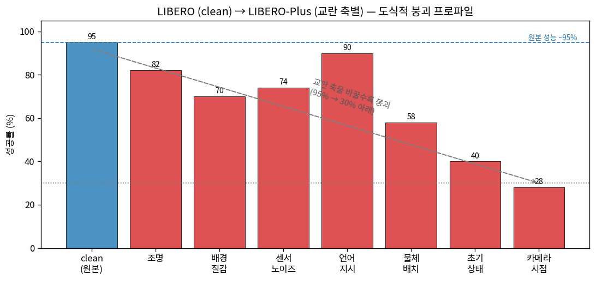
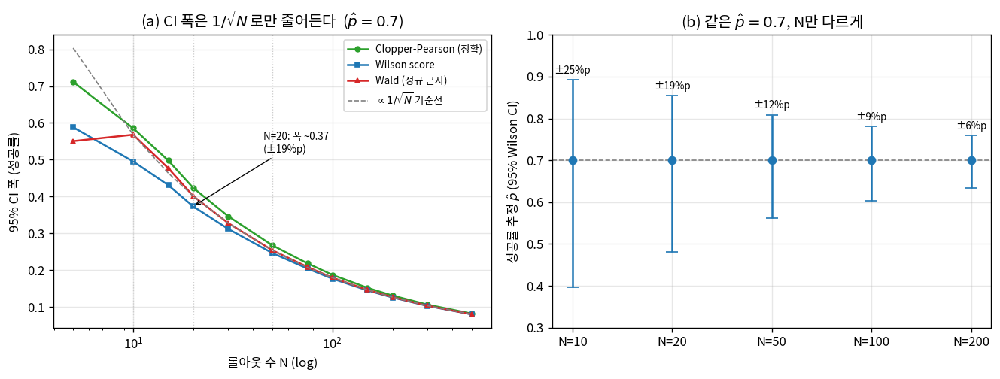
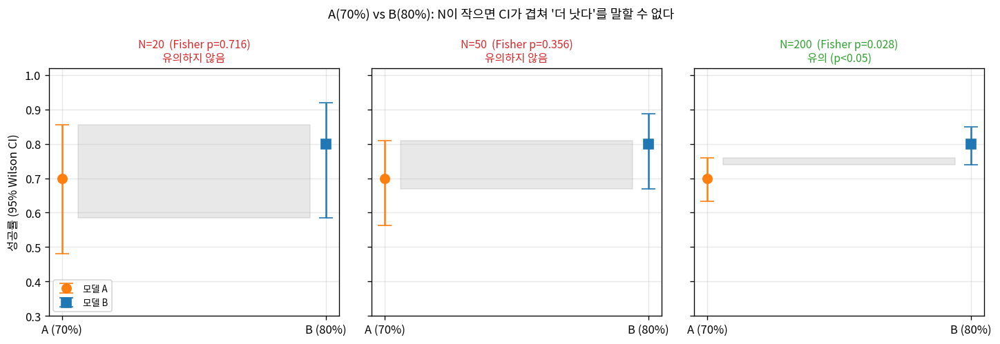
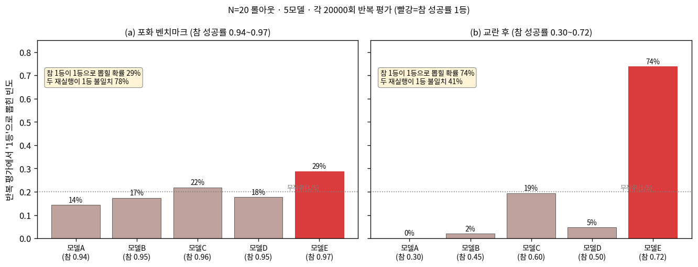

# Lec 57. 벤치마크와 평가의 함정

> Part 13 세 번째 강의. 선수 지식: 27강(과적합·분포이동·검증 누수), 37강(compounding error·covariate shift), 56강(LeRobot 파인튜닝 — 이 강의에서 평가할 정책을 만든다).
> 이 강의는 **정량 통계 리터러시** 강의다. "성공률 92%"라는 한 숫자를 믿을 수 있는지 없는지를, 이항분포와 신뢰구간으로 직접 계산한다.
> 정보 기준일: 2026-07-09. 벤치마크·논문 수치는 WebSearch로 1차 자료와 대조 확인했다(참고문헌).

## 한 장 요약



VLA 논문은 "성공률 92%"를 표에 적는다. 이 강의는 그 92% 옆에 **신뢰구간**을 붙이면 무슨 일이 벌어지는지를 다룬다 — N이 작으면(로봇 평가의 현실: N=10~20) 그 구간은 ±20%p로 벌어지고, "우리가 1등"이라는 주장의 절반은 통계적으로 증명되지 않는다.

## 학습 목표

1. 성공률 $\hat p = k/N$의 이항 신뢰구간(Wald·Wilson·Clopper-Pearson)을 손과 scipy로 계산하고, 폭이 $1/\sqrt{N}$로만 줄어든다는 것을 수치로 보일 수 있다.
2. 두 모델의 성공률 차이(예: 70% vs 80%, 각 N=20)가 **통계적으로 유의한지** 2-비율 검정(Fisher exact)으로 판정하고, "N=20에서는 대부분 유의하지 않다"를 재현할 수 있다.
3. 벤치마크 포화(LIBERO ~97%)가 왜 모델을 변별하지 못하는지를 **순위 노이즈**로 설명하고, 이것을 27강 과적합·37강 covariate shift와 연결할 수 있다.
4. LIBERO-Plus의 "교란 시 붕괴"(95%→30% 이하)를 분포이동의 실증으로 읽고, sim 평가(SimplerEnv)와 real 평가의 갭·상관을 논할 수 있다.
5. RoboArena·RoboChallenge·TRI LBM "careful evaluation"이 각각 어떤 평가 함정(작은 N·비공개 조건·centralized 편향)에 대한 처방인지 한 문장씩 말할 수 있다.

## 왜 이 강의가 필요한가

56강에서 회원님은 SmolVLA를 LIBERO에 파인튜닝했다. 이제 마지막 질문이 남는다 — **그게 잘 됐는지 어떻게 아는가?** 답은 "LIBERO에서 돌려 성공률을 잰다"이고, 여기서 함정이 시작된다.

로봇 평가는 계측이다(회원님의 홈그라운드). 그런데 이 계측은 세 가지 이유로 유난히 나쁘다. ① **시행이 비싸다** — 실물 롤아웃 하나에 수십 초~수 분, 사람 리셋이 필요해서 논문들은 태스크당 N=10~20에 그친다. ② **측정값이 이진**이다(성공/실패) — 연속량이 아니라 베르누이라, 같은 정책도 던질 때마다 다른 성공률이 나온다. ③ **그런데 논문은 CI 없이 점추정만 적는다** — "92.3%"처럼 소수점까지. 소수점 한 자리의 정밀도를 주장하지만, 실제 불확실성은 ±20%p다.

이것은 회원님이 계측기 반복성(repeatability)·불확실성 예산을 다룰 때 쓰던 바로 그 언어로 번역된다: **N이 작은 이진 측정의 표준불확도는 크다.** 이 강의는 그 불확도를 이항분포로 정량화하고(E1), 그것이 "SOTA 1등" 주장(E2)과 "sim이면 충분하다"는 믿음(E3)을 어떻게 무너뜨리는지 보인다. 64강 논문 읽기의 "평가" 축을 비판적으로 읽는 무기가 여기서 벼려진다.

## 본문

### 0. 지형도 — 오늘의 네 벤치마크와 하나의 통계

이 강의는 네 개의 실물 벤치마크를 축으로 돈다:

| 벤치마크 | 무엇 | 이 강의에서의 역할 |
|---|---|---|
| **LIBERO** (2023) | 시뮬 4개 태스크 스위트, 130 태스크 [1] | **포화**의 대표 — SOTA가 ~98%에 몰림 |
| **LIBERO-Plus** (2025.10) | LIBERO에 7축 교란 주입 [2] | **붕괴**의 대표 — 95%→30% 이하 |
| **SimplerEnv** (2024) | real-to-sim 평가(Google robot/WidowX) [3] | **sim-real 상관** 논쟁 |
| **RoboArena / RoboChallenge** (2025) | 분산·대규모 실기 평가 [4][5] | **프로토콜**의 처방 |

그리고 이 넷을 관통하는 하나의 통계가 **이항 성공률의 신뢰구간**이다. 먼저 그 통계부터 세운다.

### 1. 성공률은 점이 아니라 구간이다

정책을 태스크에서 $N$번 굴려 $k$번 성공했다면 성공률 추정은 $\hat p = k/N$이다. 하지만 이 $\hat p$는 참 성공률 $p$의 **표본**일 뿐이다. 같은 정책을 다시 $N$번 굴리면 다른 $k$가 나온다. 각 롤아웃이 성공확률 $p$의 독립 **베르누이** 시행이므로 $k \sim \mathrm{Binomial}(N, p)$이고, $\hat p$의 표준편차는 $\sqrt{p(1-p)/N}$이다. $N$이 작으면 이 표준편차가 크다 — 그게 전부다.

로봇 평가의 현실은 $N=10\sim20$이다(비용 때문). 이 영역에서 신뢰구간이 얼마나 넓은지가 이 강의의 심장이고, 아래 E1에서 세 방법(Wald·Wilson·Clopper-Pearson)으로 계산한다.

### 2. LIBERO — 포화라는 함정

LIBERO(Liu et al., 2023)는 lifelong 로봇 학습 벤치마크로, 네 개의 스위트(SPATIAL·OBJECT·GOAL 각 10태스크 + LIBERO-100)를 합쳐 130 태스크다 [1]. VLA 파인튜닝의 사실상 표준 시험대가 됐다.

문제는 **포화**다. 2024~2026 사이 LIBERO 평균 성공률은 ~75%에서 ~98%로 올랐고, long-horizon 스위트를 빼면 SOTA가 대부분 98%를 넘는다 [6]. ElasticFlow 98.5%, VITA-VLA 97.3%, Libra-VLA 97.2% — 상위 모델들이 소수점을 다투며 천장에 몰려 있다 [6].

이게 왜 함정인가? 27강의 언어로: **벤치마크가 포화하면 변별력을 잃는다.** 모든 모델이 ~97%면, "97.3% vs 97.0%"의 0.3%p 차이는 대부분 표본 노이즈다(N이 작으니까). 순위가 반복 실행마다 뒤바뀐다 — E2·WE-2에서 이걸 수치로 보인다. 더 나쁜 건, 높은 LIBERO 점수가 27강이 경고한 **암기·검증 누수**의 산물일 수 있다는 것이다: train/test가 거의 같은 분포(clean, 동일 카메라·조명)라 모델이 표면적 시각 단서를 외워도 점수가 나온다.

### 3. LIBERO-Plus — 교란을 주면 무너진다

LIBERO-Plus(Fei et al., 2025.10, Fudan/OpenMOSS)는 정확히 이 의심을 시험한다 [2]. LIBERO 태스크에 **7개 축의 교란**을 통제된 크기로 주입한다: ① 물체 배치, ② 카메라 시점, ③ 로봇 초기 상태, ④ 언어 지시, ⑤ 조명, ⑥ 배경 질감, ⑦ 센서 노이즈.

결과는 충격적이다. clean에서 ~95%를 내던 SOTA 모델들이 **modest한 교란만으로 30% 아래로 붕괴**한다 — 특히 카메라 시점·로봇 초기 상태에 극도로 민감하다 [2]. 그리고 두 개의 진단이 나온다: (a) 모델들이 **언어 지시를 사실상 무시**한다(언어를 바꿔도 행동이 안 바뀐다), (b) 의미 이해가 아니라 **위치 편향 같은 표면적 시각 단서**에 의존한다 [2].

37강의 covariate shift가 여기서 실물로 나타난다. 훈련 분포(clean LIBERO)와 평가 분포(교란)가 다르면, 개루프로 쌓이는 오차(compounding error)가 폭발한다. 포화된 clean 점수는 강건성을 **전혀** 증명하지 않았던 것이다. E2·WE-2에서 "포화된 순위는 노이즈, 교란을 주면 진짜 차이가 벌어진다"를 시뮬레이션한다.



*그림 1: LIBERO(clean, 파랑 ~95%)에서 LIBERO-Plus 교란 축(빨강)으로 갈 때의 도식적 붕괴 프로파일. 언어 지시 교란에는 비교적 둔감(90% — 모델이 언어를 애초에 별로 안 봄)하지만, 물체 배치·초기 상태·카메라 시점 같은 시각·기하 교란에는 급락해 카메라 시점에서 30% 아래로 무너진다. **이 프로파일은 LIBERO-Plus가 보고한 "95%→30% 이하, 카메라·초기상태에 극도로 민감, 언어 둔감"의 경향을 도식화한 것**이며(정확한 per-factor 수치는 논문·모델별로 다르다), 축별 절대값이 아니라 "clean 점수는 강건성을 보증하지 않는다"는 구조를 보이는 그림이다. [2]*

### 4. SimplerEnv — sim으로 평가해도 되는가

실기 평가는 비싸고 재현이 어렵다. 그래서 **SimplerEnv**(Li et al., CoRL 2024)는 real-to-sim 평가를 제안한다: 실제 로봇 씬을 시뮬레이터에서 재현해(Google robot, WidowX+Bridge) 정책을 sim에서 평가하고, 그 결과가 real과 상관하는지를 본다 [3]. 두 방식 — 실제 이미지를 sim 배경에 겹치는 **Visual Matching**, 배경·조명·distractor를 변주하는 **Variant Aggregation** — 을 쓴다. 논문은 SimplerEnv 성적과 real 성적 사이에 **강한 상관**을 보고한다(그리고 분포이동에 대한 민감도 같은 행동 양식도 보존된다) [3].

하지만 sim 평가는 두 함정이 있다. ① **sim-real 갭**(51·52강): 접촉·마찰·렌더링이 완벽히 재현되지 않으므로 상관은 강해도 1이 아니다 — sim에서 이긴 모델이 real에서 진다면 그건 sim이 놓친 물리다. ② **sim의 재현성이 "너무 좋다"**: 시드·초기조건을 고정하면 sim은 완벽히 결정론적이라, N을 키우기 쉽지만 그 N이 측정하는 것은 여전히 **하나의 분포**(sim)일 뿐이다. sim CI가 아무리 좁아도 sim≠real이라는 계통오차(bias)는 CI가 잡지 못한다. 이것은 계측의 언어로 **정밀도(precision, 반복성)와 정확도(accuracy, 참값과의 거리)의 구분**이다 — sim은 정밀할 수 있으나 정확도(real 대비)는 별개다.

### 5. RoboArena·RoboChallenge·TRI LBM — 프로토콜의 처방

작은 N·비공개 조건·centralized 편향이라는 함정에 2025년의 세 작업이 각각 처방을 낸다:

- **RoboArena** (Atreya et al., CoRL 2025) [4]: 고정 태스크로 표준화하는 대신, **분산 크라우드소싱** 평가. 7개 기관이 DROID 로봇으로, 평가자가 자유롭게 태스크·환경을 고르되 **이중맹검 쌍대 비교**(pair of policies)를 수행한다. 600+ 쌍대 에피소드로 7개 generalist 정책을 랭킹 — centralized 챌린지보다 더 정확하고 확장 가능하다고 주장한다. 핵심 통찰: 절대 성공률 대신 **상대 선호(pairwise)**를 쓰면 태스크·환경 다양성을 확장하면서 랭킹의 신뢰도를 높일 수 있다.
- **RoboChallenge (Table30)** (2025.10, Dexmal) [5]: 실기 평가를 **표준화·대규모화**. UR5·Franka·ARX5·ALOHA 4개 embodiment에 30 태스크, specialist/generalist 두 트랙. "digital twin이 재현 못 하는 요인이 real엔 늘 있다"며 **실기 평가를 의무화**한다. 초기 리포트에서 π 계열 모델들이 45%·37% 같은 성적을 낸다(태스크를 일부러 어렵게 설계).
- **TRI "A Careful Examination of LBMs"** (2025.7, Science Robotics) [7]: 이 강의의 방법론적 북극성. 통계적으로 엄밀한 평가 파이프라인을 세운다 — 실물 **태스크·정책·조건당 50 롤아웃**(sim은 200), 총 **1,800 실물 롤아웃 + 47,000 sim 롤아웃**, 이중맹검·무작위화, Bonferroni 보정. 그리고 결정적 통찰: **"실험 노이즈가 측정하려는 효과를 압도할 수 있다(noise dwarfs effect)"** — 그래서 표준적이지 않은 큰 표본이 필요하고, 태스크를 성공률 ~50% 근처로 어렵게 설계해 상대 비교의 정보량을 최대화한다 [7]. (TRI는 CI가 정책 비교에서 오도할 수 있다며 violin plot·베이지안 사후분포를 선호하지만, 요지는 같다: **작은 N으로는 아무것도 못 말한다.**)

**한 줄 요약**: 세 작업 모두 "N을 키우거나(TRI), 쌍대 비교로 바꾸거나(RoboArena), 실기를 표준화(RoboChallenge)"하는 서로 다른 길로, **작은 N·clean sim의 점추정을 믿지 말라**는 같은 결론에 도달한다.

### 핵심 수식

세 수식은 "성공률 숫자를 언제 믿을 수 있는가"의 뼈대다: **E1** 이항 신뢰구간(한 모델의 불확실성), **E2** 두 모델 차이의 유의성과 포화(랭킹의 불확실성), **E3** sim-real 상관과 재현성(어느 분포를 측정하는가). 셋 다 CPU numpy/scipy로 재현되며 Worked Example에서 수치로 확인한다.

#### E1. 성공률의 신뢰구간 — 이진 측정의 불확도 예산

**① 직관**: $N$번 굴려 $k$번 성공 → $\hat p = k/N$. 하지만 이건 참값 $p$의 한 표본이다. $N$이 작을수록 이 표본은 참값에서 크게 벗어날 수 있다. "$\hat p = 0.7$"이라는 한 숫자 대신 "$p$는 이 구간 안에 있다(95% 확신)"라는 **구간**을 말해야 한다. $N=20$이면 그 구간은 놀랄 만큼 넓다 — ±19%p 수준.

**② 물리·기하적 의미**: 각 롤아웃은 성공확률 $p$의 **베르누이** 시행이고 성공 횟수 $k \sim \mathrm{Binomial}(N,p)$. 이것은 회원님의 계측 언어로 **이진 측정의 반복성**이다: 연속량(길이·전압)의 표준불확도가 $\sigma/\sqrt{N}$이듯, 비율의 표준불확도는 $\sqrt{p(1-p)/N}$이다. 결정적 성질은 **$1/\sqrt{N}$ 스케일링** — 구간 폭을 절반으로 줄이려면 $N$을 **4배**로 키워야 한다. 실물 롤아웃 하나가 분 단위인 로봇 평가에서 이건 잔인한 환율이다. 그리고 이 불확도는 계통오차(sim-real 갭 같은 bias)를 **포함하지 않는다** — CI는 정밀도(반복성)만 재고, 정확도(참값과의 거리)는 별도 문제다(E3).

**③ 형식**: 가장 단순한 **Wald(정규 근사)** 구간은

$$
\hat p \pm z_{\alpha/2}\sqrt{\frac{\hat p(1-\hat p)}{N}}, \qquad z_{0.025}=1.96
$$

이지만, $N$이 작거나 $\hat p$가 0/1에 가까우면 나쁘다(구간이 [0,1]을 벗어나고, $\hat p=1$이면 폭이 0이 되는 치명적 버그). 실무 표준은 두 개다. **Wilson score 구간**(1927)은 $\hat p$를 사전확률로 약간 당겨 안정화한다:

$$
\frac{\hat p + \frac{z^2}{2N} \pm z\sqrt{\dfrac{\hat p(1-\hat p)}{N} + \dfrac{z^2}{4N^2}}}{1 + \frac{z^2}{N}}
$$

**Clopper-Pearson(정확 구간)**은 이항 분포를 직접 역산해 커버리지를 보증한다(베타분포로 표현):

$$
p_{\text{lo}} = B^{-1}\!\Big(\tfrac{\alpha}{2};\, k,\, N-k+1\Big), \quad
p_{\text{hi}} = B^{-1}\!\Big(1-\tfrac{\alpha}{2};\, k+1,\, N-k\Big)
$$

Clopper-Pearson이 가장 보수적(넓음), Wilson이 균형, Wald가 가장 낙관적(작은 $N$에서 부정확). 세 방법 모두 폭이 $1/\sqrt{N}$로 줄어드는 것은 같다 — WE-1에서 확인한다.

#### E2. 벤치마크 포화 & 두 모델 차이의 유의성 (27·37강 회수)

**① 직관**: "모델 B(80%)가 모델 A(70%)보다 낫다"는 주장은, 각 N=20이면 **통계적으로 증명되지 않는다**. 두 모델의 CI가 겹치기 때문이다. 더 나아가 여러 모델이 천장(~95%)에 몰리면(포화), 관측 순위는 거의 **동전던지기**가 된다 — 반복 실행마다 1등이 바뀐다.

**② 물리·기하적 의미**: 두 비율 $\hat p_A, \hat p_B$의 차이 $\hat p_B - \hat p_A$도 표본량이다. 그 표준오차는 $\sqrt{\hat p_A(1-\hat p_A)/N_A + \hat p_B(1-\hat p_B)/N_B}$. 차이가 이 표준오차의 ~2배를 넘어야 유의하다. $N=20$, 차이 10%p면 표준오차가 ~14%p라 차이가 파묻힌다. **포화**는 이것의 극단이다: 모든 $p_i \approx 0.95$면 모델 간 참 차이가 애초에 작고($<3\%$p), 그 위에 $N=20$의 노이즈(±10%p)가 얹히니 신호 대 잡음이 1 미만 — 순위가 무의미해진다. 이것이 27강 과적합의 평가판(clean 벤치마크에 다 같이 과적합)이고, 37강 covariate shift가 교란 벤치마크에서 이 균질성을 깨뜨려 진짜 차이를 드러내는 이유다.

**③ 형식**: 두 비율의 차이가 유의한지는 여러 검정이 있다. 작은 $N$에서 정확한 것은 **Fisher exact test**(초기하분포로 2×2 분할표의 극단성을 정확 계산). 근사로는 **pooled 2-비율 z-검정**:

$$
z = \frac{\hat p_B - \hat p_A}{\sqrt{\hat p_{\text{pool}}(1-\hat p_{\text{pool}})\left(\frac{1}{N_A}+\frac{1}{N_B}\right)}}, \quad
\hat p_{\text{pool}} = \frac{k_A + k_B}{N_A + N_B}
$$

$|z| > 1.96$이면 $p<0.05$. WE-1에서 70% vs 80%(각 N=20)이 **유의하지 않음**(Fisher $p=0.72$)을 보이고, 80% 검정력으로 이 차이를 잡으려면 그룹당 **~293** 롤아웃이 필요함을 계산한다(90% 검정력이면 ~392).

#### E3. sim vs real 평가 & 재현성 — 정밀도와 정확도의 분리

**① 직관**: sim 평가(SimplerEnv)는 재현성이 완벽하다(시드 고정 → 결정론). 그래서 N을 키워 CI를 좁히기 쉽다. 하지만 CI가 아무리 좁아도, sim이 real과 다르면(sim-real 갭) 그 좁은 구간은 **틀린 값을 정밀하게 가리킬** 뿐이다. sim 성적과 real 성적의 상관계수 $\rho$가 얼마나 높은지가 sim 평가를 믿을 근거다.

**② 물리·기하적 의미**: 두 종류의 오차를 구분한다. **랜덤 오차**(반복성) = CI 폭 = $1/\sqrt{N}$로 줄일 수 있다. **계통 오차**(bias) = sim-real 갭 = N을 아무리 키워도 안 줄어든다. sim 평가는 첫째를 쉽게 줄이지만 둘째를 못 줄인다. SimplerEnv의 기여는 이 계통 오차가 **작다**(상관이 강하다)는 실증이지, 0이라는 게 아니다. 계측 비유: sim은 정밀한 계측기(반복하면 같은 값)지만, 캘리브레이션(real 대비)이 안 됐을 수 있다. 60강 시스템 식별이 이 캘리브레이션의 고전판이다.

**③ 형식**: $M$개 모델의 sim 성공률 $s_i$와 real 성공률 $r_i$의 (피어슨) 상관

$$
\rho = \frac{\sum_i (s_i - \bar s)(r_i - \bar r)}{\sqrt{\sum_i (s_i-\bar s)^2}\sqrt{\sum_i (r_i-\bar r)^2}}
$$

가 1에 가까우면 "sim 랭킹 ≈ real 랭킹". 다만 각 $s_i, r_i$ 자체가 CI를 가진 추정이므로($r_i$는 특히 작은 N), **$\rho$ 자체에도 불확실성**이 있다 — $M$이 작으면(모델 몇 개) $\rho$의 CI가 넓어, "상관이 강하다"조차 조심스럽게 말해야 한다. 재현성은 같은 정책을 같은 조건에서 반복한 성공률의 분산으로 잰다: sim은 시드 고정 시 분산 0(완전 재현), real은 초기조건·마모·조명 변동으로 분산이 크다.

### Worked Example

두 예제 모두 순수 numpy/scipy(CPU, 시드 고정)다. 본문·그림이 인용하는 수치는 모두 `images/lec57/gen_figs.py` 실행 출력과 일치한다.

#### WE-1 (코드, scipy.stats): 이항 CI 폭과 2-비율 검정 — "N=20이면 대부분 유의하지 않다"

두 가지를 계산한다. ① $\hat p = 0.7$을 고정하고 $N$을 키우며 Wilson·Clopper-Pearson·Wald 구간 폭을 잰다. ② 모델 A(14/20=70%)와 B(16/20=80%)의 차이가 유의한지 Fisher exact로 검정한다.

**손계산 관점**. $\hat p = 0.7$, $N=20$의 Wald 반폭은 $1.96\sqrt{0.7 \cdot 0.3 / 20} = 1.96 \times 0.1025 = 0.201$ — 즉 ±20%p, 전체 폭 ~0.40. $N$을 100으로 키우면 반폭은 $1.96\sqrt{0.21/100}=0.090$ — 폭이 4배 큰 $N$에 딱 절반($\sqrt 4 = 2$배)으로 줄었다($1/\sqrt N$). A와 B의 차이 10%p는, 두 CI가 크게 겹치므로 유의하지 않으리라 예상된다.

```python
import numpy as np
from scipy import stats

def wilson(k, n, z=1.96):
    p = k/n; d = 1 + z**2/n
    c = (p + z**2/(2*n))/d
    h = z*np.sqrt(p*(1-p)/n + z**2/(4*n**2))/d
    return c-h, c+h

def clopper_pearson(k, n, a=0.05):
    lo = stats.beta.ppf(a/2, k, n-k+1) if k > 0 else 0.0
    hi = stats.beta.ppf(1-a/2, k+1, n-k) if k < n else 1.0
    return lo, hi

def wald(k, n, z=1.96):
    p = k/n; h = z*np.sqrt(p*(1-p)/n)
    return p-h, p+h

# ① phat=0.7 고정, N을 키우며 CI 폭
print("N     Wilson  CP     Wald")
for N in (10, 20, 50, 100):
    k = round(0.7*N)
    w = lambda f: f(k, N)[1] - f(k, N)[0]
    print(f"{N:4d}  {w(wilson):.3f}  {w(clopper_pearson):.3f}  {w(wald):.3f}")
# 10   0.495  0.586  0.568
# 20   0.374  0.424  0.402
# 50   0.246  0.267  0.254
# 100  0.177  0.187  0.180

# ② 모델 A 70% (14/20) vs B 80% (16/20): 차이가 유의한가?
kA, nA, kB, nB = 14, 20, 16, 20
print("A Wilson:", tuple(round(v,3) for v in wilson(kA, nA)))   # (0.481, 0.855)
print("B Wilson:", tuple(round(v,3) for v in wilson(kB, nB)))   # (0.584, 0.919)
_, p_fisher = stats.fisher_exact([[kB, nB-kB], [kA, nA-kA]])
print(f"Fisher exact p = {p_fisher:.4f}")                        # 0.7164  → 유의하지 않음

# N을 키우면? 같은 70% vs 80% 를 N=50, 200 에서
for N in (50, 200):
    kA, kB = round(0.7*N), round(0.8*N)
    _, p = stats.fisher_exact([[kB, N-kB], [kA, N-kA]])
    print(f"N={N}: Fisher p = {p:.4f}")  # N=50: 0.3558, N=200: 0.0279
```

출력이 손계산과 일치한다. **핵심 결론들**:
- $N=20$에서 $\hat p=0.7$의 Wilson 구간 폭은 **0.374** (±19%p), Clopper-Pearson은 **0.424**. 논문이 "70%"라고 적을 때 실제 의미는 "48~86% 어딘가"(Wilson)다.
- 폭은 $N$: 10→100에서 0.495→0.177로 줄지만 그 대가는 롤아웃 **10배**. $1/\sqrt N$의 잔인한 환율.
- **70% vs 80%, 각 N=20은 유의하지 않다**(Fisher $p=0.72$). 두 Wilson 구간 [0.481, 0.855]와 [0.584, 0.919]가 크게 겹친다. $N=50$에서도 아직 아니고($p=0.36$), $N=200$에서야 유의해진다($p=0.028$).
- 이 10%p 차이를 80% 검정력으로 잡으려면 그룹당 **~293** 롤아웃이 필요하다(코드 미포함, 근사 공식 $n \approx (z_{\alpha/2}\sqrt{2\bar p\bar q}+z_\beta\sqrt{p_1q_1+p_2q_2})^2/(p_2-p_1)^2$, $z_{\alpha/2}=1.96$·$z_\beta=z_{0.80}=0.842$ → $292.8$; 90% 검정력이면 $z_\beta=1.282$ → $391.9\approx392$). 로봇 논문의 N=10~20과 두 자릿수 배 차이다.



*그림 2: (a) $\hat p=0.7$ 고정 시 세 CI 방법의 폭 vs $N$(로그축). Clopper-Pearson(초록)이 가장 넓고 Wald(빨강)가 가장 좁으며, 셋 다 회색 점선 $\propto 1/\sqrt N$을 따른다. N=20에서 폭 ~0.37(±19%p). (b) 같은 $\hat p=0.7$을 N=10/20/50/100/200에서 Wilson CI 에러바로 — N=10이면 ±25%p, N=200에도 ±6%p. "70%"라는 한 숫자가 N에 따라 얼마나 다른 불확실성을 갖는지. scipy.stats로 계산, 재현: `gen_figs.py`. [Wilson 1927 · Clopper-Pearson 1934]*



*그림 3: 모델 A(70%) vs B(80%)를 N=20/50/200에서. 회색 음영이 두 95% Wilson CI의 겹침 영역. N=20에서는 CI가 크게 겹치고 Fisher $p=0.716$(유의하지 않음, 제목 빨강), N=50도 $p=0.356$, N=200에서야 겹침이 얇아지며 $p=0.028$(유의, 제목 초록). **"B가 A보다 낫다"는 주장은 N을 200까지 키워야 통계적으로 성립한다** — 로봇 논문의 N=20으로는 말할 수 없다. [Fisher exact test]*

#### WE-2 (numpy): 포화 벤치마크의 순위 노이즈 — "1등은 동전던지기"

다섯 모델의 **참** 성공률을 두 시나리오로 놓고, 각각 N=20 평가를 20000번 반복해 "관측 1등"이 누가 되는지 센다. 시나리오 (a) 포화: 참값이 0.94~0.97로 천장에 몰림. (b) 교란(LIBERO-Plus식): 참값이 0.30~0.72로 벌어짐.

**손계산 관점**. 포화 시나리오에서 참 1등은 모델 E(0.97)지만 2등 C(0.96)와 차이가 1%p뿐. N=20이면 이 1%p는 성공 횟수로 0.2회 — 노이즈(±2회)에 완전히 묻힌다. 그래서 관측 1등은 거의 무작위(5모델이면 각 20%)에 가까울 것이라 예상된다.

```python
import numpy as np
from scipy import stats
rng = np.random.default_rng(42)
names = list("ABCDE")
N, reps = 20, 20000

def experiment(true_p):
    top1 = np.zeros(len(true_p)); correct = 0
    true_best = int(np.argmax(true_p))
    for _ in range(reps):
        obs = rng.binomial(N, true_p) / N          # 각 모델 N=20 평가
        m = obs.max()
        w = rng.choice(np.where(obs == m)[0])       # 동점은 무작위 tie-break
        top1[w] += 1
        correct += (w == true_best)
    return top1/reps, correct/reps

def two_runs_disagree(true_p):                       # 두 독립 평가가 1등 불일치?
    d = 0
    for _ in range(reps):
        o1 = rng.binomial(N, true_p)/N; o2 = rng.binomial(N, true_p)/N
        w1 = rng.choice(np.where(o1 == o1.max())[0])
        w2 = rng.choice(np.where(o2 == o2.max())[0])
        d += (w1 != w2)
    return d/reps

sat = np.array([0.94, 0.95, 0.96, 0.95, 0.97])       # 포화
spr = np.array([0.30, 0.45, 0.60, 0.50, 0.72])       # 교란 후

t_sat, c_sat = experiment(sat)
t_spr, c_spr = experiment(spr)
print("포화 top-1 빈도:", dict(zip(names, np.round(t_sat, 3))))
print(f"  참1등 E(0.97) 1등확률 {c_sat*100:.1f}%, 두 재실행 불일치 {two_runs_disagree(sat)*100:.1f}%")
print("교란 top-1 빈도:", dict(zip(names, np.round(t_spr, 3))))
print(f"  참1등 E(0.72) 1등확률 {c_spr*100:.1f}%, 두 재실행 불일치 {two_runs_disagree(spr)*100:.1f}%")
# 포화 top-1: {'A':0.143,'B':0.173,'C':0.219,'D':0.177,'E':0.288}
#   참1등 E(0.97) 1등확률 28.8%, 두 재실행 불일치 78.5%
# 교란 top-1: {'A':0.001,'B':0.020,'C':0.194,'D':0.047,'E':0.738}
#   참1등 E(0.72) 1등확률 73.8%, 두 재실행 불일치 41.4%
```

출력의 대비가 이 강의의 결론이다:
- **포화 벤치마크(참 0.94~0.97)**: 참 1등 E가 관측 1등으로 뽑힐 확률은 **28.8%**(무작위 20%보다 겨우 나음). 두 번 독립 평가하면 1등이 **78.5%** 확률로 바뀐다 — 순위가 사실상 노이즈다. "우리가 LIBERO 1등"은 대부분 이 노이즈의 산물.
- **교란 후(참 0.30~0.72)**: 참 1등 E가 1등으로 뽑힐 확률이 **73.8%**로 뛰고, 두 재실행 불일치는 **41.4%**로 떨어진다. 참 차이가 벌어지니(신호↑) 같은 N=20이라도 랭킹이 의미를 회복한다.
- **교훈**: 벤치마크가 변별하려면 태스크가 충분히 어려워 성공률이 흩어져야 한다 — 이것이 TRI가 "태스크를 성공률 ~50% 근처로 설계"하는 이유이고 [7], LIBERO-Plus가 교란으로 하는 일이다.



*그림 4: N=20 · 5모델 · 각 20000회 반복 평가. 막대 = 각 모델이 "관측 1등"으로 뽑힌 빈도, 빨강 = 참 성공률 1등. (a) 포화(참 0.94~0.97): 참 1등 E가 1등으로 뽑힐 확률 29%(무작위 20% 점선 바로 위), 두 재실행이 1등을 두고 불일치할 확률 78%. (b) 교란 후(참 0.30~0.72): 참 1등 E가 74%로 명확히 지배, 불일치 41%. **포화는 랭킹을 동전던지기로 만들고, 교란(어려운 태스크)은 신호를 되살린다.** numpy 이항 시뮬, 재현: `gen_figs.py`. [2][7]*

### 로봇공학자를 위한 번역

이 강의 전체는 회원님이 이미 아는 **계측 불확실성**의 로봇 학습판이다. 대응은 정확하다:

1. **성공률 CI = 이진 측정의 반복성/표준불확도.** 연속량 측정에서 $N$번 반복해 $\sigma/\sqrt N$로 불확도를 줄이듯, 이진 측정(성공/실패)의 불확도는 $\sqrt{p(1-p)/N}$이다. "몇 번 재야 유효숫자 한 자리를 믿는가"라는 계측 감각이 그대로 "몇 번 롤아웃해야 성공률을 믿는가"가 된다 — 답은 대개 회원님 생각보다 훨씬 크다(N=20은 ±19%p).

2. **포화 벤치마크 = 분해능 밖의 측정.** 두 부품의 치수 차이가 계측기 분해능보다 작으면 "어느 게 더 큰가"를 못 말하듯, 두 모델의 참 성공률 차이가 $\sqrt{p(1-p)/N}$보다 작으면 랭킹은 무의미하다. 벤치마크 포화는 "측정 대상이 분해능 아래로 몰린" 상태다.

3. **sim-real 갭 = 정밀도 vs 정확도(캘리브레이션).** sim은 정밀한(반복성 높은) 계측기지만 real 대비 캘리브레이션이 안 됐을 수 있다. CI(정밀도)를 좁혀도 bias(정확도)는 안 줄어든다 — 60강 시스템 식별이 이 캘리브레이션의 고전판이고, SimplerEnv의 상관 실증은 "이 계측기의 bias가 작다"는 캘리브레이션 리포트다.

4. **compounding error(37강) = 개루프 계측의 드리프트 누적.** 교란 하 붕괴는 covariate shift가 개루프 롤아웃에서 오차를 지수적으로 키운 것 — 제어에서 관측 없이 적분하면 드리프트가 쌓이는 것과 같은 구조다.

VLA 평가는 새로운 통계가 아니다. **이진·소표본·분포이동이라는 세 악조건이 겹친 계측**일 뿐이고, 회원님의 불확실성 예산 감각이 그대로 무기가 된다.

## 흔한 오해

1. **"성공률 숫자를 그대로 믿는다"** — "92.3%"의 소수점은 정밀도의 착시다. N이 작으면(로봇의 현실 N=10~20) CI가 ±20%p로 벌어진다(E1, WE-1: N=20·$\hat p=0.7$ → Wilson 폭 0.374). 논문의 성공률을 볼 때 **첫 질문은 항상 "N이 몇이고 CI가 얼마인가"**여야 한다. CI가 없으면 N으로 직접 계산하라 — Wilson 한 줄이면 된다. 소수점 두 자리 정밀도를 주장하는 N=20 성공률은 통계적으로 자기모순이다.

2. **"SOTA 1등이 실제 최고다"** — 포화 벤치마크에서 1등은 대부분 노이즈다(E2, WE-2: 포화 시 참 1등이 1등으로 뽑힐 확률 28.8%, 두 재실행 불일치 78.5%). "97.3% vs 97.0%"의 0.3%p는 N=20에서 성공 0.06회 차이 — 측정 불가능하다. 두 모델의 CI가 겹치면 "더 낫다"를 말할 수 없다(WE-1: 70% vs 80%, N=20 → Fisher $p=0.72$, 유의하지 않음). 리더보드 순위는 참 실력 순위가 아니라 **참 실력 + 이번 시행의 운**의 순위다.

3. **"sim 평가면 충분하다"** — sim은 재현성(정밀도)은 완벽하지만 sim-real 갭(정확도/bias)은 N을 아무리 키워도 안 줄어든다(E3). SimplerEnv의 강한 상관은 "bias가 작다"는 실증이지 "0이다"가 아니다 — 접촉·마찰·렌더링이 놓친 물리에서 sim 1등이 real 꼴등일 수 있다(51·52강). sim CI가 좁다고 real을 안 재도 된다는 뜻이 아니다. **좁은 CI는 틀린 값을 정밀하게 가리킬 수 있다.**

4. **"벤치마크 점수 높으면 강건하다"** — clean LIBERO 97%는 강건성을 전혀 증명하지 않는다. LIBERO-Plus는 같은 SOTA 모델들이 카메라 시점·초기 상태 교란만으로 30% 아래로 붕괴함을, 그리고 모델들이 **언어를 무시하고 위치 편향에 의존**함을 보였다(E2, 3절, [2]). 높은 clean 점수는 27강 암기·검증 누수의 산물일 수 있다 — train/test 분포가 거의 같으니까. 강건성은 clean 점수가 아니라 **분포이동 하 성능**으로만 측정된다(37강).

5. **"N=10이면 대충 충분하다"** — N=10은 최악이다. $\hat p=0.7$·N=10의 Wilson CI 폭은 **0.495**(±25%p), Clopper-Pearson은 **0.586**(사실상 "40~93% 어딘가")이다(WE-1). N=10 성공률로는 "50%인가 90%인가"조차 확실히 못 가른다. 태스크당 최소 두 자릿수 후반~수백 롤아웃이 필요하다는 것이 TRI가 태스크·조건당 50 롤아웃을 쓴 이유다(4·5절, [7]).

## 실습 (1.5~2h, LeRobot 사용)

56강에서 LIBERO에 파인튜닝한 정책(또는 공개 체크포인트)을 평가하되, **CI까지 붙여** 평가한다. GPU 없어도 Part 1(통계)은 CPU로 완결된다.

**Part 1 — 통계 도구 (CPU, 30분).** 위 WE-1·WE-2 코드를 그대로 실행하고, 다음을 바꿔 본다:
1. 회원님이 56강에서 얻은 실제 성공률(예: LIBERO-Spatial 10태스크 × N=20 = 200 롤아웃, 스위트 평균 $\hat p$)에 Wilson·Clopper-Pearson CI를 붙여라. 스위트 평균의 N은 몇인가? 태스크당 CI와 스위트 평균 CI는 어떻게 다른가?
2. 두 체크포인트(예: SmolVLA vs 다른 것)의 스위트 평균 차이에 Fisher exact를 돌려라. 유의한가? 유의하려면 N이 몇이어야 하는가?
3. WE-2의 참 성공률 벡터를 회원님 태스크들의 관측 성공률로 바꿔 순위 안정성을 재라. 회원님 벤치마크는 "포화"인가 "변별력 있음"인가?

**Part 2 — 실기 평가 (GPU, 60분, 선택).** LeRobot로 LIBERO 평가 루프를 돌린다:
1. `lerobot`의 LIBERO eval 스크립트로 파인튜닝 정책을 한 스위트에서 평가(태스크당 N=20 롤아웃). **시드를 바꿔 두 번** 돌려라.
2. 두 실행의 태스크별 성공률을 비교 — 얼마나 흔들리는가? WE-1의 CI 폭과 비교하라.
3. (여유 시) 초기 상태나 카메라를 살짝 교란해(LIBERO-Plus의 축소판) clean 대비 성능 하락 $\Delta$를 측정. 회원님 정책은 무엇에 민감한가?

**보고**: "내 정책의 성공률은 $\hat p \pm$ CI이고, N이 __라 __%p 불확실하다. 시드 간 흔들림은 __로 CI와 일치/불일치한다." 이 한 문장을 쓸 수 있으면 이 강의는 성공이다.

## Claude와 토론할 질문

1. 회원님 논문/실험의 성공률에 CI를 붙여 보라. N=20이면 폭이 얼마인가? 소수점 한 자리를 주장할 자격이 있는가?
2. Wald·Wilson·Clopper-Pearson 중 로봇 평가에 뭘 써야 하나? $\hat p=1.0$(전부 성공)일 때 각 방법은 뭐라고 답하는가? (힌트: Wald는 폭 0이라는 거짓말을 한다.)
3. "우리 모델이 LIBERO에서 97.3%로 SOTA"라는 문장을 비판적으로 해부하라. 어떤 정보가 빠졌고, 그것 없이 뭘 못 믿는가?
4. 포화 벤치마크(모두 ~97%)와 변별력 있는 벤치마크(0.3~0.7 분포)의 차이를 신호 대 잡음으로 설명하라. TRI가 왜 태스크를 "성공률 ~50%"로 설계하는가? [7]
5. sim 평가(SimplerEnv)의 CI를 아무리 좁혀도 real을 대체 못 하는 이유는? 정밀도와 정확도(캘리브레이션)의 구분으로 답하라. 60강 시스템 식별과 연결하면?
6. RoboArena의 쌍대 비교(pairwise)가 절대 성공률 측정보다 나은 점은? 왜 "이중맹검"이 필수인가? (힌트: 평가자 편향 = 계측의 관찰자 효과.) [4]
7. LIBERO-Plus에서 모델이 "언어를 무시한다"는 발견은, VLA의 "L"(language)에 대해 무엇을 시사하는가? 이건 데이터 문제인가 아키텍처 문제인가 평가 문제인가? [2]

## 읽을거리

1. **TRI, "A Careful Examination of LBMs" (arXiv:2507.05331)** — §평가 방법론만(~30분): 왜 N=50이 필요한지, noise가 effect를 압도한다는 논증, blind A/B. 이 강의의 방법론적 원전.
2. **LIBERO-Plus (arXiv:2510.13626)** — Abstract + 교란 축별 결과 표(~20분): 95%→30% 붕괴와 "언어 무시" 진단을 원문으로.
3. (선택) **RoboArena (arXiv:2506.18123)** — §3(분산 프로토콜)만: 쌍대 비교·크라우드소싱 설계. "왜 centralized가 안 되는가"의 논거.

## 자가 점검

1. $\hat p = k/N$의 이항 CI를 Wilson과 Clopper-Pearson으로 손과 scipy로 계산할 수 있는가? N=20·$\hat p=0.7$의 폭이 ~0.37(±19%p)임을, 폭이 $1/\sqrt N$로 준다는 것을 말할 수 있는가? (WE-1)
2. 왜 Wald 구간이 작은 N·극단 $\hat p$에서 나쁜지($\hat p=1$이면 폭 0), Wilson/Clopper-Pearson이 어떻게 고치는지 설명할 수 있는가?
3. 두 모델 70% vs 80%(각 N=20)의 차이가 유의한지 Fisher exact로 판정하고, "유의하지 않다($p=0.72$)"와 "유의하려면 N~200"을 말할 수 있는가? (WE-1)
4. 벤치마크 포화가 왜 순위를 노이즈로 만드는지 신호 대 잡음으로 설명하고, WE-2의 "참 1등이 1등으로 뽑힐 확률 28.8%·두 재실행 불일치 78.5%"를 재현·해석할 수 있는가?
5. LIBERO-Plus의 "95%→30% 붕괴"를 37강 covariate shift·compounding error로, "clean 점수가 강건성을 증명 못 함"을 27강 과적합·검증 누수로 설명할 수 있는가?
6. sim 평가(SimplerEnv)가 재현성은 완벽하지만 real을 대체 못 하는 이유를, 랜덤 오차(CI, $1/\sqrt N$)와 계통 오차(bias, sim-real 갭)의 구분으로 말할 수 있는가?
7. RoboArena(쌍대·분산)·RoboChallenge(실기 표준화)·TRI LBM(큰 N·blind)이 각각 어떤 평가 함정에 대한 처방인지 한 문장씩 말할 수 있는가?

## 참고문헌

> 본문 수치·주장의 출처. 2024~2026 항목은 2026-07-09에 WebSearch로 arXiv ID·수치를 대조 확인했다. 통계 방법(Wilson·Clopper-Pearson·Fisher)은 고전 결과이며 scipy.stats로 계산했다.

[1] B. Liu et al., "LIBERO: Benchmarking Knowledge Transfer for Lifelong Robot Learning," arXiv:2306.03310, 2023.6. https://arxiv.org/abs/2306.03310
— **뒷받침**: 4개 태스크 스위트(SPATIAL·OBJECT·GOAL 각 10 + LIBERO-100), 총 130 태스크, lifelong 로봇 학습 벤치마크. VLA 파인튜닝의 표준 시험대.

[2] S. Fei et al. (Fudan/OpenMOSS), "LIBERO-Plus: In-depth Robustness Analysis of Vision-Language-Action Models," arXiv:2510.13626, 2025.10. https://arxiv.org/abs/2510.13626
— **뒷받침**: 7개 교란 축(물체 배치·카메라 시점·로봇 초기 상태·언어 지시·조명·배경 질감·센서 노이즈), modest 교란만으로 성능 95%→30% 이하 붕괴(카메라·초기상태에 극도로 민감), 모델이 언어 지시를 사실상 무시·위치 편향 등 표면적 시각 단서에 의존. (그림 1의 축별 프로파일은 이 경향을 도식화한 것이며 정확한 per-factor 수치는 논문·모델별로 다름.)

[3] X. Li et al., "Evaluating Real-World Robot Manipulation Policies in Simulation (SimplerEnv)," arXiv:2405.05941, CoRL 2024. https://arxiv.org/abs/2405.05941
— **뒷받침**: real-to-sim 평가(Google robot·WidowX+Bridge), Visual Matching·Variant Aggregation 두 방식, SimplerEnv 성적과 real 성적의 강한 상관·분포이동 민감도 보존 주장.

[4] P. Atreya et al., "RoboArena: Distributed Real-World Evaluation of Generalist Robot Policies," arXiv:2506.18123, CoRL 2025. https://arxiv.org/abs/2506.18123
— **뒷받침**: 7개 기관·DROID 플랫폼, 600+ 쌍대(pairwise) 이중맹검 실기 에피소드, 7개 generalist 정책, 분산 크라우드소싱이 centralized 평가보다 랭킹 정확·확장·신뢰 우위 주장.

[5] Dexmal, "RoboChallenge: Large-scale Real-robot Evaluation of Embodied Policies," arXiv:2510.17950, 2025.10. https://arxiv.org/abs/2510.17950
— **뒷받침**: Table30 벤치마크(30 태스크, 4 embodiment: UR5·Franka·ARX5·ALOHA), specialist/generalist 트랙, 실기 평가 의무화(digital twin이 재현 못 하는 요인), success rate·progress score 이중 지표, π 계열 포함 초기 5개 방법 평가(예: 45%·37% SR).

[6] 2025~2026 LIBERO SOTA 동향(2차, 다수 arXiv 논문 종합). 예: ElasticFlow 98.5%, VITA-VLA(arXiv:2510.09607) 97.3%, Libra-VLA(arXiv:2604.24921) 97.2%, LIBERO-Long ~92~93%.
— **뒷받침**: LIBERO 평균 성공률이 ~16개월간 75%→98%로 상승, long-horizon 제외 스위트 대부분 98% 초과(포화). (개별 모델 수치는 각 논문 1차 자료 기준이며, 여기서는 "포화 경향"의 근거로만 사용.)

[7] J. Barreiros et al. (Toyota Research Institute), "A Careful Examination of Large Behavior Models for Multitask Dexterous Manipulation," arXiv:2507.05331, 2025.7 (Science Robotics 2025). https://arxiv.org/abs/2507.05331
— **뒷받침**: 통계적으로 엄밀한 평가 파이프라인 — 실물 태스크·정책·조건당 50 롤아웃(sim 200), 총 1,800 실물 + 47,000 sim 롤아웃, 이중맹검·무작위화·Bonferroni 보정, "실험 노이즈가 측정 효과를 압도(noise dwarfs effect)"라 큰 표본 필요, 태스크를 성공률 ~50%로 설계해 상대 비교 정보량 최대화. CI가 정책 비교에서 오도할 수 있어 violin plot·베이지안 사후분포 선호(요지: 작은 N으로는 결론 불가).

[8] E. B. Wilson, "Probable inference, the law of succession, and statistical inference," JASA 22(158):209–212, 1927. — **뒷받침**: Wilson score 이항 신뢰구간(E1).

[9] C. J. Clopper, E. S. Pearson, "The use of confidence or fiducial limits illustrated in the case of the binomial," Biometrika 26(4):404–413, 1934. — **뒷받침**: Clopper-Pearson 정확 이항 구간(베타분포 역함수, E1).

*수치 재현성: 핵심 수식(E1~E3)·Worked Example·그림의 통계 수치는 CPU numpy/scipy 계산의 실행 출력이다(실제 모델·롤아웃 없이 이항 통계만 재현). `images/lec57/gen_figs.py`와 본문 코드 블록으로 재현되는 값 — WE-1/그림 2·3: $\hat p=0.7$의 95% CI 폭 N=10/20/50/100에서 Wilson 0.495/0.374/0.246/0.177·Clopper-Pearson 0.586/0.424/0.267/0.187·Wald 0.568/0.402/0.254/0.180($1/\sqrt N$ 스케일링), A 70%(14/20) vs B 80%(16/20) Fisher exact p=0.716(N=20)·0.356(N=50)·0.028(N=200), 80% 검정력 필요 N≈293(90%면 ≈392). WE-2/그림 4: 포화(참 0.94~0.97) N=20에서 참 1등 top-1 확률 28.8%·두 재실행 불일치 78.5%, 교란(참 0.30~0.72)에서 73.8%·41.4%. numpy 1.26 / scipy 1.15 / matplotlib 3.5, 시드 42 기준. 벤치마크 규모·성능 등 실측([1]~[7])은 코드가 아니라 WebSearch로 확인한 1차 자료.*
