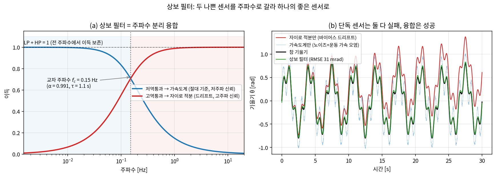
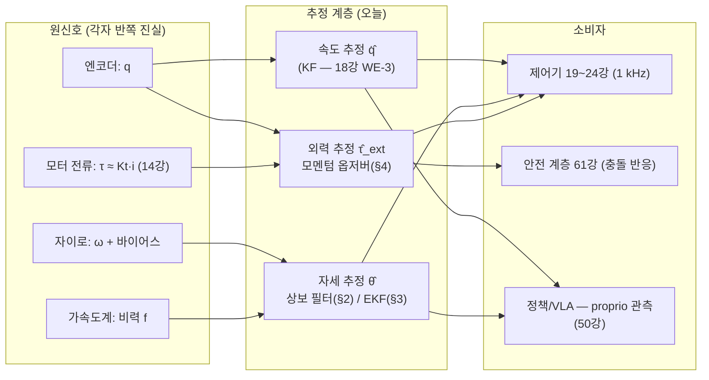
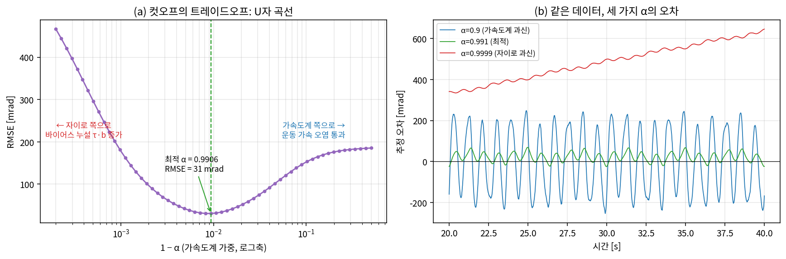
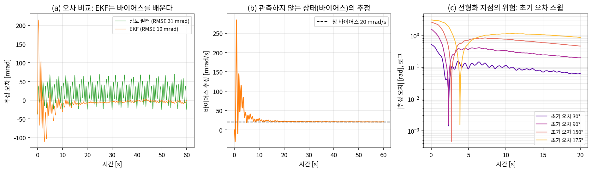
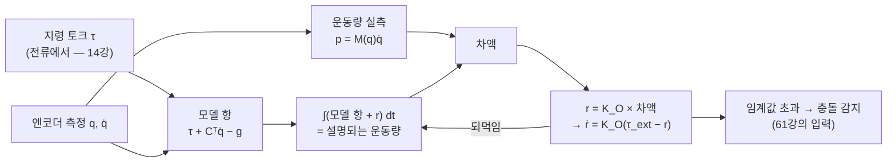
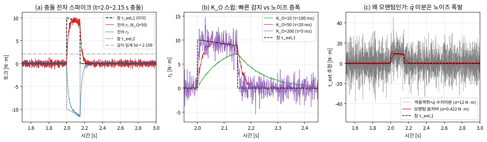
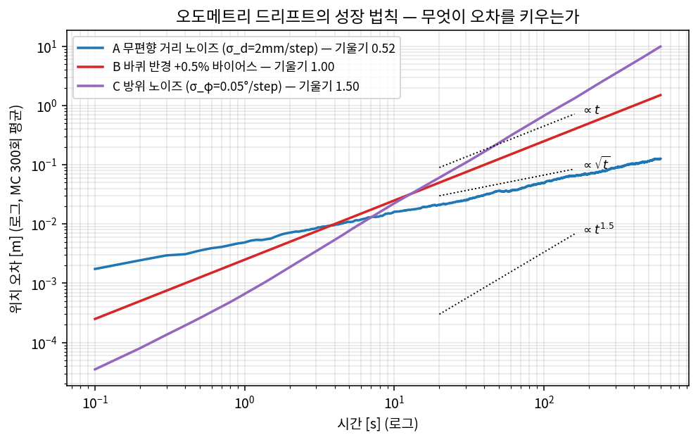

# Lec 59. 상태 추정과 센서 융합 — 로봇이 자기 상태를 아는 법

> 하위제어 트랙 27일차 (Part R6 시스템 통합, 세 번째). 선수 지식: 5강(자코비안·$\tau = J^\top F$), 10강(매니퓰레이터 방정식·skew-symmetry), 14강(전류≈토크), 18강(칼만 필터 — 오늘의 직계 선행), 52강(적분기와 이산화).
> 이 주제는 대부분 MR 범위 밖이다 — 관측기·칼만 필터 배경은 18강과 같은 Åström & Murray [1], 모멘텀 옵저버는 De Luca & Mattone [3]이 원전이다. 오도메트리만 MR Ch.13 §13.4를 참조한다 [7].

## 한 장 요약



왼쪽: 상보 필터는 자이로에는 **고역통과**(HP), 가속도계에는 **저역통과**(LP)를 걸어 더하는데, 두 필터의 합이 모든 주파수에서 정확히 1이다 — 신호는 무손실 통과, 각 센서의 **오류만** 걸러진다. 오른쪽: 자이로만 적분하면 바이어스가 60초에 1.24 rad을 쌓고(빨강), 가속도계만 쓰면 노이즈와 운동 가속이 뒤덮는다(파랑, RMSE 0.187 rad). 둘 다 못 쓰는 센서인데, 주파수로 갈라 합치면 RMSE 0.0305 rad의 좋은 센서가 된다(초록). 오늘 강의의 주제는 이 한 문장이다: **로봇은 자기 상태를 직접 재지 못한다 — 반쪽 진실들을 융합해 계산한다.**

## 학습 목표

1. 엔코더·자이로·가속도계·F/T 센서·모터 전류가 각각 무엇을 재고 어떤 방식으로 거짓말하는지(노이즈/바이어스/오염) 분류할 수 있다.
2. 상보 필터를 주파수 분리 융합으로 유도하고, 컷오프의 트레이드오프(바이어스 누설 vs 운동 가속 오염)를 손계산과 스윕으로 정량화할 수 있다.
3. EKF를 18강 칼만 필터의 비선형 확장으로 쓰고(무엇이 어디서 선형화되는가), 발산 조건을 실험으로 보일 수 있다.
4. 모멘텀 옵저버를 3단계로 유도하고, 토크 센서 없이 외력의 시점·크기를 추정하는 충돌 감지기를 2R 팔에서 구현할 수 있다.
5. 오도메트리 드리프트의 세 성장 법칙($\sqrt t$ / $t$ / $t^{1.5}$)을 원인별로 짝짓고 손으로 예측할 수 있다.

## 왜 이 강의가 필요한가

지금까지의 제어 강의(17~24강)는 전부 "상태 $x$를 안다"에서 시작했다. 시뮬레이터는 `d.qpos`, `d.qvel`을 그냥 내주니까 이 가정을 의심할 일이 없었다. 실물에서는 **어떤 센서도 상태를 직접 재지 않는다**: 엔코더는 각도만 주고 속도는 없다(유한차분은 노이즈 폭발 — 18강에서 수치로 봤다). IMU의 자이로는 적분하는 순간 드리프트하고, 가속도계는 중력과 운동 가속을 구분하지 못한다. 몸통의 기울기 — 휴머노이드가 넘어지지 않기 위한 단 하나의 필수 정보 — 를 재는 센서는 세상에 존재하지 않고, 오직 **추정**될 뿐이다. 접촉력도 마찬가지다: F/T 센서는 비싸고 손목 한 곳만 보는데, 팔꿈치에 사람이 부딪히면? 50강의 action 파이프라인에서 정책이 받는 proprioception 벡터($q, \dot q$, EEF pose)와 Franka가 자랑하는 충돌 감지의 실체가 전부 오늘의 추정기들이다. 18강에서 선형·가우시안 세계의 최적 추정(KF)을 배웠으니, 오늘은 그것을 실물 센서의 세계로 확장한다 — 가장 값싼 융합(상보 필터), 비선형 확장(EKF), 그리고 힘 센서 없이 촉각을 만드는 재주(모멘텀 옵저버)까지. 61강(안전 계층)는 오늘 만든 충돌 잔차를 소비하는 것에서 시작할 것이다.

## 본문

### 1. 센서는 각자 반쪽 진실만 말한다

| 센서 | 재는 것 | 주기 | 강점 | 거짓말의 방식 |
|---|---|---|---|---|
| 엔코더 | 관절각 $q$ | 1 kHz+ | 절대적·저노이즈 | 속도는 없다(차분 시 노이즈 $\sqrt2\sigma/\Delta t$ 폭발 — 18강). 감속기 반대편 백래시(15강)는 못 본다 |
| 자이로 | 몸체 각속도 $\omega$ | 100 Hz~수 kHz | 고대역, 운동 종류에 둔감 | **바이어스** $b$: 적분하면 오차가 $b\cdot t$로 자란다. 전원 인가·온도마다 값이 변해 공장 캘리브레이션으로 못 없앤다 |
| 가속도계 | **비력** $f_b = R^\top(\ddot p - g_{vec})$ | 동일 | 중력 방향 = 드리프트 없는 절대 기준 | 중력과 운동 가속을 원리적으로 구분 불가(등가원리). 노이즈 큼 |
| F/T 센서 | 손목 6축 힘·토크 | ~1 kHz | 직접 측정, 고분해능 | 비싸다. **장착점 이후**의 힘만 — 팔꿈치 충돌은 안 보인다. 온도 드리프트 |
| 모터 전류 | $\tau \approx K_t\, i$ (14강) | 전류루프 주기 | 공짜 토크계 | 감속기 마찰·효율에 오염(15강) — QDD(16강)에서만 깨끗 |

핵심 관찰: 각 센서의 결함은 **주파수 대역이 다르다**. 자이로의 바이어스는 저주파(거의 DC) 오류, 가속도계의 노이즈·운동 가속은 고주파 오류다. 결함의 대역이 겹치지 않으면 — 융합으로 둘 다 버릴 수 있다. 이것이 §2다. 그리고 추정치의 소비자가 누구인지도 봐 두자:



### 2. 상보 필터 — 가장 값싼 융합

실험대: 1축으로 흔들리는 몸통(기울기 $\theta$)에 IMU가 달려 있다. 자이로는 $\omega + b + \text{noise}$ ($b = 0.02$ rad/s, $\sigma_g = 0.01$ rad/s), 가속도계는 비력 2축 ($\sigma_f = 0.2$ m/s²)을 100 Hz로 준다. 정지 상태라면 비력이 $f_b = g(-\sin\theta, \cos\theta)$이므로 $\theta_{acc} = \mathrm{atan2}(-f_x, f_z)$로 기울기를 바로 읽을 수 있다 — 이것이 가속도계가 주는 **절대 기준**이다. 단독 성적표(데이터 생성은 아래 WE-1 코드와 동일, 수치는 `images/lec59/gen_figs.py` 출력):

- 자이로 적분만: 60초 후 오차 1.235 rad — 이론 드리프트 $b \cdot T = 0.02 \times 60 = 1.20$ rad과 일치. RMSE 0.7434 rad.
- 가속도계만: RMSE 0.1874 rad. 정지라면 $\sigma_f/g \approx 0.020$ rad짜리 좋은 센서인데, **운동 가속이 중력에 섞여** 9배 나빠졌다.

#### E1. 상보 필터 — 주파수 분리 융합

**직관**: "자이로는 짧은 시간엔 옳고 길게는 거짓말한다(드리프트). 가속도계는 길게는 옳고 짧은 시간엔 거짓말한다(노이즈·운동 가속). 그러면 짧은 쪽은 자이로에게, 긴 쪽은 가속도계에게 물어라."

**물리·기하적 의미**: 융합이 아니라 **분업**이다. 고역통과(HP)와 저역통과(LP)가 상보적(complementary), 즉 $HP + LP = 1$이 모든 주파수에서 성립하므로 참 신호 $\theta$는 어느 대역에서도 왜곡되지 않고, 각 센서의 오류만 자기 필터에 걸러진다. 교차 주파수 $f_c$ 하나가 "어디까지가 짧은 시간인가"를 정하는 유일한 손잡이다.

**형식**: 구현은 한 줄 재귀다:

$$
\hat\theta_k = \alpha\,\big(\hat\theta_{k-1} + \omega_k \Delta t\big) + (1-\alpha)\,\theta_{acc,k}
$$

주파수 영역에서 보면(유도 요점: 재귀식을 전달함수로 정리하고 $\tau = \alpha\Delta t/(1-\alpha)$로 치환):

$$
\hat\Theta(s) = \underbrace{\frac{\tau s}{\tau s + 1}}_{\text{HP} \to \text{자이로 적분}} \cdot \frac{\Omega(s)}{s} \;+\; \underbrace{\frac{1}{\tau s + 1}}_{\text{LP} \to \text{가속도계}} \cdot \Theta_{acc}(s), \qquad HP + LP = 1\ \ \forall s
$$

자이로 바이어스 $b$는 $b/s$로 들어와 HP를 지나 정상상태 잔류 오차 $\tau \cdot b$를 남긴다 — **바이어스 누설**. $\tau$를 키우면(자이로 신뢰↑) 누설이 커지고, 줄이면 가속도계의 고주파 오류가 통과한다. 트레이드오프의 양쪽이 전부 이 식 안에 있다.

#### WE-1 (손 + 코드): 상보 필터와 α 스윕

**손계산 1 — α와 시정수**: $\Delta t = 0.01$ s에서 $\tau = 1$ s를 원하면 $\alpha = \tau/(\tau + \Delta t) = 1/1.01 = 0.990$. 교차 주파수는 $f_c = 1/(2\pi\tau) = 0.159$ Hz.

**손계산 2 — 바이어스 누설**: $\alpha = 0.999 \Rightarrow \tau = 9.99$ s이므로 잔류 오차는 $\tau b = 9.99 \times 0.02 = 0.200$ rad. 이 예측이 아래 스윕에서 그대로 확인된다.

**검증 코드** (그림 1·2 생성 코드의 핵심부, 전체는 `images/lec59/gen_figs.py`):

```python
import numpy as np
rng = np.random.default_rng(27)
dt = 0.01; T = 60.0                          # 100 Hz, 60초
t = np.arange(0, T, dt); N = t.size
w1, w2 = 2*np.pi*0.3, 2*np.pi*1.1            # 흔들림의 두 주파수 성분
th_true = 0.6*np.sin(w1*t) + 0.2*np.sin(w2*t)
om_true = 0.6*w1*np.cos(w1*t) + 0.2*w2*np.cos(w2*t)
al_true = -0.6*w1**2*np.sin(w1*t) - 0.2*w2**2*np.sin(w2*t)

bias_g, sig_g = 0.02, 0.01                   # 자이로: 바이어스 + 백색 노이즈
gyro = om_true + bias_g + sig_g*rng.standard_normal(N)

r_imu, sig_f, GRAV = 0.3, 0.2, 9.81          # 가속도계: 비력 = Rᵀ(p̈ − g_vec)
pxdd = r_imu*(al_true*np.cos(th_true) - om_true**2*np.sin(th_true))
pzdd = r_imu*(-al_true*np.sin(th_true) - om_true**2*np.cos(th_true))
fw = np.stack([pxdd, pzdd + GRAV])
c, s = np.cos(th_true), np.sin(th_true)
fb_meas = np.stack([c*fw[0] - s*fw[1], s*fw[0] + c*fw[1]]) \
          + sig_f*rng.standard_normal((2, N))
th_acc = np.arctan2(-fb_meas[0], fb_meas[1]) # 정지 시 f_b = g(−sinθ, cosθ)

def complementary(alpha):
    th = np.zeros(N); th[0] = th_acc[0]
    for k in range(1, N):
        th[k] = alpha*(th[k-1] + gyro[k]*dt) + (1-alpha)*th_acc[k]
    return th

def rmse(a, b, skip=int(5/dt)):
    return np.sqrt(np.mean((a[skip:] - b[skip:])**2))

for a in [0.9, 0.99, 0.995, 0.999, 0.9999]:
    tau = a*dt/(1-a)
    print(f"α={a:<6}: τ={tau:5.2f} s  f_c={1/(2*np.pi*tau):.4f} Hz  "
          f"RMSE={rmse(complementary(a), th_true):.4f} rad")
```

출력:

```
α=0.9   : τ= 0.09 s  f_c=1.7684 Hz  RMSE=0.1524 rad
α=0.99  : τ= 0.99 s  f_c=0.1608 Hz  RMSE=0.0309 rad
α=0.995 : τ= 1.99 s  f_c=0.0800 Hz  RMSE=0.0411 rad
α=0.999 : τ= 9.99 s  f_c=0.0159 Hz  RMSE=0.1786 rad
α=0.9999: τ=99.99 s  f_c=0.0016 Hz  RMSE=0.5604 rad
```



읽는 법: (1) U자 곡선이다 — $\alpha$를 촘촘히 스윕하면 최적은 $\alpha = 0.9906$($\tau = 1.06$ s, $f_c = 0.150$ Hz), RMSE 0.0305 rad. 손계산 1의 "τ≈1초" 감각과 일치한다. (2) 오른팔($\alpha \to 1$)의 병은 바이어스 누설 — $\alpha = 0.999$의 RMSE 0.1786은 손계산 2의 누설 0.200 rad로 거의 전부 설명된다(최적점에서는 $\tau b = 0.0212$ rad로 억제). (3) 왼팔($\alpha \downarrow$)의 병은 가속도계의 운동 가속 오염 통과. **컷오프 하나로 두 오류의 예산을 배분하는 것** — 이것이 "가장 값싼 융합"의 전부고, 코드 다섯 줄에 곱셈 두 번이라 8비트 마이크로컨트롤러에서도 돈다. 드론·휴머노이드 자세 추정의 실무 표준(Mahony 필터)이 이 구조의 SO(3) 일반화다 [4].

### 3. EKF — 18강 칼만 필터의 비선형 확장

상보 필터는 바이어스 누설 $\tau b$를 **견딘다**. 더 잘할 수 있을까? 바이어스를 견디지 말고 **추정해서 빼 버리면** 된다 — 상태를 $x = (\theta, b)$로 확장하고, 18강 WE-3에서 속도를 재지 않고 추정했듯 바이어스를 재지 않고 추정한다. 문제는 관측 모델 $f_b = g(-\sin\theta, \cos\theta)$가 **비선형**이라는 것. 18강의 KF는 $y = Hx$만 받는다.

#### E2. EKF — "야코비안으로 공분산만 선형화"

**직관**: "예측·보정의 뼈대는 KF 그대로 두고, 평균은 비선형 함수로 정직하게 전파하되, **공분산(신뢰도)의 전파만 그 지점의 1차 근사(야코비안)로 계산한다**."

**물리·기하적 의미**: 가우시안은 선형 사상에서만 가우시안으로 남는다. EKF는 비선형 $f, h$를 현재 추정치 $\hat x$ 주변에서 접평면으로 펴서(5강의 야코비안이 또 나온다) 가우시안 전파를 성립시키는 국소 면허다. 대가: KF가 갖던 "정확한 사후분포"(18강 E4)가 "1차 근사"로 강등된다. 추정치가 참에서 멀면 야코비안 자체가 틀리고, 틀린 야코비안이 갱신을 더 밀어낸다 — **발산의 양성 되먹임**. 선형화 지점이 곧 아킬레스건이다.

**형식**: $x_k = f(x_{k-1}, u_k) + w$, $y_k = h(x_k) + v$에 대해, $F = \partial f/\partial x\big|_{\hat x}$, $H = \partial h/\partial x\big|_{\hat x^-}$로 두면

$$
\text{예측:}\quad \hat x^-_k = f(\hat x_{k-1}, u_k), \qquad P^-_k = F P_{k-1} F^\top + Q_w
$$

$$
\text{보정:}\quad K_k = P^-_k H^\top (H P^-_k H^\top + R_v)^{-1}, \qquad \hat x_k = \hat x^-_k + K_k\big(y_k - h(\hat x^-_k)\big), \qquad P_k = (I - K_k H)P^-_k
$$

18강의 KF와 다른 곳은 정확히 두 군데다: 평균은 $f, h$ 원본으로, 공분산·이득은 야코비안 $F, H$로. 유도 요점은 "테일러 1차에서 끊고 KF를 적용"이 전부다 [5]. 오늘 문제의 구체형: 상태 $(\theta, b)$, 자이로를 **입력**으로 쓰는 예측 $\theta_k = \theta_{k-1} + (\omega_k^{meas} - \hat b)\Delta t$, 관측은 가속도계 원신호 $h(\theta) = g(-\sin\theta, \cos\theta)$,

$$
F = \begin{bmatrix} 1 & -\Delta t \\ 0 & 1 \end{bmatrix}, \qquad
H = \begin{bmatrix} -g\cos\hat\theta & 0 \\ -g\sin\hat\theta & 0 \end{bmatrix}
$$

**손계산 — 선형화 지점이 정보의 방향을 정한다**: $\hat\theta = 0$이면 $H = [(-9.81, 0); (0, 0)]$ — x축만 기울기 정보를 갖는다. $\hat\theta = 90°$면 $H = [(0,0); (-9.81, 0)]$ — 이번엔 z축만. **어느 센서 축을 얼마나 믿을지가 선형화 지점에 따라 바뀐다.** 추정이 틀리면 이 배선 자체가 틀린다.

#### WE-2 (코드): EKF vs 상보 필터 — 정확도, 연산량, 그리고 발산

```python
def run_ekf(th0=None, P0=None, sig_f_eff=1.2, sig_bw=1e-4):
    x = np.array([th_acc[0] if th0 is None else th0, 0.0])
    P = np.diag([0.1**2, 0.05**2]) if P0 is None else P0.copy()
    Qw = np.diag([(sig_g*dt)**2, (sig_bw*dt)**2])
    Rv = np.eye(2)*sig_f_eff**2               # σ_f=0.2가 아니라 1.2 — 본문 참조
    F = np.array([[1., -dt], [0., 1.]])
    est = np.zeros((N, 2)); est[0] = x
    for k in range(1, N):
        x = np.array([x[0] + (gyro[k]-x[1])*dt, x[1]])       # 예측 (자이로=입력)
        P = F @ P @ F.T + Qw
        h = GRAV*np.array([-np.sin(x[0]), np.cos(x[0])])     # 보정 (현재 추정치에서
        H = np.array([[-GRAV*np.cos(x[0]), 0.],              #  h와 H를 재선형화!)
                      [-GRAV*np.sin(x[0]), 0.]])
        K = P @ H.T @ np.linalg.inv(H @ P @ H.T + Rv)
        x = x + K @ (fb_meas[:, k] - h)
        P = (np.eye(2) - K @ H) @ P
        est[k] = x
    return est

ekf = run_ekf()
print(f"상보 필터(최적 α) RMSE: {rmse(complementary(0.9906), th_true):.4f} rad")
print(f"EKF              RMSE: {rmse(ekf[:,0], th_true):.4f} rad")
print(f"바이어스 추정: 최종 {ekf[-1,1]:.4f} rad/s (참값 {bias_g})")
for e_deg in [30, 90, 150, 175]:              # 선형화 지점의 위험: 초기 오차 스윕
    est = run_ekf(th0=np.radians(e_deg), P0=np.diag([0.01**2, 0.01**2]))
    e = rmse(est[:,0], th_true, skip=int(50/dt))
    tag = '수렴' if e < 0.05 else ('잔류 오차' if e < 0.1 else '수렴 실패')
    print(f"초기 오차 {e_deg:>3}° → 마지막 10초 RMSE {e:.4f} rad  ({tag})")
```

출력:

```
상보 필터(최적 α) RMSE: 0.0305 rad
EKF              RMSE: 0.0096 rad
바이어스 추정: 최종 0.0205 rad/s (참값 0.02)
초기 오차  30° → 마지막 10초 RMSE 0.0233 rad  (수렴)
초기 오차  90° → 마지막 10초 RMSE 0.0672 rad  (잔류 오차)
초기 오차 150° → 마지막 10초 RMSE 0.1416 rad  (수렴 실패)
초기 오차 175° → 마지막 10초 RMSE 0.2311 rad  (수렴 실패)
```



읽는 법 세 가지. **(a) 정확도**: EKF가 0.0096 rad로 상보 필터(0.0305)의 약 3배 — 이유는 (b)에 있다: 바이어스를 상태로 넣어 0.0205 rad/s로 **알아맞혔기** 때문에(참값 0.02) 누설 자체가 사라졌다. 상보 필터가 견디는 것을 EKF는 제거한다. **대가**는 연산량(2×2 역행렬 포함, 같은 파이썬 루프 기준 스텝당 약 50배)과 튜닝 항목($Q_w, R_v, P_0$ — 상보 필터는 α 하나). 구현 디테일 하나: $R_v$를 실제 노이즈 $\sigma_f = 0.2$가 아니라 1.2로 부풀렸다. 관측 모델 $h$가 "정지"를 가정하므로 운동 가속이 통째로 모델 오차로 들어오는데, 그 몫까지 관측 노이즈로 계상하는 **R 인플레이션**은 "모델이 모르는 것은 노이즈로 자백시킨다"는 실무 표준 트릭이다. **(c) 발산 위험**: 과신한 $P_0$( = 0.01² )로 초기 추정을 크게 틀리게 주면, 30°는 회복하지만 90°부터는 60초가 지나도 오차가 남는다. 손계산에서 봤듯 $\hat\theta$가 틀리면 $H$의 배선이 틀리고, 필터는 남는 모순을 바이어스 상태에 흡수해 **자기모순 없는 잘못된 해석**에 정착한다 — 작은 공분산을 보고하면서. 18강 흔한 오해 3("자신 있게 틀린다")의 비선형 버전이며, 선형화 기반 추정의 구조적 한계다(번역 박스에서 다시).

### 4. 모멘텀 옵저버 — 토크 센서 없는 촉각

이제 전혀 다른 상태를 추정한다: **외력**. 로봇이 무언가에 부딪혔는지, 얼마나 세게 밀리는지를 F/T 센서 없이 알고 싶다. 재료는 이미 있다 — 엔코더($q, \dot q$), 지령 토크($\tau$, 전류에서 — 14강), 그리고 10강의 동역학 모델. 아이디어는 회계다: **내가 넣은 토크로 설명되는 운동량과 실제 운동량의 차이 = 외부에서 들어온 충격량.**

#### E3. 모멘텀 옵저버 — 잔차의 1차 동역학

**직관**: "로봇의 운동량 장부를 적어라. 장부($\tau$와 모델로 설명되는 몫)와 실측 운동량이 어긋나면, 그 차액은 장부에 없는 외력이 낸 것이다."

**물리·기하적 의미**: 관건은 $\ddot q$를 쓰지 않는 것이다. 역동역학으로 $\tau_{ext} = M\ddot q + C\dot q + g - \tau$를 직접 풀면 되지 않나 싶지만, $\ddot q$는 측정되지 않아서 $\dot q$를 미분해야 하고 — 18강에서 본 차분 노이즈 폭발이 그대로 재연된다(WE-3에서 29배 차이로 확인). **일반화 모멘텀 $p = M(q)\dot q$는 미분 없이 측정만으로 계산되고**, 그 시간 변화율에는 $\ddot q$가 등장하지 않는 항등식이 성립한다. 적분(노이즈를 죽이는 연산)만으로 외력을 복원하는 설계다.

**형식** (유도 3단계, De Luca & Mattone [3]):

① 운동량의 미분: $p = M\dot q \Rightarrow \dot p = \dot M\dot q + M\ddot q$.

② $M\ddot q = \tau + \tau_{ext} - C\dot q - g$ (10강의 매니퓰레이터 방정식)와 $\dot M = C + C^\top$ (10강의 skew-symmetry $\dot M - 2C$에서 즉시 따라옴)을 대입하면:

$$
\dot p = \tau + C^\top \dot q - g + \tau_{ext}
$$

$\ddot q$도 $M^{-1}$도 사라졌다 — 우변은 전부 측정·계산 가능하고, 모르는 것은 $\tau_{ext}$뿐.

③ 잔차(residual)를 정의한다:

$$
r(t) = K_O\left[\, p(t) - p(0) - \int_0^t \big(\tau + C^\top\dot q - g + r\big)\, ds \right]
$$

미분해 보면 ②에 의해 괄호 안 미지항만 남는다:

$$
\dot r = K_O\,(\tau_{ext} - r)
$$

**잔차 $r$은 외력 토크 $\tau_{ext}$를 시정수 $1/K_O$의 1차 저역통과 필터에 통과시킨 것이다.** 센서 추가 없이, 미분 없이. $K_O$를 키우면 $r \to \tau_{ext}$가 빨라지지만 측정 노이즈도 증폭된다 — 17강의 대역폭-노이즈 트레이드오프가 여기서도 반복된다. 덤으로 **격리(isolation)** 성질: 링크 $i$에 가해진 충돌은 그보다 말단 관절의 잔차 성분을 만들지 않아서, 어느 링크가 부딪혔는지까지 알 수 있다 [3][6].



#### WE-3 (손 + 코드): 2R 팔의 충돌 감지

10강의 2R 팔($m_i = 1$ kg, $l_i = 1$ m, $l_{ci} = 0.5$, $I_i = 1/12$)을 중력보상+PD로 $q_d = (90°, -90°)$에 세워 두고, $t = 2.0$~$2.15$ s 동안 EEF에 미지의 힘 $F = (-20, -10)$ N을 가한다. 엔코더 속도에 $\sigma_{\dot q} = 0.005$ rad/s 노이즈, 1 kHz 루프.

**손계산 1 — 참 외력 토크** (옵저버가 맞혀야 할 답, 5강의 $\tau = J^\top F$):

$$
J(q_d) = \begin{bmatrix} -1 & 0 \\ 1 & 1 \end{bmatrix}, \qquad
\tau_{ext} = J^\top F = \begin{bmatrix} (-1)(-20) + (1)(-10) \\ (0)(-20) + (1)(-10) \end{bmatrix} = \begin{bmatrix} 10 \\ -10 \end{bmatrix} \text{N·m}
$$

**손계산 2 — 잔차의 도달치**: $K_O = 10$이면 충돌 지속 0.15 s 동안 $r_1$은 $10(1 - e^{-10 \times 0.15}) = 7.77$ N·m까지만 도달한다(느린 필터는 짧은 충돌을 다 못 본다). $K_O = 50$이면 $10(1 - e^{-7.5}) = 9.99$ — 거의 다 본다.

**검증 코드** (M, C, g는 10강의 함수 재사용, 전체는 `gen_figs.py`):

```python
q_d = np.array([np.pi/2, -np.pi/2]); F_ext = np.array([-20., -10.])

def simulate_2r(K_O, sig_qd=0.005, seed=3, T2=4.0, dt2=1e-3,
                t_hit=2.0, dur=0.15):
    rng2 = np.random.default_rng(seed)
    n2 = int(T2/dt2); tt = np.arange(n2)*dt2
    q = q_d + np.array([0.1, -0.1]); qd = np.zeros(2)
    Kp, Kd, KO = np.diag([60., 30.]), np.diag([15., 8.]), np.eye(2)*K_O
    q_m = q + 1e-5*rng2.standard_normal(2)
    qd_m = qd + sig_qd*rng2.standard_normal(2)
    integ = np.zeros(2); p0 = M_mat(q_m) @ qd_m; r = np.zeros(2)
    R = np.zeros((n2, 2))
    for k in range(n2):
        tau_ext = jac(q).T @ F_ext if t_hit <= tt[k] < t_hit+dur else np.zeros(2)
        tau = g_vec(q) + Kp @ (q_d - q) - Kd @ qd          # 중력보상 + PD (19강)
        qdd = np.linalg.solve(M_mat(q), tau + tau_ext - C_mat(q, qd) @ qd - g_vec(q))
        qd = qd + qdd*dt2; q = q + qd*dt2                  # 참 동역학 (semi-implicit)
        q_m = q + 1e-5*rng2.standard_normal(2)             # 측정
        qd_m = qd + sig_qd*rng2.standard_normal(2)
        p = M_mat(q_m) @ qd_m                              # ── 모멘텀 옵저버 ──
        integ = integ + (tau + C_mat(q_m, qd_m).T @ qd_m - g_vec(q_m) + r)*dt2
        r = KO @ (p - integ - p0)
        R[k] = r
    return tt, R
```

실행 결과($5\sigma$ 임계값 기준 감지 성능, `gen_figs.py` 출력):

| $K_O$ [1/s] | 무접촉 노이즈 플로어 $\sigma(r_1)$ | 피크 $r_1$ [N·m] | 이론 피크 $10(1{-}e^{-K_O \cdot 0.15})$ | 감지 지연 |
|---|---|---|---|---|
| 10 | 0.083 | 7.360 | 7.769 | 4.0 ms |
| 50 | 0.422 | 10.174 | 9.994 | 4.0 ms |
| 200 | 1.770 | 14.766 | 10.000 | 7.0 ms |



읽는 법: (1) **그림 (a)** — 충돌 순간 잔차가 손계산 1의 $(10, -10)$ N·m을 향해 치솟고, $5\sigma = 2.11$ N·m 임계값을 4 ms 만에 넘는다. 손계산: $10(1-e^{-50t}) = 2.11 \Rightarrow t = 4.7$ ms — 측정 4.0 ms와 부합. (2) **그림 (b)** — $K_O$ 스윕. 피크가 손계산 2의 이론값(7.77/9.99/10.00)을 따라가고, $K_O = 200$은 노이즈 플로어가 1.77로 커져 $5\sigma$ 임계값이 8.85로 올라가는 바람에 감지가 **오히려 늦다**(7 ms). 대역폭을 올리는 게 공짜가 아니다. (3) **그림 (c)** — 순진한 대안(역동역학 + $\ddot q$ 수치미분)의 잔차는 $\sigma = 12.2$ N·m로 옵저버($K_O{=}50$, 0.42)의 **29배**: 신호(10 N·m)가 노이즈에 파묻혀 감지 자체가 불가능하다. 손검산: 차분 노이즈 $\sqrt2\sigma_{\dot q}/\Delta t = 7.07$ rad/s²에 $M_{11} = 1.67$을 곱하면 11.8 N·m — 측정 12.2와 일치. **미분은 노이즈를 증폭하고 적분은 죽인다** — 옵저버 설계의 제1원칙이다. 무노이즈 검증도 통과: 충돌 75 ms 시점 $r_1 = 9.406$ vs 1차 지연 예측 9.226 N·m(팔이 밀리며 $J^\top F$ 자체가 약간 변한 몫이 잔차의 대부분).

실무 연결: 이 잔차 기반 충돌 감지는 협동로봇의 표준 장비다 — Franka의 충돌 반응(임계값을 넘으면 정지 또는 반사 동작)이 이 계열이고 [6], 관절 토크센서가 있는 로봇은 $\tau$ 자리에 측정 토크를 넣어 감속기 마찰 오염(15강)까지 우회한다. QDD(16강)는 전류$\propto$토크가 깨끗해서 센서 없이도 이 방법이 잘 통하는 설계다. 감지 후 무엇을 할지(정지/후퇴/컴플라이언스 전환)는 61강에서 다룬다.

### 5. 오도메트리 드리프트 — 적분 오차의 성장 법칙

마지막으로, 추정 오차가 **시간에 따라 어떻게 자라는가**를 법칙 수준에서 정리한다. 바퀴 엔코더로 이동 로봇의 위치를 적분(오도메트리, MR §13.4 [7])하는 미니 시뮬: 0.5 m/s 직진 600초, 스텝(0.1 s)마다 이동거리와 방위에 오차 주입, 몬테카를로 300회 평균.

```python
dt_o, T_o, v = 0.1, 600.0, 0.5
n_o = int(T_o/dt_o); t_o = np.arange(1, n_o+1)*dt_o
rng3 = np.random.default_rng(5)
def odometry_mc(sig_d=0., bias_d=0., sig_phi=0., n_mc=300):
    err = np.zeros(n_o)
    for _ in range(n_mc):
        dd = v*dt_o*(1 + bias_d) + sig_d*rng3.standard_normal(n_o)
        phi = np.cumsum(sig_phi*rng3.standard_normal(n_o))
        x = np.cumsum(dd*np.cos(phi)); y = np.cumsum(dd*np.sin(phi))
        err += np.hypot(x - v*t_o, y)
    return err/n_mc
```

| 오차 원인 | 60초 오차 | 600초 오차 | log-log 기울기 | 법칙 |
|---|---|---|---|---|
| A. 무편향 거리 노이즈 ($\sigma_d = 2$ mm/스텝) | 0.036 m | 0.126 m | 0.52 | $\propto \sqrt t$ (랜덤워크) |
| B. 바퀴 반경 +0.5% 바이어스 (슬립·마모) | 0.150 m | 1.500 m | 1.00 | $\propto t$ (계통 오차) |
| C. 방위 노이즈 ($\sigma_\phi = 0.05°$/스텝) | 0.312 m | 9.892 m | 1.50 | $\propto t^{1.5}$ (**적분의 적분**) |



손검산 세 개가 전부 맞는다: A는 $\sigma_d\sqrt N \cdot \sqrt{2/\pi} = 0.002\sqrt{6000} \times 0.798 = 0.124$ m(측정 0.126). B는 그냥 $0.005 \times 300\,\text{m} = 1.500$ m — 정확히 일치. C는 방위가 랜덤워크($\propto \sqrt t$)하고 그 방위 오차가 **다시 위치로 적분**되므로 $v\,\sigma_\phi\sqrt{t^3/(3\Delta t)} \cdot \sqrt{2/\pi} = 9.3$ m(측정 9.89). 교훈 두 개: **가장 위험한 것은 노이즈가 아니라 바이어스와 방위 오차다**(각도 1°의 거짓말은 100 m 뒤 1.7 m의 거짓말이 된다). 그리고 어떤 성장 법칙이든 **절대 기준 없이 적분만 하면 반드시 무한히 자란다** — §2의 자이로 드리프트($b \cdot t$, B형)와 같은 병이고, 처방도 같다: 드리프트 없는 저주파 기준(가속도계/GPS/랜드마크/비전)과의 융합. 상보 필터는 이 처방의 최소 구현이었던 것이다.

### 딥러닝 배경자를 위한 번역

- **상보 필터·칼만 필터는 학습 없는 센서 융합이다.** VLA의 proprio 인코더가 데이터에서 배우는 "여러 신호의 가중 결합"을, 고전 추정기는 주파수 분리(α)나 신뢰도(공분산)로 **손설계**한다. 파라미터 수 1(α) vs 수백만 — 그런데 1 kHz로 돌고, 데이터가 0장 필요하고, 왜 그 가중치인지 설명이 된다. 학습 기반 추정이 이기는 곳은 모델을 쓸 수 없는 곳(시각, 미끄러운 접촉)이다.
- **자이로 적분·오도메트리 드리프트 = autoregressive rollout의 compounding error.** 절대 관측 없이 자기 출력을 계속 먹는 구조는 37강의 BC 드리프트($O(\epsilon T^2)$)와 수학적으로 같은 병이다. 가속도계·랜드마크는 주기적 ground-truth 재접지 — 개루프를 폐루프로 바꾸는 것이 유일한 근본 처방이라는 결론까지 같다.
- **EKF의 선형화 = 국소 1차 근사의 한계.** WE-2의 발산은 "추정이 틀리면 그 지점의 야코비안도 틀려서 회복 불가"라는 구조적 문제다 — 비선형·비가우시안(다봉 사후분포)에서 가우시안+1차 근사가 무너지는 자리가 파티클 필터와 학습 기반 추정기(예: 시각-관성 융합을 end-to-end로 학습)의 시장이다. 단 EKF는 공분산이라는 자기 신뢰도 보고서를 내고, 학습 추정기는 대개 내지 않는다.
- **모멘텀 옵저버 = 모델 기반 잠재변수 추론.** 관측(proprioception)과 동역학 모델(디코더)로 설명되지 않는 잔차를 잠재변수(외력)로 읽는다 — 오토인코더의 reconstruction error를 OOD/anomaly 신호로 쓰는 것과 같은 구도다. 모델이 좋을수록 잔차는 순수한 외력이 되고, 모델 오차(마찰)는 그대로 위양성이 된다 — "이상 감지의 성능은 정상 모델의 품질"이라는 명제 그대로.

## 흔한 오해

1. **"가속도계는 기울기를 잰다"** — 아니다. **비력**(specific force) $R^\top(\ddot p - g_{vec})$을 잰다. 정지 시에만 그것이 중력 방향(= 기울기)이고, 자유낙하 중엔 0, 가속 중엔 중력+운동가속의 뒤범벅이다(등가원리 — 원리적으로 분리 불가). 실습 ①에서 MuJoCo로 수치 확인한다: 정지 직립에서 $(0, 0, +9.81)$을 읽는 이유를 설명할 수 없다면 이 오해가 남아 있는 것이다.
2. **"드리프트는 더 좋은 IMU를 사면 해결된다"** — 등급이 올라가면 $b$가 작아져 시간을 벌 뿐, 적분 구조가 있는 한 $b \cdot t$ 성장 자체는 사라지지 않는다(전술급 IMU도 결국 드리프트한다 — 잠수함이 주기적으로 GPS 보정을 받는 이유). 게다가 바이어스는 온도·전원 사이클마다 변해 공장 캘리브레이션으로 못 없앤다. 처방은 하드웨어가 아니라 구조다: 드리프트 없는 절대 기준과의 융합.
3. **"EKF는 KF의 상위호환이니 항상 EKF를 쓰면 된다"** — WE-2가 보여준 청구서: 연산량(파이썬 기준 ~50배), 튜닝 항목($Q_w, R_v, P_0$), 그리고 선형화 발산 위험. 상보 필터(와 그 SO(3) 일반화인 Mahony 필터 [4])가 여전히 드론·휴머노이드 자세 추정의 표준인 것은 게으름이 아니라 엔지니어링이다 — 요구 정확도를 만족하는 가장 단순한 추정기가 옳은 추정기다.
4. **"외력을 알려면 힘 센서가 필요하다"** — §4 전체가 반례다: $q, \dot q, \tau$와 모델만으로 시점·크기·**어느 링크인지**까지 추정한다. 거꾸로 F/T 센서 만능론도 오해다: 손목 센서는 장착점 이후의 힘만 보므로 팔꿈치 충돌은 영원히 못 본다 — 모멘텀 옵저버는 몸 전체를 본다. 한계도 정직하게: 잔차는 외력과 모델 오차(마찰·파라미터 오차)를 구분하지 못하므로, 임계값 아래의 미세한 힘 측정은 여전히 센서의 영역이다(22강의 역할 분담).

## 실습 (1.5~2시간)

**MuJoCo에서 IMU를 시뮬레이션하고 자세 추정 파이프라인을 세운다.** (CPU로 충분, 검증 스크립트: `images/lec59/check_mujoco.py`)

1. 1축으로 흔들리는 몸통 모델을 만든다. MuJoCo의 `accelerometer` 센서는 비력, `gyro`는 몸체 각속도를 사이트 좌표계로 반환한다 [8] — 실물 IMU와 같은 의미론이다:

```xml
<mujoco model="tilting_torso">
  <option timestep="0.001" gravity="0 0 -9.81"/>
  <worldbody>
    <body name="torso" pos="0 0 0.5">
      <joint name="pitch" type="hinge" axis="0 1 0" stiffness="10" damping="1.0"/>
      <geom type="capsule" fromto="0 0 0  0 0 0.4" size="0.04" density="800"/>
      <site name="imu" pos="0 0 0.3"/>
    </body>
  </worldbody>
  <actuator><motor joint="pitch" gear="1" ctrlrange="-10 10"/></actuator>
  <sensor>
    <accelerometer name="acc" site="imu"/>
    <gyro name="gyr" site="imu"/>
    <framequat name="quat_true" objtype="site" objname="imu"/>
  </sensor>
</mujoco>
```

2. **센서 의미론 검증(중요)**: 정지 직립에서 가속도계가 $(0, 0, +9.81)$을 읽는지 확인하라 — 지지 반력이 만드는 비력이다(자유낙하라면 0). 다음으로 30° 기울여 놓고(속도 0, 각가속은 큼) 읽은 값을 손계산 $R_y^\top(a_{lin} - g_{vec})$과 대조하라. 검증 스크립트 실행 결과 둘 다 일치한다: 기울임 직후 시뮬 $(-14.754, 0, 8.496)$ vs 손계산 $(-14.754, 0, 8.496)$ m/s². **시뮬레이터의 센서가 무엇을 주는지 손으로 검산하는 습관** — 52강에서 물리엔진을 의심하는 법을 배웠다면, 오늘은 센서 모델을 의심한다.
3. **파이프라인 구축**: 물리 1 kHz, IMU 샘플 100 Hz. 모터로 몸통을 계속 흔들면서(`ctrl = 3sin(2π·0.3t)`), 자이로에 바이어스 0.02 rad/s + $\sigma = 0.01$, 가속도계에 $\sigma = 0.2$ m/s²를 주입하고, WE-1의 상보 필터와 WE-2의 EKF를 **코드 수정 없이** 물려라(같은 관측 모델이므로 그대로 돈다). 스크립트 실행 결과: 자이로 적분만 RMSE 0.3359 rad / 가속도계만 0.0406 / 상보 필터(α=0.99) 0.0243 / EKF 0.0067 rad (바이어스 추정 0.0197 — 참값 0.02). 합성 데이터(WE-1)와 물리엔진 데이터에서 같은 서열이 재현되는지 확인하라.
4. **스윕 과제**: (a) 흔들기 진폭을 2배로 — 운동 가속이 커지면 상보 필터 최적 α는 어느 쪽으로 움직이는가(그림 2의 U자가 어떻게 변형되는가). (b) 바이어스를 0.1 rad/s로 — 상보 필터와 EKF의 격차는 어떻게 되는가. 돌리기 전에 예측을 적고 확인할 것.
5. **(심화) 휴머노이드로 확장**: MuJoCo 배포판의 `model/humanoid/humanoid.xml` 몸통에 같은 `<site>` + IMU 센서를 붙이고, freejoint 몸통의 pitch·roll을 2축 상보 필터로 추정해 `framequat` 참값과 비교하라. 보행 중(다리를 움직이는 중) 가속도계 오염이 커질 때 추정이 얼마나 버티는지가 관전 포인트다.
6. **(심화) 충돌 감지 임계값 실험**: WE-3에서 $F_{ext}$를 (−2, −1) N까지 줄여 가며 $5\sigma$ 임계값으로 감지 가능한 최소 힘을 찾아라. $K_O$와 $\sigma_{\dot q}$를 바꾸면 그 경계가 어떻게 움직이는가 — "감지 가능 최소 외력"을 축으로 하는 설계 차트를 그려 보라.

## Claude와 토론할 질문

1. 상보 필터의 최적 컷오프는 무엇이 정하는가? 바이어스 크기와 운동 가속 스펙트럼으로 답하고, "로봇이 더 격하게 움직이면 α는 어느 쪽으로 움직여야 하나"를 그림 2의 U자 곡선 변형으로 예측한 뒤 실습 4(a)로 확인하라.
2. WE-2의 175° 발산은 "선형화 유효 반경 초과"와 "과신한 $P_0$"의 합작이다. $P_0$를 크게 주면 살아나는가(직접 실험)? 살아난다면, 그럼에도 실물에서 $P_0$를 무작정 키우지 않는 이유는? (초기 과도 응답, 아웃라이어 관측에의 취약성)
3. 모멘텀 옵저버 유도에서 $C^\top\dot q$가 나타나는 근거를 10강의 skew-symmetry($\dot M - 2C$)로 설명하라. 그런데 10강에서 C의 인수분해는 유일하지 않다고 했다(흔한 오해 1) — Christoffel이 아닌 다른 C를 쓰면 $\dot M = C + C^\top$이 깨지는데, 그러면 잔차에 무엇이 섞이는가?
4. $K_O$ 스윕 표에서 $K_O = 200$이 감지 지연이 오히려 길어진 이유를 임계값 관점에서 설명하고, 17강의 대역폭-노이즈 트레이드오프와 같은 구조임을 보여라. 감지 지연을 진짜로 줄이는 손잡이는 무엇인가(힌트: $\sigma_{\dot q}$, 즉 속도 추정 품질 — 오늘 §2·§3이 §4의 입력 품질을 정한다).
5. 감속기 마찰(15강)을 모델에 안 넣으면 잔차 $r$에 어떻게 나타나는가? 속도 의존 임계값(느릴 때 타이트, 빠를 때 느슨)이 실무 표준인 이유를 설명하고, QDD(16강)에서 이 문제가 왜 가벼워지는지 논하라.
6. VLA 정책은 이미지에서 행동을 직접 낸다(50강) — 명시적 자세 추정기 없이. 그런데 그 아래층에는 오늘의 추정기들이 1 kHz로 산다. 어떤 상태는 정책이 암묵적으로 추정해도 되고, 어떤 상태는 명시적 추정기가 공급해야 하는가? 주기·안전성·검증 가능성(61강 예고)의 세 축으로 논증하라.
7. 오도메트리 C 케이스의 $t^{1.5}$ 법칙을 손으로 유도하라(방위 랜덤워크 분산 $\propto t$ → 횡오차 분산 $\propto \int$...). 절대 기준(랜드마크 관측)이 60초마다 하나씩 들어오면 세 곡선은 각각 어떻게 변하는가 — 이것이 상보 필터와 같은 구조임을 논하라(SLAM의 문 앞까지 간 것이다 — 이 커리큘럼 범위 밖).

## 읽을거리

1. **De Luca & Mattone, "Sensorless Robot Collision Detection and Hybrid Force/Motion Control," ICRA 2005** [3] (~40분): §II(잔차 설계)~§III(격리 성질)까지만 — E3의 유도가 원문에서 어떻게 FDI(fault detection) 언어로 쓰였는지. 이후의 하이브리드 제어 부분은 22강를 배웠으니 훑기만.
2. **Åström & Murray, *Feedback Systems* 2판 Ch.8** (fbswiki.org, ~40분) [1]: 18강에서 읽었다면 관측기(observer) 절만 복습 — 오늘의 필터들이 전부 "모델 예측 + 출력 보정" 관측기의 변주임을 확인하는 용도.
3. (선택) **Haddadin, De Luca, Albu-Schäffer, "Robot Collisions: A Survey on Detection, Isolation, and Identification," IEEE T-RO 2017** [6]: 충돌 감지·격리·식별·반응의 전체 지형도. 분류 체계 그림과 모멘텀 옵저버가 표준으로 자리 잡은 맥락만 (~30분).

## 자가 점검

1. 가속도계가 정지·자유낙하·등속·가속 상태에서 각각 무엇을 읽는지 즉답하고, "기울기를 재는 센서가 아니다"를 비력의 정의로 설명할 수 있는가?
2. 상보 필터 한 줄 재귀에서 $\alpha \leftrightarrow \tau$ 변환을 유도하고, $\alpha = 0.999,\ b = 0.02$ rad/s의 바이어스 누설 0.200 rad을 30초 안에 손계산할 수 있는가?
3. EKF가 18강의 KF와 다른 두 지점(평균은 비선형 원본, 공분산·이득은 추정치에서의 야코비안)을 짚고, 발산의 양성 되먹임 메커니즘을 설명할 수 있는가?
4. 모멘텀 옵저버 유도 3단계($\dot p$ 항등식 → $\ddot q$ 소거 → $\dot r = K_O(\tau_{ext} - r)$)를 백지에 쓸 수 있는가? $\ddot q$ 수치미분 대안이 왜 29배 나쁜지 차분 노이즈로 설명할 수 있는가?
5. 오도메트리 오차의 세 성장 법칙($\sqrt t$/$t$/$t^{1.5}$)을 원인(무편향 노이즈/바이어스/방위 노이즈)과 짝짓고, 각각의 60초 오차를 어림 손계산할 수 있는가?

## 참고문헌

> 웹 문서는 2026-07-09 접속 기준.

[1] K. J. Åström, R. M. Murray, "Feedback Systems: An Introduction for Scientists and Engineers," 2nd ed., Princeton Univ. Press, 2021. 무료 공개: https://fbswiki.org
— **뒷받침**: 관측기("모델 예측 + 출력 보정")와 칼만 필터의 배경(Ch.8 Output Feedback) — E2가 딛고 선 KF 정식화(18강과 동일 출처), §4 잔차 설계의 관측기 관점.

[2] R. E. Kalman, "A New Approach to Linear Filtering and Prediction Problems," Transactions of the ASME—Journal of Basic Engineering, 82(Series D), pp. 35–45, 1960.
— **뒷받침**: E2의 뼈대인 예측–보정 재귀의 원전(18강 [2] 재사용) — EKF는 이 재귀에 야코비안 선형화를 접목한 확장.

[3] A. De Luca, R. Mattone, "Sensorless Robot Collision Detection and Hybrid Force/Motion Control," Proc. IEEE Int. Conf. on Robotics and Automation (ICRA), Barcelona, pp. 999–1004, 2005.04. 저자 공개 PDF: http://www.diag.uniroma1.it/~deluca/pHRI_elective/ICRA05_ADL_Mattone_SensorlessCollisionDetection.pdf
— **뒷받침**: E3 전체 — 일반화 모멘텀 잔차 $r = K_O(p - \int(\tau + C^\top\dot q - g + r) - p(0))$의 정의, $\dot r = K_O(\tau_{ext} - r)$의 1차 동역학, 충돌 격리(어느 링크인지) 성질.

[4] R. Mahony, T. Hamel, J.-M. Pflimlin, "Nonlinear Complementary Filters on the Special Orthogonal Group," IEEE Transactions on Automatic Control, 53(5), pp. 1203–1218, 2008.
— **뒷받침**: E1의 상보 필터 구조와 그 SO(3) 일반화(Mahony 필터)가 자세 추정의 실무 표준이라는 서술(§2, 흔한 오해 3).

[5] S. Thrun, W. Burgard, D. Fox, "Probabilistic Robotics," MIT Press, 2005.
— **뒷받침**: E2의 EKF 정식화("테일러 1차에서 끊고 KF 적용", Ch.3 Gaussian Filters)와 §5 오도메트리 모션 모델의 오차 성장(Ch.5 Motion Models).

[6] S. Haddadin, A. De Luca, A. Albu-Schäffer, "Robot Collisions: A Survey on Detection, Isolation, and Identification," IEEE Transactions on Robotics, 33(6), pp. 1292–1312, 2017.
— **뒷받침**: §4의 "잔차 기반 충돌 감지가 협동로봇 표준"·토크센서 병용·격리 성질 서술, 흔한 오해 4.

[7] K. Lynch, F. Park, "Modern Robotics: Mechanics, Planning, and Control," Cambridge Univ. Press, 2017. 무료 PDF: https://hades.mech.northwestern.edu/images/7/7f/MR.pdf
— **뒷받침**: §4 유도의 재료인 매니퓰레이터 방정식과 $\dot M - 2C$ skew-symmetry(Ch.8 §8.1, 10강과 동일 출처), §5 오도메트리의 정의(Ch.13 §13.4).

[8] Google DeepMind, MuJoCo 문서. https://mujoco.readthedocs.io
— **뒷받침**: 실습의 `accelerometer`(비력)·`gyro`(몸체 각속도)·`framequat` 센서 의미론 — 본 강의에서 손계산과 수치 대조로 검증함(정지 직립 $(0,0,9.81)$, 30° 기울임 $(-14.754, 0, 8.496)$ 일치).

*수치 재현성: 본문·그림의 모든 수치(§2의 자이로 60초 드리프트 1.235 rad·가속도계 RMSE 0.1874·α 스윕 표·최적 α=0.9906/RMSE 0.0305·바이어스 누설 0.200/0.0212, §3의 EKF RMSE 0.0096·바이어스 추정 0.0205·초기 오차 스윕 0.0233/0.0672/0.1416/0.2311, §4의 $\tau_{ext} = (10, -10)$·$K_O$ 표(노이즈 플로어 0.083/0.422/1.770, 피크 7.360/10.174/14.766, 지연 4.0/4.0/7.0 ms)·순진 대안 12.2 vs 0.422 N·m(29배)·무노이즈 검증 9.406 vs 9.226, §5의 오도메트리 표(0.126/1.500/9.892 m, 기울기 0.52/1.00/1.50), 실습의 MuJoCo 센서 검증값과 파이프라인 RMSE 0.3359/0.0406/0.0243/0.0067)는 `images/lec59/gen_figs.py`와 `images/lec59/check_mujoco.py`의 실행 출력이다 — numpy 1.26 / mujoco 3.2.5, 고정 시드(27/3/5/7) 기준 재현 확인. 단 CF vs EKF의 "스텝당 약 50배" 연산 시간 비는 파이썬 루프의 벽시계 측정이라 실행 환경에 따라 변동한다 — 상대 규모만 의미를 갖는다.*

<!-- lecture-nav -->

---

⬅ 이전: [Lec 58. 로봇 소프트웨어 스택 — ROS 2, 실시간, 필드버스](lec58-robot-software-stack.md)　｜　[📖 전체 목차](../README.md)　｜　다음: [Lec 60. 시스템 식별과 캘리브레이션 — 고전판 "학습"](lec60-system-identification-calibration.md) ➡
