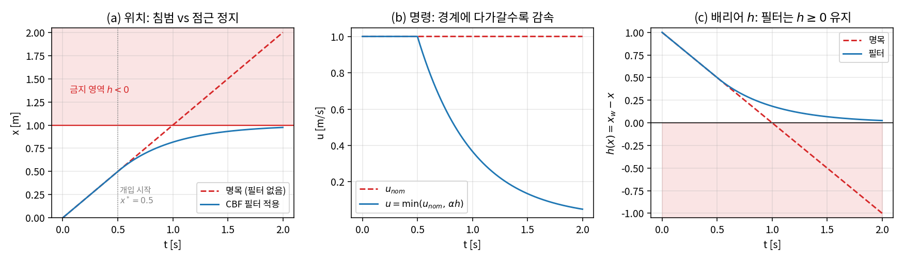
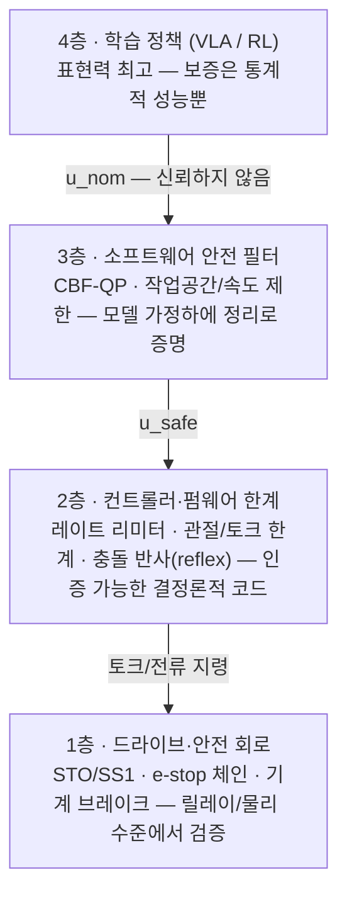
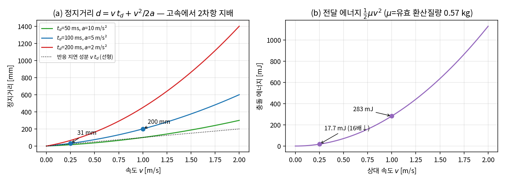
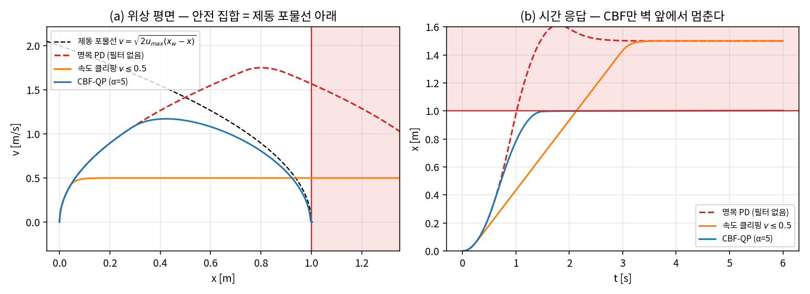
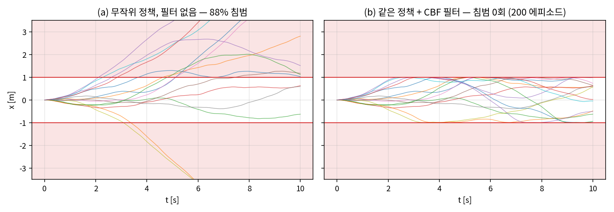
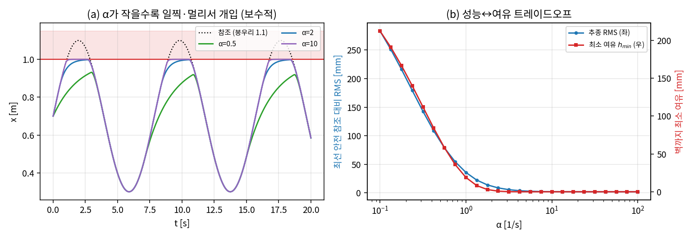
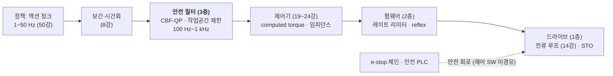

# Lec 61. 안전 계층 — 학습 정책 아래의 마지막 방어선

> 하위제어 트랙 29일차. 선수 지식: 17강(피드백과 안정성), 19강(computed torque), 23강(QP·receding horizon), 50강(action 파이프라인)을 참조하면 좋다.
> 이 주제는 기초 참고서 MR의 범위 밖이다. 이론(CBF)은 Ames et al. 튜토리얼 [1]을, 규격(ISO/IEC)은 공식 소개 페이지 수준으로만 참조한다 — **규격 원문은 유료 문서이므로 구체 수치는 인용하지 않고 개념만 다룬다.**

## 한 장 요약



"전진하라"는 명목 명령($u_{nom}=1$ m/s)을 그대로 실행하면 로봇은 $t=1.0$ s에 벽($x_w=1$)을 뚫는다(빨간 점선). 같은 명령에 **CBF-QP 안전 필터** $u = \min(u_{nom}, \alpha h)$ 한 줄을 끼우면: 경계에서 충분히 먼 동안($x<0.5$)은 명령을 건드리지 않다가, 가까워질수록 속도를 지수적으로 줄여 **경계를 점근적으로만 접근**한다(파란 실선) — 배리어 $h = x_w - x$는 끝까지 양수다(오른쪽 패널). 정책이 무엇을 내놓든, 그 아래에서 안전 집합을 지키는 **최소 개입 투영** — 오늘 강의는 이 방어선이 놓이는 계층 전체(하드웨어 e-stop부터 이 필터까지)를 다룬다.

## 학습 목표

1. 안전 아키텍처의 계층(하드웨어 e-stop → 드라이브 안전 기능 → 펌웨어 한계 → 소프트웨어 필터 → 학습 정책)을 **신뢰 등급(검증 가능성)의 사다리**로 설명할 수 있다.
2. 속도·전력 제한의 물리적 근거 — 충돌 에너지 $\frac{1}{2}\mu v^2$과 정지거리 $v t_d + v^2/2a$ — 를 손으로 계산할 수 있다.
3. ISO 10218/TS 15066의 위치와 4가지 협동 운전 모드, e-stop 정지 카테고리·STO의 개념을 구분할 수 있다.
4. Control Barrier Function 조건($\dot h \geq -\alpha h$)과 CBF-QP 필터를 유도하고, 1-DoF에서 해석해로 구현할 수 있다.
5. 속도 클리핑(반응적)과 CBF(예측적)의 차이를 정지거리 논리로 설명하고, $\alpha$의 보수성 트레이드오프를 정량화할 수 있다.

## 왜 이 강의가 필요한가

이 트랙에서 배운 제어기들은 성질이 증명된 물건이다: computed torque는 오차 동역학의 극점을(19강), 임피던스 제어는 접촉 응답을(21강), MPC는 제약 만족을(23강) 설계 시점에 보증한다. 모델이 20% 틀려도 성능이 **연속적으로** 열화할 뿐 발산하지 않는 것까지 봤다(19강 WE-3). 그런데 이 스택의 꼭대기에 올라오는 학습 정책은 그런 보증이 하나도 없다 — 57강의 LIBERO-Plus가 보여주듯, 조명·시점 같은 교란 하나에 성공률 95%가 30%로 무너지는 물건이고, 무너지는 순간 어떤 액션을 내놓을지 아무도 모른다. 50강은 이 문제를 한 줄로 정리했다: *"학습 정책의 안전은 아직 '아래층 고전 장치들에 위임'이 실무 표준이다."* 오늘은 그 "아래층"을 연다 — 릴레이와 브레이크의 세계(e-stop)부터, 규격이 정한 협동 운전의 문법(ISO 10218/TS 15066), 그리고 정책 출력을 실시간으로 교정하는 수학적 방어선(CBF-QP)까지. 62강에서 두 스택을 통합하기 전, 마지막 부품이다.

## 본문

### 1. 신뢰의 사다리 — 안전은 기능이 아니라 아키텍처다

로봇의 안전은 한 장치가 아니라 **서로를 신뢰하지 않는 계층들의 직렬 구조**다. 위층이 미쳐도 아래층이 막는다:



내려갈수록 세 가지가 함께 변한다. ① **표현력이 준다**: 4층은 "빨래를 개라"를 이해하지만 1층은 "전원을 끊는다"만 안다. ② **신뢰가 는다**: 신뢰는 성능이 아니라 **검증 가능성**에서 나온다 — 릴레이와 브레이크는 수학 없이 감사(audit)할 수 있고, 펌웨어 한계는 결정론적 코드라 정적 검증이 되고, CBF 필터는 모델 가정하에 정리(E2)로 증명되고, 신경망은 테스트 성공률이라는 통계 외에 내밀 것이 없다. ③ **반응이 단순해진다**: 위층은 "더 잘 하기"를, 아래층은 "멈추기"만을 맡는다.

각 층의 실물을 짚어 두자:

- **1층 — e-stop과 드라이브 안전 기능.** 비상정지의 거동은 **정지 카테고리**로 분류된다(IEC 60204-1의 개념 [4]): **카테고리 0**은 액추에이터 전원 즉시 차단(무제어 정지 — 로봇은 관성과 브레이크에 맡겨진다), **카테고리 1**은 제어된 감속 후 전원 차단, **카테고리 2**는 전원을 유지한 채 제어 정지(정지 상태를 감시). 드라이브 수준에서는 이에 대응하는 안전 기능이 표준화되어 있다(IEC 61800-5-2의 개념 [4]): **STO**(Safe Torque Off — 토크 생성 자체를 회로 수준에서 차단), **SS1**(감속 후 STO), **SS2**(감속 후 정지 감시, 전원 유지), **SLS**(안전 속도 제한 감시). 핵심은 이들이 **제어 소프트웨어를 경유하지 않는 별도 안전 회로**로 구현된다는 것 — 4층이 어떤 코드를 실행하든 물리적으로 끊을 수 있다.
- **2층 — 펌웨어 한계.** 50강에서 본 Franka가 표준적인 예다 [5]: 사용자(또는 정책)가 보내는 1 kHz 토크·위치 지령에 가속도·저크·토크레이트 **리미터**가 무조건 적용되고, 관절 한계·속도 한계·추정 외력(59강의 모멘텀 옵저버가 여기서 일한다)이 임계를 넘으면 **reflex**가 발동해 운동을 정지시킨다. 전력 제한도 이 층의 단골이다: 14강에서 봤듯 토크는 전류에 비례하므로, 전류 상한과 모터 전력 상한($P = \tau\omega$)은 로봇이 낼 수 있는 운동 에너지의 총량을 하드웨어 가까이에서 캡핑한다.
- **3층 — 소프트웨어 안전 필터.** 오늘의 주인공. 정책 출력과 제어기 사이에서 명령을 실시간으로 **최소 수정**한다(§3~4).
- **4층 — 정책.** 잘 하라고 두는 층이지 믿으라고 두는 층이 아니다.

1층의 어휘를 카드 한 장으로 압축하면 (분류 개념만 — 원문 유료 [4]):

| 어휘 | 뜻 | 전원 | 체감 |
|---|---|---|---|
| 정지 카테고리 0 | 즉시 전원 차단 — 무제어 정지 | 차단 | 브레이크·관성에 맡긴다. 들고 있던 것은 떨어진다 |
| 정지 카테고리 1 | 제어된 감속 후 전원 차단 | 감속 후 차단 | 산업 e-stop의 흔한 기본값 |
| 정지 카테고리 2 | 전원 유지 + 제어 정지 + 정지 상태 감시 | 유지 | 재시작이 빠르다 — 협동 "감시 정지" 모드의 바탕 |
| STO | 토크 생성을 회로 수준에서 차단 | — | 드라이브판 카테고리 0 |
| SS1 / SS2 | 감속 후 STO / 감속 후 정지 감시 | — | 드라이브판 카테고리 1 / 2 |
| SLS | 속도가 한계 이하인지 **감시**, 위반 시 안전 정지 | 유지 | "충분히 느리면 계속 일해도 된다"를 성립시키는 장치 |

그리고 마지막 어휘 하나 — 이 안전 기능들 **자체**의 고장은 누가 막나? 기능 안전 규격은 안전 기능의 신뢰성을 별도의 등급으로 매긴다(ISO 13849-1의 Performance Level, IEC 61508/62061 계열의 SIL — 역시 개념만 [4]). 등급은 성능이 아니라 **구조**로 달성된다: 이중 채널 회로(한 가닥이 용착돼도 다른 가닥이 끊는다), 주기적 자기 진단, 고장 이력이 검증된 부품. e-stop 버튼에서 릴레이까지가 두 가닥 배선인 이유, 센서·PLC에 붙는 "안전 정격(safety-rated)"이라는 수식어가 뜻하는 것이 이것이다 — §2의 협동 모드가 요구하는 모든 "감시"는 이 안전 정격 장치의 몫이다. 신뢰의 사다리는 층 사이만이 아니라 **층 안에도** 있다.

### 2. 규격의 지형 — ISO 10218과 TS 15066 (개념만)

사람 곁에서 도는 로봇의 안전 문법은 국제 규격이 정한다. 원문은 유료이므로 **지도만** 그린다:

| 문서 | 무엇을 다루나 | 오늘의 관점에서 |
|---|---|---|
| **ISO 10218-1/-2** [3] | 산업 로봇(–1: 로봇 자체)과 로봇 시스템·셀 통합(–2)의 안전 요구사항 일반 — 가드, 안전 기능의 등급, 위험성 평가 절차 | "로봇 안전"의 헌법. 협동 운전 요구사항도 개정을 거치며 이 본 규격 체계로 정비되어 왔다 |
| **ISO/TS 15066** [2] | 협동 로봇 운전(사람과 공간을 공유하는 운전)의 기술 사양 — 협동 모드별 요구사항, **신체 부위별 압력·힘 한계를 표로 정의** | 속도·전력 제한(E1)의 규격적 근거. 구체 한계 수치는 원문에 있고 여기서는 인용하지 않는다 |

TS 15066이 정의하는 **4가지 협동 운전 모드**가 실무 어휘의 뼈대다:

| 협동 모드 | 개념 | 주로 기대는 계층 |
|---|---|---|
| 안전 정격 감시 정지 (safety-rated monitored stop) | 사람이 협동 공간에 들어오면 로봇은 **감시되는 정지 상태**(전원 유지, 카테고리 2/SS2류)로 대기 | 1층 (안전 정격 감시) |
| 핸드 가이딩 (hand guiding) | 사람이 로봇을 직접 잡고 유도 — 인가 장치(enabling device)를 쥔 동안만 저속 운동 | 1~2층 + 21강의 컴플라이언스 |
| 속도·거리 감시 (speed and separation monitoring) | 사람과의 **분리 거리**를 센서로 감시하고, 거리가 줄면 속도를 줄여 "닿기 전에 멈출 수 있음"을 유지 | 2~3층 (E1의 정지거리 산수가 핵심) |
| 동력·힘 제한 (power and force limiting) | 접촉을 **허용**하되, 접촉 시 압력·힘·에너지가 신체 부위별 한계 이하가 되도록 속도·관성·형상을 제한 | 2층 + 기계 설계 (E1의 에너지 산수) |

주의할 것: 협동은 **로봇의 속성이 아니라 애플리케이션의 속성**이다. "협동로봇(cobot)"이라는 판매 문구와 무관하게, 규격의 단위는 로봇+엔드이펙터+작업물+환경을 묶은 **위험성 평가(risk assessment)**다 — 힘 제한이 완벽한 로봇도 칼을 쥐면 협동 운전이 될 수 없다(흔한 오해 4).

한 가지 더 — 속도·거리 감시 모드가 전제하는 "사람 감지"는 누구의 일인가? **안전 정격 센서**(안전 레이저 스캐너, 라이트 커튼, 안전 정격 3D 비전)의 일이다. 여기서 §1의 사다리 논리가 지각에도 그대로 반복된다: 신경망 사람 검출기가 평균 성능에서 아무리 앞서도, "어떤 조건에서 어느 확률로 놓치는가"를 문서화할 수 없으면 안전 기능의 자격이 없다. 안전 레이저 스캐너가 그 자격을 얻는 것은 더 정확해서가 아니라 검출 원리(광 경로의 차단)가 단순해서 **실패 모드를 열거할 수 있기** 때문이다. 학습 지각을 안전 경로에 넣는 것은 열린 연구 문제고, 현재의 실무 답은 분리다: 학습 지각은 4층(태스크 성능)에서 일하고, 안전 감시는 1층(안전 정격 센서)이 맡는다 — 같은 카메라 픽셀을 두 층이 공유하지 않는다(토론 질문 1의 독립성).

### 3. 핵심 수식

#### E1. 충돌 에너지와 정지거리 — 속도 제한의 물리

**직관**: 위 표의 마지막 두 모드는 결국 두 개의 초등 물리 공식이다. "부딪혀도 되려면 얼마나 느려야 하나"(에너지)와 "닿기 전에 멈추려면 얼마나 멀리서 알아야 하나"(정지거리).

**물리·기하적 의미**: 로봇과 사람이 상대 속도 $v$로 충돌할 때 접촉부로 전달되는 에너지는 두 질량의 **환산 질량(reduced mass)**으로 결정된다 — 벽에 붙은 손(유효 질량 큼)과 자유로운 손(작음)이 다르게 다치는 이유. 정지거리는 "알아챌 때까지 가는 거리"(지연 $t_d$ 동안 등속)와 "브레이크 거리"($v^2/2a$)의 합인데, **후자가 $v$의 2차**라 고속에서 지배한다 — 속도 제한이 안전에 그토록 효과적인 이유다.

**형식**: 유효 질량 $m_R$(로봇 측), $m_H$(신체 부위)에 대해

$$
E = \frac{1}{2}\mu v^2, \quad \mu = \left(\frac{1}{m_R} + \frac{1}{m_H}\right)^{-1}, \qquad
d_{stop} = v\, t_d + \frac{v^2}{2a}
$$

속도·거리 감시 모드의 논리는 "분리 거리 > $d_{stop}$ + 그동안 사람이 다가오는 거리"의 유지이고, 동력·힘 제한 모드의 논리는 "$E$(및 접촉 힘·압력)를 신체 부위별 한계 이하로"다 — TS 15066은 그 한계를 부위별 표로 정의한다 [2] (수치는 원문 참조).

#### WE-1 (손): 속도를 4배 줄이면 무엇이 몇 배 줄어드나

지연 $t_d = 100$ ms, 제동 감속 $a = 5$ m/s², 유효 질량 $m_R = 10$ kg, $m_H = 0.6$ kg(가상의 예)로:

$$
v = 1.0: \; d = 100 + \tfrac{1000}{10} = 200\text{ mm}, \qquad
v = 0.25: \; d = 25 + 6.25 = 31.25\text{ mm} \;(6.4\text{배}\downarrow)
$$

에너지는 $\mu = (1/10 + 1/0.6)^{-1} = 0.566$ kg으로 $E(1.0) = 283$ mJ, $E(0.25) = 17.7$ mJ — 정확히 $4^2 = 16$배 감소. **속도는 거리에는 초선형, 에너지에는 제곱으로 듣는다.** 검증:

```python
mu = 1/(1/10 + 1/0.6)                       # 0.566 kg
for v in (1.0, 0.25):
    print(v, v*0.10 + v**2/(2*5), 0.5*mu*v**2)   # 0.200 m / 0.03125 m, 0.283 J / 0.0177 J
```



*그림 2: (a) 정지거리 — 점선(반응 지연 성분)과의 간극이 2차항. 지연 200 ms·감속 2 m/s²의 열악한 조건(빨강)에서는 1 m/s가 이미 450 mm를 요구한다. (b) 전달 에너지는 순수 제곱 곡선. 협동 운전에서 보게 되는 "왜 이렇게 느리게 움직이나"는 이 두 곡선의 산수다.*

#### E2. Control Barrier Function — 안전을 "집합의 불변성"으로 바꾼다

**직관**: 안전을 "충돌 없음"이라는 사건의 부정으로 다루면 잡을 수가 없다. 대신 **안전한 상태들의 집합** $\mathcal{S}$를 함수 하나로 정의하고($h(x) \geq 0$이면 안전), 요구를 딱 하나로 줄인다: *"$h$는 잔고다 — 잔고가 적을수록 인출 속도를 줄여라."* 경계에서 멀 때는 아무래도 좋고, 경계에 붙을수록($h \to 0$) 경계로 향하는 운동이 0으로 조여진다.

**물리·기하적 의미**: 조건 $\dot h \geq -\alpha h$를 적분하면 $h(x(t)) \geq h(x(0))\, e^{-\alpha t}$ — 양수에서 출발한 잔고는 지수적으로 얇아질 수는 있어도 **유한 시간에 0을 뚫지 못한다**. 즉 $\mathcal{S}$가 **전방 불변(forward invariant)**이 된다. 10강·19강의 Lyapunov 논증과 쌍둥이지만 목표가 다르다: Lyapunov는 "한 점으로 수렴"($\dot V \leq 0$, 잔고를 줄여라)을, CBF는 "집합에서 안 나감"($\dot h \geq -\alpha h$, 잔고를 다 쓰지 마라)을 증명한다.

**형식**: 제어 아핀 시스템 $\dot x = f(x) + g(x)u$에서, $h$가 **CBF**라는 것은 모든 $x$에서

$$
\sup_{u}\; \underbrace{L_f h(x) + L_g h(x)\, u}_{\dot h} \;\geq\; -\alpha\, h(x)
$$

를 만족시키는 $u$가 존재한다는 것($L_f h = \nabla h \cdot f$는 방향 미분, $\alpha$는 양수 — 원전의 일반형은 확장 class-$\mathcal{K}_\infty$ 함수 $\alpha(h)$). 이 조건을 지키는 임의의 (Lipschitz) 제어기는 $\mathcal{S}$를 불변으로 만든다 — 정확한 정리와 증명은 Ames et al. [1]의 Theorem 2.

#### E3. CBF-QP 필터 — 정책 출력의 최소 개입 투영

**직관**: E2는 "이런 $u$가 존재한다"까지만 말한다. 필터는 그중 **명목 명령에 가장 가까운 것**을 고른다: 정책이 낸 $u_{nom}$이 안전 조건을 이미 만족하면 그대로 통과시키고, 위반할 때만 조건을 만족하는 가장 가까운 점으로 끌어온다 — "필요할 때만, 필요한 만큼만."

**물리·기하적 의미**: 제약이 $u$에 대해 아핀(반평면)이므로 이것은 **반평면 위로의 유클리드 투영**이고, QP지만 제약이 하나면 닫힌 형식 해가 있다:

$$
u^* = u_{nom} + \frac{\max\!\big(0,\; -\psi(x, u_{nom})\big)}{\|L_g h\|^2}\, (L_g h)^\top, \qquad \psi = L_f h + L_g h\, u_{nom} + \alpha h
$$

$\max(0, \cdot)$ — **ReLU 하나짜리 출력 레이어**다. 위반량이 양수일 때만, 제약의 법선 방향으로만 민다.

**형식**:

$$
u^* = \arg\min_u \tfrac{1}{2}\|u - u_{nom}\|^2 \quad \text{s.t.} \quad L_f h(x) + L_g h(x)\, u \geq -\alpha h(x)
$$

1-DoF 최소 예제($\dot x = u$, 벽 $x_w$, $h = x_w - x$)에서는 $L_f h = 0$, $L_g h = -1$이라 제약이 $u \leq \alpha h$로 줄고, 필터 전체가 한 줄이 된다:

$$
u^* = \min\big(u_{nom},\; \alpha\,(x_w - x)\big)
$$

— **"벽까지 남은 거리에 비례하는 속도 제한"**. 제약이 여러 개(관절 한계 + 자기충돌 + 사람 거리)면 닫힌 형식은 사라지고 진짜 QP 솔버가 필요해진다(23강에서 쓴 것과 같은 부류; 실물에서는 OSQP류를 1 kHz에서 돌린다. cvxpy로 짜려면 `pip install cvxpy` — 이 강의의 검증 코드는 전부 해석해라 필요 없다).

### 4. Worked Examples

#### WE-2 (손 + 코드): 벽으로 돌진하는 명령을 필터가 받아내는 궤적

한 장 요약(그림 1)의 설정: $\dot x = u$, $x_w = 1$, $u_{nom} = 1$ m/s(상수 — "전진"만 아는 나쁜 정책), $\alpha = 2$, $x(0) = 0$.

**손계산**: 필터는 $u_{nom} > \alpha(1-x)$가 되는 순간, 즉 $x^* = 1 - u_{nom}/\alpha = 0.5$에서 개입한다(도달 시각 $t^* = 0.5$ s). 이후 동역학은 $\dot x = \alpha(1-x)$ — 1차 선형이므로

$$
x(t) = 1 - 0.5\, e^{-2(t - 0.5)} \;\Rightarrow\; x(1.5) = 1 - 0.5 e^{-2} = 0.93233, \quad h(2.0) = 0.5 e^{-3} = 0.0249
$$

**검증 코드** (전체: `images/lec61/gen_figs.py`):

```python
import numpy as np
x_w, alpha, dt = 1.0, 2.0, 1e-3
x = 0.0
for t in np.arange(0, 2.0, dt):
    u = min(1.0, alpha*(x_w - x))        # CBF-QP 해석해 (E3)
    x += dt*u
```

출력: $x(1.5) = 0.93247$(해석해와 차 $1.35\times10^{-4}$ — Euler 이산화 잔차), $\min h = h(2.0) = 0.0248 > 0$. 무필터는 $t = 1.0$ s에 벽을 통과해 $x(2.0) = 2.0$(침범 1 m). 그림 1의 세 패널이 이 수치들이다.

#### WE-3 (코드): 속도 클리핑 vs CBF — 반응적 제한은 관성을 모른다

관성이 있는 순간 이야기가 달라진다. 이중적분기 $\ddot x = u$, $|u| \leq u_{max} = 2$ m/s², 벽 $x_w = 1$, 명목 제어는 벽 **너머**의 목표 $x_t = 1.5$로 향하는 PD. 세 가지를 비교한다:

- **명목**: 필터 없음.
- **속도 클리핑**: 속도 명령을 $|v| \leq 0.5$ m/s로 포화 — 실무에서 가장 흔한 "안전 조치".
- **CBF**: 위치만의 $h = x_w - x$는 여기서 못 쓴다 — $\dot h = -v$에 $u$가 등장하지 않는다(상대 차수 2). 실무적 해법은 **정지거리를 배리어 안에 넣는 것**:

$$
h(x, v) = (x_w - x) - \frac{\max(v, 0)^2}{2 u_{max}} \;\;\Rightarrow\;\; \dot h \geq -\alpha h \;\Leftrightarrow\; u \leq u_{max}\Big(\frac{\alpha h}{v} - 1\Big) \;\; (v > 0)
$$

"지금 이 속도에서 최대 제동으로 멈출 수 있는가"를 상태에 새긴 것 — $h \to 0$이면 허용 입력이 $-u_{max}$(전력 제동)로 조여지고, 그 제동은 정의상 실현 가능하다. 결과(`gen_figs.py`):

| 방식 | 벽 충돌 속도 | 벽까지 최소 여유 | 판정 |
|---|---|---|---|
| 명목 PD | **1.567 m/s** | −615.8 mm (침투) | 충돌. 침투 깊이는 정지거리 공식 예측 $v^2/2u_{max} = 613.9$ mm와 일치 |
| 속도 클리핑 0.5 m/s | **0.500 m/s** | −500 mm (벽 안의 목표에 정착) | 에너지는 9.8배 줄지만 **충돌은 그대로** |
| CBF ($\alpha=5$) | 없음 | −3.0 mm | 제동 포물선을 타고 경계에서 정지 |



*그림 3: (a) 위상 평면. 안전 집합은 제동 포물선 $v = \sqrt{2u_{max}(x_w - x)}$ 아래다. 클리핑(주황)은 낮은 속도로 **수평 이동**해 그대로 벽을 통과하고, CBF(파랑)는 포물선에 붙어 감속하며 경계에서 멈춘다. (b) 시간 응답 — 벽 앞에서 멈추는 것은 CBF뿐.*

읽는 법: 클리핑은 **위치를 모르는 반응적 제한**이다. 0.5 m/s가 안전하려면 벽 $v_{cap}^2/2u_{max} = 62.5$ mm 앞에서는 제동이 시작돼야 한다는 정보가 클리핑에는 없다. CBF는 그 정보(정지거리)를 $h$에 내장한 **예측적 제한** — E3의 1-DoF 해석해가 "거리에 비례하는 속도 제한"이었던 것의 일반화다. 한편 CBF의 −3.0 mm 침투는 연속시간 보증과 1 kHz 이산 실행 사이의 잔차다: 배리어에 마진을 넣어 $x_w - \delta$($\delta = 5$ mm)로 정의하면 실제 벽 기준 여유 **+3.15 mm**로 닫힌다 — 실무에서 마진 없는 배리어를 쓰지 않는 이유(§WE-4의 이산화 실험도 참조).

#### WE-4 (코드): 무작위 정책 + 필터 — 그리고 $\alpha$라는 다이얼

"학습 정책 아래의 안전 필터"의 미니어처: 이중적분기에 벽을 양쪽($|x| \leq 1$)에 세우고, 정책은 **50 ms마다 균일 난수 가속도** $u \sim U(-2, 2)$를 내는 최악의 정책이다. 200 에피소드 × 10 s(`gen_figs.py`):

- 무필터: **176/200 에피소드(88.0%)가 침범**.
- 같은 정책 + CBF 필터($\alpha = 5$): **침범 0회**, 최소 여유 +0.20 mm. 필터가 명령을 수정한 스텝은 전체의 **8.4%** — 나머지 91.6%는 정책 출력이 그대로 통과했다.



*그림 5: 같은 무작위 정책 15개 에피소드. (a) 필터 없음 — 궤적이 사방으로 샌다. (b) 필터 — 궤적이 $[-1, 1]$ 상자 안에 갇힌다. 정책의 품질과 무관하게 성립하는 것이 불변성 보증의 힘이다.*

**$\alpha$ 스윕 — 보수성의 값**. $\alpha$는 "경계 접근을 얼마나 일찍 조이나"의 다이얼이다. 1차 시스템 추종 문제(참조가 주기적으로 벽을 0.1 m 넘어가는 사인파)로 정량화하면:

| $\alpha$ | 달성 가능 최선 참조 대비 RMS | 벽까지 최소 여유 |
|---|---|---|
| 0.5 | 90.33 mm | 68.4 mm |
| 2 | 11.56 mm | 1.79 mm |
| 10 | 2.20 mm | $6.4\times10^{-10}$ m (사실상 0) |



*그림 4: (a) $\alpha = 0.5$(초록)는 벽 근처가 아닌 곳에서도 추종을 방해한다 — 과보수적 guardrail은 태스크 성능을 먹는다. $\alpha = 10$(보라)은 벽에 닿기 직전까지 추종한다. (b) 성능과 여유는 정확히 맞교환된다.*

단, $\alpha$를 올리는 데는 숨은 상한이 있다: 보증은 **연속시간** 정리다. $\alpha = 200$을 $dt = 1$ ms로 돌리면 무사하지만($\alpha \cdot dt = 0.2$), 같은 $\alpha$를 $dt = 20$ ms로 돌리면($\alpha \cdot dt = 4$) 최소 $h = -7.95$ mm — **침범한다**. 필터의 실행 주기가 느릴수록(예: 정책 주기에서 돌릴수록) $\alpha$는 보수적이어야 하고, 마진 $\delta$가 필요하다. 필터를 어느 층의 주기에서 돌릴 것인가(58강의 주기 계층)가 설계 변수가 되는 이유다.

### 5. 스택 속의 필터 — 학습 정책과 안전 계층의 결선

오늘 배운 부품들이 50강의 파이프라인에 꽂히는 자리:



세 가지 관찰. ① Franka의 레이트 리미터와 reflex(50강 [5])는 2층이다 — 정책이 무엇을 보내든 가속도·저크·토크레이트가 잘리고, 추정 외력이 임계를 넘으면 멈춘다. 우리가 오늘 만든 CBF 필터는 그 **위**에 놓이는 3층으로, "관절 한계를 안 넘게"보다 훨씬 풍부한 명세(작업공간의 금지 영역, 사람과의 거리)를 다룰 수 있다. ② temporal ensembling이나 저역 필터(50강)는 안전 계층이 **아니다** — 평활화는 명령을 부드럽게 할 뿐 어떤 집합도 불변으로 만들지 않는다. ③ 3층의 보증은 조건부다: 동역학 모델($f, g$), $h$의 올바름, 실행 주기(WE-4의 이산화), 입력 한계와의 정합(WE-3의 제동 거리 배리어)이 전제이고 — 그 전제들이 1~2층보다 복잡하기 때문에 3층은 1~2층을 **대체하지 못하고 그 위에 얹힌다**. 사다리는 아래가 없으면 서지 않는다.

이 절을 체크리스트로 접으면 — 학습 정책을 실기에 올리기 전에 물을 다섯 가지:

1. **최악의 명령**: 정책이 낼 수 있는 가장 나쁜 출력은 무엇이고, 어느 층이 그것을 받아내는가? (2층 리미터·reflex 임계를 숫자로 확인)
2. **명세 일치**: 3층 필터의 $h$ 목록은 위험성 평가(§2)의 위험 목록과 일치하는가? $h$에 없는 위험은 필터에 투명하다(오해 3).
3. **주기 정합**: 필터가 실제로 돌 주기에서 $\alpha$와 마진 $\delta$를 검증했는가? (WE-4의 이산화 실험 — 배포 주기가 바뀌면 재검증)
4. **개입 로깅**: 필터 개입률을 기록·감시하는가? 개입률 급증은 정책 열화(OOD 진입)의 조기 경보다 — WE-4의 8.4%가 그런 베이스라인의 예.
5. **경로 독립**: e-stop 체인이 정책·필터 코드를 경유하지 않음을 배선 수준에서 확인했는가? (1층의 존재 이유)

62강에서 두 트랙의 스택을 통합할 때, 이 다섯 줄이 안전 파트의 골격이 될 것이다.

### 딥러닝 배경자를 위한 번역

- **CBF-QP 필터는 출력 레이어에 붙은 projection layer다.** 정책 네트워크의 출력을 제약 집합(반평면 교집합)에 유클리드 투영하는 층 — E3의 닫힌 형식이 보여주듯 제약 하나면 문자 그대로 ReLU다. 차이는 제약이 데이터가 아니라 **물리(동역학 + 정지거리)에서 유도**된다는 것. QP 층을 미분 가능하게 만들어 필터를 통과한 그래디언트로 정책을 훈련하는 연구 방향도 있다 — 그때 필터는 "훈련 중에도 켜져 있는 구조적 prior"가 된다.
- **안전 필터는 LLM 안전 필터와 구조가 같다 — 그리고 한계도 같다.** 모델(정책)은 건드리지 않고, 출력을 런타임에 검사해 위반만 수정/차단하는 guardrail. 동형인 것: 명세된 위반만 잡는다($h$에 안 쓴 위험 = 필터에 없는 금칙어), 과보수적이면 유용성이 죽는다(그림 4a의 $\alpha=0.5$ = 과민한 거부), 개입 빈도가 정책 품질의 진단 신호다(WE-4의 8.4%). 다른 것: 로봇의 위반은 **되돌릴 수 없고**, 마감이 밀리초 단위라 "사람 검토로 에스컬레이션"이 없다 — 그래서 텍스트 세계보다 형식적 보증(E2)에 집착한다.
- **신뢰의 사다리는 검증 가능성의 계층이고, 학습 모델이 최하 등급인 이유는 명세가 없기 때문이다.** 릴레이는 회로도로, 펌웨어는 코드 감사와 정적 분석으로, CBF는 정리와 가정 목록으로 "왜 안전한가"를 **문서화**할 수 있다. 신경망이 내밀 수 있는 것은 테스트 분포에서의 성공률뿐 — 그것은 i.i.d. 가정이 깨지는 순간(OOD) 무효가 되는 보증이다(19강 번역 박스의 "연속적 열화 vs 절벽"과 같은 대비). 안전공학의 관점: **주장(claim)이 아니라 논증(argument)이 등급을 정한다.**
- **$\alpha$는 guardrail의 threshold 튜닝과 같은 트레이드오프 축이다** — 낮으면 false positive(멀쩡한 명령 수정 = 태스크 성능 손실), 높으면 마진 소진(여유 $6\times10^{-10}$ m는 "정확도는 높지만 리콜 마진이 0"인 분류기다). 그리고 WE-4의 이산화 실험은 "배포 환경(실행 주기)이 바뀌면 안전 하이퍼파라미터를 재검증해야 한다"는, MLOps에서 익숙한 교훈의 제어판이다.
- **안전 케이스(safety case)는 모델 카드의 엄격한 조상이다.** 기능 안전의 산출물은 장치가 아니라 문서 — "이 시스템이 안전하다"는 주장(claim)을 논증(argument)과 증거(evidence)로 뒷받침하는 구조화된 케이스다. 모델 카드가 "이 모델의 평가 범위와 알려진 한계"를 선언하는 문화의 조상이 여기 있고, 차이는 강제력이다: 안전 케이스는 감사·인증의 대상이며, 빠진 논증은 배포 불가를 뜻한다.

## 흔한 오해

1. **"e-stop이 있으니 안전하다"** — e-stop은 사람이 이상을 **본 뒤** 누르는 장치다: 인지·반응에 수백 ms, 그 위에 E1의 정지거리가 더해진다. 1 m/s로 움직이는 로봇이라면 버튼이 눌리기 전에 이미 수백 mm를 갔다. e-stop은 최후 수단(1층)이고, 안전은 애초에 위험 속도·에너지에 도달하지 않게 하는 **설계 속성**(2~3층 + 위험성 평가)이다. 게다가 "정지"가 항상 안전한 것도 아니다 — 카테고리 0의 무제어 정지는 들고 있던 물건을 떨어뜨린다.
2. **"속도 클리핑을 넣었으니 충돌은 없다"** — WE-3의 반례: 클리핑은 위치를 모르는 반응적 제한이라, 0.5 m/s로 얌전하게 벽을 통과한다. 클리핑이 하는 일은 충돌 **에너지**를 깎는 것(그것도 중요하다 — 동력·힘 제한 모드의 논리)이지 충돌을 막는 것이 아니다. 막으려면 "남은 거리"가 제한에 들어와야 하고, 그것이 CBF다.
3. **"CBF 필터를 달았으니 정책은 아무거나 내도 된다"** — 보증은 (동역학 모델, $h$의 명세, 연속시간/충분히 빠른 주기, 입력 한계 정합)에 조건부다. $h$에 안 쓴 위험은 안 막아주고(테이블 위 컵은 $h$에 없으면 투명하다), 이산화가 거칠면 샌다(WE-4의 −7.95 mm). 또 필터가 자주 개입한다는 것은 정책이 안전 집합 경계에 계속 부딪히고 있다는 뜻 — 태스크 성능은 이미 무너져 있고(그림 4a), 필터와 정책이 서로 밀며 교착(deadlock)할 수도 있다. 필터는 **마지막** 방어선이지 정책 품질의 대체재가 아니다.
4. **"협동로봇을 샀으니 펜스 없이 쓰면 된다"** — 협동 운전의 단위는 로봇이 아니라 **애플리케이션**이다(§2): 같은 로봇도 그리퍼에 무엇을 쥐었는지, 사람이 어느 방향에서 접근하는지에 따라 위험성 평가가 달라진다. "cobot"은 동력·힘 제한 모드를 지원하도록 설계된 로봇이라는 뜻이지, 어떤 사용도 안전하다는 인증이 아니다.

## 실습 (1.5~2시간)

**MuJoCo 2R에 CBF 필터 얹기 — 19강의 computed torque 정책이 금지 영역으로 돌진할 때.** (CPU로 충분, 재현 스크립트: `images/lec61/check_mujoco.py`)

설정: 10강/19강의 2링크(링크 길이 1 m), 19강 WE-2의 원 궤적(중심 $(1.1, 0.3)$, 반경 0.3 m, 2 s/바퀴)을 computed torque로 추종하되, **금지 영역 $x > 1.3$**(벽)을 세운다 — 원의 최대 $x$는 1.4라 명목 궤적이 매 바퀴 0.1 m씩 침범한다.

1. **필터 위치 결정**: 오늘은 필터를 **참조 속도 레벨**(정책과 제어기 사이, §5 다이어그램의 3층)에 놓는다. 참조점 $p_f$를 $\dot p_f = v_f$로 적분하되, $v_{des} = \dot p_{circle} + k_r(p_{circle} - p_f)$의 $x$ 성분에만 E3의 해석해를 적용한다:

```python
v = v_circle[i] + 5.0*(p_circle[i] - p)
v[0] = min(v[0], alpha*(1.3 - p[0]))       # CBF-QP 해석해 — 오늘의 전부
p += dt*v
```

2. 필터된 참조를 해석 IK(7강)로 $q_d(t)$로 바꾸고 수치 미분으로 $\dot q_d, \ddot q_d$를 얻은 뒤, 19강 실습과 동일한 computed torque(`mj_fullM` + `qfrc_bias`)로 1 kHz 추종한다.
3. **재현 목표** (실제 EEF 기준, 2바퀴):

| 설정 | 벽 여유 min [mm] | 원 궤적 대비 RMS [mm] | 필터된 참조 추종 RMS [mm] |
|---|---|---|---|
| 무필터 | **−100.0** (침범) | 0.07 | 0.26 |
| $\alpha = 1$ | +153.1 | 162.44 | 0.24 |
| $\alpha = 5$ | +8.3 | 50.54 | 0.26 |
| $\alpha = 20$ | +0.02 | 39.53 | 0.27 |

   읽을 것: ① 마지막 열이 0.3 mm 밑으로 일정하다 — **제어기(19강)는 결백하다**. 침범도, 그 교정도 전부 참조 레벨의 이야기다. ② $\alpha = 1$은 벽에서 153 mm나 남기고 원을 크게 뭉갠다(과보수). ③ $\alpha = 20$은 여유 0.02 mm — 사실상 벽을 스치며, RMS 39.5 mm는 "물리적으로 침범 없이 원을 그리는" 데 필요한 최소 왜곡에 접근한 값이다.
4. **α 스윕**: $\alpha \in \{0.5, 1, 2, 5, 10, 20, 50\}$으로 여유·RMS 곡선을 그려 그림 4(b)의 2R판을 만들어라. $\alpha = 50$쯤에서 이산화 침범(음수 여유)이 나타나는가? 나타나면 $dt$와 마진 $\delta$로 복구해 보라(WE-3 말미).
5. **정책을 진짜로 나쁘게**: 참조 속도에 50 ms 홀드의 난수 교란(±0.5 m/s)을 더해 WE-4를 2R에서 재연하라. 필터 유무로 침범 횟수를 세면?
6. **(심화)** 필터를 참조 레벨이 아니라 **가속도 레벨**(computed torque의 $a_{ref}$에, WE-3의 제동 거리 배리어로)로 옮겨 보라. 자코비안 $\dot p = J\dot q$(5강)로 태스크 공간 제약을 관절 가속도 제약으로 바꿔야 한다 — 제약이 2개 이상이 되는 순간 닫힌 형식이 사라지는 것을 확인하고, `scipy.optimize.minimize`(또는 능동 집합 손구현)로 QP를 풀어라.

## Claude와 토론할 질문

1. 신뢰의 사다리에서 각 층의 **실패 모드**를 하나씩 들어 보라(릴레이 용착, 펌웨어 버그, 모델 오차, OOD). 위층의 실패를 아래층이 받아내는 구조가 성립하려면 각 층의 실패가 서로 **독립**이어야 한다 — 이 독립성이 깨지는 시나리오(예: 같은 상태 추정기를 2층과 3층이 공유)는?
2. CBF-QP와 MPC(23강)는 둘 다 "제약 있는 QP"다. 한 스텝짜리 CBF와 호라이즌 $N$짜리 MPC의 차이를 계산 예산·보증의 종류(불변성 vs 예측 최적성)·필요한 모델의 양으로 비교하라. CBF는 왜 "MPC의 마지막 한 스텝만 남긴 것"이 아닌가?
3. $h$의 설계가 곧 안전 명세다: 2R에서 자기충돌·관절 한계·사람과의 거리 세 가지를 각각 $h_i$로 쓰고, 세 제약을 한 QP에 넣을 때 생기는 문제(실행 가능 집합이 비는 경우, 어느 제약을 완화할지의 우선순위 — 24강의 태스크 위계와 닮은 구조)를 논하라.
4. WE-3에서 위치만의 $h = x_w - x$는 상대 차수 문제로 실패했고, 정지거리를 넣은 $h$로 해결했다. 토크 입력(상대 차수 3+)이라면? 고차 CBF(HOCBF)의 아이디어를 "배리어의 배리어"로 설명해 보라.
5. $h$나 동역학 모델을 **학습**으로 얻으면(learned CBF, learned dynamics) 이 장치는 사다리의 몇 층인가? "증명은 있는데 가정이 학습됨"인 시스템의 신뢰 등급을 어떻게 매겨야 하나 — 3층의 자격은 수학인가, 가정의 검증 가능성인가?
6. LLM guardrail과 로봇 안전 필터의 동형성(번역 박스)을 밀고 나가면: LLM의 "jailbreak"에 해당하는 로봇 시나리오는 무엇인가? 정책이 필터의 $h$를 알고 있을 때(RL 훈련 중 필터가 켜져 있었을 때) 경계를 악용하는 행동이 학습될 수 있는가?
7. π*0.6/RECAP류의 실기 RL post-training(45강) 중에는 탐험이 필요하다. 안전 필터가 탐험 액션을 수정하면 정책이 받는 학습 신호는 "자기가 낸 액션"과 "실행된 액션"이 어긋난다 — off-policy 문제의 안전판이다. 이 어긋남을 다루는 설계(필터 인지 학습, 개입을 페널티로)를 제안해 보라.

## 읽을거리

1. **Ames et al., "Control Barrier Functions: Theory and Applications"** [1] §I~II (~40분): E2·E3의 원전. Theorem 2(불변성)와 §II-C(CBF-QP)까지 읽으면 오늘 범위는 완주 — §III(applications)은 훑기만.
2. **Franka FCI 문서의 한계·reflex 관련 절** [5] (~15분): 2층의 실물 카탈로그. 50강에서 본 레이트 리미터가 어떤 값들을 어떻게 자르는지.
3. (선택) ISO 공식 페이지의 10218/TS 15066 소개 [2][3] (~10분): 규격 지도의 원본 확인 — 원문 구매 없이 초록과 목차 수준.

## 자가 점검

1. 신뢰의 사다리 4층을 각 층의 보장 내용·검증 방식과 함께 말할 수 있는가? "신뢰는 검증 가능성에서 나온다"를 층별 예로 설명할 수 있는가?
2. $v = 1$ m/s, $t_d = 100$ ms, $a = 5$ m/s²의 정지거리(200 mm)와, 속도를 1/4로 줄일 때 에너지가 16배 주는 이유를 30초 안에 계산할 수 있는가?
3. CBF 조건 $\dot h \geq -\alpha h$에서 $h(t) \geq h(0)e^{-\alpha t}$를 거쳐 전방 불변성까지의 논증을 재현하고, Lyapunov 조건과의 차이를 말할 수 있는가?
4. 1-DoF 필터의 해석해 $u = \min(u_{nom}, \alpha h)$와 개입 시작점 $x^* = x_w - u_{nom}/\alpha$를 유도할 수 있는가?
5. 속도 클리핑과 CBF의 차이를 WE-3의 수치(0.5 m/s로 충돌 vs 경계 정지, 제동 개시 필요 거리 62.5 mm)로 설명하고, $\alpha$·실행 주기·마진 $\delta$의 삼각관계를 말할 수 있는가?

## 참고문헌

> 웹 문서는 2026-07-09 접속 기준.

[1] A. D. Ames, S. Coogan, M. Egerstedt, G. Notomista, K. Sreenath, P. Tabuada, "Control Barrier Functions: Theory and Applications," European Control Conference (ECC), 2019. arXiv:1903.11199. https://arxiv.org/abs/1903.11199
— **뒷받침**: E2의 CBF 정의·전방 불변성 정리(Theorem 2)·class-$\mathcal{K}$ 일반형, E3의 CBF-QP 안전 필터 정식화와 "최소 개입" 해석 (§II).

[2] ISO, "ISO/TS 15066:2016 — Robots and robotic devices — Collaborative robots." https://www.iso.org/standard/62996.html
— **뒷받침**: §2 — 협동 운전 4모드(안전 정격 감시 정지/핸드 가이딩/속도·거리 감시/동력·힘 제한)의 정의, 신체 부위별 압력·힘 한계를 표로 정의한다는 사실. **원문 유료 — 구체 한계 수치는 미인용, 개념만 사용.**

[3] ISO, ISO 10218 시리즈(-1: 로봇, -2: 로봇 시스템·통합) — Robotics — Safety requirements. https://www.iso.org (카탈로그에서 "ISO 10218" 검색)
— **뒷받침**: §2 — 산업 로봇 안전 요구사항 일반 규격이라는 위치, 위험성 평가가 애플리케이션 단위라는 개념. **원문 유료 — 미인용, 개념만.**

[4] IEC/ISO 기능 안전 규격군: IEC 60204-1(기계 전기장비 안전 — 정지 카테고리 0/1/2), IEC 61800-5-2(가변속 드라이브의 안전 기능 — STO/SS1/SS2/SLS), ISO 13849-1(안전 관련 제어부 — Performance Level), IEC 61508/62061(기능 안전 — SIL). https://webstore.iec.ch · https://www.iso.org
— **뒷받침**: §1의 정지 카테고리·드라이브 안전 기능 분류(어휘 카드 표 포함)와 안전 기능 자체의 신뢰성 등급(PL/SIL)이라는 개념. **원문 유료 — 미인용, 개념(분류 체계)만.**

[5] Franka Robotics, FCI(Franka Control Interface) 문서. https://frankarobotics.github.io/docs/
— **뒷받침**: §1·§5 — 2층(펌웨어 한계)의 실례: 토크·위치 지령에 대한 가속도·저크·토크레이트 리미터, 한계 위반 시 reflex 정지 (50강·19강와 동일 출처).

[6] Google DeepMind, MuJoCo 문서. https://mujoco.readthedocs.io
— **뒷받침**: 실습의 `mj_fullM`/`qfrc_bias`/`qfrc_applied`/`site` API 의미론 (11강·19강와 동일 출처).

*수치 재현성: 본문·그림의 모든 수치(WE-1의 정지거리 200/31.25 mm(6.4배)와 에너지 283/17.7 mJ(16배, $\mu = 0.566$ kg), WE-2의 개입점 $x^* = 0.5$·$x(1.5)$ 시뮬 0.93247 vs 해석 0.93233(차 $1.35\times10^{-4}$)·$h(2.0) = 0.0248$·명목 벽 통과 $t = 1.0$ s, WE-3의 충돌 속도 1.567/0.500 m/s·침투 615.8 mm(예측 613.9 mm)·에너지 비 9.8배·CBF 여유 −3.02 mm와 마진 $\delta = 5$ mm 적용 시 +3.15 mm·클리핑 제동 개시 거리 62.5 mm, WE-4의 침범 176/200(88.0%) vs 0/200·최소 여유 +0.20 mm·개입 비율 8.4%, α 스윕 표(90.33/11.56/2.20 mm, 68.4 mm/1.79 mm/$6.4\times10^{-10}$ m)와 이산화 실험($\alpha = 200$: $dt = 1$ ms 무침범, $dt = 20$ ms에서 min h = −7.95 mm))는 `images/lec61/gen_figs.py`의, 실습 재현 표(무필터 −100.0 mm/0.07 mm, $\alpha = 1/5/20$의 +153.1/+8.3/+0.02 mm와 162.44/50.54/39.53 mm, 참조 추종 RMS 0.24~0.27 mm)는 `images/lec61/check_mujoco.py`의 실행 출력이다 — numpy 1.26 / mujoco 3.2.5 기준 재현 확인.*

<!-- lecture-nav -->

---

⬅ 이전: [Lec 60. 시스템 식별과 캘리브레이션 — 고전판 "학습"](lec60-system-identification-calibration.md)　｜　[📖 전체 목차](../README.md)　｜　다음: [Lec 62. 종합 — 두 스택이 만나는 곳](lec62-two-stacks-meet.md) ➡
