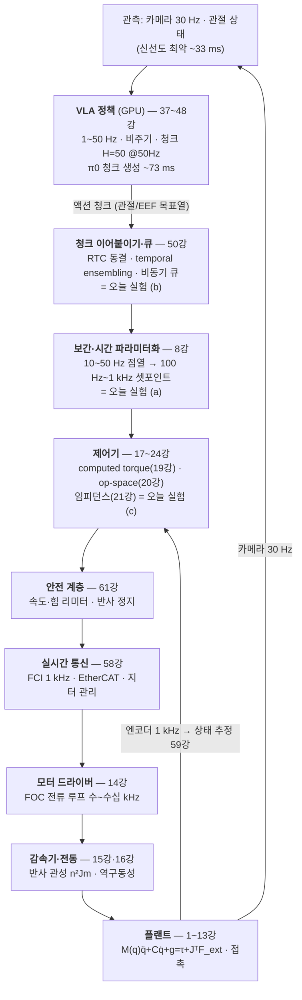
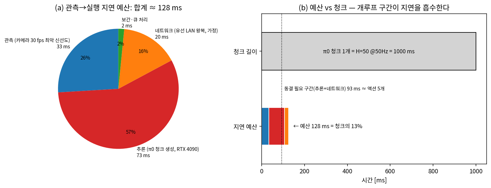
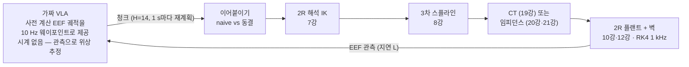
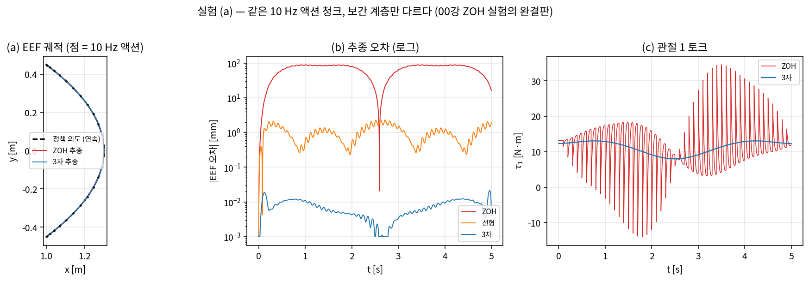
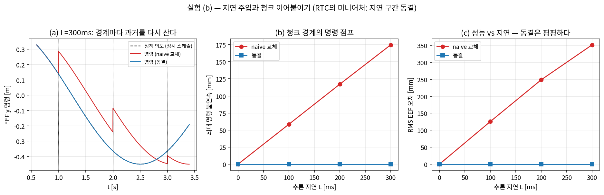
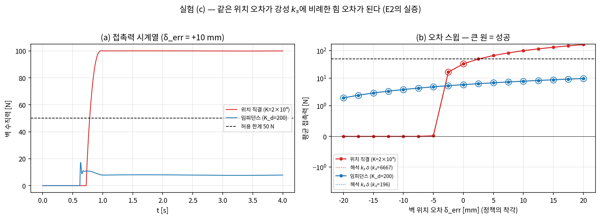

# Lec 62. 종합 — 두 스택이 만나는 곳

> 하위제어 트랙 30일차 (Part R6 마지막 — 트랙 캡스톤. **50강과 합동 세션**). 선수 지식: 사실상 전부지만, 특히 0강(계층 좌표계·함수 합성 E1·다중 주기 E3), 8강(보간), 17강(지연 $\tau_{\max} = \varphi_m/\omega_c$), 19강(computed torque), 21강(임피던스·직렬 강성), 61강(안전 계층).
> 이 강의에는 새 이론이 없다. 지난 51강에서 배운 부품을 **하나의 파이프라인으로 조립해 실행**하고, AI·VLA 파트이 50강에서 위에서 내려다본 같은 경계면을 아래에서 올려다본다. 50강과 수치·모델명을 공유한다(π0 H=50@50Hz·청크 생성 ~73ms, RTC, LeRobot async).

## 한 장 요약



0강 1일차에 봤던 계층 다이어그램의 **완성판**이다 — 그때는 상자마다 물음표였지만, 오늘은 상자마다 강의 번호가 붙는다. 위 세 상자(정책·이어붙이기·보간)를 AI·VLA 파트이 만들고, 아래 전부를 이 트랙이 만들었다. 오늘은 이 파이프 전체에 물을 흘려 본다: "가짜 VLA"가 내놓는 10 Hz 액션 청크가 보간(실험 a)과 지연 관리(실험 b)를 거쳐 제어기(실험 c)로 흘러 2R 플랜트에서 벽을 닦는다.

## 학습 목표

1. VLA 액션 청크가 모터 전류가 되기까지의 전체 경로를 각 층의 담당 강의·주기·오가는 신호와 함께 백지에 그릴 수 있다.
2. 지연 예산 방정식으로 특정 배치(π0 오프보드 서빙)의 관측→실행 지연을 합산하고, 동결 구간(RTC)과 태스크 시정수에 비추어 그 설계의 합격 여부를 판정할 수 있다.
3. 위층의 위치 오류가 접촉에서 강성 $k_s$에 비례한 힘 오류로 번역됨을 손계산하고, "임피던스 하위층 = 오류 흡수층"을 성공률 수치(15.4% vs 100%)로 실증할 수 있다.
4. 미니 통합 데모(가짜 VLA → 보간 → 제어기 → 2R)를 자기 손으로 재현하고, 청크 주기·지연·강성의 3축 설계 공간을 탐색할 수 있다.
5. 합동 세션에서 AI·VLA 파트 수강생과 같은 다이어그램을 놓고 각자 반대편 절반을 설명하며, 경계면의 설계 결정(청크 크기·동결·강성)을 함께 내릴 수 있다.

## 왜 이 강의가 필요한가

29개 강의는 각각 한 층씩을 다뤘다. 그런데 실물 로봇에서 사고는 층 안이 아니라 **층 사이**에서 난다: 청크 경계에서 명령이 점프해 감속기가 덜컹하고(15강), 묵은 관측으로 만든 청크가 로봇을 과거로 되돌리고, 5 cm 틀린 위치 명령이 임피던스 설정 하나 차이로 9.8 N이 되거나 333 N이 된다(21강). 층을 하나씩 아는 것과 층의 **합성**을 아는 것은 다른 능력이다.

AI·VLA 파트 50강은 이 경계면을 위에서 내려다봤다 — 모델별 action space, 청크 실행 전략, LeRobot async의 코드 경로. 오늘 우리는 같은 경계면을 아래에서 올려다본다 — 50강이 말로 설명한 "보간이 메운다", "동결이 지연을 흡수한다", "임피던스가 받아준다"를 전부 **수치가 나오는 실험**으로 바꾼다. 합동 세션에서 두 트랙이 만났을 때, 상위 수강생은 "왜 그 코드가 그렇게 생겼는지"의 물리를, 하위 수강생은 "이 제어 스택이 결국 누구를 위해 존재하는지"의 문맥을 서로에게서 얻는 것이 목표다.

그리고 이 강의는 선언이기도 하다. 0강 1일차의 E1 — 시스템은 타입이 있는 함수들의 합성이다 — 에서 다섯 함수가 전부 미지수였던 것이, 오늘 마지막 실험이 끝나면 전부 구체적인 코드와 수식으로 채워진다. 학습 스택과 제어 스택은 경쟁 관계가 아니라 **직렬 합성**이다.

## 본문

### 1. 전체 경로의 재구성 — 상자마다 강의 번호를

한 장 요약의 다이어그램을 표로 다시 쓰면, 이 트랙 30일이 그대로 스택의 층별 매뉴얼이었음이 보인다:

| 층 | 주기·성격 | 오가는 신호 | 담당 강의 | 오늘의 실험 |
|---|---|---|---|---|
| VLA 정책 | 1~50 Hz, 비주기, 청크 | 관측 → 액션 청크 (관절각/EEF 목표열) | 37~48강 | "가짜 VLA"로 대체 |
| 청크 이어붙이기 | 청크 경계마다 | 새 청크 + 옛 청크 → 연속 목표열 | 50강 (RTC·앙상블·큐) | **(b)** 지연 주입+동결 |
| 보간·시간 파라미터화 | 100 Hz~1 kHz | 목표점열 → $(q_d, \dot q_d, \ddot q_d)(t)$ | 8강 | **(a)** ZOH/선형/3차 |
| 제어기 | 100 Hz~1 kHz, 주기·실시간 | 셋포인트+상태 → 토크 | 17~24강 | **(c)** CT vs 임피던스 |
| 안전 계층 | 제어기와 동주기 | 토크·속도의 제한·투영, 반사 | 61강 | 성공 판정(50 N 한계) |
| 실시간 통신 | 1 kHz (FCI), EtherCAT | 셋포인트/토크 지령 패킷 | 58강 | (시뮬이라 생략) |
| 전류 루프 | 수~수십 kHz, 펌웨어 | 토크 지령 → 상전류 | 14강 | 이상적 토크원으로 가정 |
| 감속기·관절 | 물리 | 모터 토크 → 관절 토크 (n:1, $n^2 J_m$) | 15강·16강 | 강체 가정에 흡수 |
| 플랜트 | 물리 (연속시간) | $M\ddot q + C\dot q + g = \tau + J^\top F_{ext}$ | 9~13강 (언어: 1~7강) | 2R + 벽($k_e{=}10^4$) |
| 상태 추정·식별 | 1 kHz / 오프라인 | 엔코더·IMU → $\hat q, \hat{\dot q}$ / 모델 파라미터 | 59강·60강 | 완전 관측 가정 |

읽는 법 두 가지. 첫째, **위로 갈수록 느리고 똑똑하고 아래로 갈수록 빠르고 단순하다**(0강 E3) — 그 사이의 주기 간극(50 Hz ↔ 1 kHz ↔ 20 kHz)을 메우는 것이 청크 이어붙이기·보간·ZOH이고, 오늘 실험 (a)·(b)가 정확히 그 두 층의 유무를 절제(ablation)한다. 둘째, 오늘 시뮬이 "이상적으로 가정"한 층들(통신 지터, 전류 루프, 감속기 유연성, 추정 노이즈)이 실물에서 각자 세금을 걷는다 — 그 세금 목록이 14·15·58·59강이다.

내려가는 경로만큼 중요한 것이 **올라오는 경로가 둘**이라는 사실이다. 엔코더→상태 추정(59강)→제어기의 안쪽 루프는 1 kHz로 닫히고, 카메라→정책의 바깥 루프는 30 Hz + 추론 지연으로 닫힌다. 두 루프의 시간 스케일이 ~두 자릿수 다르기 때문에 역할 분담이 성립한다: 빠른 외란(접촉 충격, 떨림)은 안쪽 루프가, 느린 오차(물체가 저기 있네)는 바깥 루프가 담당한다. VLA에게 1 kHz 반사를 기대하거나 임피던스 제어기에게 "물체를 찾으라"고 요구하는 순간 설계가 무너진다 — 캐스케이드 제어(17강)의 대역폭 분리 원칙이 스택 전체로 확장된 것이다.

### 2. 핵심 수식 — 새 수식이 아니라 회수

#### E1. 지연 예산 방정식 — 관측에서 실행까지의 시간 부채 (0강 E3 · 17강 E3의 종합)

**직관**: 로봇이 지금 실행하는 액션은 "지금"의 세계가 아니라 **조금 전의 세계**를 보고 만든 것이다. 그 "조금 전"이 얼마인지는 한 군데서 나오지 않는다 — 카메라가 찍은 순간부터 전류가 흐르는 순간까지, 층마다 조금씩 밀린 것의 합이다. 예산(budget)이라 부르는 이유: 각 층이 나눠 쓰는 총액이고, 총액이 태스크가 허용하는 한도를 넘으면 파산한다.

**물리·기하적 의미**: 17강 E3에서 지연은 이득을 안 바꾸고 위상만 깎는 도둑이었고, 폐루프가 버티는 한계는 $\tau_{\max} = \varphi_m/\omega_c$였다. 액션 청크는 이 제약의 성격을 바꾼다 — 청크는 1~2초짜리 **미래 계획**이므로, 추론 지연 동안 로봇은 피드백 없이도 옛 계획의 나머지를 실행하면 된다(개루프 구간이 지연을 흡수한다). 대가는 신선도다: 지연은 이제 안정성 문제가 아니라 "계획이 얼마나 낡았는가"의 문제가 되고, 세계가 그 사이에 변하면(동적 태스크) 낡은 계획은 틀린 계획이다.

**형식**: 관측 시점부터 액션 실행까지,

$$
\tau_{\text{total}} \;=\; \underbrace{\tau_{\text{obs}}}_{\text{카메라 노출·전송·신선도}} + \underbrace{\tau_{\text{net}}}_{\text{왕복 네트워크}} + \underbrace{\tau_{\text{inf}}}_{\text{청크 생성(추론)}} + \underbrace{\tau_{\text{interp}}}_{\text{큐·보간 처리}} + \underbrace{\tau_{\text{ctrl}}}_{\text{제어·전류 루프 } \lesssim 1\text{ms}}
$$

설계 판정 두 개가 여기 달린다. ① **이어붙이기(신선도)**: 새 청크가 도착했을 때 그 앞부분은 이미 지나간 시간의 액션이다. 액션 간격 $\Delta$에 대해 버려야(동결해야) 하는 개수는

$$
n_{\text{freeze}} = \left\lceil \frac{\tau_{\text{inf}} + \tau_{\text{net}}}{\Delta} \right\rceil \;\ll\; H
$$

— RTC(50강)가 "추론 중 실행될 앞부분 동결"로 정식화한 그 양이다. ② **반응성(태스크)**: 시각 피드백으로 닫히는 가장 바깥 루프의 유효 대역폭 $\omega_c$에 대해 $\tau_{\text{total}} < \varphi_m/\omega_c$ (17강 E3 그대로). 감각 잡기: 위상여유 $\varphi_m = 60° \approx 1.05$ rad를 남기고 싶다면, 128 ms 예산이 허용하는 바깥 루프 대역폭은 $\omega_c < 1.05/0.128 \approx 8$ rad/s — 시정수 초 단위의 준정적 태스크(닦기, 접기)에는 넉넉하고, 굴러가는 물체 추적($\omega_c$ 수십 rad/s 필요)에는 파산이다. "π0가 +200 ms 인위 지연에도 무손실"(RTC [3])은 태스크가 전자였기 때문에 가능한 문장이고, 같은 시스템이 동적 태스크에서는 같은 지연으로 무너진다는 예고이기도 하다.

**손계산** (π0 오프보드 서빙, 그림 4): $\tau_{\text{obs}} = 33.3$ ms(30 fps 최악 신선도) $+\ \tau_{\text{inf}} = 73$ ms(π0 청크 생성, RTX 4090 [2]) $+\ \tau_{\text{net}} = 20$ ms(유선 LAN 왕복, 가정) $+\ \tau_{\text{interp}} = 2$ ms $= \mathbf{128.3}$ **ms** — 50 Hz 액션 **6.4개**, 1초 청크의 13%. 동결 필요분은 $n_{\text{freeze}} = \lceil (73+20)/20 \rceil = \mathbf{5}$**개**. 청크 $H = 50$이므로 여유롭게 성립한다 — 만약 청크 없이 스텝 단위로 실행했다면(RT-2식 ~6 Hz 싱글 스텝) 이 93 ms는 매 스텝 로봇이 멈춰 기다리는 시간이 됐을 것이다.



*그림 4: (a) 관측→실행 지연 예산의 내역 — 추론(57%)이 최대 항이지만 관측 신선도(26%)도 무시 못 한다. (b) 같은 예산을 π0 청크 길이(1000 ms) 위에 놓으면: 개루프 구간이 지연을 흡수하는 구조가 보인다. 점선이 동결 필요 구간(93 ms ≈ 액션 5개).*

#### E2. 계층별 오류 전파 — 임피던스는 오류 흡수층이다 (21강 직렬 강성의 태스크 수준 회수)

**직관**: 위층의 오류(지각이 벽 위치를 1 cm 잘못 앎, 정책이 어설픈 위치를 냄)는 스택을 타고 내려오며 **번역**된다. 자유 공간에서 위치 오류는 그냥 위치 오류다 — 1 cm 틀린 명령은 1 cm 옆을 지나가고 만다. 접촉하는 순간 번역기가 바뀐다: 같은 1 cm가 **힘**이 되고, 환율은 강성이다. 아래층 강성을 정책이 못 바꾸면 환율은 운명이고, 임피던스 하위층을 깔면 환율이 **설계 변수**가 된다.

**물리·기하적 의미**: 21강 WE-1의 직렬 스프링이 그대로 온다. 로봇의 (렌더링된) 강성 $K$와 환경 강성 $k_e$가 직렬이므로, 명령이 표면 뒤로 $\delta$만큼 들어가면 정상 접촉력은 $F = k_s \delta$, $k_s = K k_e/(K + k_e) \approx \min(K, k_e)$. 위층 오류에 대한 민감도가 $\partial F/\partial \delta = k_s$ — **위치 오류 → 힘 오류의 증폭률을 아래층이 정한다**. 그 아래로는 순순히 전파된다: 힘은 토크가 되고($\tau = J^\top F$, 5강), 토크는 전류가 된다($i = \tau/(nK_t)$, 14강) — 스택에서 비선형 증폭이 일어나는 곳은 접촉 인터페이스 하나뿐이고, 그래서 거기에 흡수층을 깐다.

**형식**: 위층 총 위치 오류 $\delta_{\text{err}}$(지각+정책+추종)에 대해

$$
\Delta F \;=\; k_s\,\delta_{\text{err}}, \qquad k_s = \frac{K\,k_e}{K + k_e}, \qquad
\frac{k_s^{\text{위치직결}}}{k_s^{\text{임피던스}}} = \frac{6666.7}{196.1} \approx \mathbf{34}
$$

(수치: $K = 2{\times}10^4$ vs $K_d = 200$, $k_e = 10^4$ N/m — 21강과 동일 설정.) 21강에서는 이 34배가 한 점의 접촉력 차이(333 N vs 9.8 N)였다. 오늘 실험 (c)는 같은 34배가 **오류 구간 전체에 대한 성공률**로 나타나는 것을 본다: 허용 접촉력 $F_{\max}$가 주어지면 위치 직결이 버티는 오류 폭은 $\delta < F_{\max}/k_s = 50/6666.7 = 7.5$ mm뿐이고, 임피던스는 $50/196.1 = 255$ mm — 사실상 전 구간이다. 위층(VLA)의 오류 분포가 같아도 아래층이 성공률을 가른다.

거꾸로 흐르는 오류도 있다: 청크 경계의 명령 불연속(위층 실패)은 보간·필터층이 일부 흡수하지만(실험 a·b), 흡수 못 한 잔여는 토크 스파이크로 감속기·구조물에 꽂힌다(8강 오해 3, 15강). 층별 실패 모드와 흡수 담당을 정리하면:

| 위층의 오류 | 아래층 도착 시 모습 | 흡수 담당 층 | 남는 잔여 |
|---|---|---|---|
| 지각·정책의 위치 오류 | 접촉력 오류 ($\times k_s$) | **임피던스** (환율 인하) | 낮아진 추종 강성 |
| 추론·네트워크 지연 | 낡은 청크 앞부분 (과거 재실행) | **동결·이어붙이기** (실험 b) | 신선도 손실 $n_{\text{freeze}}\Delta$ |
| 청크의 낮은 주기 (10~50 Hz) | 계단 셋포인트 → 토크 채터 | **보간** (실험 a) | 코너 근처 저역화 |
| 그래도 남은 이상 명령 | 과속·과력 | **안전 계층** (61강, 최후) | 반사 정지 = 태스크 중단 |

### 3. Worked Example — 미니 통합 데모: 스택 전체를 한 번에 굴리기



**설정** (전체 코드: `images/lec62/gen_figs.py`): 플랜트는 10강 WE-3와 동일한 2R($m_i{=}1$ kg, $l_i{=}1$ m, $l_{ci}{=}0.5$, $I_i{=}1/12$, $g{=}9.81$). "가짜 VLA"는 매끄러운 5초짜리 EEF 궤적 $x(t) = 1 + 0.15(1-\cos 0.8\pi t)$, $y(t) = 0.45\cos 0.4\pi t$를 **0.1 s 간격 웨이포인트(10 Hz)로만** 내놓는다 — 진짜 VLA처럼 시계가 없어서, 재계획 때는 (지연만큼 묵은) EEF 관측에서 경로 위상을 추정해 그 위상부터 $H{=}14$개를 내놓는다. 10 Hz를 고른 이유: 50강 표의 Diffusion Policy(~10 Hz)급이며, 보간·지연 효과가 그림에서 맨눈에 보이는 주기다.

파이프의 아래 절반은 전부 지난 강의의 코드 재사용이다 — 제어는 computed torque(19강), $K_p{=}400, K_d{=}40$(오차 동역학 $s^2 + 40s + 400 = (s+20)^2$, 이중극 $-20$), 플랜트 적분은 토크 ZOH를 유지하는 RK4 1 kHz:

```python
# 매 제어 스텝 (1 kHz) — 19강의 computed torque 그대로
e, ed = qd_[i] - q, vd_[i] - qdv
tau = M_mat(q) @ (ad_[i] + Kd*ed + Kp*e) + C_mat(q, qdv) @ qdv + g_vec(q)
q, qdv = rk4(q, qdv, tau, fext_fn, dt)      # 플랜트: M q̈ + C q̇ + g = τ + Jᵀ F_ext
```

여기서 잠깐 — 50강의 청크 실행 전략 4종이 이 트랙의 언어로 무엇이었는지 정리해 두면, 아래 실험들이 그 카탈로그의 어느 칸을 실증하는지가 명확해진다:

| 50강의 전략 | 로봇·제어 파트의 언어 | 오늘 실험 |
|---|---|---|
| Temporal ensembling (ACT [6]) | 겹치는 예측들의 지수 가중 저역 필터 — 매 스텝 추론 비용을 내는 대신 불연속을 평균으로 뭉갬 | (직접 실험 안 함 — 질문 1의 재료) |
| Receding horizon (Diffusion Policy) | MPC의 실행 규칙(23강)과 동일 구도: 16 예측, 8 실행, 재계획 | 우리 데모의 기본 구조 ($H{=}14$, 1 s 실행) |
| Real-Time Chunking [3] | 지연 구간의 계획 동결 + 겹침 정합 — 네트워크 제어의 지연 보상 | **(b)의 freeze** |
| LeRobot 비동기 큐 [4] | 생산자-소비자 큐 + 잔량 임계로 재계획 트리거 | (b)의 naive가 "큐 규약 없는" 대조군 |

#### WE-1 · 실험 (a): 보간 유무 — 0강 ZOH 실험의 완결판

0강 실습에서 2 Hz "정책"과 100 Hz "제어기" 사이의 ZOH 계단을 봤다. 이번에는 진짜 동역학과 진짜 제어기로: 같은 10 Hz 웨이포인트를 ① ZOH(마지막 목표 유지, $\dot q_d{=}\ddot q_d{=}0$), ② 선형 보간(속도만 조각 상수), ③ 3차 스플라인($\ddot q_d$까지 연속 — 8강)으로 1 kHz 셋포인트로 편 뒤 같은 CT 제어기에 넣는다.

```python
def build_setpoints(mode):                      # gen_figs.py 핵심부
    if mode == 'zoh':
        idx = np.minimum((ts/0.1).astype(int), len(t_wp)-1)
        return q_wp[idx], zeros, zeros          # 계단 + 속도·가속 0
    if mode == 'lin':
        qd_ = np.stack([np.interp(ts, t_wp, q_wp[:,j]) for j in (0,1)], axis=1)
        return qd_, np.gradient(qd_, dt, axis=0), zeros
    cs = CubicSpline(t_wp, q_wp, axis=0)        # 8강의 3차
    return cs(ts), cs(ts,1), cs(ts,2)
```

| 보간 | RMS EEF 오차 | 피크 오차 | 피크 $\|\tau\|$ |
|---|---|---|---|
| ZOH (보간 없음) | **74.37 mm** | 89.56 mm | **34.5 N·m** |
| 선형 | 1.10 mm | 2.34 mm | 13.3 N·m |
| 3차 스플라인 | **0.01 mm** | 0.02 mm | 13.1 N·m |



*그림 1: (a) EEF 궤적 — ZOH도 "대충 따라는" 간다. (b) 로그 스케일 오차 — ZOH 74 mm, 선형 1.1 mm, 3차 0.01 mm: 층 하나에 오차가 **세 자릿수**씩 갈린다. (c) 관절 토크 — ZOH는 0.1 s마다 목표가 점프하므로 토크가 10 Hz로 채터한다(피크 2.6배). 실물이면 이 채터가 감속기 백래시와 구조 공진을 두드린다(15강).*

주의 깊게 볼 것은 오차보다 **토크**다. ZOH의 RMS 74 mm는 "목표가 항상 평균 반 스텝 과거"라는 기하적 지연에서 오고, 이는 주기를 올리면 준다. 그러나 토크 채터는 목표의 **불연속** 자체에서 오므로 주기를 올려도 형태가 남는다 — 50 Hz 청크(π0)라도 1 kHz 제어기와의 20배 간극은 누군가 메워야 하고, 그 "누군가"가 8강이다. 50강에서 "보간/IK/필터 100~1000 Hz" 한 줄로 지나간 층의 실체가 이 표다.

#### WE-2 · 실험 (b): 추론 지연 주입과 청크 이어붙이기 — RTC의 미니어처

이제 추론 지연 $L$을 주입한다. 재계획 시점 $t_k$에 가짜 VLA가 받는 관측은 $t_k - L$의 것 — 추정된 경로 위상도 $L$만큼 과거다. 새 청크를 그대로 갈아 끼우면(naive) 로봇은 청크 경계마다 **이미 지나온 길을 다시 산다**. 동결(freeze) 전략은 지연 구간에 해당하는 청크 앞부분 $n_L = \lceil L/\Delta \rceil$개를 버리고 위상을 맞춰 이어붙인다 — RTC [3]가 "추론 중 실행될 앞부분은 이전 청크로 동결"이라 부른 것의 등가 미니어처다. 이어붙이기의 핵심부:

```python
# 청크 경계 (1초마다): 묵은 관측으로 위상 추정 → 새 청크 생성 → 이어붙이기
i_obs = max(0, i - int(round(L/dt)))             # L 만큼 과거의 EEF 관측
s_obs = estimate_phase(eef_hist[i_obs], s_exp)   # 가짜 VLA: 관측 → 경로 위상
shift = n_L if (strategy == 'freeze' and k > 0) else 0
phases = s_obs + (shift + np.arange(H)) * Delta  # freeze: 낡은 앞 n_L 개를 스킵
spline = CubicSpline(t_k + np.arange(H)*Delta,   # 새 청크도 8강의 3차로 편다
                     np.array([ik2r(p) for p in ref(phases)]), axis=0)
```

**손계산으로 예측부터**: naive의 명령 점프는 "그 사이 로봇이 지나간 거리" ≈ 경로 속도 × $L$이어야 한다. $t{=}1$ s 경계에서 경로 속도는 $\|\dot x_{\text{ref}}\| = \sqrt{0.222^2 + 0.538^2} = 0.582$ m/s이므로 $L{=}100$ ms에서 **58.2 mm**, 300 ms에서 **174.6 mm**를 예측. 실측:

| $L$ | naive: 최대 명령 점프 | naive: RMS 오차 | naive: 피크 $\|\tau\|$ | 동결: 점프 / RMS / $\|\tau\|$ |
|---|---|---|---|---|
| 0 ms | 0.0 mm | 0.01 mm | 13.1 | 0.0 / 0.01 / 13.1 |
| 100 ms | 58.5 mm | 125.50 mm | 37.1 | 0.0 / 0.01 / 13.1 |
| 200 ms | 117.1 mm | 248.36 mm | 70.3 | 0.0 / 0.01 / 13.1 |
| 300 ms | **174.7 mm** | **351.17 mm** | **102.4** | **0.0 / 0.01 / 13.1** |

점프 예측(58.2/174.6)이 실측(58.5/174.7)과 1% 이내로 맞는다. RMS가 점프보다 훨씬 큰 이유는 **누적** 때문이다: naive는 청크마다 위상을 $L$씩 되감으므로 5초 동안 4번 재계획이면 최종 위상 지연이 ~$4L$ — 지연이 흡수되지 않고 복리로 쌓인다. 동결은 세 열이 전부 무지연과 동일하다(0.01 mm) — "인위 +200 ms에도 성능 무손실"이라는 RTC 논문의 문장 [3]이 우리 장난감에서 재현된 것이다.



*그림 2: (a) $L{=}300$ ms의 명령 시계열 — naive(빨강)는 경계(점선)마다 위로 점프해 과거를 다시 살고, 동결(파랑)은 매끄럽게 이어진다. (b) 명령 점프 vs $L$ — naive는 경로 속도 0.58 m/s의 기울기로 선형 증가. (c) RMS 오차 vs $L$ — 동결은 평평하다.*

단서 하나: 동결이 공짜 점심은 아니다. 동결 구간의 액션은 $L$만큼 **낡은 계획**이다 — 우리 실험은 세계가 정적이라 티가 안 났지만, 목표물이 움직였다면 동결 구간만큼 낡은 정보로 행동한 것이다(E1의 신선도 잔여). RTC가 겹침 구간을 soft masking으로 새 청크와 **정합**시키는 이유가 이것이고, LeRobot async가 큐 잔량 임계(`chunk_size_threshold` 0.7)로 관측 신선도와 서버 부하를 저울질하는 이유이기도 하다(50강 [4]).

#### WE-3 · 실험 (c): 벽 닦기 — 위치 직결 vs 임피던스 하위층, E2의 실증

마지막으로 접촉이다. 태스크: EEF로 $x_{\text{wall}} = 1.30$ m의 벽($k_e = 10^4$ N/m, 21강과 동일)을 누르면서 $y$를 $+0.35 \to -0.35$ m 훑기(1초 접근 + 3초 닦기, 최소저크 프로파일 — 8강). **정책은 벽의 위치를 $\delta_{\text{err}}$만큼 잘못 안다** — 지각 오차·캘리브레이션 오차(60강)의 총합을 흉내 낸 것. 두 하위층을 비교한다 (20강의 자코비안 전치 + 21강 E1의 관성 성형 없는 임피던스, 중력 보상 포함):

- **위치 직결**: $K = 2{\times}10^4$ N/m, $B = 400$ — 산업 로봇급 강성. 명령은 벽 뒤 5 mm.
- **임피던스**: $K_d = 200$ N/m, $B = 40$ — 명령은 벽 뒤 **30 mm** (무르니까 더 깊이 눌러야 힘이 나온다 — 정책이 임피던스 아래층을 전제로 명령을 설계하는 관용구).

제어 법칙은 두 경우 **같은 한 줄**이고 게인 숫자만 다르다 — 21강에서 강조한 "위치 제어는 임피던스 제어의 뻣뻣한 극한일 뿐"이 코드에서는 이렇게 보인다:

```python
# 태스크 공간 임피던스 (20강 Jᵀ + 21강 E1, 관성 성형 없음) — 접촉 분기 없음
p, v = fk(q), jac(q) @ qdv
tau = jac(q).T @ (Kx*(xd - p) + Bx*(xd_dot - v)) + g_vec(q)
F_wall = k_e * max(p[0] - x_wall, 0.0)           # 벽 = 단방향 스프링 (12강)
```

성공 판정: 닦는 동안 $F_{\text{peak}} \le 50$ N(안전 한계 — 61강의 힘 제한을 판정으로 씀) **그리고** 접촉 유지율 $\ge 90\%$(떨어지면 못 닦은 것). 판정은 $\delta_{\text{err}} \in [-15, +15]$ mm의 13점에서 한다(그림 3b의 스윕 자체는 ±20 mm까지):

| 하위층 | 성공률 | $\delta_{\text{err}}{=}0$ | $+10$ mm | $-10$ mm |
|---|---|---|---|---|
| 위치 직결 | **15.4%** (2/13) | 33.32 N (해석 33.33) — 성공 | 99.99 N (해석 100.0) — **힘 초과** | 접촉률 0% — **허공** |
| 임피던스 | **100%** (13/13) | 5.85 N (해석 5.88) | 7.81 N (해석 7.84) | 3.89 N (해석 3.92) |



*그림 3: (a) $\delta_{\text{err}} = +10$ mm의 접촉력 시계열 — 위치 직결은 100 N(한계의 2배)을 벽에 꽂고, 임피던스는 7.8 N으로 닦는다. (b) 오차 스윕 — 위치 직결(빨강)은 $-5$ mm 아래에서 접촉을 잃고(0 N) $+2.5$ mm 위에서 힘이 폭주하는 좁은 협곡. 임피던스(파랑)는 전 구간 완만한 직선($k_s \approx 196$ N/m). 점선이 해석식 $k_s(\delta_{\text{press}} + \delta_{\text{err}})$ — 시뮬과 겹친다.*

모든 칸이 E2의 손계산과 일치한다: 위치 직결은 $k_s = 6666.7$ N/m이므로 명령 침투 5 mm에서 33.3 N, $+10$ mm 오차가 더해지면 100 N — 그리고 $\delta_{\text{err}} < -5$ mm면 명령 자체가 벽 밖이라 **접촉을 잃는다**(그림 3b의 왼쪽 절벽: 뻣뻣한 로봇은 힘 폭주와 허공 사이의 7.5 mm 협곡에서 산다). 임피던스는 $k_s = 196.1$ N/m — 같은 ±15 mm 오차가 2.9~8.8 N의 완만한 변화로 번역된다. **VLA는 이 실험의 "위층 오차"를 매일 만든다**(지각 오차, 데모 편차, 일반화 실패): 임피던스 아래층이 있으면 그 오차 분포 전체가 성공 영역 안에 들어오고, 없으면 mm 단위 지각 정확도를 학습이 떠맡아야 한다. "왜 학습 정책 아래 임피던스를 깔면 유리한가"(50강 토론 질문 4)의 정량적 답이 이 표다.

#### WE-4 · MuJoCo 교차 검증

우리 손 유도(10강) 동역학과 numpy RK4가 미덥지 않다면 — 플랜트만 MuJoCo로 갈아 끼워 재현한다 (`images/lec62/check_mujoco.py`). 명시적 `<inertial>`로 같은 2R을 만들고(geom 유래 관성을 덮어씀), 관성행렬·바이어스력부터 대조:

```python
d.qpos[:], d.qvel[:] = [0.3, 0.5], [-0.2, 0.4]
mujoco.mj_forward(m, d)
mujoco.mj_fullM(m, Mfull, d.qM)
print(np.abs(Mfull - M_mat(q_test)).max())               # 6.7e-08
print(np.abs(d.qfrc_bias - (C_mat(...) @ qd + g_vec(...))).max())  # 3.6e-15
# 이후 d.qfrc_applied[:] = tau 로 같은 CT 제어 → mj_step (integrator=RK4)
```

실험 (a)의 결과가 소수점까지 재현된다(ZOH 74.37 mm / 3차 0.01 mm, 피크 토크 34.5/13.1 N·m). 10강에서 한 약속("우리 방정식 = MuJoCo가 푸는 방정식")의 최종 확인이자, 이 데모 전체를 여러분이 아무 물리엔진 위에서 다시 조립할 수 있다는 보증이다.

### 4. 안전·주기·지연 예산의 합동 설계 — 두 트랙이 함께 정할 것들

경계면의 설계 변수는 어느 한 트랙의 소유가 아니다. 합동 설계 체크리스트:

1. **주기 사다리**: 인접 층의 주기 비는 대략 한 자릿수(5~20배)를 유지한다 — VLA 10~50 Hz / 보간·제어 0.1~1 kHz / 전류 수십 kHz. 간극이 그보다 크면 사이에 층을 하나 만든다(그게 보간층의 존재 이유고, Helix가 S2/S1/S0 3계층인 이유다 — 48강).
2. **지연 예산표 작성**: E1의 각 항을 실측해 파이 차트(그림 4)를 채운다. 최대 항만 줄이려 들지 말 것 — 관측 신선도(33 ms)는 카메라 트리거 동기화로, 추론(73 ms)은 증류·양자화로, 네트워크는 온보드화로 줄이며 각각 비용이 다르다.
3. **동결·이어붙이기 규약**: $n_{\text{freeze}} = \lceil(\tau_{\text{inf}}+\tau_{\text{net}})/\Delta\rceil$를 상위(청크 생성)와 하위(큐 소비)가 **같은 수치로** 합의한다. 실험 (b)의 naive가 곧 "합의 안 한 시스템"의 모습이다.
4. **강성 예산**: 태스크의 위치 불확실성 $\sigma_\delta$와 허용 접촉력 $F_{\max}$에서 $K_d \lesssim F_{\max}/(k_e^{-1}F_{\max} + \sigma_\delta)$ 급으로 역산한다(E2). 정책 쪽은 그 강성을 전제로 "표면 뒤로 넉넉히" 명령하는 데이터를 만든다(실험 c의 30 mm).
5. **안전은 아래층이 최종 집행**(61강): 정책·네트워크·보간 어디가 죽어도 아래층 혼자 안전 상태로 수렴해야 한다 — 큐 고갈 시 감속 정지, 힘 한계 반사(실험 c의 50 N), 속도 제한 투영. 학습 정책의 안전을 학습에 맡기지 않는 것이 현재 실무 표준이다(50강 §5).

### 딥러닝 배경자를 위한 번역 — 이 강의 자체가 번역이다

- **0강 E1의 선언이 완성됐다.** $u(t) = C\big(\text{interp}(\pi_\theta(h(x))), \hat x\big)$ — 1일차에 타입만 적어 놓은 함수 합성의 각 기호가 이제 전부 구체물이다: $h$는 카메라+상태 추정(59강), $\pi_\theta$는 VLA(AI·VLA 파트), interp는 8강, $C$는 17~24강, 그 출력이 14~16강을 지나 9~13강의 물리에 닿는다. **학습 스택과 제어 스택은 경쟁이 아니라 직렬 합성이다** — 어느 층을 학습으로 대체할지는 아키텍처 선택이지 진영 싸움이 아니다(64강의 층위 진단).
- **청크는 추론 비용의 상각(amortization)이다.** 73 ms를 들여 1초치(50개)를 만들므로 스텝당 1.46 ms — 추론이 느려도 실행이 멈추지 않는다. 동결은 그 상각 구조의 파이프라인 버블 방지책이고, naive 교체는 파이프라인 플러시다(실험 b).
- **임피던스는 출력측 Lipschitz 제약이다.** 정책 오차 → 물리적 피해의 민감도($k_s$)를 아래층이 상한한다(E2) — 입력 노이즈에 대한 출력 민감도를 누르는 스펙트럴 정칙화의 물리판. 학습이 잘못해도 세계가 부드럽게 받아주는 만큼, 학습은 mm 정확도 대신 태스크 논리에 용량을 쓴다(21강 번역 박스의 완결).
- **지연 예산은 stale gradient 예산이다**(17강 번역의 회수): staleness(지연)가 크면 게인(반응성)을 낮춰야 하고, 청크+동결은 "묵은 파라미터로 미리 계산해 두는" 비동기 파이프라인 병렬화와 같은 구도다. 그림 4는 문자 그대로 시스템의 프로파일링 결과다.

여기까지가 하위제어 트랙 30일의 전부다. 다음에 새 VLA 논문이 "우리 정책은 50 Hz로 관절 명령을 낸다"라고 한 줄로 지나갈 때, 여러분은 그 한 줄 아래에서 무엇이 몇 kHz로 돌고 있는지, 그 논문이 말하지 않은 어떤 설계 합의가 성립해 있어야 하는지를 안다 — 그것이 이 트랙의 목표였다.

## 흔한 오해

1. **"VLA가 충분히 좋아지면 하위 스택은 사라진다"** — 주기·안전·정보의 세 가지 이유로 아니다. ① 50 Hz 정책과 20 kHz 전류 루프 사이 400배 간극은 물리(전기 시상수, 14강)가 요구한다. ② 안전은 정책이 죽어도 살아야 한다(61강). ③ 관절 엔코더의 1 kHz 정보는 카메라 30 Hz에 없다 — 아래층만 볼 수 있는 세계가 있다. 실제로 가장 end-to-end에 가까운 시스템들도 최하층 제어기는 남긴다(48강의 스펙트럼) — 논쟁은 "어디까지 학습이 올라오는가"지 "스택이 사라지는가"가 아니다.
2. **"지연 = 추론 지연"** — 그림 4에서 추론은 57%다. 관측 신선도(26%)와 네트워크는 모델을 한 바이트도 안 바꾸고 줄일 수 있는 항인데도 자주 잊힌다. 그리고 평균 지연보다 **지터**가 나쁘다: 동결은 알려진 $L$을 흡수하는 장치라, $L$이 출렁이면 $n_{\text{freeze}}$ 합의가 깨진다(58강의 실시간성이 상위 스택에도 소급 적용되는 이유).
3. **"보간은 주기가 높으면 필요 없다"** — 실험 (a)의 10 Hz는 효과를 눈에 보이게 한 설정일 뿐, 문제의 본질은 주기가 아니라 **셋포인트의 불연속**이다(토크 채터는 50 Hz에서도 남는다 — 8강 오해 3). 반대쪽 오해도 있다: LeRobot 기본 스택(30 Hz 명령 → 서보 온보드 PID)처럼 아래층이 사실상의 보간·저역필터 역할을 겸하는 경우 별도 보간층이 안 보일 수 있다 — 층이 없는 게 아니라 펌웨어에 숨어 있는 것이다(50강의 SO-101 행).
4. **"임피던스를 깔면 안전하고 만사형통"** — 실험 (c)의 임피던스는 ① 명령을 벽 뒤 30 mm로 다시 설계해야 했고(정책·데이터가 하위층을 알아야 한다), ② 자유 공간 추종은 위치 직결보다 무르며(외란에 밀림 — 21강 오해 2), ③ 50 N 반사는 여전히 별도 안전층이 담당했다. 임피던스는 위치-힘 환율을 낮추는 흡수층이지, 안전 계층(61강)의 대체물도, 힘을 정확히 내는 장치(그건 22강)도 아니다.

## 실습 (1.5~2시간) — 데모 재현 + 설계 공간 지도 + 합동 과제

**A. 재현과 절제 (40분)** — `images/lec62/gen_figs.py`를 실행해 표의 수치를 재현한 뒤, 스스로 절제 실험을 확장한다:

1. 실험 (a)에서 웨이포인트 주기를 10 Hz → 30 Hz → 50 Hz로 올리며 ZOH의 RMS와 토크 채터가 각각 어떻게 변하는지 표로 만든다 (예상: RMS는 급감, 채터 구조는 잔존).
2. 실험 (b)에서 재계획 주기 $T_c$를 0.5 s/1 s/2 s로 바꿔 naive의 위상 누적이 어떻게 변하는지 확인한다.
3. `check_mujoco.py`로 플랜트를 MuJoCo로 교체해 같은 수치가 나오는지 확인한다(동역학 대조 → 실험 a 재현).

**B. 설계 공간 지도 (40분)** — 세 노브를 축으로 성공/실패 지도를 그린다. 골격:

```python
# 1) (청크 주기 Δ) × (지연 L): 동결 on/off 의 RMS 히트맵
#    gen_figs.py 의 run_latency 재사용 — 단 Δ·H 가 전역이므로 함수 인자로 빼서 쓸 것
for Delta in [0.05, 0.1, 0.2]:
    for L in np.arange(0, 0.35, 0.05):
        for strat in ['naive', 'freeze']:
            rms[...] = run_latency(L, strat)['rms']
# 2) (강성 K_d) × (벽 오차 δ_err): 벽 닦기 성공 지도 + E2 해석 경계 겹치기
for Kd in np.logspace(2, 4.3, 12):
    ks = Kd*k_e/(Kd + k_e)
    d_press = 6.0/ks                                  # 목표 힘 6 N 이 되도록 명령 역산
    for d in d_errs:
        r = run_wipe(Kd, 2*np.sqrt(2*Kd), d_press, d) # B = 2√(mK_d), m≈2 (임계감쇠급)
        ok[...] = (r['F_peak'] <= 50.0) and (r['contact'] >= 0.9)
```

1. 지도 1에서 "동결 없이 버티는 영역"의 경계를 찾아라 — $L < \Delta$면 naive의 점프가 액션 한 칸 안에 숨는다는 가설을 세우고 검증해 보라.
2. 지도 2에 E2의 해석 경계($k_s(\delta_{\text{press}} + \delta_{\text{err}}) = 50$ N과 접촉 상실선 $\delta_{\text{press}} + \delta_{\text{err}} = 0$)를 겹쳐, 성공 협곡의 폭이 $1/k_s$로 넓어지는 것을 확인하라.
3. 두 지도를 한 페이지로 합쳐 "우리 시스템의 설계 공간 지도"로 정리한다 — 발표 자료가 아니라 **팀의 설계 회의에서 쓸 물건**이라는 마음으로.

**C. 합동 과제 (40분, AI·VLA 파트 수강생과 2인 1조)** — 50강 실습(LeRobot async inference 코드 추적)을 함께 재수행하되 분업한다: 상위 수강생은 코드에서 실측 가능한 양(관측 직렬화 시간, 큐 임계, 청크 병합 함수)을 찾아 그림 4의 파이 차트를 **실측치**로 다시 그리고, 하위 수강생은 그 수치를 E1에 넣어 $n_{\text{freeze}}$와 권장 `chunk_size_threshold`를 역산한다. 마지막으로 한 장 요약 다이어그램의 모든 화살표에 실측 주기·지연을 라벨링해 "통합 다이어그램"을 완성하고, 각자 자기 트랙의 언어로 상대에게 3분씩 설명한다 — 서로의 설명에서 어긋나는 지점이 남은 공부 거리다.

## Claude와 토론할 질문

1. 실험 (a)에서 선형 보간도 RMS 1.1 mm로 "충분해" 보인다. 그런데도 3차가 필요한 이유를 토크(가속 불연속) 관점에서 논하고, 어떤 하드웨어(직구동 vs 하모닉, 15~16강)에서 그 차이가 더 비싼지 따져 보라.
2. 실험 (b)의 동결은 "지연 동안의 계획을 옛 청크로 대체"한다 — 50강은 이것을 Smith predictor에 비유했다. 예측기(플랜트 모델) 없이도 성립하는 이유는 무엇이고, 어떤 조건(세계의 시정수 vs $L$)이 깨지면 진짜 예측이 필요해지는가?
3. 실험 (c)의 성공 판정에 "닦기 품질"(힘 하한, 예: $F \ge 2$ N 유지)을 추가하면 임피던스의 $\delta_{\text{press}}$·$K_d$ 설계는 어떻게 다시 묶이는가? 힘 하한·상한 창이 좁아질수록 임피던스(간접)에서 힘 제어(직접, 22강)로 넘어가야 하는 이유를 E2의 민감도로 논증하라.
4. E1 예산의 각 항을 줄이는 공학적 수단과 비용을 하나씩 대응시켜 보라(관측: 글로벌 셔터·트리거 동기화 / 추론: 증류·양자화·투기 실행 / 네트워크: 온보드 Jetson / 보간: 없음에 가깝다). 우리 파이 차트에서 "1만 원으로 가장 많이 사는" 항은 어디인가?
5. 청크 $H$를 늘리면 지연 흡수는 쉬워진다(E1). 반대로 무엇이 나빠지는가? 개루프 구간·세계의 시정수·compounding error(37강)를 연결해 "태스크별 최적 $H$"의 존재를 논하라 — 50강 질문 5의 로봇·제어 파트 버전이다.
6. 우리 "가짜 VLA"는 관측에서 경로 위상을 추정해 그 지점부터의 계획을 내놓는다 — 진짜 VLA와 무엇이 같고(관측 조건부 행동, 시계 없음) 무엇이 다른가(다봉성, 일반화, 관측 전체 사용)? 이 차이 중 오늘 실험의 결론(보간·동결·임피던스의 가치)을 뒤집는 것이 있는가?
7. 합동 토론용: "학습이 좋아질수록 제어는 얇아진다"는 주장에 대해 AI·VLA 파트은 찬성 근거를, 로봇·제어 파트은 반대 근거를 각각 세 개씩 준비해 부딪혀 보라. 끝나고 나서 — 둘이 말한 "제어"가 같은 층을 가리켰는지 0강의 좌표계로 확인하라.

## 읽을거리

1. **Physical Intelligence, "Real-Time Chunking" 블로그** (pi.website/research/real_time_chunking, ~20분): 실험 (b)의 원전을 이번에는 로봇·제어 파트의 눈으로 재독 — "동결 구간"이 E1의 어느 항에 대응하는지 짚으며 읽어라.
2. **LeRobot async inference 문서** (huggingface.co/docs/lerobot/en/async, ~15분): 합동 과제 C의 사전 읽기. `chunk_size_threshold`가 E1의 어떤 트레이드오프를 노브 하나로 줄인 것인지 생각하며.
3. (선택) **MR Ch.11 통독** (~1시간): 17~22강에서 조각조각 읽은 제어 장을 이제 한 번에 — 다 아는 내용이 되어 있는지가 트랙 수료의 자가 시험이다.

## 자가 점검

1. 한 장 요약의 스택을 백지에 그리고, 각 층의 주기·신호·담당 강의 번호를 채울 수 있는가?
2. π0 오프보드 배치의 지연 예산(33.3+73+20+2 = 128.3 ms, 동결 5 액션)을 손으로 재구성하고, 각 항의 출처를 말할 수 있는가?
3. 실험 (b)에서 naive 교체의 명령 점프(경로 속도 × $L$)와 RMS의 복리 누적을 설명하고, 동결이 세 지표 모두를 무지연 수준으로 되돌리는 메커니즘을 말할 수 있는가?
4. $k_s = Kk_e/(K+k_e)$에서 출발해 "위치 직결 15.4% vs 임피던스 100%"까지의 논리 사슬(민감도 34배 → 허용 오차 협곡 7.5 mm vs 255 mm)을 재구성할 수 있는가?
5. 합동 설계 체크리스트 5항목 중 AI·VLA 파트과 **합의가 필요한** 항목이 어느 것들인지, 합의가 없으면 각각 어떤 사고가 나는지 말할 수 있는가?

## 참고문헌

> 웹 문서는 2026-07-09 접속 기준. 50강과 공유하는 수치(π0·RTC·LeRobot·Franka)는 동일 출처를 재사용한다.

[1] K. Lynch, F. Park, "Modern Robotics: Mechanics, Planning, and Control," Cambridge Univ. Press, 2017. 무료 PDF: https://hades.mech.northwestern.edu/images/7/7f/MR.pdf
— **뒷받침**: Ch.11 — 셋포인트 추종·computed torque(§11.4, WE의 제어 법칙과 오차 동역학 선형화 — 19강와 동일 전거), 임피던스 제어(§11.7, 실험 (c)의 제어 법칙과 직렬 강성 논리 — 21강과 동일 전거). 읽을거리 3의 통독 대상.

[2] K. Black et al., "π0: A Vision-Language-Action Flow Model for General Robot Control," arXiv:2410.24164, 2024.10. https://arxiv.org/abs/2410.24164
— **뒷받침**: H=50 청크 @최대 50 Hz, 청크 생성 ~73 ms(RTX 4090) — E1 손계산과 그림 4의 추론 항 (50강과 동일 출처).

[3] K. Black, M. Y. Galliker, S. Levine (Physical Intelligence), "Real-Time Execution of Action Chunking Flow Policies," arXiv:2506.07339, 2025.6. https://arxiv.org/abs/2506.07339 (해설 블로그: https://www.pi.website/research/real_time_chunking)
— **뒷받침**: 추론 지연 구간의 액션 동결(inpainting 정식화)과 soft masking, 인위 +200 ms 지연에서 성능 무손실 — 실험 (b)의 동결 전략이 미니어처로 재현하는 원전 (50강과 동일 출처).

[4] Hugging Face, LeRobot async inference 문서. https://huggingface.co/docs/lerobot/en/async
— **뒷받침**: PolicyServer/RobotClient 분리, 액션 큐와 `chunk_size_threshold`(기본 0.7), `weighted_average` 병합 — WE-2 단서·실습 C·오해 2의 근거 (50강과 동일 출처).

[5] Franka Robotics, FCI·libfranka 문서. https://frankarobotics.github.io/docs/
— **뒷받침**: 1 kHz 실시간 루프와 토크 지령의 중력·마찰 자동 보상, 내장 리미터 — §1 표의 "실시간 통신·제어기" 층 실물 수치 (50강·19강·21강과 동일 출처).

[6] T. Zhao et al., "Learning Fine-Grained Bimanual Manipulation with Low-Cost Hardware (ALOHA/ACT)," arXiv:2304.13705, 2023.4. https://arxiv.org/abs/2304.13705
— **뒷받침**: temporal ensembling — §1 표·한 장 요약의 청크 실행 전략 목록 (50강과 동일 출처).

[7] Google DeepMind, MuJoCo 문서. https://mujoco.readthedocs.io
— **뒷받침**: WE-4·실습 A-3 — 명시적 `<inertial>`의 관성 지정, `mj_fullM`·`qfrc_bias`·`qfrc_applied` API, RK4 적분기 옵션 (10강·21강과 동일 출처).

*수치 재현성: 본문·그림의 모든 수치(실험 (a)의 RMS 74.37/1.10/0.01 mm·피크 오차 89.56/2.34/0.02 mm·피크 토크 34.5/13.3/13.1 N·m, 실험 (b)의 명령 점프 58.5/117.1/174.7 mm·RMS 125.50/248.36/351.17 mm·피크 토크 37.1/70.3/102.4 N·m와 동결의 0.0 mm/0.01 mm/13.1 N·m, 손계산 점프 예측 0.582 m/s → 58.2/174.6 mm, 실험 (c)의 성공률 15.4%/100%와 접촉력 표(33.32/99.99/0 N vs 5.85/7.81/3.89 N, 해석값 33.33/100.0 vs 5.88/7.84/3.92), $k_s$ 6666.7/196.08 N/m(34.0배)·허용 오차 7.5 mm vs 255 mm, 지연 예산 128.3 ms = 50 Hz 액션 6.4개·동결 5 액션)는 `images/lec62/gen_figs.py`의, MuJoCo 교차 검증(M 편차 6.7×10⁻⁸·바이어스 편차 3.6×10⁻¹⁵·실험 (a) 동일 재현)은 `images/lec62/check_mujoco.py`의 실행 출력이다 — numpy 1.26 / scipy 1.15 / mujoco 3.2.5 기준 재현 확인.*

<!-- lecture-nav -->

---

⬅ 이전: [Lec 61. 안전 계층 — 학습 정책 아래의 마지막 방어선](lec61-safety-layers.md)　｜　[📖 전체 목차](../README.md)　｜　다음: [Lec 63. 프론티어 지도 (2025-26)](../part15-frontier/lec63-frontier-map.md) ➡
