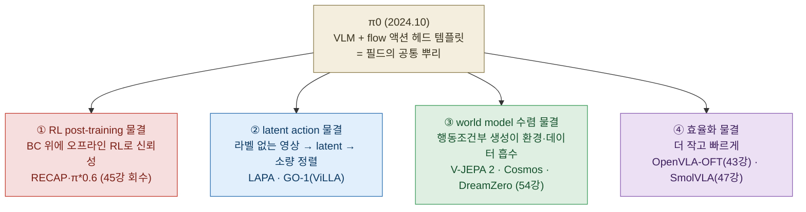
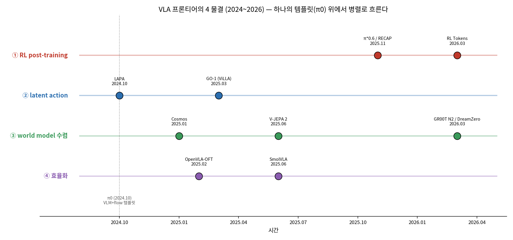
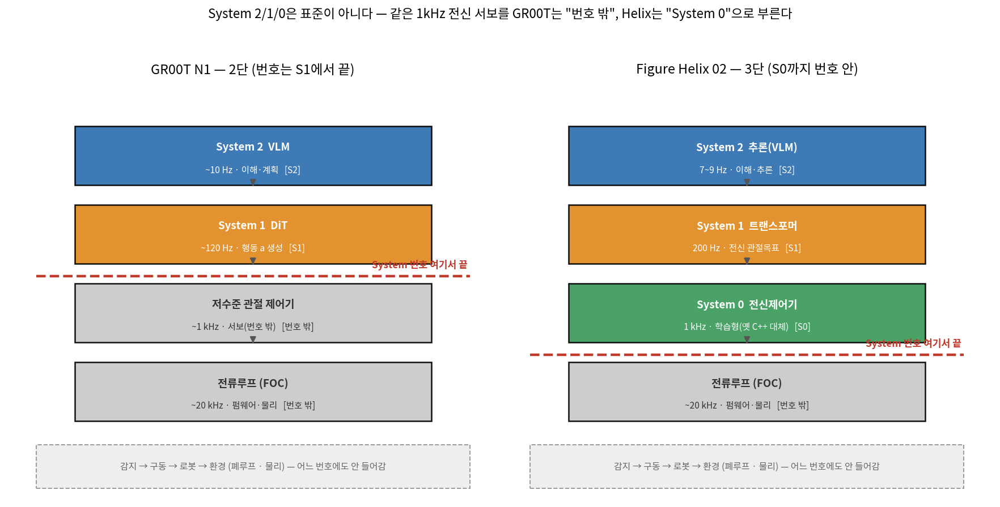
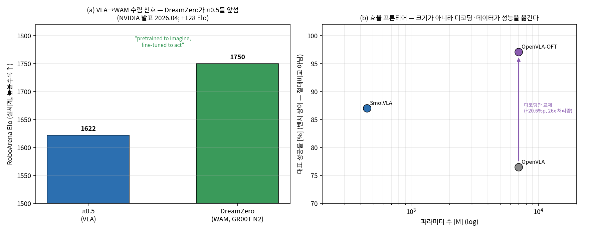
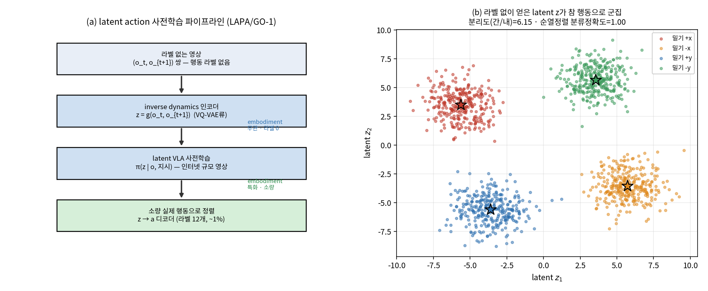

# Lec 63. 프론티어 지도 (2025-26)

> Part 15 첫 강의. 선수 지식: 45강(RECAP·오프라인 RL), 47강(SmolVLA·효율), 48강(비공개 진영·System 2/1/0 첫 도입), 54강(학습된 world model). 41강(advantage·오프라인 RL), 43강(OpenVLA-OFT 디코딩)을 봤다면 더 좋다.
> 관련(이후): 64강(논문 읽기 프레임워크) — 이 지도가 6축 지도·층위 진단의 재료가 된다.
> 정보 기준일: 2026-07-09. 프론티어는 유통기한이 짧다 — 학습 시점에 Claude에게 최신 소식 확인을 요청할 것.

## 한 장 요약



VLA 필드는 "더 큰 모델 하나"로 수렴하지 않는다. π0(44강)의 **VLM+flow 템플릿**이라는 공통 뿌리 위에서 **네 물결**이 병렬로 흐른다: ① BC 위에 오프라인 RL을 얹어 실전 신뢰성을 더하고(RECAP), ② 라벨 없는 영상에서 latent action을 배워 데이터 병목을 우회하고(LAPA·GO-1), ③ 행동조건부 world model이 데이터·환경·정책을 흡수하며("VLA 다음은 WAM?"), ④ 더 작고 빠른 온보드 모델로 민주화한다(SmolVLA). 그리고 이 강의는 48강의 **System 2/1/0 벤더 라벨**을 다시 꺼내 "경계가 회사마다 다르다"는 것을 엄밀히 못 박는다. 이 지도가 64강 논문 읽기의 좌표계다.

## 학습 목표

1. 2024~2026 VLA 프론티어를 **네 물결**(RL post-training / latent action / world model 수렴 / 효율화)로 분류하고, 각 물결의 대표 모델·핵심 아이디어·그것이 고친 병목을 한 문장씩 말할 수 있다.
2. **latent action**(E1)을 "라벨 없는 두 관측에서 무엇을 했는지 역추정(inverse dynamics)한 잠재"로 정의하고, 60강 시스템 식별·37강과 대비해 그것이 왜 embodiment 무관 사전학습을 가능케 하는지 설명할 수 있다.
3. **world model 수렴**(E2, 54강 회수)과 **RL post-training 스케일**(E3, 45강 회수)을 각각 한 수식으로 쓰고, "VLA 다음은 WAM인가"라는 질문의 현재 증거와 한계를 판별할 수 있다.
4. **System 2/1/0**의 경계가 회사마다 다름을 GR00T(2단)·Helix(3단) 비교표로 채우고, 현재 폐루프(감지→구동→로봇→환경)가 항상 이 번호 바깥임을 그릴 수 있다(48강 심화).
5. latent action 토이를 numpy로 재현해, 라벨 없이 얻은 latent가 참 행동에 따라 군집(라벨 없이 행동 구조 회복)됨과 소량 라벨로의 정렬을 수치로 확인할 수 있다.

## 왜 이 강의가 필요한가

45강까지 π 패밀리를, 48강까지 비공개 진영을, 54강까지 world model을 각각 봤다. 이제 물러서서 **전체 지형**을 봐야 한다. 새 VLA 논문이 매주 나오는데, 그 논문이 "필드의 어느 물결에 속하는지"를 못 짚으면 novelty를 위치시킬 수 없다. "이건 RECAP의 후속인가, LAPA 계열인가, WAM으로 가는 것인가, 그냥 더 효율적인 재구현인가?" — 이 네 갈래가 이 강의의 좌표축이다.

특히 두 가지 오독이 흔하다. 첫째, **"프론티어 = 더 큰 모델"**이라는 착각. 실제로는 RL·데이터·world model·효율이 네 개의 **병렬** 물결이고, 그중 하나(효율화)는 오히려 작아지는 방향이다. 둘째, 벤더의 **System 2/1/0 라벨을 표준 정의로 오해**하는 것. 48강에서 못 박았듯 경계가 회사마다 다르고, 그 차이를 모르면 "이 논문의 System 1이 저 논문의 System 1과 같겠지"라는 논문 비교의 단골 오류에 빠진다. 이 강의는 그 두 오독을 막고, 64강의 6축 지도·층위 진단이 딛고 설 지형을 깔아 준다. 나침반은 살아있는 서베이 **"An Anatomy of VLA Models"**다 [1].

## 본문

### 0. 공통 뿌리 — π0 템플릿, 그리고 왜 "물결"인가

44강에서 π0가 확립한 **"VLM 백본(이해) + 별도 action 헤드(생성)"** 템플릿이 필드 표준이 됐다 — GR00T, SmolVLA, GO-1이 전부 이 틀의 변주다. 그런데 이 공통 뿌리 위에서 발전은 **한 방향으로 수렴하지 않고 네 갈래로 갈라졌다.** 각 갈래는 π0 템플릿의 서로 다른 병목을 공격한다:

- **병목 1 — 모방만으로는 신뢰성이 부족하다**(37강 compounding error) → **① RL post-training**.
- **병목 2 — 행동 라벨 있는 데이터가 비싸다**(teleop 시간) → **② latent action**(라벨 없는 영상 활용).
- **병목 3 — 실제 환경 접촉이 느리고 위험하다**(53·54강) → **③ world model 수렴**(상상으로 대체).
- **병목 4 — 큰 모델은 온보드에서 못 돈다**(48강 E2, $f_{\max}\propto 1/N$) → **④ 효율화**.

이 넷은 경쟁이 아니라 병렬이다 — 한 모델이 여러 물결을 탈 수도 있다(예: GR00T N2는 ③ WAM이면서 ④ 효율을 노린다). 아래 지도가 2024~2026 타임라인 위 배치다.



*그림 1: VLA 프론티어의 네 물결(2024~2026). 세로축은 물결, 가로축은 시간, 각 점은 대표 사건. π0(2024.10, 세로 점선)이라는 공통 뿌리에서 네 흐름이 병렬로 뻗는다. ① RL post-training(빨강): π*0.6/RECAP → RL Tokens. ② latent action(파랑): LAPA → GO-1. ③ world model 수렴(초록): Cosmos → V-JEPA 2 → GR00T N2/DreamZero. ④ 효율화(보라): OpenVLA-OFT → SmolVLA. 날짜·모델은 각 [n] 1차 자료. `gen_figs.py` 재현.*

### 1. 네 물결 상세

**① RL post-training 물결 (45강 회수)** — BC로 사전학습한 VLA 위에 **오프라인 RL**을 post-training으로 얹어 실전 신뢰성을 더한다. 대표는 **RECAP**(RL with Experience & Corrections via Advantage-conditioned Policies)로 훈련된 **π*0.6**: 시연 → 실수 지점 teleop 보정 → 자율 오프라인 RL(critic이 advantage 추정, 정책엔 "좋음/나쁨" 조건화 토큰)의 3단계 [2]. 결과는 처리량 2배·실패 절반 이하, 에스프레소 13~18시간 무중단 [2]. 핵심은 "처음부터 RL"이 아니라 **BC 위 오프라인 정책 추출**(41강)이라는 점 — "RL is back"의 RL은 온라인 탐색이 아니다(흔한 오해 4).

**② latent action 물결** — 행동 라벨 없는 **영상**에서 "무엇을 했는지"를 latent로 배워 사전학습하고, 소량의 실제 행동으로 정렬한다. **LAPA**(Latent Action Pretraining, ICLR 2025)는 VQ-VAE류 목적으로 두 프레임 사이 **이산 latent action**을 학습한 뒤 latent VLA를 사전학습하고, 소규모 로봇 데이터로 latent→실제 행동을 파인튜닝한다 [3]. **GO-1**(AgiBot World의 Genie Operator-1)은 **ViLLA**(Vision-Language-Latent-Action) 구조로 latent action을 사전학습에 써, OXE 대비 평균 +30% 성능을 보였다(1M+ 궤적, 217 태스크) [4]. 물리적으로 이것은 **60강 시스템 식별의 역방향**이다 — 아래 E1.

**③ world model 수렴 물결 (54강 회수)** — 행동조건부 생성 모델이 데이터·환경·정책을 흡수한다. **Cosmos**(world foundation model 플랫폼, 오픈웨이트) [5], **V-JEPA 2**(표현 공간 예측 + CEM 플래닝) [6], 그리고 2026.3 NVIDIA가 공개한 **GR00T N2 / DreamZero**가 이 물결을 "VLA 다음은 WAM?"이라는 질문으로 끌어올렸다 — 비디오 확산 백본(Wan 2.1-I2V-14B)에서 world와 action을 **한 DiT에서 함께** 디노이즈하는 **world-action model(WAM)** [7][8]. 아래 E2.

**④ 효율화 물결 (43·47강 회수)** — 더 작고 빠르게. **OpenVLA-OFT**는 파라미터를 안 키우고 **디코딩만**(병렬 디코딩+청크+연속표현+L1) 바꿔 성공률 76.5→97.1%, 처리량 26배 [9]. **SmolVLA**는 450M으로 커뮤니티 데이터(<3만 에피소드)만으로 단일 소비자 GPU에서 훈련·구동하며 10배 큰 모델과 대등 [10]. 이 물결의 교훈: **크기가 아니라 디코딩·데이터가 성능을 옮긴다**(흔한 오해 5).

### 2. System 2 / 1 / 0 — 경계가 회사마다 다르다 (48강 심화, 규칙 엄수)

48강에서 도입한 벤더 라벨을 여기서 다시, 더 엄밀히 못 박는다. **이 커리큘럼의 특별 규칙**: System 2/1/0 라벨은 전체 지도(0강)에는 안 쓰고, 48강과 이 파트(63·64)에서만 "경계가 회사마다 다르다"는 단서와 함께 쓴다. 세 가지를 다시 확인한다(웹으로 각 사 정의 재검증 [7][11][12]):

- **번호는 역할·속도의 슬롯**이지 학습/룰베이스 여부가 아니다(48강 단서 1). 큰 번호(2)가 느리고 전역(이해·계획), 작은 번호(1,0)가 빠르고 국소(반응·서보). 이것은 0강의 "느린 위 / 빠른 아래" 원리에 이름을 붙인 것.
- **번호가 "어디서 끝나는가"가 회사마다 다르다.** GR00T N1은 **2단**: System 2 = VLM(~10Hz, 환경·언어 이해), System 1 = DiT(실시간 유창한 모터 액션 생성) — end-to-end 공동학습이고 **S1의 출력이 곧 행동 $a$**, 그 아래 저수준 관절 제어기는 **번호 밖** [11]. Helix 02는 **3단**: S2(7~9Hz 추론) → S1(200Hz 전신 관절목표) → **S0(1kHz 학습형 전신 제어기)** [12]. Helix는 GR00T가 "번호 밖"에 둔 그 1kHz 서보를 **System 0**이라 부른다.
- **PI(π 패밀리)와 DeepMind은 "System" 용어를 아예 안 쓴다** — 같은 구조를 "계층적 추론"(π0.5), "orchestrator↔executor"(Gemini)로 부른다(48강 단서 3). 어휘 불일치 자체가 교훈: 라벨이 아니라 각 층의 **역할·주파수·인터페이스**를 봐야 한다.

그리고 **결정적으로, 감지→구동→로봇→환경의 현재 폐루프는 항상 이 번호 바깥**이다 — 전류루프(FOC, ~20kHz)도, 구동기·몸체·환경도 어떤 벤더도 System 번호를 매기지 않는 물리(0강 갈색 블록)다.



*그림 2: 같은 "느린 위 / 빠른 아래" 스택인데 **빨간 점선(System 번호가 끝나는 자리)의 위치가 다르다**. GR00T N1은 S1(~120Hz, 행동 $a$ 생성) 다음에서 번호가 끝나고 그 아래 ~1kHz 관절 제어기는 회색(번호 밖). Helix 02는 같은 자리의 1kHz 전신 서보를 **System 0**(초록)으로 번호 안에 넣었다. 맨 아래 점선 배너 — 감지→구동→로봇→환경 폐루프 — 는 양쪽 모두 어느 번호에도 안 들어간다. 출처 [11][12], `gen_figs.py` 재현. (48강 fig4의 폐루프 명시판.)*

### 핵심 수식

세 수식이 네 물결 중 셋의 뼈대다: **E1** latent action(②), **E2** world model 수렴/WAM(③, 54강 회수), **E3** RL post-training 스케일(①, 45강 회수). ④ 효율화는 새 수식이 아니라 48강 E2($f_{\max}\propto 1/N$)의 회수다.

#### E1. latent action model — 라벨 없는 두 관측에서 행동을 역추정

**① 직관**: 사람이 로봇에게 "무엇을 했는지" 라벨을 안 붙여도, **두 연속 관측 $o_t, o_{t+1}$**만 보면 "그 사이에 무슨 변화가 일어났는가"를 알 수 있다. 그 변화를 저차원 latent $z$로 압축한 것이 **latent action**이다 — 라벨 없는 인터넷 영상(요리 영상, 사람 손 영상)에서도 뽑을 수 있으므로 데이터 병목을 우회한다. 그 다음 latent로 정책을 사전학습하고, 소량의 **실제** 로봇 행동 라벨로 latent→행동 디코더만 정렬하면 된다.

**② 물리·기하적 의미**: 이것은 **60강 시스템 식별의 역방향**이자 **inverse dynamics의 비지도 판**이다. 시스템 식별은 "행동 $a$를 알고 상태 변화를 관측해 파라미터를 맞춘다". latent action은 반대로 "**행동을 모르고** 상태 변화만 보고 그 행동을 역추정한다" — forward dynamics $s_{t+1}=f(s_t,a)$를 뒤집어 $\hat a = g(s_t, s_{t+1})$을 배우는 것. 37강과 대비하면: 37강은 라벨 있는 시연을 모방하다 compounding error를 얻었고, latent action은 라벨 자체를 관측에서 만들어 낸다. **embodiment 무관**이 핵심 — 사람 손이든 다른 로봇이든, 관측 변화만 있으면 latent를 뽑으므로 사전학습이 embodiment를 넘어선다(GO-1의 ViLLA가 이 성질을 쓴다 [4]). 단, latent는 **역추정된 잠재**이지 참 행동이 아니다(흔한 오해 3) — 그래서 마지막에 실제 행동으로 정렬한다.

**③ 형식(유도 요점)**: latent action 인코더 $g$, latent 정책 $\pi$, 디코더 $\mathrm{dec}$로

$$
z_t = g(o_t, o_{t+1}) \quad(\text{inverse dynamics, 라벨 없음}), \qquad
\pi_\theta(z_t \mid o_t, \ell) \quad(\text{latent VLA 사전학습}),
$$

$$
a_t = \mathrm{dec}_\phi(z_t) \quad(\text{소량 실제 행동으로 정렬}), \qquad
\min_\phi \; \mathbb{E}_{(o_t,o_{t+1},a_t^\star)\sim\mathcal{D}_{\text{small}}} \big[\lVert \mathrm{dec}_\phi(g(o_t,o_{t+1})) - a_t^\star \rVert^2\big].
$$

LAPA는 $g$를 VQ-VAE 목적(이산 코드북)으로, $\pi$를 latent 예측으로 학습한다 [3]. $\ell$은 언어 지시. 핵심은 첫 식($z$ 학습)에 **행동 라벨이 없다**는 것 — 인터넷 규모 영상 $\mathcal{D}_{\text{large}}$로 $g,\pi$를 배우고, 소량 로봇 데이터 $\mathcal{D}_{\text{small}}$로 $\mathrm{dec}$만 맞춘다. WE-1이 이 구조를 선형 최소판으로 재현한다.

#### E2. world model 수렴 (WAM) — 행동조건부 롤아웃이 환경을 대체 (54강 회수)

**① 직관**: 54강에서 학습된 world model $f_\theta$로 **미래를 상상**할 수 있음을 봤다. 그 상상이 충분히 좋으면 데이터 생성·플래닝·정책의 환경을 모두 흡수한다 — "VLA 다음은 WAM(world-action model)?"이라는 질문. WAM은 VLA와 뿌리가 다르다: VLA는 **VLM(언어)에서 출발**해 행동 헤드를 붙이지만, WAM은 **비디오 생성 모델(시공간 물리)에서 출발**해 행동을 또 하나의 생성 모달리티로 붙인다("pretrained to imagine, fine-tuned to act") [8].

**② 물리·기하적 의미**: 54강 E2에서 롤아웃 오차가 지평선에 누적됨을 봤다($\delta_N \lesssim \sum_k \varepsilon_k$) — 이것이 WAM의 근본 한계다. 그러나 WAM 지지자의 논리는 이렇다: **언어보다 픽셀이 물리에 더 가깝다.** VLA는 "언어→행동" 접지를 로봇 데이터에서 배워야 하지만, WAM은 이미 비디오에서 물리적 인과(공이 떨어진다, 천이 접힌다)를 배웠으므로 로봇 데이터로 채울 접지가 적다 [8]. DreamZero는 이를 실세계 벤치에서 처음 정량화했다.

**③ 형식(유도 요점)**: 54강 E3의 세 쓰임을 그대로 회수한다. WAM은 세 쓰임을 **하나의 생성 과정**으로 통합한다 — world와 action을 함께 디노이즈:

$$
\underbrace{p_\theta(o_{t+1:t+H},\, a_{t:t+H} \mid o_{\le t}, \ell)}_{\text{world와 action을 한 DiT에서 공동 생성 (DreamZero)}}
\;\;\supseteq\;\;
\underbrace{\{(\hat o, \hat a)\}\sim f_\theta}_{\text{① 데이터}},\;
\underbrace{a^\star=\arg\min\lVert f_\theta(a)-o_g\rVert}_{\text{② 플래닝}},\;
\underbrace{\max_\pi\mathbb{E}_{f_\theta}[\textstyle\sum\gamma^k r_k]}_{\text{③ 환경}}
$$

DreamZero는 별도 inverse dynamics 모듈 없이 **행동을 또 하나의 생성 모달리티**로 같은 denoising에 넣는다 [8]. 실세계 신호: RoboArena Elo에서 DreamZero **1750** vs π0.5 **1622**(+128), 새 환경 새 태스크 성공률이 선도 VLA의 **2배 이상** [7][8]. 단 회사 발표이고, Jim Fan 본인도 이를 로봇공학의 **"GPT-2 순간"**이라 부르며 **"아직 GPT-3 신뢰성은 아니다"**라고 단서를 단다(공개 발표·2차 보도 [13]) — 초기·미검증이다(흔한 오해 2).



*그림 3: **(a)** VLA→WAM 수렴 신호 — RoboArena Elo에서 DreamZero(WAM) 1750이 π0.5(VLA) 1622를 앞선다(+128, NVIDIA 기술 블로그 2026.6 [8]) [7][8]. "pretrained to imagine, fine-tuned to act". **(b)** 효율 프론티어(④ 물결): OpenVLA(7B, 76.5%)에서 **디코딩만 교체**해 OpenVLA-OFT(97.1%, +20.6%p·26x 처리량) [9] — 파라미터를 안 키웠다. SmolVLA(450M)는 훨씬 작은 크기로 87%대 [10]. 세로축은 서로 다른 벤치라 절대 비교가 아니라 "크기가 아니라 디코딩·데이터가 성능을 옮긴다"의 예시. `gen_figs.py` 재현.*

#### E3. RL post-training 스케일 — BC 위에 오프라인 RL로 신뢰성 (45강 회수)

**① 직관**: 모방(BC)은 시연 분포를 흉내 낼 뿐이라, 실수 상태에서 회복을 못 배운다(37강). RECAP은 BC로 사전학습한 뒤, 자기 경험에 critic이 매긴 **advantage**로 좋은 행동에 질량을 몰아 신뢰성을 올린다 — "잘한 걸 더 열심히 따라 해라".

**② 물리·기하적 의미**: 45강 E2의 회수다. advantage $A$로 가중한 회귀는 시연 분포를 **좋은 모드 쪽으로** 옮긴다. 온도 $\beta$가 손잡이($\beta\to\infty$면 BC, $\beta\to0$면 greedy). RECAP은 이 가중을 손실에 직접 쓰는 대신 **조건화 토큰**으로 바꿔, 추론 때 "좋음"을 걸면 좋은 분포가 나오게 한다. 물리적으로 이것은 **오프라인**이다 — 새 탐색 없이 이미 모은 경험에서 정책을 추출(41강).

**③ 형식(유도 요점)**: KL 제약 정책 개선의 닫힌 해(AWR, 45강 E2)

$$
\pi^\star(a\mid s) \propto \pi_{\text{data}}(a\mid s)\,\exp\!\big(A(s,a)/\beta\big)
\;\;\Longrightarrow\;\;
\theta^\star = \arg\max_\theta \sum_i \exp\!\Big(\tfrac{A(s_i,a_i)}{\beta}\Big)\log\pi_\theta(a_i\mid s_i).
$$

RECAP의 "스케일"은 이 데이터 소스가 **이종**(시연 + on-policy 수집 + 전문가 teleop 보정)이라는 것 [2] — 즉 advantage 라벨을 붙일 경험을 여러 출처에서 긁어모아 정책 추출의 재료를 키운다. $\beta\to\infty$에서 정확히 BC로 환원되므로 "BC 위에 얹는다"가 수식으로도 보인다.

### Worked Example

두 예제. WE-1은 numpy 토이(latent action), WE-2는 구조적 분석(System 2/1/0 비교표). 지침대로 63강의 WE는 numpy(WE-1)와 채워진 표·판정(WE-2) 둘을 함께 둔다.

#### WE-1 (numpy): latent action 토이 — 라벨 없이 행동 구조 회복

E1을 최소판으로 재현한다. **참 행동은 사람이 모른다**고 가정하고, 라벨 없는 관측 쌍 $(o_t, o_{t+1})$만으로 latent action을 역추정한 뒤, 그것이 참 행동에 따라 군집되는지 본다. 설정: 잠재 상태 $s\in\mathbb{R}^4$(물체·그리퍼 2D 위치), 참 동역학 $s_{t+1}=s_t+Ba+\text{noise}$, 4개 행동 프리미티브(네 방향 밀기, **모델은 못 봄**), 관측 $o=Ws+\text{noise}$로 128차원(영상 축소판, 노이즈 큼).

```python
import numpy as np
from scipy.linalg import lstsq
rng = np.random.default_rng(0)
Dz_true, Do, K, n_per = 4, 128, 4, 300
B = np.array([[1.,0.],[0.,1.],[0.6,0.],[0.,0.6]])           # 행동→상태변화 사상
prims = np.array([[1.,0.],[-1.,0.],[0.,1.],[0.,-1.]])       # 참 프리미티브(라벨=모델은 못 봄)
W = rng.standard_normal((Do, Dz_true)) / np.sqrt(Dz_true)   # 잠재→관측(영상) 상승

S_t, S_tp1, A_true, lab = [], [], [], []
for k in range(K):
    s = rng.standard_normal((n_per, Dz_true))*0.8
    a = prims[k] + 0.12*rng.standard_normal((n_per, 2))
    ds = a @ B.T + 0.05*rng.standard_normal((n_per, Dz_true))
    S_t.append(s); S_tp1.append(s+ds); A_true.append(a); lab += [k]*n_per
S_t, S_tp1 = np.vstack(S_t), np.vstack(S_tp1)
A_true, lab = np.vstack(A_true), np.array(lab)

obs_noise = 0.6                                              # 큰 관측 노이즈(조명·질감)
O_t   = S_t   @ W.T + obs_noise*rng.standard_normal((S_t.shape[0], Do))
O_tp1 = S_tp1 @ W.T + obs_noise*rng.standard_normal((S_t.shape[0], Do))

# latent action = 관측 변화 Δo의 상위 2 주성분 (inverse dynamics의 비지도 판, 라벨 없음)
dO = O_tp1 - O_t; dOc = dO - dO.mean(0, keepdims=True)
U, Sv, Vt = np.linalg.svd(dOc, full_matrices=False)
Z = dOc @ Vt[:2].T                                          # z = g(o_t, o_{t+1})

centers = np.array([Z[lab==k].mean(0) for k in range(K)])   # 군집 중심(평가에만 라벨 사용)
within  = np.mean([np.linalg.norm(Z[lab==k]-centers[k], axis=1).mean() for k in range(K)])
between = np.mean([min(np.linalg.norm(centers[k]-centers[j]) for j in range(K) if j!=k)
                   for k in range(K)])
print("분리도(간/내):", round(between/within, 2))            # 6.15

# 소량(12개) 실제 행동 라벨로 latent(2D)→행동 정렬  vs  라벨 없이 고차원 직접회귀
idx = rng.permutation(Z.shape[0]); tr, te = idx[:12], idx[12:]
Zc = np.hstack([Z, np.ones((Z.shape[0],1))]); D,*_ = lstsq(Zc[tr], A_true[tr])
r2_lat = 1 - ((A_true[te]-Zc[te]@D)**2).sum()/((A_true[te]-A_true[te].mean(0))**2).sum()
dc = np.hstack([dO, np.ones((Z.shape[0],1))]); Dp,*_ = lstsq(dc[tr], A_true[tr])
r2_dir = 1 - ((A_true[te]-dc[te]@Dp)**2).sum()/((A_true[te]-A_true[te].mean(0))**2).sum()
print("latent 정렬 R²:", round(r2_lat,3), "| 직접회귀 R²:", round(r2_dir,3))  # 0.956 | 0.903
```

출력: `분리도(간/내): 6.15`, `latent 정렬 R²: 0.956 | 직접회귀 R²: 0.903`. 읽는 법 세 가지. ① **라벨 없이 얻은 latent $z$가 참 행동 프리미티브에 따라 4개 군집으로 갈린다**(분리도 6.15, 순열정렬 후 최근접중심 분류 정확도 0.999) — 그림 2(b)가 이 군집이다. 행동 라벨을 한 번도 안 줬는데 행동 구조가 회복됐다. ② 그 위에 **소량(12개, ~1%) 실제 행동 라벨**로 $z$→$a$ 디코더를 정렬하면 테스트 R² 0.956. ③ **대조군** — latent 사전학습 없이 같은 12 라벨로 고차원 $\Delta o$(128D)→행동을 직접 회귀하면 R² 0.903으로 떨어진다(128D를 12개로 맞추니 과소결정). **라벨 없는 사전학습이 소량 라벨 효율을 살린다**는 것이 LAPA/GO-1의 핵심이고, 이 토이가 그 최소 증명이다. (이 토이는 개념 재현용 CPU 시뮬레이션이며 실제 LAPA/GO-1 모델이 아니다 — VQ-VAE·트랜스포머 대신 PCA·최소제곱으로 축소.)



*그림 4: **(a)** latent action 사전학습 파이프라인 — 라벨 없는 영상 $(o_t,o_{t+1})$ → inverse dynamics 인코더 $g$(embodiment 무관·라벨 0) → latent VLA 사전학습 → 소량 실제 행동으로 $z$→$a$ 정렬(embodiment 특화·소량). **(b)** WE-1의 결과: 라벨 없이 얻은 latent $z$가 네 참 행동(네 방향 밀기)으로 선명히 군집(별=군집 중심, 분리도 6.15, 순열정렬 분류정확도 1.00). `gen_figs.py` 재현.*

#### WE-2 (구조적 분석): System 2/1/0 경계 비교표를 채운다

E2·§2를 표로 채운다. GR00T(2단)와 Helix 02(3단)의 각 층 정의·주기·역할을 나란히 놓고, **경계가 어긋나는 지점**과 **현재 폐루프가 번호 바깥**임을 명시한다. 웹으로 확인한 정의 [7][11][12] 기반. **이것이 63강의 두 번째 Worked Example** — 채워진 표와 판정이 곧 결과물이다.

| 자리(역할·속도) | GR00T N1 | Helix 02 | 경계 판정 |
|---|---|---|---|
| **이해·계획** (느림·전역) | System 2 = VLM, ~10Hz, 환경·언어 이해 [11] | System 2 = 추론 VLM, 7~9Hz [12] | 양사 **일치** — 둘 다 S2로 명명 |
| **행동 생성** (중간) | System 1 = DiT, 실시간 모터 액션 생성 = **행동 $a$** [11] | System 1 = 트랜스포머, 200Hz, 전신 관절목표 [12] | 양사 **일치** — 둘 다 S1로 명명 |
| **전신 서보** (빠름·국소, ~1kHz) | **번호 밖** 저수준 관절 제어기 [11] | **System 0** = 1kHz 학습형 전신 제어기(옛 C++ 대체) [12] | **불일치!** GR00T는 번호 밖, Helix는 S0 |
| **전류루프** (~20kHz, FOC) | 번호 밖(물리·펌웨어) | 번호 밖(물리·펌웨어) | 양사 **일치** — 둘 다 번호 밖 |
| **감지→구동→로봇→환경** | 번호 밖(폐루프·물리) | 번호 밖(폐루프·물리) | 양사 **일치** — 항상 번호 바깥 |

**판정 요약**: 두 회사는 "이해·계획"(S2)과 "행동 생성"(S1)에서는 이름이 일치하지만, **"전신 서보(~1kHz)"에서 갈린다** — GR00T는 번호 밖에 두고(그래서 2단), Helix는 System 0으로 끌어들인다(그래서 3단). 즉 **GR00T의 System 1 ≈ Helix의 S1**이지만, **GR00T가 "번호 밖"에 둔 제어기 ≈ Helix의 S0**다. "GR00T의 System 1이 Helix의 S1+S0에 가깝다"는 식으로 경계가 어긋난다(48강 WE-1의 심화). 그리고 **어느 회사도 감지→구동→로봇→환경 폐루프에는 번호를 안 매긴다** — 이것이 0강 갈색 블록(물리)이 System 번호 바깥에 항상 있다는 규칙의 표 버전이다. 그림 2가 이 표의 그림이다.

### 로봇공학자를 위한 번역

- **latent action = 비지도 시스템 식별의 역방향.** 60강에서 회원님은 행동 $a$를 알고 상태 변화를 관측해 관성·마찰을 맞췄다. latent action은 반대 — **행동을 모르고** 상태 변화만 보고 그 행동을 역추정한다(inverse dynamics). "라벨 없는 영상에서 무엇을 했는지 뽑는다"는 것은, 회원님이 CCTV 영상만 보고 "저 관절이 어느 토크로 움직였겠다"를 역산하는 것과 같은 발상이다 — 단 여기선 latent 공간에서, embodiment 무관으로.
- **world model 수렴 = 학습된 플랜트가 실제 플랜트를 대신한다(54강).** 회원님이 아는 MPC는 모델 $f$로 미래를 예측해 최적 입력을 푼다. WAM은 그 $f$를 손으로 안 적고 비디오에서 배운 것 — 그리고 그 위에서 플래닝·데이터 생성·정책 학습을 한다. 한계는 회원님이 아는 그대로: **모델 오차가 지평선에 누적**된다(개루프 적분 드리프트, 37·54강). 그래서 V-JEPA 2-AC가 첫 행동만 실행하고 재계획(receding horizon)하는 것은 MPC의 폐루프 정신이다.
- **RL post-training = 공칭 정책 위의 성능 기반 재조율.** BC로 만든 공칭 정책을, 성능지표(advantage)로 점수 매긴 경험에서 "상위 궤적 분포"만 골라 재현하도록 조건 신호를 단다(45강). PPO식 온라인 탐색이 아니라 오프라인 정책 추출이라 실기에서 안정적 — 적응 제어의 "공칭 모델 고정 + 보정항" 구도와 통한다.
- **System 2/1/0 = cascade 제어의 벤더 라벨.** 회원님의 3-루프 cascade(태스크 플래너 / 궤적 생성기 / 서보)에 이름을 붙인 것뿐이다 — 단 **회사마다 번호를 어디서 끊는지가 다르다**. Helix는 최내곽 서보까지 번호(S0) 안, GR00T는 그 서보를 번호 밖(별도 제어기)에 둔다. 대역 분리(48강 E1)는 어느 쪽이든 성립한다.

## 흔한 오해

1. **"System 2/1/0은 표준 정의다"** — 아니다(WE-2). 경계가 회사마다 다르다: Helix 02의 System 0(1kHz 전신 서보)은 GR00T에는 번호 없는 "번호 밖 제어기"에 대응한다. "이 논문의 System 1이 저 논문의 System 1과 같겠지"는 논문 비교의 단골 오류 — 항상 그 층의 **주파수·입출력·인터페이스**를 확인하라. PI·DeepMind은 아예 "System" 용어를 안 쓴다. 그리고 감지→구동→로봇→환경 폐루프는 항상 번호 바깥이다.
2. **"WAM이 VLA를 즉시 대체한다"** — 시기상조다. DreamZero의 RoboArena 1750 > π0.5 1622, 새 태스크 2배는 진짜 신호지만 **회사 발표이고 초기·미검증**이다 — Jim Fan조차 이를 "GPT-2 순간"이라 부르며 "아직 GPT-3 신뢰성은 아니다"라 한다(공개 발표·2차 보도 [13]). 54강에서 본 롤아웃 오차 누적·환각·평가 편향이 아직 벽이고, 2026 현재 실제 배포는 여전히 VLA(44~48강)가 주력이다. "VLA 다음은 WAM?"은 열린 질문이지 완료된 전환이 아니다.
3. **"latent action = 진짜 행동이다"** — 아니다. latent $z$는 두 관측에서 **역추정된 잠재**일 뿐, 실제 관절 명령이 아니다(E1). WE-1의 군집이 참 행동과 정렬되긴 하지만, 축의 방향·스케일·부호는 임의(순열정렬이 필요했던 이유)다. 그래서 마지막에 **소량 실제 행동으로 디코더를 정렬**해야 실제 로봇을 움직일 수 있다. "라벨 없이 사전학습"의 대가가 이 정렬 단계다.
4. **"RL post-training = 처음부터 RL이다"** — 아니다. RECAP의 RL은 **BC 위에 얹는 오프라인** 정책 추출이다(E3, 41·45강). 자기가 이미 모은 경험에 advantage를 매겨 좋은 모드를 강화할 뿐, PPO식으로 환경에서 새로 탐색하지 않는다. $\beta\to\infty$에서 정확히 BC로 환원된다 — "RL is back"의 RL은 41강 온라인 RL이 아니라 오프라인 추출이다.
5. **"프론티어 = 더 큰 모델이다"** — 아니다. 네 물결 중 **효율화(④)는 오히려 작아지는 방향**이다 — OpenVLA-OFT는 파라미터를 안 키우고 디코딩만 바꿔 26배·+20.6%p(그림 3b), SmolVLA는 450M으로 10배 큰 모델과 대등 [9][10]. RL·데이터(latent action)·world model도 크기가 아니라 **학습 신호·데이터 소스·표현**의 혁신이다. "더 크게"는 네 물결 중 어느 것도 아니다.

## 실습 (1.5~2h)

**목표: 살아있는 서베이로 네 물결을 자기 지도에 앉히고, latent action 토이를 손으로 만진다.**

1. **(40분) "An Anatomy of VLA Models" 서베이 [1]로 지도 채우기.** 서베이의 5개 challenge(Representation / Execution / Generalization / Safety / Dataset&Evaluation)를 이 강의의 4 물결과 교차하는 표를 만든다. 각 칸에 "이 challenge를 이 물결이 어떻게 공격하는가"를 한 줄로. 예: (Execution × ④효율화) = "병렬 디코딩으로 추론 지연↓(OpenVLA-OFT)". 빈 칸이 나오면 그게 서베이가 아직 다루는 프론티어다. Claude와 함께 최근 1주 arXiv cs.RO에서 새 논문 1편을 골라 4 물결 중 어디에 속하는지 판정한다.
2. **(30분, CPU) latent action 토이 확장.** `python3 images/lec63/gen_figs.py`를 실행해 WE-1을 재현한 뒤 손으로 실험한다: (a) `obs_noise`를 0.2/0.6/1.0으로 스윕하며 분리도와 latent/직접 R² 격차가 어떻게 변하는지 — "관측 노이즈가 클수록 latent 사전학습의 이득이 커진다"를 확인. (b) `n_lab`을 6/12/30/100으로 늘리며 직접회귀가 언제 latent를 따라잡는지("라벨이 많으면 사전학습 이득이 사라진다"). (c) latent 차원 `Dz_lat`을 1/2/3으로 바꾸며 군집이 언제 무너지는지.
3. **(30분) System 2/1/0 표를 3사로 확장.** WE-2 표에 **Gemini Robotics(ER↔GR)**와 **π0.5(계층 추론)**를 열로 추가한다(48강·45강 자료). "이 회사는 'System' 용어를 쓰는가, 안 쓰는가?"와 "번호가 어디서 끝나는가"를 채우고, 왜 PI·DeepMind이 용어를 안 쓰는지 Claude와 토론한다.

## Claude와 토론할 질문

1. 네 물결은 정말 독립인가, 아니면 한 물결이 다른 물결을 강제하는가? 예: latent action(②)이 world model 수렴(③)의 부분집합이라는 주장(둘 다 관측에서 동역학을 배운다)을 세우고 반박해 보라.
2. latent action의 latent $z$가 "참 행동"과 다를 수 있는 경우는? (힌트: 카메라 밖에서 일어난 행동, 관측에 안 드러나는 힘 제어) — 이럴 때 WE-1의 군집이 어떻게 깨지는가?
3. DreamZero(WAM)가 π0.5(VLA)를 RoboArena에서 앞섰다는 것은 "WAM이 이겼다"의 증거인가, 아니면 어떤 통제가 빠져 있는가? (64강 체크리스트 예습: 같은 데이터·같은 embodiment·N·CI)
4. "RL is back"에서 돌아온 RL(RECAP, E3)은 41강의 온라인 RL과 어떻게 다른가? 왜 실기 로봇에서 오프라인이 선호되는가(안전·데이터 재사용·인프라)?
5. GR00T가 저수준 제어기를 "번호 밖"에 두고 Helix가 "System 0"으로 끌어들인 것 — 이 설계 차이가 대역 분리(48강 E1)·디버깅·책임 소재에서 각각 무슨 실질적 결과를 낳는가?
6. 효율화 물결(④)이 "크기가 아니라 디코딩·데이터"라면, 그럼 왜 여전히 7B·모델을 키우는 진영(GR00T·π0.6)이 있는가? 두 방향이 모순인가, 역할 분담인가?
7. 만약 회원님이 새 VLA 스타트업을 차린다면 네 물결 중 어디에 베팅하겠는가? 그 베팅의 가장 큰 리스크는 무엇이고, 어떤 벤치마크(57강)로 6개월 내 검증하겠는가?

## 읽을거리

1. **"An Anatomy of VLA Models" 살아있는 서베이 [1]** (~40분): 5개 challenge 구조(Representation/Execution/Generalization/Safety/Dataset&Eval)만 훑고, 이 강의의 4 물결과 대조. 살아있는 서베이라 매주 갱신되므로 "지금 가장 위에 있는 challenge"를 확인 — 64강 6축 지도의 원천.
2. **LAPA 프로젝트 페이지 [3]** (~20분): latent action 학습의 그림(VQ-VAE 코드북 → latent VLA)만. WE-1이 축소한 원본이 무엇인지 확인.
3. (선택) **NVIDIA "Pretrained to Imagine, Fine-Tuned to Act" 블로그 [8]** (~20분): WAM의 정의와 VLA와의 차이, DreamZero의 RoboArena 수치. "GPT-2 moment" 프레임은 Jim Fan의 논평([13])이지 검증된 사실이 아님을 64강 눈으로 걸러 읽을 것.

## 자가 점검

1. 네 물결(① RL post-training ② latent action ③ world model 수렴 ④ 효율화)을 각각 대표 모델·핵심 아이디어·고친 병목으로 안 보고 말할 수 있는가?
2. latent action(E1)을 "라벨 없는 두 관측에서 행동을 역추정한 잠재"로 정의하고, 60강 시스템 식별의 역방향임을 설명할 수 있는가? WE-1의 "분리도 6.15·라벨 없이 4개 행동 회복·latent 0.956 vs 직접 0.903"이 각각 무엇을 뒷받침하는가?
3. world model 수렴(E2)에서 WAM이 VLA와 뿌리가 다른 점("언어에서 출발" vs "비디오에서 출발")을 말하고, DreamZero의 RoboArena 신호(1750 vs 1622)와 그 한계("아직 GPT-3 신뢰성 아님")를 함께 짚을 수 있는가?
4. RL post-training(E3)이 "BC 위 오프라인"임을 $\pi^\star\propto\pi_{\text{data}}\exp(A/\beta)$와 $\beta\to\infty$ 극한으로 설명할 수 있는가?
5. System 2/1/0 비교표(WE-2)를 채우고, GR00T(2단)와 Helix(3단)의 경계가 "전신 서보(~1kHz)"에서 갈린다는 것과 폐루프가 항상 번호 바깥임을 그릴 수 있는가?
6. 다섯 오해(System 2/1/0 표준 / WAM 즉시 대체 / latent=진짜 행동 / RL=처음부터 / 프론티어=더 큰 모델)를 각각 한 문장으로 교정할 수 있는가?
7. 새 VLA 논문을 만났을 때 "이건 네 물결 중 어디인가"를 첫 질문으로 던지고, 그 다음 0강 3축(아키텍처⊥학습목적⊥행동표현)으로 novelty 위치를 진단하는 흐름(64강 예고)을 말할 수 있는가?

## 참고문헌

> 본문 수치·주장의 출처. 웹 문서는 2026-07-09 접속 기준. 회사 발표 수치는 그렇게 표기. (2차) = 언론·2차 출처. 프론티어 특성상 회사 발표·초기 결과가 다수 — 유통기한이 짧으니 학습 시점 재확인 권장.

[1] C. Xu et al., "An Anatomy of Vision-Language-Action Models: From Modules to Milestones and Challenges" (살아있는 서베이), arXiv:2512.11362, 2025.12. https://arxiv.org/abs/2512.11362 · https://suyuz1.github.io/VLA-Survey-Anatomy/
— **뒷받침**: 나침반 서베이, 5개 challenge 구조(Representation/Execution/Generalization/Safety/Dataset&Evaluation), 살아있는 서베이(주간 갱신). 64강 6축 지도의 참조.

[2] Physical Intelligence, "π*0.6: a VLA That Learns From Experience" (RECAP), arXiv:2511.14759, 2025.11. https://arxiv.org/abs/2511.14759 · 블로그: https://www.pi.website/blog/pistar06
— **뒷받침**: ① 물결·E3 — RECAP(advantage 조건화 오프라인 RL), 3단계(시연/보정 teleop/자율 RL), 이종 데이터(시연+on-policy+전문가 개입), 처리량 2배·실패 절반, 에스프레소 13~18시간. 45강과 동일.

[3] S. Ye et al., "Latent Action Pretraining from Videos" (LAPA), arXiv:2410.11758, 2024.10 (ICLR 2025). https://arxiv.org/abs/2410.11758 · 프로젝트: https://latentactionpretraining.github.io/
— **뒷받침**: ② 물결·E1·WE-1 — VQ-VAE류로 두 프레임 사이 이산 latent action 학습 → latent VLA 사전학습 → 소규모 로봇 데이터로 latent→행동 파인튜닝, 라벨 없는 영상 활용.

[4] AgiBot-World Team, "AgiBot World Colosseo: A Large-scale Manipulation Platform for Scalable and Intelligent Embodied Systems," arXiv:2503.06669, 2025.3. https://arxiv.org/abs/2503.06669 · https://opendrivelab.com/AgiBot-World/
— **뒷받침**: ② 물결·E1 — GO-1(Genie Operator-1)의 ViLLA(Vision-Language-Latent-Action) 구조, latent action 사전학습, 1M+ 궤적·217 태스크, OXE 대비 평균 +30%.

[5] NVIDIA, "Cosmos World Foundation Model Platform for Physical AI," arXiv:2501.03575, 2025.1(v3 2025.7). https://arxiv.org/abs/2501.03575
— **뒷받침**: ③ 물결 — world foundation model 플랫폼(비디오 큐레이션·사전학습 WFM·post-training·토크나이저), 오픈웨이트·permissive 라이선스, 픽셀 예측 계열. 54강과 동일.

[6] M. Assran et al. (Meta FAIR), "V-JEPA 2: Self-Supervised Video Models Enable Understanding, Prediction and Planning," arXiv:2506.09985, 2025.6. https://arxiv.org/abs/2506.09985
— **뒷받침**: ③ 물결·E2 — 표현(픽셀 아님) 공간 예측, V-JEPA 2-AC의 CEM 플래닝·receding horizon, Franka zero-shot 배포. 54강과 동일.

[7] NVIDIA, "NVIDIA and Global Robotics Leaders Take Physical AI to the Real World" (GTC 2026, GR00T N2 발표), 뉴스룸, 2026.3. https://nvidianews.nvidia.com/news/nvidia-and-global-robotics-leaders-take-physical-ai-to-the-real-world
— **뒷받침**: ③ 물결·E2·그림 3a — GR00T N2 = DreamZero 기반 world-action model(WAM), 새 환경 새 태스크 성공률 선도 VLA의 2배 이상, RoboArena·MolmoSpaces 1위(회사 발표, 2026 연말 출시 예정).

[8] NVIDIA, "Pretrained to Imagine, Fine-Tuned to Act: The Rise of World-Action Models," 기술 블로그, 2026.6. https://developer.nvidia.com/blog/pretrained-to-imagine-fine-tuned-to-act-the-rise-of-world-action-models/
— **뒷받침**: ③ 물결·E2·그림 3a — WAM 정의("비디오/world 백본에서 출발해 미래 시각상태+행동 예측"), VLA와의 차이(언어 vs 비디오 출발), DreamZero=Wan 2.1-I2V-14B-480P 백본·world와 action을 한 트랜스포머에서 공동 denoising·별도 inverse-dynamics 모듈 없음("action is another generated modality inside the same denoising process"), RoboArena Elo 1750(DreamZero) vs 1622(π0.5). 7Hz 폐루프 제어는 GB200에서만(H100은 처리량 부족). ("GPT-3 신뢰성 아님" 단서는 이 블로그가 아니라 Jim Fan의 공개 발표 → [13].)

[9] M. J. Kim, C. Finn, P. Liang, "Fine-Tuning Vision-Language-Action Models: Optimizing Speed and Success" (OpenVLA-OFT), arXiv:2502.19645, 2025.2. https://arxiv.org/abs/2502.19645 · https://openvla-oft.github.io/
— **뒷받침**: ④ 물결·그림 3b — 병렬 디코딩+청크+연속표현+L1로 성공률 76.5→97.1%, 처리량 26배·지연 1/3, 파라미터 불변. 43강과 연결.

[10] M. Shukor et al. (Hugging Face), "SmolVLA: A Vision-Language-Action Model for Affordable and Efficient Robotics," arXiv:2506.01844, 2025.6. https://arxiv.org/abs/2506.01844 · https://huggingface.co/blog/smolvla
— **뒷받침**: ④ 물결·그림 3b — 450M, 커뮤니티 데이터(<3만 에피소드)만, 단일 소비자 GPU 훈련·CPU 구동, 10배 큰 VLA와 대등. 47강과 동일.

[11] NVIDIA, "GR00T N1: An Open Foundation Model for Generalist Humanoid Robots," arXiv:2503.14734, 2025.3. https://arxiv.org/abs/2503.14734
— **뒷받침**: §2·WE-2·그림 2 — dual-system(System 2 = VLM 환경·언어 이해, System 1 = DiT 실시간 모터 액션 생성, end-to-end 공동학습), 번호가 S1에서 끝나고 저수준 제어기는 번호 밖(2단). 46·48강과 동일 계보.

[12] Figure AI, "Helix" (2025.2) · "Helix 02" (2026.1), 기술 블로그. https://www.figure.ai/news/helix · https://www.figure.ai/news/helix-02
— **뒷받침**: §2·WE-2·그림 2 — Helix S2 = 7B VLM 7~9Hz / S1 = 80M 200Hz; Helix 02 3단(S2 추론 → S1 200Hz 전신 관절목표 → S0 1kHz 학습형 전신 제어기, 옛 C++ 109,504줄을 10M 파라미터로 대체). 저수준 서보를 System 0으로 번호 안에 둠. 48강과 동일.

[13] (2차) Jim Fan(NVIDIA) 공개 발표·언론 보도, "DreamZero / WAM은 로봇공학의 'GPT-2 순간'", 2026. (예: Humanoids Daily "Beyond the VLA: NVIDIA's DreamZero and the 'GPT-2 Moment'") https://www.humanoidsdaily.com/news/beyond-the-vla-nvidia-s-dreamzero-and-the-gpt-2-moment-for-robotic-world-models
— **뒷받침**: E2·흔한 오해 2 — "GPT-2 순간"·"아직 GPT-3 신뢰성은 아니다"는 Jim Fan의 공개 논평(2차 출처)이지 NVIDIA 기술 블로그 [8]의 본문이 아니다. 초기·미검증 성격을 강조하는 단서로만 인용.

*수치 재현성: 본문·그림의 numpy 토이 수치는 `images/lec63/gen_figs.py`(numpy 1.26 / scipy 1.15 / matplotlib 3.5, CPU만, 시드 고정 default_rng)의 실행 출력이다 — WE-1의 latent 군집 분리도 6.15·순열정렬 분류정확도 0.999·소량(12) 라벨 정렬 R² 0.956 vs 고차원 직접회귀 R² 0.903(관측 128D·노이즈 0.6). **이 토이는 개념 재현용 CPU 시뮬레이션이며 실제 LAPA/GO-1/DreamZero 모델·가중치가 아니다**(VQ-VAE·트랜스포머 대신 PCA·최소제곱). 프론티어 모델의 실측(파라미터·주기·성능·날짜·RoboArena Elo)은 코드가 아니라 [1]~[12]의 1차/회사 발표 출처 — 특히 DreamZero 1750 vs π0.5 1622, GR00T N2 "2배", OpenVLA-OFT 76.5→97.1%·26배, RECAP 13~18시간은 회사·논문 발표로 유통기한이 짧다.*

<!-- lecture-nav -->

---

⬅ 이전: [Lec 62. 종합 — 두 스택이 만나는 곳](../part14-system-integration/lec62-two-stacks-meet.md)　｜　[📖 전체 목차](../README.md)　｜　다음: [Lec 64. 논문 읽기 프레임워크](lec64-reading-papers-framework.md) ➡
