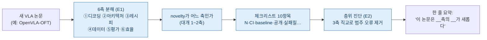
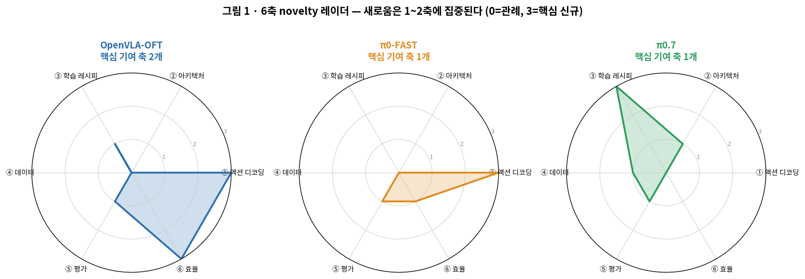
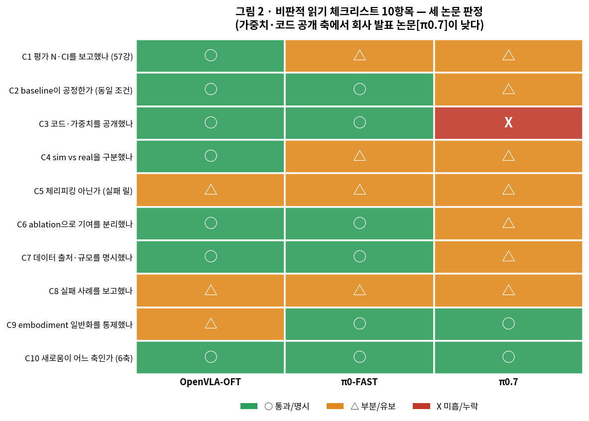
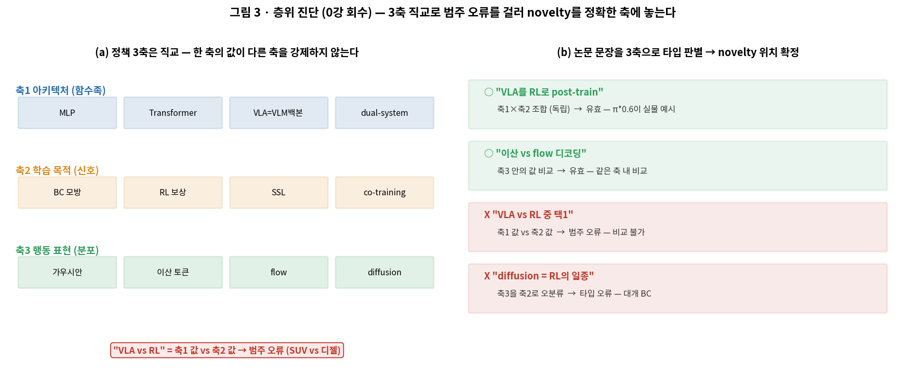
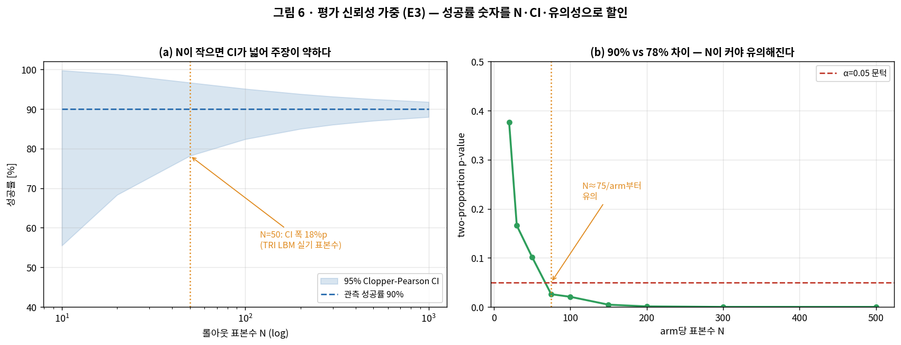
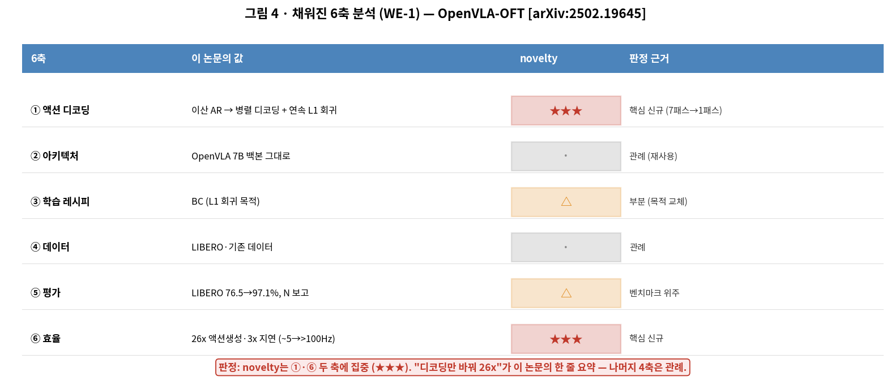

# Lec 64. 논문 읽기 프레임워크

> Part 15 두 번째 강의. 선수 지식: 0강(정책 3축 직교·타입 판별), 48강(System 2/1/0 라벨과 경계 차이), 57강(평가·N·CI), 63강(프론티어 지도). 44·45강(π 패밀리)을 봤다면 Worked Example이 훨씬 잘 읽힌다.
> 관련: 0·43·44·45·46·47·55·57·63·65(다음)·부록 D.
> 정보 기준일: 2026-07-09. 프론티어 논문 수치는 유통기한이 짧다 — 학습 시점에 Claude에게 최신본 확인을 요청할 것.

## 한 장 요약

새 VLA 논문을 만나면 "전부 새롭다"에 압도되기 쉽다. 이 강의의 도구는 그 반대를 훈련한다 — **6축 지도**로 기여를 6개 독립 질문에 투영하면 새로움은 대개 1~2축에 몰려 있고, **체크리스트 10항목**으로 주장을 할인하며, **층위 진단**(0강 3축)으로 "VLA vs RL" 같은 범주 오류를 걸러 novelty를 정확한 축에 놓는다. 결과물은 채워진 표 한 장과 "이 논문은 어느 축이 새로운가"라는 한 문장이다.

## 학습 목표

1. 임의의 VLA 논문을 **6축**(액션 디코딩·아키텍처·학습 레시피·데이터·평가·효율)으로 분해하고, novelty가 어느 축에 있는지 좌표로 짚을 수 있다(E1).
2. **비판적 읽기 체크리스트 10항목**을 논문에 적용해 각 주장을 통과/유보/미흡으로 판정하고, 특히 평가(N·CI·baseline·실패 릴)의 신뢰도를 걸러낼 수 있다.
3. **층위 진단**(0강 3축 직교)으로 논문의 한 문장을 타입 판별해 범주 오류와 유효 조합을 구분하고, novelty를 정확한 축에 놓을 수 있다(E2).
4. 평가의 성공률 숫자를 **이항 CI(Clopper-Pearson)·유의성**으로 할인해 "몇 %가 정말 유의한가"를 계산할 수 있다(E3).
5. 최근 논문(OpenVLA-OFT·π0.7 등)을 6축 지도 + 체크리스트로 완전 분석한 **채워진 표**를 만들고, "새로운 점"만 한 문단으로 요약할 수 있다(WE-1·WE-2).

## 왜 이 강의가 필요한가

63강까지 프론티어의 사실들(RL post-training, latent action, world model 수렴, 효율화)을 지도 위에 놓았다. 그러나 프론티어는 **매주 새 논문으로 갱신**된다 — 이 커리큘럼이 다루지 못한 다음 논문을 스스로 읽어야 한다. 그때 필요한 것은 더 많은 사실이 아니라 **읽는 절차**다.

초보자가 새 VLA 논문 앞에서 겪는 세 가지 실패가 있다. ① **압도** — 초록의 모든 문장이 새로워 보여 "다 중요하다"가 되고, 결국 아무것도 못 짚는다. ② **현혹** — "성공률 92%, SOTA 경신"이라는 숫자에 설득당해 N=20·baseline 불공정·실패 릴 누락을 놓친다. ③ **범주 오류** — "이 논문은 RL을 쓰는데 저 논문은 VLA다" 같은 비교 불가능한 문장을 쓴다(0강의 그 병).

이 강의는 세 실패에 각각 도구를 준다: 압도에는 **6축 분해**(새로움은 1~2축에 몰린다), 현혹에는 **체크리스트 10항목 + 이항 CI**(주장을 N·CI로 할인), 범주 오류에는 **층위 진단**(0강 3축 직교). 이 세 도구가 곧 65강 캡스톤에서 논문 2편을 완전 분석하는 절차이고, 그 뒤로는 평생 새 논문을 스스로 읽는 근육이다. **이 강의의 Worked Example은 numpy 토이가 아니라 실제 논문에 프레임워크를 채운 완성 분석**이다 — 프레임워크는 쓸 때만 배워진다.

## 본문

### 0. 세 도구의 관계 — 분해 → 할인 → 위치잡기

세 도구는 순서가 있다. 먼저 **6축 지도**로 논문을 6개 질문에 투영해 "무엇이 어디에 기여했나"를 펼친다. 그다음 **체크리스트 10항목**으로 각 기여 주장을 검증해 "그 주장을 믿을 만한가"를 판정한다(특히 ⑤평가 축은 E3의 이항 CI로 정량 할인). 마지막으로 **층위 진단**(0강 3축)으로 "이 새로움이 아키텍처인가 학습목적인가 행동표현인가"를 직교 판별해 범주 오류 없이 정확한 자리에 놓는다. 산출물은 채워진 6축 표 + "이 논문은 __축의 __가 새롭다"라는 한 문장이다.

이 세 도구는 앞 강의들의 회수다: 6축의 각 축이 특정 강의(①→44, ②→36·46, ③→45, ④→55, ⑤→57, ⑥→43·47)를 가리키고, 체크리스트의 평가 항목은 57강, 층위 진단은 0강의 정책 3축이다. **프레임워크는 새로운 지식이 아니라 이미 배운 것들을 "논문에 던지는 질문"으로 재배열한 것**이다.

### 1. 6축 지도 — 각 축은 논문에 던지는 하나의 질문

VLA 논문의 기여는 서로 독립인 6개 축 중 하나 이상에 놓인다. 각 축은 논문에 던지는 질문이다:

| 축 | 던지는 질문 | 값의 예 | 파고든 강의 |
|---|---|---|---|
| **① 액션 디코딩** | 행동을 어떻게 표현·생성하나? | 이산 AR / 연속 회귀 / flow / diffusion | 44 (π0·FAST), 43 (OFT) |
| **② 아키텍처** | 백본은? 계층 구조는? | VLM 백본 / dual-system / 단일망 | 36 (VLM), 46 (GR00T) |
| **③ 학습 레시피** | 무슨 신호로 훈련하나? | BC / RL post-train / co-training | 45 (RECAP), 41 (RL) |
| **④ 데이터** | 규모·출처·embodiment는? | teleop 시간 / 웹 / cross-embodiment | 55 (데이터) |
| **⑤ 평가** | 벤치마크·N·CI·baseline는? | LIBERO / 실기 / 통계 방법론 | 57 (평가) |
| **⑥ 효율** | 파라미터·주기·디코딩 비용은? | 파라미터 수 / Hz / 지연 | 43·47 (효율) |

**핵심 통찰 — novelty의 희소성**: 대부분의 논문은 이 6축 중 **1~2축**에만 핵심 기여를 하고 나머지는 관례를 따른다. π0-FAST는 거의 전적으로 ①(DCT 토크나이저)만 새롭고, OpenVLA-OFT는 ①·⑥(병렬 디코딩 → 26배)에, π0.7은 ③(다양 컨텍스트 조건화)에 몰린다. "새 논문 = 다 새롭다"가 아니라 **"어느 축이 새로운가"를 묻는 순간 논문이 작아진다.** 이것이 6축 분해의 실질적 가치다.

*그림 1: 세 논문의 6축 novelty 좌표(0=관례 따름, 3=핵심 신규 기여). OpenVLA-OFT는 ①·⑥ 두 축이 크고(핵심축 2개), π0-FAST는 ①에 거의 전부(핵심축 1개), π0.7은 ③에 몰린다(핵심축 1개). 세 논문 모두 6축 중 1~2축에만 별이 붙는다 — novelty는 희소하다. 점수는 성능이 아니라 "어느 축이 새로운가"의 판정값이다. 출처: [1][2][4], gen_figs.py 재현.*

> **System 2/1/0 라벨은 여기서도 경계 단서와 함께만.** ② 아키텍처 축에서 dual-system 논문(GR00T·Helix)을 위치잡을 때 벤더의 System 번호를 쓴다 — 단, 48강에서 못 박은 세 단서를 유지한다: (i) 번호는 역할·속도의 슬롯이지 학습/룰 여부가 아니고, (ii) 번호가 끝나는 자리가 회사마다 다르며(GR00T는 S1에서, Helix는 S0에서), (iii) PI·DeepMind은 "System" 용어를 아예 안 쓴다. 그래서 6축 분석에서 "이 논문의 System 1이 저 논문의 System 1과 같다"고 가정하면 안 되고, 각 층의 **주파수·입출력·인터페이스**를 확인해야 한다. 라벨은 위치잡기의 보조일 뿐 판정 근거가 아니다.

### 2. 비판적 읽기 체크리스트 10항목

6축이 "무엇이 새로운가"를 펼쳤다면, 체크리스트는 "그 주장을 믿을 만한가"를 검증한다. 10항목:

| # | 항목 | 무엇을 보나 | 관련 |
|---|---|---|---|
| C1 | **평가 N·CI를 보고했나** | 롤아웃 수, 신뢰구간, 통계 검정 | 57, E3 |
| C2 | **baseline이 공정한가** | 동일 데이터·컴퓨트·튜닝 예산인가 | 57 |
| C3 | **코드·가중치를 공개했나** | 재현 가능성 (오픈 / 회사 발표) | — |
| C4 | **sim vs real을 구분했나** | 성공률이 시뮬인가 실기인가 | 51·57 |
| C5 | **체리피킹 아닌가** | 실패 릴·전체 시행 공개 여부 | 57 |
| C6 | **ablation으로 기여를 분리했나** | 새 요소만 켜고 끈 대조 | 27 |
| C7 | **데이터 출처·규모를 명시했나** | 무엇으로 훈련했는지 추적 가능 | 55 |
| C8 | **실패 사례를 보고했나** | 어디서 무너지는지 | 37 |
| C9 | **embodiment 일반화를 통제했나** | 데이터 누출 없이 전이 주장했나 | 55 |
| C10 | **새로움이 어느 축인가** | 6축 중 어디 (§1) | 63 |

읽는 법: 각 항목을 **통과(명시적으로 잘 함) / 유보(부분·불충분) / 미흡(누락·불투명)**으로 판정한다. C1·C2·C5는 "성공률 현혹"을 막는 핵심 방어선이고(§본문 E3), C3·C7은 재현 가능성, C10은 6축 요약과 연결된다. **오픈 논문일수록 통과가 많고, 회사 발표(가중치 미공개)일수록 C3·C7이 미흡**해지는 경향은 그 자체로 논문의 성격을 말해준다 — "믿을 수 없다"가 아니라 "어떤 종류의 증거인가"를 분류하는 것이다(48강의 신뢰도 등급 [A]/[B]/[C]과 같은 정신).

*그림 2: 세 논문에 체크리스트 10항목을 적용한 판정 히트맵(초록=통과, 주황=유보, 빨강=미흡). OpenVLA-OFT·π0-FAST는 코드·가중치 공개(C3)에서 통과지만, 회사 발표인 π0.7은 C3(가중치 미공개)에서 미흡이고 C1·C4·C6·C7이 유보다 — "성능은 인상적이나 재현·검증 정보가 제한적"이라는 판정이 색으로 드러난다. 이것은 논문을 깎는 것이 아니라 증거의 종류를 분류하는 것. 판정 근거: [1][2][4], gen_figs.py 재현.*

### 3. 층위 진단 — 0강 3축 직교로 novelty를 정확한 축에 놓기

체크리스트가 "믿을 만한가"였다면, 층위 진단은 "그 새로움이 정확히 무엇인가"를 가른다. 0강의 정책 3축을 회수한다 — **아키텍처(함수족) ⊥ 학습 목적(신호) ⊥ 행동 표현(분포)**은 서로 직교하고, 한 축의 값이 다른 축을 강제하지 않는다.

이 직교성이 논문 읽기에서 하는 일은 **범주 오류를 거르는 것**이다. "VLA vs RL"은 축1의 값(VLA=아키텍처)과 축2의 값(RL=학습 목적)을 비교하는 문장이라 **비교 불가능**하다 — "SUV vs 디젤"과 같은 구조다. π*0.6은 VLA(축1)이면서 RL(축2)로 훈련됐다(45강)는 사실이 이를 증명한다. 반대로 "이산 토큰 vs flow"는 둘 다 축3(행동 표현)의 값이라 **유효한 비교**다(44강 FAST 논쟁).

층위 진단의 절차: 논문의 핵심 문장에서 각 조각을 3축 중 하나에 매핑한다 → 같은 축의 값끼리 비교하면 유효, 다른 축의 값을 비교하면 범주 오류. 그리고 novelty를 "축1이 새로운가(새 백본·계층), 축2가 새로운가(새 학습 신호), 축3이 새로운가(새 행동 표현)"로 정확히 위치시킨다. 이것이 6축과 만나는 지점: 6축의 ②아키텍처=3축의 축1, ③학습 레시피=축2, ①액션 디코딩=축3에 대응한다(④⑤⑥은 정책 함수 자체가 아니라 데이터·평가·구현 축이라 3축 바깥).

*그림 3: (a) 정책 3축(아키텍처·학습목적·행동표현)은 직교 — 각 축의 값이 자유롭게 조합된다. "VLA vs RL"은 축1 값과 축2 값의 비교라 범주 오류. (b) 논문 문장을 3축으로 타입 판별: "VLA를 RL로 post-train"(축1×축2 조합, 유효), "이산 vs flow"(축3 내 비교, 유효)는 통과하고, "VLA vs RL 중 택1"(범주 오류), "diffusion=RL의 일종"(축3을 축2로 오분류)은 걸러진다. 0강 E2의 논문 읽기 적용. gen_figs.py 재현.*

### 핵심 수식

이 파트는 메타·프레임워크라 "수식"이 계산식이라기보다 **분해·판별·할인의 형식**이다. 세 프레임워크: **E1** 6축 novelty 분해(좌표), **E2** 3축 직교 진단(타입 판별, 0강 회수), **E3** 평가 신뢰성 가중(이항 CI·유의성, 57강 회수). E3만 순수 numpy/scipy 계산이다.

#### E1. 6축 novelty 분해 — 논문 기여를 6개 독립 질문에 투영

**① 직관**: 논문의 기여를 하나의 덩어리("이 논문 좋다")로 보지 말고, 6개의 독립 질문(디코딩·아키텍처·레시피·데이터·평가·효율)에 각각 투영한다. 그러면 대부분의 기여가 1~2축에만 별이 붙고 나머지는 관례(0)임이 드러난다 — **새로움은 희소하다**.

**② 물리·기하적 의미**: 6축을 직교 좌표계로 보면, 논문 하나는 그 공간의 한 벡터 $\mathbf{v} \in \{0,1,2,3\}^6$다(각 성분 = 그 축의 novelty 강도). "새로움이 희소하다"는 이 벡터가 **sparse**하다는 것 — 대개 1~2개 성분만 크다. 두 논문을 비교할 때는 벡터 차 $\mathbf{v}_A - \mathbf{v}_B$의 0 아닌 성분이 "무엇이 다른가"를 정확히 짚는다. 성분이 큰 축이 그 논문의 "한 줄 요약"이 나오는 자리다(OpenVLA-OFT의 "디코딩만 바꿔 26배"는 ①·⑥ 성분).

**③ 형식(요점)**: 논문의 6축 novelty 벡터와 두 요약 지표
$$
\mathbf{v} = [\,v_1,\dots,v_6\,],\quad v_a \in \{0,1,2,3\}\ (\text{축 }a\text{의 novelty}),
$$
$$
\text{핵심축 수} = \#\{a : v_a \ge 2\},\qquad
\text{novelty 밀도} = \frac{1}{3\cdot 6}\sum_{a=1}^{6} v_a .
$$
핵심축 수가 작을수록(1~2) 논문이 "한 가지를 깊게" 한 것이고, novelty 밀도가 낮은데도 임팩트가 크면 그 한 축의 기여가 결정적이라는 뜻이다. 코드 검증: 세 논문의 벡터에서 핵심축 수 = 2/1/1, 밀도 = 0.44/0.28/0.33 — 모두 1~2축 집중(WE-1).

#### E2. 3축 직교 진단 — 타입 판별로 범주 오류 거르기 (0강 E2 회수)

**① 직관**: 정책을 만드는 세 선택 — 아키텍처(어떤 함수족), 학습 목적(무슨 신호), 행동 표현(어떤 분포) — 은 서로 독립이다. "A vs B"라는 문장을 만나면 A와 B가 **같은 축의 값인지** 먼저 확인한다. 같은 축이면 유효한 비교, 다른 축이면 범주 오류다.

**② 물리·기하적 의미**: 세 축이 직교한다는 것은 파라미터 공간에서 각 선택이 **독립적으로** 시스템을 변형한다는 뜻이다(0강 E2). 아키텍처를 고정한 채 학습 목적만 BC→RL로 바꾸면 같은 함수족 위에서 gradient 벡터장만 달라진다 — 도착지가 다른 것이지 차종이 다른 게 아니다. 그래서 "VLA(축1)를 RL(축2)로"는 두 축의 조합이라 가능하고(π*0.6이 실물), "VLA냐 RL이냐"는 두 축의 값을 대립시켜 성립하지 않는다.

**③ 형식(요점)**: 정책을 세 축의 튜플로 쓰면
$$
\pi = (\underbrace{\mathcal{A}}_{\text{축1 아키텍처}},\ \underbrace{\mathcal{L}}_{\text{축2 학습목적}},\ \underbrace{\mathcal{R}}_{\text{축3 행동표현}}),\qquad \mathcal{A}\perp\mathcal{L}\perp\mathcal{R}.
$$
문장 "$X$ vs $Y$"의 타입 판별:
$$
\text{axis}(X) = \text{axis}(Y) \Rightarrow \textbf{유효 비교},\qquad
\text{axis}(X) \ne \text{axis}(Y) \Rightarrow \textbf{범주 오류}.
$$
그리고 논문의 novelty를 $\Delta\mathcal{A}$(새 백본·계층) / $\Delta\mathcal{L}$(새 학습 신호) / $\Delta\mathcal{R}$(새 행동 표현) 중 어디인지로 위치시킨다. WE-2에서 π0.7의 한 문장을 이 판별에 걸어 novelty를 $\Delta\mathcal{L}$(다양 컨텍스트 조건화)에 놓는다.

#### E3. 평가 신뢰성 가중 — 이항 CI와 유의성으로 주장 할인 (57강 회수)

**① 직관**: "성공률 90%, SOTA"라는 숫자는 그 자체로는 아무것도 말하지 않는다. **N이 몇인가**가 그 90%의 신뢰구간을 정한다 — N=10이면 90%의 95% CI가 [56%, 100%]로 거의 무의미하고, N=300이면 [86%, 93%]로 단단해진다. 주장의 강도를 N·CI로 할인하는 것이 평가 축 읽기의 전부다.

**② 물리·기하적 의미**: 성공/실패는 이항(Bernoulli) 시행이라, 관측 성공률 $\hat p = k/n$의 불확실성은 **이항 신뢰구간**으로 정확히 잰다. 정규 근사(Wald)는 극단 확률에서 부정확하므로 여기서는 **Clopper-Pearson**(베타 분포 기반 정확 구간)을 쓴다 — 이 강의의 표준 도구다. (같은 목적을 TRI LBM 논문은 **베타 균등 사전분포 위의 베이지안 사후분포**로 잡아 바이올린 플롯으로 그린다 [3] — 균등 베타 사전 사후는 $\mathrm{Beta}(k{+}1,\,n{-}k{+}1)$이라 Clopper-Pearson의 베타 분위수와 수치적으로 거의 겹치므로, 아래 계산은 두 관점 모두의 근사다.) CI 폭은 $\sim 1/\sqrt{n}$로 좁아진다: N을 4배 늘려야 폭이 절반이 된다. 그래서 두 정책의 성공률 차이(예: 90% vs 78%)가 **유의**하려면 충분한 N이 필요하고, N=50에선 못 잡던 차이가 N=100에서 유의해진다.

**③ 형식(요점)**: 성공 $k$회/시행 $n$회의 Clopper-Pearson 95% CI는 베타 분위수로
$$
\text{CI} = \Big[\,B^{-1}\!\big(\tfrac{\alpha}{2};\,k,\,n-k+1\big),\ \ B^{-1}\!\big(1-\tfrac{\alpha}{2};\,k+1,\,n-k\big)\,\Big],\quad \alpha=0.05.
$$
두 정책 비교는 two-proportion $z$-검정:
$$
z = \frac{\hat p_A - \hat p_B}{\sqrt{\bar p(1-\bar p)(1/n_A + 1/n_B)}},\qquad \bar p = \frac{k_A+k_B}{n_A+n_B}.
$$
코드 검증(WE 아래): $\hat p=0.90$에서 CI 폭이 N=10/50/100/300에 대해 44.2 / 18.5 / 12.7 / 7.1 %p로 좁아지고, 90% vs 78% 차이는 N=50/arm에서 $p=0.10$(유의 아님) → N=100에서 $p=0.02$(유의)로 넘어간다. **"성공률이 높다"가 아니라 "그 차이가 N에서 유의한가"가 판정이다.**

*그림 4: (a) 관측 성공률 90%의 Clopper-Pearson 95% CI가 표본수 N에 따라 좁아진다 — N=50이면 CI 폭이 약 18.5%p(이 강의 계산값)라 웬만한 효과는 못 잰다. TRI LBM은 실기 태스크당 정확히 N=50 롤아웃으로 평가하며, 이 표본에서 성공률 불확실성을 베이지안 사후분포(바이올린)로 그려 "통계적으로 구별되는가"를 판정했다 [3] — 소표본 평가의 실물 모범. (b) 90% vs 78% 두 정책 차이의 two-proportion p-value가 N에 따라 내려간다 — N≈75/arm부터 α=0.05를 넘어 유의해진다. 성공률 숫자를 N·CI·유의성으로 할인하는 E3의 정량판. 방법론 근거: [3], gen_figs.py 재현.*

### Worked Example

**이 파트의 Worked Example은 numpy 토이가 아니라 실제 논문에 프레임워크를 채운 완성 분석이다.** WE-1은 한 논문을 6축 지도 + 체크리스트로 완전 분석하고, WE-2는 그 논문의 한 문장을 층위 진단으로 타입 판별한다. 웹으로 사실을 확인했다(참고문헌).

#### WE-1 (채워진 표): OpenVLA-OFT를 6축 지도 + 체크리스트로 완전 분석

**대상**: M. Kim et al., "Fine-Tuning Vision-Language-Action Models: Optimizing Speed and Success" (OpenVLA-OFT), arXiv:2502.19645 [1]. OpenVLA(43강)를 베이스로, **디코딩만 바꿔** 효율과 성능을 동시에 얻은 논문.

**Step 1 — 6축 분해**:

| 축 | 이 논문의 값 | novelty | 판정 근거 |
|---|---|---|---|
| ① 액션 디코딩 | 이산 AR → **병렬 디코딩 + 연속 L1 회귀** | ★★★ | 7번 forward → 1번, 순차→병렬 |
| ② 아키텍처 | OpenVLA 7B 백본 **그대로** | · | 관례 (재사용) |
| ③ 학습 레시피 | BC (L1 회귀 목적) | △ | 부분 (목적함수 교체, diffusion과 대등) |
| ④ 데이터 | LIBERO·기존 데이터셋 | · | 관례 |
| ⑤ 평가 | LIBERO 평균 76.5→**97.1%** | △ | 벤치마크 위주, N 보고 |
| ⑥ 효율 | **26배** 액션생성·3배 낮은 지연 (~5→>100Hz) | ★★★ | 핵심 신규 |

**판정**: novelty는 ①·⑥ 두 축에 집중(★★★). "디코딩만 바꿔 26배 + LIBERO 76.5→97.1%"가 이 논문의 한 줄 요약이고, ②·④는 완전히 관례다. 6축 벡터 $[3,0,1,0,1,3]$, 핵심축 2개, novelty 밀도 0.44(E1 코드 출력과 일치).

*그림 5: WE-1의 채워진 6축 분석표(OpenVLA-OFT). novelty가 ①액션 디코딩·⑥효율 두 축에만 ★★★로 붙고 나머지는 관례(·)·부분(△)이다. "디코딩만 바꿔 26배"라는 한 줄이 이 표에서 바로 읽힌다 — 43강의 "액션 헤드가 성능의 급소"라는 통찰을 정량화한 논문. 출처: [1], gen_figs.py 재현.*

**Step 2 — 체크리스트 10항목**(그림 2의 OpenVLA-OFT 열):

- C1 평가 N·CI: **유보/통과** — LIBERO 성공률과 시행을 보고하나 CI·유의성은 제한적(57강 기준으로는 개선 여지).
- C2 baseline 공정: **통과** — 같은 OpenVLA 베이스에서 디코딩만 바꿔 대조(ablation이 곧 공정 비교).
- C3 코드·가중치: **통과** — 오픈(openvla-oft.github.io).
- C4 sim vs real: **통과** — LIBERO(시뮬)와 실기(ALOHA) 구분.
- C5 체리피킹: **유보** — 벤치마크 평균 위주, 실패 릴은 제한적.
- C6 ablation: **통과** — 병렬 디코딩·L1·청킹 각각의 기여 분리.
- C7 데이터 출처: **통과**. C8 실패: **유보**. C9 embodiment: **유보**. C10 축: **통과**(①·⑥).

**한 줄 요약(산출물)**: "OpenVLA-OFT는 **행동 표현·디코딩 축**(③⊥①)에서만 새롭다 — 7B 백본(②)·데이터(④)를 그대로 두고 이산 AR을 병렬 L1 회귀로 바꿔 26배 가속과 LIBERO 76.5→97.1%를 얻었다. 43강 'OpenVLA-OFT가 디코딩만 바꿔 26배'의 원논문이며, novelty는 아키텍처가 아니라 디코딩에 있다." — 이 한 문단이 6축+체크리스트의 결과물이다.

#### WE-2 (층위 진단 적용): π0.7의 한 문장을 3축으로 타입 판별

**대상 문장**(π0.7, arXiv:2604.15483 [4], 요지): *"다양한 멀티모달 프롬프트로 스티어링하는 단일 generalist가, 태스크별 RL로 특화한 전문 정책들과 대등하거나 낫다."* 이 문장에는 비교가 섞여 있다 — 0강 3축으로 타입 판별한다.

| 문장 조각 | 3축 좌표 | 판정 |
|---|---|---|
| "단일 generalist"(스티어링) | 축2 학습 목적: **다양 컨텍스트 조건화** $\Delta\mathcal{L}$ | ✓ novelty의 자리 |
| "멀티모달 프롬프트로 스티어링" | 축2 위의 조건화 방식 (추론 시 프롬프트) | ✓ 유효 — 학습·추론 조건 |
| "태스크별 RL로 특화한 전문 정책" | 축2의 다른 값: **RECAP(RL post-train)** | ✓ 유효 — 같은 축2 내 비교 |
| "generalist vs 전문 정책" | 둘 다 **축2의 값** (조건화 vs RL 특화) | ✓ **유효 비교** — 같은 축 |

**판정**: 이 비교는 범주 오류가 **아니다** — "단일 generalist(다양 컨텍스트 조건화)"와 "태스크별 전문 정책(RL 특화)"은 둘 다 **축2(학습 목적/사후 처리 전략)**의 값이므로 같은 축 안의 유효한 비교다. 아키텍처(축1: ~4B VLM + MEM 비디오 인코더 + 860M expert)와 행동 표현(축3: flow 하이브리드)은 π0.6에서 거의 그대로 이어받았다 — 즉 novelty는 $\Delta\mathcal{L}$(축2, 다양 컨텍스트 조건화로 스티어링)에 있고 $\Delta\mathcal{A}$·$\Delta\mathcal{R}$은 아니다.

**대조 — 만약 논평이 "π0.7 vs RECAP 중 무엇이 옳은가"였다면?** 이건 여전히 축2 안이라 유효하다. 그러나 외부 논평의 "**VLA의 GPT-3 모먼트**"(45강에서 본, 논문 주장이 아닌 외부 프레임)는 다른 함정이다 — 능력 주장(축2 novelty)을 **패러다임 전환 서사**로 부풀린 것이라, 6축·체크리스트로는 C9(embodiment 일반화 통제: 양팔 UR5e 빨래가 정말 그 embodiment에서 빨래 데이터 0인가)·N·통제를 확인해야 한다. **층위 진단은 "무엇이 새로운가"를 정확히 축2에 놓고, 체크리스트는 "그 주장이 검증됐는가"를 따로 묻는다** — 두 도구가 각자 다른 일을 한다.

**흔한 범주 오류의 교정 예**(비교용): 만약 누군가 "π0.7은 RL 대신 스티어링을 쓴다"고 쓴다면 — "RL"(축2 값)과 "스티어링"(축2 값)은 같은 축이라 비교는 유효하나, "RL **대신**"은 배타적 선택을 함의해 틀렸다. π0.7도 RECAP 데이터로 co-train될 수 있고(축2는 조합 가능), 정확한 표현은 "태스크별 RL 특화 **없이** 다양 컨텍스트 조건화만으로 대등"이다. 축 안의 값들은 **대립이 아니라 조합**될 수 있다는 것이 3축 직교의 핵심 함의다.

### 로봇공학자를 위한 번역

- **6축 분해 = 서브시스템 분해(FMEA)의 논문판.** 회원님이 로봇셀을 감지·판단·제어·구동으로 나눠 "어느 서브시스템이 병목인가"를 짚듯, 논문을 6축으로 나눠 "어느 축이 기여인가"를 짚는다. 대부분의 개선이 한두 서브시스템에 몰리는 것과 novelty가 1~2축에 몰리는 것은 같은 희소성이다.
- **층위 진단 = 차원 해석(dimensional analysis).** 물리량을 비교할 때 단위가 같은지 먼저 보듯("힘 vs 에너지"는 비교 불가), 논문 문장의 두 개념이 같은 축(같은 "단위")인지 먼저 본다. "VLA vs RL"은 단위가 다른 양의 비교라 범주 오류 — 차원이 안 맞으면 방정식이 틀린 것과 같다.
- **평가 신뢰성 가중 = 측정 불확실성 전파.** 회원님이 센서 측정에 오차 막대를 붙이고 "이 차이가 노이즈 안인가"를 묻듯, 성공률에 이항 CI를 붙이고 "이 SOTA 차이가 N 안에서 유의한가"를 묻는다. N=50의 CI 폭 18.5%p는 곧 "±9%p 오차 막대"이고, 그보다 작은 차이는 못 잰다.

## 흔한 오해

1. **"새 논문은 전부 새롭다"** — 대개 1~2축만 새롭다(E1, 그림 1). π0-FAST는 ①(디코딩)에 거의 전부, OpenVLA-OFT는 ①·⑥에 몰린다. "다 새롭다"는 압도이지 판독이 아니다 — 6축에 투영하면 논문이 작아지고, 그 작아진 1~2축이 정확히 "새로운 점"이다. 65강 캡스톤의 목표가 바로 이 축소다.
2. **"높은 성공률 = 좋은 논문"** — 성공률 숫자는 N·CI·baseline 없이는 무의미하다(E3). N=10의 90%는 95% CI가 [56%, 100%]로 거의 아무 말도 안 하고, 불공정 baseline과의 비교는 그 자체로 무효다. TRI LBM이 실기 태스크당 N=50만 굴리면서도 성공률에 베이지안 사후분포(바이올린)를 붙이고 블라인드 랜덤화로 "통계적으로 구별되는가"를 따진 이유 [3] — 소표본에서는 점추정이 아니라 분포를 봐야 한다. **"몇 %"가 아니라 "그 차이가 N에서 유의한가"를 물어라**(그림 4).
3. **"VLA vs RL 비교"** — 범주 오류다(E2, 0강). VLA는 축1(아키텍처), RL은 축2(학습 목적)라 비교 불가능하다 — "SUV vs 디젤"과 같다. π*0.6이 VLA이면서 RL로 훈련됐다는 사실(45강)이 반례. 올바른 비교는 같은 축 안에서만: "BC만 vs BC+RL"(축2), "이산 vs flow"(축3).
4. **"System 2/1/0로 아무 논문이나 라벨"** — 경계가 회사마다 다르다(48강 단서). GR00T는 System 번호가 S1에서 끝나고(저수준 제어기는 번호 밖), Helix는 S0(1kHz 전신 서보)까지 번호 안이며, PI·DeepMind은 "System" 용어를 아예 안 쓴다. "이 논문의 System 1 = 저 논문의 System 1"이라는 가정이 논문 비교의 단골 오류 — 라벨이 아니라 **각 층의 주파수·입출력·인터페이스**를 확인하라.
5. **"6축은 위계(중요도 순서)다"** — 아니다. 6축은 **독립 좌표**이지 순위가 아니다(E1). ①이 ⑥보다 위가 아니고, 각 논문마다 어느 축이 큰지가 다르다 — OpenVLA-OFT는 ①·⑥, π0.7은 ③이 크다. 6축은 "무엇이 더 중요한가"가 아니라 "어디에 놓이는가"를 묻는 지도다.
6. **"채워진 표가 곧 논문 평가(점수)다"** — 아니다. 6축의 novelty 점수는 "어느 축이 새로운가"의 판정값이지 논문의 좋고 나쁨이 아니다. novelty 밀도가 낮아도(π0-FAST 0.28) 그 한 축의 기여가 필드를 바꿀 수 있다. 표는 **위치 지도**이지 성적표가 아니다.

## 실습 (1.5~2시간, GPU 불필요)

**목표: 프레임워크를 실제 논문 하나에 처음부터 끝까지 적용해 채워진 표 + 한 줄 요약을 만든다.**

준비: 서베이 "An Anatomy of VLA Models"(부록 B) 접속, 분석할 논문 1편 선택(추천: 아직 이 커리큘럼이 다루지 않은 최근 arXiv VLA 논문 — Claude에게 "2026년 최근 VLA 논문 하나 추천"을 요청).

1. **(30분) 6축 분해.** 논문의 초록·그림·표만 읽고 §1의 6축 표를 채운다. 각 축에 그 논문의 값을 쓰고 novelty를 0~3으로 매긴다. "핵심축이 몇 개인가"를 세고, 1~2개가 아니면 다시 본다(대개 과대평가). 그림 1 스타일로 레이더를 손으로 그려도 좋다.
2. **(25분) 체크리스트 10항목.** §2의 10항목을 통과/유보/미흡으로 판정한다. 특히 C1(N·CI)·C2(baseline)·C5(실패 릴)에서 논문이 무엇을 **안** 보고했는지 목록화한다 — 누락이 곧 그 논문의 성격이다.
3. **(20분, CPU) 평가 신뢰성 계산.** 논문이 보고한 성공률과 N을 `images/lec64/gen_figs.py`의 `clopper_pearson(k, n)`에 넣어 95% CI를 구한다. baseline과의 차이를 `two_prop_z`로 검정해 "이 SOTA 주장이 유의한가"를 판정한다. N이 없으면 그 자체가 C1 미흡.
4. **(25분) 층위 진단.** 논문에서 "A vs B" 또는 "A를 B로" 형태의 핵심 문장 하나를 골라 0강 3축으로 타입 판별한다(WE-2 형식). 범주 오류가 있으면 교정하고, novelty가 $\Delta\mathcal{A}/\Delta\mathcal{L}/\Delta\mathcal{R}$ 중 어디인지 확정한다.
5. **(20분) 한 문단 요약 + Claude 검증.** WE-1의 마지막 형식으로 "이 논문은 __축의 __가 새롭다"를 한 문단으로 쓰고, Claude에게 "내가 놓친 축이나 과대평가한 novelty가 있는가"를 검증받는다. 이 요약이 65강 캡스톤 리포트의 최소 단위다.

## Claude와 토론할 질문

1. 6축이 정말 독립인가? 한 축의 선택이 다른 축을 기울이는 사례(예: 이산 토큰[①]이 AR 아키텍처[②]와, flow[①]가 별도 expert[②]와 친화적)를 찾아 "완전 직교"에 반박해 보라. 그래도 6축 분해가 유용한 이유는?
2. novelty 점수(0~3)를 매기는 것은 주관적이다. 두 사람이 같은 논문에 다른 벡터를 매길 때, 그 불일치를 줄이는 규약(예: "핵심축 = 논문의 제목·초록 첫 문장이 가리키는 축")을 설계하라.
3. 체크리스트 10항목 중 회사 발표 논문(가중치 미공개)에 **적용 불가능**한 항목은? 그럼에도 그런 논문을 읽어야 하는 이유(48강)와, 무엇을 대신 신뢰 신호로 삼을지 논하라.
4. E3에서 N=50이면 90%의 CI 폭이 18.5%p다. 그런데 실기 로봇 롤아웃은 한 번에 수 분이 걸려 N=300이 비현실적일 때가 많다. 이 현실적 제약에서 "적은 N으로도 강한 주장"을 하는 정당한 방법(짝지은 비교, 태스크 다양화, 부트스트랩)은 무엇인가?
5. "VLA vs RL"이 범주 오류라면, "VLA vs world model(WAM)"(63강)은 유효한 비교인가 범주 오류인가? 3축 또는 6축으로 판별하라. (힌트: WAM은 정책인가 환경인가?)
6. π0.7의 "GPT-3 모먼트"(외부 논평)를 6축·체크리스트로 걸러 읽으면 무엇이 남는가? 능력 주장(축2)과 패러다임 서사를 분리하는 구체적 질문 3개를 만들어라.
7. 이 프레임워크 자체의 사각지대는? 6축·체크리스트·3축이 **못 잡는** 종류의 novelty(예: 문제 정의 자체의 전환, 새 벤치마크의 창설)가 있다면 무엇이고, 어떻게 보완할까?

## 읽을거리

1. **"An Anatomy of VLA Models" 서베이** [6] (arXiv:2512.11362, ~40분): 이 강의 6축 지도의 참조. 5대 도전(표현·실행·일반화·안전·데이터/평가) 분류를 6축과 대조하며 읽되, **§ Milestones의 모델 계보 표만** 정독하고 세부는 훑기. "서베이의 축 vs 이 강의의 6축이 어디서 같고 다른가"를 표로 정리.
2. **OpenVLA-OFT 논문** [1] (arXiv:2502.19645, ~25분): WE-1의 대상. **초록 + Table(LIBERO 76.5→97.1%) + 디코딩 그림만** — "디코딩만 바꿔 26배"가 6축의 ①·⑥에 어떻게 떨어지는지 직접 확인.
3. (선택) **TRI LBM 평가 방법론** [3] (arXiv:2507.05331, ~20분): **§평가 방법론(베이지안 사후분포·바이올린 플롯·블라인드 랜덤화 시행)만** — E3·체크리스트 C1·C2의 실물 모범. "소표본(태스크당 N=50)에서 점추정 대신 분포를 본다"의 원전. (본 강의는 같은 이항 불확실성을 Clopper-Pearson으로 계산하는데, 균등 베타 사전 사후분포와 수치적으로 거의 같다.)

## 자가 점검

1. 6축의 각 축(①~⑥)과 그 축이 던지는 질문·관련 강의를 안 보고 말할 수 있는가? "새로움은 대개 1~2축"의 의미를 그림 1로 설명할 수 있는가?
2. 비판적 읽기 체크리스트 10항목을 대략 말하고, 그중 "성공률 현혹"을 막는 핵심 3항목(C1·C2·C5)과 "재현 가능성" 항목(C3·C7)을 구분할 수 있는가?
3. 층위 진단으로 "VLA vs RL"이 왜 범주 오류인지(축1 값 vs 축2 값), "이산 vs flow"가 왜 유효 비교인지(축3 내) 설명하고, π*0.6을 반례로 들 수 있는가?
4. E3로 관측 성공률 90%의 CI가 N=10/50/300에서 어떻게 좁아지는지(44/18.5/7.1 %p), 90% vs 78% 차이가 어느 N부터 유의해지는지(N≈75~100/arm) 말할 수 있는가?
5. OpenVLA-OFT의 6축 벡터가 $[3,0,1,0,1,3]$(핵심축 2개, ①·⑥)이고 "디코딩만 바꿔 26배"가 그 한 줄 요약임을 표로 재구성할 수 있는가?
6. π0.7의 "generalist vs 전문 정책" 비교가 왜 범주 오류가 아닌지(둘 다 축2), novelty가 왜 $\Delta\mathcal{L}$(다양 컨텍스트 조건화)에 있는지 설명할 수 있는가?
7. System 2/1/0 라벨을 6축 분석에 쓸 때 반드시 붙여야 할 세 단서(역할이지 구현 아님·경계가 회사마다 다름·PI/DeepMind은 용어 안 씀)를 말할 수 있는가?

## 참고문헌

> 본문 수치·주장의 출처. 웹 문서는 2026-07-09 접속 기준. (2차) = 언론·2차 출처. 프론티어 논문 수치는 유통기한이 짧아 학습 시점 재확인 권장.

[1] M. J. Kim et al., "Fine-Tuning Vision-Language-Action Models: Optimizing Speed and Success" (OpenVLA-OFT), arXiv:2502.19645, 2025.2. https://arxiv.org/abs/2502.19645 · 프로젝트: https://openvla-oft.github.io/
— **뒷받침**: WE-1·그림 1·2·5 — 병렬 디코딩 + 액션 청킹 + 연속 L1 회귀로 이산 AR 대체, 26배 액션생성·3배 낮은 지연(~5Hz→>100Hz), LIBERO 평균 76.5→97.1%, 코드·가중치 오픈. 43강 "디코딩만 바꿔 26배"의 원논문.

[2] K. Pertsch et al. (Physical Intelligence), "FAST: Efficient Action Tokenization for Vision-Language-Action Models," arXiv:2501.09747, 2025.1. https://arxiv.org/abs/2501.09747
— **뒷받침**: 그림 1·2의 π0-FAST 행 — DCT→양자화→BPE 토크나이저(액션 디코딩 축 ①에 novelty 집중), naive 대비 ~10배 압축, AR 훈련 ~5배 빠른 수렴. 44강과 동일.

[3] Toyota Research Institute, "A Careful Examination of Large Behavior Models for Multitask Dexterous Manipulation," arXiv:2507.05331, 2025.7. https://arxiv.org/abs/2507.05331 · 프로젝트: https://toyotaresearchinstitute.github.io/lbm1/
— **뒷받침**: E3·그림 4·체크리스트 C1·C2·C5 — 실기 태스크당 N=50 롤아웃을 **블라인드·랜덤화** 시행으로 평가하고, 성공률 불확실성을 **베타 균등 사전분포 위의 베이지안 사후분포(바이올린 플롯)**로 시각화해 정책 간 통계적 구별 가능성을 판정(표준 CI 대신 전체 사후분포를 보는 이유를 명시). 본 강의 E3의 Clopper-Pearson 계산은 이 균등 베타 사후분포와 수치적으로 거의 겹치는 프리퀀티스트 대응물이다. 57강과 연결. (주의: "50 롤아웃 = CI 폭 20~30%p"라는 특정 수치 경고는 이 논문의 문장이 아니라 소표본 이항 CI의 일반 성질이다 — 본 강의 그림 4(a)의 계산값 참조.)

[4] Physical Intelligence, "π0.7: a Steerable Generalist Robotic Foundation Model with Emergent Capabilities," arXiv:2604.15483, 2026.4. https://arxiv.org/abs/2604.15483 · 블로그: https://www.pi.website/blog/pi07
— **뒷받침**: WE-2·그림 1·2 — 5B VLA(~4B VLM 백본 + MEM-style 비디오 히스토리 인코더 + ~860M action expert), 다양 멀티모달 컨텍스트 조건화로 스티어링(학습 레시피 축 ③에 novelty), 태스크별 RL 특화 전문 정책과 대등, 양팔 UR5e zero-shot 빨래(조합 일반화 신호). 가중치 미공개(회사 발표). "GPT-3 모먼트"는 외부 논평(45강 §4·흔한 오해 5 참조). 45강과 동일.

[5] S. Ye et al., "Latent Action Pretraining from Videos" (LAPA), arXiv:2410.11758, 2024.10 (ICLR 2025). https://arxiv.org/abs/2410.11758 · 프로젝트: https://latentactionpretraining.github.io/
— **뒷받침**: 6축 분석 예시로서의 latent action 계보(63강 ②와 연결) — VQ-VAE 기반 이산 latent action을 프레임 간 학습(액션 라벨 없는 인터넷 영상 사전학습), 소량 로봇 데이터로 latent→robot action 파인튜닝. "새로움이 데이터 축④(라벨 없는 영상)와 학습 레시피 축③에 있는" 논문의 예.

[6] S. Zhu et al., "An Anatomy of Vision-Language-Action Models: From Modules to Milestones and Challenges," arXiv:2512.11362, 2025.12. https://arxiv.org/abs/2512.11362 · 살아있는 서베이: https://suyuz1.github.io/VLA-Survey-Anatomy/
— **뒷받침**: 읽을거리 1·6축 지도의 참조 — 모듈→마일스톤→도전(표현·실행·일반화·안전·데이터/평가 5대 도전) 구조의 living survey. 이 강의 6축과 대조 대상.

[7] 본 커리큘럼 0강 "Physical AI 로봇 시스템 해부," part01-orientation/lec00-system-anatomy.md.
— **뒷받침**: E2·§3 층위 진단 — 정책 3축 직교(아키텍처⊥학습목적⊥행동표현)와 "VLA vs RL 범주 오류" 판별의 원천. §7.5(48강)의 System 2/1/0 경계 단서와 정합.

*수치 재현성: 본문·그림의 정량 수치는 `images/lec64/gen_figs.py`(numpy 1.26 / scipy 1.15 / matplotlib 3.5, CPU만)의 실행 출력이다 — E1의 6축 벡터·핵심축 수·novelty 밀도(OpenVLA-OFT [3,0,1,0,1,3]/2개/0.44, π0-FAST [3,0,0,0,1,1]/1개/0.28, π0.7 [0,1,3,1,1,0]/1개/0.33)는 프레임워크 판정값이며, E3의 Clopper-Pearson CI 폭(N=10/20/50/100/300/1000 → 44.2/30.5/18.5/12.7/7.1/3.8 %p, p̂=0.90 고정)과 two-proportion 유의성(90% vs 78%: N=50→p=0.102 유의 아님, N=100→p=0.021 유의, N=300→p<0.001)은 scipy.stats.beta·norm의 순수 계산이다. 시드 고정 불필요(결정론적 계산). **6축 novelty 점수는 논문 기여의 "어느 축인가" 판정값이지 성능·품질 점수가 아니다** — 논문 실측 스펙(파라미터·성공률·속도)은 [1][4]의 1차 출처.*

<!-- lecture-nav -->

---

⬅ 이전: [Lec 63. 프론티어 지도 (2025-26)](lec63-frontier-map.md)　｜　[📖 전체 목차](../README.md)　｜　다음: [Lec 65. 캡스톤 — 최근 논문 2편을 프레임워크로 완전 분석하고 "새로운 점"만 남기기](lec65-capstone.md) ➡
