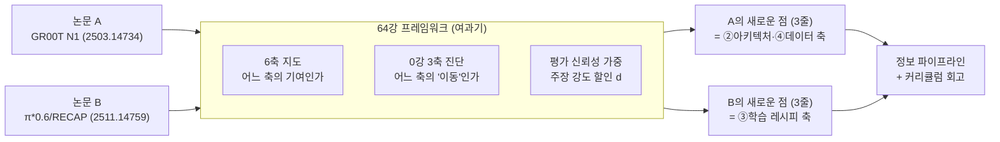
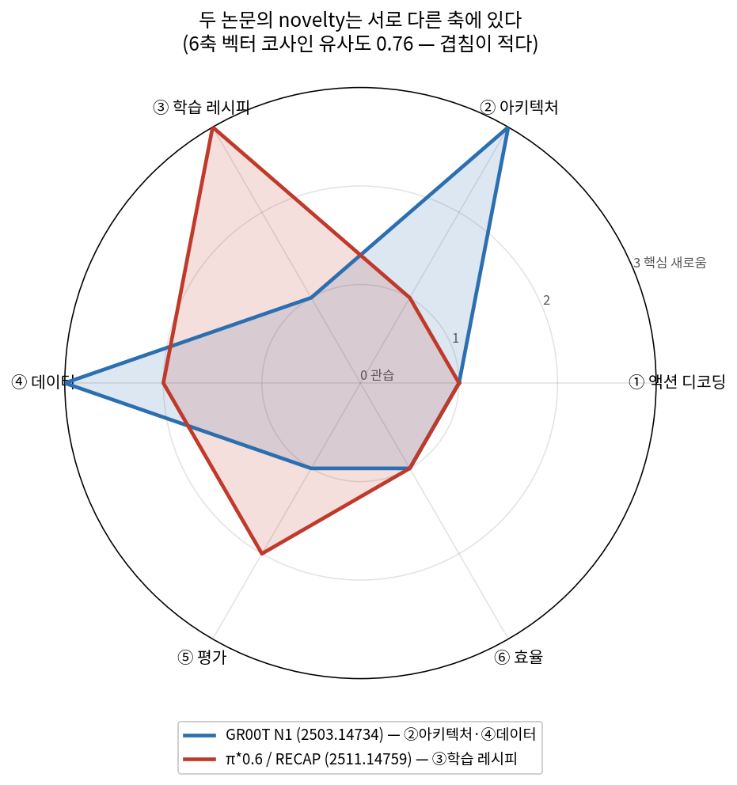
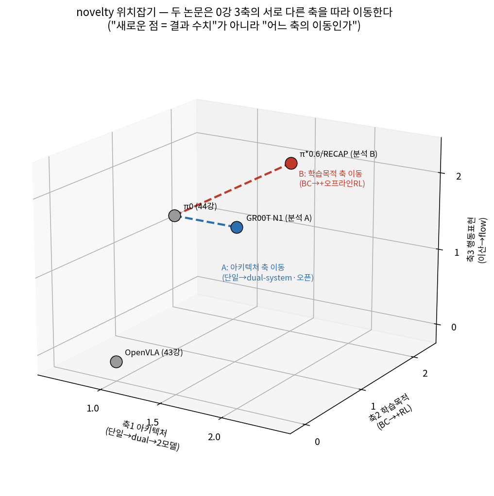
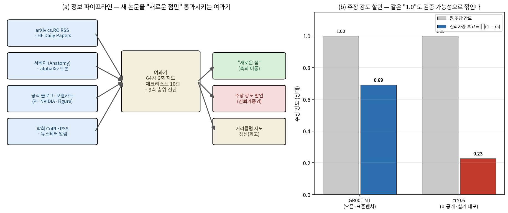
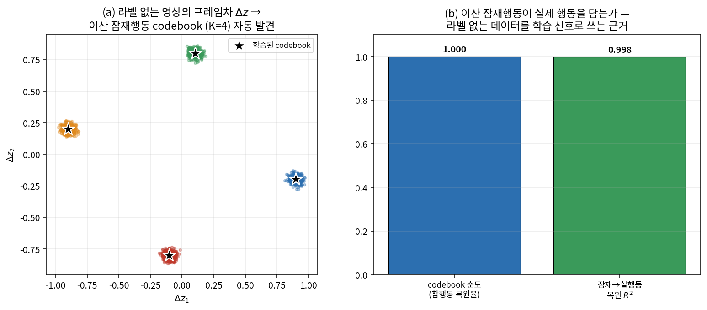
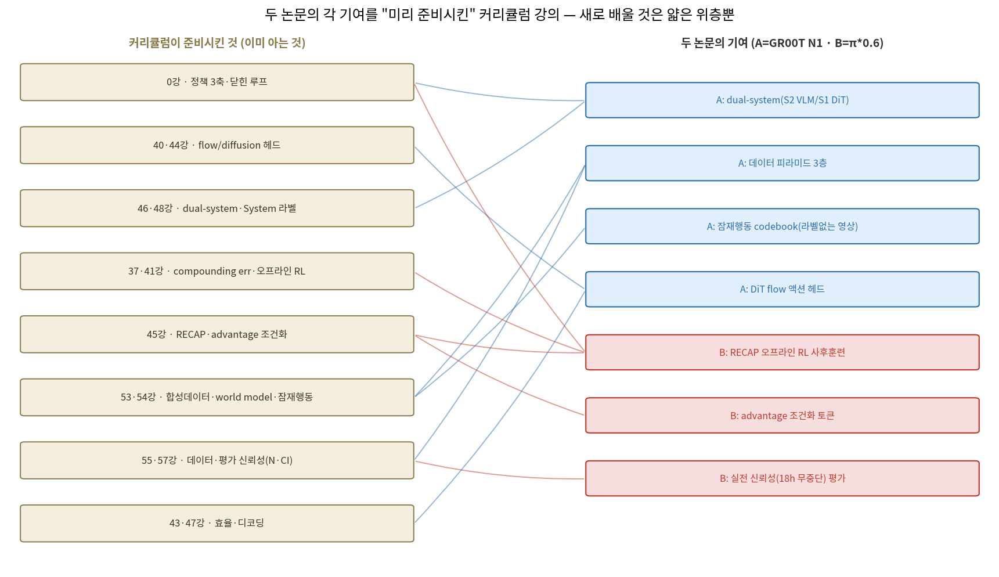

# Lec 65. 캡스톤 — 최근 논문 2편을 프레임워크로 완전 분석하고 "새로운 점"만 남기기

> ★ 커리큘럼의 정점. 선수 지식: **64강 전 과정**(6축 지도·비판적 읽기 체크리스트·3축 층위 진단). 관련: 0강(정책 3축·닫힌 루프), 44·45강(π 패밀리·RECAP), 46·48강(GR00T·System 라벨), 57강(평가 신뢰성·N·CI), 63강(프론티어 지도·잠재행동), 부록 D(CS285 오프라인 RL).
> 정보 기준일: 2026-07-09. 이 강의의 Worked Example은 **두 실제 논문의 완성된 분석 그 자체**다 — numpy 토이가 아니라, 채워진 표·판정·"새로운 점만" 요약이 결과물이다.

## 한 장 요약

이 커리큘럼의 마지막 훈련: **새 논문 두 편을 64강 프레임워크에 넣어, "이미 아는 것"을 걸러내고 "진짜 새로운 것"만 세 줄로 남긴다.**



두 논문은 **novelty가 서로 다른 축에 있다** — GR00T N1은 ②아키텍처(dual-system 오픈화)·④데이터(피라미드+잠재행동), π*0.6은 ③학습 레시피(RECAP: 오프라인 RL 사후훈련). 6축 벡터의 코사인 유사도가 0.76으로 겹침이 적다. 이것이 "새로운 점 = 결과 수치"가 아니라 "새로운 점 = 어느 축의 이동인가"라는 캡스톤의 핵심 명제다.

## 학습 목표

1. 64강 6축 지도로 두 논문의 기여를 각각 어느 축의 무엇으로 위치시키고, "이미 아는 것 vs 진짜 새로운 것"을 가를 수 있다.
2. 0강 정책 3축(아키텍처⊥학습목적⊥행동표현) 진단으로 각 논문의 novelty가 **어느 축을 따라 이동**했는지 좌표로 짚고, 두 논문이 다른 축에 있음을 보일 수 있다.
3. 평가 신뢰성 가중(주장 강도 할인 $d=\prod(1-p_i)$)을 두 논문에 실제로 적용해, 같은 "강도 1.0" 주장이 재현·검증 가능성으로 얼마나 깎이는지 계산할 수 있다.
4. 두 논문 각각을 세 줄("새로운 점만")로 요약하고, A와 B를 같은 축에서 대조할 수 있다.
5. 새 논문을 계속 따라가는 **정보 파이프라인**을 구성하고, 이 커리큘럼의 어느 강의가 각 기여를 미리 준비시켰는지 회고할 수 있다.

## 왜 이 강의가 필요한가

63강은 프론티어의 지형을, 64강은 그 지형을 읽는 도구(6축·체크리스트·층위 진단)를 줬다. 그러나 도구는 **실제로 논문 두 편에 채워 넣어 보기 전까지는 손에 붙지 않는다.** 새 VLA 논문은 매주 나오고, 각각 "SOTA 갱신", "GPT-3 모먼트", "emergent capability" 같은 강한 프레임을 달고 온다. 처음부터 끝까지 다 읽으면 시간이 없고, 초록만 읽으면 새로움의 위치를 못 짚는다.

이 캡스톤은 그 사이의 근육을 완성한다: **논문을 처음부터 끝까지 읽는 대신, 6축으로 "새로움이 실린 축"만 정독하고, 3축으로 "그 새로움이 어느 이동인가"를 좌표화하고, 신뢰가중으로 "그 주장을 얼마나 믿을까"를 할인한다.** 이 세 통과를 거치면 논문 한 편이 "세 줄"로 압축되고, 그 세 줄이 커리큘럼 지도 위 한 자리를 차지한다. 이것이 README 4줄의 최종 목표 — "새로운 점만 파악하면 나머지는 이미 아는 상태" — 를 실제로 수행하는 강의다.

두 논문을 **의도적으로 다른 축에 새로움이 있는 것으로** 골랐다. GR00T N1(NVIDIA, 2025.3)은 아키텍처·데이터 축에서, π*0.6/RECAP(Physical Intelligence, 2025.11)은 학습 레시피 축에서 새롭다. 둘을 나란히 놓으면 "새로움은 한 자리에 있지 않다"는 것과, 같은 6축 틀로 서로 다른 종류의 기여를 공정하게 위치시키는 법이 동시에 보인다.

## 본문

### 1. 세 통과(three passes) — 프레임워크를 논문에 채우는 절차

64강의 도구를 한 논문에 적용하는 순서를 못 박는다. 이 절차 자체가 재사용 가능한 체크리스트다.

1. **통과 1 — 6축 위치잡기(§핵심 수식 F1).** 논문의 기여를 6축(①액션 디코딩 ②아키텍처 ③학습 레시피 ④데이터 ⑤평가 ⑥효율)에 서수(0=관습 … 3=핵심 새로움)로 채운다. 3이 붙는 축이 "정독할 곳", 0~1인 축은 "이미 아는 것(빠르게 확인만)".
2. **통과 2 — 3축 이동 진단(§F2).** 0강 정책 3축(아키텍처⊥학습목적⊥행동표현)에서 이 논문이 **직전 세대 대비 어느 축을 따라 움직였는가**를 좌표로 찍는다. novelty는 대개 "새 결과"가 아니라 "축 위의 한 걸음"이다.
3. **통과 3 — 주장 강도 할인(§F3).** 논문의 핵심 주장을 64강 체크리스트(가중치 공개·N·CI·실패 공개·베이스라인 통제·독립 재현)로 할인한다. SOTA 수치가 커도 재현 불가면 강도가 깎인다.

이 세 통과의 산출물이 곧 **"새로운 점만" 3~5줄 요약**이다. 아래 WE-1(GR00T N1)·WE-2(π*0.6)가 이 절차를 실제 논문에 완주한 결과다.

### 2. 두 논문 한눈에 — 무엇을 만들었나 (사실만, 웹 확인)

읽기 전에 각 논문이 "무엇인지"만 사실로 못 박는다. 아래는 전부 1차 자료(참고문헌)에서 확인한 것이다.

- **논문 A — GR00T N1** (NVIDIA, arXiv:2503.14734, 2025.3, 41인 저자, 리드 Jim Fan·Yuke Zhu) [1]. 휴머노이드용 **오픈** 파운데이션 모델. dual-system: **System 2 = VLM**(Eagle-2 백본, ~10Hz on L40) + **System 1 = diffusion transformer**(120Hz), end-to-end 공동학습. 공개판 GR00T-N1-2B는 총 2.2B(VLM 1.34B). 16개 액션을 63.9ms에 샘플. **데이터 피라미드 3층**: 실기 궤적(5만+ teleop) / 인간 1인칭 영상 3M 클립(VQ-VAE 잠재행동 codebook + IDM 유사행동) / 합성(신경 영상 생성+시뮬). Fourier GR-1·ALOHA·단일팔 cross-embodiment.
- **논문 B — π*0.6 / RECAP** (Physical Intelligence, arXiv:2511.14759, 2025.11) [2]. **RECAP** = RL with Experience and Corrections via Advantage-conditioned Policies. π0.6 베이스(Gemma 3 4B 백본 + ~860M expert ≈ 5B, 45강). 3단계(시연 → 실수 순간 인간 teleop 보정 → 자율 RL, advantage 조건화 토큰). 오프라인 RL 사후훈련으로 이종 경험(시연·on-policy·개입) 통합. 결과: 처리량 2배+, 실패율 절반 이하, 에스프레소 **18시간(13~18h)** 무중단, 새 집 빨래 50벌, 공장 박스 59개 [2][45강].

두 논문 모두 "VLM + 액션 헤드" 템플릿(44강 π0가 세운 것)의 **변주**다. 그래서 새로움은 템플릿 자체가 아니라 **어느 축을 건드렸나**에 있다 — 그것을 세 통과로 가른다.

### 핵심 수식 (= 프레임워크의 형식화)

이 강의의 "수식"은 물리 법칙이 아니라 **판정 절차의 형식화**다. 세 개다: F1 6축 novelty 판정, F2 3축 이동, F3 주장 강도 할인. 각각을 두 논문에 실제로 적용한 것이 Worked Example이다.

#### F1. 6축 novelty 벡터와 두 논문의 겹침도

**① 직관**: 논문의 기여를 6개 축에 "새로움 강도" 서수로 매긴 벡터 $\mathbf{n}\in\{0,1,2,3\}^6$로 본다. 두 논문의 $\mathbf{n}$이 얼마나 겹치는가(코사인 유사도)가 "같은 종류의 기여인가"를 잰다.

**② 물리·기하적 의미**: 6축은 64강이 정의한 서로 (거의) 독립인 관심축이다. 한 논문의 novelty가 한두 축에 몰리는 것이 정상 — 모든 축이 3인 논문은 없다(있다면 과장). 두 벡터의 코사인이 1에 가까우면 "같은 축을 민 경쟁 논문", 0에 가까우면 "다른 자리의 기여라 직접 비교 불가".

**③ 형식(유도 요점)**: 축 $i$의 novelty 서수 $n_i$에 대해
$$
\cos(\mathbf{n}_A, \mathbf{n}_B) = \frac{\mathbf{n}_A\cdot\mathbf{n}_B}{\lVert\mathbf{n}_A\rVert\,\lVert\mathbf{n}_B\rVert},
\qquad
\text{“새로움이 실린 축”} = \{\, i : n_i \ge 2 \,\}.
$$
$\{i:n_i\ge2\}$는 "새로움이 실린 축"의 **넓은 집합**(핵심 3 + 부차 2)이고, 그중 서수 3인 축이 **핵심 축**이다 — 아래 mermaid·요약의 "A=②④·B=③"은 이 핵심 축(=3)만 추린 것이고, 부차 축(π*0.6의 ④⑤=2)은 WE-2에서 "다소 새로움"으로 따로 다룬다. WE에서 채운 값으로 GR00T $\mathbf{n}_A=[1,3,1,3,1,1]$(②④에 3), π*0.6 $\mathbf{n}_B=[1,1,3,2,2,1]$(③에 3, ④⑤에 2)이고 $\cos=0.76$ — **겹침이 있으되(둘 다 데이터를 다룸) 핵심 축은 다르다.** 서수는 임의 점수가 아니라 §2 사실에서 도출한 판정이다.



*그림 1: 두 논문의 6축 novelty 벡터를 레이더로 겹쳐 그린 것. 파랑(GR00T N1)은 ②아키텍처·④데이터로, 빨강(π*0.6)은 ③학습 레시피로 뻗는다. 두 벡터의 코사인 유사도 0.76 — "겹침이 적다 = 서로 다른 축에 새로움". 축별 서수의 근거는 WE-1·WE-2 표. gen_figs.py 재현.*

#### F2. 0강 3축 위의 novelty 이동 벡터

**① 직관**: novelty는 절대 좌표가 아니라 **직전 세대에서의 이동**이다. 0강 3축(아키텍처·학습목적·행동표현)에서 "이 논문이 부모 모델 대비 어느 축으로 한 걸음 갔나"를 화살표로 본다.

**② 물리·기하적 의미**: 같은 6축 novelty라도 3축 위에서 보면 이동 방향이 다르다. GR00T는 π0류(단일 VLA)에서 **아키텍처 축**(단일→dual-system, 게다가 오픈)으로, π*0.6은 π0.6에서 **학습목적 축**(BC→BC+오프라인 RL)으로 이동한다. 행동표현(flow/diffusion) 축은 둘 다 부모에서 물려받아 **이동 없음** — 그래서 "flow를 썼다"는 새로움이 아니다.

**③ 형식(유도 요점)**: 부모 모델 좌표 $\mathbf{p}_0$, 논문 좌표 $\mathbf{p}$에 대해 이동 벡터 $\Delta = \mathbf{p}-\mathbf{p}_0$의 **지배 성분**(가장 큰 절대값 축)이 novelty의 위치다.
$$
\Delta_A = \mathbf{p}_{\text{GR00T}}-\mathbf{p}_{\pi 0} = (\,+0.5,\ 0,\ 0\,)\ \Rightarrow\ \text{축1(아키텍처)},\qquad
\Delta_B = \mathbf{p}_{\pi^{*}0.6}-\mathbf{p}_{\pi 0} = (\,0,\ +2,\ 0\,)\ \Rightarrow\ \text{축2(학습목적)}.
$$
좌표는 순서형 라벨(단일=1, dual-system=2 / BC=0, +오프라인RL=2 / 이산=0, flow=2). 두 이동이 **직교**한다 — 이것이 "0강 3축 직교"가 논문 novelty 진단에서 돌아오는 자리다.



*그림 2: 0강 정책 3축 위에 네 모델을 찍고, π0에서 두 논문으로의 이동을 화살표로 표시. GR00T(파랑)는 아키텍처 축을 따라, π*0.6(빨강)은 학습목적 축을 따라 이동 — 서로 직교하는 방향. "새로운 점 = 결과 수치"가 아니라 "어느 축의 이동인가"의 시각화. gen_figs.py 재현.*

#### F3. 주장 강도 할인 — 평가 신뢰성 가중

**① 직관**: 논문의 핵심 주장에 명목 강도 1.0을 준 뒤, 검증 가능성이 떨어지는 만큼 곱셈으로 깎는다. SOTA 수치가 커도 재현 불가·N 미보고면 강도가 줄어든다(57강).

**② 물리·기하적 의미**: 각 체크 항목(가중치 공개·N·CI·실패 공개·베이스라인 통제·독립 재현)은 독립적 감점원이라 곱으로 결합한다. 오픈·표준 벤치 논문(GR00T)은 할인이 작고, 미공개·실기 데모 논문(π*0.6)은 할인이 크다 — **이것은 논문의 우열이 아니라 "얼마나 믿고 인용할까"의 가중치**다. π*0.6의 큰 할인은 그 주장이 틀렸다는 뜻이 아니라, 배포 제약상 독립 재현이 어렵다는 구조적 사실의 반영이다(48강 [A]/[B]/[C] 등급과 같은 정신).

**③ 형식(유도 요점)**: 항목별 감점 $p_i\in[0,1)$에 대해
$$
d = \prod_{i} (1-p_i), \qquad \text{신뢰가중 강도} = c\cdot d.
$$
WE에서 채운 값으로 GR00T $d=0.69$, π*0.6 $d=0.23$ — 같은 명목 강도라도 π*0.6 주장이 **3.0배 더 크게 할인**된다. 강도가 낮다고 안 읽는 게 아니라, "이 수치를 그대로 인용하지 말고 재현 조건을 명시하라"는 신호다.



*그림 3: (a) 정보 파이프라인 — 소스(arXiv RSS·HF Papers·서베이·블로그·학회)가 64강 여과기(6축+체크리스트+3축)를 통과해 "새로운 점"·"주장 할인"·"커리큘럼 갱신"으로 나온다. (b) 주장 강도 할인 막대: 원 강도 1.0이 GR00T는 0.69로, π*0.6은 0.23으로 깎인다($d=\prod(1-p_i)$). gen_figs.py 재현.*

### Worked Example (= 두 논문의 완성 분석)

이 강의의 결과물이다. 각 논문에 세 통과를 완주하고, "새로운 점만" 요약으로 닫는다.

#### WE-1: 논문 A — GR00T N1 완전 분석 (2503.14734)

**통과 1 — 6축 위치잡기.** 각 축에 서수와 근거를 채운다.

| 축 | 서수 | 이 논문이 그 축에서 한 것 | 이미 아는가 / 새로운가 |
|---|---|---|---|
| ① 액션 디코딩 | 1 | diffusion transformer(DiT)로 연속 액션. **44강 π0/40강 flow의 변주** | 이미 아는 것 |
| ② **아키텍처** | **3** | dual-system(S2 VLM 10Hz + S1 DiT 120Hz) end-to-end 공동학습 + **오픈 가중치**. 46·48강 dual-system을 **재현 가능한 오픈 모델로** | **새로움(오픈화)** |
| ③ 학습 레시피 | 1 | 기본은 BC(모방)+flow matching. RL 없음 | 이미 아는 것 |
| ④ **데이터** | **3** | **데이터 피라미드 3층** + 라벨 없는 3M 인간영상을 VQ-VAE 잠재행동 codebook+IDM으로 "또 하나의 embodiment"화 | **새로움(라벨없는 영상 활용)** |
| ⑤ 평가 | 1 | 표준 sim 벤치(다중 embodiment) + GR-1 실기. N·baseline 통제는 양호하나 방법론 자체는 관습적 | 이미 아는 것 |
| ⑥ 효율 | 1 | 63.9ms/16액션 = 실시간이나 특별한 효율 기법 아님 | 이미 아는 것 |

→ **정독할 축: ②아키텍처, ④데이터**(서수 3). 나머지는 "확인만".

**통과 2 — 3축 이동 진단.** 부모 = π0류 단일 VLA. GR00T의 이동:
- 축1(아키텍처): 단일 정책 → **dual-system**(그리고 오픈). ← **지배 이동**
- 축2(학습목적): BC 유지(이동 없음).
- 축3(행동표현): flow/diffusion 유지(이동 없음 — π0에서 물려받음).

→ novelty는 **아키텍처 축의 한 걸음**(+오픈화). "diffusion을 썼다"는 새로움이 아니다(축3 이동 없음).

**통과 3 — 주장 강도 할인.** 핵심 주장 = "오픈 dual-system이 SOTA IL 베이스라인을 다중 embodiment에서 능가". 체크리스트:

| 항목 | 감점 $p$ | 근거 |
|---|---|---|
| 가중치 공개 | 0.00 | GR00T-N1-2B·코드 공개 |
| N·신뢰구간 | 0.10 | sim 벤치 N 보고, CI는 부분적 |
| 실패 사례 공개 | 0.15 | 실기 실패 분석 제한적 |
| 베이스라인 통제 | 0.05 | 표준 벤치·동일 조건 |
| 독립 재현 | 0.05 | 오픈이라 재현 가능 |

→ $d = 0.69$. **오픈이라 할인이 작다** — 수치를 비교적 그대로 인용해도 된다.

**★ GR00T N1의 새로운 점만 (3줄):**
1. **아키텍처 축**: 46·48강에서 본 dual-system(S2 VLM + S1 DiT)을 **재현 가능한 오픈 파운데이션 모델**로 만들었다 — 비공개 진영의 구조를 커뮤니티가 만질 수 있게 한 것이 새로움.
2. **데이터 축**: 라벨 없는 3M 인간영상을 **VQ-VAE 잠재행동 codebook + IDM 유사행동**으로 "또 하나의 embodiment"화(LAPA 계보, 63강). 실기 데이터 병목을 영상으로 우회.
3. 나머지(flow 디코딩·BC·표준 평가·효율)는 전부 44·40·57강에서 이미 아는 것 — **정독 불필요**.

#### WE-2: 논문 B — π*0.6/RECAP 완전 분석 (2511.14759), 그리고 A와의 대조

**통과 1 — 6축 위치잡기.**

| 축 | 서수 | 이 논문이 그 축에서 한 것 | 이미 아는가 / 새로운가 |
|---|---|---|---|
| ① 액션 디코딩 | 1 | π0.6의 이산+flow 하이브리드 계승 | 이미 아는 것 |
| ② 아키텍처 | 1 | π0.6 백본(Gemma 3 4B + expert) 계승 | 이미 아는 것 |
| ③ **학습 레시피** | **3** | **RECAP**: 오프라인 RL 사후훈련 + 보정 teleop + **advantage 조건화 토큰**(45강) | **새로움(RL 사후훈련)** |
| ④ 데이터 | 2 | 이종 경험(시연·on-policy·개입) 통합 — 데이터 종류의 확장 | 다소 새로움 |
| ⑤ 평가 | 2 | 실전 신뢰성(18h 무중단·처리량·무중단 시간)이라는 **새 지표 축** | 다소 새로움(지표 자체) |
| ⑥ 효율 | 1 | 특별한 효율 기법 아님 | 이미 아는 것 |

→ **정독할 축: ③학습 레시피**(서수 3), 부차적으로 ④데이터·⑤평가.

**통과 2 — 3축 이동 진단.** 부모 = π0.6(BC로 훈련된 VLA).
- 축1(아키텍처): π0.6 유지(이동 없음).
- 축2(학습목적): **BC → BC+오프라인 RL**. ← **지배 이동**
- 축3(행동표현): flow/이산 하이브리드 유지(이동 없음).

→ novelty는 **학습목적 축의 한 걸음**. GR00T와 **직교하는 방향**(그림 2).

**통과 3 — 주장 강도 할인.** 핵심 주장 = "RL 사후훈련이 처리량 2배·실패 절반, 에스프레소 18h 무중단". 체크리스트:

| 항목 | 감점 $p$ | 근거 |
|---|---|---|
| 가중치 공개 | 0.40 | π0.6+ 미공개(45강, openpi에 없음) |
| N·신뢰구간 | 0.25 | 실기 데모 중심, N·CI 제한적 |
| 실패 사례 공개 | 0.20 | 실패 릴 부분적 |
| 베이스라인 통제 | 0.10 | π0.6 대비 통제는 있음 |
| 독립 재현 | 0.30 | 미공개+실기라 독립 재현 사실상 불가 |

→ $d = 0.23$. **미공개+실기라 할인이 크다**(GR00T의 0.69 대비 3.0배). 주장이 틀린 게 아니라, "18h"·"2배" 수치는 재현 조건(개입 기준·태스크·기간)을 명시해 인용해야 한다는 신호.

**★ π*0.6/RECAP의 새로운 점만 (3줄):**
1. **학습목적 축**: 실기 조작 파운데이션 모델의 **사후훈련에 오프라인 RL을 돌려**(45강 RECAP: advantage 조건화 토큰) BC의 compounding error(37강)를 실전 신뢰성으로 넘어섰다 — "RL is back".
2. **평가 축의 확장**: 성공률 %가 아니라 **처리량·무중단 시간**(18h 에스프레소)이라는 배포형 지표를 전면에. 48강의 "회사는 배포에 최적화"가 논문 지표로.
3. 나머지(백본·flow 디코딩)는 π0.6 계승 — **정독 불필요**. 미공개라 주장은 3.0배 할인해 읽는다.

**A vs B 대조 — 같은 축에서 무엇이 다른가.**

| | GR00T N1 (A) | π*0.6/RECAP (B) |
|---|---|---|
| novelty가 실린 6축 | ②아키텍처·④데이터 | ③학습 레시피 |
| 0강 3축 지배 이동 | 축1(단일→dual-system·오픈) | 축2(BC→+오프라인RL) |
| 데이터 축(둘 다 건드림) | **라벨없는 영상**을 잠재행동으로 흡수 | **자기 경험·개입**을 advantage로 통합 |
| 학습목적 축 | BC(이동 없음) | **+오프라인 RL**(핵심) |
| 개방성 → 주장 할인 $d$ | 오픈 → 0.69 | 미공개 → 0.23 |
| 한 줄 정체성 | "dual-system을 오픈으로" | "실기 RL 사후훈련으로 신뢰성" |

두 논문은 **④데이터 축에서만 겹치되(둘 다 "데이터 종류를 넓혔다") 방향이 다르다** — A는 라벨 없는 영상을, B는 로봇 자신의 경험·개입을 넣었다. 나머지 핵심은 서로 직교(A=아키텍처, B=학습목적). 그래서 "GR00T vs π*0.6 중 뭐가 낫나"는 0강식 범주 오류에 가깝다 — **다른 축의 기여라 직접 비교 대상이 아니다.**

#### WE-3 (numpy 토이): 라벨 없는 영상 → 잠재행동, GR00T 데이터 피라미드 2층의 원리

WE-1의 ④데이터 축 새로움(라벨 없는 3M 인간영상 활용)이 "왜 성립하는가"를 CPU numpy로 재현한다. 핵심 질문: **행동 라벨이 없는 영상(프레임차만)에서 뽑은 이산 잠재행동이 실제 행동의 대리(pseudo-action)로 쓸 만한가?** 63강 latent action·LAPA(2410.11758)의 최소판이다.

```python
import numpy as np
rng = np.random.default_rng(0)
Dz, Da, K = 2, 2, 4
B_true = np.array([[0.9, 0.1], [-0.2, 0.8]])
true_actions = np.array([[1,0],[-1,0],[0,1],[0,-1]], float)   # 4가지 '진짜' 행동
N = 2000; idx = rng.integers(0, 4, N)
A = true_actions[idx] + 0.03*rng.standard_normal((N, Da))     # 실제 행동(우리는 못 봄)
Z = np.zeros((N+1, Dz)); Z[0] = rng.standard_normal(Dz)
for t in range(N): Z[t+1] = Z[t] + A[t] @ B_true.T
delta = Z[1:] - Z[:-1]                                         # 프레임차 = 영상에서 읽는 것

# (1) delta 를 K개 프로토타입으로 VQ(k-means++) → 이산 잠재행동 codebook
#     (전체 kmeans 코드는 gen_figs.py, 여기서는 결과만)
# (2) 학습된 코드가 참 행동 클러스터를 복원했는가(순도) + 잠재→실행동 복원 R²
```

출력(`gen_figs.py` 실행):

| 측정 | 값 | 의미 |
|---|---|---|
| codebook 순도(참행동 복원율) | **1.000** | 라벨 없이도 4가지 원형 행동을 정확히 분리 |
| 잠재행동 → 실제 행동 복원 $R^2$ | **0.998** | 이산 잠재가 실제 행동을 거의 완전히 담음 |



*그림 4: (a) 라벨 없는 영상의 프레임차 $\Delta z$가 4개 군집을 이루고, VQ(k-means++)가 그 codebook(별)을 자동 발견한다. (b) codebook 순도 1.000·잠재→실행동 복원 $R^2$ 0.998 — **라벨 없는 데이터도 학습 신호가 된다**는 근거. GR00T N1이 3M 인간영상을 "또 하나의 embodiment"로 사전학습에 넣은 원리(LAPA 계보). gen_figs.py 재현, 시드 고정.*

읽는 법: 우리는 행동 $A$를 **못 보고** 프레임차 $\Delta z$만 관측했는데도, 그것을 K=4로 양자화하니 참 행동을 완벽히 복원했다(순도 1.0). 그리고 그 이산 잠재를 실제 행동으로 선형 복원하니 $R^2=0.998$. **함의: 라벨 없는 영상에서 만든 잠재행동은 실제 행동의 좋은 대리다** — 이것이 WE-1 ④데이터 축 새로움("3M 인간영상을 embodiment화")이 성립하는 수학적 근거다. (주의: 실제 GR00T는 고차원 픽셀·VQ-VAE·IDM을 쓰므로 이 토이는 원리의 자릿수 증명이지 성능 재현이 아니다.)

### 3. 정보 파이프라인 — 새 논문을 계속 따라가는 법

세 통과는 "한 편을 읽는 법"이다. 프론티어는 매주 이동하므로, **논문이 계속 흘러들어오는 여과기**가 필요하다(흔한 오해 4). 구성은 소스 → 여과기 → 판정의 3단이다(그림 3a).

- **소스(들어오는 것)**: ① arXiv cs.RO RSS(`rss.arxiv.org/rss/cs.RO`) — 원천, 그러나 잡음 많음. ② HF Daily Papers(`huggingface.co/papers`) — 커뮤니티가 1차 여과(Papers with Code는 2025.7 폐쇄, HF로 대체). ③ 살아있는 서베이(Anatomy [4]) + alphaXiv 토론 — 맥락·비판. ④ 공식 블로그·모델카드(PI·NVIDIA·Figure) — 회사 발표 1차 자료(48강). ⑤ 학회(CoRL 11월 > RSS > ICRA/IROS)·뉴스레터(Humanoids Daily·Import AI) — 큐레이션.
- **여과기(거르는 것)**: 64강 도구 그대로 — 6축 지도로 정독할 축만, 체크리스트로 주장 할인, 3축으로 이동 진단.
- **판정(나오는 것)**: "새로운 점" 3줄 / 주장 강도 $d$ / **커리큘럼 지도 갱신**.

핵심은 **소비의 규율**이다: 매주 arXiv 전체를 읽는 게 아니라, HF Papers 상위 + 관심 회사 블로그만 세 통과에 넣고, 서수 3 축이 없는 논문은 "제목만 기억하고 넘긴다". "다 읽기"의 유혹을 6축이 막아 준다.

### 4. 커리큘럼 회고 — 어느 강의가 각 기여를 미리 준비시켰나

마지막으로, 두 논문을 완전히 분해했을 때 **새로 배운 것이 얼마나 적은지**를 회고한다. 아래 지도(그림 5)는 두 논문의 각 기여를 이 커리큘럼의 어느 강의가 미리 준비시켰는지 잇는다.



*그림 5: 왼쪽 = 커리큘럼 강의(준비시킨 개념), 오른쪽 = 두 논문의 기여(A=GR00T N1 파랑 · B=π*0.6 빨강). 화살표가 "이 기여는 저 강의가 이미 깔아 뒀다"를 잇는다. GR00T의 dual-system은 46·48강, DiT flow는 40·44강, 데이터 피라미드·잠재행동은 53·54강, RECAP은 45강, advantage 조건화는 45강+부록 D, 실전 신뢰성 평가는 55·57강이 준비시켰다. **새로 배울 것은 얇은 위층(각 논문의 조합·오픈화·운영화)뿐** — 이것이 "새로운 점만 파악하면 나머지는 이미 아는 상태"(README 4줄)의 실증이다. gen_figs.py 재현.*

이 지도가 캡스톤의 최종 메시지다: GR00T N1도 π*0.6도, 분해하면 대부분 **이 커리큘럼이 이미 판 개념들의 재배치**다(0강 정책 3축, 44강 flow, 45강 RECAP, 46·48강 dual-system, 53·54강 잠재행동·world model, 55·57강 평가). 진짜 새로운 것은 각 논문당 한두 축의 한 걸음 — 그 한 걸음만 정독하면 된다. 커리큘럼을 마친 지금, 새 논문의 90%는 이미 아는 것이고 새로 읽을 것은 10%다.

### 로봇공학자를 위한 번역

- **세 통과 = 시스템 식별의 논문판.** 60강에서 미지 시스템을 만나면 "구조(어느 축)를 먼저 가정하고, 파라미터(강도)를 데이터로 맞추고, 잔차(신뢰도)를 본다". 논문 읽기도 같다: 6축으로 구조를 가정, 서수로 강도를 매기고, 할인 $d$로 잔차(믿음)를 본다.
- **주장 강도 할인 $d = \prod(1-p_i)$ = 측정 불확실성 전파.** 각 감점원이 독립 오차원이라 곱으로 결합하는 것은, 센서 융합에서 독립 잡음의 분산이 더해지는 것과 같은 구조다(59강 EKF의 정신). "SOTA 수치"는 점추정, $d$는 그 신뢰구간 폭에 대응한다.
- **novelty 이동 벡터 $\Delta$ = 상태공간의 한 걸음.** 논문을 "새 물건"이 아니라 부모 모델에서의 이동으로 보는 것은, 제어에서 절대 위치가 아니라 오차 동역학(현재-목표)을 보는 습관과 같다. 대부분의 논문은 상태공간의 **한 축을 따른 작은 이동**이다.

## 흔한 오해

1. **"논문은 처음부터 끝까지 다 읽어야 한다"** — 아니다. 6축으로 서수 3이 붙는 축(정독)과 0~1인 축(확인만)을 가르면, 한 논문에서 실제로 정독할 곳은 1~2절이다(WE-1은 ②④, WE-2는 ③). 나머지는 이미 아는 것의 변주라 초록·그림으로 충분하다. **"다 읽기"는 새로움의 위치를 못 짚을 때 나오는 비용**이다.
2. **"새로운 점 = 결과 수치(SOTA·성공률)"** — 대개 아니다. 새로움은 3축 위의 **이동**(방법·축의 한 걸음)이지 숫자가 아니다(F2). GR00T의 "SOTA 능가"는 결과지 새로움이 아니고, 새로움은 "dual-system을 오픈화"(아키텍처 축)다. π*0.6의 "18h"는 결과지, 새로움은 "오프라인 RL 사후훈련"(학습목적 축)이다. 숫자만 외우면 다음 논문 앞에서 무력하다.
3. **"SOTA면 읽을 가치가 있다"** — 부분적으로만. novelty 축과 재현성이 더 중요하다. SOTA라도 novelty가 관습적(축 이동 없음)이면 배울 게 적고, 미공개라 $d$가 낮으면(π*0.6의 0.23) 수치를 그대로 못 쓴다. "읽을 가치"는 SOTA가 아니라 **어느 축을 새로 밀었나 × 얼마나 검증되나**다.
4. **"한 번 배우면 끝(강의를 다 들으면 완성)"** — 아니다. 프론티어는 매주 이동하므로 **정보 파이프라인**(§아래)이 필수다. 이 커리큘럼은 "모든 최신 모델을 아는 상태"가 아니라 "새 논문을 세 통과로 빠르게 위치시키는 능력"을 준다 — 지식이 아니라 여과기다.
5. **"캡스톤 = 두 논문 요약"** — 아니다. 요약이 아니라 **비판적 위치잡기**다. 요약은 "무엇을 했나"를 옮기지만, 캡스톤은 "어느 축의 어떤 이동이며, 무엇이 이미 아는 것이고, 주장을 얼마나 할인해 믿을까"를 판정한다(WE-1·2의 세 통과). "새로운 점만 3줄"이 요약보다 짧지만 훨씬 어렵다.

## 실습 (1.5~2시간, GPU 불필요)

**새 논문 한 편을 세 통과로 완주하기.** 이 강의의 WE-1·WE-2가 완성된 답안이다. 이제 스스로 한 편을 고른다.

1. **논문 선택(10분).** HF Daily Papers(huggingface.co/papers)에서 최근 cs.RO VLA 논문 1편을 고른다. 후보: Gemini Robotics 1.5(2510.03342), π0.7(2604.15483), GR00T N1.6, 또는 이번 주 신작. 가중치·코드 공개 여부를 먼저 확인(할인 $d$ 예측).
2. **통과 1 — 6축 표(30분).** WE-1 형식의 표를 채운다. 각 축에 서수(0~3)와 근거 한 줄. 서수 3이 붙는 축만 논문 본문을 정독하고, 0~1은 초록·그림으로 확인만.
3. **통과 2 — 3축 이동(20분).** 부모 모델을 지목하고(이 논문이 누구의 실패를 고치나 — 45강의 습관), 0강 3축에서 지배 이동 $\Delta$를 좌표로. 그림 2에 이 논문을 추가로 찍어 본다.
4. **통과 3 — 주장 강도 할인(20분).** 핵심 주장 1개를 골라 5개 체크 항목의 $p_i$를 매기고 $d=\prod(1-p_i)$를 계산. Claude에게 "내 $p_i$ 판정이 과한가/부족한가"를 반박받는다.
5. **"새로운 점만" 3줄 + 대조(20분).** 세 통과를 3줄로 압축하고, WE-1/WE-2 중 축이 겹치는 쪽과 대조("같은 축에서 무엇이 다른가").
6. **(CPU 토이, 선택 15분)** `python3 images/lec65/gen_figs.py`를 실행해 5개 그림과 WE-3(잠재행동 순도 1.0·$R^2$ 0.998)을 재현하고, 코드북 K를 3과 5로 바꿔 본다("행동 종류 수를 모르면 어떻게 되나"). K=3(과소)이면 4가지 행동을 3코드에 밀어넣어 순도가 무너지고(≈0.75), K=5(과대)이면 순도는 유지되나(≈1.0) 코드가 쪼개져 잉여가 생긴다 — **과소는 순도를 깨고, 과대는 순도가 아니라 해석·효율을 해친다**는 비대칭을 관찰한다.

## Claude와 토론할 질문

1. WE-1·WE-2의 6축 서수 판정에 동의하는가? 내가 GR00T의 ⑤평가에 1을, π*0.6의 ⑤평가에 2를 준 근거(지표 자체의 새로움)는 타당한가? 반박해 보라.
2. 주장 강도 할인 $d=\prod(1-p_i)$에서 항목을 **독립**으로 곱하는 가정이 언제 깨지는가? (예: 미공개면 독립 재현도 자동으로 막힌다 — 두 감점이 상관됨.) 상관을 어떻게 반영할까?
3. "GR00T vs π*0.6 중 뭐가 낫나"가 왜 0강식 범주 오류에 가까운가? 반대로 두 논문이 **같은 축**에 있었다면 어떻게 비교했을까?
4. π*0.6의 $d=0.23$은 "믿지 마라"인가 "재현 조건 명시하고 인용하라"인가? 미공개 회사 논문을 커리큘럼에 넣을 때의 원칙은?(48강 [A]/[B]/[C]와 연결)
5. WE-3 잠재행동 토이가 순도 1.0을 낸 것은 "행동이 4개로 깔끔히 나뉘는" 인공 설정 덕이다. 실제 인간영상에서 이 가정이 깨지는 지점은 어디이고, GR00T는 그것을 어떻게 완화했을까?(IDM·VQ-VAE)
6. 새 논문이 "emergent capability / GPT-3 모먼트"를 주장하면(π0.7 사례, 45강) 세 통과 중 어디서 가장 강하게 걸러지는가? (통과 3의 어느 항목?)
7. 이 세 통과를 자동화한다면(LLM에게 논문 PDF를 주고 6축 표를 채우게) 어디까지 믿을 수 있고, 어디서 사람이 반드시 개입해야 하는가?

## 읽을거리

1. **GR00T N1 논문(arXiv:2503.14734) — 초록 + Fig(데이터 피라미드) + §아키텍처만** (~25분): WE-1의 ②④ 축을 스스로 확인. dual-system·잠재행동 codebook 부분만 정독, 벤치 표는 확인만.
2. **π*0.6 블로그(pi.website/blog/pistar06) 전문 + 논문 초록** (~25분): WE-2의 ③ 축. RECAP 3단계가 45강과 어떻게 이어지는지 확인. "18h"의 정의(개입 기준)를 통과 3의 눈으로.
3. (선택) **"An Anatomy of VLA Models" 서베이**(arXiv:2512.11362 / suyuz1.github.io/VLA-Survey-Anatomy) — 64강 6축의 원천. **여기까지만**: 모듈 taxonomy(비전/언어/액션 디코더)와 5대 도전 절만. 전체 정독 불필요 — 서베이도 6축으로 읽는다.

## 자가 점검

1. 세 통과(6축 위치잡기 → 3축 이동 진단 → 주장 강도 할인)의 순서와 각 산출물을 안 보고 말할 수 있는가?
2. GR00T N1과 π*0.6의 novelty가 각각 어느 6축·어느 3축 이동에 있는지, 그리고 왜 두 논문이 "직접 비교 대상이 아닌지"를 설명할 수 있는가?
3. 주장 강도 할인 $d=\prod(1-p_i)$로 두 논문의 $d$(0.69 vs 0.23)를 내고, 그 3.0배 차이가 "우열"이 아니라 "개방성/검증 가능성"의 반영임을 설명할 수 있는가?
4. WE-3 잠재행동 토이가 무엇을 "동일하게" 두고 무엇만 관측했는지(행동 라벨을 가리고 프레임차만), 순도 1.0·$R^2$ 0.998이 GR00T의 어느 축 새로움을 뒷받침하는지 말할 수 있는가?
5. "논문을 다 읽어야 한다"·"새로움=SOTA 수치"·"SOTA면 읽을 가치"·"한 번 배우면 끝"·"캡스톤=요약" 다섯 오해를 각각 세 통과의 어느 단계로 반박할 수 있는가?
6. 새 논문 한 편을 골라 6축 표를 채우고 "새로운 점만" 3줄로 압축할 수 있는가? (실습 완주 여부)
7. 정보 파이프라인의 소스 4종(arXiv RSS·HF Papers·서베이·블로그/학회)과 여과기(64강 도구)를 그리고, 이 커리큘럼의 어느 강의가 두 논문의 각 기여를 미리 준비시켰는지(그림 5) 짚을 수 있는가?

## 참고문헌

> 본문 수치·주장의 출처. 웹 문서는 2026-07-09 접속 기준. (2차) = 언론·블로그. 프론티어 모델 수치는 대부분 회사 발표·1차 논문이며, 본문 통과 3의 주장 강도 할인($d$)이 그 신뢰도를 반영한다. 6축 서수·3축 좌표·할인계수는 아래 1차 사실에서 도출한 **판정**이며 임의 점수가 아니다.

[1] NVIDIA (41인, 리드 Linxi "Jim" Fan·Yuke Zhu), "GR00T N1: An Open Foundation Model for Generalist Humanoid Robots," arXiv:2503.14734, 2025.3. https://arxiv.org/abs/2503.14734 · 모델: https://huggingface.co/nvidia/GR00T-N1-2B
— **뒷받침**: WE-1 전체 — dual-system(S2 VLM Eagle-2 백본 ~10Hz / S1 DiT 120Hz, end-to-end 공동학습), GR00T-N1-2B 총 2.2B(VLM 1.34B), 16액션 63.9ms(L40), 데이터 피라미드 3층(실기 5만+ / 인간영상 3M + VQ-VAE 잠재행동 codebook + IDM 유사행동 / 합성), Fourier GR-1·ALOHA cross-embodiment. 46·48강과 동일 계보.

[2] Physical Intelligence, "$\pi^{*}_{0.6}$: a VLA That Learns From Experience" (RECAP), arXiv:2511.14759, 2025.11. https://arxiv.org/abs/2511.14759 · 블로그: https://www.pi.website/blog/pistar06 · PDF: https://www.pi.website/download/pistar06.pdf
— **뒷받침**: WE-2 전체 — RECAP(RL with Experience and Corrections via Advantage-conditioned Policies), 3단계(시연/실수 순간 보정 teleop/자율 오프라인 RL), advantage 조건화, 이종 경험 통합, 처리량 2배+·실패율 절반 이하, 에스프레소 18시간(13~18h) 무중단·새 집 빨래 50벌·공장 박스 59개. π0.6 베이스 상세는 45강 [3].

[3] S. Ye et al. (Ye, Jang, Jeon, ... Fox, Seo), "Latent Action Pretraining from Videos" (LAPA), arXiv:2410.11758, 2024.10 (ICLR 2025). https://arxiv.org/abs/2410.11758
— **뒷받침**: WE-3·그림 4의 원리 — 라벨 없는 영상에서 VQ-VAE 기반 이산 잠재행동을 학습해 유사행동으로 사전학습(관습 VLA 대비 30배 사전학습 효율). GR00T N1 데이터 피라미드 2층(3M 인간영상 embodiment화)의 계보. 63강 latent action.

[4] Y. Su et al., "An Anatomy of Vision-Language-Action Models: From Modules to Milestones and Challenges" (살아있는 서베이), arXiv:2512.11362, 2025.12. https://arxiv.org/abs/2512.11362 · https://suyuz1.github.io/VLA-Survey-Anatomy/
— **뒷받침**: 64강 6축 지도의 참조 서베이 — 모듈 taxonomy(비전/언어/액션 디코더)·5대 도전(표현/실행/일반화/안전/데이터·평가). 읽을거리 3.

[5] Google DeepMind, "Gemini Robotics 1.5," arXiv:2510.03342, 2025.9. https://arxiv.org/abs/2510.03342
— **뒷받침**: 실습 후보 논문(ER 플래너 ↔ VLA 실행기, thinking-before-acting). 48강 [15]과 동일.

[6] Physical Intelligence, "$\pi_{0.7}$: a Steerable Generalist Robotic Foundation Model with Emergent Capabilities," arXiv:2604.15483, 2026.4. https://arxiv.org/abs/2604.15483
— **뒷받침**: 실습 후보·토론 6("emergent capability / GPT-3 모먼트" 프레임의 통과 3 여과). 45강 [5]과 동일.

*수치 재현성: 본문·그림의 모든 정량 수치는 `images/lec65/gen_figs.py`(numpy 1.26 / scipy 1.15 / matplotlib 3.5, CPU만)의 실행 출력이다. 구체적으로 — (F1·그림 1) 6축 novelty 벡터 GR00T [1,3,1,3,1,1]·π*0.6 [1,1,3,2,2,1], 코사인 유사도 0.763; (F2·그림 2) 3축 좌표와 지배 이동(A=아키텍처, B=학습목적); (F3·그림 3) 주장 강도 할인 $d$=GR00T 0.690 / π*0.6 0.227(3.0배 차); (WE-3·그림 4) 잠재행동 codebook 순도 1.000·잠재→실행동 복원 $R^2$ 0.998(시드 고정 k-means++). 6축 서수·3축 좌표·할인 penalty는 참고문헌 [1][2]의 1차 사실에서 도출한 서수 판정이며, GR00T/π*0.6의 파라미터·주파수·성능·날짜는 회사 발표·1차 논문 수치다. numpy 1.26 기준 재현 확인.*
