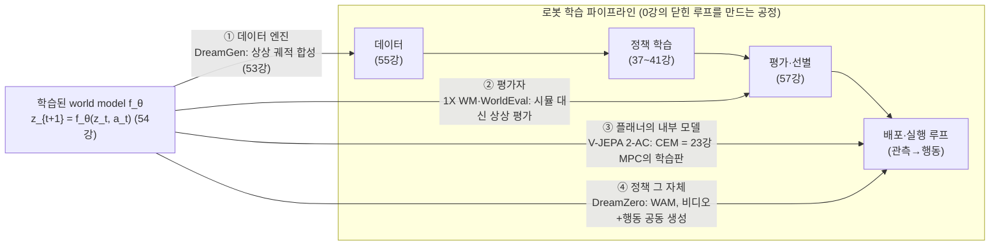
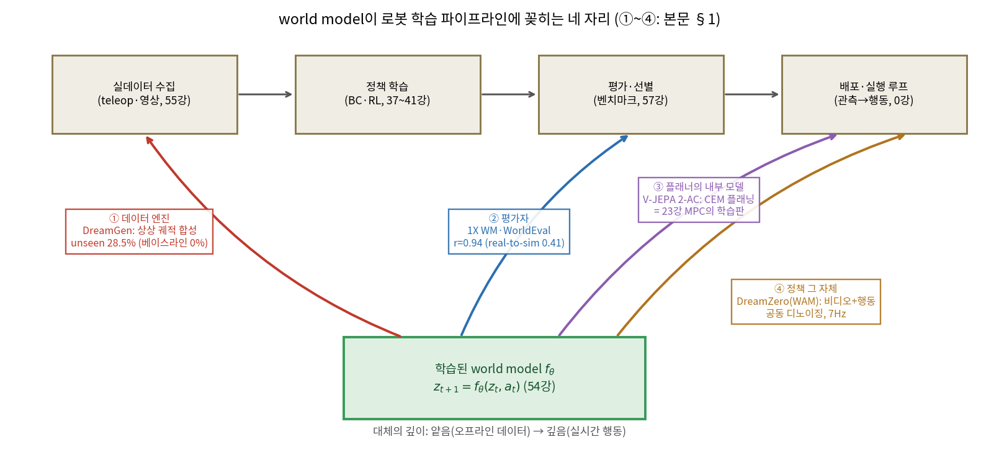
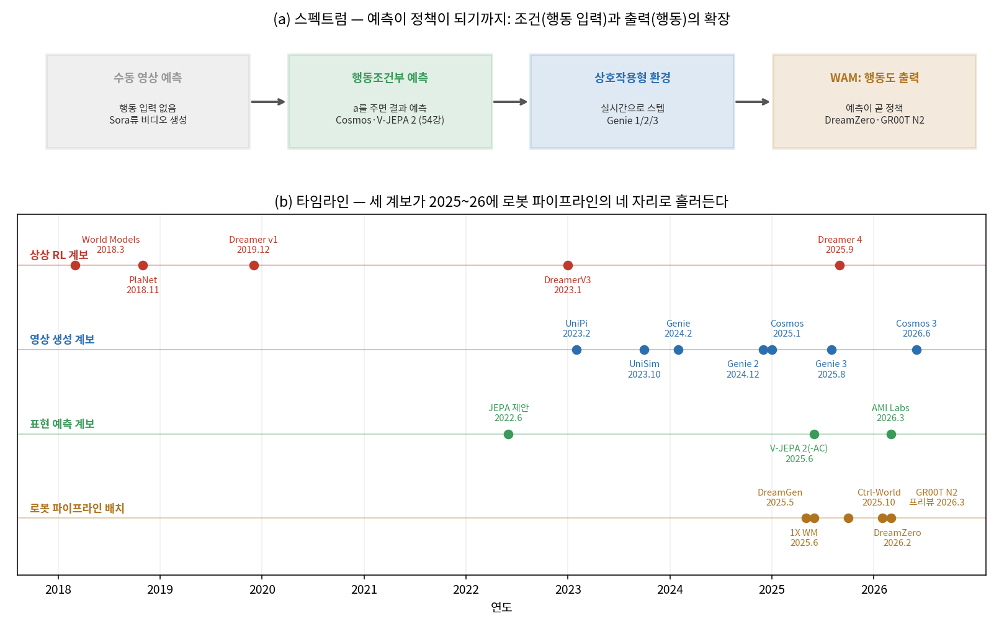
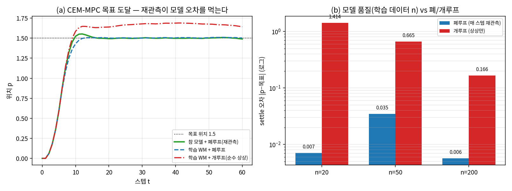
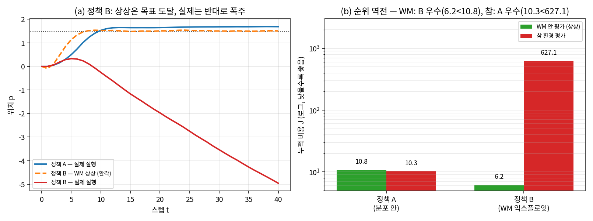

# Lec 66. World Model 기반 Physical AI — 예측이 정책이 되기까지

> Part 15 심화 특강. 선수 지식: 54강(학습된 world model — E1 잠재 전이·E2 롤아웃 오차 누적·E3 세 쓰임), 63강(프론티어 지도 — 물결 ③ world model 수렴). 회수: 23강(MPC·receding horizon), 37강(compounding error), 39·40강(디퓨전·flow), 53강(합성 데이터), 57강(평가), 60강(시스템 식별).
> 54강이 "학습된 $f_\theta$"라는 개념의 뼈대였고 63강이 물결의 위치였다면, 이 강의는 2025~26의 실물 시스템들을 **"world model이 로봇 파이프라인에 꽂히는 네 자리"**로 체계화한다. 백미는 §E2 — **WM 플래닝이 23강 MPC와 동형**임을 수식과 코드로 확인하는 것.
> 정보 기준일: 2026-07-13. 프론티어는 유통기한이 짧다 — 학습 시점에 Claude에게 최신 소식 확인을 요청할 것.

## 한 장 요약



54강 E3의 세 쓰임(데이터/플래닝/환경)을 실물 시스템 기준으로 재분류하면 **네 자리**가 된다: ① 상상 궤적을 데이터로 굳히고(DreamGen), ② 물리 시뮬 대신 상상 안에서 정책을 평가·선별하고(1X WM·WorldEval), ③ 실행 시 행동열을 상상 롤아웃으로 최적화하고(V-JEPA 2-AC — 23강 receding horizon과 동형!), ④ 마침내 world model 자체가 행동을 출력하는 정책이 된다(DreamZero의 WAM). 오른쪽 자리로 갈수록 실제 환경 대체가 깊어지고, 54강에서 배운 오차 누적·환각·평가 편향에 그만큼 취약해진다 — WE-2가 그 함정을 순위 역전으로 보여준다.

## 학습 목표

1. world model의 **네 사용처**(데이터 엔진 / 평가자 / 플래너의 내부 모델 / 정책 그 자체)를 대표 시스템·정량 근거와 함께 설명하고, 새 논문을 이 지도 위에 위치시킬 수 있다.
2. WM 플래닝을 **학습된 모델 위의 MPC**로 정식화하고(E2), 23강과의 대응(모델·비용·솔버·재계획)을 항목별로 채우며, 솔버가 QP에서 CEM으로 바뀐 이유를 말할 수 있다.
3. WAM을 **"행동을 생성 모달리티로 넣은 공동 디노이징"**(E3)으로 쓰고, UniPi류 2단 방식(비디오 생성→IDM)과 구별하며, DreamZero의 주장(zero-shot policy·7Hz)과 검증 상태를 평가할 수 있다.
4. 2018→2026 계보(상상 RL / 영상 생성 / 표현 예측)를 연월과 함께 그리고, 각 갈래가 네 자리 중 어디로 흘러들었는지 연결할 수 있다.
5. WM의 세 실패 모드(물리 환각·롤아웃 드리프트·평가 편향)를 1차 근거(PhyWorld·V-JEPA 2·WorldEval)와 토이 수치(WE-1·WE-2)로 뒷받침하고, 물리 시뮬레이터(51·52강) 대비 득실 표를 재구성할 수 있다.

## 왜 이 강의가 필요한가

63강에서 "VLA 다음은 WAM인가"를 열린 질문으로 남겼다. 그 사이 이 질문은 벤더 마케팅의 언어가 됐다 — NVIDIA는 GR00T 라인을 WAM으로 전환한다고 발표했고(2026.3, 회사 발표 [9]), Cosmos 3는 "옴니모달"을 표방하고(2026.6 [7]), LeCun은 world model 전문 랩을 차렸다(2026.3, 2차 [14]). 매주 쏟아지는 "world model" 논문 앞에서 필요한 것은 열광이 아니라 **좌표계**다: 이 논문의 WM은 파이프라인의 **어느 자리**에 꽂히는가? 데이터를 만드는가, 평가하는가, 플래닝하는가, 정책 그 자체인가? 자리가 다르면 요구 정확도·실패 비용·검증 방법이 전부 다르다.

그리고 로봇공학자인 회원님에게 이 지도는 뜻밖에 익숙한 땅이다. ③번 자리 — WM 플래닝 — 는 회원님이 23강에서 배운 MPC에서 **모델 한 줄만 바꾼 것**이다(해석적 $A_d, B_d$ → 학습된 $f_\theta$). V-JEPA 2-AC가 CEM으로 행동열을 최적화하고 첫 행동만 실행 후 재계획하는 것은 receding horizon 그대로다. 이 동형성을 수식·코드로 손에 쥐면, WAM이라는 낯선 물건도 "모델과 제어기가 한 몸이 된 극한"으로 읽을 수 있고, 그 위험(모델 오차를 정책이 익스플로잇)도 52강에서 이미 본 병의 재발로 진단할 수 있다. 오늘의 토이가 정확히 그 진단 연습이다 — 학습된 모델 위에서 CEM 플래닝을 돌리고(WE-1), WM 안 평가가 순위를 뒤집는 조건을 만든다(WE-2).

## 본문

### 1. 네 자리 — world model이 로봇 파이프라인에 꽂히는 곳

54강 E3는 쓰임을 데이터/플래닝/환경으로 나눴다. 2025~26의 실물 시스템 기준으로 이를 정밀 재분류하면: 54강의 ①데이터는 그대로 **① 데이터 엔진**, ②플래닝은 **③ 플래너의 내부 모델**, ③환경(상상 속 학습·평가)은 **② 평가자**(평가 반쪽)와 ③의 각주(상상 학습 = Dreamer)로 갈라진다. 그리고 새 자리가 하나 늘었다 — **④ 정책 그 자체**(WAM). 대체의 깊이는 ①→④로 갈수록 깊어진다: ①은 오프라인 데이터로 굳혀 쓰는 가장 얕은 대체, ④는 실시간 폐루프에서 WM의 출력이 곧 모터 명령이 되는 가장 깊은 대체다.

| 자리 | 대체하는 것 | 대표 시스템 | 정량 근거 (출처 표기) |
|---|---|---|---|
| **① 데이터 엔진** | teleop 수집 (53·55강) | DreamGen [8], Ctrl-World [13] | 단일 pick-place 데이터로 22개 신규 행동: seen 43.2%/unseen 28.5% (베이스라인 11.2%/0%) [8] |
| **② 평가자** | 물리 시뮬·실기 평가 (57강) | 1X WM [10], WorldEval [11] | WM 평가↔실기 Pearson 평균 0.942 vs real-to-sim 0.411 [11]; 우수 정책 판별 70%@90% 신뢰(회사 발표) [10] |
| **③ 플래너의 내부 모델** | MPC의 해석적 모델 (23강) | V-JEPA 2-AC [6], Dreamer 계열 [2][3] | zero-shot Franka pick-place 65~80% (Octo 10~15%), 행동당 16초 [6] |
| **④ 정책 그 자체 (WAM)** | VLA 정책 (44~48강) | DreamZero [9], GR00T N2 프리뷰 [9] | 7Hz 폐루프(150ms/청크), unseen 일반화 VLA 대비 2배+ (회사 발표) [9] |

**①과 ②는 이미 제품이다.** DreamGen의 neural trajectory는 GR00T 사전학습 혼합에 들어갔고(성능이 상상 궤적 수에 log-linear [8]), Ctrl-World는 상상 안에서 성공 궤적을 합성해 π0.5-DROID의 신규 명령 성공률을 38.7%→83.4%로 끌어올렸다 — 평가자와 데이터 엔진의 양방향 사용 [13]. 1X는 NEO 휴머노이드 정책의 체크포인트 선별·롱테일 재검증을 물리 시뮬 없이 1X WM(14B, 역동역학은 약 400시간 로봇 데이터)으로 수행한다고 밝힌다(회사 발표) [10]. ②의 학술 검증이 WorldEval인데, 수치의 양면을 같이 봐야 한다: 상관 0.942는 real-to-sim(0.411)을 압도하지만, **저성능 정책일수록** — 즉 이상 행동이 학습 분포 밖일수록 — WM이 환각을 일으켜 평가가 무너진다고 저자들이 명시한다 [11]. 평가가 가장 필요한 곳에서 가장 약하다는 것, 이것이 WE-2의 주제다.

**③이 이 강의의 백미, ④가 프론티어다.** V-JEPA 2-AC는 인터넷 비디오로 사전학습한 표현 위에 62시간 미만의 무라벨 로봇 비디오로 행동조건부 예측기를 붙이고, 목표 이미지 임베딩까지의 거리를 CEM으로 최소화해 Franka 팔을 zero-shot으로 움직였다 [6] — 자세한 해부는 E2에서. Dreamer 계열은 같은 자리의 아모타이즈판이다: 매번 최적화하는 대신 상상 롤아웃 안에서 actor-critic을 미리 학습한다(DreamerV3는 이 방식으로 150+ 태스크를 단일 설정으로 풀어 Nature에 실렸고 [2], Dreamer 4는 무라벨 비디오 중심 학습과 shortcut forcing으로 단일 GPU 실시간 추론까지 왔다 [3]). ④ WAM은 E3에서 해부한다.



*그림 1: 로봇 학습 파이프라인(위)과 world model이 꽂히는 네 자리(아래·색 화살표). ① 데이터 엔진은 수집 단계를, ② 평가자는 평가 단계를, ③④는 배포·실행 루프를 대체한다. 왼쪽(①)이 가장 얕은 대체(오프라인 데이터 — 오차가 있어도 다양성으로 상쇄), 오른쪽(③④)이 가장 깊은 대체(실시간 행동 — 오차가 곧 사고)다. 수치는 표와 [6][8][10][11], 회사 발표는 그렇게 표기. `gen_figs.py` 재현.*

### 2. 스펙트럼과 타임라인 — 2018→2026, 예측이 정책이 되기까지

네 자리를 관통하는 기술 축은 하나다: **모델이 행동과 얼마나 깊이 얽히는가.** 행동 입력이 없는 수동 영상 예측(Sora류) → 행동을 주면 결과를 예측(행동조건부 — 54강에서 "world model"의 최소 정의) → 사용자가 실시간으로 스텝하는 상호작용형 환경(Genie 계열) → 행동을 **출력**까지 하는 WAM. 그림 2(a)가 이 스펙트럼이고, (b)의 타임라인은 세 계보가 이 축을 따라 이동해 온 역사다.

- **상상 RL 계보** — Ha & Schmidhuber "World Models"(2018.3)가 VAE+RNN 세계에서 정책을 "꿈속 학습"해 실환경으로 옮겼고 [1], PlaNet(2018.11)이 잠재 동역학 위 CEM 플래닝을 [1], Dreamer v1(2019.12)~v3(2023.1)가 상상 롤아웃 actor-critic을 확립했다(v3는 2025.4 Nature 게재 [2]). Dreamer 4(2025.9)는 이 계보를 대규모 비디오 world model로 스케일업해, 오프라인 데이터만으로 Minecraft 다이아몬드를 달성한 최초 에이전트가 됐다(VPT 대비 100배 적은 데이터) [3].
- **영상 생성 계보** — UniPi(2023.2)가 "의사결정 = 텍스트 조건 비디오 생성 + IDM으로 행동 추출"을 정식화했고 [4], UniSim(2023.10, ICLR 2024 최우수논문)이 이종 데이터로 "실세계 시뮬레이터"를 학습했다 [4]. Genie(2024.2, 11B)는 행동 라벨 없는 비디오에서 latent action을 배워 상호작용형 환경을 만들었고(63강 물결 ②와 여기서 합류), Genie 3(2025.8)는 720p·24fps 실시간, 수 분 일관성까지 왔다(회사 발표) [5]. NVIDIA Cosmos(2025.1)는 이 계보를 오픈 플랫폼화했다 [7].
- **표현 예측 계보** — LeCun의 JEPA 제안(2022.6)이 "픽셀을 그리지 말고 표현 공간에서 예측하라"는 사상을 [14], V-JEPA 2(2025.6)가 그 실증을 놓았다(54강 회수) [6]. LeCun은 2026.3 world model 전문 랩 AMI Labs를 세워 시드 $1.03B을 모았다(2차 보도) [14].

그리고 2025~26에 세 계보가 **로봇 파이프라인의 네 자리로 흘러든다**: DreamGen(2025.5, ①) → 1X WM(2025.6, ②) → Ctrl-World(2025.10, ①+②) → DreamZero(2026.2, ④) → GR00T N2 프리뷰(2026.3, ④의 제품화 선언). 진영도 갈린다. **수렴론**: NVIDIA는 "world model로 데이터를 꿈꾸기(DreamGen)"에서 "world model이 곧 정책(DreamZero)"으로 계보를 밀고 있고 [8][9], 자율주행에서는 Waymo가 Genie 3 기반 world model로 2D 비디오+3D 라이다를 동시 생성하는 시뮬레이터를 공개했다(2026.2, 회사 발표) [16]. Wayve GAIA-2(2025.3)도 같은 노선이다 [16]. **회의론**: PI의 Levine은 "실로봇 데이터를 우회하는 지름길은 포크도 숟가락도 아닌 스포크(spork)가 되기 쉽다"며 학습 데이터가 테스트 조건과 일치해야 한다는 원칙을 고수한다(개인 에세이) [15] — 실제로 PI 제품 라인은 VLA 계열을 유지한다. 어느 쪽이 옳은지는 미결이며, 판정 기준은 64강의 체크리스트다.



*그림 2: **(a)** 스펙트럼 — 행동이 조건으로 들어오고(2단계), 상호작용이 실시간이 되고(3단계), 행동이 출력이 된다(4단계 WAM). **(b)** 타임라인(2018~2026.6) — 상상 RL·영상 생성·표현 예측 세 계보가 2025~26에 로봇 파이프라인 배치(맨 아래 레인)로 합류한다. 날짜는 arXiv 제출·공식 발표 기준 [1]~[9][13][14]. `gen_figs.py` 재현.*

### 3. 한계 — 환각·드리프트·평가 신뢰성, 그리고 물리 시뮬과의 담판

비판 없이 이 지도를 외우면 안 된다. 세 실패 모드가 1차 문헌으로 확인되어 있다.

**물리 환각 — 스케일링이 물리 법칙을 만들어주지 않는다.** PhyWorld(ICML 2025)는 통제된 2D 역학 테스트베드에서, 비디오 생성 모델이 분포 안(in-distribution)은 거의 완벽하지만 분포 밖(OOD)에서 파국적으로 실패하고 **데이터·모델을 키워도 OOD 오차가 줄지 않음**을 보였다 — 모델은 물리 법칙을 추상화하는 대신 가장 가까운 학습 사례를 흉내 내는 "사례 기반(case-based)" 일반화를 하며, 참조 우선순위조차 color > size > velocity > shape로 물리와 무관하다 [12]. 템플릿 밖 시나리오의 67%에서 비정상 물리가 관찰됐고 커버리지를 넓히면 10%로 줄었다 — 즉 스케일링이 사는 것은 **법칙이 아니라 커버리지**다 [12]. Physics-IQ는 실촬영 영상 기준으로 **시각적 사실성과 물리 이해가 무상관**임을 보였다(Sora 포함 당시 모델 전부 "심각하게 제한적") [12]. "그럴듯한 영상"과 "맞는 물리"는 다른 축이다 — LeCun의 "생성은 인과 예측과 다르다"는 비판이 겨냥한 지점 [14].

**롤아웃 드리프트 — 54강의 회수.** 54강 WE-1에서 1스텝 오차 0.0045짜리 모델이 40스텝 free-run에서 27.5배(0.125)로 불어나는 것을 봤다. 실물에서도 같다: V-JEPA 2 저자들은 자기회귀 롤아웃의 오차 누적으로 장기 플래닝이 어렵고, 카메라 위치에 민감하며, 목표를 이미지로만 줄 수 있다는 한계를 명시한다 [6]. 처방도 23강에서 배운 그대로 — 지평선을 짧게, 매 스텝 재관측·재계획(WE-1이 정량화한다).

**평가 신뢰성 — 상관이 높다는 말의 조건.** WorldEval의 0.942는 "평가 대상 정책들이 WM 학습 분포 안에서 행동할 때"의 수치다. 같은 논문이 저성능 정책의 이상 행동에서 물체 소멸·변형 같은 환각이 심해진다고 보고한다 [11]. 게다가 WM 평가는 성공 판정 자체도 학습된 판정(VLM 채점 등)이라 **오차원이 이중**이다. 1X의 "정확도 70% WM이 90% 확률로 우수 정책을 판별"(두 정책의 실제 성공률 격차 15%p 조건, 회사 발표 [10])이라는 수치는 역으로 읽으면 — 격차가 작은 정책 쌍이나 분포 밖 정책에서는 판별력이 급락한다는 뜻이다. 상상 평가는 **선별의 보조**이지 실기 검증(57강)의 대체가 아니다.

**물리 시뮬 대비 담판(51·52강 대비).** 어느 쪽이 낫냐가 아니라 축이 다르다:

| 축 | 물리 시뮬 (51·52강) | 학습된 world model |
|---|---|---|
| 구축 비용 | 자산·URDF·시스템 식별(60강) 수작업 | 비디오 데이터만 있으면 학습 |
| 다루는 물리 | 방정식으로 적을 수 있는 것(강체·접촉 중심) | 옷·유체·조명 등 데이터에 담긴 것 전부 |
| 물리 보장 | 방정식 수준 보장(수치 오차 내) | **없음** — OOD에서 환각 [12] |
| 시각 | 렌더링 갭 (sim2real, 53강) | 실사 픽셀 그대로 |
| 재현성·병렬 | 결정적, 수천 환경 병렬 저비용 | 확률적, 픽셀 생성은 비쌈 |
| 평가 상관(실기 대비) | real-to-sim 평균 0.411 [11] | 평균 0.942 [11] — 단 분포 안에서 |

두 축은 결합할 수도 있다 — Cosmos-Transfer는 시뮬 렌더를 포토리얼 영상으로 바꿔(세그·깊이 조건) 시뮬의 물리 보장과 WM의 시각을 잇고, Cosmos Predict/Transfer 2.5는 "시뮬레이션 내 정책 평가" 용도를 제품으로 명시했다 [7]. 54강 토론 질문 5("둘을 결합한다면?")의 업계 답이 이것이다.

### 핵심 수식

세 수식이 이 강의의 뼈대다: **E1** 무엇을 예측하도록 학습하는가(54강 E1의 심화 — 두 손실, 세 진영), **E2** 학습된 모델 위의 플래닝(= 23강 MPC), **E3** 행동을 생성 모달리티로(WAM).

#### E1. 잠재 동역학과 두 학습 손실 — 픽셀 재구성 vs 표현 예측 (54강 E1 심화)

**① 직관**: world model의 몸통은 54강 그대로 $z_{t+1} = f_\theta(z_t, a_t)$ — 학습된 전이함수다. 심화 질문은 "**무엇을 맞추도록** 학습하는가"이고, 답이 진영을 가른다: 다음 프레임의 **픽셀**을 그리는가(생성 진영 — Cosmos·Genie·DreamZero), 다음 프레임의 **표현**만 맞추는가(JEPA 진영 — V-JEPA).

**② 물리·기하적 의미**: 이것은 60강 시스템 식별 스펙트럼의 연장이다 — 회색상자(구조를 알고 질량·마찰만 추정) → 검은상자 잠재(구조까지 학습, 저차원 $z$) → 픽셀 생성(관측 공간 전체를 학습). 오른쪽으로 갈수록 추정 부담이 커지고 롤아웃이 불안정해진다는 것을 54강 WE-2a가 정량화했다(자유도 6 vs 4160 = 693배, H=40 오차 3.8배). JEPA의 사상은 "**예측 불가능한 세부는 표현에서 버려라**"다 [14] — 조명·질감 같은 제어 무관 고주파를 안 맞추니 부담이 준다. 그런데도 픽셀 진영이 사는 이유가 있다: 사람이 눈으로 검수할 수 있고, IDM으로 행동 라벨을 복원할 수 있고(E3의 UniPi 경로), 무엇보다 **사전학습된 비디오 생성 백본을 통째로 재활용**할 수 있다 — DreamZero가 오픈소스 image-to-video 모델(Wan 2.1-I2V-14B) 위에 지어진 것이 그 증거다(회사 발표) [9].

**③ 형식(유도 요점)**: 인코더 $e_\psi$, 전이 $f_\theta$, (선택) 디코더 $g_\phi$로 $z_t = e_\psi(x_t)$, $\hat z_{t+1} = f_\theta(z_t, a_t)$. 54강 E1의 두 손실을 회수하면

$$
\mathcal{L}_{\text{pixel}} = \mathbb{E}\big[\lVert g_\phi(\hat z_{t+1}) - x_{t+1} \rVert^2\big], \qquad
\mathcal{L}_{\text{JEPA}} = \mathbb{E}\big[\lVert \hat z_{t+1} - \operatorname{sg}[e_{\bar\psi}(x_{t+1})] \rVert_1\big]
$$

여기에 2025~26의 주류인 세 번째 형식 — **조건부 생성**(디퓨전/flow, 39·40강)이 있다: 결정론적 $g_\phi$ 대신 분포 $p_\theta(x_{t+1:t+H} \mid x_{\le t}, a_{t:t+H})$를 디노이징으로 학습한다. 다음 관측이 하나가 아니라 **분포**임(가림·접촉의 불확실성)을 표현할 수 있어 대규모 비디오 백본과 궁합이 맞고, E3의 WAM이 이 형식 위에 선다. 우리 토이는 최소판을 유지한다: $z$ = 참 상태 2차원, $f_\theta$ = 최소제곱 선형 — 54강 WE-1과 같은 시스템 식별이다.

#### E2. WM 안에서의 플래닝 = 학습된 모델 위의 MPC (23강 회수 — 이 강의의 백미)

**① 직관**: 목표 이미지가 주어지면, 행동열 후보를 여럿 상상 롤아웃해 보고 **목표에 가장 가까워지는 행동열**을 고른 뒤, 첫 행동만 실행하고 다시 관측해 재계획한다. 23강에서 배운 "N수 앞을 읽고 한 수만 두기"에서 바뀐 것은 단 하나 — 미래를 읽는 모델이 손으로 적은 $A_d, B_d$가 아니라 학습된 $f_\theta$라는 것.

**② 물리·기하적 의미**: 대응을 항목별로 채우면 동형성이 명백하다.

| 요소 | 23강 MPC | WM 플래닝 (V-JEPA 2-AC [6]) |
|---|---|---|
| 모델 | 해석적 $A_d, B_d$ (ZOH 이산화) | 학습된 $f_\theta$ (E1) |
| 비용 | $\sum x^\top Q x + u^\top R u$ + terminal $P$ | $\lVert \hat z_k - z_{\text{goal}} \rVert_1$ (목표 임베딩 거리) |
| 솔버 | QP — 볼록, 전역해·실시간 보장 | **CEM** — 샘플링, 보장 없음 |
| 실행 | 첫 입력만, 매 주기 재계획 | 동일 (receding horizon) |
| 주기 예산 | 솔버가 결정 (수 ms) | 행동당 16초 [6] — 여기가 병목 |

솔버가 QP에서 CEM으로 바뀐 이유: $f_\theta$가 신경망이라 비용이 $a$의 2차식이 아니고(볼록성 상실), 지형이 다봉이며, 미분을 뚫고 최적화하면 **모델의 취약 방향을 파고드는 적대적 행동**이 나오기 쉽다 — 샘플링은 행동을 그럴듯한 분포 안에 잡아두는 암묵적 정규화다(그래도 부족하다는 것이 WE-2). terminal cost가 없다는 점도 주목 — 23강 WE-2에서 배웠듯 잘린 지평선의 가치 평가가 없으면 지평선이 태스크 시간스케일을 덮어야 한다. Dreamer의 critic이 정확히 이 빈자리(가치 부트스트랩)를 학습으로 채운 것이다 [2].

**③ 형식(유도 요점)**: 현재 관측의 임베딩 $\hat z_0 = e_\psi(x_t)$에서

$$
a^\star_{0:H-1} = \arg\min_{a \in \mathcal{A}^H} \sum_{k=1}^{H} \big\lVert \hat z_k - z_{\text{goal}} \big\rVert_1, \qquad \hat z_k = f_\theta(\hat z_{k-1}, a_{k-1})
$$

CEM은 이것을 반복 샘플링으로 푼다: $a^{(i)} \sim \mathcal{N}(\mu_j, \operatorname{diag}\sigma_j^2)$에서 후보를 뽑아 에너지 하위 $K$개(엘리트)로 $\mu_{j+1}, \sigma_{j+1}$를 재적합하고, 수렴한 $\mu$의 **첫 행동만 실행** 후 재관측·재계획한다. V-JEPA 2-AC가 정확히 이 절차(샘플 800·10회 반복)로 Franka 팔 zero-shot pick-and-place 65~80%를 얻었고, 픽셀 생성 기반 베이스라인(Cosmos류, 행동당 약 4분)보다 15배 빠른 행동당 16초를 기록했다 [6] — 표현 공간 예측(E1)이 플래닝 속도로 직결되는 실증이다. WE-1이 이 전체 루프를 numpy로 재현한다.

#### E3. WAM — 행동을 생성 모달리티로 (39·40강 회수, 63강 E2 정합)

**① 직관**: UniPi류는 2단이다 — 비디오를 생성하고, 그 비디오에서 역동역학(IDM)으로 행동을 추출한다. WAM은 이를 한 단으로 접는다: **비디오 토큰과 행동 토큰을 같은 디노이징 과정에서 함께** 생성한다. 행동이 비디오 생성의 부산물이 아니라 생성 모달리티의 하나가 되는 것 — "상상하도록 사전학습, 행동하도록 파인튜닝" [9].

**② 물리·기하적 의미**: 왜 접는가? 2단 방식은 생성된 비디오의 환각이 IDM을 거치며 행동 오차로 증폭되고, 두 모듈의 오차가 직렬로 쌓인다. 공동 디노이징은 행동과 미래 영상이 **서로를 조건화하며 같이 정련**되게 한다 — 행동 청크(43·44강)가 붙는 자리도 자연스럽다. 더 중요한 구조적 이점은 데이터다: 행동 라벨 없는 비디오(인간 영상 포함)로는 비디오 쪽만 학습하고, 로봇 데이터로는 둘 다 학습할 수 있어 **cross-embodiment 사전학습**이 된다 — DreamZero는 타 로봇·인간 영상 10~20분(인간 1인칭은 12분)만으로 unseen 태스크를 상대 42% 이상 개선했다고 보고한다 [9]. VLA(언어에서 출발)와 뿌리가 다른 "비디오에서 출발"이라는 63강 E2의 서술이 이 구조에서 나온다.

**③ 형식(유도 요점)**: UniPi류 2단 [4] 대 WAM 공동 생성 [9]:

$$
\underbrace{\hat x_{t+1:t+H} \sim p_\theta(\cdot \mid x_{\le t}, \ell), \quad \hat a_k = \mathrm{IDM}_\phi(\hat x_k, \hat x_{k+1})}_{\text{UniPi류: 비디오 생성 후 행동 추출 (2단)}}
\qquad\text{vs}\qquad
\underbrace{(\hat x_{t+1:t+H},\, \hat a_{t:t+H}) \sim p_\theta(x, a \mid x_{\le t}, \ell)}_{\text{WAM: 공동 디노이징 (1단)}}
$$

공동 생성은 40강 flow 표기로 한 줄이다 — 노이즈 $(x^{(1)}, a^{(1)})$에서 출발해 두 모달리티를 함께 실어 나르는 속도장을 적분한다: $\tfrac{d}{d\tau}(x^{(\tau)}, a^{(\tau)}) = v_\theta(x^{(\tau)}, a^{(\tau)}, \tau \mid x_{\le t}, \ell)$. DreamZero는 이 구조를 14B 비디오 디퓨전 백본(Wan 2.1-I2V-14B) 위에 구현해, 약 500시간 teleop(22개 실환경) 사전학습만으로 별도 태스크 파인튜닝 없이 zero-shot policy로 동작한다고 주장한다 — 시스템 최적화 후 7Hz(행동 청크당 150ms; 미최적화 구현 5.7초에서 38배 가속), RoboArena Elo 1750 vs π0.5 1622(2026.4 스냅샷) [9]. 단, 성능 수치는 전부 회사 발표이며 63강의 단서("GPT-2 순간이지 GPT-3 신뢰성이 아니다")가 그대로 유효하다. GR00T N2(2026.3 프리뷰, 2026년 말 출시 예정)가 이 아키텍처의 제품화 선언이다(회사 발표) [9].

### Worked Example

두 예제 모두 순수 numpy·시드 고정(재현성). 관절 1축 토이(이중적분기 + 감쇠 1% + **토크 포화** $|a| \le 6$)에서 world model을 학습하고, 그 위에서 E2의 플래닝과 ②번 자리(평가자)의 함정을 재현한다. **개념 재현용 CPU 시뮬레이션이며 실제 V-JEPA 2·DreamZero가 아니다.**

#### WE-1 (numpy): 학습된 $f_\theta$ 위의 CEM 플래닝 — 재관측이 모델 오차를 먹는다

참 플랜트를 "모른다"고 가정하고 54강 WE-1과 같은 방법(관측 200개, 노이즈 0.02, 최소제곱)으로 $\hat A, \hat B$를 학습한 뒤, 그 **학습된 모델로** CEM 플래닝(E2)을 돌려 목표 위치 1.5에 도달시킨다. 비교 축은 둘: 모델(참 vs 학습)과 루프(폐루프 = 매 스텝 참 상태 재관측 vs 개루프 = 재관측 없이 모델의 상상만 믿고 실행).

```python
import numpy as np
dt = 0.1
A = np.array([[1.0, dt], [0.0, 0.99]]); B = np.array([[0.0], [dt]])    # 참 f: 관절 1축(이중적분기+감쇠 1%)
a_max = 6.0                                                             # 참 플랜트의 토크 한계 (WE-2 복선)
def f_true(s, a): return A @ s + B @ np.clip(np.atleast_1d(a), -a_max, a_max)

def learn(n, seed=1, noise=0.02):                                       # 54강 WE-1과 같은 시스템 식별
    r = np.random.default_rng(seed)
    S = r.standard_normal((n, 2)); Ac = r.standard_normal((n, 1))       # 행동 |a|~1 « 6: 포화를 못 본다
    Snx = np.stack([f_true(S[i], Ac[i]) for i in range(n)]) + noise*r.standard_normal((n, 2))
    th = np.linalg.lstsq(np.hstack([S, Ac]), Snx, rcond=None)[0].T; return th[:, :2], th[:, 2:]
Ah, Bh = learn(200)
print("param err", round(float(np.linalg.norm(np.hstack([Ah, Bh]) - np.hstack([A, B]))), 5))  # 0.00657

p_goal = 1.5                                          # 목표 (E2의 z_goal 역할)
def energy(Am, Bm, s, acts):                          # E2의 에너지: 상상 롤아웃의 목표 거리²
    Ss = np.repeat(s[None, :], acts.shape[0], 0); J = np.zeros(acts.shape[0])
    for k in range(acts.shape[1]):
        Ss = Ss @ Am.T + acts[:, k:k+1] @ Bm.T; J += (Ss[:, 0] - p_goal)**2
    return J + 0.001*(acts**2).sum(1)

def cem(Am, Bm, s, Hp, seed, mu0=None, bound=6.0):    # E2의 CEM: 샘플 → 엘리트 재적합
    rng = np.random.default_rng(seed)
    mu = np.zeros(Hp) if mu0 is None else mu0.copy(); sd = (bound/3)*np.ones(Hp)
    for it in range(16):
        cand = np.clip(mu + sd*rng.standard_normal((256, Hp)), -bound, bound)
        cand[0] = np.clip(mu, -bound, bound)          # 이전 평균도 후보에 (elitism)
        el = cand[np.argsort(energy(Am, Bm, s, cand))[:25]]
        mu, sd = el.mean(0), el.std(0) + (0.05*bound if it < 12 else 0.01)
    return mu

def mpc(Am, Bm, Hp=12, T=60, k_obs=1, seed0=100, bound=6.0):   # 23강 receding horizon의 학습판
    s_tr = np.array([0.0, 0.0]); s_bel = s_tr.copy(); plan = None; tr = [s_tr.copy()]; acts = []
    for t in range(T):
        if t % k_obs == 0: s_bel = s_tr.copy()                 # 재관측(폐루프). k_obs=∞면 순수 상상
        mu0 = None if plan is None else np.r_[plan[1:], 0.0][:Hp]
        plan = cem(Am, Bm, s_bel, Hp, seed0 + t, mu0, bound)
        s_bel = Am @ s_bel + Bm @ np.atleast_1d(plan[0])       # 믿음은 모델 f_θ로 전파
        s_tr = f_true(s_tr, plan[0]); tr.append(s_tr.copy()); acts.append(plan[0])   # 실행은 참 플랜트
    tr = np.array(tr); return float(np.mean(np.abs(tr[-15:, 0] - p_goal))), tr, np.array(acts)  # settle 오차

INF = 10**9
print("참모델+폐루프 settle", round(mpc(A, B)[0], 4))                     # 0.0039
print("학습WM+폐루프 settle", round(mpc(Ah, Bh)[0], 4))                   # 0.0057
print("학습WM+개루프 settle", round(mpc(Ah, Bh, k_obs=INF)[0], 4))        # 0.1665 — 29배
for n in (20, 50, 200):                                                   # 모델 품질 vs 폐/개루프
    An, Bn = learn(n)
    print(f"n={n}: closed {mpc(An, Bn)[0]:.4f} | open {mpc(An, Bn, k_obs=INF)[0]:.4f}")
```

출력: `param err 0.00657`(54강과 같은 데이터·노이즈 시드라 같은 값), settle 오차 `참모델+폐루프 0.0039 | 학습WM+폐루프 0.0057 | 학습WM+개루프 0.1665`, 스윕 `n=20: 0.0071|1.4145, n=50: 0.0348|0.6655, n=200: 0.0057|0.1665`. 읽는 법 세 가지. ① **학습된 모델의 폐루프 MPC(0.0057)는 참 모델(0.0039)과 거의 대등**하다 — 파라미터 오차 0.00657짜리 모델이면 매 스텝 재관측하는 한 플래닝은 충분히 좋다. ② 같은 모델이 **재관측 없이 상상만 믿으면 오차가 29배**(0.1665)로 뛴다 — 54강 E2의 롤아웃 드리프트가 플래닝 성능으로 번역된 것. ③ 스윕이 결정타다: 데이터 20개짜리 엉터리 모델도 폐루프에서는 0.0071로 살아남지만 개루프에서는 1.41 — 목표를 통째로 놓친다. **재관측(피드백)이 모델 오차를 먹는다** — V-JEPA 2-AC가 16초짜리 비싼 플래닝을 하면서도 첫 행동만 실행하고 재계획하는 이유 [6], 그리고 23강 E3("재계획이 곧 피드백")의 재확인이다.



*그림 3: **(a)** CEM-MPC의 목표 도달(n=200 모델). 참 모델+폐루프(초록)와 학습 WM+폐루프(파랑 파선)는 목표 1.5에 정착하지만, 같은 학습 모델의 개루프(빨강 일점쇄선 — 재관측 없이 상상만 믿고 실행)는 1.65 부근으로 드리프트한다. **(b)** 모델 품질(학습 데이터 n) 스윕: 폐루프(파랑)는 n=20에서도 오차 0.007로 버티지만 개루프(빨강)는 1.41까지 커진다(로그 축, 약 200배 차). 수치는 본문 코드 출력. `gen_figs.py` 재현.*

#### WE-2 (numpy): WM 안 평가의 함정 — 순위가 뒤집히는 조건

54강 WE-2b에서 상상 평가는 값을 11% 편향시키되 **순위는 유지**했다 — 두 정책 모두 학습 분포 안에 머물렀기 때문이다. 이번엔 한 정책이 분포 밖으로 나간다. 참 플랜트에는 토크 포화 $|a| \le 6$이 있지만, WM 학습 데이터의 행동은 $|a| \sim 1$이라 **모델은 포화를 한 번도 본 적이 없다**(선형이라 "얼마든지 세게 밀 수 있다"고 외삽한다). 두 정책을 WM 상상 안에서 최적화해 만든다: A는 행동을 데이터 분포 근처($|a| \le 5$)로 제한, B는 제한을 풀어($|a| \le 25$) WM의 허구를 마음껏 쓰게 한다.

```python
# (WE-1의 f_true, Ah, Bh, cem, mpc, p_goal 재사용)
_, _, planA = mpc(Ah, Bh, T=40, k_obs=INF, seed0=200, bound=5.0)    # 정책 A: 분포 안(|a|≤5) 행동
_, _, planB = mpc(Ah, Bh, T=40, k_obs=INF, seed0=200, bound=25.0)   # 정책 B: WM의 허구를 익스플로잇

def J_env(step, acts):                                # 한 환경에서 정책(행동열)의 누적 비용
    s = np.array([0.0, 0.0]); J = 0.0
    for a in acts: s = step(s, a); J += float((s[0] - p_goal)**2)
    return round(J, 2), round(float(s[0]), 2)

wm = lambda s, a: Ah @ s + Bh @ np.atleast_1d(a)      # WM 안 평가 (포화를 모른다)
print("WM  평가  J(A), J(B):", J_env(wm, planA)[0], J_env(wm, planB)[0])          # 10.82  6.2 → B 우수
print("참  평가  J(A), J(B):", J_env(f_true, planA)[0], J_env(f_true, planB)[0])  # 10.35  627.06 → A 우수
print("B의 최종 위치: WM 상상", J_env(wm, planB)[1], "| 실제", J_env(f_true, planB)[1])
print("max|a|: A", round(float(np.abs(planA).max()), 1), "| B", round(float(np.abs(planB).max()), 1))
```

출력: WM 평가 `J(A)=10.82, J(B)=6.2` — **B가 1.7배 우수**. 참 평가 `J(A)=10.35, J(B)=627.06` — **A가 60배 우수. 순위 역전.** B의 최종 위치는 상상 속 `1.5`(완벽 도달) vs 실제 `-4.96`(목표 반대편으로 폭주). 메커니즘: B는 최대 24.5의 토크를 계획했지만(포화 6의 4배) WM은 포화를 몰라 "빠르게 도달해 정확히 제동"하는 환각을 상상했다. 실제 플랜트에서는 가속이 6에서 잘려 계획된 제동 타이밍이 전부 어긋나고, 역방향 제동만 먹혀 로봇이 반대로 달아난다. 주목: A의 평가는 정확하다(10.82 vs 10.35 — 54강 수준의 작은 편향). **WM 평가는 분포 안 정책에는 잘 맞고(WorldEval의 0.942 [11]), 분포 밖을 파고드는 정책 — 평가가 가장 필요한 바로 그 정책 — 에서 무너진다** [11]. 52강에서 RL이 시뮬 접촉 허구를 익스플로잇하던 병의 world model판이며, 대책(행동 분포 제약·모델 앙상블 불일치 페널티·실기 최종 검증)은 실습 2에서 만든다.



*그림 4: **(a)** 정책 B의 상상(주황 파선)은 목표 1.5에 완벽 도달하지만, 같은 행동열의 실제 실행(빨강)은 포화에 잘려 반대편 -5.0으로 폭주한다. 분포 안의 정책 A(파랑)는 상상과 실제가 거의 같다. **(b)** 누적 비용(로그): WM 평가는 B를 우수(6.2 < 10.8)로, 참 환경은 A를 우수(10.3 « 627)로 판정 — 순위 역전. 54강 WE-2b(순위 유지·11% 편향)의 심화: 정책이 WM의 데이터 밖 허구를 익스플로잇하는 순간 상상 평가는 무너진다. `gen_figs.py` 재현.*

### 로봇공학자를 위한 번역

- **WM 플래닝 = 회원님이 아는 MPC, 모델만 학습된 것.** E2의 표가 전부다 — 문제 구조(유한 지평선 비용 최소화)·receding horizon·재계획은 23강 그대로이고, 모델의 출처(방정식→데이터)와 솔버(QP→CEM)만 바뀌었다. "WM 플래닝"이라는 말에 주눅들 필요가 없다: 회원님의 MPC 직관(지평선 예산, 재계획 주기, terminal cost의 역할)이 그대로 통한다.
- **상상 개루프 = 관성항법 드리프트, 재관측 = 필터 보정.** WE-1의 개루프 상상은 IMU만 믿고 적분하는 데드레커닝이고(37강·54강), 매 스텝 재관측은 GPS/비전 보정이 들어오는 것이다. "학습된 모델을 얼마나 오래 믿어도 되는가"는 회원님이 아는 센서 융합의 예산 문제와 같은 산수다.
- **WM 평가자 = 학습된 HIL 테스트벤치.** 실기 대신 테스트벤치에서 제어기를 선별하는 관행 그대로인데, 벤치 자체가 데이터로 만든 근사라는 점이 다르다. WE-2의 교훈을 벤치 언어로: 벤치가 검증된 동작 영역(분포) 밖으로 나가는 제어기는 벤치 점수를 믿으면 안 된다 — 정격 밖 시험은 실물에서.
- **WAM = 플랜트 모델과 제어기가 한 몸이 된 극한.** 회원님의 세계에서 모델(시스템 식별)과 제어기(설계)는 분리된 공정이다. WAM은 그 둘을 한 신경망의 한 생성 과정에 접었다 — 득은 비디오 사전학습의 물리 사전지식이 행동에 직결되는 것, 실은 모델 오차와 정책 오차를 더 이상 분리 진단할 수 없다는 것.

## 흔한 오해

1. **"네 자리는 경쟁 관계라 WAM이 이기면 나머지는 사라진다"** — 아니다. 네 자리는 대체 깊이가 다른 **병렬 용도**이고, 한 모델이 여러 자리를 겸한다(Cosmos는 데이터 생성+평가 [7], Ctrl-World는 평가+데이터 [13]). 요구 정확도도 다르다 — ①은 오차를 다양성으로 상쇄하지만 ④는 오차가 곧 사고다. WAM이 성숙해도 값싼 데이터 엔진·평가자의 수요는 남는다.
2. **"WM 평가 상관이 0.94니 실기 평가를 대체한다"** — WE-2가 반증. 그 상관은 분포 안 정책의 수치이고, 정책이 WM의 허구를 익스플로잇하면 순위째 뒤집힌다(WM: B 우수 → 실기: A 60배 우수). WorldEval 스스로 저성능 정책에서 환각 악화를 보고하고 [11], 성공 판정도 학습된 판정이라 오차원이 이중이다. 상상 평가는 후보 선별용, 최종 검증은 실기·시뮬(57강)이다.
3. **"비디오가 그럴듯하면 물리를 이해한 것"** — Physics-IQ가 정면 반증: 시각적 사실성과 물리 이해는 무상관이다 [12]. PhyWorld는 스케일링해도 OOD 물리는 실패하며 모델이 법칙이 아니라 사례를 흉내 냄을 보였다 [12]. "잘 그린 상상"을 "맞는 예측"으로 읽는 순간 ②③④ 자리 전부에서 사고가 난다.
4. **"WM 플래닝은 MPC를 대체하는 새 이론이다"** — E2의 표를 보라: 동형이다. 새것은 이론이 아니라 **모델의 출처**(적기 어려운 물리를 데이터로)와 그에 따른 솔버 교체(QP→CEM)·예산 악화(ms→16초)다. 23강의 "무제약 MPC = LQR"처럼, 껍질이 바뀌어도 뼈대가 같음을 보는 것이 논문을 빨리 읽는 기술이다(64강).
5. **"DreamZero가 zero-shot이니 로봇 데이터는 이제 불필요하다"** — "zero-shot"은 **태스크·환경** 일반화 주장이지 데이터 제로가 아니다. DreamZero도 약 500시간 teleop으로 사전학습했고, 신규 로봇 적응에 30분 play 데이터를 쓴다 [9]. 성능 수치는 회사 발표이며(RoboArena Elo 포함), Levine의 spork 비판 [15]이 겨냥하는 것이 정확히 이 지점이다 — 실데이터 병목은 줄었을 뿐 사라지지 않았다.

## 실습 (1.5~2h)

**목표: E2의 플래닝 루프와 WE-2의 평가 함정을 손으로 흔들어 보고, 실물 시스템 하나를 네 자리 지도에 앉힌다.** 준비: `pip install numpy matplotlib` (CPU면 충분).

1. **(30분, CPU) 재관측 예산.** WE-1의 `k_obs`(재관측 주기)를 1/5/15/30/∞로 스윕해 settle 오차 곡선을 그린다 — "얼마나 뜸하게 관측해도 되는가"가 모델 품질(n=20/50/200)에 따라 어떻게 변하는지 표로. 이어서 지평선 `Hp`를 4/8/12/24로 스윕해 23강 §2(호라이즌 예산)의 곡선을 학습 모델 위에서 재현한다.
2. **(35분, CPU) 익스플로잇 방어전.** WE-2에서 (a) `bound`를 6→10→15→25로 올리며 순위 역전이 시작되는 경계를 찾는다. (b) 방어 1 — 서로 다른 시드의 데이터로 모델 5개를 학습하고, `energy`에 앙상블 예측 분산 페널티($+\lambda \cdot \mathrm{Var}$)를 더해 B의 익스플로잇이 사라지는지 확인한다. (c) 방어 2 — 학습 데이터의 행동 스케일을 std 3으로 키워(포화가 데이터에 찍히게) 다시 학습하면 함정 자체가 사라짐을 확인한다: "분포 밖"은 모델의 죄가 아니라 데이터의 공백이다.
3. **(30분, 웹/GPU 선택) 네 자리 라벨링.** V-JEPA 2(HF `facebook/vjepa2`), Cosmos, DreamZero 프로젝트 페이지, 1X WM 블로그 중 둘을 골라 "무엇을 예측(픽셀/표현)하고, 무엇에 조건(행동/언어)하며, 네 자리 중 어디에 꽂히는가"를 §1의 표 형식으로 채운다. Claude와 함께 최근 2주 arXiv에서 world model 로봇 논문 1편을 골라 같은 라벨링을 하고, 저자가 주장하는 자리와 실험이 검증한 자리가 일치하는지 따진다(64강 예습).

## Claude와 토론할 질문

1. 네 자리 중 어디가 가장 먼저 산업 표준이 되겠는가? "요구 정확도가 낮고 실패 비용이 싼 자리부터"라는 가설(①→②→③→④)을 세우고, 1X가 ②를 이미 상용 워크플로에 쓴다는 사실 [10]로 검증·반박해 보라.
2. E2에서 $f_\theta$는 미분 가능한데 왜 CEM(샘플링)으로 푸는가? 그래디언트 기반 최적화가 모델의 취약 방향을 파고드는 문제를 WE-2의 익스플로잇과 연결하고, 23강 QP의 볼록성 보장이 여기서 무엇으로 대체됐는지(혹은 대체되지 못했는지) 논하라.
3. WE-2의 순위 역전을 막는 세 방어(행동 분포 제약, 앙상블 분산 페널티, 실기 최종 검증)를 각각 고전 제어의 관행(정격 범위, 모델 불확실성 마진, 실기 시운전)에 대응시켜 보라. 셋 중 무엇이 왜 가장 근본적인가?
4. Levine의 spork 논변 [15]과 NVIDIA의 WAM 베팅 [9]을 각각 가장 강한 형태로 재구성하라. 어떤 실험 결과가 나오면 어느 쪽이 무너지는가 — 64강의 언어로 "판정 실험"을 설계해 보라.
5. V-JEPA 2-AC(표현 예측 + CEM + 매 스텝 재계획, 16초/행동)와 DreamZero(픽셀 공동 생성 + 행동 청크, 7Hz)는 같은 "WM이 행동을 낸다"인데 설계가 정반대다. 각 설계가 무엇을 희생하고 무엇을 샀는지, E1의 두 손실과 E2·E3의 구조로 설명하라.
6. 1X의 "정확도 70% WM이 90% 확률로 우수 정책 판별"(격차 15%p 조건) [10]을 이항 검정의 언어로 재구성하라. 격차가 5%p로 줄면 판별 확률이 어떻게 되는가? 이 평가기가 유용한 개발 단계와 무용한 단계를 나눠 보라.
7. Genie 3 같은 범용 상호작용 세계(720p·24fps, 수 분 일관성 [5])가 로봇 학습장이 되려면 무엇이 더 필요한가 — 행동 공간의 물리적 접지, 접촉 일관성, 지연 예산의 셋을 54강 오차 누적과 이 강의의 네 자리로 평가하라.

## 읽을거리

1. **DreamZero 논문 [9]** (~40분): 공동 디노이징 아키텍처 절과 실험 표만 — E3의 원전. RoboArena Elo·"2배" 수치는 회사 발표임을 상기하며 64강의 눈으로(같은 데이터? 같은 embodiment? N과 CI는?) 걸러 읽을 것.
2. **V-JEPA 2 논문 [6] §3과 한계 절** (~30분): 54강에서 §3(AC 구조·CEM)을 읽었다면 이번에는 한계 절 중심으로 — 카메라 민감성·오차 누적·이미지 목표 제약이 E2 동형성의 어느 고리에서 오는 병인지 진단하며 읽는다.
3. (선택) **Levine, "Sporks of AGI" [15]** (~20분): world model 노선에 대한 가장 강한 반론. NVIDIA WAM 블로그 [9]와 나란히 놓고 어느 쪽 증거가 더 단단한지 스스로 판정해 보라 — 토론 질문 4의 재료.

## 자가 점검

1. 네 자리(데이터 엔진/평가자/플래너의 내부 모델/정책 그 자체)를 각각 대표 시스템·정량 근거 하나씩과 함께 말하고, 54강 E3의 세 쓰임과의 대응 관계를 설명할 수 있는가?
2. E2의 23강 대응표(모델·비용·솔버·실행·예산)를 안 보고 채우고, QP→CEM 교체의 세 이유(비볼록·다봉·익스플로잇 방지)를 말할 수 있는가?
3. WAM의 공동 디노이징(E3)을 UniPi류 2단과 수식으로 구별하고, 행동 라벨 없는 비디오를 섞어 쓸 수 있다는 구조적 이점이 어디서 오는지 설명할 수 있는가?
4. WE-1의 세 수치(폐루프 0.0057 vs 개루프 0.1665 vs 엉터리 모델 폐루프 0.0071)로 "재관측이 모델 오차를 먹는다"를 논증할 수 있는가?
5. WE-2에서 순위가 뒤집힌 메커니즘(포화를 못 본 모델 + 분포 밖 행동 최적화)을 재구성하고, 54강 WE-2b(순위 유지)와의 차이가 어디서 왔는지 말할 수 있는가?
6. 타임라인에서 다섯 사건 — World Models(2018.3), V-JEPA 2(2025.6), DreamGen(2025.5), DreamZero(2026.2), Cosmos 3(2026.6) — 을 세 계보와 네 자리에 각각 배치할 수 있는가?
7. 물리 시뮬 vs WM 표를 재구성하고, PhyWorld·Physics-IQ가 각각 무엇을 반증하는지(스케일링≠법칙, 사실성≠물리) 한 문장씩으로 말할 수 있는가?

## 참고문헌

> 본문 수치·주장의 출처. 웹 문서는 2026-07-13 접속 기준. 회사 발표 수치는 그렇게 표기. (2차) = 언론·2차 출처. 프론티어 특성상 회사 발표·초기 결과가 다수 — 유통기한이 짧으니 학습 시점 재확인 권장.

[1] D. Ha, J. Schmidhuber, "World Models," arXiv:1803.10122, 2018.3 · D. Hafner et al., "Learning Latent Dynamics for Planning from Pixels (PlaNet)," arXiv:1811.04551, 2018.11. https://arxiv.org/abs/1803.10122 · https://arxiv.org/abs/1811.04551
— **뒷받침**: 타임라인 시조 — world model 안("dream")에서 정책을 학습해 실환경 전이(Ha&Schmidhuber); 잠재 동역학(RSSM) 위 CEM 플래닝의 원조(PlaNet) — E2 구조의 계보적 출발점.

[2] D. Hafner, J. Pasukonis, J. Ba, T. Lillicrap, "Mastering Diverse Domains through World Models (DreamerV3)," arXiv:2301.04104, 2023.1 · Nature, 2025.4. https://www.nature.com/articles/s41586-025-08744-2
— **뒷받침**: 상상 롤아웃 actor-critic(③의 아모타이즈판), 단일 설정 150+ 태스크, Minecraft 다이아몬드, Nature 게재로 계보 완성. critic = terminal cost의 학습판이라는 E2 서술.

[3] D. Hafner, W. Yan, T. Lillicrap, "Training Agents Inside of Scalable World Models (Dreamer 4)," arXiv:2509.24527, 2025.9. https://arxiv.org/abs/2509.24527
— **뒷받침**: 대규모 비디오 WM + shortcut forcing으로 단일 GPU 실시간 추론, 오프라인 데이터만으로 Minecraft 다이아몬드 달성(VPT 대비 100배 적은 데이터).

[4] Y. Du, S. Yang et al., "Learning Universal Policies via Text-Guided Video Generation (UniPi)," arXiv:2302.00111, 2023.2 (NeurIPS 2023) · S. Yang et al., "Learning Interactive Real-World Simulators (UniSim)," arXiv:2310.06114, 2023.10 (ICLR 2024 Outstanding Paper). https://arxiv.org/abs/2302.00111 · https://arxiv.org/abs/2310.06114
— **뒷받침**: E3의 2단 방식 원조(비디오 생성 계획 + IDM 행동 추출, UniPi)와 이종 데이터 통합 행동조건부 "실세계 시뮬레이터"(UniSim) — 영상 생성 계보의 두 이정표.

[5] J. Bruce et al. (Google DeepMind), "Genie: Generative Interactive Environments," arXiv:2402.15391, 2024.2 · "Genie 3: A New Frontier for World Models," DeepMind 블로그, 2025.8 (회사 발표). https://arxiv.org/abs/2402.15391 · https://deepmind.google/blog/genie-3-a-new-frontier-for-world-models/
— **뒷받침**: 라벨 없는 비디오의 latent action(11B, 63강 물결 ②와의 합류점), Genie 3의 720p·24fps 실시간·수 분 일관성(회사 발표), 스펙트럼 3단계(상호작용형 환경).

[6] M. Assran et al. (Meta FAIR), "V-JEPA 2: Self-Supervised Video Models Enable Understanding, Prediction and Planning," arXiv:2506.09985, 2025.6. https://arxiv.org/abs/2506.09985
— **뒷받침**: E2·WE-1·③ — V-JEPA 2-AC: 무라벨 DROID 62시간 미만 후학습, CEM으로 표현 공간 $L_1$ 에너지 최소화·첫 행동만 실행(receding horizon), 행동당 16초(Cosmos류 약 4분 대비 15배), Franka 2개 랩 zero-shot grasp 65%·pick-place 65~80%(Octo 10~15%), 한계 절(오차 누적·카메라 민감·이미지 목표). 54·63강과 동일 출처.

[7] NVIDIA, "Cosmos World Foundation Model Platform for Physical AI," arXiv:2501.03575, 2025.1 · "Cosmos 3: Omnimodal World Models for Physical AI," arXiv:2606.02800, 2026.6. https://arxiv.org/abs/2501.03575 · https://arxiv.org/abs/2606.02800
— **뒷받침**: WFM 플랫폼(토크나이저+디퓨전/자기회귀, 오픈웨이트), Cosmos-Transfer의 시뮬 렌더→포토리얼 변환과 Predict/Transfer 2.5의 "정책 평가" 용도 제품화, Cosmos 3 = MoT 옴니모달(언어·이미지·비디오·오디오·행동, OpenMDW-1.1 오픈, 회사 발표).

[8] J. Jang et al. (NVIDIA), "DreamGen: Unlocking Generalization in Robot Learning through Video World Models," arXiv:2505.12705, 2025.5. https://arxiv.org/abs/2505.12705
— **뒷받침**: ① 데이터 엔진 — 4단계 neural trajectory 파이프라인, 단일 pick-place teleop로 22개 신규 행동(seen 43.2%/unseen 28.5%, GR00T N1 베이스라인 seen 11.2%/unseen 0.0%), 성능의 log-linear 스케일링. 53·54강과 동일 출처.

[9] NVIDIA (GEAR), "World Action Models are Zero-shot Policies (DreamZero)," arXiv:2602.15922, 2026.2 · "Pretrained to Imagine, Fine-Tuned to Act: The Rise of World-Action Models," 기술 블로그, 2026 · "NVIDIA and Global Robotics Leaders…" (GTC 2026, GR00T N2 프리뷰), 뉴스룸, 2026.3. https://arxiv.org/abs/2602.15922 · https://developer.nvidia.com/blog/pretrained-to-imagine-fine-tuned-to-act-the-rise-of-world-action-models/ · https://nvidianews.nvidia.com/news/nvidia-and-global-robotics-leaders-take-physical-ai-to-the-real-world
— **뒷받침**: E3·④ — 14B, Wan 2.1-I2V-14B-480P 백본, 비디오·행동 토큰의 단일 트랜스포머 공동 디노이징(별도 IDM 없음), 약 500시간 teleop/22개 실환경, zero-shot policy 주장, 7Hz·행동 청크당 150ms(미최적화 5.7초→150ms, 38배 가속), 타 로봇(YAM)·인간 영상 10~20분(인간 1인칭 12분)으로 unseen 태스크 상대 42%+ 향상, 신규 로봇 30분 play 적응, unseen 일반화 SOTA VLA 대비 2배+·RoboArena Elo 1750 vs π0.5 1622(2026.4 스냅샷) — 성능 비교 수치는 회사 발표. GR00T N2 = WAM 아키텍처 제품화 선언, 2026년 말 출시 예정(회사 발표). 63강 참고문헌과 동일 계보.

[10] 1X Technologies, "Redwood AI World Model," 공식 블로그, 2025.6 (회사 발표) · 1X World Model Challenge 기술보고서(참가팀), arXiv:2510.07092, 2025.10. https://www.1x.tech/discover/redwood-ai-world-model · https://arxiv.org/abs/2510.07092
— **뒷받침**: ② 평가자 — 14B video-pretrained WM, 역동역학 약 400시간 로봇 데이터, 체크포인트 선별·롱테일 재검증 용도, "정확도 70% WM이 90% 확률로 우수 정책 판별(실제 성공률 격차 15%p 조건)"(회사 발표). arXiv:2510.07092는 1X 공식 문서가 아니라 챌린지 참가팀(Aalto 등) 보고서임에 주의.

[11] "WorldEval: World Model as Real-World Robot Policies Evaluator," arXiv:2505.19017, 2025.5. https://arxiv.org/abs/2505.19017
— **뒷받침**: ② — WM 평가↔실기 Pearson 0.887~0.980(평균 0.942) vs real-to-sim 0.328~0.465(평균 0.411), 실기 검증 1,000회+(정책 4종·태스크 5종), 저성능 정책의 이상 행동(분포 밖)에서 환각 악화 명시 — WE-2·흔한 오해 2의 근거.

[12] B. Kang, Y. Yue et al., "How Far is Video Generation from World Model: A Physical Law Perspective (PhyWorld)," arXiv:2411.02385, 2024.11 (ICML 2025) · S. Motamed et al. (Google DeepMind), "Physics-IQ: Do generative video models understand physical principles?," arXiv:2501.09038, 2025.1. https://arxiv.org/abs/2411.02385 · https://arxiv.org/abs/2501.09038
— **뒷받침**: §3·흔한 오해 3 — PhyWorld: 통제 2D 역학에서 OOD 파국 실패·스케일링 무효, 사례 기반(case-based) 일반화(참조 우선순위 color>size>velocity>shape), 템플릿 밖 67%→커버리지 확대 시 10%. Physics-IQ: 실촬영 벤치마크에서 시각적 사실성과 물리 이해의 무상관, 당시 모델(Sora 등) 전반 "심각하게 제한적".

[13] "Ctrl-World: A Controllable Generative World Model for Robot Manipulation," arXiv:2510.10125, 2025.10 (ICLR 2026). https://arxiv.org/abs/2510.10125
— **뒷받침**: ①+② — 멀티뷰·프레임 단위 행동 조건·포즈 조건 메모리로 20초+ 일관 롤아웃, 상상 평가와 실세계 순위 정합, 상상 속 성공 궤적 SFT로 π0.5-DROID 신규 명령 38.7%→83.4%.

[14] Y. LeCun, "A Path Towards Autonomous Machine Intelligence," OpenReview 포지션 페이퍼, 2022.6 · (2차) TechCrunch/Bloomberg, "AMI Labs $1.03B 시드," 2026.3. https://openreview.net/forum?id=BZ5a1r-kVsf · https://techcrunch.com/2026/03/09/yann-lecuns-ami-labs-raises-1-03-billion-to-build-world-models/
— **뒷받침**: E1·§2 — JEPA 철학("픽셀이 아니라 표현 공간에서 예측, 예측 불가능한 세부는 버림"), "생성 ≠ 인과 예측" 비판. AMI Labs 설립·시드 규모는 복수 언론 교차 확인(2차).

[15] S. Levine, "Sporks of AGI," Substack 에세이(개인 블로그), 2025.7. https://sergeylevine.substack.com/p/sporks-of-agi
— **뒷받침**: §2 진영·흔한 오해 5 — "실로봇 데이터를 우회하는 지름길(시뮬·인간 비디오)은 spork가 되기 쉽다", 학습 데이터=테스트 조건 원칙. 회사 공식 성명이 아닌 개인 에세이임을 명시.

[16] Waymo, "The Waymo World Model: A New Frontier for Autonomous Driving Simulation," 공식 블로그, 2026.2 (회사 발표) · Wayve, "GAIA-2: A Controllable Multi-View Generative World Model for Autonomous Driving," arXiv:2503.20523, 2025.3. https://waymo.com/blog/2026/02/the-waymo-world-model-a-new-frontier-for-autonomous-driving-simulation/ · https://arxiv.org/abs/2503.20523
— **뒷받침**: §2 — Genie 3 기반 주행 시뮬레이터(2D 비디오+3D 라이다 동시 생성, 자연어 시나리오 편집 — 회사 발표), GAIA-2(제어 가능 latent diffusion, 다중 카메라 시공간 일관 — 희귀 시나리오 시뮬레이션 용도).

*수치 재현성: 본문·그림의 numpy 토이 수치는 `images/lec66/gen_figs.py`와 본문 코드 블록의 실행 출력이다 — WE-1의 파라미터 오차 0.00657(54강 WE-1과 동일 시드·방법), settle 오차 0.0039(참모델+폐루프)/0.0057(학습WM+폐루프)/0.1665(학습WM+개루프, 29배), 데이터 스윕 0.0071|1.4145(n=20)·0.0348|0.6655(n=50)·0.0057|0.1665(n=200); WE-2의 WM 평가 J(A)=10.82/J(B)=6.2(B 우수) vs 참 평가 J(A)=10.35/J(B)=627.06(A 우수, 순위 역전), B 최종 위치 상상 1.5 vs 실제 -4.96, max|a| A 5.0/B 24.5. numpy 1.26 / matplotlib 3.5, CPU만, 시드 고정(default_rng)이라 결정적. **이 토이는 개념 재현용 CPU 시뮬레이션이며 실제 V-JEPA 2·DreamZero·1X WM·Cosmos 모델·가중치가 아니다** — 실물의 스펙·성능(16초/행동, 7Hz, Elo, 상관 0.942 등)은 [6][9][10][11] 등 1차/회사 발표 출처이며 토이와 무관하다.*

<!-- lecture-nav -->

---

⬅ 이전: [Lec 65. 캡스톤 — 최근 논문 2편을 프레임워크로 완전 분석하고 "새로운 점"만 남기기](lec65-capstone.md)　｜　[📖 전체 목차](../README.md)
