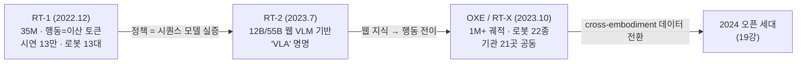

# Lec 18. VLA의 탄생 (2022-23) — RT-1, RT-2, 그리고 데이터 전환

> Part 5 첫 강의. 선수 지식: Part 2-3(Transformer·VLM), Part 4(모방학습). 두 갈래가 여기서 합류한다.
> 이 강의부터 23강까지는 "모델의 역사"가 아니라 **"각 모델이 어떤 실패를 고치려 했는가"의 역사**로 읽는다.

## 한 장 요약

## 학습 목표

1. RT-1이 실증한 명제("하나의 transformer 정책이 실로봇 멀티태스크를 감당한다")와 그 한계를 설명할 수 있다.
2. RT-2의 핵심 발상 — 행동을 텍스트 토큰처럼 취급해 웹 사전학습 VLM을 로봇 정책으로 전환 — 을 도식으로 그릴 수 있다.
3. "웹 지식 전이"가 구체적으로 어떤 능력으로 나타나는지 사례를 들 수 있다.
4. OXE/RT-X가 필드의 데이터 경제를 어떻게 바꿨는지 설명할 수 있다.

## 본문

### 0. 왜 여기가 출발점인가

2022년까지 로봇 학습의 상식은 "태스크 하나 = 정책 하나"였다. 13강에서 본 BC의 한계에다, 정책 아키텍처도 태스크별 맞춤이었다. 같은 시기 NLP에서는 GPT-3가 "하나의 큰 시퀀스 모델 + 대량 데이터"로 태스크 경계를 지워버렸다. Google 로봇팀의 질문은 단순했다: **로봇에서도 되는가?**

### 1. RT-1 — "정책은 시퀀스 모델이다"의 실증 (2022.12)

- **구조**: EfficientNet(이미지) + TokenLearner(토큰 압축) + decoder transformer. **35M 파라미터** — 오늘 기준으로 초소형이다.
- **행동 표현**: 각 차원을 256개 빈으로 이산화한 토큰 (26강에서 상세히 다룰 그 방식의 원조).
- **데이터**: 17개월 동안 로봇 13대로 **~13만 시연** 수집. 이 수집 비용 자체가 논문의 절반이다.
- **의미**: 700여 태스크를 하나의 정책으로, 실로봇에서, 새 태스크·배경에 일정한 일반화까지. "스케일된 모방학습"의 첫 실증.
- **한계**: 언어 이해가 얕고, 훈련 데이터에 없는 물체·개념 앞에서는 무너진다. 당연하다 — **웹을 모르는 모델**이니까.

### 2. RT-2 — VLA의 명명 (2023.7)

발상의 전환: 로봇 정책을 바닥부터 만들지 말고, **이미 웹을 아는 VLM에게 행동이라는 새 언어를 가르치자.**

- **방법**: PaLI-X(55B)/PaLM-E(12B)를 웹 VQA 데이터와 로봇 시연 데이터로 **co-fine-tuning**. 행동은 RT-1식 256빈 이산값을 텍스트 토큰 문자열로 출력 — 모델 입장에서 행동은 그저 또 하나의 "언어"다 (5강의 복선 회수).
- **결과**: 훈련 데이터에 없는 물체 조작, 아이콘·기호 이해, 초보적 추론("멸종한 동물을 집어" → 공룡 인형 선택) 같은 **창발적 일반화**. 이것이 로봇 데이터가 아니라 웹 사전학습에서 온 것임이 요점이다.
- **대가**: 55B는 로봇에 못 싣는다 — 클라우드 멀티 TPU 서빙으로 **1~3Hz** (26강에서 볼 주기 계층의 역사적 극단). 그리고 비공개.
- 이 논문이 **"Vision-Language-Action model"**이라는 용어를 만들었다.

### 3. "웹 지식 전이"의 실체

막연한 구호가 아니라 세 가지 측정 가능한 능력이다:
① 훈련에 없던 물체·카테고리의 zero-shot 인식 ("피카츄 집어" 류의 시연),
② 지시 패러프레이즈 강건성 (같은 뜻, 다른 문장),
③ 공간관계 언어 ("컵 왼쪽의", "가장 큰").
셋 다 이미지-텍스트 사전학습에서 상속된 것이고, 로봇 전용 데이터에는 없다. 이후 VLA 논문의 "일반화" 주장 중 웹 지식에 기대는 부분은 대부분 이 세 축의 변주다.

### 4. OXE / RT-X — 모델이 아니라 데이터 운동 (2023.10)

- 기관 21곳이 데이터셋 60개를 모아 **1M+ 궤적, 로봇 22종**을 RLDS 포맷으로 통일 (27강에서 상세).
- RT-1-X/RT-2-X 실험의 발견: **cross-embodiment 혼합 데이터로 co-training하면 자기 로봇 데이터만 쓴 전문 정책보다 ~50% 좋아진다** (RT-1-X, 소규모 데이터 도메인 기준 — 대규모 데이터 도메인에서는 RT-2-X급 용량이 있어야 이점이 났다). 다른 로봇의 데이터가 내 로봇에 도움이 된다는, 당시로선 비직관적인 결과.
- 의미: "내 로봇 데이터만으로"의 종말. 이후 Octo·OpenVLA·π0의 사전학습 코퍼스가 전부 OXE(+자체 데이터)다.

### 5. 2023년 말의 상태 — 남겨진 세 가지 문제

① RT-2는 비공개다 → 오픈 재현 운동 (19강).
② 이산 AR 토큰은 느리고(1~3Hz) 정밀 조작에 부족하다 → 연속 액션 헤드 (15-16강의 기술이 19강 Octo의 디퓨전 헤드를 시작으로 20강 π0에서 본격 투입된다).
③ 데이터가 여전히 병목이다 → 합성·영상 데이터 (22강), 커뮤니티 수집 (23강).
Part 5의 나머지는 이 세 문제가 풀려가는 이야기다.

### 로봇공학자를 위한 번역

- RT-1의 "정책 = 시퀀스 모델"은 제어기를 전달함수가 아니라 **언어처럼** 다루는 발상이다. 관측 이력이 문장이고, 행동이 다음 단어다.
- 256빈 이산화는 **ADC 양자화**와 동형이다. 양자화 스텝이 제어 분해능의 상한이고, 26강에서 다룰 q01~q99 분위수 클리핑은 ADC의 풀스케일 범위를 신호의 강건 범위에 맞추는 것에 해당한다 (빈 자체는 균일).
- RT-2의 co-fine-tuning은 gain scheduling이 아니라 "**사전 지식을 가진 시스템에 새 출력 채널을 추가**"하는 쪽에 가깝다 — 기존 지식(웹)을 보존하면서 새 액추에이션 인터페이스(행동 토큰)를 붙인다. 이 "보존"이 얼마나 어려운지가 21강 Knowledge Insulation의 주제다.

## 실습 (45분, GPU 불필요)

**RT-2 그림 분석.** Claude와 함께 RT-2 프로젝트 페이지(robotics-transformer2.github.io)를 열고:

1. 아키텍처 그림에서 "웹에서 온 부분"과 "로봇을 위해 새로 붙은 부분"을 색으로 구분해 설명해 본다.
2. 창발 사례 그림들(신기한 물체, 추론 지시)마다 "이 능력이 로봇 데이터 13만 개에서 나올 수 없는 이유"를 한 문장씩 쓴다.
3. RT-1 페이지(robotics-transformer1.github.io)의 그림과 나란히 놓고: 무엇이 재사용되고(행동 이산화), 무엇이 교체됐는지(비전·언어 스택) 표로 정리한다.

## Claude와 토론할 질문

1. 행동을 "텍스트 토큰"으로 만들었기에 VLM 재사용이 가능했다 — 별도 연속 헤드를 붙이는 대안(20강 예고)과 비교하면 각각 무엇을 얻고 잃는가?
2. RT-2의 창발 사례 중 체리피킹을 의심해야 할 것은 어떤 것인가? 논문에서 어떤 수치를 찾아 확인하겠는가?
3. ΔEEF 각 차원을 256빈으로 나눌 때 실효 분해능을 추정해 보라. 어떤 태스크에서 이 양자화가 병목이 되는가?
4. cross-embodiment 50% 향상은 무엇이 전이되어 생기는가? 가설을 세 개 세우고 각각의 검증 실험을 설계해 보라.
5. RT-2가 비공개로 남은 것이 이후 2년의 필드 전개에 어떤 영향을 줬는가?
6. 로봇 13대 × 17개월의 데이터 수집 비용을 추정하면? 이 숫자가 22강(합성 데이터)과 23강(커뮤니티 데이터)의 존재 이유다.

## 읽을거리

1. **RT-2 프로젝트 페이지/블로그** (robotics-transformer2.github.io, ~20분): 전문. 논문 본문은 §3(방법)까지만.
2. **OXE 논문 (arXiv 2310.08864)**: 초록 + Fig 1(데이터 구성) + RT-X 결과 표만. 데이터셋 상세는 27강에서 다시.

## 자가 점검

1. RT-1 → RT-2 → OXE 각각의 "고치려던 실패"를 한 문장씩 말할 수 있는가?
2. RT-2의 행동 출력 방식(이산화 → 토큰 → vocabulary)을 단계별로 설명할 수 있는가?
3. 웹 지식 전이의 세 가지 실체를 예시와 함께 말할 수 있는가?
4. "cross-embodiment co-training ~50% 향상"이 무슨 비교에서 나온 수치인지 설명할 수 있는가?
5. 2023년 말의 세 가지 미해결 문제와 각각이 Part 5 어느 강의로 이어지는지 연결할 수 있는가?

## 참고문헌

> 본문 수치·주장의 출처. 웹 문서는 2026-07-08 접속 기준. (2차) = 언론·블로그 등 2차 출처.

[1] A. Brohan et al., "RT-1: Robotics Transformer for Real-World Control at Scale," arXiv:2212.06817, 2022.12. https://arxiv.org/abs/2212.06817 · 프로젝트: https://robotics-transformer1.github.io
— **뒷받침**: 35M 파라미터, EfficientNet+TokenLearner+decoder transformer, 차원당 256빈 이산화, 시연 ~13만/로봇 13대/17개월, 700+ 태스크.

[2] A. Brohan et al. (Google DeepMind), "RT-2: Vision-Language-Action Models Transfer Web Knowledge to Robotic Control," arXiv:2307.15818, 2023.7. https://arxiv.org/abs/2307.15818 · 프로젝트: https://robotics-transformer2.github.io
— **뒷받침**: PaLM-E 12B/PaLI-X 55B co-fine-tuning, 행동=텍스트 토큰(ΔEEF 7차원+그리퍼, 256빈), "VLA" 용어 명명, 창발 사례(멸종 동물→공룡 등), 55B의 클라우드 멀티 TPU 서빙 1~3Hz, 웹 지식 전이 사례.

[3] Open X-Embodiment Collaboration, "Open X-Embodiment: Robotic Learning Datasets and RT-X Models," arXiv:2310.08864, 2023.10. https://arxiv.org/abs/2310.08864 · 프로젝트: https://robotics-transformer-x.github.io
— **뒷받침**: 1M+ 궤적/embodiment 22종/기관 21곳/데이터셋 60개(RLDS), RT-1-X의 전문 정책 대비 ~50% 향상(소규모 데이터 도메인 기준), 대규모 도메인에는 RT-2-X급 용량 필요.

[4] M. J. Kim et al., "OpenVLA: An Open-Source Vision-Language-Action Model," arXiv:2406.09246, 2024.6. https://arxiv.org/abs/2406.09246
— **뒷받침**: §3 "웹 지식 전이의 실체"(새 물체 zero-shot, 지시 패러프레이즈 강건성)의 근거 문헌 중 하나 (RT-2 [2]와 함께).
