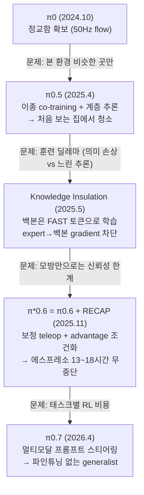

# Lec 21. π 패밀리 II — 일반화, RL, 그리고 스티어러블 generalist

> 선수 지식: 20강(π0/FAST), 13강(DAgger), 17강(advantage, 오프라인 RL 개념). 부록 D의 CS285 L15-16을 봤다면 RECAP이 훨씬 잘 읽힌다.
> 주의: 이 강의의 모델들(π0.6 이후)은 가중치 미공개다. 실습은 π0.5까지만 가능.

## 한 장 요약

각 세대는 이전 세대의 실패 모드를 고친다. 이 체인이 곧 논문 읽기 훈련이다.

## 학습 목표

1. π0.5의 co-training 데이터 구성(~97.6%가 비대상 로봇)과 한-모델 계층 추론을 설명할 수 있다.
2. Knowledge Insulation이 "훈련은 FAST, 추론은 flow"를 어떻게 동시에 얻는지 설명할 수 있다.
3. RECAP의 3단계(시연 → 보정 → 자율 RL)와 advantage 조건화를 17강의 언어로 설명할 수 있다.
4. π0.7의 "스티어링" 주장과 그 검증 포인트를 구분할 수 있다.

## 본문

### 1. π0.5 — 처음 보는 집 (2025.4, arXiv 2504.16054)

**문제**: π0는 훈련 환경과 비슷한 곳에서만 강했다. 목표를 극단으로: **한 번도 본 적 없는 집**의 부엌·침실을 모바일 매니퓰레이터가 10~15분짜리 다단계 작업으로 치우기.

**방법 1 — 이종 co-training**: 훈련 데이터의 **~97.6%가 대상 로봇(모바일 매니퓰레이터) 것이 아니다**. 다른 로봇들의 조작 데이터, 웹 비전-언어 데이터, 고수준 서브태스크 예측 데이터를 섞는다. 일반화는 대상 로봇 데이터를 늘려서가 아니라 **주변 데이터의 다양성**에서 왔다는 것이 핵심 발견.

**방법 2 — 한 모델 안의 계층**: 같은 가중치가 먼저 autoregressive로 서브태스크를 텍스트로 예측하고("베개를 집어라"), 그다음 flow expert가 그 서브태스크의 저수준 액션 청크를 낸다. 24강에서 볼 상용 진영(Helix, Gemini)이 **모델 두 개**로 만드는 계층을 **가중치 하나** 안에 접은 형태 — 19강 ECoT의 "생각하고 행동하기"가 구조로 승격된 것.

### 2. Knowledge Insulation — 훈련 딜레마의 해소 (2025.5, arXiv 2505.23705)

**딜레마**: flow expert를 붙여 그대로 공동 훈련하면 ① 느리게 수렴하고(20강 표에서 연속 flow 열의 훈련 항목) ② expert의 gradient가 백본을 흔들어 **웹에서 배운 의미 지식이 손상**된다. 그렇다고 FAST 토큰만 쓰면 추론이 느리다.

**해법**: 두 출력을 동시에 두되 gradient 흐름을 비대칭으로 —
- 백본은 **FAST 이산 토큰 예측으로 계속 훈련** (빠른 수렴 + 의미 보존, 언어 능력 유지),
- flow expert도 함께 훈련하되 **expert에서 백본으로 가는 gradient를 차단**한다.

추론 때는 flow expert만 쓴다. 20강 마지막 질문("훈련은 FAST, 추론은 flow가 동시에 될까?")의 답이 이것이다. 공개된 `pi05_base` 가중치가 KI 방식으로 훈련된 것이라, openpi를 쓰는 순간 이 기술의 수혜자가 된다.

9강의 감각으로 보면: 사전학습 지식을 지키면서 새 능력을 붙이는 문제는 LLM 파인튜닝의 catastrophic forgetting 문제와 같은 부류고, KI는 gradient 차단이라는 구조적 해법을 쓴 경우다.

### 3. π*0.6 + RECAP — "RL is back" (2025.11, arXiv 2511.14759)

**문제**: 모방학습만으로는 compounding error(13강)가 남는다. 데모가 아니라 **하루 종일 일하는 로봇**이 목표라면 성공률 몇 %가 아니라 처리량과 무중단 시간이 지표가 된다.

**π0.6 베이스**: 백본을 Gemma 3 4B로 업그레이드(SigLIP 400M 포함), expert도 ~860M으로 (~5B 총합). 카메라 이미지 최대 4장(448×448). 이산+flow 하이브리드 출력, gradient 차단 유지.

**RECAP** (RL with Experience & Corrections via Advantage-conditioned Policies) — 3단계:
1. **시연**으로 기본기 (지금까지의 방식).
2. 로봇이 실제로 실수하는 지점에서 **인간 teleop 보정** 수집 — 13강 DAgger의 산업화. "전문가가 정책의 방문 상태를 재라벨링한다"는 그 아이디어가, 실수 순간에만 개입하는 운영 절차로 구현된 것.
3. **자율 RL**: 자기 경험 데이터에 value function(critic, 17강)을 학습해 각 행동의 **advantage**를 추정하고, 정책에는 "좋은/나쁜 행동" **조건화 토큰**으로 주입한다. PPO식 정책 경사 기계 없이 — 오프라인 RL의 advantage-weighted 계열(부록 D: AWR) 발상을 "조건화"로 구현한 것. 추론 때 "좋음" 토큰을 조건으로 걸면 좋은 행동 분포가 나온다.

**결과**: 처리량 2배, 실패 절반 이하. 에스프레소 **13~18시간 무중단** 제조, 처음 보는 집에서 빨래 50벌, 실제 공장 박스 59개 조립·라벨링. "RL is back"이라는 필드의 반응은 — RL이 시뮬 보행을 넘어 **실기 조작 파운데이션 모델의 사후 훈련**으로 돌아왔다는 뜻이다.

**RL Tokens (2026.3)**: 후속타. π0.6에 "RL 토큰" 병목 출력을 추가하고, 그 위에 **실시간 학습 가능한 경량 헤드**를 붙여 나사 조이기·이더넷 삽입 같은 서브밀리 접촉 작업의 각 단계(stage)를 **온로봇 ~15분 연습**으로 익힌다. 대형 모델은 얼려두고 작은 헤드만 온라인 적응 — 고전 적응 제어의 감각과 만나는 지점.

### 4. π0.7 — 스티어러블 generalist (2026.4, arXiv 2604.15483)

**문제**: RECAP은 태스크별 RL 특화가 필요하다. π0.7(~4B 백본 + ~860M expert)의 주장: **다양한 멀티모달 프롬프트**(언어, 메타데이터, 제어 모달리티 선택, 시각 서브골)로 스티어링하면, 단일 generalist가 태스크별 RECAP 전문 정책들과 대등하거나 낫다 — 파인튜닝 없이.

첫 **조합적 일반화** 신호: 양팔 UR5e가 해당 embodiment의 빨래 데이터 0으로 빨래를 갠다 (다른 로봇의 빨래 스킬 × 그 로봇의 다른 스킬이 조합됨). 외부에서는 "GPT-3 모먼트"라는 프레임이 돌았지만 — 이것은 논평이지 논문의 주장이 아니다. 32강의 체크리스트로 걸러 읽을 것.

### 5. 공개 현황과 큰 그림

- **π0.6, π*0.6, RLT, π0.7 가중치는 미공개** (openpi에는 π0.5까지). 실습·재현은 π0.5 세대까지만 가능하고, 그 이후는 논문 읽기의 영역이다.
- PI 서사 한 줄 요약: **정교함(π0) → 일반화(π0.5) → 신뢰성(π*0.6) → 통합·스티어링(π0.7)**. 각 단계가 이전 모델의 실패 모드에서 나왔다 — 새 논문을 만났을 때 던질 첫 질문("이건 누구의 어떤 실패를 고치나")의 모범 사례.

### 로봇공학자를 위한 번역

- **RECAP의 보정 teleop = DAgger의 운영화**. 이론(13강)에서 "expert 재라벨링은 비실용적"이라 했던 것을, "실수 순간에만 개입"으로 비용을 깎아 실용화했다.
- **advantage 조건화**는 최적제어 언어로: 성능지표로 점수 매긴 궤적 라이브러리에서 "상위 궤적의 분포"만 골라 재현하도록 조건 신호를 다는 것. critic이 점수를 매기고(17강의 value function), 정책 경사 대신 **조건부 모방**으로 우회한다 — 실기에서 안정적인 이유이기도 하다.
- **RLT의 경량 온라인 헤드**는 적응 제어의 구도와 같다: 느리고 큰 모델(공칭 모델)은 고정, 빠르고 작은 보정항만 온라인 갱신. 수렴 보장 대신 사전학습된 표현이 안정성을 담보한다는 점이 다르다.

## 실습 (60분, GPU 불필요)

**π0.5 논문 그림 정독 + RECAP 영상 비판적 시청.**

1. π0.5 논문의 데이터 믹스 그림에서 각 데이터 소스(타 로봇/웹 VL/서브태스크)가 **무엇을 기여하는지** Claude와 표로 정리한다. "97.6%가 비대상 데이터"의 함의를 토론.
2. unseen-home 평가 그래프에서: 비교 대상은 무엇이고, N은 몇이고, 신뢰구간은 있는가? (30강 예습)
3. π*0.6 블로그의 에스프레소/빨래 영상을 32강 체크리스트의 눈으로 미리 본다: 컷 편집 여부, 실패 릴 유무, "13~18시간"의 정의(개입 기준)를 확인하고 의심 목록을 만든다.

## Claude와 토론할 질문

1. 계층을 한 모델에 넣기(π0.5) vs 두 모델로 나누기(Helix, Gemini) — 훈련·배포·디버깅 각각에서 장단은?
2. KI의 gradient 차단은 왜 "의미 보존"이 되는가? 9강의 LoRA(작은 어댑터만 학습)와 철학적으로 어떻게 같고 다른가?
3. advantage 조건화가 PPO보다 실기 로봇에 유리한 이유를 세 가지 들어보라 (안정성, 데이터 재사용, 인프라).
4. RECAP의 teleop 보정은 로봇 대수가 100배가 되면 스케일하는가? 병목은 무엇인가?
5. π0.7의 "조합적 일반화"를 엄밀히 검증하려면 어떤 실험 통제가 필요한가? (데이터 누출 가능성부터)
6. "RL is back"에서 돌아온 RL은 17강에서 배운 RL과 어떻게 다른가? (온라인 탐색이 있는가?)
7. 가중치 미공개 기조(π0.6+)는 PI의 초기 오픈 전략과 어떻게 화해되는가? 필드에 미칠 영향은?

## 읽을거리

1. **π0.5 블로그(pi.website/blog/pi05) 전문 + 논문은 그림 중심** (~40분).
2. **π*0.6 블로그(pi.website/blog/pistar06) 전문** (~20분): RECAP의 가장 읽기 쉬운 설명.
3. (선택) KI 논문(arXiv 2505.23705)은 초록 + Fig 1만.

## 자가 점검

1. π0 → π0.5 → π*0.6 → π0.7 각각의 "고친 실패"를 안 보고 말할 수 있는가?
2. π0.5의 두 방법(co-training, 한-모델 계층)을 구분해 설명할 수 있는가?
3. KI의 gradient 흐름 그림(무엇이 차단되고 무엇이 흐르는가)을 그릴 수 있는가?
4. RECAP 3단계와 advantage 조건화의 동작을 17강 용어(critic, advantage)로 설명할 수 있는가?
5. 지금 openpi에서 받을 수 있는 최신 체크포인트가 무엇인지, 그 가중치가 어떤 방식으로 훈련됐는지 말할 수 있는가?

## 참고문헌

> 본문 수치·주장의 출처. 웹 문서는 2026-07-08 접속 기준. (2차) = 언론·블로그 등 2차 출처.

[1] Physical Intelligence, "π0.5: a Vision-Language-Action Model with Open-World Generalization," arXiv:2504.16054, 2025.4. https://arxiv.org/abs/2504.16054 · 블로그: https://www.pi.website/blog/pi05
— **뒷받침**: 훈련 데이터 ~97.6%가 비대상 로봇(타 로봇/웹 VL/서브태스크 예측), 한-모델 계층 추론(AR 서브태스크 텍스트→flow 청크), 처음 보는 집에서 10~15분 다단계 청소.

[2] D. Driess et al. (Physical Intelligence), "Knowledge Insulating Vision-Language-Action Models," arXiv:2505.23705, 2025.5. https://arxiv.org/abs/2505.23705
— **뒷받침**: 백본은 FAST 이산 토큰으로 학습 + expert→백본 gradient 차단, 공개 π0.5 가중치가 KI 방식으로 훈련됨.

[3] Physical Intelligence, "π*0.6: a VLA That Learns From Experience" (RECAP), arXiv:2511.14759, 2025.11. https://arxiv.org/abs/2511.14759 · 블로그: https://www.pi.website/blog/pistar06 · 모델 카드: https://website.pi-asset.com/pi06star/PI06_model_card.pdf
— **뒷받침**: π0.6 베이스(Gemma 3 4B, SigLIP 400M 포함 + ~860M expert ≈ 5B; 카메라 이미지 최대 4장 448×448; 이산+flow 하이브리드), RECAP 3단계(시연/보정 teleop/자율 RL), value function+advantage 조건화 토큰, 처리량 2배·실패 1/2 이하, 에스프레소 13~18시간, 새 집 빨래 50벌, 공장 박스 59개.

[4] (2차) Humanoids Daily, "The Last Millimeter: Physical Intelligence Unveils RL Tokens," 2026.3.19. https://www.humanoidsdaily.com/news/the-last-millimeter-physical-intelligence-unveils-rl-tokens-for-hyper-fast-precision
— **뒷받침**: RL 토큰 병목 + 경량 실시간 학습 헤드, 서브밀리 접촉 작업(나사·이더넷)의 단계당 ~15분 온로봇 연습.

[5] Physical Intelligence, "π0.7: a Steerable Generalist Robotic Foundation Model with Emergent Capabilities," arXiv:2604.15483, 2026.4. https://arxiv.org/abs/2604.15483 · 블로그: https://www.pi.website/blog/pi07
— **뒷받침**: ~4B 백본+~860M expert, 멀티모달 프롬프트 스티어링(언어/메타데이터/제어 모달리티/시각 서브골), RECAP 전문 정책 대등/능가, 양팔 UR5e 빨래 조합 일반화. "GPT-3 모먼트" 프레임은 외부 논평 (예: TechCrunch 2026.4.16, (2차) https://techcrunch.com/2026/04/16/physical-intelligence-a-hot-robotics-startup-says-its-new-robot-brain-can-figure-out-tasks-it-was-never-taught/).

[6] openpi issue #791. https://github.com/Physical-Intelligence/openpi/issues/791
— **뒷받침**: π0.6 이후 가중치 미공개 상태(2025.11 질문 이후 무응답).
