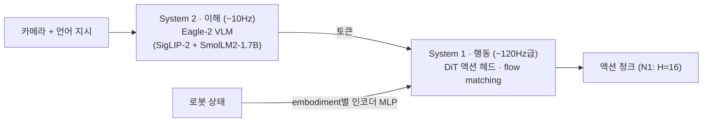

# Lec 22. GR00T 패밀리 — dual-system, 데이터 피라미드, 그리고 world model로 가는 길

> 선수 지식: 20강(π0 템플릿), 16강(flow matching). 등장하는 로봇(Fourier GR-1, Unitree G1)의 하드웨어는 25강에서 자세히 다룬다.
> NVIDIA 자료를 읽을 때는 항상 기억할 것: **GR00T는 Isaac·Omniverse·Jetson을 파는 회사의 모델**이다. 그 이해관계가 설계와 마케팅 양쪽에 배어 있다 — 그것 자체가 학습 포인트다.

## 한 장 요약

버전 진화 한 줄 요약: N1(dual-system 실증) → N1.5(VLM 동결) → N1.6(추론 VLM + 전신) → N1.7(인간 공유 action space) → **N2(VLA를 넘어 world action model)**.

## 학습 목표

1. GR00T의 dual-system 구조와 π0(단일 시퀀스 + expert)의 구조적 차이를 설명할 수 있다.
2. 데이터 피라미드(웹·영상 / 합성 / 실기)의 각 층이 무엇을 기여하고 왜 상호 대체가 안 되는지 설명할 수 있다.
3. DreamGen(neural trajectories)의 파이프라인과 수치적 효과를 설명할 수 있다.
4. N1→N1.7의 버전별 변화에서 "백본은 소모품, 설계 패턴과 데이터 파이프라인이 자산"이라는 패턴을 읽어낼 수 있다.

## 본문

### 0. 왜 칩 회사가 로봇 모델을 만드는가

NVIDIA의 로봇 사업은 모델 판매가 아니다. GR00T는 **Isaac Sim/Lab(시뮬레이션), Cosmos(world model), Jetson(온보드 칩), DGX(훈련)**을 한 줄로 꿰는 앵커 상품이다. 그래서 GR00T의 설계는 일관되게 "합성 데이터와 시뮬레이션으로 실데이터 병목을 우회한다"로 기운다 — PI가 실기 teleop 1만 시간에 베팅한 것(20강)과 정확히 대조되는 전략이고, 이 대비가 Part 5에서 가장 배울 것이 많은 지점이다.

### 1. GR00T N1 — dual-system의 실증 (2025.3, arXiv 2503.14734)

- **System 2 (이해, ~10Hz)**: Eagle-2 VLM — SigLIP-2 비전 + SmolLM2-1.7B (12강에서 본 조합).
- **System 1 (행동, ~120Hz급)**: DiT(디퓨전 트랜스포머) 액션 헤드, flow matching, H=16 청크. VLM 토큰에 cross-attention.
- **embodiment 처리**: 로봇마다 다른 상태·행동 차원을 **embodiment별 인코더 MLP**로 공통 임베딩에 사영 — cross-embodiment를 구조로 해결.
- 총 ~2.2B, end-to-end 공동 훈련. 주 실기는 Fourier GR-1 휴머노이드 (하드웨어 상세는 25강에서).
- π0와의 구조 비교: π0는 expert가 백본과 attention을 공유하는 한 그래프, GR00T는 주파수가 다른 두 모듈의 cascade. Kahneman의 System 1/2 은유를 빌렸지만 공학적 실체는 **이해 루프와 행동 루프의 대역 분리**다 (24강에서 Helix가 같은 결론에 도달하는 것을 보게 된다).

### 2. 데이터 피라미드 — NVIDIA의 데이터 철학

N1 논문의 프레임:
- **바닥 (거대·저비용)**: 웹 데이터 + 인간 1인칭 영상. 행동 라벨이 없으므로 latent action·역동역학 모델(IDM)로 의사 라벨링.
- **중간**: 합성 데이터 — 시뮬레이션 궤적 + 생성 모델이 만든 "neural trajectories".
- **꼭대기 (희소·고가)**: 실기 teleop.

PI와의 대조를 명시적으로: PI는 꼭대기를 돈으로 채웠고, NVIDIA는 바닥·중간을 도구로 채운다. 어느 쪽이 옳은지는 아직 미결이며, 24강의 Skild(심 우선)와 Figure(인간 영상)까지 포함하면 이 질문이 필드 전체의 단층선임을 알 수 있다.

### 3. 합성 데이터 도구들 — 피라미드 중간을 채우는 법

- **GR00T-Mimic**: 사람 시연 몇 개를 Isaac Lab에서 대량으로 증식 (MimicGen 계보; 29강에서 재회).
- **GR00T-Dreams / DreamGen** (2025.5, arXiv 2505.12705): 비디오 world model(Cosmos Predict 2)을 대상 로봇 영상으로 파인튜닝 → 이미지+텍스트 프롬프트로 **새 태스크·새 환경의 로봇 영상을 "꿈꾸게"** 하고 → IDM/latent action으로 의사 행동을 추출한 **neural trajectories**로 훈련.
- **수치**: pick-and-place만 배운 N1이 새 동사(태스크)에서 0% → DreamGen 데이터를 더하면 **43.2%(본 환경), 28.5%(새 환경)**. "생성 모델이 데이터 엔진이 된다"는 31강 world model 서사의 실증 1호.

### 4. 버전 진화 — 각 버전이 하나의 교훈이다

| 버전 | 시점 | 핵심 변화 | 교훈 |
|---|---|---|---|
| **N1.5** | 2025.6 | VLM **동결**, 어댑터 단순화, **FLARE** 손실(미래 잠재 표현 정합) | 동결을 포함한 개편으로 언어 추종 46.6→93.3%(실기 GR-1, N1→N1.5 종합 변화). 19강 OpenVLA의 "unfreeze 필수"와 정반대 — 동결 논쟁은 데이터·규모 의존적 경험칙 |
| **N1.6** | 2025.12 | 백본을 **Cosmos Reason**(물리 추론 VLM)으로 교체, DiT 16→32층(2배), 상위 4층 해동, 전신 loco-manipulation (Unitree G1 등) | "이해 모듈"은 범용 VLM에서 물리 추론 특화 VLM으로 |
| **N1.7** | 2026.4 GA | Cosmos-Reason2-2B(Qwen3-VL 계열), DiT 32→16층, **H 16→40**, 차원 29→132, **인간·로봇 공유 상대 EEF action space**, EgoScale 인간 영상 ~2만 시간 | action space를 인간과 공유해 피라미드 바닥(인간 영상)을 직접 먹는다 (26강에서 상세) |

패턴을 읽자: **백본 VLM은 세대마다 갈아끼워진다(Eagle-2→Eagle 2.5→Cosmos Reason→Cosmos-Reason2). 유지되는 것은 flow-matching DiT라는 메커니즘과 embodiment별 사영이라는 설계 패턴, 그리고 데이터 파이프라인이다.** 반면 action space의 정의 자체는 N1.6(상대 청크)→N1.7(인간 공유 상대 EEF)에서 재정의됐다 — 즉 자산은 백본도 인터페이스의 구체 값도 아니고, 패턴과 파이프라인이다. 새 논문에서 "백본을 X로 바꿨다"가 왜 대개 부차적 뉴스인지의 이유다.

FLARE 한 줄 설명: 미래 프레임을 픽셀로 생성하는 대신 **미래의 잠재 표현을 예측하도록 정합**시키는 보조 손실 — 행동 라벨 없는 인간 영상에서 배우는 통로이며, 31강 V-JEPA류 세계 모델 발상의 미니어처다.

### 5. N2 / DreamZero — VLA의 다음? (2026.3 예고)

- DreamZero 논문("World Action Models are Zero-shot Policies", arXiv 2602.15922): **사전학습 비디오 디퓨전 백본이 미래 영상과 행동을 공동 모델링**하는 world action model(WAM). 시연 모방이 아니라 세계의 동역학 자체를 이종 데이터에서 배운다.
- 주장: SOTA VLA 대비 새 태스크·환경 일반화 **>2배**, **~30분 놀이 데이터**로 새 embodiment에 few-shot 적응. RoboArena 등 리더보드 1위(30강에서 이 평가의 신뢰도를 다룬다). GR00T N2로 제품화, 연말 출시 예고.
- 커리큘럼 관점: "관측→행동" 매핑(VLA)에서 "세계 예측 속의 행동"(WAM)으로의 이동 신호. 31강에서 V-JEPA 2, Cosmos, 1X world model과 함께 정면으로 다룬다. 단, 아직 예고·프리뷰 단계 — 마케팅과 논문을 구분해서 기억할 것.

### 6. 생태계 — 직접 만질 수 있는 것

코드 Apache-2.0 + 가중치 NVIDIA Open Model License (github.com/NVIDIA/Isaac-GR00T, HF `nvidia/GR00T-N1.7-3B` + DROID/LIBERO 파인튜닝판). **LeRobot에 N1.6부터 직접 통합** (28강). 온보드는 Jetson Orin/Thor + TensorRT로 DiT ~3.6배 가속 (배포 계층은 26강에서 상세).

### 로봇공학자를 위한 번역

- dual-system은 **cascade 제어의 학습판**이다 — 외루프 이해(~10Hz)/내루프 행동(~120Hz)의 대응이며, 대역 분리 이유도 동일하다 (24강에서 상용 사례들로 다시 정리한다).
- **FLARE ≈ 출력 오차 기반 예측 정합**: full-state(픽셀 전부)를 재구성하는 대신 잠재 출력만 맞추는 것 — 관측기 설계에서 전체 상태 재구성 대신 출력 주입으로 절약하는 감각과 닮았다.
- **데이터 피라미드 ≈ 모델 보정의 계층화**: 시스템 식별에서 저비용 시뮬 데이터로 공칭 모델을 잡고 실데이터로 잔차를 보정하는 관행의 초대형판. 시뮬-실기 잔차(sim2real 갭)가 어디에 숨는지 아는 사람일수록 neural trajectory의 오차 소스를 잘 의심할 수 있다.

## 실습 (45~60분)

**A안 (GPU 24GB급): GR00T N1.7을 LeRobot에서 로드.** 모델 로드 → embodiment/modality config 확인 → 더미 관측으로 액션 shape(H=40 × 차원) 확인 → 자기 로봇을 추가한다면 어떤 config를 써야 하는지 정리.

**B안 (CPU만, 충분히 유익): config 해부.** Isaac-GR00T 저장소의 embodiment 설정 파일들을 Claude와 함께 읽고, "새 로봇 하나를 GR00T에 붙이기 위해 정의해야 하는 것 목록"(상태 키, 행동 키, 정규화, 카메라)을 작성한다. 26강에서 배운 modality config가 실물로 보인다.

## Claude와 토론할 질문

1. N1.5의 "VLM 동결이 낫다"와 OpenVLA의 "unfreeze 필수" — 두 결론이 갈린 원인 후보를 데이터 규모·헤드 구조·평가 지표 관점에서 각각 세워 보라.
2. neural trajectory의 오차는 어디서 생기고(영상 생성의 물리 오류, IDM의 의사 라벨 오류), 각각 정책의 어떤 실패로 나타나겠는가?
3. 데이터 피라미드 바닥이 꼭대기를 대체할 수 없는 이유는? 접촉 동역학 관점에서 논증해 보라.
4. NVIDIA의 이해관계(심·칩 판매)를 알고 나면, GR00T 논문의 어떤 수치를 특히 교차 검증해야 하는가?
5. N1.7이 DiT를 절반으로 줄이면서 H를 2.5배 늘린 트레이드오프를 26강(청크·개루프)의 언어로 평가하라.
6. WAM(N2)이 VLA를 대체한다면, Part 5에서 배운 것 중 무엇이 살아남고 무엇이 폐기되는가?
7. PI(실데이터)·NVIDIA(합성)·Skild(심)·Figure(인간 영상) — 데이터 전략 4파전에서 5년 뒤 승자를 논거와 함께 골라 보라.

## 읽을거리

1. **GR00T N1 논문 (arXiv 2503.14734)**: §아키텍처 + 데이터 피라미드 그림까지 (~40분).
2. **DreamGen 블로그(developer.nvidia.com의 synthetic trajectory 글) 또는 논문 Fig**: 파이프라인 그림 중심 (~15분).
3. (선택) N1.5/1.6/1.7은 GEAR 리서치 페이지 요약이면 충분 — 버전 표의 출처 확인용.

## 자가 점검

1. dual-system 그림(모듈, 주파수, 신호)을 안 보고 그릴 수 있는가?
2. π0와 GR00T의 구조적 차이(attention 공유 vs cascade)를 설명할 수 있는가?
3. 데이터 피라미드 세 층과 각 층의 라벨링 방법을 말할 수 있는가?
4. DreamGen 파이프라인 4단계(파인튜닝→꿈→의사 라벨→훈련)와 효과 수치를 말할 수 있는가?
5. N1→N1.7에서 유지된 것과 교체된 것을 구분하고, 그 패턴의 함의를 말할 수 있는가?

## 참고문헌

> 본문 수치·주장의 출처. 웹 문서는 2026-07-08 접속 기준. (2차) = 언론·마케팅 채널.

[1] NVIDIA, "GR00T N1: An Open Foundation Model for Generalist Humanoid Robots," arXiv:2503.14734, 2025.3. https://arxiv.org/abs/2503.14734 · HF: https://huggingface.co/nvidia/GR00T-N1-2B
— **뒷받침**: dual-system 구조(System 2 = Eagle-2 VLM: SigLIP-2+SmolLM2-1.7B / System 1 = DiT flow matching), H=16, ~2.2B, embodiment별 인코더 MLP, 데이터 피라미드, 주 실기 Fourier GR-1. ※ ~10Hz/~120Hz 주기는 논문 기술과 2차 요약을 종합한 값.

[2] NVIDIA GEAR, "GR00T N1.5," 리서치 페이지, 2025.6. https://research.nvidia.com/labs/gear/gr00t-n1_5/
— **뒷받침**: VLM 동결, 어댑터 단순화, FLARE 손실, 언어 추종 46.6→93.3%·태스크 성공 43.3→83.0%(실기 GR-1, N1→N1.5 종합 변화).

[3] NVIDIA, "DreamGen: Unlocking Generalization in Robot Learning through Neural Trajectories," arXiv:2505.12705, 2025.5. https://arxiv.org/abs/2505.12705 · 코드: https://github.com/nvidia/gr00t-dreams · 해설: https://developer.nvidia.com/blog/enhance-robot-learning-with-synthetic-trajectory-data-generated-by-world-foundation-models/
— **뒷받침**: Cosmos Predict 2 파인튜닝→"꿈" 영상→IDM/latent action 의사 라벨(neural trajectories), novel task 0% → 43.2%(본 환경)/28.5%(새 환경).

[4] NVIDIA GEAR, "GR00T N1.6," 리서치 페이지, 2025.12 (CES 2026.1 발표). https://research.nvidia.com/labs/gear/gr00t-n1_6/ · 개발 블로그: https://developer.nvidia.com/blog/building-generalist-humanoid-capabilities-with-nvidia-isaac-gr00t-n1-6-using-a-sim-to-real-workflow/
— **뒷받침**: Cosmos Reason 백본 교체, DiT 16→32층, 상위 4층 해동, 상대 청크, 전신 loco-manipulation(Unitree G1 등).

[5] NVIDIA, "GR00T N1.7," Isaac-GR00T 저장소 + HF 블로그, 2026.4 GA. https://github.com/NVIDIA/Isaac-GR00T · https://huggingface.co/blog/gr00t-n1-7 · HF: https://huggingface.co/nvidia/GR00T-N1.7-3B
— **뒷받침**: Cosmos-Reason2-2B(Qwen3-VL 계열) 백본, 3B, DiT 32→16층, H 16→40, 상태·행동 차원 29→132, 인간·로봇 공유 상대 EEF action space, EgoScale 인간 영상 ~20K시간.

[6] NVIDIA, "World Action Models are Zero-shot Policies" (DreamZero), arXiv:2602.15922, 2026.2. https://arxiv.org/abs/2602.15922 · 해설: https://developer.nvidia.com/blog/pretrained-to-imagine-fine-tuned-to-act-the-rise-of-world-action-models/
— **뒷받침**: 비디오 디퓨전 백본의 미래 영상+행동 공동 모델링, SOTA VLA 대비 >2배 일반화 주장, ~30분 놀이 데이터 few-shot embodiment 적응.

[7] (2차) NVIDIA 뉴스룸, GTC 2026 발표, 2026.3. https://nvidianews.nvidia.com/news/nvidia-and-global-robotics-leaders-take-physical-ai-to-the-real-world
— **뒷받침**: GR00T N2 예고(DreamZero 기반, 연말 출시 예정) — 프리뷰 단계 정보.

[8] Z. Li et al. (NVIDIA), "Eagle 2: Building Post-Training Data Strategies from Scratch for Frontier Vision-Language Models," arXiv:2501.14818, 2025.1. https://arxiv.org/abs/2501.14818
— **뒷받침**: N1 백본 VLM(Eagle 계열)의 구조적 배경.
