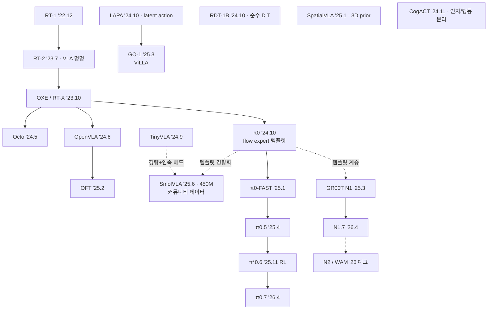

# Lec 23. 작은 모델들과 계보도 총정리 — SmolVLA에서 세 논쟁 축까지

> Part 5 오픈 진영 마무리 강의 (비공개 진영은 24강). 선수 지식: 18~22강 전부.
> 이 강의의 목표는 새 지식 추가가 아니라 **압축** — Part 5 전체를 한 장의 계보도와 세 개의 논쟁 축으로 접는 것.

## 한 장 요약

## 학습 목표

1. SmolVLA의 구조와 훈련 데이터 전략이 왜 "민주화의 완성"인지 설명할 수 있다.
2. TinyVLA·SimVLA·SpatialVLA·GO-1·RDT-1B·CogACT가 각각 어떤 축의 탐험인지 한 문장씩 말할 수 있다.
3. Part 5 전체를 3시대 프레임과 세 논쟁 축으로 재구성할 수 있다.
4. 새 VLA 논문을 계보도 위 "어느 가지의 연장"인지 즉시 위치시킬 수 있다.

## 본문

### 1. 경량화 계보 — 왜 작아지는가

세 가지 동기가 겹친다: **배포**(온보드 추론, 24강 Redwood 160M과 같은 압력), **민주화**(파인튜닝 비용 — 부록 C), 그리고 **과학**("정말 필요한 게 뭔가"의 ablation).

**TinyVLA (2024.9)**: 1B 미만 VLM + 디퓨전 정책 헤드. 로봇 데이터 사전학습을 통째로 생략하고 LoRA(~5% 파라미터)로 파인튜닝. 메시지: **"작은 VLM + 제대로 된 연속 헤드 > 거대 AR VLA"** — 19강 OFT와 같은 방향의 증거.

**SmolVLA (2025.6, arXiv 2506.01844) — 이 강의의 딥다이브.** 450M 전체가 소비자 GPU(추론 ~2GB)에 들어가는 π0 템플릿의 축소판:
- **백본**: SmolVLM-2 유래 (SigLIP + SmolLM2 — 12강에서 본 조합의 최소형). 시각 토큰은 pixel-shuffle로 압축, 카메라당 64토큰 수준까지 절약 (10강의 토큰 예산 계산이 실전이 된 것).
- **구조적 다이어트 1 — 상위 LLM 레이어 스킵**: LLM의 위쪽 절반을 잘라내고 중간 표현에서 바로 액션으로. "행동에 필요한 것은 고수준 추상화의 끝단이 아니다"는 실증.
- **구조적 다이어트 2 — ~100M flow expert**: cross-attention(관측 참조)과 self-attention(액션 청크 내부)을 **인터리브**한 경량 expert.
- **데이터가 진짜 뉴스**: 기업 데이터 없이 **커뮤니티가 SO-100(SO-101의 전신)으로 모은 LeRobot 데이터셋 487개(~23k 에피소드, 10M 프레임)**만으로 훈련. 25강에서 다룰 "$130 하드웨어 → 커뮤니티 데이터 폭발"의 수확이 이것이다.
- **async inference**(26강에서 상세)를 이 논문이 LeRobot에 도입했고, LIBERO·Meta-World·SO-100 실기(SO-101 일반화 테스트 포함)에서 훨씬 큰 모델들과 대등 이상.
- 의미: 파운데이션 모델 문법(사전학습→파인튜닝)이 **개인 단위로 민주화**됨. 28강 최대 실습의 주인공.

**SimVLA (2026.2, arXiv 2602.18224)**: 0.5B 미니멀 베이스라인 — 사전학습 VLM + 경량 액션 트랜스포머(flow matching), 로봇 사전학습 없이 심 벤치마크에서 수십억 모델을 이긴다고 주장. **SmolVLA와 다른 모델**이다(이름 혼동 주의). 메시지: "그 복잡성이 다 필요한가"라는 회의론은 2026년에도 유효하고, 심 벤치마크 위의 주장이라는 점은 30강의 눈으로 볼 것.

### 2. 다른 축의 탐험들 — 한 문장씩

- **SpatialVLA (2025.1)**: 관측에 **3D prior**(Ego3D 위치 인코딩 — 추정 깊이 주입)를, 행동에 **Adaptive Action Grids**(데이터 분포 기반 재이산화 가능한 빈)를. 25강의 "RGB만으로 충분" 서사에 대한 반론 축 — 공간 정밀이 필요한 태스크에서 기하 정보의 명시적 주입이 이긴다는 주장.
- **GO-1 / ViLLA (2025.3)**: VLM + **Latent Planner** + Action Expert의 3단. 행동 라벨 없는 웹·인간 영상에서 **latent action**을 배워 계획 층으로 씀 (LAPA '24.10 계보). AgiBot World 1M 궤적(수집 체계는 27강에서 다룬다)과 결합. 31강 latent action 물결의 본편 예고.
- **RDT-1B (2024.10)**: VLM 없는 **순수 디퓨전 트랜스포머** 1.2B + 128차원 통일 액션 공간(26강 회수). 양팔 정밀 조작 특화. "VLM 백본이 정말 필수인가"의 대조군.
- **CogACT (2024.11)**: 7B VLM(인지) + ~300M DiT(행동)의 **명시적 분리** — naive 토큰화 대비 큰 폭 향상. π0가 attention 공유로 접은 것을 모듈 분리로 편 설계 (20강에서 토론한 "attention 공유 vs 완전 분리"의 실존 답안).

### 3. 계보도 총정리 — 3시대와 세 논쟁 축

**3시대 프레임**:
- **1시대 '22-23 (18강)**: 로봇 트랜스포머 + 이산 행동 토큰. RT-1이 실증, RT-2가 웹 지식을 연결, OXE가 데이터를 모음.
- **2시대 '24 (19-20강)**: 오픈화 + 연속 액션 헤드. Octo/OpenVLA가 재현·공개, π0가 flow expert 템플릿 확립, RDT·CogACT·TinyVLA가 설계 공간 탐색.
- **3시대 '25-26 (21-24강)**: 분화 — 계층·dual-system(π0.5, GR00T, Helix), RL 사후 훈련(RECAP), latent action(GO-1), 경량 온보드(SmolVLA, Redwood), 그리고 world model 수렴(N2/WAM)의 예고.

**세 논쟁 축** — 새 논문은 거의 예외 없이 이 세 축 위 새 조합이다:
1. **행동 표현**: 이산 AR 토큰 ↔ 연속 flow/디퓨전 (해소 시도: FAST, KI, OFT의 회귀)
2. **구조**: 단일 모델 ↔ 계층/dual-system (해소 시도: π0.5의 한-모델 계층)
3. **데이터**: 실기 teleop ↔ 웹·합성·인간 영상 (해소 시도: co-training, DreamGen, latent action, EgoScale)

이 세 축 + 21강의 학습 레시피(KI·RL 사후 훈련) + 26강의 실행·효율 계층 + 30강의 평가 문제를 합치면 32강의 "논문 읽기 6축 프레임워크"가 완성된다.

### 로봇공학자를 위한 번역

- 경량화는 모델 축소가 아니라 **요구 스펙의 재정의**다 — 제어기 설계에서 "필요 대역폭을 먼저 정하고 최소 차수로 구현"하는 감각. SmolVLA의 레이어 스킵은 대역 밖 다이내믹스를 제거한 축약 모델에 해당한다.
- latent action은 **관측만으로 입력을 역추정하는 문제**, 즉 미지 입력 관측기(unknown input observer)의 학습판이다. 원리적 한계(관측에서 복원 불가능한 입력 성분 — 예: 힘의 크기)도 같은 이유로 남는다.
- 계보도 읽기는 특허 지도 읽기와 같다: 노드(모델)가 아니라 **엣지(무엇을 계승하고 무엇을 반박했나)**에 정보가 있다.

## 실습 (60분, GPU 불필요) — Part 5 오픈 진영 캡스톤

**계보도를 백지에서 그린다.**

1. 위 mermaid를 보지 않고, 18~23강에서 만난 모델 약 20개를 시간축에 배치한다 (π 파생 버전들은 묶어 세어도 좋다).
2. 화살표마다 라벨을 단다 — "무엇을 계승", "무엇을 반박". (예: OFT → π0 방향은? SmolVLA가 계승한 것은 π0의 무엇?)
3. Claude에게 채점을 받는다: 빠진 노드, 틀린 엣지, 그리고 "이 엣지에 라벨을 달 수 없다면 그 모델을 다시 읽어야 한다".
4. 마지막으로 세 논쟁 축 각각에 대해 자기 입장을 한 문단씩 쓴다 — 이것이 Part 5의 최종 산출물이다.
5. 부록 A 치트시트와 대조해 마무리.

## Claude와 토론할 질문

1. SmolVLA가 커뮤니티 데이터만으로 되는 이유는 무엇인가 — 데이터의 양인가, 단일 로봇 플랫폼(SO-100)에서 오는 embodiment 일관성인가? π0의 이종 1만 시간과 비교하라.
2. 상위 LLM 레이어를 잘라도 되는 이유는? 어느 층의 표현이 "행동에 충분"한가 — 이것으로 LLM 내부 표현에 대해 무엇을 알 수 있나?
3. SpatialVLA의 3D prior 주장과 25강의 "RGB-only 지배" 관찰은 어떻게 화해되는가? 어떤 태스크 분포에서 갈리는가?
4. latent action이 원리적으로 복원할 수 없는 정보는 무엇인가? (힘, 강성, 접촉 조건...) 그 한계가 GO-1류의 어떤 실패로 나타나겠는가?
5. "미니멀 베이스라인이 대형을 이긴다"(SimVLA류) 주장에서 반드시 확인할 세 가지는? (벤치마크 포화, 평가 분포, 실기 여부 — 30강 예습)
6. 세 논쟁 축 각각에서 2027년의 승자를 예측하고 논거를 대라. Claude의 반박을 받아 수정해 보라.

## 읽을거리

1. **SmolVLA 블로그(huggingface.co/blog/smolvla) + 논문**: 짧고 그림이 좋다 — 전문 권장 (~40분). 구조 그림을 π0 그림(20강) 옆에 놓고 비교하며 읽을 것.
2. **AgiBot World / GO-1 논문(arXiv 2503.06669)은 ViLLA 구조 그림만** (~10분).

## 자가 점검

1. 계보도를 안 보고 그릴 수 있는가 (노드 ~20개, 라벨 달린 엣지)?
2. SmolVLA의 두 가지 구조적 다이어트와 데이터 전략을 말할 수 있는가?
3. SmolVLA와 SimVLA를 혼동 없이 구분해 설명할 수 있는가?
4. 6개 "다른 축" 모델(TinyVLA, SimVLA, SpatialVLA, GO-1, RDT, CogACT)을 각 한 문장으로 위치시킬 수 있는가?
5. 세 논쟁 축을 대고, 임의의 최근 논문 하나를 그 위에 놓을 수 있는가?

## 참고문헌

> 본문 수치·주장의 출처. 계보도 노드의 날짜·수치 중 18~22강에서 다룬 것은 해당 강의의 참고문헌을 따른다. 웹 문서는 2026-07-08 접속 기준.

[1] M. Shukor et al. (Hugging Face), "SmolVLA: A Vision-Language-Action Model for Affordable and Efficient Robotics," arXiv:2506.01844, 2025.6. https://arxiv.org/abs/2506.01844 · 블로그: https://huggingface.co/blog/smolvla · 모델: https://huggingface.co/lerobot/smolvla_base
— **뒷받침**: 450M 총합(SmolVLM-2 유래 백본 + ~100M flow expert), 상위 LLM 레이어 스킵, cross/self-attention 인터리브, 커뮤니티 SO-100 LeRobot 데이터셋 487개(~23k 에피소드/10M 프레임)만으로 훈련, async inference 도입, LIBERO·Meta-World·SO-100 실기 평가.

[2] Hugging Face, "Async robot inference" 블로그·문서, 2025.6. https://huggingface.co/blog/async-robot-inference · https://huggingface.co/docs/lerobot/en/async
— **뒷받침**: 추론 메모리 SmolVLA ~2GB vs π0 ~14GB.

[3] J. Wen et al., "TinyVLA: Towards Fast, Data-Efficient Vision-Language-Action Models for Robotic Manipulation," arXiv:2409.12514, 2024.9. https://arxiv.org/abs/2409.12514
— **뒷받침**: <1B VLM+디퓨전 정책 헤드, 로봇 사전학습 생략, LoRA ~5% 파라미터.

[4] "SimVLA: A Simple VLA Baseline for Robotic Manipulation," arXiv:2602.18224, 2026.2. https://arxiv.org/abs/2602.18224
— **뒷받침**: 0.5B, 사전학습 VLM+경량 액션 트랜스포머(flow matching), 로봇 사전학습 없이 심 벤치마크 우위 주장. SmolVLA와 별개 모델.

[5] D. Qu et al., "SpatialVLA: Exploring Spatial Representations for Visual-Language-Action Model," arXiv:2501.15830, 2025.1 (RSS 2025). https://arxiv.org/abs/2501.15830 · 코드: https://github.com/SpatialVLA/SpatialVLA
— **뒷받침**: Ego3D 위치 인코딩, Adaptive Action Grids, 1.1M 에피소드.

[6] AgiBot, "AgiBot World Colosseo" (GO-1/ViLLA), arXiv:2503.06669, 2025.3 (IROS 2025). https://arxiv.org/abs/2503.06669 · 블로그: https://agibot-world.com/blog/go1
— **뒷받침**: VLM+Latent Planner+Action Expert 3단(ViLLA), 무라벨 영상의 latent action, AgiBot World 1M+ 궤적.

[7] S. Ye et al., "Latent Action Pretraining from Videos" (LAPA), arXiv:2410.11758, 2024.10. https://arxiv.org/abs/2410.11758
— **뒷받침**: 행동 라벨 없는 인간 영상에서의 latent action 사전학습(GO-1의 계보).

[8] Tsinghua RDT Team, "RDT-1B: a Diffusion Foundation Model for Bimanual Manipulation," arXiv:2410.07864, 2024.10. https://arxiv.org/abs/2410.07864 · 프로젝트: https://rdt-robotics.github.io/rdt-robotics/
— **뒷받침**: 1.2B 순수 디퓨전 트랜스포머, 128차원 통일 액션 공간, 양팔 ALOHA 특화.

[9] Microsoft Research, "CogACT: A Foundational Vision-Language-Action Model for Synergizing Cognition and Action," arXiv:2411.19650, 2024.11. https://arxiv.org/abs/2411.19650 · 프로젝트: https://cogact.github.io
— **뒷받침**: 7B VLM(인지)+~300M DiT(행동)의 명시적 분리, naive 토큰화 대비 큰 폭 향상.
