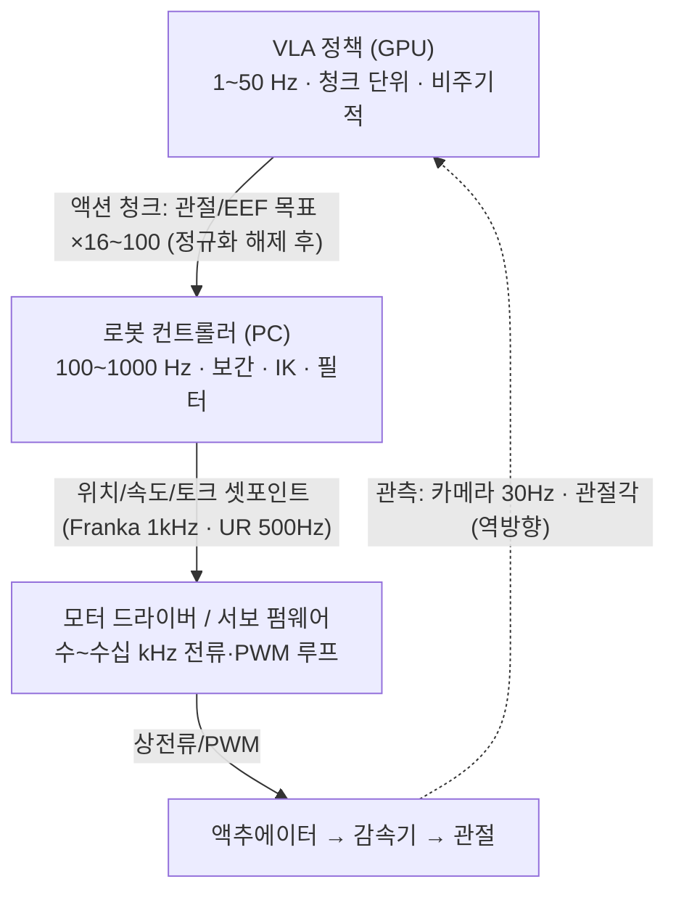

# Lec 26. Action의 여정 — VLA 출력이 액추에이터에 도달하기까지

> Part 6 두 번째 강의. 선수 지식: 14강(청크·앙상블), 16강(flow matching), 20강(π0), 25강(하드웨어).
> 핵심 수치(action 차원·청크 크기·π0/ACT/GR00T 스펙, Franka/UR 인터페이스 주기)는 논문·공식 문서 원문과 교차 검증했다. 일부(Diffusion Policy 주기, 전류 루프 kHz대)는 논문 보고값·업계 전형값이다.
> 정보 기준일: 2026-07-08.

## 한 장 요약

각 층의 주기가 한 자릿수~두 자릿수씩 다르다. 이 강의는 그 간극을 무엇이 어떻게 메우는지를 다룬다.

## 학습 목표

1. 주요 로봇 정책 8종(VLA 6종 + 그 조상 격인 ACT·Diffusion Policy)의 action space(물리량·표현·차원·주기·청크)를 표로 재구성하고, 논문에서 이 정보를 찾아낼 수 있다.
2. 액션 청크 실행 전략 4가지(temporal ensembling, receding horizon, RTC, 비동기 큐)의 문제 설정과 해법을 구분할 수 있다.
3. VLA→컨트롤러→드라이버 계층 간에 실제로 오가는 신호와 주기를 Franka·UR·취미서보 세 사례로 설명할 수 있다.
4. 오프보드/온보드 배포 토폴로지의 트레이드오프를 지연 관점에서 평가할 수 있다.

## 본문

### 0. 문제 설정: 두 개의 간극

**주파수 간극**: VLA 추론은 1~50Hz, 관절 서보는 100~1000Hz, 전류 루프는 수십 kHz. **지연 간극**: π0가 50개짜리 청크 하나를 만드는 데 RTX 4090 기준 ~73ms가 걸린다 (오프보드 서빙이면 네트워크 지연이 더해진다). 추론하는 동안에도 로봇은 움직이고 있다. 이 두 간극을 잘못 다루면 — 청크 사이에 로봇이 멈칫하고(idle frame), 청크 경계에서 명령이 불연속으로 튀고, 오래된 관측으로 만든 행동이 실행된다. 이 강의 전체가 이 문제의 해법 카탈로그다.

### 1. 모델별 action space — "VLA"라는 말이 감추는 다양성

1차 자료(논문·공식 저장소) 기준:

| 모델 | 물리량 | 표현 | 차원 | 청크 | 실효 주기 |
|---|---|---|---|---|---|
| **RT-2** | ΔEEF 포즈 + 그리퍼 | 이산 256빈 → 텍스트 토큰 | 7 (+종료 토큰) | 없음 (스텝 단위) | 1~3Hz (55B, 클라우드 TPU) |
| **OpenVLA** | ΔEEF 포즈 + 그리퍼 | 이산 256빈 (1~99% 분위수 구간), Llama 최저빈도 토큰 256개 덮어씀 | 7 | 없음 | ~6Hz (RTX 4090) |
| **ACT** | **절대 관절각** (양팔 14) | 연속 (CVAE) | 14 | **100** (@50Hz ≈ 2초) | 50Hz |
| **Diffusion Policy** | EEF 포즈 (위치 제어가 속도보다 안정) | 연속 (DDPM/DDIM) | 태스크별 | 예측 16 / 실행 8 | ~10Hz |
| **π0 / π0.5** | 관절 공간, **최대 18차원 제로패딩** (양팔 6DoF×2 + 그리퍼×2 + 베이스 + 토르소) | 연속 (flow matching, Euler 10스텝) | ≤18 | **50** | 최대 50Hz |
| **SmolVLA** | SO-101 관절각 | 연속 (flow matching) | 6 | 50 | LeRobot 기본 30Hz 루프 |
| **GR00T N1→N1.7** | 관절 공간 → **N1.7: 상대 EEF (인간·로봇 공유)** | 연속 (DiT flow matching) | 29 → **132** (모달리티 설정) | 16 → **40** | System1 ~120Hz급 |
| **RDT-1B** | **128차원 통일 공간** (좌/우팔 관절 위치·속도, 그리퍼, EEF, 베이스 슬롯 고정 배치) | 연속 (디퓨전) | 128 (미사용 슬롯 마스킹) | 64 | — |

읽는 법:

- **같은 "VLA"인데 물리량부터 다르다.** ΔEEF(RT-2 계열)는 로봇 간 이식이 쉽지만 IK 층이 필요하고, 절대 관절각(ACT, π0, SmolVLA)은 IK가 필요 없지만 embodiment에 묶인다. GR00T N1.7이 상대 EEF로 돌아간 이유는 **인간 비디오와 action space를 공유**하기 위해서다 (사람 손에는 관절각이 없다). 논문의 action space 선택은 언제나 데이터 전략의 그림자다.
- **정규화는 조용한 함정이다.** openpi는 차원별 1%/99% 분위수(q01/q99)로 정규화한다. OpenVLA의 256빈도 같은 구간에서 나눈다 — 이상치가 빈 전체를 잡아먹는 걸 막는 장치. 부작용: 거의 안 움직이는 차원은 q01≈q99가 되어 정규화 후 값이 폭발한다 (openpi 공식 README가 직접 경고). 파인튜닝이 이상하게 안 될 때 첫 번째 용의자.
- **openpi DROID 사례**: 원본 π0.5-DROID는 관절 **속도** action으로 훈련됐지만, 공개 훈련 레시피는 관절 **위치**를 쓴다 — 속도 action은 시뮬레이션 재현이 어렵기 때문. 같은 모델 계열에서도 action space가 배포 사정으로 바뀐다는 실례.

### 2. 청크 실행 — 개루프 구간을 어떻게 관리하는가

청크는 compounding error를 줄이지만(14강), 청크를 실행하는 동안 정책은 눈을 감고 있다. 50개@50Hz = 1초 개루프. 네 가지 전략:

1. **Temporal ensembling** (ACT): 매 스텝 추론해서 겹치는 청크들을 지수 가중 평균 `w_i = exp(−m·i)`. 부드럽지만 매 스텝 추론 비용을 낸다. 본질적으로 예측들의 저역 필터.
2. **Receding horizon** (Diffusion Policy): 16개 예측, 8개만 실행, 재계획. MPC 사용자에게는 설명이 필요 없는 구조.
3. **Real-Time Chunking, RTC** (PI, 2025.6): 추론을 비동기로 돌리되, **다음 청크 중 "추론이 도는 동안 실행될 앞부분"은 이전 청크 값으로 동결**하고(inpainting 문제로 정식화), 나머지 겹침 구간은 soft masking으로 이전 청크와 정합시킨다. 결과: 인위적으로 +200ms 지연을 넣어도 성능 무손실, 성냥 긋기·이더넷 삽입 같은 정밀 작업이 +300ms에서도 성공.
4. **LeRobot 비동기 추론**: `PolicyServer`(gRPC)와 `RobotClient` 분리. 클라이언트는 로컬 **액션 큐**를 소비하다가 큐 잔량이 `chunk_size_threshold`(기본 0.7) 아래로 내려가면 새 관측을 서버로 보낸다. 새 청크가 도착하면 겹침 구간을 `weighted_average`로 병합. 서버가 느려도 로봇이 멈칫하지 않게 하는 LeRobot 생태계의 기본 해법.

### 3. 컨트롤러 계층 — 셋포인트가 되기까지

**ΔEEF → 관절**: differential IK(자코비안 의사역행렬, resolved-rate) 또는 IK 솔버. ROS 2 생태계에서는 MoveIt Servo가 이 층(Cartesian twist → 관절 명령, 고정 주기)이지만, 연구 스택은 자체 Python 컨트롤러(Polymetis, ur_rtde, LeRobot 버스 클래스)를 쓰는 경우가 많다.

**세 가지 실물 사례** (층별로 무엇이 오가는지):

| | Franka FR3 | UR5e | SO-101 (Feetech) |
|---|---|---|---|
| PC→로봇 신호 | 관절 토크 / 관절·Cartesian 위치·속도 | servoj 위치 셋포인트 (RTDE) | Goal_Position 레지스터 쓰기 (TTL 버스) |
| 주기 | **1kHz** (FCI 실시간 루프) | **500Hz** (e-Series; CB3 125Hz) | LeRobot 기본 30Hz 루프* |
| 로봇 측 처리 | 토크 지령에 **중력·마찰 자동 보상** (τ_c = τ_d + τ_f + τ_g; 0 토크를 보내면 중력에 버팀), 기본 100Hz LPF + 가속도·저크·토크레이트 리미터, 내장 관절/Cartesian 임피던스 | 사이클당 마지막 셋포인트만 사용, 안전 체커 | **서보 온보드 PID** (12비트 자기 엔코더 → PWM). 토크 인터페이스 없음 |
| 대표 배치 | **DROID**: 정책 15Hz → Polymetis(NUC) → 1kHz FCI | 산업 연계 연구 | LeRobot / SmolVLA |

\* 중요한 교정: SO-101의 30Hz는 **서보나 버스의 한계가 아니다**. 버스는 최대 1Mbps로 6서보 sync write가 1ms 미만 — 수백 Hz 명령이 가능하다 (Feetech STS3215 스펙시트 기준). 30Hz는 웹캠 fps와 정책 추론에 맞춘 **LeRobot의 기본 설정값**(`fps=30`)이다. "스펙 한계"와 "소프트웨어 기본값"을 구분하는 것 — 이런 게 논문·문서를 비판적으로 읽는 기술이다.

**주기 계층 총정리**: VLA 1~50Hz (청크, 비주기) → 보간·IK·필터 100Hz~1kHz (주기, 실시간) → 전류/PWM 루프 수~수십 kHz (펌웨어). 위로 갈수록 느리고 똑똑하고, 아래로 갈수록 빠르고 단순하다.

### 4. 배포 토폴로지 — GPU는 어디에 있는가

- **오프보드 GPU + 네트워크**: openpi는 정책 서버를 websocket으로(LAN에서 청크당 0.5~1초를 "정상"으로 안내, 유선 권장), LeRobot은 gRPC로, GR00T는 ZMQ로 서빙한다. 장점: 큰 모델 사용 가능. 단점: 네트워크 지연이 제어 루프 안에 들어온다 — RTC와 비동기 큐가 필수인 이유.
- **온보드**: GR00T는 Jetson AGX Orin/Thor에서 TensorRT 컴파일로 DiT 액션 헤드를 ~3.6배 가속해 온로봇 추론. Helix·Redwood도 온보드 (24강). 역사적 극단은 RT-2 — 55B를 클라우드 멀티 TPU로 서빙하며 1~3Hz.
- 모델 크기와 토폴로지가 연동된다: SmolVLA 450M(~2GB)은 소비자 GPU/CPU까지, π0 3.3B는 ~14GB GPU, RT-2 55B는 클라우드. 23강의 "구조적 다이어트"가 여기서 배포 자유도로 환금된다.

### 5. 안전과 평활화 — 논문이 한 줄로 넘기는 것들

- **클리핑**: 분위수 정규화(q01/q99, 1~99% 빈)가 이상치 행동을 구조적으로 잘라낸다.
- **필터링**: temporal ensembling·weighted_average 병합은 사실상 저역 필터. 그 아래층에서 Franka가 다시 100Hz LPF + 레이트 리미터를 기본 적용한다 — 정책이 이상한 명령을 내도 두 겹의 필터가 받아준다.
- **하드웨어 한계 집행**: 관절 한계·속도 한계는 최하층(Franka reflex, UR 안전 체커)에서 최종 집행. 학습 정책의 안전은 아직 "아래층 고전 장치들에 위임"이 실무 표준이다.

### 로봇공학자를 위한 번역

이 그림 전체는 익숙한 **cascade 제어 + 셋포인트 보간**과 동형이다. 새로운 것은 정확히 두 가지다:

1. **최외곽 루프가 비주기적·고지연·청크 단위다.** 주기적 궤적 생성기 대신, 지연이 들쭉날쭉한 생성 모델이 1~2초치 궤적 조각을 밀어 넣는다. 이것은 네트워크 제어 시스템(NCS)의 지연 보상 문제와 같은 구조이고, RTC의 "추론 중 실행분 동결"은 Smith predictor의 발상(지연 동안의 플랜트 거동을 예측치로 대체)과 닮았다.
2. **셋포인트 생성기가 확률적이다.** 같은 관측에서 다른 궤적이 나올 수 있고(다봉성, 15강), 청크 경계 불연속은 궤적 블렌딩(가중평균, soft masking)으로 다스린다 — 스플라인 블렌딩과 수학적 친척이다.

나머지 — 보간, 저역 필터, 중력 보상, 임피던스, 전류 루프 — 는 회원님이 이미 아는 그 물건들이 그대로 그 자리에 있다. VLA는 제어 스택을 대체한 게 아니라 **최상층 셋포인트 소스를 교체**했을 뿐이다.

## 실습 (60분, GPU 불필요)

**LeRobot 비동기 추론 코드 추적.** Claude Code 세션에서 lerobot 저장소를 클론하고, 관측 하나가 서보 명령이 될 때까지의 경로를 함께 따라간다:

1. `src/lerobot/async_inference/` (또는 현재 버전의 해당 모듈)에서 `PolicyServer`와 `RobotClient`를 연다.
2. 다음 질문에 코드 라인을 근거로 답한다: 관측은 어떻게 직렬화되는가? 액션 큐는 어떤 자료구조인가? `chunk_size_threshold`는 어디서 비교되는가? 새 청크와 옛 청크의 겹침은 어느 함수가 병합하는가? 최종적으로 어떤 클래스가 Feetech 버스에 쓰는가?
3. 사고 실험을 코드로 확인: `chunk_size_threshold`를 0.9로 올리면/0.2로 내리면 각각 무슨 일이 생기는가? (힌트: 관측 신선도 vs 서버 부하)
4. (선택) openpi `examples/droid`의 README를 읽고 같은 구조를 websocket 버전으로 대조.

## Claude와 토론할 질문

1. ACT의 temporal ensembling과 단순 이동평균 필터의 차이는? 왜 "예측 시점" 기준 지수 가중인가?
2. RTC가 동결하는 구간이 정확히 "추론 지연 동안 실행될 액션"인 이유는? 덜 동결하면/더 동결하면 각각 무엇이 깨지는가?
3. 위치 제어 로봇에 속도 action space를 쓰면 무슨 문제가 생기는가? (openpi DROID의 속도→위치 전환 사례로)
4. 학습 정책 아래에 임피던스 제어가 있으면 무엇이 좋아지는가? 접촉 태스크에서 위치 서보 직결과 비교하면?
5. 청크 50개@50Hz = 1초 개루프 — 어떤 태스크에서 치명적이고 어떤 태스크에서 무해한가? 동적 환경의 시정수와 연결해 보라.
6. GR00T N1.7의 상대 EEF action이 인간 비디오 학습을 가능하게 하는 메커니즘은? 절대 관절각으로는 왜 안 되는가?
7. 오프보드 서빙의 네트워크 지터는 어느 층에서 흡수되는가? 이 스택에서 실시간성 보장이 필요한 최상위 층은 어디인가?

## 읽을거리

1. **PI "Real-Time Chunking" 블로그** (pi.website/research/real_time_chunking, ~20분): 전문. 이 강의 2절의 원전이며 그림이 훌륭하다.
2. **LeRobot async inference 문서** (huggingface.co/docs/lerobot/en/async, ~15분): 실습의 사전 읽기.
3. (선택) π0 논문 Table I(지연 수치)만 + libfranka 공식 문서의 realtime interface 절: 층간 신호를 원문으로 확인하고 싶을 때.

## 자가 점검

1. VLA→PC→드라이버→액추에이터 각 경계에서 오가는 신호와 주기를 안 보고 그릴 수 있는가?
2. 8개 모델의 action space를 물리량·표현·청크로 구분해 말할 수 있는가?
3. 청크 실행 전략 4가지의 문제 설정 차이(비용/지연/불연속)를 설명할 수 있는가?
4. q01/q99 정규화의 목적과 부작용(퇴화 차원)을 설명할 수 있는가?
5. "SO-101은 30Hz 로봇이다"라는 문장이 왜 틀렸는지 설명할 수 있는가?

## 참고문헌

> 본문 수치·주장의 출처. 이 강의의 핵심 수치는 2026-07-08에 별도 팩트체크 에이전트가 1차 자료와 대조 확인했다. 웹 문서는 같은 날 접속 기준.

[1] A. Brohan et al., "RT-2," arXiv:2307.15818, 2023.7. https://arxiv.org/abs/2307.15818 — **뒷받침**: ΔEEF 7차원+종료 토큰, 256빈, 55B 클라우드 TPU 서빙 1~3Hz(5B ~5Hz).

[2] M. J. Kim et al., "OpenVLA," arXiv:2406.09246, 2024.6. https://arxiv.org/html/2406.09246v3 — **뒷받침**: 1~99% 분위수 구간 256빈, Llama 최저빈도 토큰 256개 덮어쓰기, ~6Hz(RTX 4090, bf16).

[3] T. Zhao et al., "ALOHA/ACT," arXiv:2304.13705, 2023.4. https://arxiv.org/abs/2304.13705 — **뒷받침**: 절대 관절각 14차원, 청크 100@50Hz, temporal ensembling w_i=exp(−m·i).

[4] C. Chi et al., "Diffusion Policy," arXiv:2303.04137, 2023.3. https://arxiv.org/abs/2303.04137 — **뒷받침**: EEF 위치 제어 선호, 관측 2/예측 16/실행 8, ~10Hz(논문 보고값).

[5] K. Black et al., "π0," arXiv:2410.24164, 2024.10 (Appendix Table I). https://arxiv.org/abs/2410.24164 — **뒷받침**: H=50@최대 50Hz, 최대 18차원 제로패딩(양팔+그리퍼+베이스+토르소), 청크 생성 ~73ms(RTX 4090).

[6] Physical Intelligence, openpi 저장소(examples/droid/README_train.md, src/openpi/policies/droid_policy.py, issue #933). https://github.com/Physical-Intelligence/openpi
— **뒷받침**: DROID 정책의 8차원 관절 위치 action(원본 π0.5-DROID는 관절 속도로 훈련), q01/q99 정규화(scripts/compute_norm_stats.py)와 퇴화 차원 경고, websocket 서빙·LAN 지연 0.5~1초/청크 안내.

[7] M. Shukor et al., "SmolVLA," arXiv:2506.01844, 2025.6. https://arxiv.org/abs/2506.01844 — **뒷받침**: SO-10x 관절 위치 명령, actions_per_chunk=50.

[8] NVIDIA, Isaac-GR00T 저장소 · "GR00T N1.7" HF 블로그 · TensorRT 배포 문서. https://github.com/NVIDIA/Isaac-GR00T · https://huggingface.co/blog/gr00t-n1-7 · https://nvidia-isaac-gr00t.mintlify.app/deployment/tensorrt
— **뒷받침**: N1 H=16→N1.7 H=40, 차원 29→132, 상대 EEF(인간·로봇 공유), embodiment 태그/modality config, ZMQ 서빙, TensorRT DiT ~3.59배 가속, Jetson Orin/Thor.

[9] RDT-1B, arXiv:2410.07864, 2024.10. https://arxiv.org/abs/2410.07864 — **뒷받침**: 128차원 물리 해석 가능 통일 액션 공간(슬롯 고정+마스킹), 청크 64.

[10] Physical Intelligence, "Real-Time Chunking: A New Approach for Real-Time Action Generation," arXiv:2506.07339, 2025.6. https://www.pi.website/research/real_time_chunking
— **뒷받침**: inpainting 정식화(추론 지연 구간 동결+soft masking), +200ms 무손실·정밀 작업 +300ms 성공.

[11] Hugging Face, LeRobot async inference 문서. https://huggingface.co/docs/lerobot/en/async
— **뒷받침**: PolicyServer(gRPC)/RobotClient, 액션 큐, chunk_size_threshold 기본 0.7(권장 0.5~0.6), weighted_average 병합, actions_per_chunk 기본 50.

[12] Franka Robotics, libfranka 공식 문서. https://frankarobotics.github.io/docs/doc/libfranka/docs/overview.html
— **뒷받침**: FCI 1kHz 실시간 루프, 토크 지령의 중력·마찰 자동 보상(τ_c = τ_d + τ_f + τ_g), 기본 100Hz 저역필터(v0.5.0~), 가속도·저크·토크레이트 리미터(v0.4.0~), 내장 임피던스 제어기.

[13] Universal Robots, RTDE 가이드. https://docs.universal-robots.com/tutorials/communication-protocol-tutorials/rtde-guide.html
— **뒷받침**: e-Series 실시간 루프 500Hz(CB3 125Hz), servoj 셋포인트 처리 ("사이클당 마지막 셋포인트" 세부는 UR 포럼 출처).

[14] A. Khazatsky et al., "DROID," arXiv:2403.12945, 2024.3. https://arxiv.org/abs/2403.12945 — **뒷받침**: 정책 15Hz → Polymetis(NUC) → 1kHz FCI 스택.

[15] Feetech STS3215 스펙. https://www.robotshop.com/products/feetech-12v-30kgcm-magnetic-encoding-servo-sts3215 — **뒷받침**: Goal_Position 레지스터 방식, 온보드 PID(12비트 자기 엔코더), 토크 루프 없음, 버스 최대 1Mbps.

[16] Hugging Face, lerobot 저장소(src/lerobot/configs/dataset.py). https://github.com/huggingface/lerobot — **뒷받침**: 기본 제어/기록 루프 fps=30 — "30Hz는 LeRobot 기본 설정이지 서보 한계가 아님"의 근거.

[17] MoveIt, Servo 실시간 튜토리얼. https://moveit.picknik.ai/main/doc/examples/realtime_servo/realtime_servo_tutorial.html — **뒷받침**: Cartesian twist→관절 명령의 ROS 2 구현 계층.
